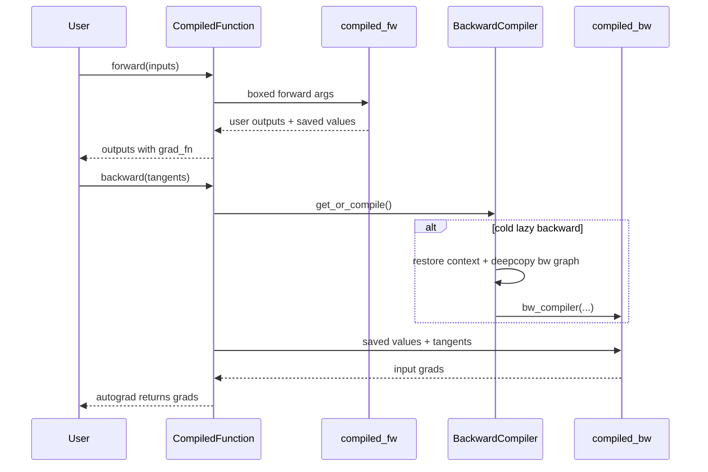
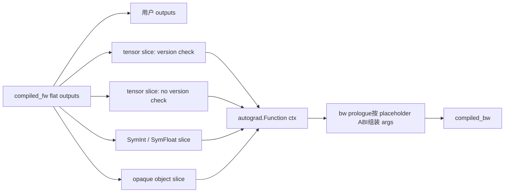

# D02 · AOT Runtime Wrapper 与 Lazy Backward Compile

> 卷别：D · 编译产物、缓存与运行时  
> 固定源码：PyTorch `e8f97c1a6ef8cbcdd0a946606bc1e924e4f07e52`  
> 前置：[[15_inductor_compile_fx_orchestration_analysis]]  
> 后续：[[27_async_compile_workers_and_module_loading_analysis]]  
> 最后更新：2026-07-28

## 1. 为什么两张FX图还需要一个runtime wrapper

AOT partition后的fw/bw只是静态图。用户仍期望普通autograd行为：

- forward返回原始用户pytree；
- 需要梯度的outputs带 `grad_fn`；
- saved tensors在forward保存、backward解包；
- tangents按bw placeholder ABI排列；
- input mutation/view/alias语义恢复；
- autocast、RNG、hooks、retain_graph正确；
- 不支持double backward时给出明确错误。

所以必须有一个运行时桥把“独立fw/bw callables”包装回eager autograd协议。

**核心结论**：fw/bw之间没有FX Node边；真正连接它们的是AOT runtime ABI和动态创建的
`torch.autograd.Function`上下文。

## 2. `CompiledFunction`是连接点

AOT runtime生成 `CompiledFunction(torch.autograd.Function)`，类上保存：

- `compiled_fw`；
- `compiled_bw`或lazy info；
- `ViewAndMutationMeta`；
- saved SymInt数量；
- forward/backward codegen helper。

见 `torch/_functorch/_aot_autograd/runtime_wrappers.py:3499-3511`。

其 `forward`调用生成的forward wrapper并传入 `compiled_fw`；`backward`调用生成的backward
wrapper（`torch/_functorch/_aot_autograd/runtime_wrappers.py:3513-3539`）。

## 3. Saved values怎样跨图

partition把backward需要的值追加到forward outputs。runtime forward wrapper将其拆成：

- tensors saved for backward；
- SymInts saved for backward；
- opaque objects；
- 用户可见outputs；
- mutation/token等runtime outputs。

Tensor通过 `ctx.save_for_backward`，SymInt/opaque值通过ctx或生成wrapper保存。backward再按
预定slice和placeholder顺序组装参数。

这就是跨图依赖：

```text
fw output slot k
→ runtime ctx/saved_tensors
→ bw placeholder slot m
```

而不是 `fw_node.users`指向 `bw_node`。

## 4. 为什么backward lowering可以延迟

AOTDispatch已经trace出bw graph，但如果立刻lower：

- 用户可能从不调用backward；
- first-forward compile latency增加；
- 有些训练路径只在后续才确定runtime上下文；
- compiled autograd可能希望把bw重新trace到更大图中。

因此默认路径可保存 `AutogradLazyBackwardCompileInfo`，其中包含：

- `bw_module`；
- placeholder list；
- tracing context；
- compile context。

设计注释与数据类见
`torch/_functorch/_aot_autograd/runtime_wrappers.py:2444-2464`。

## 5. 第一次 backward怎样触发编译

`_AutogradBackwardCompiler.get_or_compile`：

1. 若已有compiled bw直接返回；
2. 校验lazy info；
3. 恢复saved tracing/compile/autocast context；
4. deepcopy bw module；
5. 调用 `bw_compiler(bw_module_copy, placeholder_list)`；
6. 可选写入cache；
7. 保存并返回compiled bw。

见 `torch/_functorch/_aot_autograd/runtime_wrappers.py:2849-2876` 与
`torch/_functorch/_aot_autograd/runtime_wrappers.py:2878-2907` 与
`torch/_functorch/_aot_autograd/runtime_wrappers.py:2908-2915`。

deepcopy用于避免lowering对保留bw module的修改影响compiled autograd兼容路径。

## 6. Backward runtime的调用

`CompiledFunction._backward_impl`会：

- 根据当前GraphTask判断saved tensors是否仅使用一次；
- 调用 `get_or_compile`；
- 将结果写回类缓存；
- 检查donated-buffer与retain_graph/create_graph约束；
- 最终boxed调用compiled bw并可steal args。

见 `torch/_functorch/_aot_autograd/runtime_wrappers.py:3577-3590` 与
`torch/_functorch/_aot_autograd/runtime_wrappers.py:3592-3617`。

所以“first backward慢”可能不是kernel warmup，而是整张bw图的Inductor lowering/native
compile/load。

## 7. Cache hit为什么改变lazy状态

AOTAutograd cache hit通常已经关联lowered backward，不再需要再次lazy compile。源码仍保留
一种 `CachedAutogradLazyBackwardCompileInfo`，主要是compiled autograd要重新trace已有bw
graph（`torch/_functorch/_aot_autograd/runtime_wrappers.py:2459-2464`）。

因此：

- cold AOT miss：可能fw先编、bw后编；
- AOT hit +深层artifacts可用：fw/bw callable都可装载；
- compiled autograd开启：仍可能需要bw module表示，而不等同于重新native compile。

## 8. `retain_graph`与buffer donation的边界

若backward被认为只运行一次，runtime可以：

- 清saved tensors；
- steal argument list；
- donation/reuse部分buffer；
- 降低峰值内存。

`retain_graph=True`或 `create_graph=True`会破坏“一次消费”假设。runtime因此检查donated
buffers与当前GraphTask keep-graph状态，不满足时抛错而非静默复用。

## 9. Double backward为何不是同一件事

普通AOTAutograd compiled backward当前明确不支持double backward。生成的
`CompiledFunctionBackward.backward`抛出RuntimeError
（`torch/_functorch/_aot_autograd/runtime_wrappers.py:3541-3561`）。

`create_graph=True`要求backward结果继续带grad连接，但这不意味着已有compiled bw自动拥有
可再求导的compiled second backward。

## 10. 时间线



## 11. 源码跟读：forward outputs怎样变成 backward inputs

### 11.1 partition先固定 ABI，runtime只按 metadata切片

AOT partition不是在 forward结束时临时猜哪些值要保存。它已经把 backward需要的值放进
fw graph outputs，并在 `ViewAndMutationMeta`中记录各类 slice。runtime的
`_AutogradSavedState.save_from_forward`据此分别取出：

- 需要 autograd version-counter检查的 tensors；
- 不做该检查的 tensors；
- SymInt/SymFloat；
- opaque custom objects。

tensor slices与view detach规则见
`torch/_functorch/_aot_autograd/runtime_wrappers.py:2615-2645`；动态维标记和
`ctx.save_for_backward`见同文件 `2648-2659`；符号值与opaque对象分别写入
`ctx.symints`、`ctx.opaque_objects`
（`torch/_functorch/_aot_autograd/runtime_wrappers.py:2661-2683`）。



这段实现也解释了为什么“saved tensors只是把 fw tensor对象塞给 bw”不够准确：view是否
detach、是否进行version check、动态维信息以及非Tensor对象的保存通道都属于ABI。

### 11.2 `CompiledFunction`把静态编译产物挂回 eager autograd

生成的 `CompiledFunction`类把 `compiled_fw`、`compiled_bw`、metadata、lazy info和四个
codegen helper保存为类属性
（`torch/_functorch/_aot_autograd/runtime_wrappers.py:3499-3511`）。`forward`调用生成的
`_fwd_fn`，并把 `saved_state.save_from_forward`作为回调传入；`backward`调用生成的
`_bwd_fn`，由它运行bw prologue、真正的 `_backward_impl`与epilogue
（`torch/_functorch/_aot_autograd/runtime_wrappers.py:3513-3539`）。

所以 AOT runtime并不把两张FX图合并成一张。它利用 `torch.autograd.Function`的动态边：
用户输出的 `grad_fn`指向 `CompiledFunctionBackward`，而类属性和 `ctx`保存静态 callable
及本次forward状态。跨图依赖存在于 runtime对象与参数槽位，不存在于
`fw_graph.nodes`/`bw_graph.nodes`之间。

### 11.3 第一次 backward在恢复原上下文后才 lower

`_AutogradBackwardCompiler.get_or_compile`先检查 `compiled_bw`；只有为空且 lazy info类型
正确时才继续（`torch/_functorch/_aot_autograd/runtime_wrappers.py:2848-2876`）。随后它
恢复捕获时的 `TracingContext`、`CompileContext`、AMP状态、metrics与lazy-backward
callbacks，再调用：

```text
bw_compiler(copy.deepcopy(bw_module), placeholder_list)
```

对应实现位于
`torch/_functorch/_aot_autograd/runtime_wrappers.py:2878-2905`。编译完成后可保存cache
entry，并把结果持久化到 `self.compiled_bw`
（`torch/_functorch/_aot_autograd/runtime_wrappers.py:2906-2915`）。

deepcopy的设计约束来自两个消费者：Inductor lowering允许修改它收到的GraphModule；
compiled autograd仍可能需要原始 bw module重新trace更大的 backward。共享同一个可变
GraphModule会让第一次lowering污染第二个消费者。

### 11.4 backward消费策略在编译前决定

`_backward_impl`先读取当前 GraphTask的keep-graph状态，得到
`saved_tensors_use_once`，再调用 `get_or_compile`并把结果写回
`CompiledFunction.compiled_bw`
（`torch/_functorch/_aot_autograd/runtime_wrappers.py:3577-3590`）。若启用了donated
buffer但本次需要保留图，则直接报错；满足约束后boxed调用 bw并允许steal args
（`torch/_functorch/_aot_autograd/runtime_wrappers.py:3592-3617`）。

这形成两个不能交换的决策：

1. 先由 autograd runtime确认saved values是否一次消费；
2. lazy compiler据此准备上下文和可能的donation；
3. 才执行/编译 backward。

double backward另有专门的 `CompiledFunctionBackward`用于保持图连接并在第二次求导时报出
明确错误（`torch/_functorch/_aot_autograd/runtime_wrappers.py:3541-3561`），不是在
`compiled_bw`上静默继续追踪。

## 12. 正确性不变量

- fw saved-output顺序必须与bw placeholder顺序一致；
- tensor/SymInt/opaque对象分别用正确保存机制；
- saved tensor version/alias/mutation语义不能丢；
- lazy compile恢复原compile config、ShapeEnv和tracing context；
- lowering修改deepcopy，不污染需要保留的bw graph；
- retain_graph/create_graph与donation假设一致；
- backward output映射回原inputs，非需梯度位置返回None；
- AMP/RNG状态与eager一致。

## 13. 复杂度

设saved tensors数量 $S_t$、saved symbols $S_s$、bw graph规模 $B$：

- forward runtime保存/拆装至少为 $O(S_t+S_s)$；
- first backward lazy compile额外支付 $K(B)$；
- warm backward支付参数组装、boxed wrapper与kernel执行；
- retain_graph会延长saved storage生命周期；
- donation可降低内存但增加适用条件；
- deepcopy bw graph近似 $O(B)$，通常小于native compile但不是零。

## 14. 常见误解

- **“fw和bw通过save tensors建立FX边。”** save建立runtime ABI，不是跨Graph Node边。
- **“recompute在runtime临时决定重跑forward。”** partition已把选中的forward nodes复制进bw。
- **“forward first call之后全部编译完成。”** lazy bw可能尚未lower。
- **“cache hit一定不需要bw graph。”** compiled autograd retrace等路径仍可能需要表示。
- **“retain_graph只多占显存，不影响编译runtime契约。”** 它还影响steal/donation/清理条件。

## 配套 Demo

本页对应卷级入口 `tools/labs_torch_compile/demo_d_artifact_runtime.py` 的 `aot_wrappers_lazy_backward` 用例。默认以 CUDA 为验收设备：

```powershell
python -B tools\labs_torch_compile\demo_d_artifact_runtime.py `
  --case aot_wrappers_lazy_backward --device cuda `
  --output-dir tools\labs_torch_compile\artifacts\volume_demos\d02
```

先用 `--list --json` 查看用例声明的能力要求。无 CUDA 的机器可把 `--device` 改为 `cpu` 探索设备无关机制；CUDA/Triton/多卡专属用例会返回 `BLOCKED`，且不会执行用例正文。不要把 `BLOCKED` 写成 `PASS`。

重点读取 `summary.json` 与 `aot_wrappers_lazy_backward/result.json`：`status` 区分 `PASS/BLOCKED/FAIL`，`environment` 固化运行环境，`observations` 保存本页机制的实测字段，`artifacts` 指向图代码、日志、trace 或进程证据。`PASS` 只表示该次运行中的断言通过，不外推到其他 PyTorch 版本、shape、dtype 或硬件。

## Related Pages

- [[courses/torch_compile_end_to_end]]
- [[11_aotautograd_joint_forward_backward_graphs_analysis]]
- [[12_saved_tensors_recompute_and_runtime_abi_analysis]]
- [[15_inductor_compile_fx_orchestration_analysis]]
- [[02_compile_stack/06_compile_cache/index]]
- [[20_compiled_autograd_analysis]]
