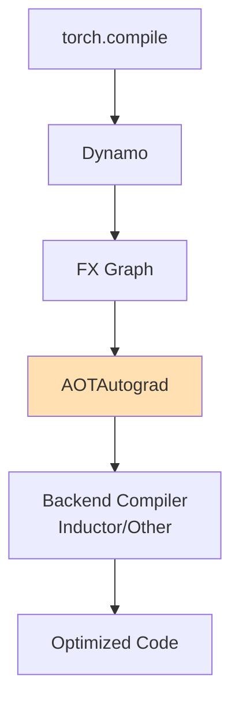
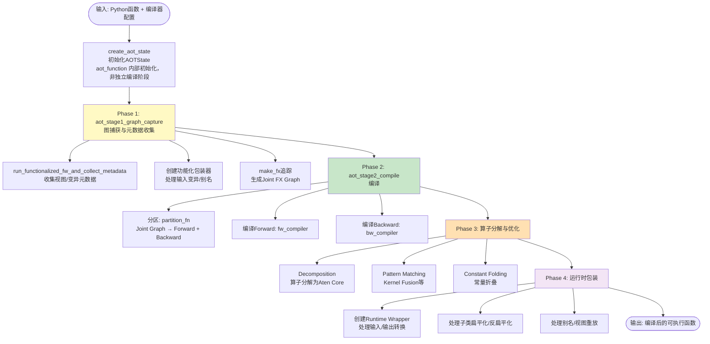
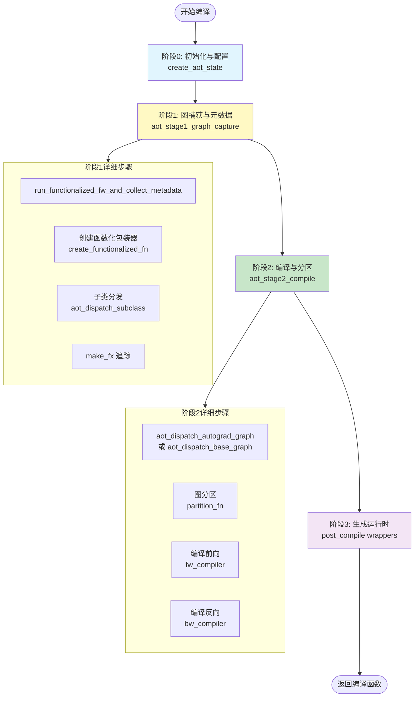
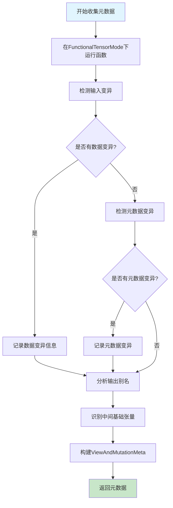
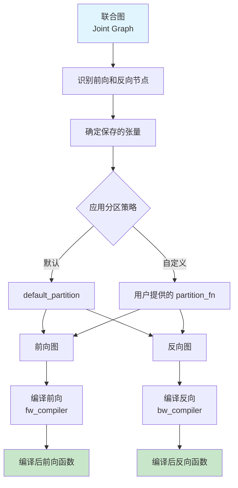
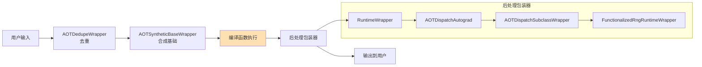
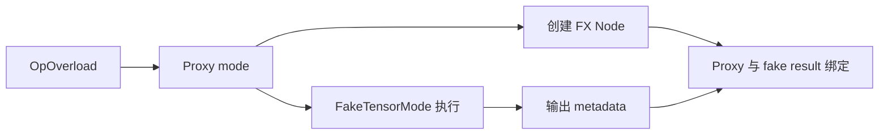
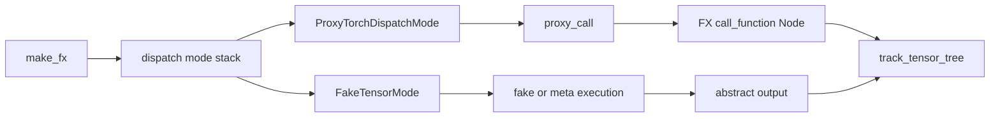

# PyTorch AOTAutograd 模块深度技术分析报告

> **页面角色**：AOTAutograd 全量 reference 与 edge-case 集合，不是历史废页。
> **原始基线**：baseline-unknown；**当前审计基线**：PyTorch `e8f97c1a6ef8cbcdd0a946606bc1e924e4f07e52`。
> **审计状态**：已纳入 Batch 0，但逐结构单元迁移仍有 unresolved；当前机制主线见 [[19_torch_compile_end_to_end/00_pytorch_graph_series_index]]，本页继续承载宽口径源码参考。
> **2026-07-30**：§13 并入 P4 整改删除的 A04 页独有的 ProxyTensor/FakeTensor 机制内容；补 §13.9(状态与所有权)、§13.10(复杂度)、§13.11(与 Dynamo 的关系)——此三节此前漏迁。

## 目录
1. [概述与架构总览](#1-概述与架构总览)
2. [核心工作流程](#2-核心工作流程)
3. [阶段一：图捕获与元数据收集](#3-阶段一图捕获与元数据收集)
4. [阶段二：功能化转换与包装](#4-阶段二功能化转换与包装)
5. [阶段三：分区与编译](#5-阶段三分区与编译)
6. [阶段四：算子分解与图优化](#6-阶段四算子分解与图优化)
7. [阶段五：运行时包装与执行](#7-阶段五运行时包装与执行)
8. [FX Graph 转换操作详解](#8-fx-graph-转换操作详解)
9. [关键数据结构](#9-关键数据结构)
10. [性能优化策略](#10-性能优化策略)
11. [边缘情况与局限性](#11-边缘情况与局限性)
12. [总结与展望](#12-总结与展望)
13. [ProxyTensor 与 FakeTensor：两套抽象执行状态如何协同捕获联合图](#13-proxytensor-与-faketensor两套抽象执行状态如何协同捕获联合图)

### 课程主线与本页分工

本页保留全量reference、历史实现细节与edge cases；需要按当前固定基线建立因果链时，按
以下主线阅读：

| 问题 | 当前课程页 |
|---|---|
| alias、mutation、effect与functionalization前提 | [[graph_effects_alias_mutation_and_order_analysis]] |
| decomposition与规范化顺序 | [[graph_normalization_decomposition_and_functionalization_analysis]] |
| joint图如何抽取fw/bw | [[19_torch_compile_end_to_end/09_aotautograd_joint_forward_backward_graphs]] |
| saved tensors、recompute与runtime ABI | [[19_torch_compile_end_to_end/10_saved_tensors_recompute_and_runtime_abi]] |
| 跨阶段identity与provenance | [[graph_stage_boundaries_identity_and_provenance_analysis]] |

本页未逐段标成current并不等于内容无价值；它表示历史ledger尚未把每个claim、代码块、
表格与实验都闭环到当前基线。

---

## 1. 概述与架构总览

### 1.1 AOTAutograd 简介

AOTAutograd（Ahead-of-Time Autograd）是 PyTorch `torch.compile()` 的核心组件之一，负责在编译时预先计算并分离前向（forward）和反向（backward）计算图。它与传统的即时（JIT）autograd 不同，采用静态图编译方式，能够实现更深度的优化。

### 1.2 在 PyTorch 编译栈中的位置



### 1.3 核心职责

1. **图捕获（Graph Capture）**：使用 `make_fx` 将 Python 函数转换为 FX Graph
2. **功能化（Functionalization）**：将所有操作转换为纯函数式操作
3. **自动微分处理**：分离前向和反向图
4. **元数据收集**：分析输入输出关系、别名、变异等
5. **算子分解（Decomposition）**：将复杂算子分解为基础算子
6. **图优化**：常量折叠、死代码消除等
7. **运行时包装**：生成可在运行时执行的包装代码

### 1.4 完整数据流



---

## 2. 核心工作流程
### 2.1 总体流程概览



### 2.2 主入口点

AOTAutograd 的主要入口是 `aot_function` 和 `aot_module` 函数，位于 `torch/_functorch/aot_autograd.py`：

```python
# torch/_functorch/aot_autograd.py:L770-L900
def aot_function(
    fn: Callable[_P, _R],
    fw_compiler: AOTDispatchCompiler,
    bw_compiler: AOTDispatchCompiler | None = None,
    partition_fn: Callable[..., Any] = default_partition,
    decompositions: dict[OpOverload, Callable[..., Any]] | None = None,
    # ... 更多参数
) -> Callable[_P, Any]:
    """将函数编译为前向和反向图"""
```

### 2.3 三阶段架构
AOTAutograd 采用清晰的三阶段架构：

| 阶段 | 函数 | 职责 |
|------|------|------|
| 阶段1 | `create_aot_state` | 初始化配置、创建 Fake Mode、处理输入 |
| 阶段2 | `aot_stage1_graph_capture` | 图捕获、功能化、元数据收集 |
| 阶段3 | `aot_stage2_compile` | 分区、编译、生成运行时包装 |

---

## 3. 阶段一：图捕获与元数据收集

### 3.1 阶段概述

**主要功能**：通过运行功能化版本的函数来收集关于输入输出关系的元数据，包括别名信息、变异信息、视图关系等。

**设计目标**：
1. 理解函数的输入输出行为
2. 检测输入变异（数据变异和元数据变异）
3. 识别输出别名关系
4. 为后续编译提供必要的元数据

### 3.2 核心代码实现

**主要入口**：`run_functionalized_fw_and_collect_metadata`

```python
# torch/_functorch/_aot_autograd/collect_metadata_analysis.py:L130-L180
def run_functionalized_fw_and_collect_metadata(
    f: Callable[..., Any],
    *,
    flat_args_descs: list[AOTInput],
    keep_input_mutations: bool,
    is_train: bool = False,
    static_input_indices: Optional[list[int]] = None,
    pre_dispatch: bool = False,
) -> Callable[..., ViewAndMutationMeta]:
    """运行功能化函数并收集元数据"""
```

### 3.3 关键数据结构

#### 3.3.1 InputAliasInfo

```python
# torch/_functorch/_aot_autograd/schemas.py:L280-L310
@dataclass(frozen=True)
class InputAliasInfo:
    is_leaf: bool                          # 是否为叶子张量
    mutates_data: bool                     # 是否发生数据变异
    mutates_metadata: bool                 # 是否发生元数据变异
    mutations_hidden_from_autograd: bool   # 变异是否对autograd隐藏
    mutations_under_no_grad_or_inference_mode: bool  # 是否在no_grad下变异
    mutation_inductor_storage_resize: bool # 是否调整存储大小
    mutates_storage_metadata: bool         # 是否变异存储元数据
    requires_grad: bool                   # 是否需要梯度
    keep_input_mutations: bool             # 是否保留输入变异
```

#### 3.3.2 OutputAliasInfo

```python
# torch/_functorch/_aot_autograd/schemas.py:L180-L240
@dataclass(frozen=True)
class OutputAliasInfo:
    output_type: OutputType    # 输出类型（见下方枚举）
    raw_type: type             # 原始类型
    base_idx: Optional[int]   # 基础张量索引
    dynamic_dims: Optional[set[int]]  # 动态维度
    requires_grad: bool        # 是否需要梯度
    view_meta_sequence: Optional[ViewMetaSequence] = None  # 视图元序列
```

#### 3.3.3 OutputType 枚举

```python
# torch/_functorch/_aot_autograd/schemas.py:L70-L130
OutputType = Enum(
    "OutputType",
    (
        "non_alias",                           # 非别名输出
        "alias_of_input",                      # 输入的别名
        "is_input",                            # 就是输入本身
        "alias_of_intermediate_save_as_output",  # 中间结果的别名（保存为输出）
        "alias_of_intermediate",               # 中间结果的别名
        "alias_of_intermediate_base_is_user_output",  # 中间结果基础是用户输出
        "unsafe_view_alias",                   # 不安全视图别名
        "custom_function_view",                # 自定义函数视图
    ),
)
```

### 3.4 元数据收集流程



### 3.5 变异检测算法

元数据收集阶段使用 `FunctionalTensor` 来检测变异：

```python
# 伪代码展示变异检测逻辑
def detect_mutations(flat_args, flat_f_args):
    for arg, f_arg in zip(flat_args, flat_f_args):
        # 检测数据变异
        mutates_data = has_data_mutation(f_arg)
        
        # 检测元数据变异（大小、步长等）
        mutates_metadata = has_metadata_mutation(f_arg, arg)
        
        # 检测存储元数据变异（set_ 操作）
        mutates_storage_metadata = has_metadata_mutation(
            f_arg, arg, check_only_storage_mutation=True
        )
```

---

## 4. 阶段二：功能化转换与包装
### 4.1 阶段概述

**主要功能**：将用户的 Python 函数转换为功能化形式，处理输入变异、别名、子类等复杂情况。

**设计目标**：
1. 将所有副作用（输入变异）转换为纯函数输出
2. 处理张量子类的扁平化和反扁平化
3. 生成可用于 FX 追踪的函数
4. 为后续的自动微分做好准备

### 4.2 核心组件

#### 4.2.1 create_functionalized_fn

```python
# torch/_functorch/_aot_autograd/graph_capture_wrappers.py
def create_functionalized_fn(
    fn: Callable,
    flat_args: list,
    flat_args_descs: list[AOTInput],
    meta: ViewAndMutationMeta,
    aot_config: AOTConfig,
    trace_joint: bool = False,
    joint_fn_handle: Any = None,
) -> tuple[Callable, list, list[AOTInput]]:
    """创建功能化版本的函数"""
```

#### 4.2.2 fn_input_mutations_to_outputs

将输入变异转换为额外的输出：

```python
# 转换前：
def f(x):
    x.mul_(2)        # 输入变异！
    return x + 1

# 转换后：
def f_functional(x):
    x_updated = x.mul(2)   # 功能化操作
    out = x_updated + y
    return x_updated, out    # 额外输出：更新后的输入
```

**实现代码：**

```python
# torch/_functorch/_aot_autograd/graph_capture_wrappers.py
def fn_input_mutations_to_outputs(
    fn: Callable,
    flat_args_descs: list[AOTInput],
    fw_metadata: ViewAndMutationMeta,
    keep_data_input_mutations: bool,
) -> Callable:
    """将输入变异转换为额外输出
    
    例如，如果原始函数执行 x.mul_(2)，
    转换后的函数将返回 (x_updated, original_outputs)
    """
```

### 4.3 包装器链


### 4.4 子类处理

AOTAutograd 支持张量子类（如 `DTensor`、`NestedTensor` 等）：

```python
# torch/_functorch/_aot_autograd/subclass_utils.py
def aot_dispatch_subclass(
    flat_fn: Callable,
    flat_args: list,
    flat_args_descs: list[AOTInput],
    is_joint_structure: bool,
    meta: ViewAndMutationMeta,
    fw_only: Callable,
) -> SubclassTracingInfo:
    """处理张量子类的分发"""
```

子类处理流程：
1. **扁平化**：将子类张量拆分为内部张量
2. **追踪**：在扁平化的张量上执行 FX 追踪
3. **反扁平化**：将结果重新包装为子类

---

## 5. 阶段三：分区与编译
### 5.1 阶段概述

**主要功能**：将联合图（joint graph）分离为前向和反向图，然后分别编译。

**设计目标**：
1. 正确分离前向和反向计算
2. 决定哪些中间结果需要保存用于反向
3. 应用用户自定义的分区策略
4. 编译前向和反向图

### 5.2 分区流程



### 5.3 默认分区器

```python
# torch/_functorch/partitioners.py
def default_partition(
    joint_module: fx.GraphModule,
    _joint_inputs,
    *,
    num_fwd_outputs,
    num_fwd_outputs_saved_for_bw,
    num_bw_outputs=None,
):
    """默认的分区策略
    
    将联合图分离为前向和反向图。
    前向图返回 (用户输出, 保存的激活)
    反向图接收 (保存的激活, 梯度) 并返回输入梯度
    """
```

### 5.4 编译流程

```python
# torch/_functorch/_aot_autograd/graph_compile.py
def aot_stage2_compile(
    aot_state: AOTState,
    aot_graph_capture: AOTGraphCapture,
    partition_fn: Callable,
    fw_compiler: Callable,
    bw_compiler: Optional[Callable] = None,
    inference_compiler: Optional[Callable] = None,
) -> DispatchReturn:
    """阶段2：编译"""
    if bw_compiler is None:
        bw_compiler = fw_compiler
    
    # 设置编译器
    aot_state.aot_config.partition_fn = partition_fn
    aot_state.aot_config.fw_compiler = fw_compiler
    aot_state.aot_config.bw_compiler = bw_compiler
    aot_state.aot_config.inference_compiler = inference_compiler

    if aot_state.needs_autograd and not aot_state.aot_config.pre_dispatch:
        # 需要自动微分
        return aot_stage2_autograd(aot_state, aot_graph_capture)
    else:
        # 仅推理
        return aot_stage2_inference(aot_state, aot_graph_capture)
```

---

## 6. 阶段四：算子分解与图优化
### 6.1 算子分解（Decomposition）

**目的**：将复杂的复合算子（composite operators）分解为更基础的原子算子（ATen Core），以便后端编译器（如 Inductor）能够更好地优化。

**核心原理**：
- 通过 `decomposition_table` 将高层算子映射到实现函数
- 在 FX Graph 上执行替换，将复合算子节点展开为子图
- 保留原始算子的语义，但暴露内部计算细节

**示例分解**：
```python
# 原始算子
aten._softmax(x, dim, half_to_float)

# 分解后
sub_max = x - x.max(dim, keepdim=True)
exp_x = sub_max.exp()
sum_exp = exp_x.sum(dim, keepdim=True)
out = exp_x / sum_exp
```

**代码实现位置**：
```python
# torch/_functorch/_aot_autograd/graph_compile.py
def _apply_tensorify_python_scalars(module: torch.fx.GraphModule) -> None:
    """将Python标量转换为张量"""
    
# torch/_decomp/decompositions.py
@register_decomposition(aten._softmax)
def _softmax(x: Tensor, dim: int, half_to_float: bool) -> Tensor:
    """softmax分解实现"""
```

### 6.2 常量折叠（Constant Folding）

**目的**：在编译时预计算常量表达式，减少运行时的计算开销。

**工作原理**：
1. 识别图中所有输入为常量的节点
2. 在编译时执行这些节点的计算
3. 用计算结果替换原节点
4. 移除成为死代码的节点

**示例**：
```python
# 原始图
def graph(x):
    const1 = torch.tensor([1.0, 2.0, 3.0])  # 常量
    const2 = torch.tensor([4.0, 5.0, 6.0])  # 常量
    sum_const = const1 + const2              # 可折叠
    out = x + sum_const                      # 运行时计算
    return out

# 折叠后
def graph_optimized(x):
    precomputed = torch.tensor([5.0, 7.0, 9.0])  # 编译时计算
    out = x + precomputed
    return out
```

**实现代码**：
```python
# torch/fx/passes/constant_folding.py
class ConstantFolder(torch.fx.Interpreter):
    """常量折叠解释器"""
    
    def run_node(self, n: torch.fx.Node):
        # 检查所有输入是否为常量
        if all(self.is_constant(arg) for arg in n.args):
            # 执行节点计算
            result = super().run_node(n)
            # 用常量替换节点
            return self.add_constant(result)
        return super().run_node(n)
```

### 6.3 死代码消除（Dead Code Elimination, DCE）

**目的**：移除图中不产生任何输出或有副作用的节点，减少不必要的计算。

**工作原理**：
1. 从图的输出节点开始反向遍历
2. 标记所有可达的节点为"存活"
3. 移除所有未标记的节点
4. 重复直到没有更多节点可移除

**代码实现**：
```python
# torch/fx/graph.py
def eliminate_dead_code(self):
    """死代码消除"""
    # 找到所有存活节点
    live_nodes = set()
    for node in reversed(self.nodes):
        if node.op == 'output' or any(user in live_nodes for user in node.users):
            live_nodes.add(node)
    
    # 移除死节点
    for node in list(self.nodes):
        if node not in live_nodes and node.op != 'placeholder':
            self.erase_node(node)
```

### 6.4 模式匹配与Kernel Fusion

**目的**：识别图中可融合的计算模式，合并多个小kernel为一个大kernel，减少kernel启动开销和显存带宽压力。

**常见融合模式**：

| 模式 | 示例 | 融合后 |
|-----|------|-------|
| Pointwise + Pointwise | `add(mul(x, y), z)` | `add_mul_fused(x, y, z)` |
| Reduction + Pointwise | `sum(x) + y` | `sum_add_fused(x, y)` |
| Matmul + Bias | `add(mm(x, w), b)` | `linear(x, w, b)` |

**实现机制**：
```python
# torch/_inductor/pattern_matcher.py
class PatternMatcher:
    """模式匹配器"""
    
    def register_pattern(self, pattern_fn, target_fn):
        """注册融合模式"""
        pattern_graph = self.capture_pattern(pattern_fn)
        self.patterns.append((pattern_graph, target_fn))
    
    def match_and_fuse(self, graph):
        """匹配并融合"""
        for node in graph.nodes:
            for pattern, target in self.patterns:
                if self.match(node, pattern):
                    self.fuse(node, pattern, target)
```

---

## 7. 阶段五：运行时包装与执行
### 7.1 阶段概述

**主要功能**：创建运行时包装器，处理输入准备、输出处理和变异应用。

**设计目标**：
1. 准备编译函数的输入
2. 执行编译后的前向/反向图
3. 处理输出别名、变异等复杂情况
4. 管理张量子类的包装/解包

### 7.2 运行时包装器链



### 7.3 RuntimeWrapper 实现

```python
# torch/_functorch/_aot_autograd/runtime_wrappers.py
def _create_runtime_wrapper(
    compiled_fn: Callable[..., Any],
    *,
    runtime_metadata: ViewAndMutationMeta,
    indices_of_inps_to_detach: list[int],
    trace_joint: bool,
    keep_input_mutations: bool,
    disable_amp: bool,
) -> Callable[..., Any]:
    """创建运行时包装器
    
    处理以下任务：
    1. 分离需要detach的输入
    2. 处理输出别名（从基础张量重新生成视图）
    3. 应用输入变异
    4. 处理随机数生成器状态
    """
```

### 7.4 输出处理器
AOTAutograd 使用处理器映射来处理不同类型的输出：

```python
# torch/_functorch/_aot_autograd/runtime_wrappers.py
_HANDLER_MAP = {
    OutputType.non_alias: NoopAliasHandler,                              # 非别名：直接返回
    OutputType.unsafe_view_alias: NoopAliasHandler,                      # 不安全视图
    OutputType.custom_function_view: NoopAliasHandler,                 # 自定义函数视图
    OutputType.alias_of_input: AliasOfInputHandler,                     # 输入的别名
    OutputType.is_input: IsInputHandler,                                # 就是输入本身
    OutputType.alias_of_intermediate: AliasOfIntermediateHandler,       # 中间结果的别名
    OutputType.alias_of_intermediate_save_as_output: AliasOfIntermediateHandler,
    OutputType.alias_of_intermediate_base_is_user_output: AliasOfIntermediateHandler,
}
```

---

## 8. FX Graph 转换操作详解

### 8.1 转换操作总览

AOTAutograd 在编译过程中对 FX Graph 执行多种转换：

| 转换类型 | 目的 | 关键代码位置 |
|---------|------|-------------|
| 输入变异转换 | 将输入变异转为额外输出 | `fn_input_mutations_to_outputs` |
| 功能化转换 | 移除所有副作用 | `create_functionalized_fn` |
| 子类解包 | 展开张量子类 | `aot_dispatch_subclass` |
| Token 处理 | 处理副作用 Token | `handle_effect_tokens_fn` |
| 去重 | 移除重复输入 | `AOTDedupeWrapper` |
| 合成基础 | 处理别名输入 | `AOTSyntheticBaseWrapper` |

### 8.2 输入变异转换详解

**转换前 Graph：**
```python
# 原始函数
def f(x, y):
    x.mul_(2)        # 输入变异！
    return x + y
```

**转换后 Graph：**
```python
# 功能化版本
def f_functional(x, y):
    x_updated = x.mul(2)   # 功能化操作
    out = x_updated + y
    return x_updated, out    # 额外输出：更新后的输入
```

**实现代码：**

```python
# torch/_functorch/_aot_autograd/graph_capture_wrappers.py
def fn_input_mutations_to_outputs(
    fn: Callable,
    flat_args_descs: list[AOTInput],
    fw_metadata: ViewAndMutationMeta,
    keep_data_input_mutations: bool,
) -> Callable:
    """将输入变异转换为额外输出
    
    例如，如果原始函数执行 x.mul_(2)，
    转换后的函数将返回 (x_updated, original_outputs)
    """
```

### 8.3 功能化转换详解

功能化转换将所有副作用转换为纯函数操作：

```python
# torch/_functorch/_aot_autograd/graph_capture_wrappers.py
def create_functionalized_fn(
    fn: Callable,
    flat_args: list,
    flat_args_descs: list[AOTInput],
    meta: ViewAndMutationMeta,
    aot_config: AOTConfig,
    trace_joint: bool = False,
    joint_fn_handle: Any = None,
) -> tuple[Callable, list, list[AOTInput]]:
    """创建功能化版本的函数
    
    1. 将输入转换为 FunctionalTensor
    2. 运行函数
    3. 同步功能化状态
    4. 处理随机数生成器状态
    """
```

### 8.4 子类解包详解

```python
# torch/_functorch/_aot_autograd/subclass_utils.py
def aot_dispatch_subclass(
    flat_fn: Callable,
    flat_args: list,
    flat_args_descs: list[AOTInput],
    is_joint_structure: bool,
    meta: ViewAndMutationMeta,
    fw_only: Callable,
) -> SubclassTracingInfo:
    """处理张量子类的分发
    
    对于每个输入：
    - 如果是子类：扁平化为内部张量
    - 如果不是子类：保持不变
    
    对于输出：
    - 重新包装为子类
    """
```

**转换示例：**

```python
# 假设 TwoTensor 是一个包含两个内部张量的子类
class TwoTensor(torch.Tensor):
    def __tensor_flatten__(self):
        return ["a", "b"], None
    
    @staticmethod
    def __tensor_unflatten__(inner_tensors, meta, outer_size, outer_stride):
        return TwoTensor(inner_tensors["a"], inner_tensors["b"])

# 转换前输入：[TwoTensor(t1, t2)]
# 转换后输入：[t1, t2]  # 扁平化为两个张量

# 输出时重新包装
```

---

## 9. 关键数据结构
### 9.1 AOTConfig

```python
# torch/_functorch/_aot_autograd/schemas.py:L400-L450
@dataclass
class AOTConfig:
    """AOTAutograd 配置"""
    fw_compiler: Optional[Callable]           # 前向编译器
    bw_compiler: Optional[Callable]         # 反向编译器
    inference_compiler: Optional[Callable]  # 推理编译器
    partition_fn: Optional[Callable]        # 分区函数
    decompositions: dict[OpOverload, Callable]  # 分解表
    num_params_buffers: int = 0             # 参数和缓冲区数量
    aot_id: int = 0                         # AOT 编译ID
    keep_inference_input_mutations: bool = False  # 保留推理输入变异
    # ... 更多配置
```

### 9.2 ViewAndMutationMeta

```python
# torch/_functorch/_aot_autograd/schemas.py:L500-L600
@dataclass(eq=False)
class ViewAndMutationMeta:
    """视图和变异元数据
    
    这是 AOTAutograd 中最重要的数据结构之一，
    包含了编译和运行时所需的所有元数据。
    """
    input_info: list[InputAliasInfo]           # 输入信息
    output_info: list[OutputAliasInfo]          # 输出信息
    num_intermediate_bases: int                 # 中间基础数量
    keep_input_mutations: bool                  # 保留输入变异
    traced_tangents: list[Any]                  # 追踪的切线
    subclass_inp_meta: list[Union[PlainTensorMeta, SubclassCreationMeta]]  # 子类输入元数据
    subclass_fw_graph_out_meta: list[Union[PlainTensorMeta, SubclassCreationMeta]]  # 子类输出元数据
    # ... 更多字段
```

### 9.3 AOTState
```python
# torch/_functorch/_aot_autograd/schemas.py:L650-L680
@dataclass
class AOTState:
    """AOTAutograd 状态
    
    贯穿整个编译过程的状态对象。
    """
    needs_autograd: bool                        # 是否需要自动微分
    flat_args: FakifiedFlatArgs                 # 扁平化的参数
    flat_args_descs: list[AOTInput]              # 参数描述
    fw_metadata: ViewAndMutationMeta            # 前向元数据
    aot_config: AOTConfig                        # AOT配置
    stack: contextlib.ExitStack                  # 上下文栈
    fake_mode: FakeTensorMode                    # Fake Tensor模式
```

---

## 10. 性能优化策略

### 10.1 激活检查点与重计算

```python
# torch/_functorch/partitioners.py
def default_partition(
    joint_module: fx.GraphModule,
    _joint_inputs,
    *,
    num_fwd_outputs,
    num_fwd_outputs_saved_for_bw,
    num_bw_outputs=None,
):
    """默认分区策略
    
    决定哪些中间结果需要保存，哪些可以重新计算。
    这是激活检查点的核心。
    """
```

### 10.2 视图重放优化

```python
# torch/_functorch/_aot_autograd/functional_utils.py
def gen_alias_from_base(
    aliased_base_tensor: Tensor,
    target_meta_tensor: Tensor,
    target_requires_grad: bool,
    target_view_meta_sequence: ViewMetaSequence | None = None,
    *,
    replay_views: bool,
) -> Tensor:
    """从基础张量生成别名
    
    使用视图重放（view replay）或 as_strided 来高效地
    从基础张量重新创建视图张量。
    
    视图重放比 as_strided 更高效，因为它可以保留
    原始的视图操作链（如 select、slice 等）。
    """
```

### 10.3 静态输入优化

```python
# torch/_functorch/aot_autograd.py:L600-L650
# 静态输入（如模型参数）可以被特殊处理
static_input_indices: list[int]  # 标记哪些输入是静态的
```

静态输入的优化包括：
1. 假设形状不变，避免重新编译
2. 在 CUDA Graph 捕获时作为静态输入处理
3. 内存规划优化

### 10.4 缓存策略
```python
# torch/_functorch/_aot_autograd/autograd_cache.py
class AOTAutogradCache:
    """AOTAutograd 缓存系统
    
    缓存编译结果，避免重复编译相同的图。
    """
    
    @staticmethod
    def make_entry(
        compiled_fw_func: Callable,
        compiled_bw_func: Optional[Callable],
        # ... 更多参数
    ) -> GenericAOTAutogradResult:
        """创建缓存条目"""
```

---

## 11. 边缘情况与局限性

### 11.1 输入别名处理

当多个输入互为别名时，AOTAutograd 需要特殊处理：

```python
# 问题示例
x = torch.randn(5)
y = x.view(-1)  # y 是 x 的别名

# 如果函数中修改了 x，y 也应该看到变化
# AOTAutograd 需要确保这一点
```

**解决方案**：创建 "synthetic base"

```python
# torch/_functorch/_aot_autograd/input_output_analysis.py
def create_synthetic_base_metadata(
    flat_args: list[Tensor],
    fw_metadata: ViewAndMutationMeta,
) -> tuple[list[Tensor], ViewAndMutationMeta]:
    """创建合成基础张量
    
    当多个输入互为别名时，创建一个共享的基础张量，
    然后在函数内部重新生成原始视图。
    """
```

### 11.2 输出别名限制

```python
# 问题情况
# 当输出是中间结果的别名时，需要特殊处理
# 特别是当多个输出共享同一个 ._base 时

# 限制：目前不支持子类输出别名其他子类输出
assert not req_subclass_dispatch or fw_metadata.num_intermediate_bases == 0, \
    "子类输入不支持输出别名"
```

### 11.3 自定义 Autograd 函数

自定义 `torch.autograd.Function` 有一些限制：

```python
# 问题：自定义 autograd 函数的 backward 无法被追踪
class MyFunction(torch.autograd.Function):
    @staticmethod
    def forward(ctx, x):
        return x * 2
    
    @staticmethod
    def backward(ctx, grad_output):
        return grad_output * 2

# AOTAutograd 可以将 forward 编译到图中，
# 但 backward 需要特殊处理
```

**处理方式**：

```python
# torch/_functorch/_aot_autograd/collect_metadata_analysis.py
def _is_result_of_custom_autograd_fn(grad_fn) -> bool:
    """检测结果是否来自自定义 autograd 函数"""
    # 检查 grad_fn 类型
    if type(grad_fn).__name__ == "CppFunction":
        return True
    if isinstance(grad_fn, torch.autograd.function.BackwardCFunction):
        return True
    return False
```

### 11.4 元数据变异限制
某些元数据变异操作在导出模式下受限：

```python
# torch/_functorch/aot_autograd.py:L1000-L1020
if aot_config.is_export:
    # aot_export: 暂时禁止输入元数据变异
    if len([x for x in fw_metadata.input_info if x.mutates_metadata]) != 0:
        raise RuntimeError(
            """发现输入收到元数据变异，例如 .resize_() 或 .transpose_() 调用。
            这在 aot_export 工作流中当前被禁止。"""
        )
```

## 12. 总结与展望

### 12.1 核心贡献

AOTAutograd 在 PyTorch 编译栈中提供了以下核心功能：

1. **静态图捕获**：使用 `make_fx` 将动态 PyTorch 代码转换为静态 FX Graph
2. **自动微分分离**：在编译时分离前向和反向图
3. **功能化转换**：将所有副作用转换为纯函数操作
4. **子类支持**：支持各种张量子类（DTensor、NestedTensor 等）
5. **优化传递**：为后续编译器（如 Inductor）提供优化后的图

### 12.2 架构亮点

1. **清晰的阶段分离**：图捕获 → 功能化 → 分区 → 编译 → 运行时
2. **丰富的元数据**：`ViewAndMutationMeta` 提供了完整的输入输出关系信息
3. **可扩展的包装器系统**：通过 `CompilerWrapper` 支持各种转换
4. **灵活的输出处理器**：通过 `_HANDLER_MAP` 支持多种输出别名类型

### 12.3 未来发展方向

1. **增强的激活检查点**：更智能的重计算策略
2. **动态形状优化**：更好地处理动态形状场景
3. **分布式训练支持**：与 FSDP、DDP 的更深集成
4. **调试工具**：提供更详细的编译日志和可视化
5. **性能优化**：减少编译时间，优化运行时开销

### 12.4 关键文件索引
| 文件路径 | 功能描述 |
|---------|---------|
| `torch/_functorch/aot_autograd.py` | 主入口，`aot_function`，`aot_module` |
| `torch/_functorch/_aot_autograd/schemas.py` | 核心数据结构定义 |
| `torch/_functorch/_aot_autograd/collect_metadata_analysis.py` | 元数据收集 |
| `torch/_functorch/_aot_autograd/graph_capture_wrappers.py` | 图捕获包装器 |
| `torch/_functorch/_aot_autograd/graph_capture.py` | 图捕获主逻辑 |
| `torch/_functorch/_aot_autograd/graph_compile.py` | 编译逻辑 |
| `torch/_functorch/_aot_autograd/runtime_wrappers.py` | 运行时包装器 |
| `torch/_functorch/_aot_autograd/functional_utils.py` | 功能化工具 |
| `torch/_functorch/_aot_autograd/subclass_utils.py` | 子类处理 |
| `torch/_functorch/partitioners.py` | 分区策略 |

---

## 13. ProxyTensor 与 FakeTensor：两套抽象执行状态如何协同捕获联合图

> 本节内容原属 P4 知识库整改被删除的 A 卷回顾页(`19_torch_compile_end_to_end/a04_dispatch_modes_proxy_tensor_and_fake_tensor_analysis.md`)。它讲的是本页 §3"图捕获"背后实际使用的 dispatch-mode 机制——本页此前只把 `FakeTensorMode` 作为一个字段提及(§9),未展开 ProxyTensor/FakeTensor 为什么分成两套状态、`track_tensor_tree` 如何绑定、以及 `__torch_dispatch__` 层拦截的完整链路。[[pytorch_dispatcher_analysis]] 只在 §10.2 给出 `__torch_dispatch__`/`TorchDispatchMode` 的入门介绍,不含 ProxyTensor/FakeTensor 机制本身,故此处逐字迁入。

### 13.1 四个名字解决四类问题

编译资料常把这些机制统称为"fake/proxy tracing"：

- `__torch_function__`
- `__torch_dispatch__` / `TorchDispatchMode`
- `ProxyTensor` / `ProxyTorchDispatchMode`
- `FakeTensor` / `FakeTensorMode`

它们实际位于不同抽象层：

| 机制 | 拦截对象 | 主要目的 |
|---|---|---|
| `__torch_function__` | public Python API | Tensor-like Python 类型覆盖 |
| `__torch_dispatch__` | dispatcher-visible operator | Tensor subclass/底层 operator 变换 |
| `TorchDispatchMode` | 动态作用域内 operator | 不包装所有输入也能全局拦截 |
| Proxy | operator call 与参数关系 | 创建 FX Node、追踪数据依赖 |
| FakeTensor | 无真实数据的 Tensor metadata | 推导 shape/dtype/device/stride 等属性 |

**核心结论**：Proxy 回答"这次 operator 在图里是什么"，FakeTensor 回答"该 operator 的
输出具有什么 Tensor 属性"。记录关系与计算属性是两种状态，不能由同一个对象隐式承担。

#### `__torch_function__`：public API override

`handle_torch_function()`先收集相关参数中的 overloaded types，再处理 mode 或逐个调用
对象的 `__torch_function__`
（`torch/overrides.py:1722-1745`、`torch/overrides.py:1763-1785`）。

它保留 public API identity，所以适合：

- ndarray-like/custom Tensor Python 类型；
- 希望按 `torch.add`、`torch.nn.functional.*` 等 API 覆盖行为；
- API 层类型协商。

但 public API 不一定与最终 ATen overload 一一对应；Python composite 函数可能展开成
多个 operator。因此编译器需要更低层的 operator interception。

#### `TorchDispatchMode`：动态作用域

`TorchDispatchMode`允许在 `with mode:`作用域里覆盖所有可 dispatch operator，而不要求
把 inputs 包成 Tensor subclass。源码列出的典型用途包括：

- factory function 没有 Tensor input；
- 记录全部中间计算；
- 显式控制多个 subclass/mode 的执行顺序。

见 `torch/utils/_python_dispatch.py:72-100`。

Modes 组成 stack；mode 内再次调用 PyTorch API 默认继续到下一 mode，而不是自动递归当前
mode。`supports_higher_order_operators`默认 false，说明普通 operator interception 不自动
获得 HOP 语义（同文件 `:102-115`）。

**为什么需要 mode，而不只用 Tensor subclass**：factory op 如 `torch.empty()`没有现成 Tensor argument，subclass 的
`__torch_dispatch__`无法由输入触发。动态 mode 让基础设施在整个作用域拦截此类调用。

### 13.2 FakeTensor：没有数据，不等于只有 meta device

FakeTensor以 meta tensor 为计算基础，但额外保存 `fake_device`，从而模拟真实 device
propagation；普通 meta tensor 本身不能表达"若真实执行会在 CUDA/CPU"
（`torch/_subclasses/fake_tensor.py:834-846`）。

FakeTensor还可以保存：

- 所属 FakeTensorMode；
- constant/real tensor 旁路信息；
- symbolic scalar memo；
- 原 Python type 与 dispatch keys。

对应字段见同文件 `:843-870`。

#### FakeTensorMode 的 owner 状态

FakeTensorMode持有：

- dispatch cache/hit/miss/bypass；
- epoch；
- static-shape policy；
- `ShapeEnv`；
- 是否允许 fallback kernel/non-fake input；
- nested tensor id 状态。

见 `torch/_subclasses/fake_tensor.py:1526-1549` 和
`torch/_subclasses/fake_tensor.py:1550-1556`。

每次 retrace 同一个 mode 要推进 epoch，避免错误复用 unbacked-symbol memo
（同文件 `:1531-1546`）。所以 FakeTensor 不是无状态的"空 Tensor"；mode identity 和
epoch 会影响符号属性的安全复用。

### 13.3 ProxyTensor：真实/fake result 与 Proxy 的配对

Proxy tracing 需要同时维护：

```text
inner result
↔ FX Proxy
↔ tracer
↔ constant/meta/unbacked bindings
```

`track_tensor_tree()`对结构化 result 逐项把 Tensor/SymInt 等结果绑定到 Proxy，并把
metadata写入 Proxy；unbacked bindings 只在最外层设置一次，避免一个 symbol 对应多次
binding（`torch/fx/experimental/proxy_tensor.py:934-954`、
`torch/fx/experimental/proxy_tensor.py:956-971`）。

这说明"输出是 tuple"时也不是一个 Proxy 简单包住全部 runtime objects；树结构、
getitem/projection 和 symbol binding 都需要稳定映射。

#### ProxyTorchDispatchMode 的执行链

构造 Proxy mode 时保存 tracer、tracing mode、pre-dispatch policy、decomposition table
和 HOP subgraph cache
（`torch/fx/experimental/proxy_tensor.py:2102-2126`、
`torch/fx/experimental/proxy_tensor.py:2127-2142`）。

其 `__torch_dispatch__()`接收 `OpOverload`、args/kwargs，并进入 `proxy_call()`：

```text
dispatcher 命中 Proxy mode
  → ProxyTorchDispatchMode.__torch_dispatch__
  → proxy_call
  → 根据 decomposition/constant/data-dependent policy 处理
  → 创建 FX Proxy/Node
  → 执行 fake/inner operator取得 metadata result
  → track_tensor_tree 绑定 result 与 proxy
```

入口见 `torch/fx/experimental/proxy_tensor.py:2147-2161`。

### 13.4 为什么 Proxy 和 Fake 常一起出现

只使用 Proxy：

- 能记录 `aten.add(x, y)`；
- 但不一定知道输出 shape/stride/device；
- 后续依赖这些属性的 Python/meta 逻辑无法继续。

只使用 FakeTensor：

- 能在不分配真实数据的情况下执行 meta kernels并得到输出属性；
- 但没有 FX Proxy 就没有持久化 program dependency graph。

组合后：



**设计原因**：图记录和抽象执行可以独立演进。Proxy tracer关心 program representation；
FakeTensorMode关心 operator semantics、symbolic shapes 和 device propagation。

### 13.5 Decomposition 放在哪里

ProxyTorchDispatchMode持有 decomposition table
（`torch/fx/experimental/proxy_tensor.py:2115-2136`）。当某 operator有 decomposition，
tracer可以记录更基础的 operator序列；没有或不应分解时则记录原 target。

decomposition不是"FakeTensor算 shape"的同义词：

- decomposition 改变图的 operator粒度；
- fake/meta execution 推导每个 operator 的抽象结果；
- functionalization 改变 mutation/view 表达；
- Proxy 负责把最终选择记录为图。

顺序不同会产生不同 target、alias 表达和 pattern surface。

### 13.6 数据相关 operator 的边界

FakeTensor没有真实 data。若输出 shape/value取决于 Tensor 内容，例如某些 `nonzero`、
`.item()`路径，系统必须：

- 创建 unbacked symbolic value；
- 使用 memo/constraint；
- graph break；
- 或在允许且安全时 fallback 到真实 kernel。

Proxy mode构造参数包括 `_error_on_data_dependent_ops`
（`torch/fx/experimental/proxy_tensor.py:2108-2123`），说明是否拒绝这类操作是显式策略，
不是所有 tracing mode 的统一行为。

### 13.7 源码跟读：`make_fx` 如何协同 Proxy 与 Fake 两套状态

Proxy 和 Fake 同时出现不是重复 tracing。Proxy 回答"这次 operator 在 FX 图中依赖谁"，
Fake 回答"若不运行真实 data kernel，输出的 shape、stride、dtype 和 device 是什么"。
`make_fx` 把两者放进同一动态作用域，再把两类结果绑定到同一输出树。



#### mode 是线程动态作用域，不要求预先包装所有输入

`TorchDispatchMode` 的注释说明 mode 在 operator dispatch 时生效，尤其能拦截没有 Tensor
输入的 factory function；多个 mode 以栈形式组合
（`torch/utils/_python_dispatch.py:72-100`）。进入 mode 时会更新相关 flags 并 push 到
mode stack（`torch/utils/_python_dispatch.py:146-175`），退出时恢复原状态
（`torch/utils/_python_dispatch.py:177-184`）。

因此，mode 的 owner 是当前动态执行上下文，不是某个 FX Node。这个设计让 tracing
能够看到 `torch.ones(...)` 一类尚无可包装输入的调用，也意味着嵌套 mode 的入栈顺序会
改变实际拦截链。

#### FakeTensorMode 维护抽象执行状态

FakeTensorMode 持有 cache、cache epoch 与相关状态
（`torch/_subclasses/fake_tensor.py:1526-1548`）。Fake Tensor 的
`__torch_dispatch__` 把 operator 转回所属 mode 的 dispatch
（`torch/_subclasses/fake_tensor.py:1692-1708`）；mode 再选择 meta handler、
直接实现或 cache 路径（`torch/_subclasses/fake_tensor.py:2464-2492`）。

这里的产物仍然是可供 Python 代码使用的 Tensor-like abstract value，而不是 FX Node。
它保留足够的 tensor metadata 让后续 operator 继续传播，但没有真实设备 data 可供任意
data-dependent 分支读取。

#### ProxyTorchDispatchMode 维护图关系与 tracing 策略

Proxy mode 构造时持有 tracer、decomposition table、是否允许 data-dependent operator
等策略（`torch/fx/experimental/proxy_tensor.py:2108-2137`）。它的
`__torch_dispatch__` 进入 `proxy_call`；进入 mode 时还会把自己注册为 infra mode
（`torch/fx/experimental/proxy_tensor.py:2148-2167`）。

`proxy_call` 首先校验类型并尝试 decomposition
（`torch/fx/experimental/proxy_tensor.py:1278-1308`），然后从输入提取 proxies，
处理 data-dependent 策略与相应错误
（`torch/fx/experimental/proxy_tensor.py:1334-1361`）。这说明 decomposition 发生在
图节点最终落定前；同一 eager operator 在不同 decomposition policy 下可以得到不同
FX surface。

#### 一个 operator 为什么既创建 Node 又执行一次

在常规路径，`proxy_call` 先用输入 proxies 创建 FX `call_function` proxy，随后用去掉
proxy 外壳的 inner/fake args 真正调用 operator
（`torch/fx/experimental/proxy_tensor.py:1417-1426`）。这里的"执行"通常落到
FakeTensorMode/meta kernel，不是用用户真实数据跑 backend kernel。

获得 abstract output 后，源码用 `track_tensor_tree` 把 output pytree 中的 Tensor、
Proxy 与 metadata 逐叶绑定，再返回 real/fake result 给正在执行的 Python 程序
（`torch/fx/experimental/proxy_tensor.py:1490-1498`）。
`track_tensor_tree` 还会记录 unbacked symbol bindings，并为 Tensor 叶子建立
Tensor/Proxy/meta 对应关系（`torch/fx/experimental/proxy_tensor.py:934-965`）。

所以一次 trace operator 有两个同步产物：

- FX Node/Proxy：供图中的后续使用表达 data dependency；
- Fake Tensor：供原 Python 继续执行并计算后续 metadata。

只有 Node 没有 Fake value，下一步 Python 无法读取 `shape` 等抽象属性；只有 Fake value
没有 Proxy，最终 Graph 不知道这个值由哪个 operator 定义。

分层设计的原因由调用链直接给出：mode stack 负责拦截，Proxy tracer 负责 IR identity，
Fake mode 负责 abstract semantics，ShapeEnv/metadata 负责符号约束；它们的生命周期和
失败模式不同，合成一个"大 tracer 对象"反而会模糊所有权。

#### 失败边界

- decomposition 不可用时，可能保留原 operator 或进入特定 fallback；
- data-dependent operator 不能从 Fake data 读取真实值，会按 policy 报错或产生符号；
- output pytree 无法与 proxy 对齐时，`track_tensor_tree` 不能建立完整关系；
- mode nesting 或跨 trace 复用状态错误，会让 operator 被错误层拦截或 metadata 串线。

因此，分析 Proxy/Fake bug 时应先问失败发生在"拦截、建 Node、abstract execution、
output binding"哪一步，而不是笼统归因于 `__torch_dispatch__`。

### 13.8 常见误解

| 误解 | 修正 |
|---|---|
| FakeTensor 就是 meta Tensor | 它还模拟 fake device、ShapeEnv、mode/cache 等状态 |
| ProxyTensor 自己计算 shape | shape/dtype/device 通常来自 fake/meta execution |
| `__torch_function__`和 `__torch_dispatch__`相同 | 前者偏 public API，后者偏 operator dispatcher |
| TorchDispatchMode 必须包装 inputs | mode 是动态作用域，能拦截 factory op |
| Dynamo 就是 ProxyTorchDispatchMode | Dynamo还解释 Python bytecode、objects、guards 和 resume |

### 13.9 状态与所有权

| 状态 | Owner | 生命周期 |
|---|---|---|
| mode stack | thread-local dispatch infrastructure | 动态作用域 |
| fake tensor memo/cache/ShapeEnv | FakeTensorMode | 一次或多次相关 trace |
| proxy slot | traced value + tracer relation | 当前 trace |
| FX Graph/Node | tracer/GraphModule | trace 产物 |
| constant real value | FakeTensor/Proxy metadata | 条件允许时 |
| unbacked symbol bindings | ShapeEnv/proxy metadata | symbolic trace 与 guards/runtime asserts |

跨 trace 复用 FakeTensorMode 时必须尊重 epoch；跨 Graph 也不能按 Proxy object identity
推断值相同。

### 13.10 复杂度

设一次 operator 的 pytree 输出有 \(m\) 个 leaves：

- mode stack dispatch 深度与激活 modes/subclasses 数相关；
- fake/meta kernel 成本通常远低于真实 Tensor data kernel，但仍取决于 operator metadata
  算法，不保证常数；
- `track_tensor_tree`遍历输出结构为 \(O(m)\)；
- decomposition展开为 \(d\) 个 operator 时，trace/node/meta 成本按 \(d\) 增长；
- dispatch cache 可以跳过重复 fake dispatch构造，但 key 生成与 cache bypass 仍有成本。

不能从"没有真实数据"推断 trace 免费；复杂 shape algebra、decomposition 和 Python
object modeling 仍可能主导 compile latency。

### 13.11 与 Dynamo 的关系

Dynamo不是用 ProxyTensor替代 Python symbolic interpreter：

- InstructionTranslator建模 Python stack/locals/control flow；
- VariableTracker建模 Python/Tensor values；
- OutputGraph/SubgraphTracer生成 FX；
- FakeTensor为 TensorVariable提供 metadata execution；
- operator-level modes处理 decomposition/functionalization 等变换。

也就是说，Dynamo位于更高的 Python program 层，但会复用较低层的 FakeTensor/FX 工具。
把 Dynamo 简化成"一个 TorchDispatchMode"会丢失 graph break、resume bytecode、guards
和 Python object state。

## 附录

### A. 术语表

| 术语 | 解释 |
|-----|------|
| AOT | Ahead-of-Time，编译时 |
| FX Graph | PyTorch 的中间表示（IR） |
| Functionalization | 功能化，将副作用转换为纯函数 |
| Joint Graph | 联合图，包含前向和反向的完整图 |
| Partition | 分区，将联合图分为前向和反向 |
| ViewAndMutationMeta | 视图和变异元数据 |
| Synthetic Base | 合成基础，处理别名输入的技术 |
| Decomposition | 算子分解，将复合算子分解为基础算子 |
| Constant Folding | 常量折叠，编译时预计算常量表达式 |
| Kernel Fusion | 核函数融合，合并多个小kernel为一个大kernel |

### B. 参考资料

1. [PyTorch 官方文档 - torch.compile](https://pytorch.org/docs/stable/generated/torch.compile.html)
2. [PyTorch 开发者文档 - AOTAutograd](https://pytorch.org/docs/stable/functorch.html)
3. [PyTorch GitHub 仓库](https://github.com/pytorch/pytorch)

---

*报告生成日期：2026-04-09*
*基于 PyTorch 源代码分析*

## Related Pages

- [[19_torch_compile_end_to_end/00_pytorch_graph_series_index]]
- [[graph_effects_alias_mutation_and_order_analysis]]
- [[graph_normalization_decomposition_and_functionalization_analysis]]
- [[19_torch_compile_end_to_end/09_aotautograd_joint_forward_backward_graphs]]
- [[19_torch_compile_end_to_end/10_saved_tensors_recompute_and_runtime_abi]]
- [[graph_stage_boundaries_identity_and_provenance_analysis]]
- [[fx_graph_construction_and_transformation_analysis]] — joint graph 如何切成独立 fw/bw、saved-tensor ABI 与 recompute 抽图（min-cut partition 细节）
- [[02_engineering/01_ai_frameworks/index]]
- [[torch_compile_architecture]]
- [[02_compile_stack/01_dynamo/index]]
- [[activation_checkpointing_analysis]]
- [[inductor_compile_fx_orchestration_analysis]] — compile_fx 如何编排调用 AOTAutograd(forward/backward compiler 回调协议、§11.3 源码跟读)
- [[pytorch_dispatcher_analysis]] — Dispatcher 机制：AOTAutograd 用 `__torch_dispatch__`（Python key）追踪联合图，本页是其底层基础
