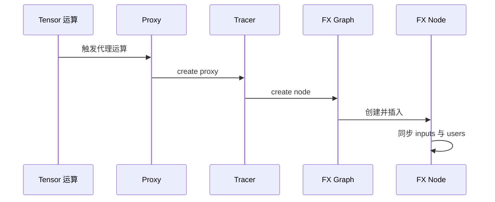
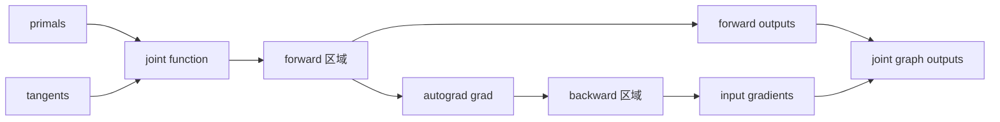
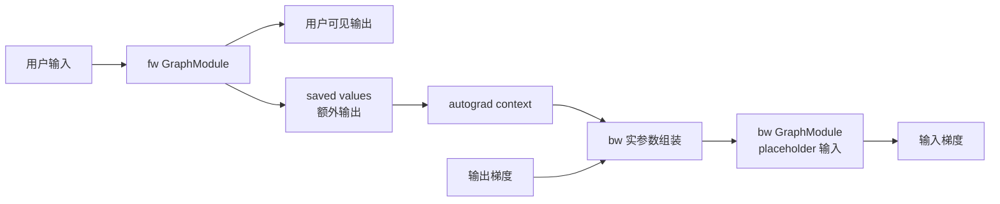
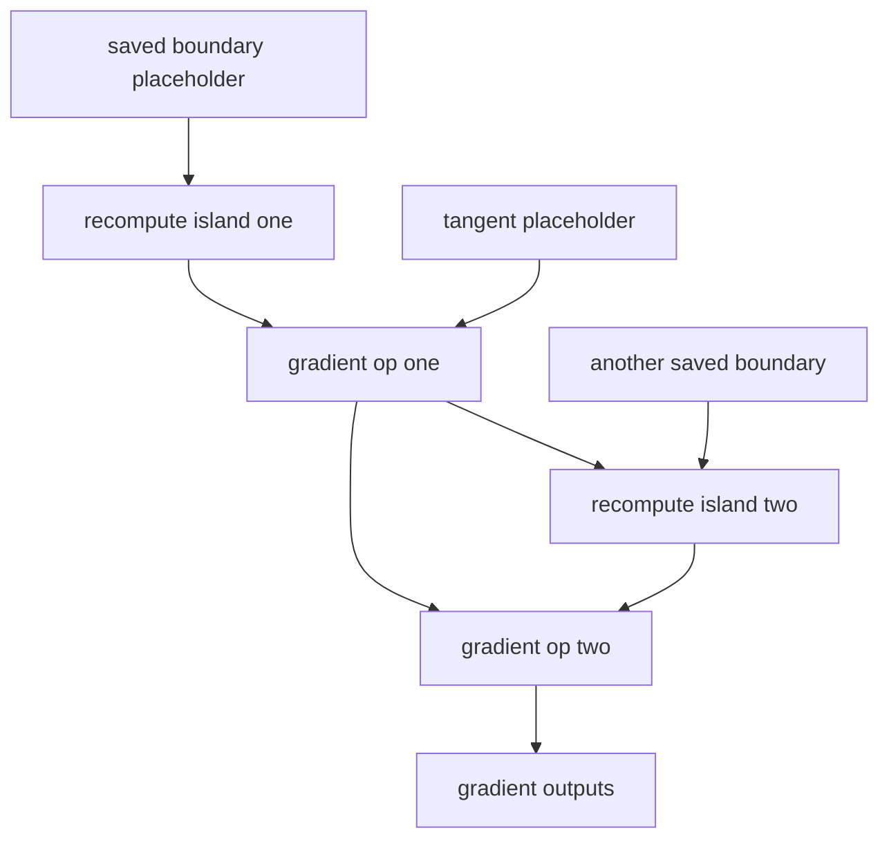

# AOTAutograd Joint Graph 构造与 Recompute — 正反向分图、Saved-Tensor ABI 与 Min-Cut Partition

> **页面角色**：2026-07-23 问答形成的综合报告快照，最初覆盖 FX IR 全套机制；
> P4 knowledge-base 整改 Task 7（2026-07-30）已把 FX 数据模型、改图原语、PatternExpr/
> PatternMatcherPass、DCE、稳定拓扑排序、rewrite 合法性与复杂度部分核实并入
> [[02_compile_stack/03_graph_ir_and_passes/index]] 对应页（逐节台账见该次改动的
> commit message），本页现瘦身为 **AOTAutograd 特有内容**：joint→fw/bw 构造、跨图
> ABI、saved values/recompute 与 min-cut partition。这部分留给 Task 8 与
> `09_aotautograd_joint_forward_backward_graphs`/`10_saved_tensors_recompute_and_runtime_abi`
> （下称 C09/C10）归一，本页暂不改动 §3/§4 正文。  
> **原始基线**：见下方页头；**当前审计基线**：PyTorch `e8f97c1a6ef8cbcdd0a946606bc1e924e4f07e52`。  
> **课程分工**：系统化、可执行的当前主线见 [[19_torch_compile_end_to_end/00_pytorch_graph_series_index]]；本页不是废弃页，但不再作为唯一事实入口。

> **源码基线**：PyTorch `ea5655fcebf726ec4cf1a859de75d2d0e6425805`，`main`，提交日期 2026-07-21。  
> **分析范围**：AOTAutograd joint graph 构造、partition（含 min-cut rematerialization）与运行时正反向桥接。  
> **结论口径**：标注为“源码事实”的描述可由所列 `file:line` 直接核验；复杂度上界和设计动机属于基于实现的分析。
> **配套文档**：[Design Report Word 版](../../../../docs/reports/fx_graph_construction_and_transformation_design_report.docx)。
---

## 阅读定位与迁移去向

本页最初是一份连续报告，覆盖 FX IR 全套机制；P4 Task 7 已完成下列迁移：

| 本页原章节 | 现状 |
|---|---|
| §1 核心结论（部分） | 已瘦身，FX数据模型/pattern/DCE相关结论移除，见下方链接 |
| §2 FX对象模型、边和图序 | **已迁移**并入 [[fx_graph_core_data_model_analysis]]（图序部分另并入 [[dead_code_topology_and_effect_order_analysis]]），本页删除该节 |
| §3 joint→fw/bw与跨图ABI | **保留原样**，待 Task 8 与 [[09_aotautograd_joint_forward_backward_graphs]] 归一 |
| §4 saved/recompute、节点复制与reorder | **保留原样**，待 Task 8 与 [[10_saved_tensors_recompute_and_runtime_abi]] 归一 |
| §5–§6 PatternExpr、候选、匹配与替换 | **已迁移**并入 [[pattern_expression_and_matcher_engine_analysis]]，本页删除该节 |
| §7–§8 dead、DCE、拓扑与effect order | **已迁移**并入 [[dead_code_topology_and_effect_order_analysis]]，本页删除该节 |
| §9 复杂度分析（通用部分） | **已迁移**：FX/pattern 通用复杂度已核实存在于 [[fx_graph_core_data_model_analysis]]/[[pattern_expression_and_matcher_engine_analysis]]/[[dead_code_topology_and_effect_order_analysis]]；AOT 全链路复杂度（含 min-cut max-flow）已核实存在于 C09/C10 自己的复杂度节，本页删除该节 |
| §10 不变量与排查清单 | 通用部分**已迁移**（见 [[fx_graph_editing_primitives_and_invariants_analysis]] 检查清单）；AOT 特有的两条提醒保留在下方“残留提醒” |
| §11 源码导航 | 通用行已核实存在于上述课程页各自的源码路径；AOT 特有行已是 §3/§4 正文内联引用，本页删除独立表格 |

旧报告的源码基线与新系列不同，不能用“目标页存在”推断每条历史claim都已无损迁移；
逐结构单元状态原以`docs/audits/pytorch_graph_series/`下的coverage ledger为准；该目录属审计流水线中间产物，已在 kb-reorg 清理中移出工作区（可经 git 历史追溯，删除前末次提交 `1ebafb5`），当前 checkout 不再包含该路径。

## 1. 核心结论（AOT 特有部分）

> **注**：以下机制结论保留，但旧完整路径 `torch/_functorch/_aot_autograd/partitioners.py` 已发生 locator drift；当前文件是 `torch/_functorch/partitioners.py`。现行提取机制见 [[09_aotautograd_joint_forward_backward_graphs#7. 提取新 Graph 的机制]]。

> FX 图数据模型、Pattern/PatternMatcherPass、DCE 与改写自动清理相关的结论已迁移，
> 分别见 [[fx_graph_core_data_model_analysis]]、[[pattern_expression_and_matcher_engine_analysis]]、
> [[dead_code_topology_and_effect_order_analysis]]。

1. **AOTAutograd 最终产物本质是两张独立 FX `GraphModule`：fw 与 bw。** 二者之间没有跨图 `Node` 边；跨图依赖由 ABI 表达为“fw 的额外输出 → 运行时保存 → bw 的 placeholder 输入”。源码见 `torch/_functorch/_aot_autograd/partitioners.py:1343-1592`、`runtime_wrappers.py:3215-3256,3288-3301`。
2. **recompute 不是特殊节点类型。** partitioner 选择少保存某些激活后，把必要的前向 `call_function` 节点复制到 bw 图；它们仍是普通 FX 节点，只是元数据可标记其重计算来源。源码见 `partitioners.py:514-705,1920-1995`。

---

## 3. FX 图是怎样构造出来的

### 3.1 通用 tracing 路径

以 Proxy tracing 为例：



`Proxy` 包装一个 `Node`；代理运算经 tracer 的 `create_proxy` 进入 `create_node`，再由 `Graph.create_node` 分配名字、构造 `Node`、插入链表并更新查找表。源码见 `torch/fx/proxy.py:186-245,340-374,600-635`、`torch/fx/graph.py:1583-1659`。

`make_fx` 使用 ProxyTensor/FakeTensor 路径执行待捕获函数并记录算子，最终把 tracer 中的 `Graph` 封装为 `GraphModule`。源码见 `torch/fx/experimental/proxy_tensor.py:3312-3351`。这里“构图”的结构工作近似线性，但 tracing 过程中真实算子、fake propagation、decomposition 和 shape 处理的成本需单独计算。

### 3.2 AOTAutograd 先构造 joint graph

AOTAutograd 的关键不是直接在 Dynamo 前向图上“倒推并挂边”，而是构造一个 joint function：

1. 输入组织为 `primals` 与 `tangents`；
2. 在 tracing 上下文中执行原始 forward；
3. 把当前已有节点标记为 forward 区域；
4. 调用 `torch.autograd.grad` 生成梯度计算；
5. joint function 返回 `(forward outputs, gradients)`；
6. `make_fx` 把整段执行捕获为一张 joint FX 图。

源码入口见 `torch/_functorch/_aot_autograd/graph_capture.py:92-136,471-535`，joint function 见 `graph_capture_wrappers.py:294-330,414-477`。



注意：joint graph 是 partition 前的中间产物。真正交给 fw compiler 与 bw compiler 的，通常是 partition 后两张独立图。

### 3.3 partition 如何得到 fw 与 bw

> **注**：旧完整 partitioner 路径已迁至 `torch/_functorch/partitioners.py`；现行结论见 [[09_aotautograd_joint_forward_backward_graphs#7. 提取新 Graph 的机制]]。

partitioner 先按 joint 输出和依赖闭包识别：

- forward required nodes；
- backward required nodes；
- 两边共享或可作为边界值的节点；
- 不被最终输出闭包需要的 unclaimed nodes。
源码见 `torch/_functorch/_aot_autograd/partitioners.py:4005-4088`。

随后 `_extract_graph_with_inputs_outputs` 创建一张新 `Graph`：

- 被指定为子图输入的 joint 节点，在新图中变成 fresh placeholder；
- 其余需要的 `call_function` 节点通过 `node_copy` 按 joint 拓扑序复制；
- `env` 字典建立“旧 joint Node → 新子图 Node”的映射；
- 最后创建 output，执行 DCE 和 lint。

源码见 `partitioners.py:514-705`、`torch/fx/graph.py:2384-2418`。

最终 `_extract_fwd_bwd_modules`：

- 先以 `saved_values + tangents` 为 bw 输入抽取 bw 图；
- 剪掉 bw 中未使用的 saved placeholder；
- 再确定 fw 的输入与输出，其中 fw 输出除用户结果外还包含真正需要保存的边界值；
- 分别封装为 fw 与 bw `GraphModule`。

源码见 `partitioners.py:1343-1592`。

### 3.4 fw 与 bw 的跨图依赖

你的理解基本正确，但“通过判断 save tensors 连接上正反向依赖关系”更精确的说法是：

> partition 在编译期把跨图依赖编码进两张图的输入输出签名；运行时 wrapper 再按这份签名把 fw 的额外输出保存到 autograd context，并作为 bw placeholder 的实参传入。两张图之间始终没有对象级 `Node` 边。



运行时生成的 compiled forward 调用 `_compiled_fw_` 后执行 `_save_(ctx, fw_outs)`；compiled backward 从 `ctx.saved_tensors`、symints、opaque objects 与 grad args 组装 `all_args`。源码见 `runtime_wrappers.py:3215-3256,3288-3301`。这就是跨图的真实“桥”。

---

## 4. recompute 怎样进入 bw 图

### 4.1 选择：保存值还是重新计算

min-cut rematerialization partitioner 把 joint graph 转成流网络：

- 不允许重计算的节点通过无穷容量约束固定在 source 侧；
- 必须属于 backward 的节点固定在 sink 侧；
- 可保存激活的代价编码为割边容量；
- minimum cut 的 source/sink 分界决定 saved values；
- 未保存但 bw 又需要的 forward 计算成为重计算区域。

源码见 `partitioners.py:2641-2708,2888-2889,3052-3072,3446-3481,4091-4288`。`activation_memory_budget=0` 倾向最大重算，`1` 使用 min-cut 结果；二者之间还会结合内存预算选择方案。

这一步的“边”是 partition 算法临时构造的 flow-network 边，不是最终 fw/bw GraphModule 的跨图边。

### 4.2 构图：把普通前向节点复制进 bw

假设 joint 图里有：

```text
x,w -> a -> b -> forward_output
                 \
                  gradient_region
```
如果保存 `a`，bw 大致是：

```text
placeholder saved_a
placeholder tangent
gradient_ops saved_a tangent
```

如果不保存 `a`，但保存或已有边界输入 `x,w`，bw 大致是：

```text
placeholder saved_x
placeholder saved_w
placeholder tangent
recomputed_a = forward_op saved_x saved_w
gradient_ops recomputed_a tangent
```

`recomputed_a` 没有 recompute 专用 opcode；仍是 `call_function`。partition extraction 通过 `node_copy` 复制它，输入由 bw 图的 placeholder 或已复制节点重映射。源码见 `partitioners.py:514-705`。

### 4.3 为什么还需要 reorder

按 joint 图“先 forward、后 backward”的原顺序复制，会把所有 recompute 节点集中放在 bw 的梯度计算之前，延长临时值生命周期。`reorder_backward_graph` 重新构造 bw 图，只在某个 backward 节点即将需要依赖时，才递归 materialize 对应 recompute 节点，使峰值活跃张量更低。源码见 `partitioners.py:1920-1995`。

因此带 recompute 的 bw 图在逻辑上通常呈现：



“island”只是阅读上的分组；IR 里仍是一列合法拓扑序的普通节点。

---

## 10. 残留提醒（AOT 特有）

改图原语与 pass 不变量的通用检查清单已迁至 [[fx_graph_editing_primitives_and_invariants_analysis]]
（10 项，覆盖 traversal snapshot、insertion point、args/users 同步、replacement 自引用、
users 清空、owner/state target、placeholder/output ABI、meta 传播、stage 级
DCE/sort/lint/recompile、alias/mutation/shape/autograd 验证）。以下两条是该清单未覆盖、
只在 AOT 跨图语境下才会踩的坑，本页保留：

- 不把 bw 叫“反向边图”：它的内部边仍是生产者到消费者；
- 不把 saved tensor 理解为跨图 Node 引用：它是 fw 输出/bw 输入 ABI。

### 阅读图时的四问

1. 当前看到的是 Dynamo forward graph、AOT joint graph，还是 partition 后 fw/bw？
2. 某个值是普通用户输出、saved value、tangent，还是重计算边界输入？
3. 所谓“反向”是 `users` 反向邻接、逆序遍历，还是 backward GraphModule？
4. 当前 pass 的收尾责任在 entry、自定义 handler，还是阶段 driver？

回答这四问，基本可以避免把三种“反向”和两种“图连接”混为一谈。这四问跨越 FX 数据模型、
pattern 匹配与本页的 AOT 语境，是刻意保留的综合辨析工具，不拆分到单一目的地页。

---

## 11. 关键源码导航（AOT 特有部分）

> **注**：下表中的旧完整路径 `torch/_functorch/_aot_autograd/partitioners.py` 仅是 locator drift，不能作为当前源码入口；当前入口及提取关系见 [[09_aotautograd_joint_forward_backward_graphs#7. 提取新 Graph 的机制]]。FX Node/Graph 数据模型、Proxy tracing、lint/DCE 的源码导航已迁至
> [[fx_graph_core_data_model_analysis]]。

| 主题 | 当前基线位置 |
|---|---|
| AOT joint graph 捕获 | `torch/_functorch/_aot_autograd/graph_capture.py:92-136,471-535`；`graph_capture_wrappers.py:294-477` |
| fw/bw 分类与抽取 | `torch/_functorch/_aot_autograd/partitioners.py:514-705,1343-1592,4005-4288` |
| min-cut 与 recompute reorder | `partitioners.py:2641-3072,3446-3481,1920-1995` |
| saved tensors 运行时桥接 | `torch/_functorch/_aot_autograd/runtime_wrappers.py:3215-3256,3288-3301` |

---

## Related Pages

- [[19_torch_compile_end_to_end/00_pytorch_graph_series_index]] — 当前系统课程入口
- [[09_aotautograd_joint_forward_backward_graphs]] — Task 8 归一对象:joint graph 提取与分类
- [[10_saved_tensors_recompute_and_runtime_abi]] — Task 8 归一对象:saved tensor ABI 与重计算
- [[02_compile_stack/03_graph_ir_and_passes/index]] — FX 数据模型/改图/pattern/DCE/保序/合法性已迁入的目标目录
- [[02_compile_stack/02_aot_autograd/index]] — AOTAutograd 模块索引
- [[aotautograd_analysis]] — AOTAutograd 全流程与 runtime wrappers 深入分析
- [[aot_autograd_quickstart]] — 正反向图、joint graph 与重计算的实操查看方法
- [[joint_graph_passes_guide]] — partition 前 joint graph 的 Inductor pass
