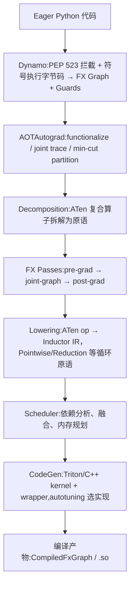
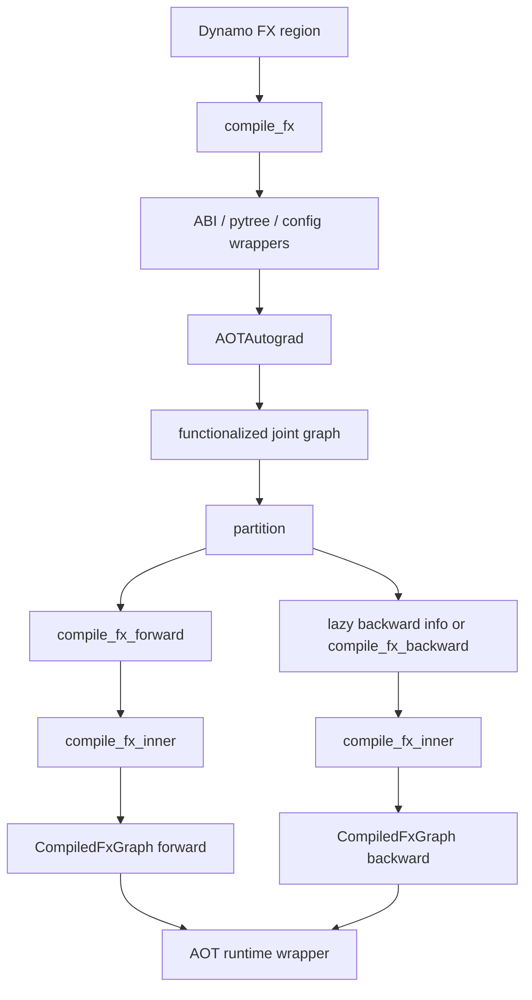
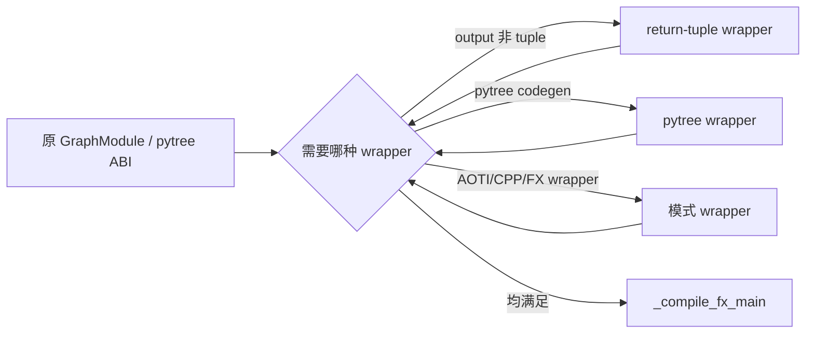
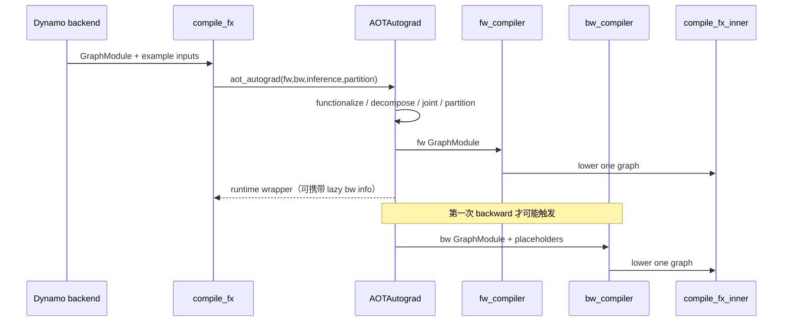

# D01 · Inductor `compile_fx` 的端到端编排

> 卷别：D · 编译产物、缓存与运行时  
> 固定源码：PyTorch `e8f97c1a6ef8cbcdd0a946606bc1e924e4f07e52`  
> 前置：[[14_codegen_kernel_mapping_autotuning_and_provenance_analysis]]  
> 后续：[[13_aot_runtime_wrappers_and_lazy_backward_compile_analysis]]  
> 最后更新：2026-07-30(kb-reorg P4 Task 6 迁入本目录,去 d01_ 前缀;与已删除的 `inductor_compiler_pipeline_analysis`(921 行,原"脊柱文档")逐节判重后,吸收其 §0 全景图与 §8/§9 的跨阶段综合为新增 §0、§15;该页 §1-§7 的逐阶段走读已被本目录各阶段专题页——`pre_grad_passes_guide`/`joint_graph_passes_guide`/`post_grad_passes_guide`/`decomposition_passes_guide`/`fx_lowering_to_inductor_ir_analysis`/`scheduler_analysis`/`inductor_codegen_analysis`,以及 01_dynamo、02_aot_autograd 目录各专题页——更深入地覆盖,不再重复,详见 changelog)

## 0. 编译管线全景与本页定位

`torch.compile`默认后端的完整链路跨越五个模块,本页只深挖其中一个交接点——**Inductor
如何编排调用AOTAutograd并把结果送入自己的lowering/scheduler/codegen**(§1起)。在深入之前
先给出全景,帮助判断某个具体问题应该去哪一页:



本页的范围是 `DY→AOT` 之后、`AOT`如何被 Inductor 的 `compile_fx` **反过来编排调用**的那一段
(即上图 `AOT`框内部与其和 `DEC`/下游的交接协议),而不是从头到尾复述每个框。各框的源码级
深挖入口:

| 阶段 | 深挖入口 |
|---|---|
| Dynamo | [[02_compile_stack/01_dynamo/index]] |
| AOTAutograd 捕获/functionalize/partition 本身 | [[02_compile_stack/02_aot_autograd/index]] |
| Decomposition | [[33_decomposition_passes_guide]] |
| FX Passes(pre/joint/post-grad) | [[30_pre_grad_passes_guide]] / [[31_joint_graph_passes_guide]] / [[32_post_grad_passes_guide]] |
| Lowering | [[10_fx_lowering_to_inductor_ir_analysis]] |
| Scheduler | [[13_scheduler_dependency_graph_fusion_and_ordering_analysis]] |
| CodeGen | [[20_inductor_codegen_analysis]] |

## 1. 为什么入口位于Inductor，却先调用AOTAutograd

Dynamo交给默认backend的是一个可能包含训练语义、mutation和高级ATen/Python target的FX
region。Inductor lowering更适合消费：

- functionalized graph；
- decomposition后的算子；
- 显式forward/backward；
- flat inputs/outputs；
- 已知mutation、alias和saved-value ABI。

因此默认backend不是直接：

```text
Dynamo FX → GraphLowering
```

而是：

```text
Dynamo FX
→ compile_fx总编排
→ AOTAutograd capture/functionalization/partition
→ forward compiler / backward compiler
→ compile_fx_inner
→ GraphLowering/Scheduler/codegen
→ OutputCode
```

**核心结论**：`compile_fx`是Inductor backend的端到端orchestrator；`compile_fx_inner`
才更接近“编译一张已经准备好的fw/bw FX graph”。

## 2. 源码对所有权的明确声明

`compile_fx` docstring说明：

- 它负责调用AOTAutograd；
- 最终通过callback回到 `inner_compile`；
- 它接管输入GraphModule所有权并可能原地修改。

见 `torch/_inductor/compile_fx.py:2889-2907`。

所以调用方若需保留原GraphModule，必须复制；不能假设跨此边界Node identity或metadata原样
保持。

## 3. 入口先处理配置递归与worker预热

`config_patches`通过递归调用把配置作用域同时包住：

- 当前forward编译；
- 可能在 `compile_fx`返回后才发生的lazy backward编译。

源码将patched `inner_compile`再包装一层，正是为了backward延迟执行仍看见相同配置
（`torch/_inductor/compile_fx.py:2925-2941`）。

CUDA/XPU输入还会尽早唤醒AsyncCompile pool，以便与前端/AOT工作重叠
（`torch/_inductor/compile_fx.py:2943-2948`）。

## 4. Wrapper归一化为何发生在主编译前

`_maybe_wrap_and_compile_fx_main`在实际工作前递归处理：

- graph output不是tuple；
- Dynamo export的PyTreeCodeGen；
- 嵌套Python input结构；
- AOTI/CPP/FX wrapper等模式。

最后才进入 `_compile_fx_main`，见 `torch/_inductor/compile_fx.py:3030-3056` 与
`torch/_inductor/compile_fx.py:3058-3070`。

这是为了让核心pipeline面对稳定的flat/tuple ABI，而不是在每个pass里重复处理用户pytree。

## 5. Forward compiler负责什么

`compile_fx_forward`接收AOT partition后的fw graph。inference路径还会：

- 记录joint-pass前后artifact；
- 保存output stack trace；
- 在pass前记录原始output stride；
- 运行joint graph passes。

见 `torch/_inductor/compile_fx.py:2609-2638`、
`torch/_inductor/compile_fx.py:2639-2639` 与
`torch/_inductor/compile_fx.py:2644-2673`。

随后它计算fixed args、user-visible outputs、static inputs、cudagraph配置，并调用
`inner_compile`。训练forward的outputs除了用户结果，还可能包含供backward保存的值。

## 6. Backward compiler为何单独加锁和选择static inputs

`compile_fx_backward`在全局compile lock下运行，因为backward可能在运行时lazy触发，仍会
访问共享compiler/config/cache状态（`torch/_inductor/compile_fx.py:2762-2780`）。

它还区分：

- partition后从inline代码保存的activations：地址不固定；
- primals/params/buffers：可作为static inputs；
- tangents；
- backward cudagraph override。

选择static input并调用inner compiler见 `torch/_inductor/compile_fx.py:2791-2820`。

## 7. `compile_fx_inner`的作用域

`compile_fx_inner`归一化kwargs并重新建立：

- cpp wrapper config；
- disabled dispatch modes；
- lazy GraphModule策略；
- compiler计时；
- fresh cache context；
- debug context。

然后调用被debug wrapper包住的 `_compile_fx_inner`
（`torch/_inductor/compile_fx.py:857-877` 与
`torch/_inductor/compile_fx.py:901-926`）。

它单独建立fresh-cache/config作用域，是因为lazy backward可能发生在外层 `compile_fx`
上下文退出之后。

## 8. `inner_compile`为何是回调参数

这允许：

- 正常走Inductor；
- 测试时替换为记录/断言compiler；
- compiler bisector关闭某层；
- AOTAutograd分别调用fw/bw compiler；
- config patch装饰延迟backward；
- cache层在inner compile前后插入。

回调结构还解释了“forward和backward是否同时编译”不是固定答案：AOT trace/partition可先
完成，bw lowering可以延迟到第一次backward。

## 9. 产物的层次

一次默认training compile可能产生：

| 层 | 产物 |
|---|---|
| Dynamo | GuardedCode + transformed bytecode |
| AOTAutograd | fw/bw GraphModule + runtime metadata |
| Inductor graph | fw/bw各自的post-grad FX、IR、scheduler |
| Codegen | generated Python/C++/Triton source |
| Code cache | source路径、shared library/kernel artifacts |
| OutputCode | `CompiledFxGraph` boxed callable |
| Runtime | AOT autograd.Function wrapper、可选CUDAGraph wrapper |

某层cache hit只跳过该层定义的工作。

## 10. 状态变化总图



## 11. 源码跟读：`compile_fx`怎样把一个入口拆成三类 compiler

### 11.1 入口先封存策略，再进入真正的图编译

`compile_fx`的签名把 `inner_compile`显式作为参数，并声明接管 `model_`所有权
（`torch/_inductor/compile_fx.py:2889-2907`）。这不是普通依赖注入而已：同一个
`inner_compile`随后会被做成 inference、training forward、backward三个回调，所以 cache、
debug wrapper、bisector或测试替身能以同一协议覆盖三个方向。

有 `config_patches`时，入口在 patch作用域内递归调用自己，并把经过
`config.patch(...)(inner_compile)`装饰的新回调传下去
（`torch/_inductor/compile_fx.py:2925-2941`）。为什么需要“作用域 + 装饰器”两层？

- 当前 `compile_fx`同步执行的 AOT trace需要外层 config context；
- lazy backward可能在函数返回后才调用 `inner_compile`，只能靠装饰后的 callable重新进入
  相同 config；
- `compile_region_name`被做成 partial参数但刻意不进入 graph kwargs，避免只用于诊断的名字
  扰动 FX cache key。

### 11.2 wrapper递归是在收敛 ABI，不是在重复编译

`_maybe_wrap_and_compile_fx_main`建立一个指回自己的 `compile_gm` closure，然后每个 wrapper
只处理一种外层差异；满足一个条件后，把归一化后的 graph再次交回该 closure
（`torch/_inductor/compile_fx.py:3030-3056`）。因此它形成的是有限的 ABI归一化链：



递归会在对应条件被消除后前进；它不是对同一未变化输入无界递归，也不是多次执行
Inductor lowering。

### 11.3 `_compile_fx_main`先制作 callbacks，再把图交给 AOTAutograd

源码注释直接给出四阶段协议：pre-grad、构造 fw/bw compiler、AOT创建和切分joint graph、
最后重新组装 runtime callable
（`torch/_inductor/compile_fx.py:3080-3100`）。具体 callback所有权如下：

| callback | 输入图 | 额外状态 | 下游 |
|---|---|---|---|
| `inference_compiler` | inference AOT graph | inference metadata/freezing选择 | `compile_fx_forward(..., is_inference=True)` |
| `fw_compiler` | partition后的 training fw | 原输出数、原输入数、共享 config extra | `compile_fx_forward(..., is_inference=False)` |
| `bw_compiler` | partition后的 bw | compile lock、tangent/static input规则 | `compile_fx_backward` |

training backward callback的闭包把 `compiler_config_extra`和同一个 `inner_compile`继续传入
（`torch/_inductor/compile_fx.py:3163-3177`）。然后入口在 FakeTensor、TracingContext、
禁用 compiled-autograd 与 functorch config作用域中调用 `dynamo_common.aot_autograd`，显式
传入三个 compiler、decomposition table与 partition function
（`torch/_inductor/compile_fx.py:3262-3286`）。

这里的调用方向是 AOTAutograd **回调** Inductor，而不是 Inductor先自行构造 bw图：



### 11.4 单图编译边界从 `compile_fx_inner`开始

`compile_fx_forward`不是一个别名：它先区分 inference/training，并保留原模型输出数与原输入
数（`torch/_inductor/compile_fx.py:2609-2629`）；随后计算 fixed arguments、识别
user-visible outputs（`torch/_inductor/compile_fx.py:2674-2703`）。`compile_fx_backward`
则在全局 compile lock内处理输出可见性
（`torch/_inductor/compile_fx.py:2762-2789`），再根据 forward是否被分区决定只有 primals
可标 static，还是所有非 tangent前缀都可标 static
（`torch/_inductor/compile_fx.py:2791-2820`）。

两条路径最终都进入 `compile_fx_inner`。它填充单图 kwargs并说明为何 backward需要独立的
fresh cache/lazy graph作用域（`torch/_inductor/compile_fx.py:857-877`），随后建立计时、
fresh-cache、debug context，才调用 `_compile_fx_inner`
（`torch/_inductor/compile_fx.py:901-926`）。后者的契约已经收窄为“编译一张 graph”
（`torch/_inductor/compile_fx.py:937-948`）。

因此排障时应先问“失败位于总编排、AOT callback还是单图 lowering”。三者都可能出现在
一次 `torch.compile`调用栈中，但持有的图、配置状态和缓存键不同。

## 12. 不变量与失败边界

- `compile_fx`可修改输入gm，调用方不能依赖原Node identity；
- config必须跨lazy backward保存；
- inference和training forward metadata不同；
- fw/bw分别lowering，不存在跨Graph的Node边；
- output tuple/flat ABI在主pipeline前归一化；
- backward static address假设不能错误覆盖saved activations；
- inner compile要在正确FakeTensor/ShapeEnv上下文运行；
- cache/load后还要执行post-compile包装，不能把序列化对象直接当最终callable。

## 13. 复杂度

设Dynamo region有 \(G\) 个nodes，joint图 \(J\)，partition后 \(F,B\)，backend各阶段成本
为 \(K(F),K(B)\)：

\[
T_{\text{compile}}
=T_{\text{wrap}}
+T_{\text{AOT}}(G,J)
+T_{\text{partition}}(J)
+K(F)
+\mathbf{1}_{\text{bw compiled now}}K(B)
\]

lazy backward把 \(K(B)\)从first forward调用移动到first backward调用，不消灭它。若cache
命中，公式中对应部分变为key构造、lookup、deserialize/load和post-compile成本。

## 14. 常见误解

- **“compile_fx只编译FX。”** 它还编排AOTAutograd和runtime wrappers。
- **“forward编译成功说明backward也已lower。”** lazy backward可能尚未发生。
- **“Dynamo gm就是Inductor post-grad gm。”** 中间有functionalization、decomposition、
  partition和fresh graph。
- **“config context退出后backward用默认配置。”** inner compiler被patch保存，并在lazy路径
  重建上下文。
- **“一份OutputCode代表整个训练step。”** fw/bw可有独立OutputCode与runtime生命周期。

## 15. 全链路视角下的三条组织原则(吸收自已删除的 inductor_compiler_pipeline_analysis §8)

`compile_fx`编排的每一段职责划分,都能在下游 Decomp/FX Passes/Lowering/Scheduler/CodeGen
里找到同一套原则的重复应用(各阶段专题页有各自更细的版本,这里只留跨阶段共性,不重复
逐阶段证据):

1. **分层解耦**:Dynamo负责Python语义→FX Graph,AOTAutograd负责自动微分图生成,
   Decomposition负责算子集收敛,FX Passes负责平台无关优化,Lowering负责ATen→后端无关IR,
   Scheduler负责全局调度决策,CodeGen负责具体后端代码生成——每层输入输出格式稳定,便于
   独立开发、测试和替换,这正是§9那张产物层次表背后的动机。
2. **函数化→优化→inplace化**:AOTAutograd先把inplace操作函数化,所有FX Passes和Scheduler
   假设函数式IR以简化分析,Post-grad最后的`reinplace`pass才恢复安全的inplace——顺序不可
   颠倒,因为函数式假设一旦被提前打破,后续优化就要重新处理别名。
3. **延迟决策**:能延迟的优化决策会被推到最合适的阶段——lazy backward把\(K(B)\)从
   first-forward调用推迟到first-backward调用(本页§4);算子后端选择延迟到CodeGen阶段
   autotuning;kernel tiling延迟到CodeGen阶段依据硬件特性决定。延迟不是偷懒,而是让决策
   在信息最充分时做出。

## 16. 附录:关键源码文件速查(吸收自已删除的 inductor_compiler_pipeline_analysis §9)

跨阶段排障时快速定位该去哪个文件,精确行号见各阶段专题页(会随版本漂移,这里只列文件):

| 阶段 | 文件 |
|------|------|
| Dynamo | `torch/_dynamo/eval_frame.py`、`torch/_dynamo/convert_frame.py`、`torch/_dynamo/symbolic_convert.py`、`torch/_dynamo/output_graph.py` |
| AOTAutograd | `torch/_functorch/aot_autograd.py`、`torch/_functorch/_aot_autograd/partitioners.py`、`torch/_functorch/_aot_autograd/runtime_wrappers.py` |
| Decomposition | `torch/_inductor/decomposition.py`、`torch/_decomp/__init__.py` |
| Pre-grad | `torch/_inductor/fx_passes/pre_grad.py` |
| Joint Graph | `torch/_inductor/fx_passes/joint_graph.py` |
| Post-grad | `torch/_inductor/fx_passes/post_grad.py` |
| Lowering | `torch/_inductor/lowering.py`、`torch/_inductor/ir.py` |
| Scheduler | `torch/_inductor/scheduler.py` |
| CodeGen | `torch/_inductor/codegen/triton.py`、`torch/_inductor/codegen/cpp.py`、`torch/_inductor/codegen/wrapper.py`、`torch/_inductor/select_algorithm.py`、`torch/_inductor/autotune_process.py` |
| 总编排(本页) | `torch/_inductor/compile_fx.py`、`torch/_inductor/graph.py`(`GraphLowering`) |

## 配套 Demo

本页对应卷级入口 `tools/labs_torch_compile/demo_d_artifact_runtime.py` 的 `compile_fx_orchestration` 用例。默认以 CUDA 为验收设备：

```powershell
python -B tools\labs_torch_compile\demo_d_artifact_runtime.py `
  --case compile_fx_orchestration --device cuda `
  --output-dir tools\labs_torch_compile\artifacts\volume_demos\d01
```

先用 `--list --json` 查看用例声明的能力要求。无 CUDA 的机器可把 `--device` 改为 `cpu` 探索设备无关机制；CUDA/Triton/多卡专属用例会返回 `BLOCKED`，且不会执行用例正文。不要把 `BLOCKED` 写成 `PASS`。

重点读取 `summary.json` 与 `compile_fx_orchestration/result.json`：`status` 区分 `PASS/BLOCKED/FAIL`，`environment` 固化运行环境，`observations` 保存本页机制的实测字段，`artifacts` 指向图代码、日志、trace 或进程证据。`PASS` 只表示该次运行中的断言通过，不外推到其他 PyTorch 版本、shape、dtype 或硬件。

## Related Pages

- [[courses/torch_compile_end_to_end]]
- [[14_codegen_kernel_mapping_autotuning_and_provenance_analysis]]
- [[13_aot_runtime_wrappers_and_lazy_backward_compile_analysis]]
- [[27_async_compile_workers_and_module_loading_analysis]]
- [[02_compile_stack/06_compile_cache/index]]
- [[11_aotautograd_joint_forward_backward_graphs_analysis]]
