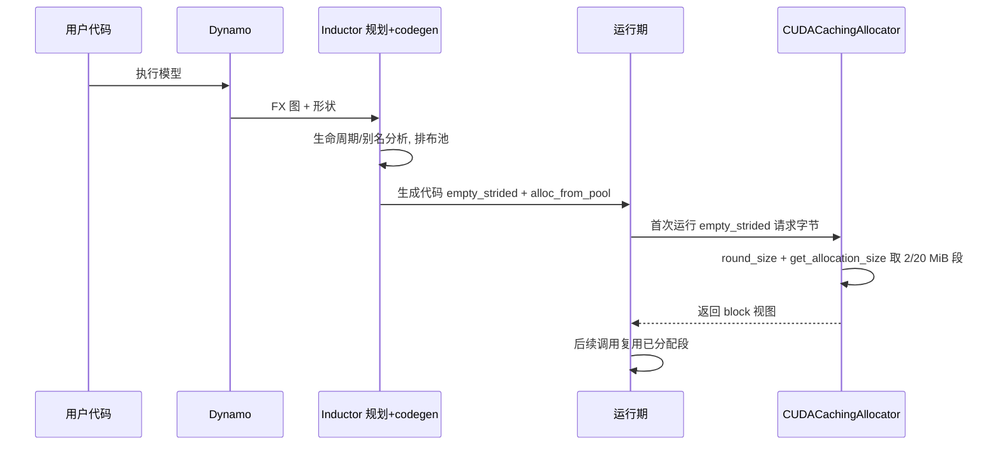

# torch.compile 内存分配实战指南 — 实际分配走查 / 分配器选型 / 实测复现

> [!note] 页面角色与审计状态
> **页面角色**：从 Inductor 规划走到 allocator/CUDA Graph pool 的观测、配置与实验指南；它承担实操和排障，不替代编译期 liveness/reuse 的机制课程。
> **原始基线**：PyTorch `5f6df46744a`；**当前审计基线**：PyTorch `e8f97c1a6ef8cbcdd0a946606bc1e924e4f07e52`。
> **审计状态**：已纳入历史 manifest，但页内实验、默认配置和 locator 尚未在当前基线逐项重跑；外部报告订正仍限定在原页基线。当前 buffer/liveness/reuse 课程见 [[12_buffer_liveness_memory_planning_and_reuse_analysis]]；Inductor 领域入口见 [[02_compile_stack/04_inductor/index]]。

> **Source baseline**: pytorch @ `5f6df46744a`(trunk, 2026-06-29)
> **Dimension**: Guide(how-to / 实战走查)
> 最后更新: 2026-06-30
>
> 本页是 [[12_buffer_liveness_memory_planning_and_reuse_analysis]] §16-18(机制深挖,2026-07-30 起吸收原 `inductor_memory_management_analysis`/`wrapper_execution_memory_allocation_and_reuse_analysis` 独有内容)的**动手版**:用一个具体例子走一遍「从编译规划到真正 `cudaMalloc`」、横向比分配器、给出可复现的峰值/分配次数测量方法与实践建议。机制层(三层怎么运作)请读该权威页;本页只讲**怎么观察、怎么选、怎么调**。

> [!note] 本页风格吸收自一份外部专家报告(`deep-research-report.md`),保留其「角色边界 → 分配全过程 → 分配器对照表 → 可复现实验」的叙述骨架。但所有断言已对 `5f6df46744a` 源码逐条复核,**报告与源码冲突处以源码为准**,见文末「与原报告的差异订正」。

---

## 1. 角色与边界(30 秒回顾)

| 阶段 | 干什么 | 产物 |
|------|--------|------|
| `torch.compile`(Dynamo+AOT) | 捕获 FX 图、functional 化、标注形状(SymInt) | 带生命周期信息的图 |
| Inductor(编译期) | 生命周期/别名分析,规划 buffer 复用/池布局,生成 codegen | `empty_strided` + `alloc_from_pool` 代码 |
| 运行期 | 首次执行触发实际分配,后续复用 | 真实显存占用 |
| `CUDACachingAllocator`(设备) | 真正向驱动 `cudaMalloc` 拿段、缓存复用 block | 物理显存 |

一句话:**编译期「计划」谁在哪用内存,运行期「执行」这些计划并由缓存分配器申请物理内存。** 机制细节见 [[12_buffer_liveness_memory_planning_and_reuse_analysis]] §16。

---

## 2. 一次实际分配的全过程



要点(对应深挖页的层):
- **编译期定布局,运行期才真分配**:codegen 里的 `empty_strided`/`alloc_from_pool` 在**首次调用**时才触发真实显存申请;`alloc_from_pool` 本身零分配(只算偏移视图,`wrapper.py:1520`)。
- **首次 `empty_strided` → 段分配**:落到 `CUDACachingAllocator`,按 `get_allocation_size`(`CUDACachingAllocator.cpp:3697`)取 2 MiB / 20 MiB / 2 MiB-倍数 段(见深挖页 §3 表)。
- **后续调用复用**:段缓存在分配器里,不再 `cudaMalloc`。

具体的池布局实例(`pool1 = empty_strided_cuda(...)` + 两个 `alloc_from_pool` + 字节布局图)见 [[12_buffer_liveness_memory_planning_and_reuse_analysis]] §17——那是本走查的「实际分配」落点。

---

## 3. 后端 / 分配器对照

Inductor 生成的 `empty_strided` **不区分底层分配器**,运行期按 `PYTORCH_CUDA_ALLOC_CONF` 选路。横向对比:

| 分配器 / 策略 | 机制 | 优点 | 代价 / 注意 | 何时用 |
|--------------|------|------|------------|--------|
| **native 缓存分配器**(默认) | block/segment 缓存复用、coalesce、不还驱动(`CUDACachingAllocator.cpp`) | 复用快、兼容所有 CUDA 版本、可调档位 | 复杂场景易碎片;释放阈值需调 | 绝大多数训练/推理 |
| **`cudaMallocAsync`** | CUDA 11.4+ 流有序内存池,交给驱动管大池 | 减少 CPU↔CUDA 同步;对碎片更宽容 | 仅新 CUDA;部分场景有已知碎片 issue | 异步密集 / 对碎片敏感 |
| **`expandable_segments:True`** | native 的子模式:用 `cuMemCreate`+`cuMemAddressReserve` 把虚拟地址与物理页分离,段可**尾部追加映射**(`CUDACachingAllocator.cpp:333-339`) | 显著缓解动态 batch 的碎片 | 实验特性,个别平台不支持(回退) | 形状/batch 频繁变化 |
| **Inductor 池化**(`memory_planning=True`) | 编译期把中间张量打进一个 `empty` 池,`alloc_from_pool` 取偏移 | 分配次数↓、布局可控、峰值↓ | **默认关、仅 inference**;池大小估错需重编译;动态 shape 需两阶段算尺寸 | 中间张量多且可复用(如 Transformer 激活) |

切换方式:`PYTORCH_CUDA_ALLOC_CONF=backend:cudaMallocAsync` / `expandable_segments:True` / `max_split_size_mb:128` / `roundup_power2_divisions:8`。这些只影响**层 2 物理分配**,不改 Inductor 的编译期规划。

> [!warning] `expandable_segments` 是 **native 后端的一个开关**,不是独立后端(与 `cudaMallocAsync` 互斥)。`cudaMallocAsync` 路径走 `CUDAMallocAsyncAllocator.cpp`、没有 PyTorch 侧 block 缓存逻辑,`max_split_size_mb` 等 native 档位对它无效。

---

## 4. 实测复现:峰值内存与分配次数

### 4.1 用 PyTorch 内置统计

```python
import torch

def measure(fn, *args):
    torch.cuda.synchronize(); torch.cuda.reset_peak_memory_stats()
    out = fn(*args)                      # 首次调用含编译+实际分配
    torch.cuda.synchronize()
    s = torch.cuda.memory_stats()
    return {
        "peak_alloc_MB":   torch.cuda.max_memory_allocated() / 2**20,  # 请求峰值
        "peak_reserved_MB":torch.cuda.max_memory_reserved()  / 2**20,  # 段(cudaMalloc)峰值
        "num_alloc":   s["allocation.all.allocated"],   # 累计分配次数
        "num_segment": s["segment.all.allocated"],      # 累计 cudaMalloc 段数
    }

class SimpleModel(torch.nn.Module):
    def __init__(self):
        super().__init__(); self.fc1 = torch.nn.Linear(1024, 2048); self.fc2 = torch.nn.Linear(2048, 1024)
    def forward(self, x): return self.fc2(torch.relu(self.fc1(x)))

x = torch.randn(64, 1024, device="cuda"); m = SimpleModel().cuda()
print("eager   ", measure(m, x))
print("compiled", measure(torch.compile(m), x))
# 开池化(仅 inference 有效):
import torch._inductor.config as ind
with ind.patch(memory_planning=True):
    print("pooled ", measure(torch.compile(m), x))
```

**关键指标**:
- `max_memory_allocated()` = 请求字节峰值;`max_memory_reserved()` = 段总量峰值。**两者差距 = 缓存/碎片**(段按 2/20 MiB 档位向上取整,见深挖页 §3)。
- `memory_stats()["allocation.all.allocated"]` = 累计分配次数(复用越多越少);`["segment.all.allocated"]` = 真正 `cudaMalloc` 次数。

### 4.2 看生成代码与可视化

- `TORCH_LOGS="output_code"`:打印 codegen,直接看到 `empty_strided` / `alloc_from_pool` / `del ... # reuse`。
- **内存历史快照**(现代方式):`torch.cuda.memory._record_memory_history()` → 跑 → `torch.cuda.memory._dump_snapshot("snap.pickle")`,用 <https://pytorch.org/memory_viz> 看每块的分配栈与生命周期。
- `nsys profile --trace=cuda`:抓真实 `cudaMalloc/cudaFree` 调用数与时序(取代 nvprof)。

### 4.3 示例对照(说明性,非实测)

| 模式 | 峰值请求 (MB) | 分配次数 | 说明 |
|------|--------------|---------|------|
| Eager | 256 | 15 | 每 op 单独分配、无复用 |
| compile(默认复用) | 220 | 12 | 融合 + 逐 buffer `reuse`,但仍按需分配 |
| compile(`memory_planning`) | 180 | 2 | 单池复用多数中间结果,分配次数骤降 |

> 数字仅示意,实际取决于模型与形状;请用 §4.1 在自己的模型上实测。

---

## 5. 内存越界 / 踩踏(out-of-bounds)排查

> 二手材料常说「Inductor 对越界没有内置保护」——**不准确**(已对 `5f6df46744a` 核实)。Inductor 自动生成的核有**多层默认防护**;真正的越界风险集中在**自定义算子 / 手写 Triton / 错误的 stride·offset**,而不是自动核本身。

### 5.1 自动核的内置防护(多为默认 ON)

- **Triton kernel 边界掩码**:生成的 load/store 带 `mask = xindex < xnumel`(`codegen/triton.py:5458`),越界 lane 被 mask 掉、不读写——**规则的核内越界通常被挡住**。机制见 [[23_inductor_gpu_kernel_dispatch_model]]。
- **`assert_size_stride`**(`size_asserts` **默认 ON**,`config.py:232`):每个输入/中间张量在首次被核使用前,断言其 **size + stride** 与编译期假设一致(`codegen/wrapper.py:1827`、`ir.py:7817`;输入的断言还被延迟到首个用它的 kernel 前,`wrapper.py:1798-1806`)。捕获 `reinterpret_tensor`/`as_strided`/动态 shape 推导错位——这类元数据错位正是「踩踏」的常见前因。
- **`assert_alignment`**(`ir.py:7845`):断言张量数据指针按 **`GPU_ALIGN_BYTES = 16`**(`utils.py:161`)对齐(即原材料说的「16 字节对齐」确有其事)。
- **`scalar_asserts`**(默认 ON,`ir.py:9152`)、**`nan_asserts`**(默认 OFF,`config.py:233`,查 NaN/Inf)、**`runtime_triton_nan_asserts`**(核内 NaN 断言,`codegen/common.py:2789`)。

即:**规则的自动核越界被 `mask` + size/alignment/scalar 断言兜住**,不是「零保护」。

### 5.2 真正的越界来源

- **自定义算子**(`torch.library.custom_op`)/ **手写 Triton kernel**:索引、循环边界、mask 由用户负责,Inductor 不改写其内部。
- **错误的 `stride`/`storage_offset`**:`as_strided`/`reinterpret_tensor` 给了越界的视图(`size_asserts` 能查「元数据不一致」,但给了「自洽但越界」的 stride 仍可能踩)。
- **动态 shape 下 unbacked symint 上界推错**(见 [[25_unbacked_symint_analysis]])。

### 5.3 检测工具(注意版本)

- **`compute-sanitizer --tool memcheck`**(NVIDIA Compute Sanitizer)——**取代已废弃的 `cuda-memcheck`**(CUDA 11.6 起弃用、12 起移除)。检测 GPU kernel 越界/非法访问:
  ```bash
  CUDA_LAUNCH_BLOCKING=1 compute-sanitizer --tool memcheck python model_test.py
  ```
- **`CUDA_LAUNCH_BLOCKING=1`**:强制 kernel 同步 launch,让报错定位到**真正出事的 kernel**(否则异步下崩溃点会漂移到后续无关调用)。
- **Inductor 断言开关**:`TORCHINDUCTOR_NAN_ASSERTS=1` 抓 NaN/Inf 起点;`TORCHINDUCTOR_SIZE_ASSERTS`/`SCALAR_ASSERTS` **默认已 ON**,排查时保留别关。
- **`TORCH_LOGS="output_code"`**:导出生成的 wrapper + Triton kernel,人肉核对 `alloc_from_pool` 偏移、`assert_size_stride`、mask 与索引。
- **CPU 端**:ASan/UBSan(需源码编译 PyTorch/扩展)、valgrind(仅主机内存,不覆盖 GPU)。

### 5.4 排查步骤(收敛版)

1. `CUDA_LAUNCH_BLOCKING=1` + 小模型/单步复现,让崩溃点固定。
2. `compute-sanitizer --tool memcheck` 跑,读**第一条** out-of-bounds / invalid-access 的 kernel 名与栈。
3. 若指向**自动核**:多半是上游 stride/shape 错——`TORCH_LOGS="output_code"` 看该 buffer 的 `reinterpret_tensor`/`assert_size_stride` 是否推错;`fullgraph=True` 缩小范围。
4. 若指向**自定义算子/手写 Triton**:回该核检查索引与 mask 边界。
5. `torch.cuda.memory._record_memory_history()` + snapshot(§4.2)看崩溃前后的分配布局,确认有无意外的复用/别名。

> 一句话:**Inductor 自动核靠 `mask` + size/alignment/scalar 断言(多为默认 ON)兜底,不是「零保护」;越界几乎都出在自定义核或错误的 stride/offset,用 `compute-sanitizer`(非 `cuda-memcheck`)+ `CUDA_LAUNCH_BLOCKING` 定位。**

---

## 6. 实践建议

- **先认清默认行为**:默认走的是**逐 buffer 复用 + 峰值重排**(`allow_buffer_reuse`/`reorder_for_peak_memory`,默认 ON),不是池化。池化 `memory_planning` 默认关、仅 inference——别误以为「不开就没有内存优化」。
- **OOM 调档**:`PYTORCH_CUDA_ALLOC_CONF=expandable_segments:True` 常能显著降 reserved 峰值(尤其动态 batch);或 `max_split_size_mb` 限制大块切分以减碎片。
- **动态形状**:池大小是符号表达式,运行期两阶段(先算尺寸再分配);确保动态维有合理上界,避免反复重编译。
- **CUDA Graphs**(`mode="reduce-overhead"`):内存走 `cudagraph_trees` 私有池 + 地址稳定,见深挖页 §4;注意输出跨代要 `cudagraph_mark_step_begin()` 或 clone。
- **多流**:Inductor 规划假定单一执行流;自定义多流并发时生命周期分析可能失效,需手动同步或避免跨流别名。
- **量两个峰值**:盯 `max_memory_reserved`(段/碎片)而不只是 `max_memory_allocated`(请求);OOM 通常败在 reserved。

---

## 7. 与原报告的差异订正(源码 > 报告)

逐条对 `5f6df46744a` 核过,报告以下处需修正:

- **「池化是 Inductor 默认行为 / `config.memory_planning=True` 时启用」自相矛盾且偏差**:实际 `memory_planning` **默认 `False`、且仅 inference 生效**(`config.py:255`、`wrapper.py:2482`);默认路径是逐 buffer 复用(`memory_plan_reuse`),不是池化。
- **实验代码 `options={"memory_efficient_fusion": False/True}` 不是内存规划开关**:开池化应 `torch._inductor.config.memory_planning=True`(或 `options={"memory_planning": True}`);`memory_efficient_fusion` 是旧 functorch 概念,与此无关。
- **`memory_stats()["allocation.all.current"]` 是「当前存活数」不是「累计分配次数」**:要数分配次数用 `allocation.all.allocated`;数 `cudaMalloc` 段用 `segment.all.allocated`。
- **`expandable_segments` 不是独立后端**:它是 native 后端的开关,与 `cudaMallocAsync` 互斥(本页 §3 [!warning])。
- **报告正确的部分(确认保留)**:`alloc_from_pool` = `torch.ops.inductor._alloc_from_pool`、零分配偏移视图(`wrapper.py:1520`、`inductor_ops.cpp:36`);贪心/区间复用思想方向正确(实现细节是 `TemporalSplit`/`SpatialSplit` 树,见深挖页 §2.5)。

---

## Related Pages

- [[courses/torch_compile_end_to_end]] — 当前固定基线的图编译系统化课程入口
- [[02_compile_stack/04_inductor/index]] — Inductor 领域索引
- [[12_buffer_liveness_memory_planning_and_reuse_analysis]] — 编译期 logical buffer、liveness、reuse 与静态 peak
- [[12_buffer_liveness_memory_planning_and_reuse_analysis]] — **机制深挖**(编译期规划权威页,§16 三层全景 + §17 池大小 + §18 wrapper boxed convention/通信 buffer 池):本指南的理论底座
- [[10_caching_allocator_autocast_profiler_analysis]] — 层 2 `CUDACachingAllocator` 的 block/segment/expandable 源码级机制
- [[20_inductor_codegen_analysis]] — wrapper codegen(`empty_strided`/`alloc_from_pool` 的生成处)
- [[23_inductor_gpu_kernel_dispatch_model]] — Triton kernel 骨架与 `mask` 边界掩码(§5 越界防护的来源)
- [[02_compile_stack/07_debugging/index]] — `TORCH_LOGS`/`TORCH_COMPILE_DEBUG` 编译调试(与 §5 排查互补)
- [[25_unbacked_symint_analysis]] — 动态 shape 的 unbacked symint(§5.2 越界来源之一)
- [[10_pytorch_cuda_graphs_complete_guide]] — CUDA Graphs 通用用法
- [[01_inductor_quickstart]] — `torch.compile` 参数与 `torch._inductor.config` 上手
