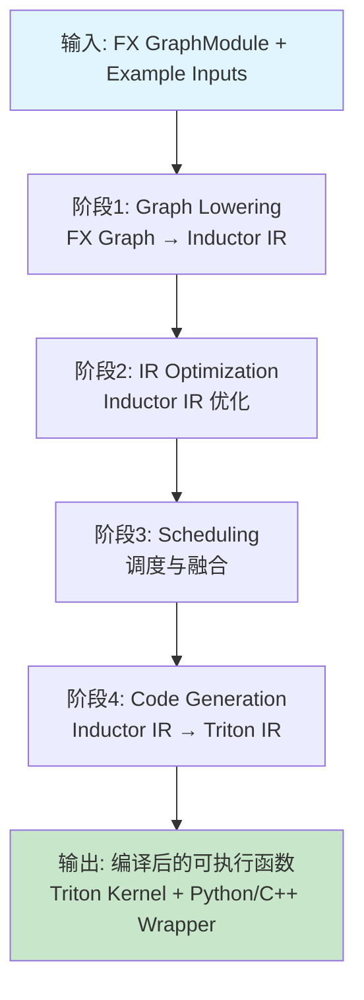
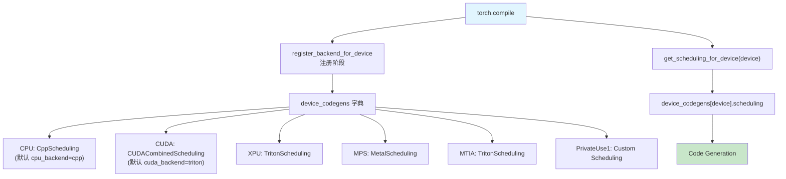
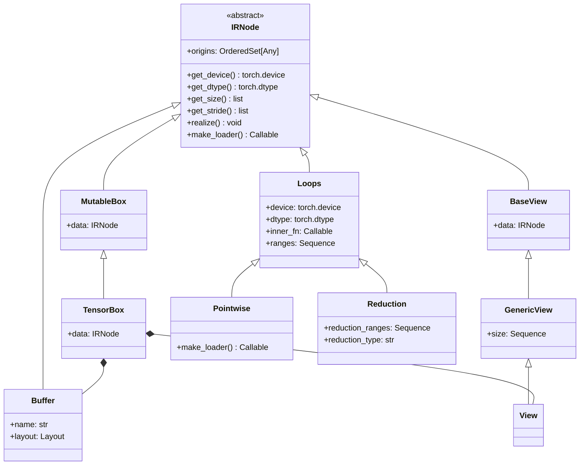
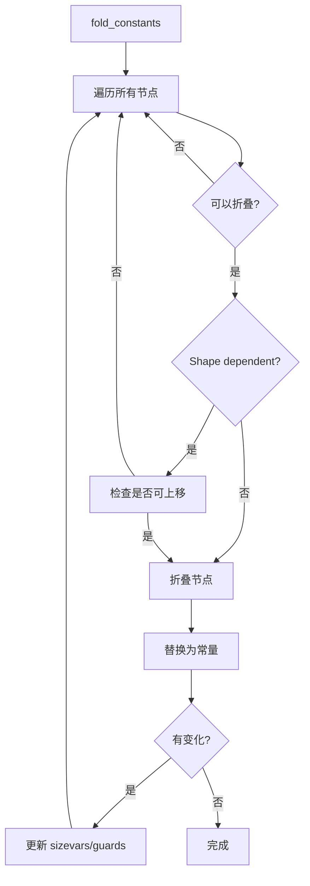
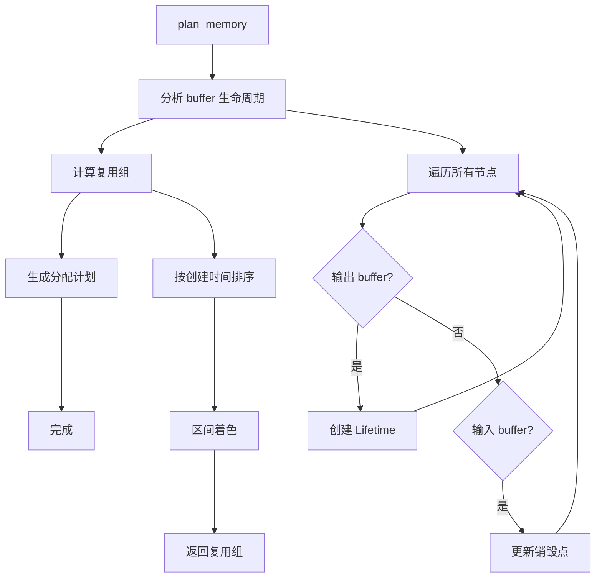
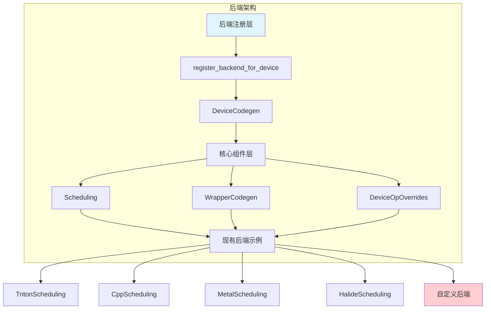
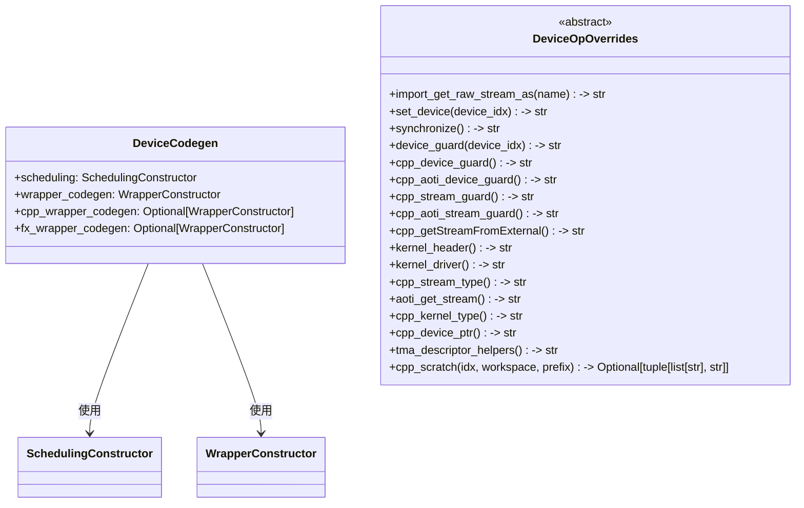
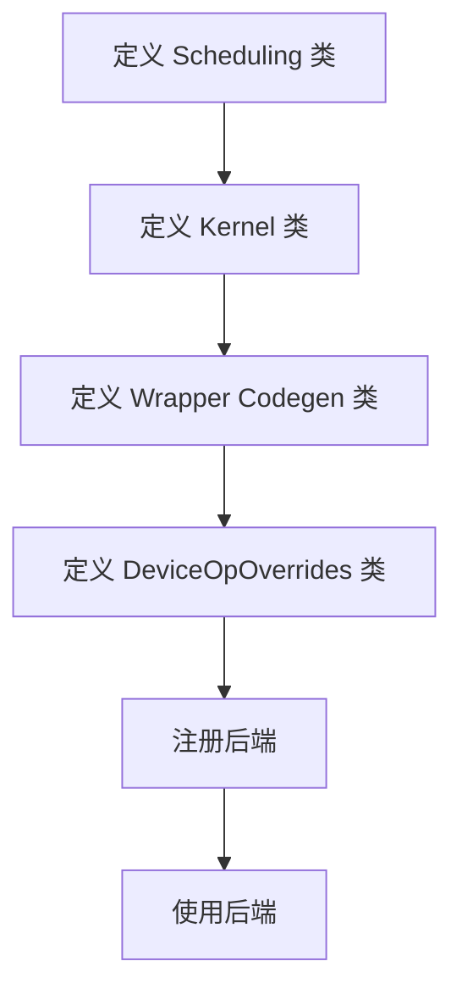
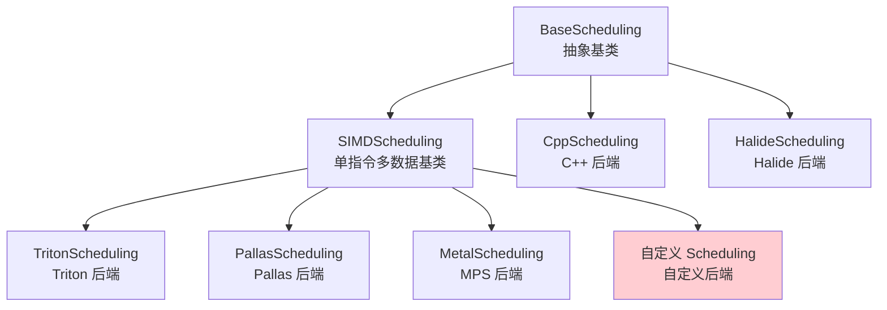

# PyTorch Inductor 后端选择与 IR 优化深度（upstream）

> **页面角色**：Inductor纵向综合参考与模块快照。
> **原始基线**：baseline-unknown；**当前审计基线**：PyTorch `e8f97c1a6ef8cbcdd0a946606bc1e924e4f07e52`。
> **课程分工**：本页保留宽口径后端/IR/配置参考；当前Inductor IR、buffer生命周期、Scheduler与codegen主线见 [[19_torch_compile_end_to_end/00_pytorch_graph_series_index]] 的Part IV。

> 聚焦 PyTorch Inductor 中端到端编译管线**未展开**的「后端选择 / IR 设计 / 配置与调优 / 后端扩展」深度主题，基于 upstream 源码分析。
>
> 端到端 stage-by-stage 编译流程（Dynamo → AOT Autograd → Decomposition → FX Passes → Lowering → Scheduler → CodeGen）分散在 04_inductor 目录各阶段专题页（[[pre_grad_passes_guide]]/[[joint_graph_passes_guide]]/[[post_grad_passes_guide]]/[[decomposition_passes_guide]]/[[fx_lowering_to_inductor_ir_analysis]]/[[scheduler_analysis]]/[[inductor_codegen_analysis]]，导航见 [[02_compile_stack/04_inductor/index]]）；compile_fx 顶层编排入口见 [[inductor_compile_fx_orchestration_analysis]]。本文聚焦其未深入的 **后端/IR/配置** 深度，不重复 stage 走读。
>
> NPU / 昇腾（Ascend）后端适配见 npu/[[NPU_Inductor_Backend_Analysis]]。

---

## 目录
1. [概述与定位](#概述与定位)
2. [后端选择与配置机制](#后端选择与配置机制)
3. [Inductor IR 数据结构设计](#inductor-ir-数据结构设计)
4. [IR 优化（一）：融合成本模型与自动调优](#ir-优化一融合成本模型与自动调优)
5. [IR 优化（二）：常量折叠](#ir-优化二常量折叠)
6. [内存规划与内存池策略](#内存规划与内存池策略)
7. [CUDA Graphs 集成](#cuda-graphs-集成)
8. [后端扩展机制](#后端扩展机制)
9. [自定义融合规则](#自定义融合规则)
10. [参考资源](#参考资源)
11. [附录：源码文件路径](#附录源码文件路径)

---

## 概述与定位

PyTorch Inductor 是 PyTorch 2.0 引入的默认深度学习编译器后端，负责将捕获的 FX Graph 编译成高性能的机器代码。其编译管线分为四个阶段：



各阶段**过程性走读**（每个阶段做了什么、关键 Pass、调用链）已在 04_inductor 目录各专题页（[[pre_grad_passes_guide]]/[[joint_graph_passes_guide]]/[[post_grad_passes_guide]]/[[decomposition_passes_guide]]/[[fx_lowering_to_inductor_ir_analysis]]/[[scheduler_analysis]]/[[inductor_codegen_analysis]]）中逐一覆盖，本文不再重复。本文聚焦以下贯穿/纵深主题：

- **§2 后端选择与配置机制**：`device_codegens` 注册表、`register_backend_for_device`、配置系统与编译模式——决定了「用哪个后端、以什么配置编译」。
- **§3 Inductor IR 数据结构设计**：`TensorBox`/`Buffer`/`Loops`/`Pointwise`/`Reduction`/`View` 等核心 IR 节点的继承关系与职责。
- **§4 / §5 IR 优化深度**：融合成本模型、坐标下降（coordinate descent）自动调优、Triton heuristics 配置、常量折叠（含 shape-dependent 常量与 SymInt 传播）。
- **§6 内存规划与内存池策略**：buffer 生命周期分析、复用组、`memory_planning` / `memory_pool` 配置。
- **§7 CUDA Graphs 集成**：`reduce-overhead` 模式、mutation 约束、与图分区的配合。
- **§8 后端扩展机制**：为一个新硬件后端实现 Scheduling / Kernel / Wrapper / DeviceOpOverrides 并注册的完整步骤。
- **§9 自定义融合规则**：通过模式匹配 + Triton Template 注册自定义融合 kernel。

---

## 后端选择与配置机制

### 1. 后端注册机制

后端注册的核心实现在 [torch/_inductor/codegen/common.py](file:///e:\97-codes\torch_parallel\pytorch\torch\_inductor\codegen\common.py#L408)：



> **注意**：每个设备在 `device_codegens` 中只注册一个 scheduling 实现。CPU/CUDA 的具体 scheduling 类型取决于 `config.cpu_backend` 和 `config.cuda_backend` 配置。例如 CPU 默认使用 `CppScheduling`（`cpu_backend="cpp"`），CUDA 默认使用 `TritonScheduling`（`cuda_backend="triton"`），可通过配置切换为 `HalideScheduling` 或 `PallasScheduling`。

### 2. 后端注册与选择接口

**注册后端**（[common.py:408](file:///e:\97-codes\torch_parallel\pytorch\torch\_inductor\codegen\common.py#L408)）：

```python
def register_backend_for_device(
    device: str,
    device_scheduling: SchedulingConstructor,
    device_wrapper_codegen: WrapperConstructor,
    device_cpp_wrapper_codegen: Optional[WrapperConstructor] = None,
    device_fx_wrapper_codegen: Optional[WrapperConstructor] = None,
    device_custom_pass: Optional[CustomGraphModulePass] = None,
    device_custom_config: Optional[ConfigModule] = None,
) -> None:
    ...
```

**获取 Scheduling**（[common.py:473](file:///e:\97-codes\torch_parallel\pytorch\torch\_inductor\codegen\common.py#L473)）：

```python
def get_scheduling_for_device(device: str) -> Optional[SchedulingConstructor]:
    if device in device_codegens:
        return device_codegens[device].scheduling
    return None
```

**获取 Wrapper Codegen**（[common.py:477](file:///e:\97-codes\torch_parallel\pytorch\torch\_inductor\codegen\common.py#L477)）：

```python
def get_wrapper_codegen_for_device(
    device: str, cpp_wrapper: bool = False, fx_wrapper: bool = False
) -> Optional[WrapperConstructor]:
    if device in device_codegens:
        wrapper_codegen_obj: DeviceCodegen = device_codegens[device]
        if fx_wrapper:
            return wrapper_codegen_obj.fx_wrapper_codegen
        elif cpp_wrapper:
            return wrapper_codegen_obj.cpp_wrapper_codegen
        else:
            return wrapper_codegen_obj.wrapper_codegen
    return None
```

### 3. 配置系统

配置系统在 [torch/_inductor/config.py](file:///e:\97-codes\torch_parallel\pytorch\torch\_inductor\config.py) 中定义：

```python
# CPU 后端选择（默认 cpp）
cpu_backend: Literal["cpp", "triton", "halide", "pallas"] = "cpp"

# CUDA 后端选择
cuda_backend: Literal["triton", "halide", "pallas"] = "triton"

# 使用 C++ wrapper
cpp_wrapper: bool = os.environ.get("TORCHINDUCTOR_CPP_WRAPPER", "0") == "1"

# 使用 FX wrapper
fx_wrapper: bool = os.environ.get("TORCHINDUCTOR_FX_WRAPPER", "0") == "1"

# 内存规划
memory_planning: bool = os.environ.get("TORCHINDUCTOR_MEMORY_PLANNING", "0") == "1"

# 内存池策略
memory_pool: Literal["none", "intermediates", "outputs", "combined"] = "intermediates"
```

> `memory_planning` 与 `memory_pool` 的语义与作用见 §6 内存规划与内存池策略。

### 4. 模式选择

在 [torch/_inductor/__init__.py](file:///e:\97-codes\torch_parallel\pytorch\torch\_inductor\__init__.py#L351) 中定义了不同的编译模式：

```python
mode_options: dict[str, dict[str, bool]] = {
    "default": {},
    # lite backend for opt-in optimizations
    "lite": lite_mode_options,
    # enable cudagraphs
    "reduce-overhead": {
        "triton.cudagraphs": True,
    },
    # enable max-autotune
    "max-autotune-no-cudagraphs": {
        "max_autotune": True,
        "coordinate_descent_tuning": True,
    },
    # enable max-autotune
    # enable cudagraphs
    "max-autotune": {
        "max_autotune": True,
        "triton.cudagraphs": True,
        "coordinate_descent_tuning": True,
    },
}
```

使用方式：

```python
# 启用 CUDA Graphs
compiled_model = torch.compile(model, mode="reduce-overhead")

# 启用最大自动调优
compiled_model = torch.compile(model, mode="max-autotune")

# 自定义配置
compiled_model = torch.compile(
    model,
    options={
        "triton.cudagraphs": True,
        "max_autotune": True,
    }
)
```

> `max_autotune` / `coordinate_descent_tuning` 的内部机制见 §4；`triton.cudagraphs` 见 §7。

---

## Inductor IR 数据结构设计
阶段1 Graph Lowering（FX Graph → Inductor IR）的**过程性走读**（`GraphLowering.run_node`、placeholder/call_function 分派、符号形状与 mutation 处理）见 [[fx_lowering_to_inductor_ir_analysis]]。此处只剖析 Lowering 产物——Inductor IR 的核心数据结构设计。

> **注**：以下结构为简化模型（illustrative），实际实现请以源码为准。类名和成员可能与源码有细微差别，例如 Pointwise 的实现细节、View 存储 offset 的具体形式、Buffer 是否携带 is_constant 标记等。

核心 IR 结构在 [torch/_inductor/ir.py](file:///e:\97-codes\torch_parallel\pytorch\torch\_inductor\ir.py#L1)：



> **继承关系说明**：
> - `TensorBox` → `MutableBox` → `IRNode`（非直接继承 IRNode）
> - `Buffer` → `IRNode` + `CodegenSymbol`（多继承）
> - `View` → `GenericView` → `BaseView` → `IRNode`
> - `Pointwise` → `Loops` → `IRNode`
> - `Reduction` → `Loops` → `IRNode`

> `TensorBox`/`StorageBox` 如何用「指针摆动（swing）」将 in-place mutation 函数化，以及 `ComputedBuffer`/`ExternKernel`/`FallbackKernel`/`TemplateBuffer` 的职责，见 [[fx_lowering_to_inductor_ir_analysis]]。

---

## IR 优化（一）：融合成本模型与自动调优
> 阶段2/3 中 Scheduler 的拓扑排序、`can_fuse`/`can_fuse_vertical`、`score_fusion_memory` 等**融合决策流程**见 [[scheduler_analysis]]。本节聚焦其未深入的**成本模型与自动调优实现**。

### 成本模型评估

Inductor 的融合决策结合了多种成本评估方法：

1. **简单成本模型**：操作计数 + 内存字节数
2. **内存访问分析**：估算 memory traffic、register pressure、L2 使用
3. **Warp 利用率**：评估 GPU warp 的利用效率
4. **Tile 大小优化**：通过自动调优选择最优 tile 配置

**核心实现**（[torch/_inductor/runtime/coordinate_descent_tuner.py](file:///e:\97-codes\torch_parallel\pytorch\torch\_inductor\runtime\coordinate_descent_tuner.py)）：

```python
class CoordescTuner:
    """
    Coordinate Descent Tuner for Triton kernels

    使用坐标下降算法优化 tile 大小、num_warps、num_stages 等参数
    """

    def __init__(
        self,
        is_mm=False,
        is_native_matmul=False,
        is_mix_order_reduction=False,
        name="unknown",
        size_hints=None,
        inductor_meta=None,
        frozen_fields=None,
    ):
        self.is_mm = is_mm
        self.is_native_matmul = is_native_matmul
        self.is_mix_order_reduction = is_mix_order_reduction
        self.cached_benchmark_results = {}
        self.name = name
        self.size_hints = size_hints
        self.inductor_meta = inductor_meta or {}
        self.frozen_fields = OrderedSet(frozen_fields or [])

    def autotune(
        self,
        func: Callable[["triton.Config"], float],
        baseline_config: "triton.Config",
        baseline_timing: float | None = None,
    ) -> "triton.Config":
        """
        使用坐标下降算法自动调优

        算法流程：
        1. 从 baseline config 开始
        2. 逐个优化每个可调参数（BLOCK_X, BLOCK_Y, num_warps, num_stages）
        3. 对每个参数，尝试增大和减小
        4. 如果找到更好的配置，更新 baseline
        5. 重复直到没有改进
        """
        if baseline_timing is None:
            baseline_timing = self.call_func(func, baseline_config)

        improved = True
        best_config = baseline_config
        best_timing = baseline_timing
        tunable_fields = self.tunable_fields

        while improved:
            improved = False

            for name in tunable_fields:
                cur_val = get_field(best_config, name)
                candidate_values = self.get_neighbour_values(name, cur_val)

                for new_val in candidate_values:
                    new_config = set_field(best_config, name, new_val)
                    if not self.is_valid_config(new_config):
                        continue

                    new_timing = self.call_func(func, new_config)
                    if self.has_improvement(best_timing, new_timing):
                        best_config = new_config
                        best_timing = new_timing
                        improved = True

        return best_config

    @staticmethod
    def has_improvement(baseline, test):
        threshold = 0.001  # 0.1% improvement threshold
        return test is not None and test < baseline * (1 - threshold)
```

**Triton Heuristics**（[torch/_inductor/runtime/triton_heuristics.py](file:///e:\97-codes\torch_parallel\pytorch\torch\_inductor\runtime\triton_heuristics.py)）：

```python
def pointwise(
    size_hints,
    triton_meta,
    tile_hint=None,
    filename=None,
    min_elem_per_thread=0,
    inductor_meta=None,
):
    """
    为 pointwise 操作构造 @triton.heuristics() 配置

    基于大小提示生成多个候选配置，然后通过自动调优选择最优
    """
    numel = functools.reduce(operator.mul, size_hints.values())
    bs = max(256, min(numel // 128, 1024))

    # 生成多个候选配置
    configs = [
        triton_config_with_settings(size_hints, bs, num_elements_per_warp=256),
        triton_config_with_settings(size_hints, bs // 2, num_elements_per_warp=64),
        *hinted_configs,
    ]

    return configs
```

**配置选项**（[torch/_inductor/config.py](file:///e:\97-codes\torch_parallel\pytorch\torch\_inductor\config.py)）：

```python
# 启用坐标下降调优
coordinate_descent_tuning = (
    os.environ.get("TORCHINDUCTOR_COORDINATE_DESCENT_TUNING") == "1"
)

# 坐标下降搜索半径
coordinate_descent_search_radius = int(
    os.environ.get("TORCHINDUCTOR_COORDINATE_DESCENT_RADIUS", "1")
)

# 检查所有方向
coordinate_descent_check_all_directions = (
    os.environ.get("TORCHINDUCTOR_COORDINATE_DESCENT_CHECK_ALL_DIRECTIONS") == "1"
)

# 最大融合大小
max_fusion_size = 64

# 融合内存阈值
score_fusion_memory_threshold = 10
```

**自动调优模式**：

```python
# 模式1: 默认模式（无自动调优）
model = torch.compile(model, mode="default")

# 模式2: 最大自动调优（包含坐标下降调优）
model = torch.compile(model, mode="max-autotune")

# 模式3: 最大自动调优 + CUDA Graphs
model = torch.compile(model, mode="max-autotune")

# 模式4: 仅坐标下降调优（无 CUDA Graphs）
model = torch.compile(model, mode="max-autotune-no-cudagraphs")

# 自定义配置
model = torch.compile(
    model,
    options={
        "max_autotune": True,
        "coordinate_descent_tuning": True,
        "triton.cudagraphs": True,
    }
)
```

**性能收益评估示例**：

```python
# 假设有两个 pointwise 操作：add 和 relu
# Inductor 会评估融合的性能收益

# 不融合的情况：
# - 两次 kernel launch
# - 中间结果需要写入内存
# - 总内存访问: 2 * read + 2 * write

# 融合的情况：
# - 一次 kernel launch
# - 中间结果保存在寄存器
# - 总内存访问: 1 * read + 1 * write
# - 寄存器压力增加

# Inductor 会计算：
# - memory_saved = (2 * read + 2 * write) - (1 * read + 1 * write)
# - register_pressure = fused_register_usage - max(individual_register_usage)
# - 如果 memory_saved > threshold 且 register_pressure < limit，则融合
```

### Tile 大小优化

```python
# 对于矩阵乘法，Inductor 会优化 tile 大小
# 候选配置：
# - BLOCK_M: [16, 32, 64, 128, 256]
# - BLOCK_N: [16, 32, 64, 128, 256]
# - BLOCK_K: [16, 32, 64]
# - num_stages: [1, 2, 3, 4, 5]
# - num_warps: [1, 2, 4, 8]

# 通过自动调优选择最优配置
# 评估指标：
# - 执行时间
# - 内存带宽利用率
# - 计算吞吐量
# - 寄存器使用率
```

---

## IR 优化（二）：常量折叠

常量折叠实现在 [torch/_inductor/constant_folding.py](file:///e:\97-codes\torch_parallel\pytorch\torch\_inductor\constant_folding.py)：



**常量折叠与 Shape Dependent 常量**

常量折叠在处理动态形状时需要格外小心：

1. **Shape Dependent 常量**：基于输入形状计算的参数不可随意上移
2. **SizeVars 更新**：折叠后必须更新 sizevars 和 guards
3. **Graph Partition 影响**：某些常量折叠可能触发重新调度

**核心实现**（[torch/_inductor/constant_folding.py:73](file:///e:\97-codes\torch_parallel\pytorch\torch\_inductor\constant_folding.py#L73)）：

```python
class ConstantFolder(torch.fx.Interpreter):
    def __init__(
        self,
        gm: torch.fx.GraphModule,
        skip_constructors: bool = False,
        lifted_constant_names: Optional[list[str]] = None,
        skip_folding_node_fn: Optional[Callable[[torch.fx.Node], bool]] = None,
    ) -> None:
        super().__init__(gm)
        self.node_replacements: dict[torch.fx.Node, Any] = {}
        self.replaced_uses: dict[torch.fx.Node, int] = collections.Counter()
        self.unknown_value = object()
        self.skip_constructors: bool = skip_constructors
        self.lifted_constant_names = lifted_constant_names
        self.skip_folding_node_fn = skip_folding_node_fn

    def _support_dynamic_shape(self) -> bool:
        # ConstantFolder 目前不支持动态形状
        return False

    def _deduce_value(self, node: torch.fx.Node) -> Any:
        """
        推导节点的值，考虑动态形状的限制
        """
        if self.lifted_constant_names is None:
            return super().run_node(node)

        # 如果有 lifted_constant_names，没有具体值可用
        # 只检查所有输入是否有值
        if self.skip_folding_node_fn is not None and self.skip_folding_node_fn(node):
            return self.unknown_value

        flattened_node_inps = pytree.arg_tree_leaves(*node.args, **node.kwargs)
        for inp in flattened_node_inps:
            if (
                isinstance(inp, torch.fx.Node)
                and inp.name not in (self.lifted_constant_names or ())
                and self.env[inp] != self.deferred_value
            ):
                return self.unknown_value
        return self.deferred_value
```

**Shape Dependent 常量示例**：

```python
# 原始代码
def model(x):
    # x.shape 是 shape dependent 常量
    batch_size = x.shape[0]
    # 这个常量不能随意上移，因为它依赖于输入形状
    y = torch.full((batch_size,), 1.0)
    return y

# 常量折叠后的处理
# Inductor 会：
# 1. 识别 batch_size 为 shape dependent 常量
# 2. 在编译时保留符号表达式
# 3. 在运行时通过 guard 确保形状一致性
# 4. 生成正确的 Triton kernel 代码
```

**常量折叠与 SymInt 传播**：

在 [torch/_inductor/fx_passes/joint_graph.py:408](file:///e:\97-codes\torch_parallel\pytorch\torch\_inductor\fx_passes\joint_graph.py#L408) 中有专门的注释说明：

```python
# note: [constant folding refining of symints]
# constant folding will partially evaluate a graph such that values which have
# dependencies which are entirely known at compile time may also become compile
# time constants. in some cases, this will include symints which we had not yet
# previously deduced are guaranteed a constant value and is then deduced in
# constant folding. an example is:
# unbacked_symint_eq_11 = torch.full((), 11).item()
# torch.full((unbacked_symint_eq_11,), 0)
```

这意味着常量折叠可以：
- 部分评估图，使完全已知的依赖成为编译时常量
- 推导出之前未知的 SymInt 常量值
- 更新 SizeVarAllocator 中的 replacements 和 guards

> joint graph 阶段的 `constant_fold_uniform_value`（`UniformValueConstantFolder`）与其它常量相关 pass，见 [[joint_graph_passes_guide]]。

---

## 内存规划与内存池策略
内存规划实现在 [torch/_inductor/memory.py](file:///e:\97-codes\torch_parallel\pytorch\torch\_inductor\memory.py)，由 §2.3 中的 `memory_planning` 开关与 `memory_pool` 策略控制：

- `memory_planning`（默认关闭，`TORCHINDUCTOR_MEMORY_PLANNING=1` 开启）：启用静态内存规划，预先分配并复用 buffer，降低运行时分配开销与峰值内存。
- `memory_pool`（默认 `intermediates`）：决定哪些 buffer 进入复用池。
  - `none`：不做池化复用
  - `intermediates`：仅复用中间结果 buffer
  - `outputs`：复用输出 buffer
  - `combined`：中间结果与输出统一池化

内存分配流程：



核心思想是把 buffer 复用建模为**区间图着色**问题：分析每个 buffer 的生命周期区间（创建点 → 最后使用点），生命周期不重叠的 buffer 可以共享同一块内存（同一「复用组」），从而最小化总内存占用。

> Scheduler 侧的峰值内存重排序（`reorder_for_peak_memory`）与死节点消除见 [[scheduler_analysis]]；本节聚焦内存规划/内存池的策略与配置维度。

---

## CUDA Graphs 集成

CUDA Graphs 通过**录制一次 kernel launch 序列并重放**来消除反复的 host 端 launch 开销，对小算子密集、CPU 成为瓶颈的场景收益显著。在 Inductor 中通过 `mode="reduce-overhead"`（等价于 `triton.cudagraphs=True`，见 §2.4）启用，核心实现位于 [torch/_inductor/cudagraph_trees.py](file:///e:\97-codes\torch_parallel\pytorch\torch\_inductor\cudagraph_trees.py)。

### Mutation 约束

在启用 CUDA Graphs 时，mutation 处理更加严格：

```python
# CUDA Graphs 要求所有张量地址在录制时固定
# 如果检测到 mutation，Inductor 会：
# 1. 在 wrapper 中生成必要的设备守卫
# 2. 确保内存分配在录制前完成
# 3. 避免在 CUDA Graph 执行期间重新分配内存
```

由于 CUDA Graph 录制的是固定的设备地址序列，任何在重放期间发生的动态内存重分配都会破坏图的正确性。因此 Inductor 在生成 wrapper 时会确保输入/中间 buffer 的地址在录制前就位，并对 mutation 做相应的输入保护（必要时 clone）。

### 与图分区的配合

CUDA Graphs 并不支持所有操作（如 CPU 算子、设备间拷贝、动态形状算子、条件操作等）。Inductor 通过 **graph partition** 将「CUDA-Graph 安全」的操作隔离进可被录制的子图，其余操作单独执行。分区的判定（`should_partition`）与子图生成（`_codegen_partitions`）机制详见 [[scheduler_analysis]]，此处不再展开。

---

## 后端扩展机制

本节给出**为一个新硬件后端**实现并注册 Inductor 代码生成栈的完整步骤。这是 §2 后端选择机制的「写入端」——§2 讲如何查表选择后端，本节讲如何把一个后端写进 `device_codegens`。

### 1. 后端架构概览



### 2. 核心数据结构

**后端注册数据结构**（[torch/_inductor/codegen/common.py:313](file:///e:\97-codes\torch_parallel\pytorch\torch\_inductor\codegen\common.py#L313)）：



### 3. 增加硬件后端的步骤



#### 步骤1: 定义 Scheduling 类

**Scheduling 类职责**：
- 生成 kernel 代码
- 处理融合决策
- 管理内存布局

**基类继承层次**：



**示例：创建自定义 Scheduling 类**

```python
# mydevice_inductor/scheduling.py

import torch
from torch._inductor.codegen.simd import SIMDScheduling
from torch._inductor.codegen.common import BackendFeature
from torch.utils._ordered_set import OrderedSet

class MyDeviceScheduling(SIMDScheduling):
    """
    自定义设备 Scheduling 类
    继承自 SIMDScheduling 以获得基础功能
    """

    # 定义 kernel 类型
    kernel_type: type[Any] = MyDeviceKernel

    # 定义后端特性
    backend_features = OrderedSet([
        BackendFeature.FOREACH,
        BackendFeature.BUCKETIZE,
        BackendFeature.INPLACE_BUFFERS,
        BackendFeature.MASKED_SCATTER_WITH_INDEX,
        BackendFeature.SCAN,
        BackendFeature.SORT,
        BackendFeature.TRITON_TEMPLATES,
    ])

    def __init__(self, scheduler: Optional[Scheduler]) -> None:
        super().__init__(scheduler)

        if scheduler is None or not hasattr(scheduler, "nodes"):
            return

        # 初始化设备特定的调试信息
        for node in scheduler.nodes:
            if isinstance(node, (SchedulerNode, FusedSchedulerNode)):
                node.debug_device_str = "mydevice_code"

    @classmethod
    def get_backend_features(cls, device: torch.device):
        """
        返回后端支持的特性
        """
        return cls.backend_features

    def codegen_kernel(self, name: Optional[str] = None) -> str:
        """
        生成 kernel 代码
        这是核心方法，必须实现
        """
        kernel = MyDeviceKernel(
            scheduler=self.scheduler,
            name=name,
        )
        return kernel.generate()

    def codegen_comment(self, node_schedule, kernel_name=None):
        """
        生成注释代码
        """
        wrapper = V.graph.wrapper_code
        origins, _d_detailed_origins = get_kernel_metadata(node_schedule, wrapper)

        if origins:
            wrapper.make_comment(origins)

        if kernel_name:
            wrapper.make_comment(f"MyDevice Kernel: {kernel_name}")
```

#### 步骤2: 定义 Kernel 类

**Kernel 类职责**：
- 生成具体的 kernel 代码
- 处理索引计算
- 生成加载/存储操作

```python
# mydevice_inductor/kernel/kernel.py

import sympy
from torch._inductor.codegen.common import Kernel, IndentedBuffer
from torch._inductor.virtualized import V

class MyDeviceKernel(Kernel):
    """
    自定义设备 Kernel 类
    """

    def __init__(
        self,
        scheduler: Optional[Scheduler],
        name: Optional[str] = None,
    ):
        super().__init__()
        self.scheduler = scheduler
        self.name = name or f"mydevice_kernel_{uuid.uuid4().hex[:8]}"
        self.code = IndentedBuffer()

    def generate(self) -> str:
        """
        生成完整的 kernel 代码
        """
        # 1. 生成函数定义
        self._codegen_function_def()

        # 2. 生成函数体
        with self.code.indent():
            # 生成索引计算
            self._codegen_indexing()

            # 生成加载操作
            self._codegen_loads()

            # 生成计算操作
            self._codegen_compute()

            # 生成存储操作
            self._codegen_stores()

        return self.code.getvalue()

    def _codegen_function_def(self) -> None:
        """
        生成函数定义
        """
        self.code.writeline("@mydevice.jit")
        self.code.writeline(f"def {self.name}(")

        # 生成参数
        params = self._collect_parameters()
        with self.code.indent():
            for param in params:
                self.code.writeline(f"{param},")

        self.code.writeline("):")

    def _collect_parameters(self) -> List[str]:
        """
        收集 kernel 参数
        """
        params = []

        # 输入指针
        for i, input_tensor in enumerate(self.scheduler.inputs):
            ptr_name = f"ptr_{i}"
            dtype = self._get_dtype_str(input_tensor.dtype)
            params.append(f"{ptr_name}: mydevice.pointer_type({dtype})")

        # 输出指针
        params.append(f"ptr_out: mydevice.pointer_type({dtype})")

        # 形状参数
        for i, dim in enumerate(self.scheduler.output_size):
            params.append(f"n{i}: int")

        # 步长参数
        for i, input_tensor in enumerate(self.scheduler.inputs):
            for j, stride in enumerate(input_tensor.stride):
                params.append(f"stride_{i}_{j}: int")

        return params

    def _codegen_indexing(self) -> None:
        """
        生成索引计算
        """
        # 获取 program ID
        self.code.writeline("pid = mydevice.program_id(axis=0)")

        # 计算每个线程的索引
        if len(self.scheduler.output_size) == 1:
            # 1D
            self.code.writeline("idx = pid * BLOCK_SIZE + mydevice.arange(0, BLOCK_SIZE)")
            self.code.writeline("mask = idx < n0")
        elif len(self.scheduler.output_size) == 2:
            # 2D
            self.code.writeline("pid_m = pid // num_blocks_n")
            self.code.writeline("pid_n = pid % num_blocks_n")
            self.code.writeline("offs_m = pid_m * BLOCK_SIZE_M + mydevice.arange(0, BLOCK_SIZE_M)")
            self.code.writeline("offs_n = pid_n * BLOCK_SIZE_N + mydevice.arange(0, BLOCK_SIZE_N)")
            self.code.writeline("idx = offs_m[:, None] * n1 + offs_n[None, :]")
            self.code.writeline("mask = (offs_m[:, None] < n0) & (offs_n[None, :] < n1)")

    def _codegen_loads(self) -> None:
        """
        生成加载操作
        """
        for i, input_tensor in enumerate(self.scheduler.inputs):
            ptr_name = f"ptr_{i}"

            if len(input_tensor.size) == 1:
                # 1D
                self.code.writeline(f"x{i} = mydevice.load({ptr_name} + idx, mask=mask)")
            elif len(input_tensor.size) == 2:
                # 2D
                self.code.writeline(f"x{i} = mydevice.load({ptr_name} + offs_m[:, None] * stride_{i}_0 + offs_n[None, :] * stride_{i}_1, mask=mask)")

    def _codegen_compute(self) -> None:
        """
        生成计算操作
        """
        # 这里根据具体的操作生成计算代码
        # 例如：逐点运算、归约运算等
        pass

    def _codegen_stores(self) -> None:
        """
        生成存储操作
        """
        if len(self.scheduler.output_size) == 1:
            # 1D
            self.code.writeline(f"mydevice.store(ptr_out + idx, result, mask=mask)")
        elif len(self.scheduler.output_size) == 2:
            # 2D
            self.code.writeline(f"mydevice.store(ptr_out + offs_m[:, None] * n1 + offs_n[None, :], result, mask=mask)")

    def _get_dtype_str(self, dtype: torch.dtype) -> str:
        """
        将 PyTorch dtype 转换为设备 dtype 字符串
        """
        dtype_map = {
            torch.float32: "float32",
            torch.float16: "float16",
            torch.bfloat16: "bfloat16",
            torch.int32: "int32",
            torch.int64: "int64",
            torch.bool: "bool",
        }
        return dtype_map.get(dtype, "float32")
```

#### 步骤3: 定义 Wrapper Codegen 类

**Wrapper Codegen 类职责**：
- 生成调用 kernel 的 wrapper 代码
- 处理内存分配
- 管理设备同步

```python
# mydevice_inductor/wrapper/wrapper.py

import torch
from torch._inductor.codegen.wrapper import PythonWrapperCodegen
from torch._inductor.codegen.common import IndentedBuffer

class MyDeviceWrapperCodegen(PythonWrapperCodegen):
    """
    自定义设备 Wrapper Codegen 类
    继承自 PythonWrapperCodegen 以获得基础功能
    """

    def __init__(self):
        super().__init__()

    def write_header(self) -> None:
        """
        写入文件头（导入语句等）
        """
        super().write_header()

        # 添加设备特定的导入
        self.imports.splice("""
            import mydevice
            import mydevice.language as ml
        """, strip=True)

    def write_get_raw_stream_as(self, name: str) -> None:
        """
        写入获取原始流的代码
        """
        self.imports.writeline(f"from mydevice._C import _get_current_raw_stream as {name}")

    def codegen_device_guard(self, device_idx: int) -> str:
        """
        生成设备守卫代码
        """
        return f"with mydevice.device_guard({device_idx}):"

    def codegen_synchronize(self) -> str:
        """
        生成同步代码
        """
        return "mydevice.synchronize()"

    def codegen_kernel_call(
        self,
        kernel_name: str,
        grid: tuple[int, ...],
        params: List[str],
    ) -> None:
        """
        生成 kernel 调用代码
        """
        self.wrapper_call.writeline(f"{kernel_name}[grid]({', '.join(params)})")
```

#### 步骤4: 定义 DeviceOpOverrides 类

```python
# mydevice_inductor/device_ops/device_ops.py

from torch._inductor.codegen.common import DeviceOpOverrides

class MyDeviceOpOverrides(DeviceOpOverrides):
    """
    自定义设备操作覆盖类
    """

    def import_get_raw_stream_as(self, name: str) -> str:
        """
        导入原始流
        """
        return f"from mydevice._C import _get_current_raw_stream as {name}"

    def set_device(self, device_idx: int) -> str:
        """
        设置设备
        """
        return f"mydevice.set_device({device_idx})"

    def synchronize(self) -> str:
        """
        同步设备
        """
        return "mydevice.synchronize()"

    def device_guard(self, device_idx: int) -> str:
        """
        设备守卫
        """
        return f"mydevice.device_guard({device_idx})"

    def cpp_device_guard(self) -> str:
        """
        C++ 设备守卫
        """
        return f"MYDEVICE_DEVICE_GUARD({device_idx})"

    def kernel_header(self) -> str:
        """
        Kernel 头文件
        """
        return """
        #include <mydevice/mydevice.h>
        #include <mydevice/kernel.h>
        """

    def kernel_driver(self) -> str:
        """
        Kernel 驱动代码
        """
        return """
        namespace mydevice {
            void launch_kernel(...) {
                // MyDevice kernel launch code
            }
        }
        """
```

#### 步骤5: 注册后端

```python
# mydevice_inductor/__init__.py

import torch
from torch._inductor.codegen.common import (
    register_backend_for_device,
)
from .scheduling import MyDeviceScheduling
from .wrapper import MyDeviceWrapperCodegen
from .device_ops import MyDeviceOpOverrides

def register_mydevice_backend():
    """
    注册 MyDevice 后端
    """
    # 1. 注册后端代码生成器
    register_backend_for_device(
        device="mydevice",
        device_scheduling=MyDeviceScheduling,
        device_wrapper_codegen=MyDeviceWrapperCodegen,
        device_cpp_wrapper_codegen=None,  # 如果不需要 C++ wrapper
        device_fx_wrapper_codegen=None,  # 如果不需要 FX wrapper
        device_custom_pass=None,  # 自定义 graph pass（可选）
        device_custom_config=None,  # 自定义配置模块（可选）
    )

    # 2. 注册设备操作覆盖
    register_device_op_overrides("mydevice", MyDeviceOpOverrides())

# 自动注册
register_mydevice_backend()
```

#### 步骤6: 使用后端

```python
# 使用 MyDevice 后端

import torch

# 方法1: 指定后端
model = torch.compile(
    model,
    backend="inductor",
    options={
        "device": "mydevice",
    }
)

# 方法2: 在 MyDevice 上创建张量
x = torch.randn(1024, 1024, device="mydevice")

# 方法3: 使用 torch.compile
@torch.compile(backend="inductor")
def model(x):
    return torch.sin(x) + torch.cos(x)

# 在 MyDevice 上执行
x = torch.randn(1024, 1024, device="mydevice")
y = model(x)
```

> 一个真实的第三方后端实现（昇腾 NPU 的 `NPUDeviceOpOverrides` 注册、补丁与 RNG 适配）见 npu/[[NPU_Inductor_Backend_Analysis]]。

---

## 自定义融合规则

> **注**：本节 `addmulnorm` 教程及其注册、template、多输出、fallback、调试 API/命令未在当前固定基线验证,不能作为当前实现或可执行 recipe;整节保留仅作历史材料并维持 unresolved quarantine。

### 1. 融合规则概述

Inductor 支持通过模式匹配和 Triton Template 来实现自定义的融合规则。融合规则可以将多个操作合并到一个 kernel 中，减少内存访问和 kernel launch 开销。

**融合规则的核心组件**：

1. **模式匹配**：使用 `register_lowering_pattern` 定义要匹配的计算图模式
2. **Triton Template**：定义融合的 Triton kernel 代码
3. **自动调优**：使用 `autotune_select_algorithm` 自动选择最优配置
4. **回退机制**：当条件不满足时，回退到非融合的逐个操作

### 2. 融合规则实现步骤

> **注**：以下以 `addmulnorm` 融合规则（`norm((a + b) * c)`）为例说明实现步骤，这是一个**教学示例**。实际开发中请参考 `torch/_inductor/kernel/mm_plus_mm.py` 等现有融合规则实现。

#### 步骤1: 创建融合规则文件

创建 `torch/_inductor/kernel/addmulnorm.py`：

```python
# mypy: allow-untyped-defs

import logging
from typing import TYPE_CHECKING

import torch
import triton
import triton.language as tl

from .. import config as inductor_config
from ..lowering import lowerings
from ..select_algorithm import (
    autotune_select_algorithm,
    TritonTemplate,
)
from ..utils import use_triton_template
from ..virtualized import V

if TYPE_CHECKING:
    from torch._inductor.ir import ChoiceCaller

log = logging.getLogger(__name__)

aten = torch.ops.aten

# 定义 Triton Template
addmulnorm_template = TritonTemplate(
    name="addmulnorm",
    grid=lambda M, N, BLOCK_M, BLOCK_N: (
        triton.cdiv(M, BLOCK_M),
        triton.cdiv(N, BLOCK_N),
    ),
    debug=False,
    source=r"""
{{def_kernel("a", "b", "c", "out")}}
    M = {{size("a", 0)}}
    N = {{size("a", 1)}}
    
    stride_a_m = {{stride("a", 0)}}
    stride_a_n = {{stride("a", 1)}}
    stride_b_m = {{stride("b", 0)}}
    stride_b_n = {{stride("b", 1)}}
    stride_c = {{stride("c", 0)}}
    stride_out = {{stride("out", 0)}}

    # 获取程序 ID
    pid_m = tl.program_id(0)
    pid_n = tl.program_id(1)

    # 计算线程块内索引
    rm = pid_m * BLOCK_M + tl.arange(0, BLOCK_M)
    rn = pid_n * BLOCK_N + tl.arange(0, BLOCK_N)

    # 计算掩码
    mask = (rm[:, None] < M) & (rn[None, :] < N)

    # 加载输入
    a = tl.load(a + rm[:, None] * stride_a_m + rn[None, :] * stride_a_n, mask=mask)
    b = tl.load(b + rm[:, None] * stride_b_m + rn[None, :] * stride_b_n, mask=mask)
    c = tl.load(c + rm[None, :] * stride_c, mask=mask)

    # 融合计算：out = norm((a + b) * c)
    # Step 1: add
    add_result = a + b
    
    # Step 2: mul
    mul_result = add_result * c
    
    # Step 3: norm (LayerNorm)
    # 计算均值
    mean = tl.sum(mul_result, axis=1, keepdims=True) / N
    
    # 计算方差
    var = tl.sum((mul_result - mean) ** 2, axis=1, keepdims=True) / N
    
    # 计算 epsilon
    eps = 1e-5
    
    # 归一化
    norm_result = (mul_result - mean) / tl.sqrt(var + eps)
    
    # 存储
    tl.store(out + rm[:, None] * stride_out + rn[None, :], norm_result, mask=mask)
""",
    cache_codegen_enabled_for_template=True,
)

def tuned_addmulnorm(a, b, c, *, layout=None):
    """
    融合计算：norm((a + b) * c)
    
    等价于：
        x = a + b
        y = x * c
        out = norm(y)
    """
    # 检查形状兼容性
    if not V.graph.sizevars.statically_known_list_equals(a.get_size(), b.get_size()):
        # 形状不匹配，回退到非融合版本
        x = lowerings[aten.add](a, b)
        y = lowerings[aten.mul](x, c)
        return lowerings[aten.native_layer_norm](y, [c.get_size()[-1]], None, None, 1e-5)[0]

    # 检查是否应该使用融合
    if not inductor_config.max_autotune:
        # 如果没有启用自动调优，回退到非融合版本
        x = lowerings[aten.add](a, b)
        y = lowerings[aten.mul](x, c)
        return lowerings[aten.native_layer_norm](y, [c.get_size()[-1] if hasattr(c, 'get_size') else 1], None, None, 1e-5)[0]

    # 收集可用的模板
    choices = []
    
    if use_triton_template(layout, check_max_autotune=False):
        choices.append(addmulnorm_template)

    # 自动选择最优算法
    return autotune_select_algorithm(
        "addmulnorm", choices, [a, b, c], layout
    )
```

#### 步骤2: 注册模式匹配规则

在 `torch/_inductor/fx_passes/post_grad.py` 中添加：

```python
# 在文件开头的 import 部分添加
from ..kernel import addmulnorm

# 定义 extra_check 函数
def is_valid_addmulnorm(match: Match):
    """
    检查 addmulnorm 模式是否有效
    
    匹配模式：
        x = a + b
        y = x * c
        out = norm(y)
    """
    if not (config.max_autotune or config.max_autotune_gemm):
        return False

    # 检查所有必需的值是否存在
    a_val = match.kwargs.get("a", {}).meta.get("val") if hasattr(match.kwargs.get("a", {}), 'meta') else None
    b_val = match.kwargs.get("b", {}).meta.get("val") if hasattr(match.kwargs.get("b", {}), 'meta') else None
    c_val = match.kwargs.get("c", {}).meta.get("val") if hasattr(match.kwargs.get("c", {}), 'meta') else None

    if a_val is None or b_val is None or c_val is None:
        return False

    # 检查形状
    if a_val.shape != b_val.shape:
        return False
    
    # c 应该是标量或者与 a, b 形状相同
    if len(c_val.shape) > 0 and c_val.shape != a_val.shape:
        return False

    # 检查数据类型
    if a_val.dtype != b_val.dtype:
        return False

    return True

# 注册 lowering pattern
@register_lowering_pattern(
    CallFunction(
        aten.native_layer_norm,
        CallFunction(
            aten.mul,
            CallFunction(
                aten.add,
                KeywordArg("a"),
                KeywordArg("b"),
            ),
            KeywordArg("c"),
        ),
        KeywordArg("normalized_shape"),
        Ignored(),  # weight
        Ignored(),  # bias
        Ignored(),  # eps
    ),
    extra_check=is_valid_addmulnorm,
)
def addmulnorm(match: Match, a, b, c, normalized_shape):
    return inductor.kernel.addmulnorm.tuned_addmulnorm(a, b, c)
```

#### 步骤3: 注册到 kernel 模块

在 `torch/_inductor/kernel/__init__.py` 中添加：

```python
from . import addmulnorm
```

### 3. 模式匹配语法

#### 基本模式匹配

```python
# 匹配简单的二元操作
@register_lowering_pattern(
    CallFunction(aten.add, KeywordArg("a"), KeywordArg("b")),
)
def simple_add(match: Match, a, b):
    return inductor.kernel.custom_add.tuned_custom_add(a, b)
```

#### 嵌套模式匹配

```python
# 匹配嵌套操作：add(mul(a, b), c)
@register_lowering_pattern(
    CallFunction(
        aten.add,
        CallFunction(aten.mul, KeywordArg("a"), KeywordArg("b")),
        KeywordArg("c"),
    ),
)
def add_mul(match: Match, a, b, c):
    return inductor.kernel.add_mul.tuned_add_mul(a, b, c)
```

#### 复杂模式匹配

```python
# 匹配更复杂的模式：norm((relu(a) + b) * c)
@register_lowering_pattern(
    CallFunction(
        aten.native_layer_norm,
        CallFunction(
            aten.mul,
            CallFunction(
                aten.add,
                CallFunction(aten.relu, KeywordArg("a")),
                KeywordArg("b"),
            ),
            KeywordArg("c"),
        ),
        KeywordArg("normalized_shape"),
        Ignored(),
        Ignored(),
        Ignored(),
    ),
    extra_check=is_valid_addmulnorm,
)
def addmulnorm_with_relu(match: Match, a, b, c, normalized_shape):
    return inductor.kernel.addmulnorm.tuned_addmulnorm(a, b, c)
```

### 4. 现有融合规则示例

#### mm_plus_mm 融合规则

`mm_plus_mm` 融合规则将两个矩阵乘法的结果相加：`mm(mat1, mat2) + mm(mat3, mat4)`

**模式定义**（[torch/_inductor/fx_passes/post_grad.py:845](file:///e:\97-codes\torch_parallel\pytorch\torch\_inductor\fx_passes\post_grad.py#L845)）：

```python
@register_lowering_pattern(
    CallFunction(
        aten.add,
        CallFunction(aten.mm, KeywordArg("mat1"), KeywordArg("mat2")),
        CallFunction(aten.mm, KeywordArg("mat3"), KeywordArg("mat4")),
    ),
    extra_check=is_valid_mm_plus_mm,
)
def mm_plus_mm(match: Match, mat1, mat2, mat3, mat4):
    return inductor.kernel.mm_plus_mm.tuned_mm_plus_mm(mat1, mat2, mat3, mat4)
```

**Triton Template**（[torch/_inductor/kernel/mm_plus_mm.py:29](file:///e:\97-codes\torch_parallel\pytorch\torch\_inductor\kernel\mm_plus_mm.py#L29)）：

```python
mm_plus_mm_template = TritonTemplate(
    name="mm_plus_mm",
    grid=mm_grid,
    debug=False,
    source=r"""
{{def_kernel("A", "B", "C", "D")}}
    M = {{size("A", 0)}}
    N = {{size("B", 1)}}
    K1 = {{size("A", 1)}}
    # ... 索引计算
    
    acc = tl.zeros((BLOCK_M, BLOCK_N), dtype=ACC_TYPE)
    
    # 第一个矩阵乘法：A @ B
    for k1 in range(K1, 0, -BLOCK_K):
        a = tl.load(A, mask=...)
        b = tl.load(B, mask=...)
        acc += tl.dot(a, b, allow_tf32=ALLOW_TF32)
        A += BLOCK_K * stride_ak
        B += BLOCK_K * stride_bk

    # 第二个矩阵乘法：C @ D
    for k2 in range(K1, 0, -BLOCK_K):
        c = tl.load(C, mask=...)
        d = tl.load(D, mask=...)
        acc += tl.dot(c, d, allow_tf32=ALLOW_TF32)
        C += BLOCK_K * stride_ck
        D += BLOCK_K * stride_dk

    # 存储结果
    {{store_output(("idx_m", "idx_n"), "acc", "mask", ...)}}
""",
)
```

### 5. 使用自定义融合规则

```python
import torch

# 定义模型
class AddMulNormModel(torch.nn.Module):
    def __init__(self):
        super().__init__()
    
    def forward(self, a, b, c):
        x = a + b
        y = x * c
        out = torch.nn.functional.layer_norm(y, [y.size(-1)])
        return out

# 创建模型
model = AddMulNormModel()

# 编译模型（启用自动调优以触发融合）
compiled_model = torch.compile(
    model,
    mode="max-autotune",
    fullgraph=True
)

# 测试
a = torch.randn(1024, 512, device='cuda')
b = torch.randn(1024, 512, device='cuda')
c = torch.randn(1024, 512, device='cuda')

result = compiled_model(a, b, c)
print(result.shape)
```

### 6. 验证融合是否生效

```python
import torch._inductor.config as config

# 启用调试信息
config.debug = True
config.triton.enable_debug = True

# 编译并运行
compiled_model = torch.compile(model, mode="max-autotune")
result = compiled_model(a, b, c)

# 查看生成的代码
# 可以通过环境变量设置：
# TORCHINDUCTOR_DEBUG=1 python your_script.py
```

### 7. 融合规则最佳实践

1. **模式匹配**：
   - 使用 `KeywordArg` 捕获需要传递给 handler 的参数
   - 使用 `Ignored()` 忽略不需要的参数
   - 使用 `extra_check` 添加额外的验证逻辑

2. **Triton Template**：
   - 使用 `{{def_kernel(...)}}` 定义 kernel 参数
   - 使用 `{{size(...)}}` 和 `{{stride(...)}}` 获取张量信息
   - 使用 `{{store_output(...)}}` 存储输出

3. **回退机制**：
   - 在 `tuned_*` 函数中检查条件
   - 条件不满足时回退到非融合版本
   - 确保正确性优先于性能

4. **自动调优**：
   - 使用 `autotune_select_algorithm` 自动选择最优配置
   - 在 `mode="max-autotune"` 下启用
   - 可以添加多个候选配置

---

## 参考资源

### 官方文档
- [PyTorch 2.0 Compilation Tutorial](https://pytorch.org/tutorials/intermediate/torch_compile_tutorial.html)
- [Inductor Dev Documentation](https://pytorch.org/docs/stable/torch.compiler_inductor.html)
- [Triton Language Documentation](https://triton-lang.org/main/index.html)

### 源代码
- PyTorch Inductor: `torch/_inductor/`
- Triton: `triton/python/triton/`

### 论文
- [Triton: An Intermediate Language and Compiler for Tiled Neural Network Computations](https://www.eecs.harvard.edu/~shieber/papers/triton.pdf)
- [PyTorch 2.0: The Journey to Bringing Compilation to PyTorch](https://pytorch.org/blog/pytorch-2.0-compilation/)

---

## 附录：源码文件路径

本文聚焦的 upstream 主题涉及以下 PyTorch Inductor 源码文件：

### 后端选择与配置
- [torch/_inductor/codegen/common.py](file:///e:\97-codes\torch_parallel\pytorch\torch\_inductor\codegen\common.py) - 后端注册（`register_backend_for_device`、`DeviceCodegen`、`DeviceOpOverrides`）
- [torch/_inductor/config.py](file:///e:\97-codes\torch_parallel\pytorch\torch\_inductor\config.py) - 配置系统
- [torch/_inductor/__init__.py](file:///e:\97-codes\torch_parallel\pytorch\torch\_inductor\__init__.py) - 模块初始化与编译模式

### IR 设计
- [torch/_inductor/ir.py](file:///e:\97-codes\torch_parallel\pytorch\torch\_inductor\ir.py) - Inductor IR 定义

### IR 优化与调优
- [torch/_inductor/constant_folding.py](file:///e:\97-codes\torch_parallel\pytorch\torch\_inductor\constant_folding.py) - 常量折叠
- [torch/_inductor/fx_passes/joint_graph.py](file:///e:\97-codes\torch_parallel\pytorch\torch\_inductor\fx_passes\joint_graph.py) - 常量折叠与 SymInt 传播
- [torch/_inductor/runtime/coordinate_descent_tuner.py](file:///e:\97-codes\torch_parallel\pytorch\torch\_inductor\runtime\coordinate_descent_tuner.py) - 坐标下降调优
- [torch/_inductor/runtime/triton_heuristics.py](file:///e:\97-codes\torch_parallel\pytorch\torch\_inductor\runtime\triton_heuristics.py) - Triton 启发式配置
- [torch/_inductor/tiling_utils.py](file:///e:\97-codes\torch_parallel\pytorch\torch\_inductor\tiling_utils.py) - Tiling 分析

### 内存规划
- [torch/_inductor/memory.py](file:///e:\97-codes\torch_parallel\pytorch\torch\_inductor\memory.py) - 内存规划

### CUDA Graphs
- [torch/_inductor/cudagraph_trees.py](file:///e:\97-codes\torch_parallel\pytorch\torch\_inductor\cudagraph_trees.py) - CUDA Graphs 树实现

### 代码生成（后端扩展涉及）
- [torch/_inductor/codegen/triton.py](file:///e:\97-codes\torch_parallel\pytorch\torch\_inductor\codegen\triton.py) - Triton 代码生成
- [torch/_inductor/codegen/wrapper.py](file:///e:\97-codes\torch_parallel\pytorch\torch\_inductor\codegen\wrapper.py) - Wrapper 代码生成
- [torch/_inductor/codegen/simd.py](file:///e:\97-codes\torch_parallel\pytorch\torch\_inductor\codegen\simd.py) - SIMD 调度基类

### 自定义融合规则
- [torch/_inductor/pattern_matcher.py](file:///e:\97-codes\torch_parallel\pytorch\torch\_inductor\pattern_matcher.py) - 模式匹配工具
- [torch/_inductor/select_algorithm.py](file:///e:\97-codes\torch_parallel\pytorch\torch\_inductor\select_algorithm.py) - 算法选择与 autotuning
- [torch/_inductor/kernel/mm_plus_mm.py](file:///e:\97-codes\torch_parallel\pytorch\torch\_inductor\kernel\mm_plus_mm.py) - 现有融合 kernel 示例

> **注**：本文档中的 IR 结构（如 TensorBox、Buffer、View、Pointwise、Reduction 等）为简化模型（illustrative），实际实现请以源码为准。类名和成员可能与源码有细微差别，例如 Pointwise 的实现细节、View 存储 offset 的具体形式、Buffer 是否携带 is_constant 标记等。

---

*文档版本: 3.0（聚焦化重构：纯 upstream，去除与 inductor_compiler_pipeline_analysis 的 stage 走读重复，NPU 内容已迁移至 npu/NPU_Inductor_Backend_Analysis）*
*最后更新: 2026-06-15*
*作者: AI Assistant*

## Related Pages

- [[02_engineering/01_ai_frameworks/index]]
- [[inductor_compile_fx_orchestration_analysis]] — compile_fx 顶层编排入口（本文聚焦后端/IR 深度，不重复 stage 走读——stage 走读见 04_inductor 目录各专题页）
- [[fx_lowering_to_inductor_ir_analysis]] — FX → Inductor IR lowering 详解
- [[scheduler_analysis]] — 调度器与融合决策流程
- [[inductor_codegen_analysis]] — 代码生成策略与 kernel 融合
- [[inductor_memory_management_analysis]] — 内存分配管理全栈三层（本文 §6 内存规划/§7 CUDA Graphs 的源码级展开）
- [[NPU_Inductor_Backend_Analysis]] — 昇腾 NPU 后端适配（本文 NPU 内容迁移目标）
