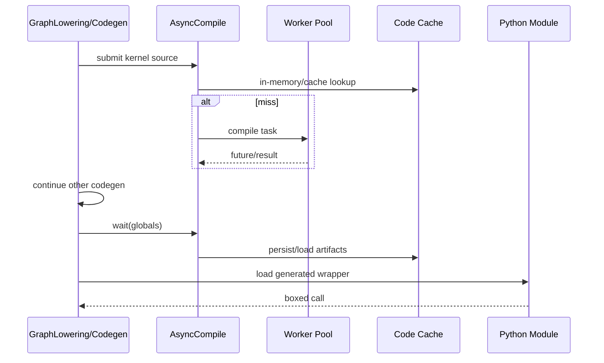

# D03 · Async Compile、Worker Pool 与生成模块装载

> 卷别：D · 编译产物、缓存与运行时  
> 固定源码：PyTorch `e8f97c1a6ef8cbcdd0a946606bc1e924e4f07e52`  
> 前置：[[aot_runtime_wrappers_and_lazy_backward_compile_analysis]]  
> 后续：[[d04_compile_cache_hierarchy_keys_and_invalidation_analysis]]  
> 最后更新：2026-07-28

## 1. 为什么codegen完成不等于可执行

生成Triton/C++/Python wrapper源码后，还可能需要：

- native compiler或Triton编译；
- autotune多个候选；
- linker生成shared library；
- worker把结果传回主进程；
- 写入content-addressed cache；
- Python import/reload；
- shared library load；
- 等待所有futures完成；
- 将kernel对象绑定到wrapper globals。

**核心结论**：Inductor把“生成源码”“异步编译”“产物装载”“返回boxed callable”拆成独立
阶段，以重叠工作和复用cache；任何一个future未完成，callable就尚未真正ready。

## 2. Worker为何既有thread pool又有process pool

`AsyncCompile`说明其职责是用thread pool或Triton用的subprocess pool编译
（`torch/_inductor/async_compile.py:281-299`）。

选择原因：

- Python I/O、外部compiler调用可由threads重叠；
- Triton编译包含CPU密集、隔离和可pickling结果，process更合适；
- process pool可预热，降低first kernel提交延迟；
- 某些profiling backend要求在主进程编译，需同步fallback；
- daemon进程不能再创建普通multiprocessing children。

## 3. Pool生命周期

pool按配置的compile threads惰性创建。process pool可用：

- 受控sidecar `SubprocPool`；
- spawn/fork等multiprocessing context；
- worker initializer。

创建和daemon限制见 `torch/_inductor/async_compile.py:306-335` 与
`torch/_inductor/async_compile.py:336-339`，pool登记和shutdown finalizer
见 `torch/_inductor/async_compile.py:340-353`。

fork后必须清理继承的pool引用和lru cache，否则child会误用parent executor。重置逻辑见
`torch/_inductor/async_compile.py:181-203`。

## 4. 为什么要warm/wakeup而不立即启动全部worker

`warm_pool`触发pool创建；对SubprocPool，sidecar可以先建立，但真正ProcessPoolExecutor等到
`wakeup()`或首个job才初始化（`torch/_inductor/async_compile.py:355-364`）。

`use_process_pool`提交一个ready probe，采用非阻塞状态；需要时另有timeout等待，失败则退化
为serial，而不是无限挂住（`torch/_inductor/async_compile.py:379-394` 与
`torch/_inductor/async_compile.py:397-426` 与
`torch/_inductor/async_compile.py:427-428`）。

这是compile latency、进程开销和鲁棒性的权衡。

## 5. Triton kernel的内存future cache

`CompiledTritonKernels`以完整kernel source加 `torch_key()`哈希为key，value当前是
`CodeCacheFuture`（`torch/_inductor/async_compile.py:227-248`）。

如果同一进程再次看到相同source：

- parallel模式可直接返回同一个future；
- synchronous模式等待 `future.result()`；
- 某些future在parent懒加载kernel；
- 避免重复提交相同编译任务。

命中分支见 `torch/_inductor/async_compile.py:483-499`。

这是**进程内异步任务cache**，不同于磁盘FXGraphCache或Triton自身binary cache。

## 6. Worker和parent之间传什么

Triton异步路径把source/config交给worker。worker：

- 初始化CachingAutotuner；
- 编译候选；
- 返回可pickling的 `TritonCompileResult`；
- 可能带AutotuneCache save hook数据。

某些配置需要parent之后从source重新load function，因此future持有lazy reload callback。
设计说明见 `torch/_inductor/async_compile.py:442-471`。

不应假设worker里创建的Python callable或device module对象可直接跨进程共享。

## 7. 生成Python wrapper怎样装载

`PyCodeCache`：

1. 对source做content-addressed write；
2. 通过key/path reload Python module；
3. 可附加constants等attrs；
4. 缓存无额外attrs的module；
5. 保存source line到FX nodes的linemap。

写入/入口见 `torch/_inductor/codecache.py:4767-4795`，reload和module cache见
`torch/_inductor/codecache.py:4797-4826` 与
`torch/_inductor/codecache.py:4827-4836`。

加载后通常取module的 `call`作为 `CompiledFxGraph.current_callable`。

## 8. 为什么带attrs的module不直接复用

相同source path可能绑定不同constant values。`PyCodeCache`只缓存 `attrs is None`的module；
有attrs时要重新load并设置属性，避免旧constant污染新compiled graph
（`torch/_inductor/codecache.py:4813-4835`）。

这说明source hash相同不一定代表完整runtime state相同，constants绑定是另一层。

## 9. C++产物装载的失败边界

`CppCodeCache`以source和compile flags编译shared library，加载时处理：

- 普通ImportError/OSError；
- libgomp特殊环境；
- temp/cache目录以 `noexec`挂载导致的mapping失败。

错误诊断和替代cache dir提示见 `torch/_inductor/codecache.py:3789-3818` 与
`torch/_inductor/codecache.py:3819-3822`。

native compiler不存在、flags变化、ABI不兼容、library被删除、目录noexec都可能发生在
“源码已经生成”之后。

## 10. Wrapper为何最终等待futures

codegen wrapper会生成对 `async_compile`的提交；在模块初始化或autotune block中等待并把
结果替换到globals。compile-time autotune block显式执行：

```text
async_compile.wait(globals())
del async_compile
```

见 `torch/_inductor/codegen/wrapper.py:2478-2488`。

因此异步的收益是把多个kernel编译相互重叠，或与剩余codegen重叠；在返回可安全执行的
wrapper前，必需结果仍有同步屏障。

## 11. 时序图



## 12. 复杂度

若有 \(K\) 个independent kernels，单核编译时间 \(t_i\)，\(P\) workers：

- 串行约为 \(\sum_i t_i\)；
- 理想并行下界接近 \(\max(\max_i t_i,\sum_i t_i/P)\)；
- 实际还加进程startup、serialization、I/O、load和等待；
- 相同source future hit可近似省去新编译；
- module load至少与source/import工作相关；
- native library load受OS动态链接器和filesystem影响。

## 13. 常见误解

- **“async compile让first call不等待编译。”** 返回可运行wrapper前仍要等待必要future。
- **“worker返回最终runtime callable。”** 常返回可序列化编译结果，parent还要load/bind。
- **“生成了`.py`就证明kernel可执行。”** native/Triton编译和load可能仍失败。
- **“清Dynamo cache会清worker和disk artifacts。”** cache层生命周期彼此独立。
- **“相同Python source module可绑定任意constants后永久复用。”** attrs影响module复用边界。

## 配套 Demo

本页对应卷级入口 `tools/labs_torch_compile/demo_d_artifact_runtime.py` 的 `async_compile_loading` 用例。默认以 CUDA 为验收设备：

```powershell
python -B tools\labs_torch_compile\demo_d_artifact_runtime.py `
  --case async_compile_loading --device cuda `
  --output-dir tools\labs_torch_compile\artifacts\volume_demos\d03
```

先用 `--list --json` 查看用例声明的能力要求。无 CUDA 的机器可把 `--device` 改为 `cpu` 探索设备无关机制；CUDA/Triton/多卡专属用例会返回 `BLOCKED`，且不会执行用例正文。不要把 `BLOCKED` 写成 `PASS`。

重点读取 `summary.json` 与 `async_compile_loading/result.json`：`status` 区分 `PASS/BLOCKED/FAIL`，`environment` 固化运行环境，`observations` 保存本页机制的实测字段，`artifacts` 指向图代码、日志、trace 或进程证据。`PASS` 只表示该次运行中的断言通过，不外推到其他 PyTorch 版本、shape、dtype 或硬件。

## Related Pages

- [[00_torch_compile_end_to_end_index]]
- [[d01_inductor_compile_fx_orchestration_analysis]]
- [[d04_compile_cache_hierarchy_keys_and_invalidation_analysis]]
- [[d07_compiled_artifact_lifecycle_and_runtime_failures_analysis]]
- [[compile_latency_cache_and_steady_state_performance_analysis]]
- [[21_codegen_kernel_mapping_autotuning_and_provenance]]
