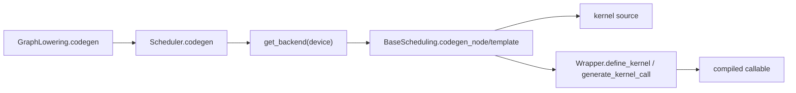

# TorchInductor Codegen 扩展开发指南

> **Created**: 2026-07-22

> **Source baseline**: PyTorch `9922478dffa`，核验 `torch/_inductor/codegen/common.py:318-472,519-617,632-660`、`torch/_inductor/scheduler.py:8479-8497,9470-9505,9713-9850`、`torch/_inductor/graph.py:2620-2637`。
>
> **结论先行**：Codegen 阶段没有“注册一个 FX Pass”的通用接口。接入新设备/新目标代码生成器时，需要同时提供 kernel scheduling/codegen 与 host wrapper，并通过 `register_backend_for_device()` 建立设备映射；仅修改一个已有算子的语义，应优先用 Decomposition/Lowering，而不是新建 Codegen backend。

---

## 1. 是什么

Inductor 最终输出由两部分组成：

1. **Kernel code**：Triton、C++/OpenMP、CUDA C++、Pallas 等目标 kernel；
2. **Wrapper code**：kernel 定义/加载/调用、参数、内存、device guard、stream 与运行时胶水。

固定基线的调用主线是：



`Scheduler.create_backend()` 用 `get_scheduling_for_device(device.type)` 找构造器；普通调度节点最终进入设备 scheduling 的 `codegen_node()`。因此 Codegen 扩展既要能理解 Scheduler 交来的节点，也要能让 Wrapper 发出可执行调用。

---

## 2. 为什么在这里做

只有 Codegen 阶段完整掌握：

- 目标语言/ISA 和 kernel 模板；
- 已决定的融合组、indexing 与 reduction 形态；
- launch 参数、stream、device guard；
- Python/C++/AOT wrapper ABI；
- kernel 编译、加载与调用方式。

适合这里的优化：指令/模板选择、向量化、目标 kernel 生成、launch/wrapper、设备运行时适配。

不适合这里的优化：改变高层数学等价关系、把多个 ATen 节点融合成另一个 op、决定 buffer 依赖或重新划分融合组。这些应分别前移到 FX Pass、Lowering 或 Scheduler。

---

## 3. 关键 API 与职责

| API/类 | 作用 | 必须关注 |
|---|---|---|
| `register_backend_for_device(device, scheduling, wrapper, ...)` | 注册设备到 kernel scheduling 和 wrapper 的映射;还接受两个可选关键字 `device_custom_pass: CustomGraphModulePass \| None` 与 `device_custom_config: ConfigModule \| None`,分别写入独立的全局注册表 `custom_backend_passes`/`custom_backend_codegen_configs`(`torch/_inductor/codegen/common.py:389-418` 与 `:419-434`) | 是 Codegen 后端总入口；内部 API |
| `BaseScheduling` | Scheduler 与设备 kernel codegen 的协议 | fusion feasibility、`codegen_node`、template、flush、feature |
| `PythonWrapperCodegen` | 默认 Python host wrapper 基类 | 可继承并覆盖设备特定定义/调用 |
| `CppWrapper*` / `WrapperFxCodegen` | C++/AOT 与 FX wrapper | 只有支持相应输出模式时才提供 |
| `DeviceOpOverrides` | device guard、stream、header、driver 等代码片段 | 与 kernel scheduling 不同，负责 wrapper 的设备原语 |
| `register_device_op_overrides` | 按设备名注册 overrides | 新设备通常需要和 backend registration 配套 |
| `BackendFeature` / `get_backend_features` | 告知上游该 backend 支持哪些能力 | 不能声明 codegen 实际不支持的 feature |
| `get_scheduling_for_device` | 查询某设备是否已注册 | 重复/覆盖注册前先检查 |

### `BaseScheduling` 的核心方法

| 方法 | 作用 |
|---|---|
| `can_fuse_vertical/horizontal` | 判断两个 scheduler node 是否能在该 backend 融合 |
| `fuse` | 构造融合 scheduler node；默认实现覆盖多种通用节点 |
| `group_fn` | 把 iteration size 变换为 backend 分组形式 |
| `codegen_template` | 为模板节点及 prologue/epilogue 生成 kernel |
| `generate_kernel_code_from_nodes` | 从预融合节点生成源码，供 benchmark/调试等路径使用 |
| `codegen_node` | 普通 fused/single scheduler node 的主生成入口 |
| `codegen_sync` | 生成设备同步代码 |
| `ready_to_flush` / `flush` | 管理聚合 codegen 的提交边界 |
| `get_backend_features` | 返回真实支持的 `BackendFeature` 集合 |

---

## 4. 如何注册一个设备 Codegen 后端

下面展示注册结构，不是一个可独立运行的新设备实现；实际 backend 必须实现所有会被调用的方法，并让 `my_accel` Tensor、runtime、device module 和 lowering 路径先可用。

```python
from torch._inductor.codegen.common import register_backend_for_device
from torch._inductor.codegen.wrapper import PythonWrapperCodegen
from torch._inductor.scheduler import BaseScheduling

class MyScheduling(BaseScheduling):
    def can_fuse_vertical(self, node1, node2):
        return False

    def can_fuse_horizontal(self, node1, node2):
        return False

    def group_fn(self, sizes):
        return tuple(tuple(group) for group in sizes)

    def codegen_node(self, node):
        # 1. 从 node 读取 loop body/依赖/indexing
        # 2. 生成 kernel source
        # 3. 调用 V.graph.wrapper_code.define_kernel(...)
        # 4. 调用 wrapper.generate_kernel_call(...)
        raise NotImplementedError("implement my_accel kernel codegen")

    def codegen_template(self, template_node, epilogue_nodes, prologue_nodes):
        raise NotImplementedError

    def generate_kernel_code_from_nodes(self, nodes, benchmark_kernel, hint_override=None):
        raise NotImplementedError

    def codegen_mix_order_reduction(self, node):
        raise NotImplementedError

    def codegen_nested_reduction(self, node):
        raise NotImplementedError

    def codegen_sync(self):
        raise NotImplementedError

    def flush(self):
        return None

class MyPythonWrapper(PythonWrapperCodegen):
    # 覆盖 kernel 定义、调用、stream/device 等真正不同的部分。
    pass

register_backend_for_device(
    "my_accel",
    MyScheduling,
    MyPythonWrapper,
)
```

注册必须在创建 `GraphLowering`/首次编译目标设备图之前完成。固定基线的 `init_backend_registration()` 会注册 CPU、CUDA、XPU、MPS、MTIA 等内建映射；PrivateUse1 还会尝试从设备模块获取 `Scheduling`、`PythonWrapperCodegen`、`CppWrapperCodegen`、`WrapperFxCodegen`。

上面的示例只传了必须的三个位置参数,但 `register_backend_for_device` 登记的其实是四类东西：device scheduling；Python/C++/FX wrapper constructors；custom graph pass；custom config。后两者容易被忽略——`device_custom_pass`(类型 `CustomGraphModulePass | None`)与 `device_custom_config`(类型 `ConfigModule | None`)是两个独立的可选关键字参数,分别写入模块级全局字典 `custom_backend_passes[device]`/`custom_backend_codegen_configs[device]`,供后端在通用 pass 管线/config 之外挂自己的定制项(`torch/_inductor/codegen/common.py:389-418` 与 `:419-434`);`device_custom_config` 若提供还会被断言必须是 `ConfigModule` 实例且不能与默认 `config` 是同一对象。

> [!warning]
> `register_backend_for_device` 是按 `device.type` 的全局映射。覆盖已有设备会影响进程内所有后续编译，不适合作为局部 Pass 开关；实验时用独立设备名或隔离进程。

---

## 5. DeviceOpOverrides 怎么接

新设备 wrapper 若需要不同的 guard、stream、header 或 driver，应实现 `DeviceOpOverrides` 并注册：

```python
from torch._inductor.codegen.common import (
    DeviceOpOverrides,
    register_device_op_overrides,
)

class MyDeviceOps(DeviceOpOverrides):
    def set_device(self, device_idx: int) -> str:
        return f"my_runtime.set_device({device_idx})"

    def synchronize(self) -> str:
        return "my_runtime.synchronize()"

    def current_stream(self) -> str:
        return "my_runtime.current_stream()"

    # 其余被所选 wrapper 路径调用的方法也必须实现。

register_device_op_overrides("my_accel", MyDeviceOps())
```

不要只根据抽象类列出的方法机械实现。先追踪所选 Python/CPP/FX wrapper 实际调用哪些 overrides，再为每种输出模式补齐并测试。`DeviceOpOverrides` 除上面几个常见方法外，还有一组只在 AOTI/C++/TMA 相关 wrapper 路径下才用到的更专项方法——`cpp_aoti_stream_guard`/`aoti_get_stream`/`tma_descriptor_helpers`/`cpp_scratch` 等（`torch/_inductor/codegen/common.py:321-382`），纯 Python wrapper 场景通常用不到，但支持 AOTInductor 打包时必须补齐。


---

## 6. 复用现有 Codegen 还是新建后端

| 需求 | 选择 |
|---|---|
| 新 op 复用现有 Triton/C++ pointwise/reduction | 写 lowering，复用已有 scheduling/codegen |
| 调用一个厂商库 kernel | 写 `ExternKernel`/fallback/template lowering，复用 wrapper |
| 改某个模板的候选和 autotune | 扩展 template/algorithm selection，不必注册新设备 |
| 同设备混合多个 kernel 技术 | 写 combined scheduling，按节点委派；CUDA/XPU 是参考 |
| 新设备拥有不同 kernel 语言和 runtime ABI | 新 `BaseScheduling` + Wrapper + DeviceOpOverrides |

固定基线的 `CUDACombinedScheduling` 会在 Triton 与 CUDA C++ 等路径间委派，这说明“一个 device 只能有一个 codegen 技术”是错误理解：注册入口是一个 scheduling constructor，内部可以组合多个生成器。

---

## 7. 正确性与性能不变量

1. `can_fuse_*` 返回 True 的组合必须被 `codegen_node` 正确支持；能力声明和实现不可脱节。
2. kernel 参数顺序、dtype、alignment、layout 与 wrapper 调用必须一致。
3. mutation、alias、atomic/reduction 和同步语义必须与 Scheduler 依赖一致。
4. 动态 shape 不能在生成期被错误固化；需要从 size args/guards 获取运行时值。
5. stream/device guard 必须覆盖 kernel 定义、加载和调用的实际设备上下文。
6. benchmark/autotune 生成路径和最终 codegen 路径应使用同一语义。
7. 影响代码的 backend config、模板或源码变化必须使缓存失效。

---

## 8. 验证清单

- 单节点 pointwise、reduction、view、extern call 分别验证。
- 单 kernel 与多 kernel wrapper 验证参数、内存释放和 stream。
- 静态/动态 shape、非连续 layout、空张量和多 dtype。
- fusion 开/关对比，确认 `can_fuse_*` 与生成能力一致。
- Python wrapper；如宣称支持，再分别测试 C++/AOT、FX wrapper。
- dump 生成源码，运行编译器/静态检查，再做 eager vs compile 数值与梯度对比。
- 测量编译时间、kernel 数、launch、端到端性能，不只看 microbenchmark。

---

## 9. 常见错误

- **只实现 kernel，不实现 wrapper**：能生成源码但无法定义、加载或调用。
- **把 Codegen 当 FX Pass**：在这里重新证明高层数学等价，阶段过晚。
- **声明过多 BackendFeature**：上游会生成 backend 实际不能处理的 IR。
- **融合判断与 codegen 不一致**：Scheduler 合并了节点，`codegen_node` 却只支持单节点。
- **只测 eager callable**：没有覆盖 AOT/CPP/FX wrapper 和缓存路径。
- **覆盖全局设备注册做局部实验**：污染同进程其他模型的编译。

## 10. 读侧：`device_codegens` 怎样被查询

前面几节讲的是"写侧"——怎样把一个新后端注册进去；查询是它的镜像："写侧"用
`register_backend_for_device()`把 `device.type → DeviceCodegen(scheduling, wrapper_codegen,
cpp_wrapper_codegen, fx_wrapper_codegen)`写进全局字典 `device_codegens`
（`torch/_inductor/codegen/common.py:318`）；"读侧"由 `get_scheduling_for_device(device)`
（`common.py:473` 附近）和 `get_wrapper_codegen_for_device(device, cpp_wrapper, fx_wrapper)`
按同一个字典查出对应 scheduling/wrapper 构造器，供 `GraphLowering.codegen`/`Scheduler.
create_backend()`调用。

同设备可能仍有多种 kernel 语言可选——不是通过多次注册，而是通过 config 挑选具体
scheduling 实现：`cpu_backend: Literal["cpp", "triton", "halide", "pallas"]`（默认
`"cpp"`）与 `cuda_backend: Literal["triton", "halide", "pallas"]`（默认 `"triton"`）
（`torch/_inductor/config.py:2769`、`:2773`）决定 CPU/CUDA 具体落到 `CppScheduling`
还是 `TritonScheduling`/`HalideScheduling`/`PallasScheduling`。这与 §6 提到的
`CUDACombinedScheduling`（一个 scheduling 内部委派多种 codegen 技术）是两种不同的
"一个 device 多种 kernel 语言"路径：前者是 config 驱动的整体替换，后者是同一
scheduling 对象按节点内部委派。

## 11. 历史材料指针

> [!todo] 历史材料指针：原《PyTorch Inductor 技术分析》§9 曾有一份 addmulnorm 自定义融合规则完整教学（注册/lowering pattern/TritonTemplate/多输出/fallback），其中现有融合规则引用（post_grad.py mm_plus_mm 等）真实可核，但教学主体未在固定基线验证、含虚构文件名与个别不存在的 config 字段，P3 曾裁定隔离保留。P4 归一时该页解体，本教学未迁移；需要时见 git `6579658` 该页 §9。真实的融合规则开发以 [[post_grad_passes_guide]] 与本页为准。

## Related Pages

- [[inductor_codegen_analysis]] — 现有 Inductor codegen 调用链与实现分析
- [[scheduler_dependency_graph_fusion_and_ordering_analysis]] — 融合组和调度顺序如何形成
- [[fx_lowering_to_inductor_ir_analysis]] — 新 op 如何进入现有 IR/codegen
- [[inductor_gpu_kernel_dispatch_model]] — GPU kernel indexing/dispatch 基线
- [[graph_pass_pipeline_ordering_and_fixpoint_analysis]] — 八阶段放置决策(现含跨框架对照)
- [[20_custom_backends_and_device_integration_analysis]] — 本指南在"三层 backend 契约"里的位置(Dynamo backend / Inductor backend / dispatcher backend 划分,以及 `DeviceInterface` 与本页 `DeviceOpOverrides` 的层次区别),2026-07-30 起互指
- [[11_privateuse1_device_integration_analysis]] — 更底层的 eager/dispatcher 设备接入(与本页的 Inductor codegen 接入是两个不同阶段)
