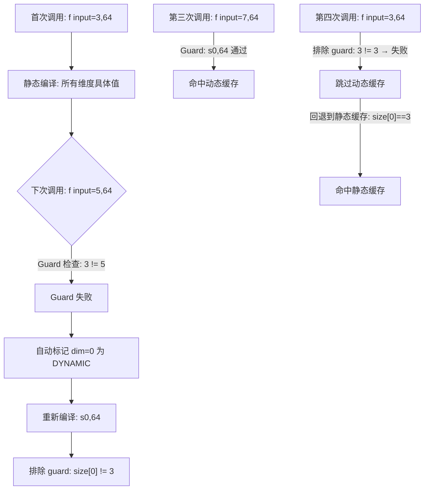

# torch.compile Dynamic Shape 技术全解：从静态特化到符号化推导

> **页面角色**：advanced symbolic-shape、ShapeEnv 与 guard 纵深专题。
> **原始基线**：主分支快照，见下方日期；**当前审计基线**：PyTorch `e8f97c1a6ef8cbcdd0a946606bc1e924e4f07e52`。
> **课程分工**：本页保留纵深材料；图复用、符号形状和guard的当前主线见 [[19_torch_compile_end_to_end/04_symbolic_shapes_guards_and_graph_reuse]]，历史逐项审计尚未闭环。

> 基于 PyTorch 主分支源码分析，覆盖 Dynamo → ShapeEnv → Guard → Inductor 全链路
> 最后更新: 2026-05-11

---

## 目录

1. [问题起源：为什么 torch.compile 最初不支持动态 shape](#1-问题起源为什么-torchcompile-最初不支持动态-shape)
2. [符号化解决方案：ShapeEnv 与 SymInt 体系](#2-符号化解决方案shapeenv-与-symint-体系)
3. [Guard 系统：如何自动保证 shape 正确性](#3-guard-系统如何自动保证-shape-正确性)
4. [渐进式动态化：automatic_dynamic_shapes 机制](#4-渐进式动态化automatic_dynamic_shapes-机制)
5. [端到端案例追踪](#5-端到端案例追踪)
6. [关键源码索引](#6-关键源码索引)

---

## 1. 问题起源：为什么 torch.compile 最初不支持动态 shape
### 1.1 核心矛盾

TorchDynamo 的编译缓存模型是：**相同的输入属性 → 相同的编译产物**。这里的"输入属性"包括 tensor 的 shape、dtype、device、stride 等。每次编译时，Dynamo 通过 **Guard** 系统将这些属性冻结为具体的 Python 表达式。

在静态 shape 模式下（`dynamic=False` 或 `assume_static_by_default=True`），核心问题如下：

```
编译时输入:  (3, 64)   → Guards: "arg0.size()[0] == 3 and arg0.size()[1] == 64"
运行时输入:  (5, 64)   → Guard 检查: "5 == 3" → False → 缓存未命中 → 重新编译
```

每一次 shape 变化都触发完整重编译，这就是**重编译风暴（Recompilation Storm）**。

### 1.2 根本原因：Guard 系统将 shape 特化为常量

Dynamo 在捕获 FX 图时，通过 `FakeTensor` 记录每个中间 tensor 的元数据。`FakeTensor` 的 shape 在静态模式下是**具体整数**。当 `GuardBuilder` 生成守卫条件时，`EQUALS_MATCH` guard 将这些整数直接写入生成的 Python 代码中。

`torch/_dynamo/guards.py:2638` — `EQUALS_MATCH`:

```python
def EQUALS_MATCH(self, guard: Guard, recompile_hint: str | None = None) -> None:
    ref = self.arg_ref(guard)
    val = self.get(guard)
    # ...
    # 对 torch.Size 类型, 生成类似 "arg0.size()[0] == 3" 的精确匹配代码
```

这意味着：
- **每个具体的 shape 值生成一个独立编译产物** → 缓存 key 包含具体数值
- **单个模型默认最多缓存 8 个编译产物** (`recompile_limit=8`)，超过后回退 eager
- **LLM 变长序列场景**：每个 batch size / seq len 组合触发一次编译

### 1.3 Config 层面的设计意图

`torch/_dynamo/config.py:175`:

```python
assume_static_by_default = True   # 默认: 静态特化, 性能优先
```

PyTorch 团队有意将 `assume_static_by_default=True` 设为默认值。原因是：

1. **性能**：静态 shape 允许 Inductor 生成更激进的融合 kernel、使用常量索引、启用 CUDA Graphs
2. **编译时间**：更少的符号变量 → 更简单的表达式 → 更快的编译
3. **兼容性**：早期 PT2 生态中，许多后端（如 TensorRT）对动态 shape 支持有限

但这导致 `torch.compile` 对 shape 变化极其敏感。

---

## 2. 符号化解决方案：ShapeEnv 与 SymInt 体系

### 2.1 核心思想：从整数到符号

解决思路是**用符号变量替代具体整数**。当 dim=0 被标记为 dynamic：

```
静态模式:  arg0.shape = (3, 64)   → Guard: size[0] == 3
动态模式:  arg0.shape = (s0, 64)  → Guard: size[1] == 64 (仅静态维度)
```

这样 `(3, 64)` 和 `(5, 64)` 都满足 `(s0, 64)` 的约束 → **命中同一缓存**。

### 2.2 ShapeEnv：符号环境的中心管理器
`torch/fx/experimental/symbolic_shapes.py:3811` — `class ShapeEnv` 是整个符号化 shape 系统的核心。它管理所有与符号 shape 相关的状态：

```python
class ShapeEnv:
    def _init(self, *, assume_static_by_default=False, ...):
        # 核心数据结构:
        self.guards: list[ShapeGuard] = []           # 所有已记录的 guard
        self.backed_var_to_val: dict[sympy.Symbol, sympy.Integer] = {}  # 符号→具体值映射
        self.var_to_range: dict[sympy.Symbol, ValueRanges] = {}          # 符号的值域约束
        self.replacements: dict[sympy.Symbol, sympy.Expr] = {}           # 符号等价替换
        self.divisible: set[sympy.Expr] = set()                           # 整除性约束
        self.size_like: set[sympy.Symbol] = set()                         # >= 2 的 size-like 符号
        self.deferred_runtime_asserts: dict[sympy.Symbol, list[RuntimeAssert]] = {}  # 运行时断言
```

每个字段对应一类数学约束：

| 字段 | 数学含义 | 示例 |
|------|----------|------|
| `var_to_range` | 符号的值域 | `s0 ∈ [2, 1024]` |
| `var_to_val` | 符号的具体 hint | `s0 = 128` |
| `replacements` | 符号间的等式关系 | `s1 → s0 * 2` |
| `divisible` | 整除性约束 | `s0 % 64 == 0` |
| `size_like` | size 符号（≥2） | `s0` 是 tensor size |

### 2.3 DimDynamic：维度分配策略

`torch/fx/experimental/symbolic_shapes.py:1967`:

```python
class DimDynamic(Enum):
    DYNAMIC = 0     # 始终分配独立符号
    DUCK = 1        # 若两个维度的 hint 相同, 则复用同一符号 (duck sizing)
    STATIC = 2      # 不对该维度分配符号, 直接使用具体值
    UNBACKED = 3    # 运行时才能确定 (如 nonzero 的输出大小)
    INFER_STRIDE = 4 # 从 size 推断 stride
```

**Duck Sizing (DUCK)** 是一种关键优化：如果两个输入 tensor 的 dim=0 都是 128，则分配同一个符号 `s0`，而不是 `s0` 和 `s1`。这减少了符号数量，同时保留了等价性信息。

### 2.4 `mark_dynamic()` API

用户通过 `torch._dynamo.mark_dynamic(tensor, dim)` 显式标记某维度为 dynamic，这会将该维度的策略设为 `DimDynamic.DYNAMIC`。

`torch/_dynamo/eval_frame.py:703`:

```python
def make_set_enable_dynamic(enable: bool) -> Any:
    if enable:
        # 全局启用动态, 所有维度默认 DUCK (= assume_static_by_default=False)
        return config._make_closure_patcher(assume_static_by_default=False)
    else:
        # 全局静态, 只对 mark_dynamic 标记的维度分配符号
        return config._make_closure_patcher(
            automatic_dynamic_shapes=False, assume_static_by_default=True
        )
```

**关键发现：`dynamic=True/False/None` 控制的是全局策略，而非功能开关**：
- `dynamic=True` → `assume_static_by_default=False` → 所有维度默认 DUCK
- `dynamic=False` → `assume_static_by_default=True` → 只有显式 `mark_dynamic()` 的维度才符号化
- `dynamic=None` → 使用全局 config 默认值（当前为 True）

### 2.5 SymInt：Python 层面的符号整数

`SymInt` 是 PyTorch 对 `sympy.Symbol` 的包装，使得符号整数可以在 PyTorch 的 Python API 中透明使用。每个 `SymInt` 持有一个 `SymNode`，后者连接到 `ShapeEnv`：

```python
# 简化的概念模型
class SymInt:
    _node: SymNode           # 符号节点
    # 支持所有算术运算: +, -, *, //, % 等
    # 运算结果仍是 SymInt (符号表达式)

class SymNode:
    _expr: sympy.Expr        # sympy 符号表达式, 如 s0 * 64
    _shape_env: ShapeEnv     # 归属的 ShapeEnv
    _hint: int               # 具体值 hint (用于调试/回退)
```

当你在 traced code 中对 tensor shape 做任何运算（如 `x.size(0) * x.size(1)`），得到的不是 `int` 而是 `SymInt`。这个机制使得**整个计算图中所有与 shape 相关的计算都被符号化追踪**。

---

## 3. Guard 系统：如何自动保证 shape 正确性

### 3.1 Guard 的生成时机

ShapeEnv 在每次需要评估符号表达式的真值时会调用 `_maybe_guard_rel()`：

`torch/fx/experimental/symbolic_shapes.py:7637`:

```python
def _maybe_guard_rel(self, expr: sympy.Expr) -> None:
    """
    当我们需要知道一个符号关系 (如 s0 == s1) 是否为真时,
    将此关系记录为 guard, 同时利用该信息简化后续的符号表达式。
    """
    if isinstance(expr, sympy.Eq):
        # 等式 guard → 建立 replacement
        # 例如 s0 == s1 意味着所有 s0 都可以替换为 s1
        ...
        self._refine_ranges(expr)    # 细化值域
        self._update_version_counter()
```

### 3.2 Guard 的三层结构

**第一层 — ShapeEnv 内部**：维护符号间的数学约束（等式、整除性、值域）

**第二层 — GuardBuilder.SHAPE_ENV**：将 ShapeEnv 的约束翻译为 Python/C++ guard 代码

`torch/_dynamo/guards.py:3187`:

```python
def SHAPE_ENV(self, guard: Guard) -> None:
    """将 ShapeEnv 中累积的所有约束翻译为可执行的 guard 表达式"""
    fs = output_graph.shape_env.tracked_fakes or []
    # 调用 ShapeEnv.produce_guards_verbose() 生成代码
    return output_graph.shape_env.produce_guards_verbose(
        [a.fake for a in fs],
        [a.source for a in fs],
        input_contexts=input_contexts,
        ...
    )
```

**第三层 — 运行时检查**：生成的代码在每次调用前执行，验证输入是否满足编译时的假设

### 3.3 `produce_guards_verbose()` — 约束→代码的翻译

`torch/fx/experimental/symbolic_shapes.py:5796`:

此方法遍历 ShapeEnv 中的所有约束，生成如下类型的 guard 表达式：

```
# 静态维度检查 (ignore_static=True 时仅对动态维度生成):
arg0.size()[1] == 64

# 等式关系 (duck sizing):
arg0.size()[0] == arg1.size()[0]        # s0 == s0 (两个 tensor 共享同一符号)

# 整除性约束:
arg0.size()[0] % 64 == 0                # s0 % 64 == 0

# 值域约束:
2 <= arg0.size()[0]                     # s0 ∈ [2, ∞)
arg0.size()[0] <= 1024                  # s0 ∈ [2, 1024]

# 排除约束 (automatic_dynamic 场景):
arg0.size()[0] != 3                     # 排除之前静态特化的值
```

生成的注释（verbose）中包含完整的符号表达式，用于调试。

### 3.4 运行时 Shape 断言
除了 Guard（决定缓存命中），Inductor 还在 wrapper code 中插入运行时断言，确保编译假设成立：

`torch/_inductor/codegen/wrapper.py:1407` — `codegen_input_size_asserts()`:

```python
# 生成类似代码:
assert_size_stride(arg0_1, (s0, 64), (64, 1))
```

`assert_size_stride` 在运行时验证输入 tensor 的实际 shape/stride 是否与编译时的符号约束一致。如果 runtime 传入的 tensor 不满足约束（例如动态维度不是 size-like ≥2 或整除性不满足），此断言立即失败——**Fail Fast**，避免产生静默错误结果。

### 3.5 值域推导与细化的自动机制
`_refine_ranges()` 在每次 guard 发生时更新 `var_to_range`：

```python
# 示例：假设 s0 当前值域为 [2, ∞)
# 遇到 guard: s0 <= 1024
# → 更新 var_to_range[s0] = ValueRanges(2, 1024)

# 遇到 guard: s0 == 64
# → 更新 var_to_range[s0] = ValueRanges(64, 64)
# → 此时 s0 退化为常量, 可以被替换
```

这种**增量细化**机制意味着：
1. 初始编译时值域宽松（动态 shape 编译开销可控）
2. 运行过程中若观察到的 shape 范围收窄，值域自动收紧
3. 值域退化为单点时，符号自动被具体值替换 → 后续编译产物逐步特化

### 3.6 等式推导与符号合并

当 ShapeEnv 学习到 `s0 == s1`（例如两个 tensor 的 dim=0 总是相同大小）：
1. `replacements[s0] = s1` — 所有 `s0` 出现处被 `s1` 替代
2. 不需要生成 `s0 == s1` 这条 guard（因为替换已经内置了这个信息）
3. 减少了符号数量，简化了后续表达式

---

## 4. 渐进式动态化：automatic_dynamic_shapes 机制
### 4.1 设计动机

静态 shape 编译快、性能好；动态 shape 编译慢但更灵活。PyTorch 2.0 引入了一种**渐进式动态化**策略：

`torch/_dynamo/config.py:181`:

```python
automatic_dynamic_shapes = True  # 默认启用

# 策略:
# 1. 首次编译: 完全静态 (assume_static_by_default=True)
# 2. 若 guard 因 shape 变化失败 → 自动重编译
# 3. 重编译时: 将 "晃动" 的维度标记为 dynamic
# 4. 下次相同 shape 范围 → 命中动态缓存
```

### 4.2 工作流



这个设计保证了：
- **大多数场景**（shape 不变）：享受到静态编译的最佳性能
- **shape 变化场景**：自动适配，不产生重编译风暴
- **静态缓存保留**：即使动态缓存存在，曾经见过的静态 shape 仍然命中静态缓存（通过排除 guard）

### 4.3 排除约束的实现

`torch/_dynamo/config.py:206`:

```python
automatic_dynamic_exclusion_guard = False  # 默认不启用排除约束
```

当启用时，每次静态→动态的转换会记录被排除的值：
```python
self.exclusion_constraints: list[tuple[sympy.Symbol, int]] = []
# 例如: [(s0, 3), (s0, 5)] 表示 s0 != 3 且 s0 != 5
```

---

## 5. 端到端案例追踪
以 `matmul` 操作为例，当 `dynamic=True` 时，追踪从用户代码到最终 kernel 的完整路径。

### 5.1 Stage 0：用户代码

```python
@torch.compile(dynamic=True)
def my_matmul(x, y):
    return x @ y  # x: (B, 64), y: (64, 128) → output: (B, 128)
```

### 5.2 Stage 1：Dynamo — 帧捕获与 FakeTensor 传播

```
make_set_enable_dynamic(True)
  → config.assume_static_by_default = False
  → 所有维度默认策略为 DimDynamic.DUCK

Dynamo 拦截 my_matmul 的 Python 帧
  → InstructionTranslator 符号执行字节码
  → 首次调用时, x 的 size 为 (3, 64):
    - dim=0: hint=3, DUCK 策略, 分配 s0
    - dim=1: hint=64, DUCK 策略, 64 是常见值, 可能为 STATIC (取决于 specialize_zero_one 等)
  → FakeTensor(x): shape=(s0, 64), dtype=float32
  → FakeTensor(y): shape=(64, 128), dtype=float32
  → 执行 x @ y → FakeTensor(output): shape=(s0, 128)

构建 FX Graph:
  %x : [num_users=1] = placeholder[target=x]
  %y : [num_users=1] = placeholder[target=y]
  %mm : [num_users=1] = call_function[target=torch.matmul](args = (%x, %y))
  return %mm
```

### 5.3 Stage 2：ShapeEnv — 符号状态

```
ShapeEnv 状态:
  backed_var_to_val: {s0: 3}
  var_to_range: {s0: ValueRanges(2, inf)}   ← s0 是 size-like, ≥2
  replacements: {}                           ← 暂无等式关系
  guards: []                                 ← 暂无 guard (首次编译)
```

### 5.4 Stage 3：GuardBuilder — 生成 Guard

`SHAPE_ENV` → `produce_guards_verbose()` 生成:

```python
# Python guard 代码 (简化):
arg0.size()[0] == arg0.size()[0]    # 恒真, 被简化掉
arg0.size()[1] == 64                # 静态维度检查
arg1.size()[0] == 64                # y 的 dim=0
arg1.size()[1] == 128               # y 的 dim=1
2 <= arg0.size()[0]                 # s0 是 size-like
```

### 5.5 Stage 4：Inductor — Codegen

Inductor 将 FX Graph 中的 `matmul` lowering 为 Triton kernel，并通过 `SizeArg` 传递符号维度：

```python
# Inductor Wrapper 代码 (简化):
def call(args):
    arg0_1 = args[0]           # (s0, 64)
    arg1_1 = args[1]           # (64, 128)

    # 运行时断言:
    assert_size_stride(arg0_1, (s0, 64), (64, 1))

    # 计算 Triton Grid:
    xnumel = s0 * 128          # 动态 numel
    grid = (ceildiv(xnumel, XBLOCK), 1, 1)

    # 调用 Triton Kernel:
    triton_kernel[grid](arg0_1, arg1_1, buf0, xnumel, ...)
```

### 5.6 Stage 5：第二次调用，不同 batch size

```
第二次调用: x=(5, 64)

缓存检查:
  Guard: arg0.size()[1] == 64  →  64 == 64  ✓
  Guard: 2 <= arg0.size()[0]  →  2 <= 5    ✓
  → 所有 guard 通过 → 命中缓存

直接执行已编译的 kernel, s0 在运行时求值为 5
```

---

## 6. 关键源码索引
| 功能 | 文件 | 行号 | 说明 |
|------|------|------|------|
| `ShapeEnv._init` | `torch/fx/experimental/symbolic_shapes.py` | 3885 | ShapeEnv 核心数据结构初始化 |
| `DimDynamic` | 同上 | 1967 | 维度动态策略枚举 (DYNAMIC/DUCK/STATIC/UNBACKED) |
| `_maybe_guard_rel` | 同上 | 7637 | guard 条件的核心判断与记录 |
| `produce_guards_verbose` | 同上 | 5796 | 约束→可执行 guard 代码的翻译 |
| `_refine_ranges` | 同上 | 7379 | 值域增量细化 |
| `ShapeEnv.freeze` | 同上 | 4464 | 冻结 ShapeEnv, 停止累积新 guard |
| `GuardBuilder.EQUALS_MATCH` | `torch/_dynamo/guards.py` | 2638 | 静态值精确匹配 guard |
| `GuardBuilder.SHAPE_ENV` | 同上 | 3187 | 符号化 shape guard 生成入口 |
| `make_set_enable_dynamic` | `torch/_dynamo/eval_frame.py` | 703 | dynamic 参数 → config 转换 |
| `assume_static_by_default` | `torch/_dynamo/config.py` | 175 | 全局静态/动态策略开关 |
| `automatic_dynamic_shapes` | 同上 | 181 | 渐进式动态化开关 |
| `assert_size_stride` | `torch/_inductor/codegen/wrapper.py` | 1407 | 运行时 shape 断言生成 |
| `SizeArg` | `torch/_inductor/codegen/common.py` | 291 | 符号表达式→kernel 参数载体 |
| `buffer_reuse_key` | `torch/_inductor/codegen/wrapper.py` | 100 | 符号感知的内存复用 key |

---

## Related Pages

- [[19_torch_compile_end_to_end/00_pytorch_graph_series_index]] — 当前固定基线的图编译系统化课程入口
- [[inductor_codegen_dynamic_shape_analysis]] — Inductor codegen 层的动态 shape 处理
- [[torch_compile_architecture]] — torch.compile 端到端流水线架构
- [[torch_compile_source_analysis]] — torch.compile 入口源码分析
- [[PyTorch_Dynamo_Technical_Analysis]] — Dynamo 帧捕获与符号执行
- [[PyTorch_Inductor_Technical_Analysis]] — Inductor 后端技术全析
- [[aotautograd_analysis]] — AOT Autograd 前向/反向图分解
- [[01_ai_frameworks/index]] — AI 框架域总索引
