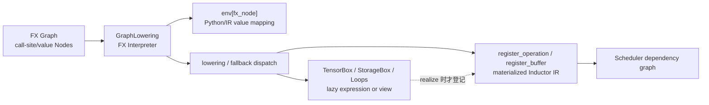

# 17 · 从 FX Lowering 到 Inductor IR

> 前置：[[graph_stage_boundaries_identity_and_provenance_analysis]]、[[graph_rewrite_legality_validation_and_complexity_analysis]]
> 当前实现基线：PyTorch `e8f97c1a6ef8cbcdd0a946606bc1e924e4f07e52`
> Lab 环境：PyTorch `2.9.1+cpu`
> 最后更新：2026-07-28

## 1. 为什么FX之后还需要IR

FX Node说：

```text
call_function aten.add.Tensor(x, y)
```

codegen需要知道：

- output iteration domain；
- 每个index读x/y哪个地址；
- broadcast如何index；
- dtype promotion；
- layout/stride；
- 是否lazy compose；
- 是否用template/extern；
- 何时materialize buffer。

FX表达“调用什么”；Inductor IR表达“如何实现与存储”。

## 2. GraphLowering是Interpreter

`GraphLowering`继承 `torch.fx.Interpreter`
（`torch/_inductor/graph.py:386-386`）。对每个FX Node：

1. 从interpreter env取已lowered args；
2. 选择lowering/fallback；
3. 执行Python lowering function；
4. 将返回的IR/Python value写回env。

`run()`本身只把执行交给父类 `Interpreter.run()`；真正的逐节点循环、参数解析与
`env[node] = self.run_node(node)`由 FX Interpreter 提供，`GraphLowering`重写各 opcode
的处理方法，把这个通用解释器变成 lowering 解释器
（`torch/_inductor/graph.py:1130-1132`；
`torch/fx/interpreter.py:170-190`）。`run_node()`明确描述
“Lower and execute a single FX node into Inductor IR”，并在调用父类分派前后安装
origin、stream 与 memory-pool 上下文
（`torch/_inductor/graph.py:1925-1946`；
`torch/_inductor/graph.py:1960-1989`）。

### 2.1 一次 `call_function` 的源码调用链

以下调用链比“一个 FX Node 被翻译成一个 IR Node”更准确：

```text
GraphLowering.run()
  → torch.fx.Interpreter.run()
    → Interpreter.run_node(fx_node)
      → 从 env 递归解析 fx_node.args / fx_node.kwargs
      → 按 fx_node.op 分派到 GraphLowering.call_function()
        → 选择 lowering / user lowering / fallback
        → lowering wrapper 做 broadcast、类型提升并构造 IR value
      → 把返回值写入 env[fx_node]
```



这里发生了三种不同的“状态变化”：

| 层次 | 写入位置 | 写入的是什么 | 为什么不能合并成一种 Node |
|---|---|---|---|
| FX 解释器状态 | `env[fx_node]` | lowering 的 Python/IR 返回值 | 它记录“这个 FX 值当前对应什么”，不是调度边 |
| GraphLowering 全局状态 | `operations`、`buffers`、名称表 | 已 materialize 的 operation/buffer | 只有实体化之后才应进入后续调度 |
| IR 对象内部状态 | `TensorBox`、`StorageBox`、`Loops`、layout | lazy expression、view、storage 与布局 | 多个 FX Node 可以折叠进一个表达式，也可能展开成多个 buffer |

`register_operation()`把 operation 追加到 `operations` 并分配名称；
`register_buffer()`把 buffer 追加到 `buffers`、分配名称并记录设备
（`torch/_inductor/graph.py:1134-1163`）。这两个容器不是在每次
`env` 写入时同步增长，因此 FX 节点数与可调度 operation 数天然不相等。

## 3. 不是一Node换一Node

FX env value可为：

- `TensorBox(StorageBox(lazy Loops))`；
- view/reinterpret；
- realized Buffer；
- tuple/list/dict；
- Python scalar/SymInt；
- ExternKernel/Template choice；
- `None`。

多个pointwise FX nodes可compose成同一lazy expression；一个multi-output/fallback又可创建多个
objects。不存在 `N_fx == N_ir == N_scheduler`不变量。

## 4. Lowering注册

`register_lowering`包装注册函数；内部 `_register_lowering`可处理：

- broadcasting；
- type promotion；
- 调用被注册的IR实现函数；
- IR validation
  （`torch/_inductor/lowering.py:481-510`；
  `torch/_inductor/lowering.py:511-532`）。

lowering的职责是返回合法IR/value，不是独立做全局fusion decision。
这里的wrapper也不是decomposition pass；算子分解发生在前面的FX/ATen规范化阶段。

### 4.1 注册器为什么还要包一层 wrapper

`register_lowering()`不是简单执行 `lowerings[op] = fn`。源码先为每个 overload 建立统一
wrapper，再按注册参数对输入做广播和类型提升，调用真正的 lowering，最后用
`validate_ir()`检查返回结构。一个 lowering 作者因此只需实现“规范输入 → 合法 IR
value”的局部语义，不必在每个算子里重复输入标准化
（`torch/_inductor/lowering.py:497-525`）。

这个设计由 FX 图中的三个场景共同决定：

1. 同一 operator packet 可能有多个 overload，需要共享 lowering 规则；
2. FX args 已经从 Node 解析成 IR value，但 rank、dtype 与 Python scalar 形式仍可能不同；
3. lowering 可以返回嵌套容器或多个 IR value，必须在进入后续阶段前统一验证。

### 4.1.1 普通 lowering、lowering-pattern 与 graph pattern

三者的名字相近，但产物和生效时刻不同：

| 机制 | 匹配/调用对象 | 产物 | 职责 |
|---|---|---|---|
| `register_lowering(op)` | 单个 FX `call_function` target | IR/Python value | 定义一个 operator 如何实现 |
| `register_lowering_pattern(pattern)` | post-grad FX 子图 | 一个带 lowering handler 的新 FX call | 把整段 FX 子图延迟到 lowering 时直接变为 IR |
| `register_graph_pattern(pattern)` | post-grad FX 子图 | handler 直接编辑 FX Graph | 在 lowering 前完成普通图改写 |

`LoweringPatternEntry.apply()`先用一个 handler call 替换匹配子图；注册器再给 handler 标记
`_inductor_lowering_function`。因此它不是“Matcher 直接把 IR 塞进 FX Graph”，而是：

```text
post-grad 子图匹配
  → FX 中生成 lowering-handler call
  → GraphLowering 识别标记
  → handler 在 lowering 时返回 IR
```

对应实现见 `torch/_inductor/pattern_matcher.py:1373-1385`、
`torch/_inductor/pattern_matcher.py:2296-2328` 与
`torch/_inductor/fx_passes/post_grad.py:924-944`。

### 4.2 decomposition、post-grad fusion 与 lowering 的边界

- decomposition把高层 operator 展开为目标算子集，仍在 FX/ATen 语义层；
- post-grad pattern pass按子图结构改写 FX，尚未决定最终 loop、buffer 或 kernel；
- lowering把 FX operator/handler 解释为 IR implementation；
- Scheduler 才基于已 realization 的 operations 决定依赖、融合与最终顺序；
- backend codegen再把 Scheduler group 变成 generated kernel、template 或 extern call。

因此“post-grad 匹配成功”不等于“最终产生一个 fused kernel”，而“一个 lowering 返回
Pointwise”也不等于该 Pointwise 一定单独 materialize。

### 4.3 完整注册 API 面

`register_lowering`只是入口最常用的一个；`lowering.py`按不同粒度还提供多个专用注册器，
均已核对现存于当前基线（部分与 §4.1 的 wrapper 机制共享同一条 `_register_lowering`
路径，行号相对旧版参考资料已漂移，以函数名定位为准）：

| API | 用途 | 适用场景 |
|---|---|---|
| `register_lowering()`（`lowering.py:535`） | 通用注册装饰器，套 §4.1 的 broadcast/type-promotion/validate wrapper | 所有 op |
| `register_pointwise()`（`lowering.py:1100`） | 从 pointwise 语义直接生成可融合 loop IR 的快捷注册 | 逐元素 op（add/mul/relu/sin…） |
| `register_foreach_pointwise()`（`lowering.py:1222`） | foreach 批量 op 注册 | `_foreach_add`/`_foreach_mul` 等 |
| `register_inplace()` | 原地 op 注册，复用对应 out-of-place lowering | `add_`/`mul_`/`relu_` |
| `add_needs_realized_inputs()`（`lowering.py:219`） | 声明调用前必须把输入 materialize | 外部库、layout-sensitive op |
| `add_layout_constraint()`（`lowering.py:227`） | 为 op 约束输入/输出 layout | 外部 kernel 的 contiguous/stride 要求 |
| `fallback_handler()`（`lowering.py:2714`） | 构造 `FallbackKernel` handler（§7 已详述） | 手工接入其他 registry 时 |
| `make_fallback()` | 校验 decomposition 冲突、注册 fallback 和 layout constraint 三件事一次做完 | 后端不 lowering、但 eager/custom kernel 可执行的 op |
| `register_lowering_pattern()`（`torch/_inductor/pattern_matcher.py:2296`） | 见 §4.1.1，post-grad 子图匹配后直接产 IR | lowering-time fusion |

#### 两种最小接入路径

若自定义 op 已有可跑通的外部实现，最省事的接入是纯 fallback：

```python
import torch
from torch._inductor.lowering import make_fallback

my_op = torch.ops.my_ns.my_op.default
make_fallback(my_op, warn=False)

# 注册模块必须在首次 torch.compile 前 import。
compiled = torch.compile(model)
```

若希望复用已注册的 IR lowering 组合出一个新 op，直接在 `lowerings`字典里查已注册函数并调用：

```python
import torch
from torch._inductor.lowering import lowerings, register_lowering

aten = torch.ops.aten
my_op = torch.ops.my_ns.bias_sigmoid.default

@register_lowering(my_op, type_promotion_kind=None)
def lower_bias_sigmoid(x, bias):
    z = lowerings[aten.add.Tensor](x, bias)
    return lowerings[aten.sigmoid.default](z)
```

这里传入 `lowerings[...]`的参数已经是 Inductor IR（而非 FakeTensor/FX Node），所以只能
在 lowering 内部这样组合；若目标只是表达一个等价 ATen 公式，应优先写
[[decomposition_passes_guide]]，不要把纯语义展开硬塞进 lowering。

## 5. `call_function`选择顺序

当前关键路径：

1. 若target携带 `_inductor_lowering_function`，直接passthrough；
2. 缺lowering时按allow list/implicit fallback/decomposition presence决定fallback或error；
3. 应用layout constraints；
4. Node metadata可强制fallback；
5. user lowering优先，带recursion guard；
6. user返回None则普通lowering；
7. 仍无lowering的递归/custom场景走fallback handler。

源码不是一张无条件的“lowering 表查询”，而是一棵有优先级的决策树：

```text
getitem / 已标记 lowering handler
  ├─ 直接处理
  └─ 普通 target
       ├─ lowering 缺失 → allow-list / implicit fallback / 明确报错
       ├─ 应用 layout constraint
       ├─ node.meta 强制 fallback
       ├─ user lowering（防递归）
       ├─ 内建 lowering
       └─ fallback handler
```

入口特判与缺失 lowering 分支见
`torch/_inductor/graph.py:1402-1431`、
`torch/_inductor/graph.py:1432-1461`；
layout constraint 见 `torch/_inductor/graph.py:1475-1504`；
metadata、user lowering 与最终分派见
`torch/_inductor/graph.py:1517-1546`。

设计成决策树而不是单张表，是因为“target 有实现”并不足以证明当前调用合法：布局约束、
用户覆盖、显式 fallback 标记、分解存在性与递归保护都依赖这一次 FX Node 的上下文。

## 6. 缺lowering并不保证成功fallback

可能结果：

- allow-listed fallback；
- `implicit_fallbacks`允许的fallback；
- `MissingOperatorWithDecomp`；
- `MissingOperatorWithoutDecomp`。

backward implicit fallback若无layout tag还可保守require contiguous
（`torch/_inductor/graph.py:1413-1442`；
`torch/_inductor/graph.py:1443-1472`）。

因此fallback是受contract控制的外部执行路径，不是“编译永不失败”。

## 7. Fallback与ExternKernel

`fallback_handler`创建 `FallbackKernel`
（`torch/_inductor/lowering.py:2714-2745`）。`FallbackKernel`属于
`ExternKernelAlloc`/`InputsKernel` operation family
（`torch/_inductor/ir.py:6645-6674`;
`torch/_inductor/ir.py:6995-7023`;
`torch/_inductor/ir.py:9314-9340`;
`torch/_inductor/ir.py:9342-9358`）。

它仍有inputs、layout、buffer、SchedulerNode与wrapper call，只是计算由external/eager
kernel实现。

## 8. Pointwise与Reduction

Loop IR用ranges与inner index function表达：

```text
for index in ranges:
    out[index] = inner_fn(index)
```

`Pointwise`无reduction domain；`Reduction`有reduction ranges与reduction type
（`torch/_inductor/ir.py:1057-1086`;
`torch/_inductor/ir.py:1090-1119`;
`torch/_inductor/ir.py:1175-1198`;
`torch/_inductor/ir.py:1200-1208`;
`torch/_inductor/ir.py:1219-1238`;
`torch/_inductor/ir.py:1238-1256`;
`torch/_inductor/ir.py:1384-1406`）。

lazy inner function使producer expression可内联到consumer loop，为fusion提供表示基础；
是否最终fusion由Scheduler/backend决定。

## 9. View与layout

view可用index/layout transformation共享storage，但不是“永远free”。固定stride要求、
alias/mutation、output escape或backend constraint可能require stride/copy/materialization。

GraphLowering在调用lowering前可normalize fake args并施加layout constraint
（`torch/_inductor/graph.py:1478-1515`）。

## 10. Template与algorithm choice

matmul/conv等可创建template/extern choices，而不是普通Pointwise。选择可立即benchmark，也可
形成 `MultiTemplateBuffer`延迟到Scheduler评估epilogue/prologue fusion。

所以“matmul一定lower为一个Triton pointwise loop”错误；backend/config/dtype/layout决定路径。

## 11. Realization

`TensorBox.create(IRNode)`通常包装 `StorageBox`
（`torch/_inductor/ir.py:10547-10559`）。

`StorageBox.realize()`将lazy Pointwise/Reduction/Scan/Sort变成：

- `ComputedBuffer`；
- `FlexibleLayout`；
- registered buffer name；
- registered operation；
- copied origins/trace/stream/mempool
（`torch/_inductor/ir.py:10578-10607`）。

Scheduler只看到registered operations；这是真正FX→Scheduler数量变化的关键边界。

### 11.1 Realization 是“登记时刻”，不是普通求值

`StorageBox.realize()`先判断当前 data 是否已经是 `Buffer`；若仍是
`Pointwise`、`Reduction`、`Scan` 或 `Sort`，它会创建 `ComputedBuffer`，复制
origin/trace/stream/memory-pool 信息，然后调用 GraphLowering 的注册接口。也就是说：

```text
lazy Loops
  → ComputedBuffer + FlexibleLayout
  → register_buffer()
  → register_operation()
  → Scheduler 可见
```

决定“现在必须 realize”的代码可能位于 output、布局约束、mutation、extern/template
输入等消费者位置；`StorageBox.realize()`描述的是决定作出之后如何落地。把二者混为
一谈会误以为任何 lazy IR 构造都会立刻生成 SchedulerNode。

## 12. placeholder与output

placeholder可lower成：

- InputBuffer；
- DonatedBuffer；
- symbolic scalar；
- constants/objects。

GraphLowering output会realize必要outputs、处理stride/layout、mutation/alias和wrapper ABI
（`torch/_inductor/graph.py:1296-1323`;
`torch/_inductor/graph.py:1328-1355`;
`torch/_inductor/graph.py:1357-1382`;
`torch/_inductor/graph.py:1392-1399`;
`torch/_inductor/graph.py:1651-1668`;
`torch/_inductor/graph.py:1669-1688`;
`torch/_inductor/graph.py:1690-1715`;
`torch/_inductor/graph.py:1716-1725`;
`torch/_inductor/graph.py:1727-1755`;
`torch/_inductor/graph.py:1757-1769`;
`torch/_inductor/graph.py:1771-1773`）。

device不是事后附加属性：InputBuffer、Layout、Loops 与 ExternKernel 都携带或推导device；
GraphLowering还按device选择backend与wrapper路径。mutation也不是普通数据边的别名：
lowering/IR会记录mutation target与alias，Scheduler随后从read/write/mutation关系重建依赖。

## 13. provenance

run_node合并当前FX Node与input origins，并为新IR安装origin/stream/mempool context
（`torch/_inductor/graph.py:1960-1989`）。这允许lazy expression/fusion保留many-to-many
source mapping。

## 14. 复杂度

若把嵌套参数访问总量记为 `A`、FX Node 数记为 `N_fx`，仅解释器骨架为：

```text
O(N_fx + A)
```

总成本应写成：

```text
T_lowering = O(N_fx + A) + Σ_i T_lowering(i) + T_realize + T_choice
```

其中 `T_realize` 与最终展开的 lazy expression、注册的 buffer/operation 数有关，
`T_choice`可能包含 template compile/benchmark。因而不能只用 `O(N_fx)`描述完整编译成本。
此外：

- lowering可做symbolic algebra；
- template choice可compile/benchmark；
- realization数量不等于N_fx；
- fallback可能触发layout copies；
- output realization递归展开lazy expressions。

## 15. 已验证 Lab

### 15.1 命令

在仓库根目录执行：

```powershell
python tools/labs_torch_compile/part4_ir_scheduler_analysis.py `
  --output-dir tools/labs_torch_compile/artifacts/part4_ir

python tools/labs_torch_compile/part4_artifact_bundle.py `
  --output-dir tools/labs_torch_compile/artifacts/part4
```

### 15.2 正例与边界例

`part4_ir_scheduler_analysis.py`实际执行
`make_fx → GraphLowering.run → Scheduler`，并断言：

```text
elementwise_ir_observed=True
reduction_ir_observed=True
matmul_extern_observed=True
```

它不请求native codegen，因此没有提供generated native kernel的编译或执行证据。

该路径已经实际构造Pointwise、Reduction、view/copy、ExternKernel及Scheduler结构；缺少
MSVC `cl`不影响这些运行时内部观察。

这些 IR 类型与数量关系的直接证据来自
`tools/labs_torch_compile/artifacts/part4_ir/ir_matrix.json`，其 producer 是
`part4_ir_scheduler_analysis.py`；不能把它归因给下面的 artifact bundle。

`part4_artifact_bundle.py`另行验证：

```text
external_matmul_execution=True
fallback_eigvals_execution=True
fallback_trace_captured=True
custom_lowering_reached_ir=True
real_pointwise_compile_status=blocked_missing_msvc_cl
codegen_only_status=generated_not_executed
triton_autotune_tested=False
```

其中matmul与`eigvals`是实际`torch.compile`执行结果，`eigvals`的pre-fusion IR还明确包含
`FallbackKernel`；custom op使用`register_lowering`进入Pointwise/Reduction IR。

codegen-only路径用mock compiler边界截获真实生成的C++ source与wrapper trace，但no-op
kernel没有执行计算，所以这些文件只属于`[M] 机制走通、非真实执行`证据，不能用于数值、
性能或kernel-count结论。

### 15.3 产物

- `tools/labs_torch_compile/artifacts/part4_ir/ir_matrix.json`：FX、IR operation/buffer/layout与Scheduler node；
- `tools/labs_torch_compile/artifacts/part4/summary.json`：真实extern/fallback结果与证据边界；
- `tools/labs_torch_compile/artifacts/part4/fallback_eigvals/ir_pre_fusion.txt`：unsupported op的fallback IR；
- `tools/labs_torch_compile/artifacts/part4/custom_lowering/ir_pre_fusion.txt`：custom lowering后的IR；
- `tools/labs_torch_compile/artifacts/part4/*/output_code.py`与`captured_cpp_kernel.cpp`：仅codegen、未执行；
- 两个目录内的`environment.json`记录runtime、源码基线、CUDA与MSVC状态。

失败边界是明确的：当前机器只能证明native C++ pointwise编译被`cl`缺失阻塞。

前述GraphLowering、Scheduler与IR观察已经独立运行成功。

native CPU阻塞结论不能外推为Triton/GPU autotune结论。

## 16. Lowering 提供的具体优化目录

前面各节讲的是 lowering **怎样**把 FX Node 变成 IR；这一节列出 lowering 阶段实际启用了
哪些具体优化——它们是 §2-§3 的"lazy IR + 延迟决策"机制在具体算子上的落地，不是另一套
独立设计。以下函数均已核对现存于当前基线，行号相对旧版参考资料普遍有数百行漂移，
以函数名定位为准：

- **Pointwise 融合基础**：`make_pointwise()`（`lowering.py:731`）把逐元素运算表示成
  `inner_fn`——一个 lambda，而不是独立 kernel。多个连续 Pointwise 共享同一 index range
  时可被 Scheduler 融合进同一个 Triton kernel（消除中间 tensor 分配、消除中间结果读写、
  减少 kernel launch 次数）；例如 `relu(add(a, b))` 两次逐元素操作能融合成一次
  `d = relu(a + b)`，中间不落盘。
- **View 零拷贝家族**：`view()`→`View.create()`、`permute()`→`PermuteView.create()`、
  `squeeze()`→`SqueezeView.create()`、`expand()`→`ExpandView.create()`、
  `as_strided()`→`ReinterpretView`。这些操作在 lowering 后变成 IR 里的纯 metadata
  变换，不产生计算也不拷贝数据；后续 Pointwise 消费它们时只是换一种 indexing 方式。
- **Reduction 优化**：`make_reduction()`（`lowering.py:7269`）、
  `var_mean_welford_()`（`lowering.py:7425`，数值稳定的单遍 Welford 在线算法）、
  `var_mean_sum_()`（两步退化路径，小规模 reduction 用简单双步代替 Welford）；
  `mean()`（`lowering.py:7333`）对 fp16/bf16 先升到 fp32 再计算，避免精度损失；
  `OnlineSoftmaxReduction`（`lowering.py:9461` 附近使用点）让 softmax 的 max 和 sum
  单 pass 完成。
- **常量折叠与提升**：`promote_constants()`（`lowering.py:582`）把数值常量（int/float/
  `sympy.Basic`）包装为 `ir.Constant`/`IndexingConstant`，在 codegen 时直接内联为
  立即数，避免额外的 tensor 创建和读取。
- **智能 Fallback**：对暂无原生 lowering 的 op（如某些大尺寸 `aten.sort.stable`），
  `fallback_handler()`自动回退到 `ir.FallbackKernel`，调用 ATen 库实现——但如 §6 所述，
  这是**受 allow-list/decomposition 存在性约束的路径**，不是"lowering 缺失时总能
  自动兜底"的无条件保证。
- **Foreach 水平融合**：`make_foreach_pointwise()`/`foreach_group_loop()`把
  `_foreach_add`/`_foreach_mul`等批量操作中的同类型 op 合并进同一个 combo kernel，
  减少 kernel launch 数——常见于优化器多参数更新场景。
- **量化 op 融合**：`quantize_per_tensor`/`dequantize_per_channel`等被 lowering 为
  Pointwise，与前后 op 可融合，避免量化/反量化的额外内存往返。
- **Layout 约束优化**：`maybe_layout_constraints()`（`lowering.py:186`）、
  `tag_to_layout_constraint()`（`lowering.py:200`）对需要特定内存布局的 op（如 `mm`
  要求连续内存）在 lowering 时插入 stride/layout 要求，把最优布局的最终决策留给
  Scheduler，减少不必要的提前拷贝。

这些优化能够生效，根本原因是 §2-§3 已经建立的模型：lowering 产出的是 lazy IR
（`inner_fn` 延迟求值 + 全局图可见性），而不是像 eager 那样每个 op 立即执行——只有
延迟到 realization/codegen 阶段才决定的信息（融合边界、内存布局、模板选择），
才有机会被这些优化利用。

## 17. 写一个新 Lowering 时的检查清单

面向"给某个 op 补 lowering"这个具体任务，按优先级排列：

**必须做的基础**：逐元素 op 表示为 `inner_fn` lambda（复用 `make_pointwise()`）；
view/reshape/permute/slice 只改 indexing、不要引入拷贝；遵循 PyTorch 类型提升语义
（复用 `register_lowering`的 wrapper，不要自己重写）；正确处理 shape 广播；确保无法
lower 的路径有 fallback 可用。

**高优先级**：reduction 涉及 fp16/bf16 时数值稳定性（先升精度）；能用 Welford 单遍
算法就不要多遍扫描；同类 foreach op 合并成一个 combo kernel；量化相关 cast 尽量内联
消除；layout 决策尽量延后交给 Scheduler，不要在 lowering 时就强制 contiguous。

**进阶**：attention 一类 max+sum 单 pass（OnlineSoftmax 模式）；小 tensor `cat`
融合为 pointwise；`addcmul`一类可用 FMA 指令；`emulate_precision_casts`一类精度
仿真；matmul/conv 等需要 autotuning 的多算法 template 选择（见
[[inductor_autotuning_analysis]]）。

设计上始终围绕两个模式：**注册表**（`lowerings` 字典把 `op → lowering_fn` 映射开放
扩展）与**lambda 延迟计算**（`inner_fn` 只描述"如何计算"，不提前执行）——新 lowering
应该复用而不是绕开这两个模式，并在返回前让 `validate_ir()`检查结构合法性。

已知局限（写作本节时按当前基线核对，可能随版本变化）：complex tensor 的 lowering
支持不完整；unbacked symbol 参与的 slice/select lowering 路径相对复杂；
`OnlineSoftmaxReduction`当前不支持 split reduction。这些是查文档时的具体切入点，
不是稳定不变的架构限制。

## 学习顺序

- 上一篇：[[graph_rewrite_legality_validation_and_complexity_analysis]]
- 下一篇：[[inductor_ir_values_loops_layouts_and_buffers_analysis]]

## Related Pages

- [[19_torch_compile_end_to_end/00_pytorch_graph_series_index]]
- [[graph_stage_boundaries_identity_and_provenance_analysis]]
- [[inductor_ir_values_loops_layouts_and_buffers_analysis]]
- [[scheduler_dependency_graph_fusion_and_ordering_analysis]]
- [[decomposition_passes_guide]] — 等价 ATen 展开与 lowering 的选择边界
- [[scheduler_analysis]] — IR 产出后的依赖与融合
- [[codegen_extension_guide]] — 复用或扩展目标 codegen
- [[inductor_autotuning_analysis]] — matmul/conv 等 template/algorithm choice 的 autotune 生命周期
