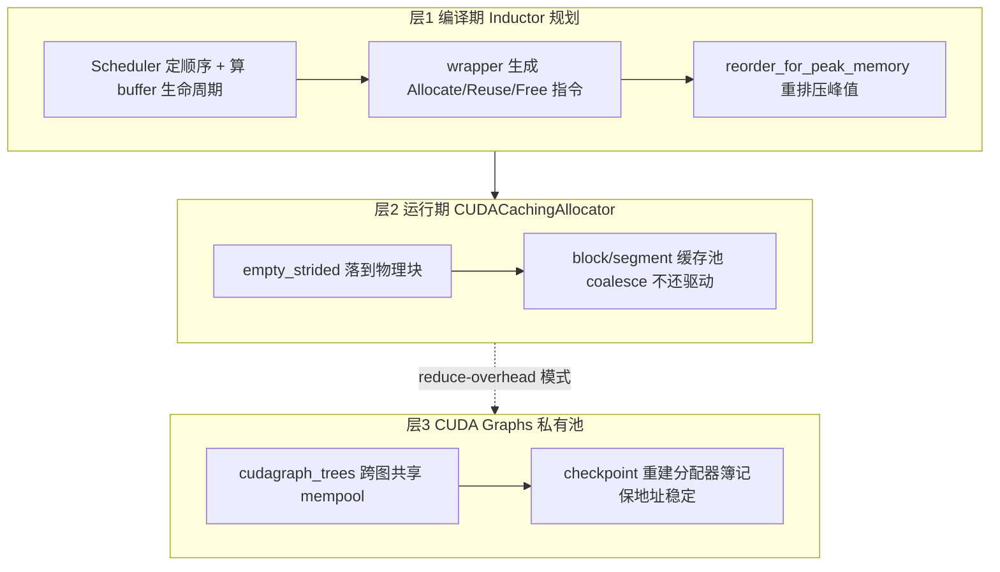
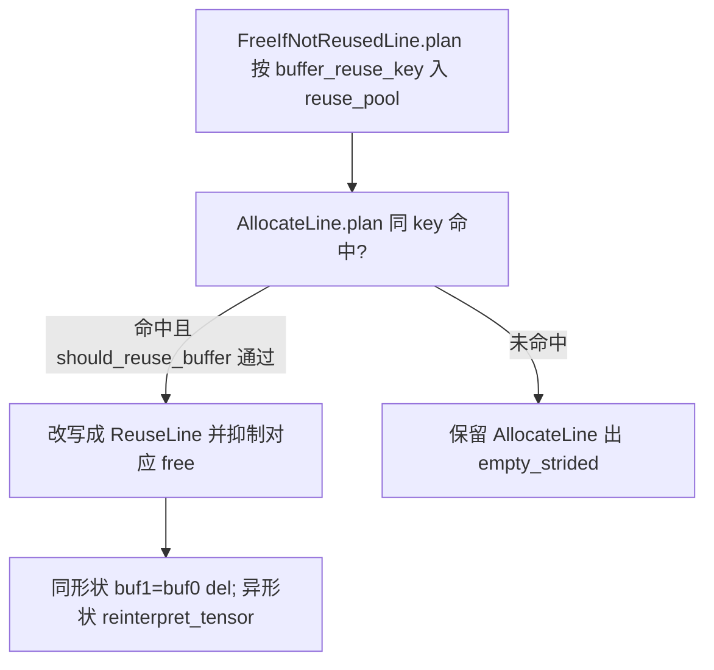
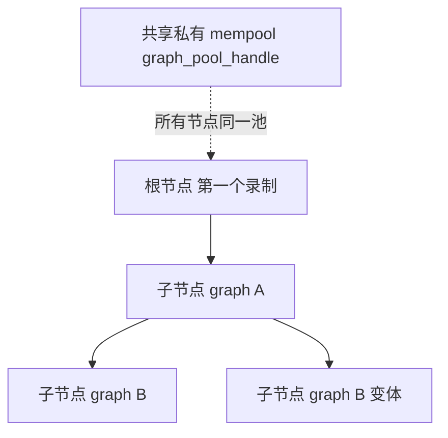

# torch.compile 内存分配管理 — 三层:编译期规划 / 运行期缓存池 / CUDA Graphs 私有池

> [!note] 页面角色与审计状态
> **页面角色**：Inductor 编译期规划、运行时 caching allocator 与 CUDA Graph 私有池三层关系的内存专题；它保留跨层机制纵深，不把 logical buffer、allocator block 和 graph-private pool 合并成同一种对象。
> **原始基线**：PyTorch `5f6df46744a`；**当前审计基线**：PyTorch `e8f97c1a6ef8cbcdd0a946606bc1e924e4f07e52`。
> **审计状态**：已纳入历史 manifest，但跨基线 locator、配置默认值和实验尚未逐结构单元复核；原页订正只对其声明基线负责。Inductor buffer liveness/reuse 见 [[buffer_liveness_memory_planning_and_reuse_analysis]]，Scheduler reorder 与 dependency 见 [[scheduler_dependency_graph_fusion_and_ordering_analysis]]；Inductor 领域入口见 [[02_compile_stack/04_inductor/index]]。

> **Source baseline**: pytorch @ `5f6df46744a`(trunk, 2026-06-29)
> **Dimension**: Deep Dive(mechanism-level)
> 最后更新: 2026-06-30
>
> 本页回答「torch.compile 的 memory alloc 是怎么管理的」。核心论点:**不是单一机制,而是三层叠加**——① 编译期 Inductor 规划 `alloc/reuse/free` 的「逻辑」;② 运行期 `CUDACachingAllocator` 管物理块;③ `reduce-overhead`(CUDA Graphs)模式额外用一个跨图共享的私有池 + checkpoint 保证地址稳定。上游图捕获见 [[02_compile_stack/01_dynamo/index]],compile_fx 编排入口见 [[inductor_compile_fx_orchestration_analysis]]。

---

## 1. 概览

**一条主线**:三层各管一段,且**自上而下叠加**:



| 层 | 谁做 | 管什么 | 锚点 |
|----|------|--------|------|
| 1·编译期默认复用 | `codegen/wrapper.py` `memory_plan_reuse` | 按 buffer 生命周期把 `Allocate`+`Free` 改写成 `Reuse` | `wrapper.py:2436` |
| 1·编译期峰值重排 | `_inductor/memory.py` `reorder_for_peak_memory` | 重排算子顺序降低峰值 live memory | `memory.py:1016` |
| 1·编译期池化规划(可选) | `codegen/memory_planning.py` `MemoryPlanner` | 把 buffer 打包进预分配池(`memory_planning=True` 才开) | `memory_planning.py:675` |
| 2·运行期物理池 | `c10/cuda/CUDACachingAllocator.cpp` | 真正的设备内存:block/segment 缓存复用 | `CUDACachingAllocator.cpp:201` |
| 3·CUDA Graphs 私有池 | `_inductor/cudagraph_trees.py` | 跨图共享 mempool + 地址稳定 + checkpoint | `cudagraph_trees.py:2302` |

**Quick start(看/控制内存的开关 + 从哪读起)**:
- `torch._inductor.config.allow_buffer_reuse`(默认 `True`,`config.py:252`):默认的逐 buffer 复用总开关。
- `config.reorder_for_peak_memory`(默认 `True`,`config.py:434`):峰值重排。
- `config.memory_planning`(默认 **`False`**,`config.py:255`,`TORCHINDUCTOR_MEMORY_PLANNING=1`)+ `config.memory_pool`(默认 `"intermediates"`,`config.py:266`):可选的池化静态规划。
- `mode="reduce-overhead"`(= `config.triton.cudagraphs=True`):启用 CUDA Graphs `cudagraph_trees`。
- 读源码:默认复用从 `wrapper.py:2436` `memory_plan_reuse` 进;峰值重排从 `memory.py:1016` 进;CUDA Graphs 从 `cudagraph_trees.py` 顶部 docstring(`:1-35`)进。

> **一句话澄清(贯穿全页)**:Inductor 的 `del`/`reuse` 是**逻辑复用**——它只决定生成代码里 `empty_strided`/`del` 的顺序,减少分配次数和峰值;**物理显存最终都由 `CUDACachingAllocator` 池管理**。两层叠加才是最终行为。

---

## 2. 层 1:编译期 — Inductor 静态内存规划

### 2.1 两条路径:默认逐 buffer 复用 vs 可选池化规划

总分发在 `run_wrapper_ir_passes`(`codegen/wrapper.py:2480`):

```python
def run_wrapper_ir_passes(self, is_inference: bool):
    # We disable planning during training because it presently increases peak memory consumption.
    if is_inference and config.memory_planning:
        self.memory_plan()          # 池化规划(§2.5),仅 inference + 开关
    else:
        if config.allow_buffer_reuse:
            self.estimate_peak = EfficientPeakEstimate()
        self.memory_plan_reuse()    # 默认:逐 buffer 复用(§2.2)
```

要点:**池化规划默认关、且训练禁用**(注释明说会抬峰值,`wrapper.py:2481`);默认走的是 §2.2 的逐 buffer 复用。

### 2.2 默认路径:wrapper 的 Allocate/Reuse/Free 两遍规划

**指令对象化**:内存操作不是立刻拼字符串,而是表示成 `WrapperLine` 子类——`MemoryPlanningLine`(抽象基类,带「两遍」契约:`plan(state)` 找复用 + `codegen()` 出代码,`wrapper.py:803/806/810`)、`AllocateLine`(`:943`)、`FreeIfNotReusedLine`(`:1057`,字段 `is_reused`)、`ReuseLine`(`:1136`)、`NullLine`(`:1172`,buffer 被移除时塌缩成它)、`FreeLine`(`:729`,只 free 不复用)。**对象化正是为了让一个独立的规划遍能在出代码前把 `Allocate`+`Free` 改写成 `Reuse`。**



**Plan 遍**(`memory_plan_reuse`,`wrapper.py:2436`):遍历 `self.lines`,对每个 `MemoryPlanningLine` 调 `line.plan(state)`(`:2455`)。`FreeIfNotReusedLine.plan` 按 `buffer_reuse_key`(设备+dtype+size+stride)把自己压进 `MemoryPlanningState.reuse_pool`(`:485`);`AllocateLine.plan` 用同 key 在 `state` 里命中就 `pop` 出那条 free,经 `should_reuse_buffer` 接受后把 free 标 `is_reused=True`、**自身返回一个 `ReuseLine`**——于是 `Allocate`→`Reuse`、对应的 `Free` 被抑制(`:966-995`)。

**复用决策是峰值感知的**:`should_reuse_buffer`(`wrapper.py:956`)对相邻节点(`free` 紧挨 `alloc`)无条件复用,否则只有 `size + 区间内峰值 <= 全局峰值` 才复用(`EfficientPeakEstimate`/`SegmentedTree`,`:902`)。**为什么**:复用会延长 buffer 的 live range,可能反而抬高峰值;这个检查拒绝会越过现有峰值的复用。

**落地成代码**:
- 分配 → `make_buffer_allocation`(`:3951`)→ `make_allocation`(`:3970`)出设备特化的 `empty_strided_{cuda,cpu,xpu}(...)`(`:3997`,省 ~2us)。
- 复用 → `make_buffer_reuse`(`:4043`):**同 size/stride** 出 `buf1 = buf0; del buf0  # reuse`(纯指针别名);**异 size/stride** 出 `reinterpret_tensor(old, size, stride, offset)`(`:2720`)——即 **view 式复用**:零拷贝零分配地把已释放 buffer 的 storage 按新形状重解释。
- 门禁 `can_reuse`(`:4145`):被移除 / 非 donated 图输入 / 常量 / torchbind / 已 free 的 buffer 不可复用。in-place 算子的输出复用输入 storage 走 `codegen_inplace_reuse`(`:4169`)。

典型生成代码:
```python
buf0 = empty_strided_cuda((...), (...), torch.float32)
triton_poi_fused_add_mul.run(arg0_1, arg1_1, buf0, ...)
del arg0_1
buf1 = buf0   # reuse —— Allocate 被 plan 遍改写掉了
```

### 2.3 Scheduler 侧:生命周期、释放、死节点、mutation

wrapper 决定「**怎么** free/reuse」,但「**何时** 一个 buffer 死」是 scheduler 算的:

- **最后使用分析** `compute_last_usage`(`scheduler.py:8731`):反向扫 `self.nodes`,以图输出为种子,给每个 node 标注它是哪些 buffer 的最后消费者(`node.last_usage`)。
- **释放桥接** `free_buffers`(`scheduler.py:8742`):node 完成后 `buffer_names_to_free.update(node.last_usage)`(`:9799`),backend 周期性 `flush()` → 对可释放 buffer 调 `wrapper_code.codegen_free`(emit §2.2 的 `FreeLine`/`FreeIfNotReusedLine`)。**这就是 scheduler→wrapper 的接缝:scheduler 决定时机,wrapper 决定形式。**
- **死节点消除** `dead_node_elimination`(`scheduler.py:4916`,`config.use_dce` 门控):反向拓扑序,users 全弱/全移除的 buffer 进 `removed_buffers`,无活 buffer 又无副作用的 node 整体删除。
- **mutation 处理** `mutation_renames`(`scheduler.py:4197`,注释 `:4189-4196`,填充于 `:4770-4779`):原地修改(`buf0 = relu_(buf0)`)会在依赖 DAG 里成环;解法是把修改后的版本**重命名**(`mutation_real_name` 反查),codegen 只用 `buf0` 这个规范名,从而保持 DAG 无环、让正常调度+复用成立。

> [!correction] 旧页 [[scheduler_analysis]] 把 `mutation_renames` 标在 `scheduler.py:2913-2928`,经 `5f6df46744a` 核对应为 **`:4197`(声明)/ `:4770-4779`(填充)**;`:2913-2928` 在本 checkout 是 `FusedMixOrderReductions` 类,与此无关(行号随版本漂移,符号名正确)。

### 2.4 峰值重排:`reorder_for_peak_memory`

由 `scheduler.py:4278`(`config.reorder_for_peak_memory` 默认 ON 时)**从 `.memory` 模块导入并调用**,排在所有重排 pass 之最后(避免被其它 pass 撤销)。

- **定义在 `torch/_inductor/memory.py:1016`**。算法(`:1028-1105`):先 `prepare_planning_info` 算 baseline 峰值,再试多个**拓扑序启发式**——`topological_sort_lpmf`(Least-Peak-Memory-First 贪心,`:630`)/ `topological_sort_bfs`(`:779`)/ `topological_sort_dfs`(`:857`)加 baseline,各自重算 `estimate_peak_memory`,最后 `min(...)` 取**估计峰值最低**的顺序。它是**算子重排序以最小化峰值 live 内存**,不是布局/偏移分配。
- **峰值怎么估**:`BufferInfo` 记每个 buffer 的生命周期区间 `(start_step, end_step)`(`memory.py:338`,`compute_memory_timeline` `:346`,图输出 `end_step=-1` 永不释放);`peak_memory_from_buf_info_list`(`:438`)是一条**扫描线**——`delta[start]+=size_alloc`、`delta[end+1]-=size_free`,前缀和取最大 live。

> [!correction] 旧页 [[scheduler_analysis]] 写 `reorder_for_peak_memory` 在 `scheduler.py:2986`——错;实际**定义在 `memory.py:1016`**,scheduler 只在 `:4278-4281` 导入调用。另:`memory.py` 是「区间+扫描线**估峰**来驱动重排序」,**不是**区间图着色/偏移分配;真正的 bin-packing(最接近着色)在 §2.5 的 `memory_planning.py`、且默认不开。

### 2.5 可选池化规划:`memory_planning.py`(`memory_planning=True`)

仅在 **inference + `config.memory_planning`** 时由 `memory_plan()`(`wrapper.py:2431`)调用 `MemoryPlanner(self).plan(self.lines)`(`memory_planning.py:675`)。流水:`convert_to_pool_lines`(把 `Allocate/Free/Reuse` 改写成 `AllocFromPoolLine`)→ `compute_live_ranges` → `allocate_groups`(按 `-size_hint` 大块优先打包)。

核心数据结构(`memory_planning.py`):
- `AllocationPool`(`:392`):一块 `torch.empty` 背书的大 buffer,内部一棵分配树。
- `TemporalSplit`(`:260`):**时间上不重叠**的若干 allocation **共享同一 offset**(时分复用一个槽)——这才是真正的「区间着色/bin-packing」复用核心;`SpatialSplit`(`:342`):生命周期重叠的两块**空间并排**。
- `Allocation`(`:137`):一个 buffer 的槽,`finalize` 后拿到 `pool + offset`,codegen 出 `alloc_from_pool(pool, offset, ...)`。
- `memory_pool` 策略(`config.py:260-268`):`none`(不池化,仅复用)/ `intermediates`(默认,非输出共享一池)/ `outputs`(中间+输出各一池)/ `combined`(单池)。

**为什么默认关**:池化预分配能减少运行时分配次数、降峰值,但当前实现**在训练下会抬峰值**(`wrapper.py:2481` 注释),故默认 `False` 且仅 inference 生效。

### 2.6 池的初始化大小如何确定?(带实例)

> 常见疑问:`AllocationPool` 一开始要分多大?答案是 **编译期算出来、不是预设常量**——池大小 = 把所有入池 buffer 的生命周期区间打进 `TemporalSplit`/`SpatialSplit` 树后的总字节。

- **大小来源**:`AllocationPool.codegen_create`(`memory_planning.py:458`)取 `nbytes = self.root.get_symbolic_size()`(`:461`)作为池的 `empty` 尺寸。`get_symbolic_size` 递归求值:`TemporalSplit`(时分复用)取**各块最大值**,`SpatialSplit`(空分并排)= `align(left) + right`(`:374/378`)。
- **怎么增长**:新块放不进现有树时,`allocate_at_end`(`:445`)把 `root` 包成 `SpatialSplit(old_root, new_block)`——即在池**末尾追加**一段,池随之变大(`can_expand` 由 `config.memory_pool != "none"` 控,`:423/523`)。
- **codegen 形态**:若某单块恰等于整池大小,就按该 buffer 原形状分配;否则发一个**扁平 1-D `uint8` 缓冲**,长度 = `nbytes`(`:476-484`)。池内每个张量再用 `alloc_from_pool` 按 offset 取视图。
- **`alloc_from_pool` 是什么**:Python wrapper 前言里 `alloc_from_pool = torch.ops.inductor._alloc_from_pool`(`wrapper.py:1520`),C++ 算子 `_alloc_from_pool(Tensor self, int offset_bytes, ScalarType dtype, int[] size, int[] stride) -> Tensor`(`torch/csrc/inductor/inductor_ops.cpp:36/129`)——**零分配**,只在已分配的池存储上按字节偏移建一个张量视图(类 `as_strided`)。

**真实实例**(`test/inductor/test_memory_planning.py:108-142`,`@config.patch(memory_planning=True)`):

```python
class Foo(torch.nn.Module):           # 两个同时存活的中间张量
    def forward(self, x, y, z):
        t0 = x.matmul(y); t1 = x.matmul(z)
        t0 = x.transpose(0, 1).matmul(t1); t1 = x.matmul(t0)
        return t0.sum() + t1.sum()
# torch.compile(f, dynamic=True) 生成(GPU):
pool1 = empty_strided_cuda((4*s27*s77 + align(4*s77*s77), ), (1, ), ...)   # 扁平字节池
buf0  = alloc_from_pool(pool1, 0,                 torch.float32, (s77, s77), (s77, 1))
buf1  = alloc_from_pool(pool1, align(4*s77*s77),  ...)
```

池 `pool1` 是一条 1-D 缓冲,大小 = `4*s27*s77 + align(4*s77*s77)`(正是 `SpatialSplit = align(left) + right`),两个张量按 offset 各取一段:

```
pool1  (总 = 4*s27*s77 + align(4*s77*s77) 字节, stride=(1,))
┌──────────────────────────────┬───────────────────────────────────────┐
│ offset 0                     │ offset = align(4*s77*s77)              │
│ buf0  (s77,s77) f32          │ buf1  ...                              │
│ 占 4*s77*s77,补齐到 align()   │ 占 4*s27*s77                           │
└──────────────────────────────┴───────────────────────────────────────┘
        alloc_from_pool 只算偏移、不分配 ── 真正的 cudaMalloc 在运行期由层 2 触发
```

> 动态形状下池大小是**符号表达式**(`s77`/`s27`),运行期代入具体值后才知确切字节——即「两阶段」:先算尺寸再 `empty_strided`(对应报告 §2.5 提到的 `test_unbacked_symint` 场景,`memory_planning.py:325` `get_symbolic_size`)。

---

## 3. 层 2:运行期 — `CUDACachingAllocator`(物理池)

§2 规划好的 `empty_strided_cuda(...)` 调用,运行时最终都落到 PyTorch 的**缓存设备分配器**——这才是真正的物理显存池:

- 一次 `cudaMalloc` 拿一大块 `segment`,切成 `Block`(`prev/next` 双向链表,`CUDACachingAllocator.cpp:201`);释放只是标空闲 + 与相邻块 **coalesce**,**不还给驱动**;按 stream 池化;支持 expandable segments。
- **为什么**:`cudaMalloc/cudaFree` 同步且昂贵,训练每步上万次张量分配不能每次打扰驱动。

**物理段大小怎么定**(承接 §2.6:层 1 的 `empty_strided` 请求落到这里时,实际 `cudaMalloc` 多大?):请求先 `round_size`(`CUDACachingAllocator.cpp:3063`:`<512B → 512`;否则向上取 `kMinBlockSize=512` 的倍数,或按 `roundup_power2_divisions` 在 2 的幂区间内细分),再由 `get_allocation_size`(`:3697`)按档位决定 **segment 大小**:

| 请求大小 | segment 大小 | 常量(`c10/core/AllocatorConfig.h:16-24`) |
|---------|-------------|------------------------------------------|
| ≤ 1 MiB | 固定 **2 MiB** | `kSmallSize=1048576` → `kSmallBuffer=2097152` |
| 1–10 MiB | `large_segment_size()`(默认 **20 MiB**) | `kMinLargeAlloc=10485760` |
| ≥ 10 MiB | 向上取 **2 MiB** 的倍数 | `kRoundLarge=2097152` |

即「**初始 cudaMalloc ≠ 请求字节**,而是按这三档向上取整成段」;同一段内的小请求再 `should_split`(`:3677`)切 `Block` 复用。所以一个几 KB 的中间张量,首次也会触发一次 2 MiB 段分配——这正是 `max_memory_reserved()`(段总量)常远大于 `max_memory_allocated()`(请求总量)的原因。配置 `PYTORCH_CUDA_ALLOC_CONF`(`max_split_size_mb`/`roundup_power2_divisions`/`expandable_segments`)可调这套档位。

**两层关系**:Inductor 的 `del`/`reuse` 减少了**逻辑分配次数**;即便仍要 `empty_strided` 分配,物理块也由缓存池复用——**编译期逻辑复用 + 运行期物理池复用,叠加才是最终显存行为**。

> 本层已有源码级深页,不在此重复:`Block`/segment 切分链、stream 借还、expandable segments、`requested_bytes` vs `allocated_bytes` 碎片度量,详见 [[caching_allocator_autocast_profiler_analysis]] §一「缓存设备分配器」。

---

## 4. 层 3:CUDA Graphs — `cudagraph_trees` 跨图共享私有池

启用 `mode="reduce-overhead"` 后,内存管理多出一层。核心实现 `torch/_inductor/cudagraph_trees.py`(顶部 docstring `:1-35` 解释了全部动机)。

### 4.1 为什么是「树」而非单池

普通 `torch.cuda.graph` 单池捕获有两个硬限制(docstring `:9-25`):① 录了 A、B 后只能**按固定顺序**重放 A→B;② A→非图代码→B 之后,**不安全保留 A 产出的中间张量**(可能被 B 覆写)。`cudagraph_trees` 用**一棵图树共享同一个私有 mempool** 解决:支持任意 A→B 或 A→B′ 的**分支**(不止线性序列),图间张量**不拷贝、地址稳定、死内存可被后续图复用**;主要用于 **Dynamo 跨 graph break / fwd-bwd / 多个编译图**。



### 4.2 树结构

- `CUDAGraphTreeManager`(`:2243`):每设备一个,把所有录制/执行组织成树,并强制后续执行遵循同样的顺序与输出生命周期。
- `CUDAGraphNode`(`:902`):一次函数→CUDA Graph 的录制;`parent` 用 weakref 避免环(`:953`),`children: dict[FunctionID, list]`(`:959`);**path** = 从根到当前节点的有序链(`_path_from_root` `:1674`),`PathOutputIndex=(depth, output_index)` 索引到 `path_weakrefs`。

### 4.3 共享私有池

- 池在 manager 里建一次:`self.cuda_graphs_thread_pool = torch.cuda.graph_pool_handle()`(`:2302`),用一个空 capture 的 dummy `CUDAGraph` 保活(`:2301`);**单 stream**(`:2297`,因为缓存分配器把 segment 绑到分配它的 stream,多 stream 会妨碍跨录制复用)。
- 每个 node 拿同一个 pool(`:955`),capture 时 `torch.cuda.graph(..., pool=self.cuda_graphs_pool, ...)`(`:1454`)。**为什么共享**:一张图产出、下一张图消费的张量因此停在**稳定地址**、无需拷贝(docstring `:2-7`)。

### 4.4 地址稳定 / 静态输入

- `static_input_idxs`(`:1019`)= 调用方声明的 static ∪ `cudagraph_managed_idxs`(上一张图的输出)∪ opaque;其补集 `non_static_input_idx` 才需每次拷贝。
- 每次 replay 前用一次 `torch._foreach_copy_` 把 non-static 输入批量拷进**固定的录制 buffer**(`_copy_inputs_and_remove_from_src` `:1188/1208`)。
- 地址变了怎么办:`check_invariants`(`:1932`)用 C++ 快路径比对 managed/static 输入的 `data_ptr`,不一致 → **重录一个子节点**(`CudagraphManagedIdxMismatch`/`StaticInputIdxMismatch`);若 `rerecord_if_static_inputs_change=False`(默认 `True`,`:950`)则 `torch._check(False)` **硬报错**(`:1228`)。

### 4.5 checkpoint / replay 内存安全

**问题**(docstring `:30-34`):replay 只重放 GPU 算子、**不重建分配器的 CPU 侧簿记**;因此 replay 之后的 eager 分配、或要录一个新子图时,无法得知图占用的存活块,会撞内存。

**解法**:录制结束时 `torch._C._cuda_getCheckpointState`(`:1568`)存下分配器状态;需要时 `apply_checkpoint_execution_state_in_allocator`(`:3135`)用 `_cuda_setCheckpointPoolState` **重建 CPU 簿记**,再对「自上次调用以来已死」的块(`data_ptrs_dead_since_invocation` `:1818`)逐个 `raw_delete` 物理释放。manager 在转入 eager 执行前(`:2499`)和录新子图前(`:2594`)调用它。

### 4.6 集成 + graph partition

- 选择:`compile_fx.py:1968`(`config.triton.cudagraph_trees` 为真)把 `cudagraphify_impl` 换成 trees 版;`CUDAGraphTreeManager.run`(`:2382`)分发 warmup / 执行已有子节点 / 录新子节点。
- **graph partition**:CUDA Graphs 不能录所有算子,`Scheduler.should_partition`(`scheduler.py:8856`)把这些切成独立的非 cudagraph 分区单独跑——CPU 算子(`:8896`)、`DeviceCopy`(`:8899`)、`Conditional`(`:8902`,即 §控制流的 cond)、unbacked/动态 shape(`:8905/8914`)、`is_cudagraph_unsafe_op`(`utils.py:4386`,含 `Conditional`/`WhileLoop` 控制流)。

### 4.7 不变量 / 限制(源码明示)

- **无 CPU 算子 / 单 CUDA 设备**(`cudagraph_utils.py:343`);**无动态 shape**(`scheduler.py:8914`,`cudagraph_skip_dynamic_graphs`)。
- **mutation 受限**:只允许改 参数/静态输入/图录制张量,其余被跳过(`cudagraph_utils.py:305`);manager 对突变非托管输入的函数直接退回 eager(`:2477`)。
- **录制/重放生命周期必须一致**:`check_invariants` 硬断言录制期死掉的输入在重放期也死(`:1992`,否则「已写过它们的内存」)。
- **输出不能跨代保留、需 clone**:读到被后续 run 覆写的图输出会报错并提示 `torch.compiler.cudagraph_mark_step_begin()` 或手动 clone(`:3038`);user-visible 输出可自动 clone(`has_live_user_visible_output_cloning` `:2738`)。

---

## 5. 三层串起来

| 开关 / 写法 | 层 | 作用 | 默认 |
|------------|----|------|------|
| `allow_buffer_reuse` | 1 | 逐 buffer 复用(`Allocate`→`Reuse`) | ✅ True |
| `reorder_for_peak_memory` | 1 | 算子重排压峰值 | ✅ True |
| `memory_planning` + `memory_pool` | 1 | 池化静态规划(仅 inference) | ❌ False / `intermediates` |
| (底层,无开关) | 2 | `CUDACachingAllocator` 物理块缓存 | 始终 |
| `mode="reduce-overhead"` | 3 | `cudagraph_trees` 跨图共享私有池 | ❌(需显式开) |

**一句话总结**:

> **编译期**——Inductor 默认按 buffer 生命周期把 `Allocate`+`Free` 改写成 `Reuse`(`wrapper.py` `memory_plan_reuse`,峰值感知;同形状指针别名、异形状 `reinterpret_tensor`),scheduler 算最后使用 + `free_buffers` 决定释放时机,`reorder_for_peak_memory`(`memory.py:1016`)重排压峰值,可选 `memory_planning` 走 `memory_planning.py` 的时分/空分池化打包;**运行期**——这些 `empty_strided` 最终落 `CUDACachingAllocator` 的 block/segment 缓存池;**CUDA Graphs 模式**——`cudagraph_trees` 再叠一个跨图共享的私有 mempool,靠固定地址 + checkpoint 重建分配器簿记来保证录制/重放的内存安全。

---

## Related Pages

- [[19_torch_compile_end_to_end/00_pytorch_graph_series_index]] — 当前固定基线的图编译系统化课程入口
- [[02_compile_stack/04_inductor/index]] — Inductor 领域索引
- [[buffer_liveness_memory_planning_and_reuse_analysis]] — logical buffer、last use、reuse 与静态 peak 课程主线
- [[scheduler_dependency_graph_fusion_and_ordering_analysis]] — Scheduler dependency、fusion 与 reorder
- [[inductor_memory_allocation_guide]] — **实战指南**:实际分配走查 / 分配器选型对照 / `memory_stats` 实测复现 / 实践建议(本页的动手版)
- [[wrapper_execution_memory_allocation_and_reuse_analysis]] — wrapper 层 `MemoryPlanningLine`/reuse pool 的源码级机制(与本页视角重叠,归一进行中,见该页页头互指)
- [[caching_allocator_autocast_profiler_analysis]] — **层 2 深页**:`CUDACachingAllocator` 的 Block/segment/stream/expandable 源码级机制
- [[inductor_codegen_analysis]] — wrapper codegen 全景(§4.5 内存规划集成是本页层 1 的简版)
- [[scheduler_analysis]] — Scheduler 生命周期 / `dead_node_elimination` / `mutation_renames`(本页订正了其中两处行号)
- [[PyTorch_Inductor_Technical_Analysis]] — §6 内存规划与内存池 / §7 CUDA Graphs(本页是这两节的源码级展开)
- [[control_flow_capture_analysis]] — `Conditional`/`WhileLoop` 为何被 graph partition 切出 cudagraph
- [[PyTorch_CUDA_Graphs_Complete_Guide]] — CUDA Graphs 通用用法(非 `cudagraph_trees` 专属)
