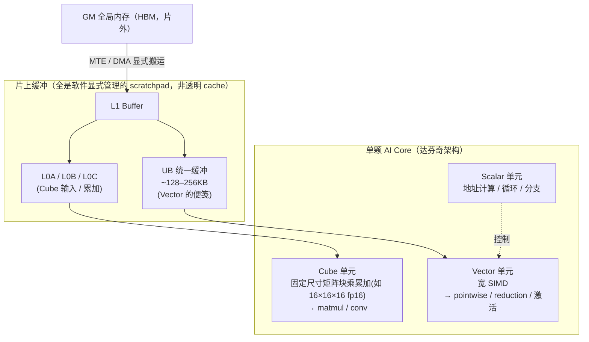
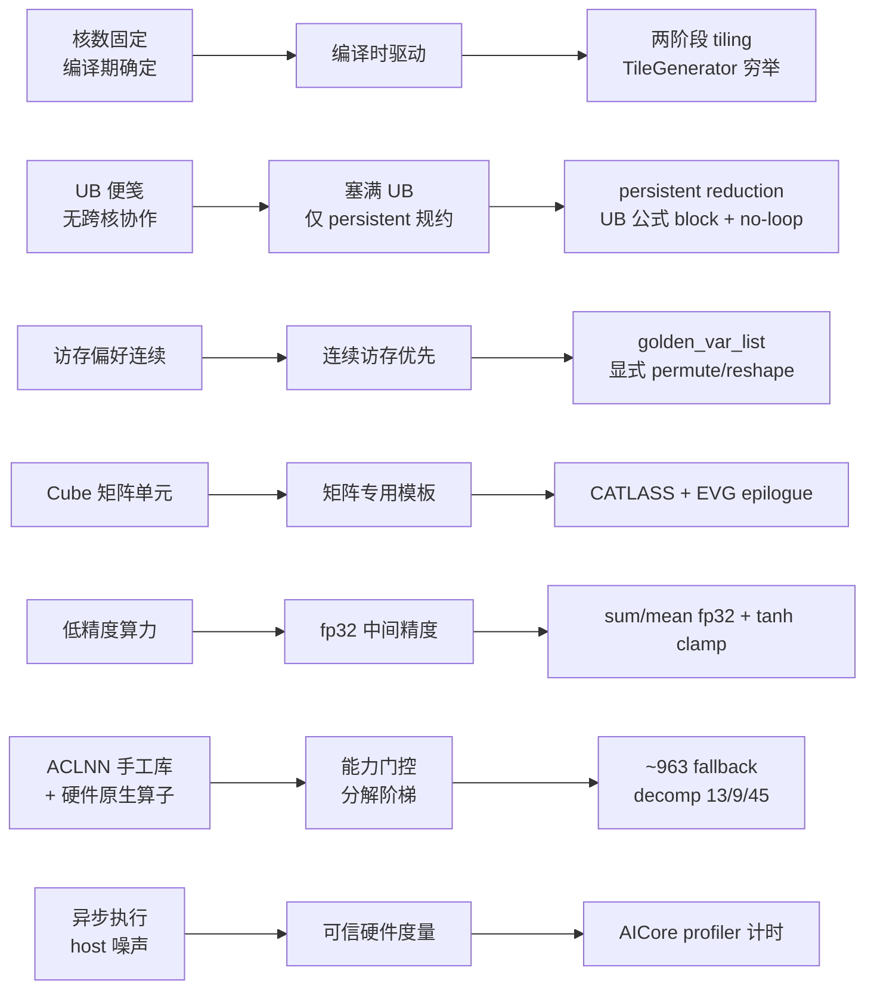

# NPU Inductor 优化思想全景：硬件特性如何驱动每一项优化

> 分析对象：torch_npu `_inductor` 三后端（Triton / MLIR / DVM）的**优化思想与设计哲学**，按「硬件特性 → 优化思想 → 实际案例」组织
> 来源：GitCode `anyrenwei/Ascend-Related-Docs`（`ascend/torch_inductor/inductor/` 文档体系，基于 torch_npu 2.7 分支）+ 达芬奇架构背景
> 版本：torch_npu 2.7 / 2.7.1
> 最后更新：2026-06-13

> [!note] 代码位置说明
> §一–§十一 的 `file:line` 沿用来源文档体系的标注（torch_npu 2.7 分支），**文件名 + 函数名为准，行号为指示性**（不同版本/分支会漂移，本库 [[11_npu_inductor_splittiling_backend_analysis]] 的同名逻辑行号即与此不同）。**§十二「实战」的行号已用本地 `pta_suhaibo/torch_npu` checkout（v2.7.1，commit `8bcbe1939`）逐一核验**，可直接 `git grep` 对照。

---

## 一、为什么要从硬件讲起

torch_npu Inductor 的几乎每一项「与社区不一样」的优化，都不是工程师的偏好，而是被**达芬奇（Da Vinci）AI Core 的硬件特性逼出来的**。脱离硬件谈这些优化，只能得到一堆抽象口号；绑定硬件来看，它们是一条逻辑链。

一句话抓住主线：

> **NPU Inductor 的优化本质是「编译时驱动」，而 GPU / 原生 Inductor 是「运行时驱动」。** 因为 NPU 硬件是**固定核数 + 需软件显式管理的便笺式片上缓冲**，编译器在编译期就能、也必须把一切算死；GPU 靠海量 warp 的运行时占用率 + autotuning 摊平不确定性。

### 1.1 一颗 AI Core 的结构



### 1.2 四条硬约束（后面每个优化都从这里长出来）

| 硬件约束 | 含义 | 与 GPU 的关键不同 |
|---|---|---|
| **核数固定**（`num_vector_core` 编译期已知） | 不能超额订阅 warp 来动态隐藏延迟 | GPU 占用率运行时浮动 → 适合 autotuning |
| **UB 是便笺 + 无跨核协作原语** | 没有 semaphore 协作规约 / cooperative grid | GPU 可多 block 协作规约 |
| **访存强烈偏好连续** | DMA + Vector 对齐；非连续要显式重排 | GPU 一维线性地址，无「维度顺序」概念 |
| **fp16/bf16 是主力算力，fp32 慢** | 低精度快但累加易掉精度 | 两者都有此问题，但 NPU bf16 支持面更受限 |

---

## 二、总览：硬件 → 思想 → 案例



| # | 硬件特性 | 优化思想 | 实际案例 | 章节 |
|---|---|---|---|---|
| 1 | 核数固定 + 编译期确定 | 编译时驱动 | 两阶段 tiling / TileGenerator | [三](#三核数固定--编译期确定--编译时驱动) |
| 2 | UB 便笺 + 无跨核协作 | 显式塞满 UB | 仅 persistent reduction | [四](#四ub-便笺--无跨核协作--塞满-ub只做-persistent-规约) |
| 3 | 访存偏好连续 | 连续访存优先 | golden_var_list + 显式重排 | [五](#五访存偏好连续--连续访存优先) |
| 4 | Cube 专用矩阵单元 | 矩阵走专用模板 | CATLASS + EVG epilogue | [六](#六cube-专用矩阵单元--矩阵走专用模板) |
| 5 | 低精度算力 | fp32 中间精度 | sum/mean fp32、tanh clamp | [七](#七低精度算力--fp32-中间精度) |
| 6 | ACLNN 手工库 + 原生算子 | 能力门控 + 分解阶梯 | ~963 fallback、decomp 13/9/45 | [八](#八aclnn-手工库--硬件原生算子--能力门控--分解阶梯) |
| 7 | 异步执行 + host 噪声 | 可信硬件度量 | AICore profiler 精确计时 | [九](#九异步执行--host-噪声--可信的硬件级度量) |
| —（非硬件） | 集成方式带来的工程债 | 复用上游 / 渐进重构 | origin tracking O(n²)→O(n) | [十](#十非硬件集成方式--工程优化) |

---

## 三、核数固定 + 编译期确定 ⇒ 编译时驱动

**硬件特性**：AI Core 数量是定值，编译期就知道 `num_vector_core` 和 UB 容量。不像 GPU 靠成百上千 warp 的运行时占用率摊平延迟——NPU 没有这个「运行时弹性」可依赖。

**思想**：硬件参数编译期全已知，就**把 tiling 决策彻底搬到编译时算准**，运行时不再调。

**实际案例：两阶段 tiling**（来源：`inductor-tiling-comparison §2/§5`）
- 原生 Inductor：`select_tiling()` 做一次 stride 启发式，最优 block 留给**运行时 autotuning** benchmark 选。
- NPU 拆两步：`SplitTiling` 先按「维度角色（高维 / 低维 / 规约轴）」选切分轴（`select_split_axis` / `select_tiling_axis`）→ `TileGenerator` 再用纯数值穷举（`numel//2`、`next_power_of_2(numel)`、按 `min_numel` 对齐）在编译期把 block 配置**算死**（`split_tiling.py`、`tile_generator.py`）。
- **为什么能这么干**：核数和 UB 是常量，编译期一次算准，省掉整个运行时 benchmark 环节。

> 代价（见 [§十一](#十一收尾动态-shape-是编译时驱动的反噬)）：所有数值穷举都假设 `numel` 是具体整数，动态 shape 一来这套决策直接坍塌。

---

## 四、UB 便笺 + 无跨核协作 ⇒ 塞满 UB，只做 persistent 规约

**硬件特性**：UB 是一块要软件自己管的便笺（~128–256KB），且**核与核之间没有协作规约原语**。GPU 可用 `CooperativeReductionGrid` 把一个大规约拆到 64 个 block、semaphore 协作合并；NPU 没有。

**思想**：把整个规约**塞进单个 AI Core 的 UB 里一次算完**，彻底回避跨核同步。

**实际案例：persistent-only reduction + UB 公式化 block**（来源：`inductor-tiling-comparison §3.3`）
- NPU **放弃 cooperative reduction，只做 persistent**：靠大 UB 把整条规约轴一次放进片上完成。
- block 大小不凑 2 的幂，而是按 UB 容量**公式化精算**：`block = ub_size / input_ptr_num / dtype_bytes`，按实际输入指针数与 dtype 吃满 UB。
- 配套：**多维规约强制合并成单一 `r` 轴**（`{x:d0, r:d1*d2}`），简化切分搜索、保证 UB 内连续规约。
- **附带 No-loop 优化**：≤4KB 小轴直接展开、不生成循环，硬编码为 `tl.constexpr`（`split_tiling.py:218`）——数据反正常驻 UB，展开比循环省开销。

**GPU 对比**：GPU 用 shared memory（48–96KB）+ semaphore 做多 block 协作规约，不在乎单块放不下；NPU 必须「单核 UB 内闭环」——这是 NPU vs GPU 最根本的架构级分叉，也是动态 shape 下 persistent 误判会**直接 UB 溢出崩溃**的源头。

---

## 五、访存偏好连续 ⇒ 连续访存优先

**硬件特性**：Vector 单元 + DMA 对**连续、对齐**的访存效率最高，非连续（transpose/broadcast 后）代价显著。GPU 用一维线性地址 `ptr+offset`，根本没有「维度顺序」概念。

**思想**：宁可在 codegen 里**多插入显式重排**，也要保证落到硬件的是连续访问。

**实际案例：golden_var_list 维度对齐 + IndexAnalysis 显式 permute/reshape**（来源：`inductor-tiling-comparison §3.2/3.8/3.9`，`kernel_analysis.py`、`select_golden_varlist`）
- 定义一条「标准维度顺序」`golden_var_list`，要求所有 load/store 索引维度对齐到它。
- 不一致时由 `IndexAnalysis` **显式插入 `tl.reshape()` / `tl.permute()`**，把布局掰成 NPU 偏好的连续形态，而不是把变换隐含进索引表达式。

> 同源思想的其它案例：
> - **DVM `view_load` 零拷贝**：非连续但末维 `stride=1` 时零拷贝视图加载，省一次转连续（`06 §9.6`）。
> - **transpose 标志标注**：mm 输入转置时标 `meta["trans_a/b"]`，直接 `k.matmul(...,True,False)`，**消掉一个真实 transpose 算子**（`08 §9.5`）。

`golden_var_list` 的详细机制（`_detect_different_expansions` / `_build_guarded_expansions` / 坐标变换）见 [[11_npu_inductor_splittiling_backend_analysis]] 差异 1。

---

## 六、Cube 专用矩阵单元 ⇒ 矩阵走专用模板

**硬件特性**：matmul 不是 Vector 单元算的，而是 **Cube 单元**以固定矩阵块做乘累加（类比但不同于 GPU tensor core）。通用 Triton pointwise codegen 喂不饱 Cube。

**思想**：GEMM 这类**单独开一条专用模板后端**，并把后续逐元素算子**焊进矩阵 kernel 尾部**，省一次进出 UB/显存。

**实际案例：CATLASS GEMM + EVG epilogue 融合**（来源：`04-backend-triton §5`）
- `mm/addmm/bmm` 绕开 Triton，走类 CUTLASS 的 **CATLASS 模板库**（自有 tiling + autotune，贴合 Cube 矩阵块尺寸）。
- **EVG（Epilogue Visitor Graph）** 把 GEMM 之后的 `add/mul/relu/sigmoid` 融进 epilogue——matmul 算完结果还在片上，顺手做完激活再写回，避免「算完 matmul→写回→再起 elementwise kernel→再读回」。
- 调度层用 **`NPUCombinedScheduling` 委托分发**：`choose_node_backend` 按 `is_catlass_template` 把 GEMM 路由给 CATLASS、其余给 Triton，两条 codegen 路径在同一调度框架内共存。融合分发详见 [[13_scheduler_dependency_graph_fusion_and_ordering_analysis]]。

---

## 七、低精度算力 ⇒ fp32 中间精度

**硬件特性**：fp16/bf16 是主力算力（快），但尾数位少，**长序列累加（规约）或激活函数在低精度下会溢出 / 掉精度**。

**思想**：**算力用低精度，累加与数值敏感处用 fp32 兜底**，边界自动 cast，不污染外部 dtype。

**实际案例：规约 fp32 累加 + 激活防溢出**（来源：`08-compilation-stages-analysis §3.3 / §9.5`）
- `insert_sum_fp32_prepost_cast_prims`：reduce-sum 前后插 fp32 升/降精度 cast，**用 fp32 累加**防溢出。
- `mean`：fp16/bf16 输入先升 fp32 再算（`lowering_override_list.py`）。
- `tanh` 自定义分解：`clamp(-8.8, 8.8)` 再走 exp 公式，防 `exp` 溢出。
- `_install_bf16_promote`：DVM 路径上 25 个不支持 bf16 直算的 op，自动 `bf16→fp32→算→bf16`。

---

## 八、ACLNN 手工库 + 硬件原生算子 ⇒ 能力门控 + 分解阶梯

**硬件特性**：CANN 自带 **ACLNN 手工深度优化算子库**，很多算子（矩阵、归一化、池化、通信）厂商已调到极致；另有算子**硬件原生支持**（如 `max_pool2d_with_indices` 在 Ascend910_9391+）。

**思想**：**别什么都强行 lowering 成 Triton——能用厂商手工库 / 原生算子的就直接用**；且「拆不拆算子」服从「哪种形态让目标后端跑得最快 / 能生成代码」。

**案例一：约 963 算子 fallback 走 ACLNN**（来源：`03-compile-flow §4.1`，`08 §4.3`；计数按 v2.7.1 源码订正）
- `约 963 = 348（native fallback）+ 615（NPU 额外）`（截至 v2.7.1），注册成 `ExternKernel` 直接调 ATen→ACLNN，**比生成 Triton 更快**；额外 fallback 集中在分布式通信 / 位运算 / 数学函数 / 池化等手工库强项区。fallback 清单的工程化管理见 [[20_npu_lowering_guide]]。

**案例二：阶梯式 decomposition**（来源：`08 §3.4`）
- 排除分解的算子数：**`13（原生）→ 9（Triton）→ 45+（DVM）`**——**后端融合粒度越高，越不愿把算子打碎**（DVM 在 FX 图级整块融合，故最大限度保留原生算子）。
- 排除理由三类：NPU 有高效原生 kernel（`gelu/addmm/layer_norm`）、有专用算子替代（`dropout→npu._npu_dropout`）、硬件原生支持（`max_pool2d`）。
- **反向**：DVM/MLIR 又把 `sigmoid/gelu/tanh` **展开**成算术式（`06 §4.4`），因为 DVM 解释器 codegen 只认基础算术 op。**同一算子在不同后端「拆」或「不拆」完全相反，唯一标准是「目标后端能不能跑得更好」。**

> [!contradiction] fallback / patch 计数因版本与口径而异
> 本页采用来源文档体系（torch_npu 2.7 分支）口径：fallback **~635**（289+346）、Triton 路径 monkey-patch **30+**。本库 [[11_npu_inductor_splittiling_backend_analysis]] / [[01_npu_compile_paths_overview]] 基于 **v2.7.1 源码核查**给出 fallback **约 963**（348 native + 615 npu-extra，截至 v2.7.1）、patch **35+**。差异主要来自版本漂移与统计口径（是否计入条件性 fallback / 是否按文件聚合），两者均保留，深入核查以本库 v2.7.1 源码页为准。

---

## 九、异步执行 + host 噪声 ⇒ 可信的硬件级度量

**硬件特性**：NPU kernel 异步下发执行，wall-clock 计时会混进 host 端下发/同步噪声，**在 NPU 上测不准**；但硬件 profiler 能读到 AICore 真实执行时间。

**思想**：**autotune 选型必须建立在硬件实测时间上**，否则选出的 tile/config 是被噪声误导的。

**实际案例：AICore 级精确计时替换 `do_bench`**（来源：`08 §8.3`）
- 原生用 `triton.testing.do_bench` 的 wall-clock；NPU 改用 `do_bench_using_profiling_npu`：stream 同步 → `create_profiler` 包裹多次执行 → `read_device_time` 读 CSV 里**实测 AICore 执行时间**。
- 配套 **`NPUFastAutotuner` 专家规则**：把「试遍所有 config」降为「按硬件规则直选少数 config」，压缩编译期 autotune 开销；再叠 msprobe 精度校验 + 线程池并行编译。

**为什么重要**：度量不可信，上面所有 tiling 优化都是空中楼阁。NPU 编译/autotune 工作流详见 [[12_npu_compile]]。

---

## 十、（非硬件）集成方式 ⇒ 工程优化

前九条都能追溯到某个硬件特性。但**工程/架构那一类（消 patch、解耦、origin tracking）与硬件无关**——它们是 torch_npu 集成进 `torch.compile` 的**方式**带来的技术债，不应硬套硬件理由。

**代表案例：origin tracking 替换 traced_graph**（来源：`09-origin-tracking-refactor-design §7.1`）
- 纯**算法复杂度**优化：MLIR 后端原本在 lowering 时为每个 IR 节点手建微型 FX 子图，codegen 时 `merge_traced_graphs` 合并——**每次合并复制全部历史节点，O(n²)**（10 层模型累计复制 `210` 次）。
- 改用 PyTorch 原生 origin 机制（节点自动继承 origin + `V.graph.orig_gm`）后降为 **O(n)**（`20` 次指针赋值），顺带删 17 个 monkey-patch、`ir.py 709→30 行（-96%）`、消除 codegen 二次 tracing。
- 思想是「**复用上游已验证的原生能力，不要自造**」——和消 30+ patch、对标 Intel XPU 零 patch 是同一条工程主线（详见 [[01_npu_compile_paths_overview]] 演进章 + [[11_npu_inductor_splittiling_backend_analysis]] §五）。

这条主线与 torch_npu 上游 patch 消减（S2 编译栈方向）直接相关：`02-architecture §1.4` 的 Monkey-Patch 完整清单 + 重构提案的 P0–P6 分阶段迁移，可作为「逐条处置 + 风险可控演进」的方法论模板。

---

## 十一、收尾：动态 shape 是「编译时驱动」的反噬

前面 §3–§5 反复留的伏笔在这里收口，也是整套优化最深的一条洞察：

> **NPU 的优化全部押注在「编译期已知具体 shape」上，因为硬件（固定核数 + 便笺 UB）逼它在编译期把一切算死。一旦 shape 动态、抽走「具体 `numel`」，整条决策链就断裂——而 NPU 又恰恰缺 GPU 那种运行时 autotuning 兜底。**（来源：`dynamic-shape-challenges §一/§五`）

后果按严重度递增，直接对应前面的硬件特性：

| 算子类 | 退化程度 | 对应硬件特性 |
|---|---|---|
| Pointwise | 「不优」：TileGenerator 退回保守默认 block | §3 编译期穷举失效 |
| Reduction / 多维 Reduction | **「可能错 / 很可能错」**：`golden_var_list` 用 hint 猜错维度顺序 → 连锁污染 persistent 判定 → **UB 溢出崩溃** | §2 单核 UB 闭环 + §5 连续访存 |

文档给的**四个改进方向**，本质都是「**向 GPU 借运行时弹性**」来对冲 NPU 的硬件刚性：

1. **stride 驱动 tiling**——用编译期不变的 stride 替代会变的维度大小，从源头消除「猜」。
2. **Runtime Autotuning for NPU**——缓存 `shape→config`，首次 benchmark，之后命中。
3. **运行时 tiling 参数化**——选轴规则编译期定、block 数值运行期定。
4. **多策略 fallback**——补上类似 cooperative reduction 的「正确但不最优」兜底。

动态 shape 的逐算子退化链与改进方向，详见 [[24_inductor_codegen_dynamic_shape_analysis]] 与 [[20_symbolic_shapes_guards_and_graph_reuse_analysis]]。

---

## 十二、实战：从源码看优化案例（torch_npu v2.7.1 已核验行号）

把 §一–§十一 的抽象思想落到**可点开、可 `git grep` 的真实源码**上。行号均经本地 `pta_suhaibo/torch_npu` checkout（**v2.7.1**，commit `8bcbe1939`）核验；路径前缀统一省略为 `torch_npu/_inductor/`。

### 12.1 矩阵乘 `mm` / `addmm` —— 一个算子踩中几乎所有概念

```python
# 第 0 步：addmm 先被「禁止分解」（前提）—— trait F
# decomposition.py:10  DECOMPOSITION_OVERLOAD_OP = [ ... aten.addmm(:17), aten.gelu(:18),
#                       aten.native_layer_norm(:19), ... ]
# decomposition.py:32  for op in overload_op_set: if op in decompositions: del decompositions[op]
#   → GPU 把 addmm 拆成 mm+add 再融合；NPU 故意 del 掉，整体保留才能整块路由到 Cube/ACLNN
#   （同文件 :46 native_dropout→npu._npu_dropout = 专用算子替代；:24 max_pool2d 仅 910_9391+ 排除 = 版本感知）

# 第 2 步：连续访存守卫 —— trait C
# kernel/mm.py:95  is_contiguous_input = is_contiguous_striding(mat1) and is_contiguous_striding(mat2)
# kernel/mm.py:60  def is_contiguous_striding(...): row_major(stride[1]==1) or col_major(stride[0]==1)
#   → 只有规整连续布局才允许走 CATLASS（Cube 的 L0A/L0B 喂数走 DMA，要求规整 layout）

# 第 3 步：Cube 模板门控 + 入选 —— trait D
# kernel/mm.py:99  if is_contiguous_input and is_nonzero and use_catlass_template("mm", layout, m, n, k):
#                      CATLASS1xGemmTemplate.add_catlass_gemm_choices(choices, layout, [mat1, mat2])
# utils.py:132  use_catlass_template = 白名单(默认 mm,addmm,bmm) + m*n*k≥min_gemm_size(:145) + dtype∈{fp16,bf16,fp32} + max_autotune
#   → 小矩阵不上模板（上 Cube 模板有固定开销，不划算）

# 第 4–5 步：多候选可信 autotune + 兜底 —— trait G/F
# kernel/mm.py:90   choices = [ATen] (+CATLASS +CK +CppGemm)
# kernel/mm.py:134  autotune_select_algorithm(...)            # AICore 实测选优
# kernel/mm.py:135  except NoValidChoicesError: aten_mm...    # 退回 ATen → ACLNN

# epilogue 融合（片上闭环）—— trait D
# codegen/catlass/catlass_scheduling.py:230  _can_fuse_epilogue_impl（:253 不支持链式，:305 CatlassEVGCodegen 生成）
#   → matmul 结果还在 L0C，把 bias/激活顺手做完再写回，省一次 GM 往返
```

### 12.2 规约类（reduction）

```python
# mean：全程 fp32 中间精度 —— trait E
# lowering.py:257  output_dtype = x.get_dtype()
# lowering.py:258  if output_dtype in (torch.float16, torch.bfloat16): x = to_dtype(x, torch.float)  # 升 fp32
# lowering.py:260  sum_result = sum_(x, axis, keepdim)                                                # fp32 累加
# lowering.py:264  return to_dtype(div(sum_result, denom), output_dtype)                             # 降回
#   注释原文：# compute in higher-precision until end of mean lowering

# persistent reduction 的 UB 公式（印证 §四二手公式）—— trait B + A
# codegen/tile_generator.py:37  self.input_ptr_num = 3 if input_ptr_num==0 else min(input_ptr_num, 3)
# codegen/tile_generator.py:39  local_mem_size = 128*1024 if SIMT_ONLY else config.ub_size
# codegen/tile_generator.py:40  self.max_numel_threshold = local_mem_size // input_ptr_num // dtype_bytes   # ← UB 公式
# codegen/tile_generator.py:41  self.stop_numel = min(max_numel_threshold, max_total_numel//(num_vector_core*dtype_bytes))//8
#   → UB 容量 + 固定核数 num_vector_core 同框：一块规约能否塞进单核，按字节精算

# 何时「关」persistent —— trait B
# codegen/scheduling.py:612  # pure_simt_kernel, high dim reduction don't use persitent reduction
# codegen/scheduling.py:613  if kernel.is_unified_simt_kernel() and kernel.reduction_dim()!=len(golden_var_list)-1:
# codegen/scheduling.py:614      kernel.persistent_reduction = False     # ← 依赖 golden_var_list

# native_layer_norm：不分解 + 自定义 lowering + 条件 fallback —— trait F + E
# lowering.py:890  @register_lowering(aten.native_layer_norm)
# lowering.py:899  if get_soc_version()>=250 and x.dtype in (bf16, fp16): return fallback_handler(...)  # 退回 ACLNN
# lowering.py:913  否则 var_mean_helper_ → sub → rsqrt(var+eps) → mul → 仿射
```
其它：`cumsum` 整数输入 SoC<250 时 **int64→int32**（`lowering.py:266-270`）；`argmax/argmin` 用 `make_reduction(override_return_dtype=int64)`（`lowering.py:221-227`，`make_reduction` 覆写全局 `:159`）。

### 12.3 Elementwise 类

```python
# 数学函数换 NPU 优化库 tl_math.* —— codegen
# codegen/triton.py:99  class NPUTritonKernelOverrides(TritonKernelOverrides):
#   :103 exp→tl_math.exp  :107 sqrt→tl_math.sqrt  :111 tanh→tl_math.tanh
#   :115 rsqrt→tl.rsqrt(保留)  :119 floor  :123 erf  :127 ceil

# expm1 自定义分解 —— decomposition.py:36
#   return torch.exp(x) - torch.ones_like(x)     # expm1(x)=exp(x)-1，落到 NPU 高效 exp+减法
```

### 12.4 融合 / 图改写 pass 范式

**注册范式**（框架本身值得学）
```python
# fx_passes/ascend_custom_passes/register_custom_pass.py:7
#   ASCEND_CUSTOME_PASS_REGISTER = {ptype: {level: []}}        # 「类型 × 优先级」二维表
# register_custom_pass.py:13  @register_custom_pass(PassType.PRE/POST, FxPassLevel.LEVELn)
# register_custom_pass.py:17  SHUT_DOWN_FX_PASS_LIST 环境变量可单独/全部关 pass
# ascend_custom_passes/__init__.py:15  仅 is_inference_check() 为真才执行；:16 按 sorted(FxPassLevel) 有序跑
```

**当前 pass 清单**（`ascend_custom_passes/ascend_graph_pass.py`）

| 类别 | Pass | 位置 |
|---|---|---|
| 结构折叠 / 冗余消除（POST，14+） | `fold_cast/cat/clone/detach/expand/reduce/slice/squeeze/to_copy/where/redundant_ops` `view_fold_pass` `fold_four_op` `fold_sink_view` | :172–654 |
| 结构折叠（PRE） | `cat_slice_cat_fold_pass` `pad_slice_fold` | :46 / :119 |
| dtype 优化（PRE） | `dtype_optimal_pass` | :710 |
| 反折叠 / 绕限制（POST） | `unfold_dual_reduction_pass` | :773 |

- **范式①　dtype 优化 int64→int32**（`ascend_graph_pass.py:710`）：`arange(dtype=int64)` 静态范围塞得进 int32 → 改 int32（:750）；`x.to(int64)` 且源 dtype∈{fp32,int32,bool,int16,int8} → 改 int32（:758）。NPU 上 int32 索引/计算更省。
- **范式②　view 下沉到激活之后**（`fold_sink_view:397`）：`x→view→act` 改写成 `x→act→view`，激活作用在原始（更连续）布局，view 后移更易合并/消除。
- **范式③（诚实反例）　`unfold_dual_reduction_pass`**（`:773`）：注释 `inductor-ascend can not fully support all dual reduction`，主动把 `x.sum()` 拆成 `x.sum(dim=2).sum(dim=1).sum(dim=0)` 绕 `num_split` 限制，并标 `todo: remove num_split patch`。硬件/实现限制 → 用图改写打补丁。

### 12.5 案例 → 硬件思想 映射

| 案例 | 思想（trait） | 文件:行号（v2.7.1） |
|---|---|---|
| `addmm` 不分解 → CATLASS | 分解阶梯 + Cube (F/D) | `decomposition.py:17` · `kernel/mm.py:99` |
| `mm` 连续守卫 | 连续访存 (C) | `kernel/mm.py:60-74, 95-98` |
| CATLASS epilogue | 片上闭环 (D) | `codegen/catlass/catlass_scheduling.py:230` |
| `mean` 全程 fp32 | fp32 中间精度 (E) | `lowering.py:250-264` |
| UB 公式 `max_numel_threshold` | 塞满 UB + 固定核数 (B/A) | `codegen/tile_generator.py:37-41` |
| 高维 SIMT 关 persistent | 单核 UB 闭环决策 (B) | `codegen/scheduling.py:612-614` |
| layer_norm 低精度退 ACLNN | 能力门控 (F) | `lowering.py:890-901` |
| `tl_math.*` | NPU 数学库 (codegen) | `codegen/triton.py:99-127` |
| int64→int32 | 索引 dtype 优化 | `ascend_graph_pass.py:710` |
| `fold_sink_view` | 结构重排利于融合 | `ascend_graph_pass.py:397` |

> [!note] 版本提示
> 以上为 **v2.7.1**；`config_fusion.py` 在本 checkout 不存在（来源文档基于的分支不同），本版自定义 pass 全走 `ascend_custom_passes` 注册框架，且**仅推理生效**（`is_inference_check()` 门控）。

---

## Related Pages

- [[01_npu_compile_paths_overview]] — torch_npu 三条编译路径全景（本页的上级背景）
- [[30_npu_vs_upstream_fusion_passes]] — torch_npu vs 上游融合 Pass 全流程对照（含对本页 §12.4 自定义 pass 清单、§八 fallback 计数、persistent 恒关口径的源码级更新）
- [[11_npu_inductor_splittiling_backend_analysis]] — Triton/default 路径深度分析（golden_var_list、CATLASS、monkey-patch 的「what/how」，与本页「why」互补）
- [[13_scheduler_dependency_graph_fusion_and_ordering_analysis]] — Scheduler 融合策略、自定义 Pass 与排查（§六 CATLASS / §四 规约融合的展开）
- [[20_npu_lowering_guide]] — NPU 特定 lowering 与 fallback 算子映射（§八 的细节）
- [[12_npu_compile]] — NPU 编译工作流、Autotune、精度校验（§九 的细节）
- [[24_inductor_codegen_dynamic_shape_analysis]] — 代码生成中动态形状处理（§十一 的展开）
- [[20_symbolic_shapes_guards_and_graph_reuse_analysis]] — Dynamic Shape 全链路（§十一 的上游机制）
- [[10_npu_inductor_backend_analysis]] — NPU 后端内部实现机制
- [[15_inductor_compile_fx_orchestration_analysis]] — PyTorch Inductor compile_fx 编排入口（社区基线）
- [[22_ascend_kernel_execution_model_analysis]] — tiling、Cube/Vector、L0C 与 FixPipe 的硬件执行模型背景
