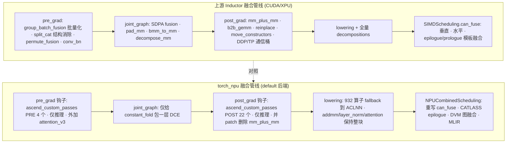

# torch_npu vs 上游 Inductor 融合 Pass 全流程对照 — 「不改管线，三处介入 + 重活下沉后端」

> **Source baseline**：
> - torch_npu `E:\97-codes\torch_parallel\torch_npu` @ `b3c8a815b`（tag `v2.7.1`，2026-07-15），路径前缀 `torch_npu/_inductor/`
> - upstream PyTorch `E:\97-codes\pytorch\pytorch` @ `9922478dffa`（branch `main`），路径前缀 `torch/_inductor/`
> **Dimension**：Deep Dive（mechanism-level，逐层稽核源码）
> 本页回答：从 pre_grad FX pass 一直到后端 scheduler 融合，torch_npu 与上游到底差在哪儿——**哪些是上游有 NPU 没有、哪些是 NPU 有上游没有、两边都有但机制不同**，并逐条给出原因与已核验 `file:line`。是 [[21_npu_inductor_optimization_analysis]]（why 全景）、[[01_npu_compile_paths_overview]]（三路径全景）、[[13_scheduler_dependency_graph_fusion_and_ordering_analysis]]（融合调度）、[[32_post_grad_passes_guide]]/[[30_pre_grad_passes_guide]]/[[31_joint_graph_passes_guide]]（上游 pass 详解）的横向对照页。

---

## 1. 概览

### 1.1 一条主线（thesis）

> **torch_npu 不重写上游的 pre_grad / joint_graph / post_grad pass 管线，而是「三处介入 + 重活下沉」**：
> ① 用上游**官方 custom-pass 钩子**（`config.pre_grad_custom_pass` / `config.post_grad_custom_post_pass`）挂上自己的 26 个 `ascend_custom_passes`，与上游 pass **并存**（且除 attention 外**仅推理生效**）；
> ② 用**少量 monkey-patch** 精准增删上游行为（典型：**删掉** `mm_plus_mm`）；
> ③ 把真正的重活**下沉到后端**——GEMM/attention 交给 CATLASS/CK 模板与 ACLNN 手工算子（**932 个算子强制 fallback**），逐元素融合交给重写过的 `NPUTritonScheduling.can_fuse` 与 CATLASS epilogue / DVM 图融合。

差异的总根因不是工程偏好，而是**达芬奇（Da Vinci）AI Core 硬件 + CANN/ACLNN 手工库 + 编译时驱动**这三者（详见 §5，机制级展开在 [[21_npu_inductor_optimization_analysis]]）。

### 1.2 全流程对照图

### 1.3 关键概念表

| 概念 | 上游 | torch_npu | 关键 file:line |
|---|---|---|---|
| FX pass 挂载方式 | 内建 pass 列表逐个跑 | 走**官方 custom-pass 钩子**并存 | `torch_npu/_inductor/fx_passes/graph_match_pass.py:12-17` |
| 自定义 pass 注册表 | 无（用 `PatternMatcherPass`） | `PassType × FxPassLevel` 二维表 + `SHUT_DOWN_FX_PASS_LIST` 关关 | `.../ascend_custom_passes/register_custom_pass.py:10-48` |
| 自定义 pass 生效条件 | 训练/推理均可 | **仅推理**（`is_inference_check()==not grad_enabled`），attention 例外 | `.../ascend_custom_passes/__init__.py:15,30`、`.../utils/check_mode.py:6-10` |
| GEMM | Triton GEMM template + CUTLASS | CATLASS + CK + Cpp + ATen fallback | `01_npu_compile_paths_overview.md` §2.4 |
| Attention | SDPA pattern 融合 → `scaled_dot_product_attention` | SDPA/flash/efficient **全 fallback 到 ACLNN**，用手工算子 `npu_fusion_attention(_v3)` | `torch_npu/_inductor/lowering_fallback_list.py:656-700` |
| 融合总开关 | `is_gpu(device)`，`GPU_TYPES` 不含 npu | `patch_is_gpu()` 把 `"npu"` 塞进 `GPU_TYPES` | `torch/_inductor/utils.py:100,3539`；`torch_npu/_inductor/utils.py:18-21` |

---

## 2. Quick Start — 从哪儿读起

所有介入点都在 `torch_npu/_inductor/__init__.py` 的默认后端初始化里按顺序装上（import 时执行）：

| 入口 | 作用 | file:line |
|---|---|---|
| `patch_is_gpu()` | 把 `"npu"` 追加进 `torch._inductor.utils.GPU_TYPES` —— 一切 `is_gpu()`-门控 pass 的总开关 | `__init__.py:22` → `utils.py:18-21` |
| `register_backend_for_device("npu", NPUCombinedScheduling, NPUWrapperCodeGen)` | 把整个 NPU 调度/codegen 后端注册进去 | `__init__.py:166-175` |
| `patch_constant_fold_uniform_value()` | joint_graph 唯一改动：包一层补 DCE | `__init__.py:182` → `fx_passes/joint_graph.py:5-15` |
| `patch_pattern_mm_plus_mm()` | **从上游 post_grad `pass_patterns[1]` 里删掉 `mm_plus_mm`** | `__init__.py:209` → `fx_passes/post_grad.py:8-29` |
| `pre_grad_custom_pass_fuc()` | `config.pre_grad_custom_pass = run_register_pre_custom_passes` | `__init__.py:220` → `fx_passes/graph_match_pass.py:12-13` |
| `post_grad_custom_pass_fuc()` | `config.post_grad_custom_post_pass = AscendCustomPostPass()` | `__init__.py:221` → `fx_passes/graph_match_pass.py:16-17` |
| `patch_scheduler()` | 重写融合主循环以支持 CATLASS `MultiTemplateBuffer` epilogue | `scheduler.py:29-42,79-554` |

自定义 pass 本体全在 `torch_npu/_inductor/fx_passes/ascend_custom_passes/ascend_graph_pass.py`（26 个），运行器在同目录 `__init__.py:13-36`。

---

## 3. Deep Dive — 逐层对照

### 3.1 pre_grad 层

**上游**（详见 [[30_pre_grad_passes_guide]]）：`fuse_fx`（permute/linear 融合、conv+bn）、`normalization_pass`、`group_batch_fusion_passes`（batch_linear→baddbmm、batch_layernorm、batch_tanh…）、一大家子 split/cat 结构消除、`efficient_conv_bn_eval`。

**torch_npu**：通过 `config.pre_grad_custom_pass` 钩子（`graph_match_pass.py:13`）注入 `run_register_pre_custom_passes`，它在**上游 pre_grad 之外**追加运行 4 个自定义 PRE pass（`ascend_custom_passes/__init__.py:13-25`）：

| Pass | 干什么（what + why） | 生效 | file:line |
|---|---|---|---|
| `cat_slice_cat_fold_pass` | 折叠 `cat→slice→cat`：外层 cat 的输入若是覆盖内层 cat 的连续切片，直接复用内层 cat，消冗余 concat | 仅推理 | `ascend_graph_pass.py:52-127` |
| `pad_slice_fold` | 折叠 `pad→slice`：切片完全落在 pad 前有效区内时，切原输入、删 pad | 仅推理 | `:130-186` |
| `dtype_optimal_pass` | `arange(int64)`、`.to(int64)` 值域塞得进 int32 时降位 —— NPU 上 int32 索引/计算更省 | 仅推理 | `:806-882` |
| `fusion_attention_v3_pass` | 把已存在的 `npu.npu_fusion_attention.default` 节点 1:1 换成 `npu_fusion_attention_v3.default` | **训练+推理**（唯一在训练也跑的 PRE pass） | `:885-906` |

> 关键：这些是**并存**而非替换——上游的 `group_batch_fusion` 等 pre_grad pass 照常在 npu 上跑（见 §3.7）。

### 3.2 joint_graph 层

**上游**（[[31_joint_graph_passes_guide]]）：`lazy_init` 里 `_sfdp_init()`（SDPA 融合）、`_pad_mm_init()`（矩阵 padding）、`bmm_to_mm`、`decompose_mm_pass` 等（`torch/_inductor/fx_passes/joint_graph.py`、`fuse_attention.py`、`pad_mm.py`）。

**torch_npu**：**几乎不碰这一层**。唯一改动是 `patch_constant_fold_uniform_value()`——包一层上游同名函数、末尾补 `eliminate_dead_code()`，修 AOTInductor 常量折叠 bug（`fx_passes/joint_graph.py:5-15`）。SDPA / pad_mm 在 NPU 上的结局见 §3.5 与 §4.1。

### 3.3 post_grad 层

**上游**（[[32_post_grad_passes_guide]]）：`group_batch_fusion`（post 版）、`mm_plus_mm`、`b2b_gemm`、`reinplace_inplaceable_ops`、`move_constructors_to_gpu`、`micro_pipeline_tp` / `fuse_ddp_communication` / 集合通信分桶、`reorder_for_locality`、`remove_noop_ops` 等。

**torch_npu**：两件事。

1. **删一个**：`patch_pattern_mm_plus_mm()` 把上游 `mm_plus_mm` 的 `LoweringPatternEntry` 从 `pass_patterns[1]` 里 `.pop()` 掉，源码注释直言 *"currently, torch_npu does not support mm_plus_mm fusion"*（`fx_passes/post_grad.py:23-29`）。
2. **加 22 个**：通过 `config.post_grad_custom_post_pass = AscendCustomPostPass()`（`graph_match_pass.py:17`）在**上游 post_grad 跑完之后**追加 22 个自定义 POST pass（`ascend_custom_passes/__init__.py:28-36`，**仅推理**，先 `stable_topological_sort` 再按 level 跑）。清单见 §3.4。

### 3.4 torch_npu 自定义 pass 全清单（NPU 有、上游无）

> 本表是**清单**；每个 pass 的**触发代码场景 → 待优化问题 → 优化 → 效果**逐条深挖见配套页 [[22_npu_fusion_passes_deepdive]]。

全部在 `ascend_graph_pass.py`，用 `@register_custom_pass(PassType.PRE|POST)` 自注册（默认 `FxPassLevel.LEVEL1`，故全在 L1）；运行器按 `sorted(FxPassLevel)` 迭代（`register_custom_pass.py:10-48`；`__init__.py:13-36`）。可用环境变量 `SHUT_DOWN_FX_PASS_LIST=<name1>,<name2>`（或 `all`）逐个/全部关闭（`register_custom_pass.py:15-35`）。

**PRE（4 个）**：见 §3.1 表。

**POST（22 个）**——大体分「结构折叠/消冗余」与「真·融合改写」两类：

| 类别 | Pass | 干什么 | file:line |
|---|---|---|---|
| 恒等/冗余消除 | `fold_four_op_pass` | `x±0 / x*1 / x/1` → 取非平凡操作数 | `:189-234` |
| | `fold_cast` | dtype 相同的 cast 删掉 | `:237-262` |
| | `fold_cat` | 展平嵌套同维 cat | `:265-319` |
| | `fold_clone` | memory_format 不变且非输出的 clone 删掉 | `:322-357` |
| | `fold_detach` | 前向推理里的 `detach` 删掉 | `:360-376` |
| | `fold_expand` | 恒等 expand 删掉 | `:379-413` |
| | `fold_reduce` | 对 size-1 维求和 → view | `:416-444` |
| | `fold_slice` | 全范围 `slice`/`slice_scatter` 删掉 | `:551-568` |
| | `fold_squeeze` | 合并相邻 squeeze、抵消 squeeze→unsqueeze | `:571-601` |
| | `fold_to_copy` | dtype/device/layout/mem-format 全不变的 `_to_copy` 删掉 | `:604-665` |
| | `view_fold_pass` | 折叠链式 view/reshape/`_unsafe_view` | `:668-712` |
| | `fold_where` | 两支相同/都 0/都 1 的 `where` 折成单支 | `:715-738` |
| | `fold_redundant_ops` | `view→squeeze.dim` 输出形状/类型一致时消掉 | `:741-803` |
| 结构重排（利于融合/零拷贝） | `fold_sink_view` | 把 `view` 下沉到后续激活/逐元素算子之后，让计算作用在 view 前更连续的布局上 | `:447-548` |
| | `cat_to_view_pass` | 单父张量的连续切片 cat → 恒等 view，或 `roll`（循环移位），避免真数据搬运 | `:909-1072` |
| | `repeat_to_expand_pass` | 只做广播的 `repeat` → 零拷贝 `expand` | `:1112-1195` |
| | `fold_iota_arithmetic_pass` | `iota/arange/full` 常量 CSE + int64→int32 降位 + `cmp(sub(a,b),0)`→`cmp(a,b)` | `:1394-1518` |
| 真·融合改写 | `broadcast_const_mask_compress` | `cast(where(mask, full(c1), full(c2)))`（0/1 选择）压成 mask 或 `logical_not(mask)` | `:1536-1626` |
| | `masked_add_compose_pass` | `where(m,a,0) + where(~m,b,0)` → 单个 `where(m,a,b)` | `:1691-1758` |
| | `bool_cast_mul_to_where_pass` | `cast[dtype](bool_mask) * x` → `where(bool_mask, x, 0)`，省 bool→数值 cast + 广播乘 | `:1835-1944` |
| | `sign_diff_hamming_fuse_pass` | `sum(abs(relu(sign(x)) - relu(sign(y))))` → `sum(ne(gt(x,0), gt(y,0)))`（符号位汉明距离） | `:1969-2061` |
| | `batch_embedding_fusion_pass` | 多个同权重 `embedding+reduce`（索引为单父张量连续切片）批量成一次 `reshape→embedding→reduce` | `:2493-2538` |

> 这批 pass 的共同气质：**面向 NPU 布局/dtype 偏好的结构折叠**（int32 索引、连续访存、零拷贝 view）与**几个业务 kernel 的定向融合**（mask/embedding/汉明距离），而不是上游那种通用 batch/GEMM 融合——后者要么被下沉到后端，要么被 fallback 接管。

### 3.5 lowering / decomposition 层

这是 NPU「用手工库替代融合」的核心一层。lowering 注册/decomposition 边界/`GraphLowering.call_function` 选择顺序等**上游通用机制**见 [[10_fx_lowering_to_inductor_ir_analysis]]；本节只讲 torch_npu 在这层具体做了什么改动。

**分解阶梯（保持整块，不打碎再融合）**：`_register_triton_decompositions` 构造 `DECOMPOSITION_OVERLOAD_OP` 并把它们从全局 `decompositions` 字典里 `del` 掉（`decomposition.py:26-49`），让这些算子保持整块、走 lowering 或 fallback 到 ACLNN，而不是被上游拆成 pointwise+reduction 再融合：

| 保持整块的算子 | 处理 | file:line |
|---|---|---|
| `addmm` | 保持整块（NPU 有专用 addmm kernel/CATLASS 路由） | `decomposition.py:34` |
| `native_layer_norm` | 保持整块 → ACLNN | `:36` |
| `gelu` | 删除后**重注册**为 tanh 近似分解 | `:35`（重注册 `:56-64`） |
| `erfc` | 删除后**重注册**为 `1 - erf(x)` | `:38`（重注册 `:51-54`） |
| `nll_loss_forward/backward`、`_log_softmax_backward_data`、`expm1` | 保持整块 | `:31-33,37` |
| `max_pool2d_with_indices` | **仅 Ascend950** 才排除分解（硬件原生支持） | `:41` |

**强制 fallback 到 ACLNN（不进 lowering/fusion）**：`FALLBACK_LIST = TORCH_NATIVE_FALLBACK_LIST + NPU_EXTRA_FALLBACK_LIST`（`lowering_fallback_list.py:978`）。本 commit 实测条目数：

| 列表 | 条目数 | file:line |
|---|---|---|
| `NPU_EXTRA_FALLBACK_LIST` | 592 | `:41-632` |
| `TORCH_NATIVE_FALLBACK_LIST` | 340 | `:636-975` |
| `FALLBACK_LIST`（合并） | **932** | `:978` |
| 条件 `+aten.isnan`（`inductor_indirect_memory_mode != 'linear'`） | +1 | `:980-983` |
| 条件 `+INDIRECT_MEM_FALLBACK_LIST`（`not inductor_indirect_memory_mode`，含 cat/embedding/gather/index/scatter 等 23） | +23 | `:985-1012` |

关键类别（决定「哪些上游融合在 NPU 上无从谈起」）：
- **Attention**：`_scaled_dot_product_*`（flash/efficient/cudnn/overrideable）、`_flash_attention_*`、`_efficient_attention_*` 全部 fallback（`:656-700`）。→ 即便上游 SDPA 融合在 NPU 上照跑（§3.7）产出 `scaled_dot_product_attention`，它落到 NPU 也是 fallback 到 ACLNN，而非 Inductor 融合 kernel。
- **分布式通信**：`_c10d_functional.*`（all_gather/all_reduce/all_to_all/reduce_scatter/broadcast/wait_tensor）全 fallback（`:41-68`）。→ 上游 DDP/TP 通信融合（`fuse_ddp_communication`/`micro_pipeline_tp`）在 NPU 上即使 FX 层能跑，通信算子本身也不进 Inductor。
- **位运算 / 高阶算子 / RNG / 特殊数学 / linalg / 池化 / 量化**：大段 fallback。

### 3.6 后端 scheduler / 融合层

上游融合的主战场是 `SIMDScheduling.can_fuse`（垂直/水平）+ 模板 epilogue/prologue。torch_npu 在后端把这套整体换掉：

| 机制 | 与上游的差别 | file:line |
|---|---|---|
| `NPUCombinedScheduling`（委派） | 继承 `CUDACombinedScheduling`；`choose_node_backend` 把 CATLASS 模板节点路由给 `CATLASSScheduling`，其余给 `NPUTritonScheduling`；`can_fuse_horizontal` 里 CATLASS 分支「目前恒 False」 | `codegen/npu_combined_scheduling.py:24,40-56,82-99` |
| `NPUTritonScheduling.can_fuse`（整体重写） | 复刻并特化上游 `SIMDScheduling.can_fuse`；`can_fuse_vertical = can_fuse_horizontal = can_fuse`（单一门）；reduction-reduction 需 `numel/rnumel` 全相等；pointwise→reduction 用 `NPUIndexTritonKernel.is_compatible` 逐节点判；tiling 用 NPU 前缀 `["w","v","t","z","y","x"]`+单一 `"r"` 轴 | `codegen/scheduling.py:579-721,88-107` |
| persistent reduction | **不是「恒关」**：内置后端保留上游启发式，受 `config.triton.persistent_reductions` 门控 + NPU 阈值 `{INNER:4096, DEFAULT:4096}`（实验性 Linearize 后端才恒 False，见 [[23_npu_inductor_linearize_backend_analysis]]） | `codegen/triton.py:1297-1321` |
| `num_splits`（reduction 切分） | 替换 `Reduction.num_splits`：仅当设备缺 `REDUCE_TO_SINGLE_ELEMENT` 特性时才 split（NPU `backend_features` 恰好不含该特性） | `ir.py:70-129`、`codegen/scheduling.py:62-74` |
| CATLASS epilogue 融合 | GEMM 尾部只允许融入 **Pointwise ComputedBuffer**（拒 reduction/mutation/链式）；**默认关**（`CATLASS_EPILOGUE_FUSION` 环境变量默认 `"0"`）+ 需 `config.epilogue_fusion`；EVG 路径不支持 bf16 | `codegen/catlass/catlass_scheduling.py:234-338`、`config.py:76-78` |
| DVM 融合（dvm 后端） | 垂直融合（`_dvm_can_fuse_horizontal` 恒 `False`），且仅当 `INDUCTOR_DVM_DISABLE_POST_REDUCE_FUSION=1` 才装；另有 **FX 图级分区融合** `dvm_graph_fusion`（`CapabilityBasedPartitioner`+`DvmOpSupport`，白名单 `GRAPH_FUSION_SUPPORT_OP` 47 个 active 算子），它把 `config.post_grad_custom_post_pass` 换成自己 | `dvm/mlir_fusion.py:246-272,368-393`、`dvm/graph_fusion.py:42-92,395-413` |
| `patch_scheduler` | 重写 `Scheduler.fuse_nodes_once` / `speedup_by_fusion` 以支持 CATLASS `MultiTemplateBuffer` epilogue；Ascend950 把 `are_long_distant_nodes` 阈值 64→20 | `scheduler.py:29-42,79-554` |

### 3.7 `GPU_TYPES` —— 决定「上游 pass 在 NPU 上跑不跑」的总开关

上游大量 pass 门控在 `is_gpu(device.type)` 上，而 `GPU_TYPES = ["cuda","mps","xpu","mtia"]`（`torch/_inductor/utils.py:100`）**不含 npu**，`is_gpu("npu")` 本应为 False。torch_npu 用 `patch_is_gpu()` 把 `"npu"` 追加进去（`torch_npu/_inductor/utils.py:18-21`，`__init__.py:22`），于是：

- 门控在 **`is_gpu(...)`** 上的 pass → **在 NPU 上重新打开**（如 `should_prefer_unfused_addmm`，`torch/_inductor/fx_passes/post_grad.py:1734`）。
- 但门控在**硬编码 `.is_cuda`/`.is_xpu` 属性**上的 pass → 追加 `GPU_TYPES` **帮不上忙**，在 NPU 上仍然不跑（`pad_mm`、`b2b_gemm`、`decompose_mm_pass`、`fused_int_mm_mul`）。
- 门控在 **`get_gpu_type()`** 上的 pass（`bmm_to_mm`、`move_constructors_to_gpu` 的目标设备）→ 取决于该函数在 NPU-only 机器上解析到什么；`get_gpu_type()` 返回唯一可用的加速器类型（`utils.py:106-111`），此处运行期具体解析结果未逐行追到，标注为 **[未完全核实]**。

---

## 4. 「谁有谁无」总表 + 原因

### 4.1 上游有、NPU 没有（或被 fallback / patch 掉）

| 上游 pass | 干什么 | 上游 file:line | 在 NPU 上的结局 & 原因 |
|---|---|---|---|
| `pad_mm` / `pad_bmm` / `pad_addmm` | 把 M/N/K pad 到对齐，命中快 kernel | `pad_mm.py:79-121,828` | **不跑**：`check_device` 硬判 `is_cuda or is_xpu`。NPU GEMM 走 CATLASS/CK 自带 tiling+对齐，用不上 |
| `mm_plus_mm` | `add(mm,mm)` 融成一个 tuned kernel | `post_grad.py:918,946` | **被 patch 删除**：注释「torch_npu does not support mm_plus_mm fusion」(`fx_passes/post_grad.py:23`) |
| `b2b_gemm` | 连续 `mm(mm(A,B),C)` 融成一个 tiled kernel | `b2b_gemm.py:384-386,598` | **不跑**：硬判 `is_cuda or is_xpu`，且 `config.b2b_gemm_pass` 默认关 |
| `decompose_mm_pass` | 瘦长 mm/bmm 拆成 pointwise+reduction | `decompose_mem_bound_mm.py:69-71` | **不跑**：硬判 cuda/xpu |
| `bmm_to_mm` | batch 维塌缩时 bmm→mm | `joint_graph.py:932` | **多半不跑**：`check_device(..., get_gpu_type())`，取决于 `get_gpu_type()` 解析 [未完全核实] |
| `fused_int_mm_mul` | int mm + mul 融合 | `post_grad.py:1880-1882` | **不跑**：硬判 `is_cuda` + `force_fuse_int_mm_with_mul` |
| `prepare_softmax` 融合 | 融合 softmax 前置 | `post_grad.py:477-478` | **不跑**：门控 `device_type in ["cuda","xpu"] and backend=="triton"` |
| `move_constructors_to_gpu` | CPU 构造器移到 GPU | `post_grad.py:2241,2079` | **实为 no-op**：目标 `get_gpu_type()`（默认 cuda，非 npu），`target_devices` 不含 → 早退 |
| SDPA 融合（`_sfdp_*`） | softmax(QKᵀ·scale)·V → `scaled_dot_product_attention` | `fuse_attention.py:1450,1476` | **FX 层照跑**（无正向设备门控），但产物 `scaled_dot_product_attention` 落 NPU **fallback 到 ACLNN**（`lowering_fallback_list.py:656-700`）。NPU 真正的融合注意力靠**手工算子** `npu_fusion_attention(_v3)` |
| `fuse_conv_bn` / `remove_identity` | Conv+BN 折叠 | `pre_grad.py:409-415` | **不跑**：仅 CPU + freezing |
| MKLDNN `grouped_gemm_pass` / `concat_linear_woq_int4` | x86 GEMM/量化融合 | `post_grad.py:178-192` | **不跑**：`torch._C._has_mkldnn` 门控，CPU 专属 |

### 4.2 NPU 有、上游没有

| NPU pass / 机制 | 干什么 | file:line | 上游为何没有 |
|---|---|---|---|
| `ascend_custom_passes` 26 个（§3.4） | NPU 布局/dtype 结构折叠 + mask/embedding/汉明定向融合 | `ascend_graph_pass.py`（全表见 §3.4） | 面向达芬奇 int32 索引/连续访存偏好与 NPU 业务 kernel，上游无此硬件语境 |
| `fusion_attention_v3_pass` | `npu_fusion_attention` → v3 升级 | `:885-906` | 上游没有 `npu_fusion_attention` 这一手工算子 |
| CATLASS EVG epilogue | GEMM 结果在 Cube L0C 上顺手做 bias/激活再写回 | `catlass/catlass_scheduling.py:234-338` | 上游是 CUTLASS/Triton epilogue；CATLASS 是华为为 Cube 单元适配的模板库 |
| DVM 图级分区融合 | `CapabilityBasedPartitioner` 在 FX 图整块融合（47 算子白名单） | `dvm/graph_fusion.py:42-92,395-413` | DVM 是 NPU 专属虚拟机后端 |
| `dtype_optimal_pass` / `fold_iota_arithmetic_pass` 的 int64→int32 | 降索引位宽 | `:806-882,1394-1518` | 达芬奇 vector core 对 i64 支持弱，上游 GPU 无此动机 |
| `patch_scheduler` 的 `MultiTemplateBuffer` epilogue 改写 | 让 CATLASS 模板参与融合主循环 | `scheduler.py:79-554` | 为承接 CATLASS 后端而生 |

### 4.3 两边都有、但机制不同

| 能力 | 上游做法 | NPU 做法 | file:line |
|---|---|---|---|
| 逐元素/规约融合 | `SIMDScheduling.can_fuse` | `NPUTritonScheduling.can_fuse` 整体重写（NPU tiling 前缀、is_compatible 判据） | `codegen/scheduling.py:579-721` |
| GEMM epilogue 融合 | CUTLASS/Triton 模板 epilogue | CATLASS EVG（默认关，Pointwise-only，无 bf16） | `catlass/catlass_scheduling.py:234-338` |
| 批量融合 | `group_batch_fusion`（batch_linear→baddbmm 等，设备无关，**NPU 上照跑**） | 另有定向的 `batch_embedding_fusion_pass` | 上游 `group_batch_fusion.py`；NPU `ascend_graph_pass.py:2493` |
| reduction 切分 | `Reduction.num_splits` | `patch_num_splits` 依 `REDUCE_TO_SINGLE_ELEMENT` 特性改判 | `ir.py:70-129` |
| 依赖/tiling 分析 | `extract_read_writes(normalize=True)` | `patch_extract_read_writes` 强制 `normalize=False`（NPU 不支持 normalize load/store） | `dependencies.py:6-29` |

> 注意 §4.3 第 3 行的重要事实：**上游 `group_batch_fusion`、split/cat 家族、`reorder_for_locality`、`remove_noop_ops`、`reinplace_inplaceable_ops` 都是设备无关的，在 NPU 上照常运行**——所以「NPU 没有批量融合」是错的，它继承了上游那批设备无关 pass，只是**没有**上游那些 cuda/xpu 硬门控的 GEMM/attention 专项融合。

---

## 5. 为什么会有这种差异（根因）

逐条 pass 差异几乎都能收敛到三条根因（机制级展开见 [[21_npu_inductor_optimization_analysis]] §一–§十一）：

1. **Cube 专用矩阵单元**：matmul 由 Cube 以固定矩阵块乘累加，通用 Triton pointwise codegen 喂不饱 Cube → GEMM 类必须单开专用模板（CATLASS/CK）+ EVG epilogue，而不是上游的「Triton GEMM template + pad_mm + mm_plus_mm + b2b_gemm」那套。这解释了 §4.1 里一整排 GEMM 融合为何在 NPU 上不跑或被删。

2. **CANN/ACLNN 手工库 + 手工融合算子**：attention、通信、归一化厂商已调到极致（932 算子 fallback）→ 与其用 pattern matcher 拼 SDPA、用 FX pass 融通信，不如直接调 `npu_fusion_attention(_v3)`、HCCL。所以上游的 SDPA 融合、DDP/TP 通信融合在 NPU 上被「**用手工算子替代**」而非「用 pass 融合」（§3.5、§4.1）。

3. **达芬奇硬件约束 → 编译时驱动 + 布局/dtype 偏好**：i64 支持弱 → `dtype_optimal_pass`/`fold_iota_arithmetic_pass` 降 int32；访存偏好连续 → `fold_sink_view`/`cat_to_view_pass`/`repeat_to_expand_pass` 一堆结构重排；`normalize` load/store 不支持 → `patch_extract_read_writes`。这些是 NPU 独有、上游无对应物的自定义 pass 之来源。

4. **集成方式（非硬件）**：torch_npu 走「表面标准化、底层深度补丁」——复用上游 custom-pass 钩子和设备注册接口，但重活自己补（`patch_scheduler`、`ascend_custom_passes` 注册表、三条 codegen 路径），且自定义 pass **仅推理生效**（`ascend_custom_passes/__init__.py:15,30`）。这条主线与 torch_npu 上游 patch 消减同源（见 [[01_npu_compile_paths_overview]] 演进章）。

---

## 6. 版本漂移与对既有 wiki 页的校正

本页基于 torch_npu **v2.7.1 @ `b3c8a815b`** 逐行核验，纠正/更新了几处既有页面的旧口径：

> [!contradiction] `patch_pattern_mm_plus_mm` 是「删除」不是「添加」
> [[01_npu_compile_paths_overview]] §2.5 patch 清单把 `patch_pattern_mm_plus_mm()` 记为「`mm + mm` pattern fusion」，易读成 NPU **添加**了该融合。源码 `fx_passes/post_grad.py:23-29` 显示它 `.pop()` **删除**上游 `mm_plus_mm`，注释明言 NPU 不支持。**以本页为准。**

> [!contradiction] fallback 计数
> [[21_npu_inductor_optimization_analysis]] §八 / [[01_npu_compile_paths_overview]] §2.3 给「约 963（348 native + 615 npu-extra）」。本 commit 实测 `FALLBACK_LIST` = **932（340 native + 592 npu-extra）**，条件项再 +1(isnan)/+23(indirect)（`lowering_fallback_list.py:978-1012`）。差异属版本漂移 + 计数口径（是否计条件项/按 packet 还是 overload），两者均保留，**深入核查以本页 v2.7.1 数为准**。

> [!contradiction] persistent reduction 并非「恒关」
> 部分页面把 NPU persistent reduction 说成「昇腾不支持/恒 False」。需区分：**内置 default 后端**是阈值门控（`config.triton.persistent_reductions` + 阈值 4096，`codegen/triton.py:1297-1321`），**实验性 Linearize 后端** `npu_inductor_2.9.0` 才 `should_use_persistent_reduction` 恒 False（见 [[23_npu_inductor_linearize_backend_analysis]]）。

> [!note] §12.4 的自定义 pass 清单已过时
> [[21_npu_inductor_optimization_analysis]] §12.4 列的 pass（含 `unfold_dual_reduction_pass`）基于更早状态。本 commit `ascend_graph_pass.py` 已长到 26 个 pass、`unfold_dual_reduction_pass` 不在此 head，并新增 `sign_diff_hamming_fuse_pass`/`batch_embedding_fusion_pass`/`masked_add_compose_pass`/`broadcast_const_mask_compress`/`fold_iota_arithmetic_pass` 等（全表见 §3.4）。

> [!note] `pattern_match/npu_fusion_attention_graph.py` 在本 checkout 未接线
> 该文件定义了一个包住 `npu_fusion_attention` 的 autograd `Function`（`fx_passes/pattern_match/npu_fusion_attention_graph.py:93-155`），但除自身 `__init__` 与测试外**无生产代码 import** 它（`ascend_custom_passes` 的 `pkgutil` 只遍历自身包，不含 sibling `pattern_match`）。因此 NPU 侧**并没有**「softmax→npu_fusion_attention 的 SDPA pattern-match FX pass」在跑；真正生效的 attention 改写是 `fusion_attention_v3_pass`，它把**基础版 `npu_fusion_attention.default` → `v3.default`**（本 baseline 无 `_v2`，故非「v2→v3」；args/meta 原样透传，见 [[22_npu_fusion_passes_deepdive]] §2.4）。

---

## Related Pages

- [[22_npu_fusion_passes_deepdive]] — **配套深挖页**：26 个自定义 pass + 3 个后端融合机制的场景·问题·优化·效果逐条源码级
- [[01_npu_compile_paths_overview]] — torch_npu 三条编译路径全景 + 与社区差异章（本页的上级背景）
- [[21_npu_inductor_optimization_analysis]] — 硬件特性 → 优化思想 → 案例（本页 §5 原因的 why 全景）
- [[11_npu_inductor_splittiling_backend_analysis]] — 内置 default 路径 what/how（golden_var_list、CATLASS、monkey-patch）
- [[23_npu_inductor_linearize_backend_analysis]] — 实验性 Linearize 后端（persistent 恒关的那个）
- [[13_scheduler_dependency_graph_fusion_and_ordering_analysis]] — Scheduler 融合策略、自定义 Pass 与排查（§3.6 的上游基线）
- [[30_pre_grad_passes_guide]] · [[32_post_grad_passes_guide]] · [[31_joint_graph_passes_guide]] — 上游三阶段 pass 详解（本页 §3–§4 对照的上游侧）
- [[10_fx_lowering_to_inductor_ir_analysis]] — 上游 lowering/decomposition 通用机制（§3.5 对照的上游侧）
- [[20_npu_lowering_guide]] — NPU 特定 lowering 与 fallback 算子映射（§3.5 的细节）
- [[10_NPU_Inductor_Backend_Analysis]] — 五后端融合规则与后端混合使用机制
