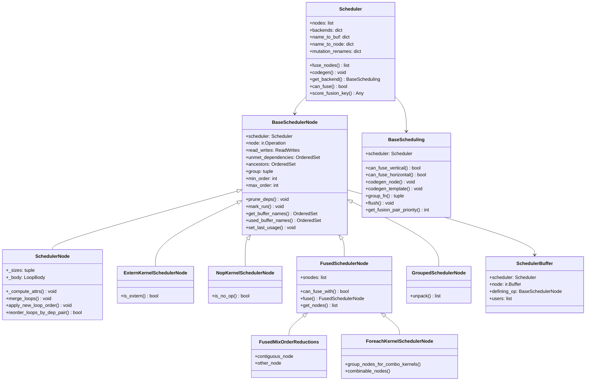
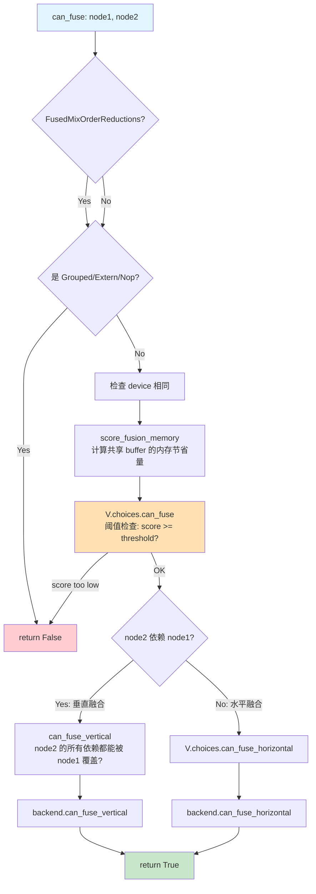

# 20 · Scheduler 依赖图、Fusion 与顺序

> 前置：[[inductor_ir_values_loops_layouts_and_buffers_analysis]]、[[buffer_liveness_memory_planning_and_reuse_analysis]]
> 当前实现基线：PyTorch `e8f97c1a6ef8cbcdd0a946606bc1e924e4f07e52`
> Lab 环境：PyTorch `2.9.1+cpu`
> 最后更新：2026-07-28

## 1. Scheduler graph为什么不同于FX graph

Scheduler从realized operations构造：

- no-op → `NopKernelSchedulerNode`；
- Computed/TemplateBuffer → `SchedulerNode`；
- ExternKernel → `ExternKernelSchedulerNode`
  （`torch/_inductor/scheduler.py:4641-4651`）。

依赖来自buffer read/write、alias、mutation与额外order，不是FX args/users复制。

源码中的阶段转换是：

```text
GraphLowering.operations
  → create_scheduler_node(operation)
  → SchedulerNode / ExternKernelSchedulerNode / NopKernelSchedulerNode
  → 从 operation 的 read_writes 构造 name_to_users
  → unmet_dependencies / users / mutation renames
  → topological schedule
```

`create_scheduler_node()`只按 operation 类型选择包装类
（`torch/_inductor/scheduler.py:4641-4651`）；它没有复制 FX Node，也没有把 FX `args`
当作 Scheduler edge。因此 SchedulerNode 的 identity、边与生命周期都属于新的图。

### 1.1 核心类结构

以下类图 2026-07-30 从已删除的 `scheduler_analysis.md` §4 回补（P4 归一时曾整节省略）：



## 2. dependency construction

`compute_dependencies()`：

- 创建buffer name→users；
- alias names共享/合并user list；
- mutation rename到最新version；
- 加read/write users；
- 处理WeakDep/StarDep；
- 处理unbacked symbol origin；
- output/input mutation roots
  （`torch/_inductor/scheduler.py:4689-4717`；
  `torch/_inductor/scheduler.py:4731-4761`；
  `torch/_inductor/scheduler.py:4904-4932`）。

反向依赖存于Scheduler对象，不会加回FX Graph。

### 2.1 源码状态机：一条 read 如何成为依赖边

对普通 read，`node.read_writes.reads`中的 buffer name 被交给 `add_user()`；producer
buffer 的 user list 随后反过来决定 consumer 的 unmet dependency。mutation 则在同一
扫描中先对旧名字加顺序依赖，再更新 `mutation_renames`，使后续读写指向最新版本
（`torch/_inductor/scheduler.py:4850-4879`；
`torch/_inductor/scheduler.py:4904-4917`）。

因此图中同时存在两种方向的索引：

| 结构 | 方向 | 用途 |
|---|---|---|
| buffer `users` | producer buffer → consumers | DCE、fusion、用户查询 |
| node `unmet_dependencies` / read deps | consumer → producer buffer name | topo、合法性、保序 |

它们是对同一依赖事实的不同访问索引，不是“正向 Scheduler 图”和“反向 Scheduler 图”
之间再连一条边。

## 3. Dependency类型

### MemoryDep

包含buffer name与indexing relation，可判断exact shared access/index equivalence。

### WeakDep

表达ordering但对lifetime/DCE较弱，可在目的消失后prune。不是“完全不影响fusion/排序”。

### StarDep

coarse non-index-specific dependency，用于部分mutation/user-defined kernel路径；不是所有
mutation的统一global edge。

### Alias/mutation

通过aliases、mutation renames、users与special deps共同表达，不是单一edge class。

## 4. 当前Scheduler pipeline

主要顺序：

1. global comm ordering；
2. dependencies；
3. topo sort；
4. Scheduler DCE；
5. ancestors/input distances；
6. foreach；
7. pre-fusion custom；
8. optional distributed autotune；
9. stream/mempool assignment；
10. fusion；
11. post-fusion custom；
12. optional second DCE；
13. merge loops、finalize multi-template；
14. combo kernels；
15. switch ordering；
16. peak-memory/comm overlap reorder；
17. grouped/partition processing；
18. last use
   （`torch/_inductor/scheduler.py:4235-4258`;
   `torch/_inductor/scheduler.py:4259-4286`;
   `torch/_inductor/scheduler.py:4287-4316`;
   `torch/_inductor/scheduler.py:4318-4347`;
   `torch/_inductor/scheduler.py:4373-4402`;
   `torch/_inductor/scheduler.py:4403-4410`）。


其中 topo、fusion、reorder 都可能改变顺序或分组，但只有 `compute_dependencies`/后续依赖维护
决定什么是合法边；“链表位置更靠前”本身不产生数据依赖。

## 5. Topological schedule

Scheduler按 `unmet_dependencies`的buffer names DFS，输出producer先于consumer
（`torch/_inductor/scheduler.py:5104-5129`）。

fusion后按min_order排序并再次topological sort
（`torch/_inductor/scheduler.py:6460-6462`）。

2026-07-30 回补（原 `scheduler_analysis.md` §8.1，P4 归一时曾省略）：每个节点维护
`min_order` 和 `max_order`（L547-553）。融合后的 `FusedSchedulerNode` 的
`min_order = min(子节点)`，`max_order = max(子节点)`。这使拓扑排序和循环检测在 O(1) 内
完成粗筛。§18.6 的 proximity 门控（`|min_order − max_order|` 比较）正是复用这对字段。

该 DFS 对每个节点只访问一次，但源码会对每个节点的
`unmet_dependencies`按 dependency name 排序。因此更精确的骨架复杂度是：

```text
O(V + E + Σ_v d_v log d_v)
```

其中 `d_v`是该节点未满足依赖数。只有依赖集合已预排序或每个 `d_v`有常数上界时，才可
简写为 `O(V+E)`。

## 6. Scheduler DCE

reverse topo；buffer users全weak/removed则inactive；operation无side effects且无active outputs才
删除（`torch/_inductor/scheduler.py:5055-5098`）。

它不使用FX Node users，也不基于ancestors字段定义dead。

## 7. Fusion与相关分组机制

- vertical：producer→consumer；
- horizontal：无直接producer relation但共享iteration/input；
- foreach：把operation list作为专门的组合调度单元；
- template epilogue/prologue；
- reduction/mix-order/nested；
- user-defined Triton等特定extern路径。

普通`ExternKernelSchedulerNode`通常是fusion barrier；只有特定user-defined
Triton/template路径开放受约束的融合（`torch/_inductor/scheduler.py:7914-8006`）。
Reduction也不是universal barrier，但需要domain与backend兼容。

`combo kernel`是fusion之后的另一层并行分组/launch摊销机制，不应和operator fusion混成
同一类。它在`create_combo_kernel_nodes()`中建立，并有独立codegen分支
（`torch/_inductor/scheduler.py:6493-6570`、
`torch/_inductor/scheduler.py:10059-10074`）。

## 8. Candidate generation

每轮按used buffer name grouping；group内每个node只与其后受
`max_fusion_buffer_group_pairwise_attempts`限制的window比较。aggressive fusion另按group
（`torch/_inductor/scheduler.py:6830-6884`）。

这不是总pair数上限；一个node属于多个buffer groups会产生重复候选，再由seen去重。

设第 `g`个 grouping 大小为 `n_g`，window 为 `W`，则一次
`check_all_pairs()`尝试数严格受：

```text
O(Σ_g n_g · min(n_g, W))
```

约束。`aggressive_fusion=True`只是额外加入按 Scheduler `group`划分的 groupings，仍调用
同一个有 window 的 `check_all_pairs()`；在当前默认 `W=64`时，不能直接把它写成
`Θ(V²)`。只有把 `W`视为可随 `V`增长或取消上界，且存在大 grouping 时，候选生成才可能
退化到二次。

## 9. Iterative rounds

最多10个normal rounds；no progress或仅剩1 node停止；配置可追加一次reorder round
（`torch/_inductor/scheduler.py:5268-5301`）。

每次fusion改变groups/dependencies，下一轮可发现新机会。

## 10. Legality

`can_fuse()`在失败时rollback speculative loop mutations。检查包括：

- self/cycle；
- dependencies与reorder legality；
- device/group/size；
- loop/reduction compatibility；
- template/foreach规则；
- no-fuse buffers；
- stream/mempool boundary
  （`torch/_inductor/scheduler.py:7818-7838`;
  `torch/_inductor/scheduler.py:7840-7856`;
  `torch/_inductor/scheduler.py:7867-7885`;
  `torch/_inductor/scheduler.py:7890-7918`;
  `torch/_inductor/scheduler.py:7971-8000`;
  `torch/_inductor/scheduler.py:8012-8040`;
  `torch/_inductor/scheduler.py:8074-8104`;
  `torch/_inductor/scheduler.py:8106-8135`;
  `torch/_inductor/scheduler.py:8159-8188`;
  `torch/_inductor/scheduler.py:8189-8197`;
  `torch/_inductor/scheduler.py:8199-8228`;
  `torch/_inductor/scheduler.py:8229-8258`;
  `torch/_inductor/scheduler.py:8259-8270`;
  `torch/_inductor/scheduler.py:8272-8301`;
  `torch/_inductor/scheduler.py:8302-8331`;
  `torch/_inductor/scheduler.py:8344-8373`;
  `torch/_inductor/scheduler.py:8374-8403`;
  `torch/_inductor/scheduler.py:8407-8426`;
  `torch/_inductor/scheduler.py:8429-8458`;
  `torch/_inductor/scheduler.py:8513-8524`）。

cycle check遍历fused ancestors
（`torch/_inductor/scheduler.py:6886-6925`）。

### 10.1 常见融合边界不是同一种“硬墙”

- device不同通常不能组成同一backend codegen group；
- reduction需要iteration/reduction domain兼容，某些producer/consumer仍可融合；
- template可支持受约束的prologue/epilogue fusion，也可能延迟choice；
- extern通常保留library call，但其相邻pointwise是否吸收取决于具体backend/template规则；
- multi-output需要同时维护共享operation和各output users，不能只检查一个输出；
- mutation、collective、stream/mempool会增加ordering与资源约束。

所以排查`can_fuse=False`时必须查看具体dependency、group、backend与原因，不能把所有失败
概括为“遇到reduction/extern就停止”。

## 11. Profitability与priority

`score_fusion_memory()`考虑：

- exact shared MemoryDeps；
- same-buffer不同index overlap；
- common read sets/cache locality；
- mix-order reduction score
  （`torch/_inductor/scheduler.py:8547-8575`;
  `torch/_inductor/scheduler.py:8576-8609`;
  `torch/_inductor/scheduler.py:8631-8660`;
  `torch/_inductor/scheduler.py:8662-8691`;
  `torch/_inductor/scheduler.py:8692-8721`;
  `torch/_inductor/scheduler.py:8829-8858`;
  `torch/_inductor/scheduler.py:8859-8888`;
  `torch/_inductor/scheduler.py:8889-8911`）。

`V.choices.score_fusion`提供策略层；template fusion还可异步compile/benchmark
（`torch/_inductor/scheduler.py:6181-6208`;
`torch/_inductor/scheduler.py:6211-6240`;
`torch/_inductor/scheduler.py:6242-6260`;
`torch/_inductor/scheduler.py:6296-6325`;
`torch/_inductor/scheduler.py:6327-6347`;
`torch/_inductor/scheduler.py:6349-6373`）。

## 12. Fusion不保证硬件细节

“fusion成功”表示backend将group作为combined codegen unit处理。它不形式化保证：

- intermediate一定在register；
- shared input只load一次；
- 无spill；
- 一定更快；
- peak memory一定更低。

最终由indexing、backend compiler、register pressure、cache和runtime决定。

## 13. Ordering passes

peak-memory reorder必须靠后，避免后续passes撤销；comm overlap也可重排。
`compute_last_usage()`在这些reorders之后
（`torch/_inductor/scheduler.py:4318-4405`）。

这与FX Pattern replacement后的stable sort是不同层机制。

## 14. 当前配置锚点

pinned OSS：

- memory score threshold 10；
- max fusion size 64；
- pairwise attempts 64
  （`torch/_inductor/config.py:988-1015`）。

配置是heuristic，不是语义；版本变化需重查source。

## 15. 复杂度

设Scheduler `V/E`、round候选 `C_r`：

- dependency常见近 `O(V+E+A)`，alias merge最坏可超线性；
- topo 为 `O(V+E+Σ_v d_v log d_v)`；DCE 的逆序骨架近
  `O(V+E)`，另计 output/user 集合操作；
- ancestors可 `Θ(V²)`；
- candidate attempts 为 `O(Σ_g n_g·min(n_g,W))`；当前 `W=64`时对固定 grouping
  multiplicity 近线性，只有 `W`无界或 grouping membership 本身超线性时才接近 `V²`；
- rounds约 `Σ_r C_r × legality/score`；
- cycle/ancestor traversal使保守上界可写
  `O(Σ_r [C_r × cost(can_fuse + score) + C_r log C_r])`，不含benchmark。

topological schedule本身还会对每个节点的dependency排序，合法 candidates 最后也按
score 排序为 `O(C_r log C_r)`；所以这里给的是参数化成本模型，不把所有sort隐藏成
无条件`O(V+E)`
（`torch/_inductor/scheduler.py:5104-5129`、
`torch/_inductor/scheduler.py:6830-6884`）。

## 16. 已验证 Lab

### 16.1 命令

```powershell
python tools/labs_torch_compile/part4_ir_scheduler_analysis.py `
  --output-dir tools/labs_torch_compile/artifacts/part4_ir

python tools/labs_torch_compile/part4_artifact_bundle.py `
  --output-dir tools/labs_torch_compile/artifacts/part4
```

### 16.2 dependency与fusion group

第一个脚本直接构造Scheduler，不需要native compiler。对
`sin(sum(x, dim=1))`的`max_fusion_size=1`case，它保存内部buffer producer→consumer edge，
而不是从FX `args/users`猜边；对两个独立pointwise输出比较：

```text
dependency_edges_recorded=True
fusion_toggle_observed=True

max_fusion_size=64: scheduler node_count=1, has_fused_scheduler_node=True
max_fusion_size=1:  scheduler node_count=2, has_fused_scheduler_node=False
```

每个node的`reads`、`writes`、dependency index、operation names与`last_usage`写入
`tools/labs_torch_compile/artifacts/part4_ir/scheduler_dependencies.json`和
`fusion_comparison.json`。

该JSON是从当前Scheduler `read_writes`重建的便于阅读的producer→consumer视图；它保留
MemoryDep index等记录，但不是Scheduler内部mutation rename、WeakDep、StarDep与特殊
ordering语义的完整序列化。

同一脚本还在`max_fusion_size=1`下比较
`reorder_for_peak_memory=True/False`：

```text
reorder_comparison_recorded=True
reorder_effect_observed=True
off: [op0, op1, op2], estimated_peak_bytes=264192
on:  [op1, op0, op2], estimated_peak_bytes=263172
```

case让小matmul分支与大reduction分支在最终add前独立可调序。脚本同时断言开/关两种顺序
都满足producer先于consumer；当前heuristic把大输入可尽早释放的分支提前，静态估计降低
1020 bytes。完整记录位于 `tools/labs_torch_compile/artifacts/part4_ir/reorder_comparison.json`。

该结果只覆盖这个固定case的Scheduler静态模型；它不能保证所有图都改变顺序，也不等于
物理allocator峰值或性能一定改善。

### 16.3 codegen对照与证据边界

第二个脚本在相同环境下截获fusion enabled/limited的Inductor trace与C++ source：

```text
fusion_enabled_has_fused_scheduler=True
fusion_limited_has_fused_scheduler=False
fusion_codegen_structure_changed=True
codegen_only_status=generated_not_executed
real_pointwise_compile_status=blocked_missing_msvc_cl
```

codegen-only路径patch了compiler存在性检查并以no-op callable截获source，故它能证明
Scheduler/codegen分组差异进入了wrapper/source。具体地，fusion enabled/limited的
Scheduler group数为`1/2`，captured C++中的`for(`计数为`2/3`，但两边都只有一个
`cpp_pybinding` entry point；所以这里不能把group数直接写成native kernel数。

该codegen-only路径不能证明数值或性能；当前Lab也未把CPU结论外推到GPU
reduction/template fusion，native fusion/reorder on/off的性能对照仍明确标为未执行。

当前native执行层仍因缺`cl`而未完成。

前面的dependency、fusion与静态memory schedule观察已经由不依赖native compiler的路径
独立运行成功。

## 17. 回答用户原问题

> 逆图序逐Node匹配是不是整图？

那是PatternMatcher候选snapshot逆FX顺序，不是Scheduler也不是AOT backward；只遍历注册root
候选union。

> 正向node与反向node有边吗？

AOT fw/bw无跨图edge。Scheduler又是各图lowering后的独立buffer dependency graph。

## 18. 融合算法源码级细节

以下内容 2026-07-30 从已删除的 `scheduler_analysis.md` §7 改写并入本页（示意图与部分代码曾
省略，经复核回补；该页原有 §7.3/§7.4 的"旧版简写"提示已随并入本页而失效，一并去除；其余
小节保持原文）。

### 18.1 主循环（`fuse_nodes`）

```python
for i in range(10):           # 最多10轮
    old_len = len(nodes)
    nodes = self.fuse_nodes_once(nodes)
    if len(nodes) == old_len:  # 无进展则停止
        break
# 最后一轮用于 loop ordering
nodes = self.fuse_nodes_once(nodes, is_reorder_round=True)
```

### 18.2 候选对生成（`get_possible_fusions`）

```text
对每个节点, 按 used_buffer_names 分组
→ 同组的节点对才可能共享数据
→ 调用 can_fuse(node1, node2) 过滤合法 pair
→ 按 score_fusion_key 降序排列
```

`config.max_fusion_buffer_group_pairwise_attempts` 控制每组最多检查多少对（避免 O(n²) 爆炸）。

### 18.3 融合合法性检查（`can_fuse`）

2026-07-30 回补下图（原 `scheduler_analysis.md` §7.3，P4 归一时曾省略）：

> **注**：下图把 legality、priority score 与可选 benchmark 串成单一阈值流程，不能作为当前
> Scheduler 的执行规范；现行模型见本页 §10/§11（Legality 与 Profitability 分离）。



`can_fuse(node1, node2)` 大致依次：判断是否可组成 `FusedMixOrderReductions`；若是
Grouped/Extern/Nop 直接拒绝；检查 device 相同；调用 `score_fusion_memory()` 计算共享
buffer 的内存节省量，交给 `V.choices.can_fuse()` 做阈值判断（score 太低直接拒绝）；
阈值通过后按 node2 是否依赖 node1 分流——依赖则走垂直融合 `can_fuse_vertical()` →
`backend.can_fuse_vertical()`，不依赖则走水平融合 `V.choices.can_fuse_horizontal()` →
`backend.can_fuse_horizontal()`。

**`can_fuse_vertical` 关键逻辑：** 检查 node2 的所有 `unmet_dependencies` 中，凡是来自
node1 的 buffer，其索引访问模式是否与 node1 的写入完全匹配——只有访问模式一致（或是
全局访问）才能内联，否则需要中间 buffer。

### 18.4 融合评分（`score_fusion_memory`）

概念上是对两节点的 `read_writes`（reads ∪ writes）求交集，交集越大代表融合后节省的
内存 IO 越多、越优先融合；`V.choices.score_fusion()` 在此基础上进一步包装（默认实现在
`inductor/choices.py`），实际评分区分 exact dependency、同 buffer overlap 与
mix-order reduction（§11 已述），不能简化成单一集合交集大小。

### 18.5 循环检测（`will_fusion_create_cycle`）

融合本身会引入新的"合并祖先"。检查逻辑：如果 node1 和 node2 融合后，是否有第三方
node3 满足"node3 是 node1 的后代（依赖 node1 输出）且 node3 也是 node2 的祖先（node2
依赖 node3）"——这会形成环。通过递归搜索 `FusedSchedulerNode` 中的组合祖先集来判定。

### 18.6 组兼容、proximity 门控、模板/foreach 融合

补 §18.1–§18.5 未展开的几类合法性约束（对照本地 upstream 按符号引用）：

**① 迭代空间（组）兼容**（后端层 `simd.py`，是"为什么迭代空间不一致就不能融合"的
根因）：节点 `group = (device, (numel_pw, numel_red))`（`group_fn` 把每组维度乘成
一个数）。
- reduction + reduction：`numel` 与 `rnumel` 都要相等；
- pointwise + pointwise：`numel/rnumel` 相等，且 `config.triton.tiling_prevents_pointwise_fusion`
  开时要求 `tiling1 == tiling2 == tiling3`；
- pointwise + reduction：pointwise 迭代空间须覆盖 reduction 的外×内
  （`numel1 == numel2 * rnumel2`）。`SchedulerNode.swap_pw_red_dimension` 会置换
  维度以对齐 `.group`。

**② proximity 门控**（`are_long_distant_nodes`）：`proximity_score = max(|n1.min_order
− n2.max_order|, |n2.min_order − n1.max_order|)`，**> 64 则不融**（避免远距节点融合
导致活跃区间过长）。

**③ 模板 prologue/epilogue 融合**（GEMM 的融合面）：
- **epilogue**（template 作生产者，后接 pointwise）：消费者**只能读 template 输出
  buffer**；`config.epilogue_fusion` / template 的 `allow_epilogue_fusion` 门控。
- **prologue**（pointwise 前置到 template）：生产者须非 reduction/非 template 且
  **单一使用方**；`config.prologue_fusion` 门控。

**④ foreach 融合**（`ForeachKernelSchedulerNode`，如 `_foreach_*`）：两侧 subnode
数相等且**逐对可融**；**foreach 不与 reduction 融**。

**⑤ 推测性循环改写**：`can_fuse` 用 `_LoopMutationTracker` 包裹，融合被拒时回滚
循环改写；`config.loop_ordering_after_fusion` / `loop_index_inversion_in_fusion`
触发 §18.1 末轮 `is_reorder_round=True` 的循环重排以提高共享数据分数。

> [!note] NPU 后端如何用这套模型
> 实验性 [[npu_inductor_linearize_backend_analysis]] **完全复用**上述模型（其
> `can_fuse` 先调 `super().can_fuse()`），只追加一道 `NPU_MAX_FUSED_READS`（默认
> 24）read 门控防 bishengir 编译爆炸，并重绑 `can_fuse_vertical/horizontal` 别名使
> 子类生效；torch_npu **内置**后端（[[npu_inductor_splittiling_backend_analysis]]）
> 则把 proximity 阈值收到 20、并自定义 tiling 一致性。

### 18.7 两个设计点补充：`V.choices` 外挂点与 MixOrderReduction

**`V.choices` 是融合策略的外挂点**：`can_fuse` 内部先经 `V.choices.can_fuse(self,
node1, node2, shared_data_score)` 判断（`scheduler.py` 附近，行号见 §14），`V.choices`
即 `GraphLowering.choices`，类型为 `InductorChoices`（定义于 `choices.py`）。它把融合
策略与 Scheduler 核心逻辑解耦，是**自定义融合策略的最重要入口**（§20.4 展开怎么覆盖）。

**`MixOrderReduction`**：当两个规约算子的规约维度互换（一个按行、一个按列），正常
情况下不可融合。`FusedMixOrderReductions` 通过特殊的 tiling 策略（将其中一个规约
tiled 化）实现融合，需满足严格的大小限制。这是 §11 "mix-order reduction score" 的
机制来源。

## 19. 自定义指南

以下内容 2026-07-30 从已删除的 `scheduler_analysis.md` §9 改写并入本页（示意图与部分代码曾
省略，经复核回补）。

### 19.1 自定义融合前/后 Pass

最简单的方式，无需修改 Scheduler 核心：

```python
import torch._inductor.config as inductor_config
from torch._inductor.scheduler import BaseSchedulerNode, SchedulerNode

def my_pre_fusion_pass(
    nodes: list[BaseSchedulerNode],
) -> list[BaseSchedulerNode]:
    """在融合前修改节点列表。例如：强制某些节点不参与融合"""
    for node in nodes:
        # 检查节点名字或类型，做自定义处理
        if "my_special_op" in node.get_name():
            # 将节点对应的 buffer 加入 no_fuse 集合
            from torch._inductor.virtualized import V
            for buf in node.get_buffer_names():
                V.graph.no_fuse_buffer_names.add(buf)
    return nodes

def my_post_fusion_pass(
    nodes: list[BaseSchedulerNode],
) -> list[BaseSchedulerNode]:
    """在融合后做进一步调整"""
    # 例如：打印融合统计
    from torch._inductor.scheduler import FusedSchedulerNode
    fused = [n for n in nodes if isinstance(n, FusedSchedulerNode)]
    print(f"融合后: {len(nodes)} 节点, 其中 {len(fused)} 个是融合节点")
    return nodes

# 注册 pass（在 torch.compile 之前设置）
inductor_config._pre_fusion_custom_pass = my_pre_fusion_pass
inductor_config._post_fusion_custom_pass = my_post_fusion_pass
```

### 19.2 禁止特定 Buffer 参与融合

```python
# 方式1：通过 config（静态）
import torch._inductor.config as cfg
# 在编译期间通过 pass 动态添加（见 19.1）

# 方式2：在 comm_lowering 中直接操作（框架内部用法）
# V.graph.no_fuse_buffer_names.add(buf_name)  # scheduler.py 附近
```

### 19.3 为新设备注册 Backend

Inductor 通过 `register_backend_for_device` 支持 out-of-tree 设备:实现 `BaseScheduling`
（调度/融合/codegen）与 `PythonWrapperCodegen`（wrapper）子类即可。骨架示例与验证清单见
[[codegen_extension_guide]]（本节不重复该页已更完整覆盖的注册步骤）；NPU（昇腾）的真实
实现见 [[02_compile_stack/04_inductor/npu/index]]。

### 19.4 自定义融合策略（InductorChoices）

覆盖 `V.choices`（见 §18.7）是最精细的融合控制方式：

```python
from torch._inductor.choices import InductorChoices
from torch._inductor.virtualized import V

class MyFusionChoices(InductorChoices):
    def can_fuse(self, scheduler, node1, node2, shared_data_score: int) -> bool:
        # 完全控制融合决策
        # 例如：对大矩阵乘后的 pointwise 提高融合阈值
        if node1.is_reduction() and shared_data_score < 1024 * 1024:
            return False
        return super().can_fuse(scheduler, node1, node2, shared_data_score)

    def score_fusion(self, scheduler, node1, node2):
        # 自定义评分函数
        base_score = super().score_fusion(scheduler, node1, node2)
        # 加入自定义 bonus/penalty
        return base_score

# 在编译上下文中替换
# V.choices = MyFusionChoices()  # 需要在 GraphLowering 上下文中设置
```

### 19.5 自定义图分区规则

控制哪些 op 不进入 CUDAGraph 分区：

```python
import torch._inductor.config as cfg

# 方式1：通过 config 指定 op 名
cfg.custom_should_partition_ops = [
    "my_custom_op.default",   # op 名称
]

# 方式2：继承 Scheduler 并覆盖 should_partition
# （较重量级，通常不推荐）
```

### 19.6 调整融合相关超参

```python
import torch._inductor.config as cfg

# 融合的内存节省阈值（bytes）：低于此值不融合
cfg.score_fusion_memory_threshold = 10  # 默认 10 bytes

# 最大融合 buffer 分组中的 pairwise 检查数量
cfg.max_fusion_buffer_group_pairwise_attempts = 80  # 默认 80

# 是否开启激进融合（同 group 的所有节点都尝试两两融合）
cfg.aggressive_fusion = False

# 是否开启 Triton 模板 epilogue fusion
cfg.epilogue_fusion = True

# 是否开启 Triton 模板 prologue fusion
cfg.prologue_fusion = False

# 是否开启 loop ordering after fusion（影响 can_reorder 路径）
cfg.loop_ordering_after_fusion = True

# 混合规约顺序融合
cfg.triton.mix_order_reduction = False
```

## 20. 自定义融合 Pass 实战与排查

以下内容 2026-07-30 从已删除的 `scheduler_analysis.md`"自定义融合 Pass 与排查"节判重
并入，补充 §19.1 的实战写法与调试/排查清单。

### 20.1 固定基线的正确写法（context manager）

```python
import torch
from torch._inductor import config
from torch._inductor.scheduler import BaseSchedulerNode, FusedSchedulerNode

def before_fusion(
    nodes: list[BaseSchedulerNode],
) -> list[BaseSchedulerNode]:
    # 这里可以检查/过滤/重排节点。改变顺序前必须保持依赖合法。
    print("before fusion:", [node.get_name() for node in nodes])
    return nodes

def after_fusion(
    nodes: list[BaseSchedulerNode],
) -> list[BaseSchedulerNode]:
    fused = sum(isinstance(node, FusedSchedulerNode) for node in nodes)
    print("after fusion:", len(nodes), "fused groups:", fused)
    return nodes

with config.patch(
    _pre_fusion_custom_pass=before_fusion,
    _post_fusion_custom_pass=after_fusion,
):
    compiled = torch.compile(model)
    actual = compiled(*example_inputs)
```

比 §19.1 的直接赋值多一层 `config.patch(...)` context manager，编译结束后自动恢复
原配置，避免污染进程内后续编译。常用但不稳定的节点读取接口包括 `get_name()`、
`get_device()`、`get_buffer_names()`、`get_operation_names()` 与依赖/read-write
信息。没有通用的 `node.fusable` 布尔协议；要阻止融合，应使用 §19.2 的
`V.graph.no_fuse_buffer_names` 等真实机制。

> [!deprecated] 历史错误示例（保留用于辨错，不可复制使用）
> 旧材料曾把接口写成 `pre_fusion_custom_pass(GraphLowering) -> GraphLowering`，并使用
> 不存在的通用 `node.fusable` 属性——这与固定基线不符。正确接口是 §19.1/§20.1 的
> `_pre_fusion_custom_pass(list[BaseSchedulerNode]) -> list[BaseSchedulerNode]`。
> 按知识库 never-delete 规则保留此提示，说明错在哪，而不复制错误代码本身。

### 20.2 融合问题排查指南

**开启调试模式**：

```bash
export TORCH_COMPILE_DEBUG=1
export TORCH_LOGS="+inductor"
```

生成的 `torch_compile_debug` 目录包含：`fx_graph_readable.html`（原始 FX 图）、
`post_grad_graph_*.txt`（融合后的图，查看 `FusedSchedulerNode`）、
`triton_kernel_*.py`（生成的 Triton 代码）。

**编译报错**：常见原因是动态 shape 问题（未处理的 `SymInt`）或不支持的算子（fallback
到 eager）；排查时检查日志中的 `FALLBACK` 警告，查看生成的 Triton 代码是否有语法错误。

**内存 OOM**：`reorder_for_peak_memory` 旨在解决 OOM，若仍失败：① 设置
`config.max_fused_size = 1` 禁用融合，若 OOM 消失说明是融合策略问题；② 查看 Debug
日志中 `FusedSchedulerNode` 的大小；③ 手动检查长生命周期的大 Tensor，必要时在模型
代码中显式 `del tensor`。

**性能回退**：对比 `config._pre_fusion_custom_pass = None` 的基准性能；确认 Template
Fusion 是否命中（如 Attention 未命中会导致性能大幅下降）。

### 20.3 调试环境变量与函数速查

```bash
TORCH_LOGS="+fusion" python script.py          # 每轮融合情况
TORCH_LOGS="+schedule" python script.py        # 调度器节点详细信息
INDUCTOR_WRITE_SCHEDULER_GRAPH=1 python script.py  # 可视化调度器图（需 graphviz）
TORCH_LOGS="+loop_ordering" python script.py   # loop ordering 日志
```

```python
node.debug_str()          # 打印节点依赖详情
node.debug_str_short()
node.log_details()

# WhyNoFuse 类在 fusion_log 启用时记录"两个节点为什么没有融合"
from torch._inductor.scheduler import WhyNoFuse

import torch._inductor.metrics as metrics
print(metrics.ir_nodes_pre_fusion)   # 融合前节点数，融合后对比见 graph_stats metric table
```

## 学习顺序

- 上一篇：[[buffer_liveness_memory_planning_and_reuse_analysis]]
- 下一篇：[[codegen_kernel_mapping_autotuning_and_provenance_analysis]]

## Related Pages

- [[19_torch_compile_end_to_end/00_pytorch_graph_series_index]]
- [[22_pattern_expression_and_matcher_engine_analysis]]
- [[buffer_liveness_memory_planning_and_reuse_analysis]]
- [[codegen_kernel_mapping_autotuning_and_provenance_analysis]]
- [[codegen_extension_guide]] — 新设备 `BaseScheduling`/Wrapper 注册骨架(§19.3 的完整版本)
- [[npu_inductor_linearize_backend_analysis]] — NPU 实验后端如何复用/扩展本页融合合法性模型
