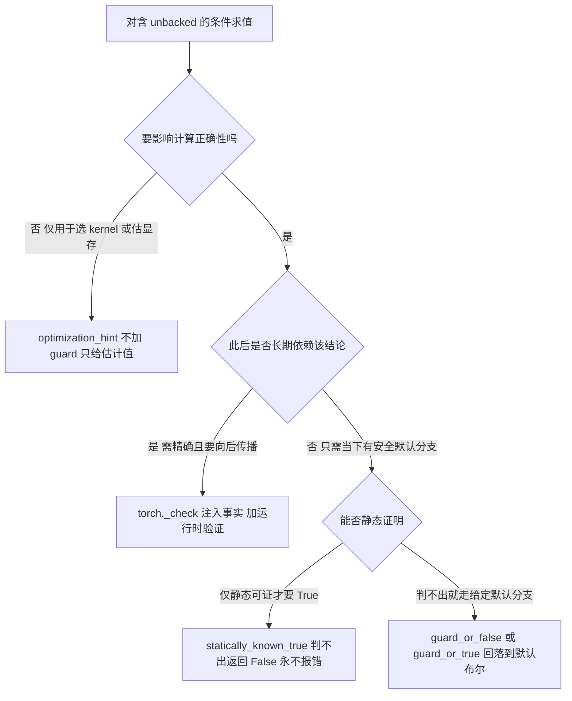

# Unbacked SymInt 深度分析：数据相关 Shape 的处理机制

> 基于 PyTorch 主分支源码与官方文档分析
> 最后更新: 2026-07-06（原 2026-05-22）
> 2026-07-06 增补 [§10](#10-2025-2026-进展从-guard_size_oblivious-到显式-size-oblivious-推理原语)：据 pinned pytorch checkout 核验 size-oblivious 推理原语族（全部定位符指向 `torch/fx/experimental/symbolic_shapes.py`）
> **与概念权威页分工**：backed/unbacked 的一般符号系统（ShapeEnv、SymNode、guard 生成、DimDynamic 分配策略）权威页是 [[20_symbolic_shapes_guards_and_graph_reuse_analysis]]；本页只深挖 unbacked 这一支——`torch._check` 家族、`guard_or_*`/`statically_known_true` 推理原语、size-oblivious 语义与调用取舍。

---

## 1. Backed vs Unbacked：根本区别

PyTorch dynamic shape 系统中存在两类符号整数：

```
Backed symbol (s0):
  来源:  函数入口处读取输入 tensor 的 shape
  时机:  函数调用前就已知
  hint:  有（编译时见过的具体值，如 hint=3）
  约束:  → 翻译为 Guard，在 kernel 执行前检查

Unbacked symbol (u0):
  来源:  图内部某个 op 的输出 shape，由张量数据值决定
  时机:  必须执行该 op 之后才能知道
  hint:  无（编译期完全不知道）
  约束:  → 翻译为 deferred runtime assert，在 op 执行后检查
```

### 1.1 产生 Unbacked Symbol 的 Op 类型

| Op | 原因 |
|----|------|
| `torch.nonzero(x)` | 非零元素个数 = f(x 的数据值) |
| `tensor.item()` | 把标量 tensor 转换为 Python int/float |
| `torch.where(cond)` | 满足条件的元素个数 |
| `torch.unique(x)` | 唯一值个数未知 |
| `masked_select(x, mask)` | 被选元素数量 = f(mask 的数据) |
| `torch.bincount(x)` | 输出 size 取决于 x 的最大值 |
| `torch.nonzero_static(x, size=n)` | 截断为固定大小（特殊处理） |

### 1.2 命名惯例

- Backed symbols：`s0, s1, s2, ...`（ShapeEnv 内部）
- Unbacked symbols：`u0, u1, u2, ...`（ShapeEnv 内部）

用户可通过 `torch._dynamo.decorators.mark_unbacked(tensor, dim)` 手动标记某维度为 unbacked。

---

## 2. 为什么 Guard 机制对 Unbacked 无效

Guard 的执行时机是**在 kernel 调用之前**，根据输入 tensor 的 shape 做检查：

```python
# Guard 检查（执行前）：
def check_guards(args):
    assert 2 <= args[0].size(0)     # ✓ 输入 tensor 在调用前就存在

# Unbacked symbol 无法这样做：
def check_guards(args):
    # u0 = nonzero(args[0]) 的输出行数
    # 在执行 nonzero 之前，u0 根本不存在！
    assert u0 > 0                   # ✗ u0 从哪来？
```

Guard 负责决定**缓存是否命中**（Dynamo 层），unbacked symbol 的正确性验证必须在 op 执行后（Inductor codegen 层）插入断言。这是两个完全独立的机制。

---

## 3. ShapeEnv 内部：两类约束的存储方式

```python
class ShapeEnv:
    # Backed symbol 的约束 → 翻译为 Guard
    var_to_range: dict[Symbol, ValueRanges]   # s0 ∈ [2, ∞)
    guards: list[ShapeGuard]                   # → "2 <= arg0.size(0)"

    # Unbacked symbol 的约束 → 推迟到运行时
    deferred_runtime_asserts: dict[Symbol, list[RuntimeAssert]]
    # 例如: {u0: [RuntimeAssert(u0 > 0), RuntimeAssert(u0 < 1000)]}
```

核心方法 `guard_or_defer_runtime_assert(expr)` 根据 expr 涉及的符号类型做分流：

```
guard_or_defer_runtime_assert(expr):
  if 所有涉及的 symbol 都是 backed:
      → 直接加 guard（编译期检查）
  elif 涉及任意 unbacked symbol:
      → 加入 deferred_runtime_asserts
      → codegen 时在 wrapper 中生成运行时 assert 语句
      → 编译期假设该条件为 True（不触发报错，允许后续推导）
```

**"编译期假设为 True"** 的含义：ShapeEnv 在做符号推导时会把 `torch._check(u0 > 0)` 里的条件当作已知事实，用于化简后续的符号表达式（如推导出 `u0 + 1 > 1`）。

---

## 4. Inductor Codegen：Unbacked Symbol 在 Wrapper 中的体现

以 `nonzero` 为例，生成的 wrapper 代码结构：

```python
def call(args):
    arg0_1 = args[0]   # 输入 tensor

    # ① 执行产生 u0 的 op
    buf0 = torch.ops.aten.nonzero.default(arg0_1)

    # ② 从输出 tensor 反向解析 unbacked symbol
    #    (compute_unbacked_bindings 的结果, 由 pytree.KeyPath 确定位置)
    u0 = buf0.size(0)   # 现在才知道 u0 的值

    # ③ 插入 deferred runtime assertion（来自 torch._check(u0 > 0)）
    torch._check(u0 > 0)
    # 编译期: ShapeEnv 知道 u0 > 0 为 True
    # 运行时: 实际执行验证，违反则 RuntimeError

    # ④ 后续使用 u0 的计算（u0 在运行时是具体整数）
    buf1 = empty_strided_cuda((u0, 64), (64, 1), torch.float32)
```

对应源码：`codegen_unbacked_symbol_defs_for_outputs()` (`wrapper.py:3436`)，通过 `pytree.KeyPath` 知道"从哪个输出 tensor 的哪个 dim 读取 u0"。

---

## 5. torch._check() 的三种效果

`torch._check(expr)` 根据 expr 的形式产生不同效果：

### 效果 1：值域细化

```python
u0 = indices.size(0)            # u0 ∈ [0, ∞)（默认 size-like 范围）
torch._check(u0 > 0)            # → 细化: u0 ∈ [1, ∞)
torch._check(u0 < 1024)         # → 细化: u0 ∈ [1, 1023]

# 编译器现在知道 u0 有界，可安全做 32-bit indexing 等决策
```

### 效果 2：符号替换（消灭 unbacked）

```python
u0 = indices.size(0)            # unbacked
torch._check(u0 == s0)          # → ShapeEnv: replacements[u0] = s0

# 之后所有 u0 被替换为 backed symbol s0
# u0 从 deferred_runtime_asserts 移除，退化为普通 guard 处理
```

这是消灭 unbacked symbol 的最强手段。若能证明 u0 等于某个 backed symbol，整个问题退化到 backed 路径。

### 效果 3：条件记忆（解决控制流问题）

```python
u0 = indices.size(0)
torch._check(u0 > 4)            # 告诉编译器"此条件恒为真"

if u0 > 4:                      # 编译器知道走 True 分支
    return x * 2                # 唯一路径
# else 分支变成死代码，从编译产物中消失
```

`torch._check` 是对 ShapeEnv 的"事实注入"，不是普通 Python 断言。编译器无条件相信它，运行时插入验证断言——违反时 RuntimeError，而非静默错误。

---

## 6. GuardOnDataDependentSymNode：控制流与 Unbacked 的冲突

### 触发条件

当 unbacked symbol 参与 Python `if` 判断时发生：

```python
@torch.compile
def f(x):
    indices = torch.nonzero(x)
    n = indices.size(0)          # u0

    if n > 4:           # ← 致命！Python 需要 bool(u0 > 4)
        return x * 2
    else:
        return x + 3
```

调用链：

```
Python: bool(n > 4)
  → SymInt.__bool__
    → ShapeEnv.evaluate_expr(u0 > 4)
      → u0 没有 hint → 无法判断 True/False
        → raise GuardOnDataDependentSymNode
```

### 为什么 Backed Symbol 可以做 if 判断

Backed symbol 有 hint（编译时见过的具体值）。ShapeEnv 用 hint 做决策（如 hint=7，判断 `7 > 4 = True`），同时生成 guard `u0 > 4`。下次运行时 guard 检查实际 u0 是否满足，不满足则重编译走另一分支。

Unbacked symbol 没有 hint → 无法判断哪个分支 → 报错。

### 修法

```python
# Fix: torch._check() 在 if 之前注入约束
torch._check(n > 4)   # 告诉编译器"这个条件恒为真"
if n > 4:             # 现在可以：编译器取 True 分支
    return x * 2
# else 变成死代码
```

---

## 7. 相关 API

| API | 用途 |
|-----|------|
| `torch._check(cond)` | 注入约束，编译期信任，运行时验证 |
| `torch._check_is_size(x)` | 声明 x 将用作 tensor size（≥ 0，启用 size-like 特殊处理） |
| `torch.fx.experimental.symbolic_shapes.constrain_range(x, min, max)` | 显式设置值域 `[min, max]` |
| `torch._dynamo.decorators.mark_unbacked(tensor, dim)` | 手动将某维度标记为 unbacked |
| `torch.fx.experimental.symbolic_shapes.statically_known_true(expr)` | 不加 guard 地测试一个条件是否静态已知为真 |
| `torch.fx.experimental.symbolic_shapes.statically_known_false(expr)` | 不加 guard 地测试是否静态已知为假 |
| `torch.fx.experimental.symbolic_shapes.guard_or_false(expr)` | 若可 guard 则加 guard，否则返回 False（不崩溃） |
| `torch.fx.experimental.symbolic_shapes.guard_or_true(expr)` | 与 `guard_or_false` 对偶：判不出时返回 True（不崩溃） |
| `torch.fx.experimental.symbolic_shapes.optimization_hint(x, fallback)` | 把符号估成具体 int，**仅供优化决策**（选 kernel／估显存）；不加 guard、不影响正确性 |
| `torch.fx.experimental.symbolic_shapes.sym_and(x, *ys)` / `sym_or(...)` | 组合符号布尔而不做 bool 求值（避免提前触发数据相关判断） |

> 上面 `guard_or_*` / `statically_known_*` / `optimization_hint` / `sym_and·sym_or` 同属一族「显式 size-oblivious 推理原语」，是 2025–2026 取代旧 `guard_size_oblivious` 的核心进展 —— 语义、选型与迁移规模见 [§10](#10-2025-2026-进展从-guard_size_oblivious-到显式-size-oblivious-推理原语)。

---

## 8. 常见误用与修法

### 误用 1：Python 切片使用 unbacked symbol

```python
# 失败：Python 的 [:n] 触发 __index__ → bool 判断
n = x.nonzero().size(0)
return y[:n]

# 修法：用 narrow()，它接受 SymInt
return y.narrow(0, 0, n)
```

### 误用 2：两个独立 unbacked 可以统一

```python
u0 = a.nonzero().size(0)
u1 = b.nonzero().size(0)
# 如果 a 和 b 的非零数量总是相同
torch._check(u0 == u1)   # 符号替换 → u1 消灭，变成 u0
result = torch.randn(u0, u0)
```

### 误用 3：item() 结果直接参与控制流

```python
# 失败版本
size = x.item()
if size > 0:
    ...

# 正确版本
size = x.item()
torch._check_is_size(size)  # 声明 size 是合法 tensor size (≥ 0)
torch._check(size > 0)      # 注入具体约束
if size > 0:                # 现在可以：取 True 分支
    ...
```

### 误用 4：empty_strided 与 unbacked stride

```python
# 失败：stride 由 unbacked symbol 计算，触发 output stride 推导问题
u0 = x.sum().item()
return torch.empty_strided((u0, 64), (64, 1))

# 修法：用 empty()，让 Inductor 推导 stride
return torch.empty((u0, 64))
```

---

## 9. Backed vs Unbacked 全链路对比

```
               Backed (s0)                     Unbacked (u0)
               ──────────────────              ──────────────────
何时产生      │ 函数入口读取 input shape       │ 图内部 op 执行后
何时已知      │ kernel 调用前                  │ 产生该 u0 的 op 执行后
约束存储      │ ShapeEnv.var_to_range          │ deferred_runtime_asserts
约束翻译      │ Guard（compile-time）           │ 运行时 assert（runtime）
控制流        │ 有 hint → 可做 if 判断          │ 无 hint → GuardOnDataDependentSymNode
消灭方式      │ 静态化（具体值替换）             │ torch._check(u0 == backed_expr)
Wrapper 体现 │ assert_size_stride(arg, ...)   │ u0 = output.size(dim) [先读取]
             │ 在 wrapper 开头执行             │ torch._check(u0>0)    [后断言]
```

---

## 10. 2025-2026 进展：从 `guard_size_oblivious` 到显式 size-oblivious 推理原语

> 这是本主题近一年最主要的社区进展：unbacked 的「判不出该走哪条路」问题，从一个**隐式全局假设**演进为**一族语义显式、可开放给用户代码的原语**。

### 10.1 旧机制：`guard_size_oblivious` 的隐式假设

`guard_size_oblivious(expr)`（`symbolic_shapes.py:534`）是早期处理「框架内部要对 size 做 0/1 判断、但 size 是 unbacked」的手段。它对 size-like unbacked 符号**临时把值域设为 `[2, Inf]`**——即「假设这个 size 既不等于 0 也不等于 1」——让 `if size == 0` / `if size == 1` 这类判断在编译期能走通，而不抛 `GuardOnDataDependentSymNode`。

问题在于它是一种**隐式、全局**的假设：调用点从字面看不出它悄悄改写了值域，语义也偏离常规 PyTorch（其 docstring 明说 *"we may diverge in behavior"*），既难推理又容易埋 bug（典型如 upper bound < 2 的 size-like 符号会与这套假设冲突）。

### 10.2 新机制：一族「显式声明默认行为」的原语

2025 年起，PyTorch 团队系统性地把框架内部的 `guard_size_oblivious` 调用点替换为一组**语义显式**的原语，并将它们开放给用户代码。核心区别：不再偷偷改值域，而是让调用点**明说「判不出时走哪条路」**。（下表定位符均在 `symbolic_shapes.py`，且均已在该文件 `__all__` 中导出为公共 API。）

| 原语 | 源码 | 语义 | 会不会加 guard | 数据相关判不出时 |
|------|------|------|----------------|-----------------|
| `guard_or_false(a)` | `:1573` | 能判就判，判不出回落 False | 可能（对 backed 符号） | 返回 False，不报错 |
| `guard_or_true(a)` | `:1580` | 能判就判，判不出回落 True | 可能（对 backed 符号） | 返回 True，不报错 |
| `statically_known_true(x)` | `:1648` | 仅当**静态可证为真**才返 True | **从不加 guard** | 返回 False，不报错 |
| `statically_known_false(x)` | `:1621` | 仅当**静态可证为假**才返 True | **从不加 guard** | 返回 False，不报错 |
| `optimization_hint(a, fallback)` | `:155` | 把符号估成具体 int，仅供优化决策 | **从不加 guard** | 用 fallback／估计值 |
| `sym_and(x, *ys)` / `sym_or(...)` | `:1672` / `:1698` | 组合符号布尔而不做 bool 求值 | 否 | 不提前触发判断 |

三档的分工：

- **`statically_known_*`**：最保守。只信「编译期能证明」的，绝不加新 guard、绝不重编译、绝不报错——判不出就当 False。适合**优化短路**（判不出就走通用慢路径也无所谓）。
- **`guard_or_false/true`**：对 backed 符号仍会加 guard（因此可能重编译），但对 unbacked「判不出」时不报错而是**回落到你指定的布尔**。适合「有一个安全默认分支」的场景，通常配合 `torch._check` 给通用路径兜底。
- **`optimization_hint`**：只影响**性能**不影响**正确性**（如选快慢 kernel、估显存），要求两条分支都对。

### 10.3 迁移的规模（据 pinned checkout 实测）

在当前 checkout 的 `torch/` 目录下按符号名统计：

- `guard_or_false` / `guard_or_true`：**约 366 处调用，横跨 44 个文件** —— 已是 decompositions、`_refs`、`_meta_registrations`、Inductor `lowering`/`ir`、AOTAutograd，以及 **DTensor（`torch/distributed/tensor/`，仅 `_view_ops.py` 就有 ~38 处）** 的主流写法。
- `guard_size_oblivious`：收缩到**约 18 处、9 个文件**，多为定义、C++/Dynamo 桥接与历史残留。

数量级的反转（366 vs 18）说明：**「显式 `guard_or_*`」已经成为框架内部处理 unbacked 判断的默认范式，`guard_size_oblivious` 沦为残留。** DTensor 侧的密集使用也正对应社区长期痛点「DTensor + dynamic shape 支持差」——团队正用这族原语把 DTensor 逐步变得 unbacked-safe。

### 10.4 选型决策



### 10.5 「是否必须解决 unbacked」——一句话取舍

unbacked 只有在**既用了数据相关 op、又要求整图不断**时才是「必须解决」的问题：

- **不碰** `nonzero` / `item` / `masked_select` / `unique` 等 op → 永远见不到 unbacked，无需理会。
- **碰了但允许 graph break**（默认 `fullgraph=False`）→ **不必解决**：数据相关那段自动断图、回退 eager，其余照常编译；代价是**性能**（那段没融合、可能挡住 CUDA Graph），不是**正确性**。
- **要求** `fullgraph=True` / `torch.export` / AOTInductor / 整图 CUDA Graph，**且路径穿过数据相关 op** → **此时才必须**：用 §5–§8 的 `torch._check` 家族 + 本节的 `guard_or_*` 把 unbacked「喂」给编译器。

即：**graph break 是合法逃生口；只有在追求全图捕获／导出／极致性能时，才需要真正驯服 unbacked。**

---

## Related Pages

- [[20_symbolic_shapes_guards_and_graph_reuse_analysis]] — 符号形状/Guard/图复用概念权威页，ShapeEnv 与 Backed Symbol 体系
- [[inductor_codegen_dynamic_shape_analysis]] — Inductor codegen 中的符号传递机制
- [[torch_compile_architecture]] — torch.compile 端到端流水线
- [[02_compile_stack/01_dynamo/index]] — Dynamo 帧捕获与 Guard 系统
