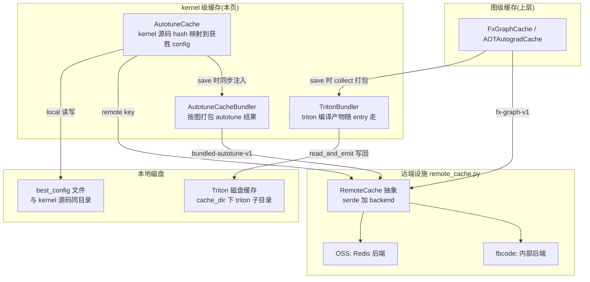
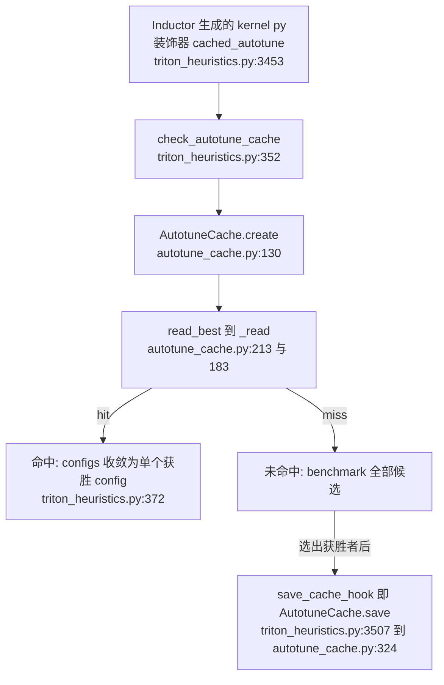

# Triton Autotune / Remote Cache — kernel 级缓存与远端设施：把「每 kernel 重新 benchmark + 重新 triton.compile」变成一次查表

> [!note] 页面角色与审计状态
> **页面角色**：Triton winner config、kernel artifact bundling 与 RemoteCache 基础设施专题；它解释搜索结果如何复用，不替代 autotuning 搜索过程或 kernel codegen 机制。
> **原始基线**：PyTorch `3bda74318624581502db16e6439c36effdb16481`；**当前审计基线**：PyTorch `e8f97c1a6ef8cbcdd0a946606bc1e924e4f07e52`。
> **审计状态**：已纳入历史 manifest，但全部 key/remote/bundling claim 尚未迁到当前基线复核，本轮 CPU/no-CUDA 环境也未执行 Triton autotune cache hit。kernel、wrapper、autotune 与 provenance 主线见 [[14_codegen_kernel_mapping_autotuning_and_provenance_analysis]]；缓存领域入口见 [[02_compile_stack/06_compile_cache/index]]。

> **分析对象**：torch.compile 缓存栈最底层的 kernel 粒度缓存与远端基础设施——`AutotuneCache`（每 kernel 获胜 config，`torch/_inductor/runtime/autotune_cache.py`）、`AutotuneCacheBundler`（整图打包的 autotune 远端缓存）、`TritonBundler` 内部机制（`torch/_inductor/triton_bundler.py`）、以及它们共用的 `RemoteCache` 抽象（`torch/_inductor/remote_cache.py`）。
> **Source baseline**：PyTorch upstream 本地检出 `E:\97-codes\torch_parallel\pytorch` @ branch `main`, commit `3bda74318624581502db16e6439c36effdb16481`（2026-07-10, version 2.14.0a0）。所有 `file:line` 均对该 commit 逐一开文件核验。
> **最后更新**：2026-07-10

本页回答三件事：图级缓存（[[12_fx_graph_cache_analysis]]）之下还有哪几层 kernel 粒度缓存、各自消灭哪段重复开销；autotune 获胜 config 的 key 怎么算、为什么是 device（arch）相关的；以及 `remote_cache.py` 这套被 fx-graph / autotune / bundled-autotune / PGO 共用的远端设施长什么样。TritonBundler 的动机与打包-回放**接入点**已由 [[12_fx_graph_cache_analysis]] §4.1 覆盖，本页只写其**内部机制**；`CachingAutotuner` 的运行时生命周期与 config 生成启发式见 [[21_inductor_autotuning_analysis]]，零重复。总览与目录索引见 [[02_compile_stack/06_compile_cache/index]]。

---

## 一、总览

**一条主线**：即便 FxGraphCache 命中拿回了 wrapper 源码，warm start 在 kernel 层仍有两段昂贵的重复劳动——① 对每个多 config 的 kernel 重跑 autotune（N 个候选各自编译 + 多次计时）；② 对每个 kernel 重跑 `triton.compile`（源码 → PTX → cubin）。本页的三个机制分别消灭它们：**AutotuneCache** 把「kernel 源码 hash → 获胜 config」持久化，命中时候选列表直接收敛成一个（`triton_heuristics.py:372`）；**TritonBundler** 把 Triton 磁盘缓存里的编译产物打包进 FxGraphCache entry，命中时写回本地让 `triton.compile` 变成缓存命中；**AutotuneCacheBundler + RemoteCache** 把这些结果远端化，让整个集群共享一台机器的调优成果——而且按图打包一次取回，不做逐 kernel 的网络 round-trip。

| 概念 | 说明 | 定位 |
|---|---|---|
| `AutotuneCache` | 单 kernel 获胜 config 的 local+remote 协调器（类 docstring：coordinates local and remote autotune cache lookups for one kernel） | `autotune_cache.py:121` |
| `.best_config` 文件 | local 侧产物，与生成的 kernel `.py` 同目录 | `autotune_cache.py:171` |
| `AutotuneCacheBundler` | 按整张图（wrapper 代码 hash）打包 autotune 结果的远端缓存 | `autotune_cache.py:484` |
| `AutotuneCacheArtifact` | Mega-cache挂钩（独立当前基线审计尚未完成） | `autotune_cache.py:94` |
| `RemoteCache` / `RemoteCacheSerde` / `RemoteCacheBackend` | 远端缓存三件套抽象：控制器 + 序列化 + 存储后端 | `remote_cache.py:178/103/66` |
| `RedisRemoteCacheBackend` | OSS 侧唯一内置远端后端 | `remote_cache.py:271` |
| `create_cache` | 工厂：local / fbcode / OSS 三分支，失败返回 `None` | `remote_cache.py:405` |
| `TritonBundler` | 把 Triton 编译产物收进 FxGraphCache entry 的打包器 | `triton_bundler.py:92` |
| `triton_cache_dir` | Triton 磁盘缓存位置（被 Inductor 重定向，见 §六） | `cache_dir_utils.py:37` |

层级与数据流：

**Quick Start（开关 + 从哪读起）**

- `config.autotune_local_cache` 默认 `True`（`config.py:139`）；`config.autotune_remote_cache` 三态，OSS 默认 `None`=关（`config.py:141-151`，env `TORCHINDUCTOR_AUTOTUNE_REMOTE_CACHE`，`config.py:37-38`）；`config.bundled_autotune_remote_cache` 同样三态（`config.py:153-163`，env `TORCHINDUCTOR_BUNDLED_AUTOTUNE_REMOTE_CACHE`）。三态语义由 `get_tristate_env` 实现：env 为 `"1"`/`"0"` 强制开/关，否则 `None`（`torch/utils/_config_module.py:993-999`）。
- OSS 远端后端连 Redis：`TORCHINDUCTOR_REDIS_URL`，或 `TORCHINDUCTOR_REDIS_HOST`/`TORCHINDUCTOR_REDIS_PORT`（默认 `localhost:6379`，`remote_cache.py:284-290`）。
- 一键全关：`force_disable_caches`（autotune 侧 `triton_heuristics.py:360`，bundler 侧 `triton_bundler.py:120`）。
- 从哪读起：`check_autotune_cache`（`triton_heuristics.py:352`）→ `AutotuneCache.create`（`autotune_cache.py:130`）；远端设施从 `create_cache`（`remote_cache.py:405`）。
- 最小观察：`TORCH_LOGS` 打开 `remote_cache` 日志时进程退出打印各 cache 的 hit/miss/put/exception 统计（atexit `dump_cache_stats`，`remote_cache.py:476-493`）；`counters["inductor"]["triton_bundler_save_kernel"/"triton_bundler_read_and_emit_kernel"]`（`triton_bundler.py:327/409`）。

---

## 二、AutotuneCache——每个 kernel 的获胜 config 缓存

### 2.1 缓存什么、放在哪

缓存的 value 是**获胜 config 的完整参数字典**：`config.kwargs` + `num_warps`/`num_stages` + `configs_hash` + `found_by_coordesc` + `time_taken_ms` + `triton_cache_hash`（`AutotuneCache.save` 组装，`autotune_cache.py:331-342`；第三方后端可附 `extra_options`，`:345-346`）。整个字典是纯 JSON（`JsonDataTy`），local 和 remote 存同一份。

local 侧落盘为 **`.best_config` 文件，与 Inductor 生成的 kernel `.py` 源文件同目录**：`_make_local_cache_key` 返回 `os.path.join(dirname, f"{key}.best_config")`，dirname 即 kernel 文件所在目录（`autotune_cache.py:160-171`，调用处传 `os.path.dirname(filename)`，`:136-137`）。文件写入走 `LocalCacheBackend._put` → `codecache.write_atomic`（`remote_cache.py:148-152`）。

### 2.2 key 怎么算——为什么 local key 不含设备、remote key 含

local 与 remote 的 key 刻意不同：

- **local key** = `hash(kernel文件basename : cache_key_tag)` 再与 `torch_key()` 联合 hash（`_prepare_key` `:151-157` + `_make_local_cache_key` `:159-171`，hash 策略 `AUTOTUNE_CACHE_KEY_STRATEGY`：sha256-hex、组件直接拼接，`torch/_inductor/cache_key.py:100-105`）。源码注释明确两点：kernel 文件名的 base **本身已是源码内容的 sha256**（`:155`），所以 basename 即源码指纹；`torch_key()` 进 key 是为了 torch 版本变更时让 `.best_config` 格式不兼容的旧文件自动失效（`[Note: torch_key in autotune cache key]`，`:162-166`）。**不含任何设备信息**——local 文件与 kernel 源码同目录、天然绑定本机环境，无需再区分。`cache_key_tag` 是全局破缓存标签（`torch/compiler/config.py:92-96`）。
- **remote key** = `hash(torch_key + backend_hash + configs_hash + salt "autotune-best-config-v2")`（`_setup_remote_autotune_cache`，`autotune_cache.py:258-262`）。`backend_hash = triton_hash_with_backend()`（`:72`）= Triton Python 源码的 `triton_key()` + `backend.hash()`（`torch/utils/_triton.py:267-275`）；相邻注释指出 `backend.hash()` 覆盖「ptxas version and arch only」（`torch/utils/_triton.py:253`）。`backend_hash` 拿不到则直接放弃远端缓存（`autotune_cache.py:244-247`）。

**为什么 autotune 结果必须 device 相关**：获胜 config 是在具体硬件上 benchmark 计时选出来的（流程见 [[21_inductor_autotuning_analysis]]），换一代 GPU 最优 tiling/warps 完全不同。remote key 用 `backend_hash` 把结果限定到「同 Triton 版本 + 同 ptxas + 同目标 arch」——同 arch 的集群机器共享（这正是远端缓存的价值），跨 arch 绝不互相污染。注意精度：key 绑定的是 **arch**（如 sm90）而非具体 GPU 型号，这是源码陈述（`_triton.py:253`）；同 arch 不同 SKU 共享 entry 是该设计接受的近似（推断）。

`configs_hash` 是候选 config 列表的 sha256（`hash_configs`，`triton_heuristics.py:3414-3423`）。它既进 remote key，也存在 value 里供 local 命中时校验：`_load_cached_autotuning` 第一件事就是 `configs_hash` 不匹配即判 miss（`autotune_cache.py:695`）——Inductor 启发式改了候选集合（升级、改 config），旧获胜者自动作废。

### 2.3 读写路径——与 `triton_heuristics.py` 的挂接

- **读**：每个生成 kernel 的 `cached_autotune` 装饰器先走 `check_autotune_cache`（`triton_heuristics.py:3453`），条件是「未 force_disable + 有 filename + (候选数>1 或开了 coordesc) + 非 TRITON_INTERPRET」（`:360-365`）——单 config 的 kernel 根本不建缓存对象。`AutotuneCache.create` 只有 local/remote 至少一个可用才返回实例（`autotune_cache.py:146-149`）。`_read` 先 local 后 remote（`:183-209`），与 config 注释一致：「on read local is checked first and only on a cache miss is remote read」（`config.py:144-146`）。命中把候选列表整体替换为 `[best_config]`（`triton_heuristics.py:371-372`），后续 `CachingAutotuner` 对单 config 不再 benchmark。
- **写**：`AutotuneCache.save` 被作为 `save_cache_hook` 挂到 `CachingAutotuner` 上（`triton_heuristics.py:3492/3507`），共三个触发点——常规 benchmark 选出获胜者后（`:1894-1902`，还带 `triton_cache_hash=launcher.cache_hash`，即获胜 kernel 的 Triton hash）、combo kernel 顺序调优后（`:2049-2050`）、coordinate-descent 调优后（`:2301-2306`，`found_by_coordesc=True`）。
- **命中时的 config 还原**（`_load_cached_autotuning`，`autotune_cache.py:687-736`）：优先在现有候选里找唯一精确匹配（`:711-722`）；找不到就直接从缓存字段**重建** `Config` 对象——注释说明这覆盖 coordesc 与 `_dynamic_scale_rblock` 动态生成、不在原始候选列表里的 config（`:727-730`）。
- **worker 进程序列化**：Triton 编译在 AsyncCompile worker 进程做，`AutotuneCache` 在 worker 建、`save` 在父进程调（`:279-283` 注释），所以 `__getstate__` 把不可 pickle 的 remote cache 句柄拆成 key、`__setstate__` 在父进程用保存的 `create_cache` 参数重建（`:284-321`）。
- **Mega-cache 挂钩**：`_read` 命中与 `save` 都会把 JSON 记进 `CacheArtifactRecorder`（`:177-180/198/357`）；`AutotuneCacheArtifact.populate_cache` 回放时以 `cache_dir()` 相对路径写回文件（`:96-99`，artifact key 取 local key 最后两段路径分量使其跨机器可移植，`:173-175`）。独立当前基线审计尚未完成。

---

## 三、远端缓存基础设施——`remote_cache.py`

### 3.1 三件套抽象

源码注释直接给出结构（`remote_cache.py:155-177`）：一个 `RemoteCache` 由**控制器**（`RemoteCache` 本身，`:178`）、**serde**（`RemoteCacheSerde`，`:103-110`）、**后端**（`RemoteCacheBackend`，`:66-99`）组成。`put` = serde.encode → backend；`get` = backend → serde.decode。两个设计点：

- **结构化数据统一走 JSON**：`JsonDataTy` 是递归 JSON 类型（`:113-115`），`RemoteCacheJsonSerde` 编码为 ASCII bytes（`:118-123`）；二进制产物（如 FxGraphCache entry）则由调用方 base64 后作为 JSON 字段传入（见 [[12_fx_graph_cache_analysis]] §六）。`put(None)` 被显式禁止——无法与 miss 区分（`:212-215` 注释）。
- **local 文件缓存复用同一 bytes 接口**：`LocalCacheBackend` 把「key 即文件路径」的文件系统实现塞进同一个 `RemoteCacheBackend[bytes]` 抽象（`:134-152`，类注释 `:67-71` 说明大多数 backend 是远端、local 用同一接口）。于是 AutotuneCache 的 local/remote 两侧代码完全对称（§2.3 的 `_read`/`save` 对两个 `(cache, key)` 元组做同样的 get/put）。`LocalCache` 还容忍损坏文件：JSON 解码失败仅告警并当 miss（`:366-377`）。
- 统一计量：`get`/`put` 都包在 `_WaitCounter` + `cache_stats` 里（`:194-226`），Redis 侧 `ConnectionError` 一次即自我禁用（置 `self._redis = None`，`:302-306/:323-326`）——远端缓存是加速器，绝不允许拖垮编译。

### 3.2 `create_cache` 工厂与后端选择

`create_cache(key, is_fbcode, fb_cache_cls, oss_cache_cls, local_cache_cls)`（`:405-433`）三分支：显式 `local_cache_cls` → 本模块类；fbcode → `torch._inductor.fb.remote_cache` 内部模块（不在 OSS 源码树）；否则 → 本模块的 OSS 类。**任何异常都吞掉返回 `None`**（`:431-433`），调用方把 `None` 当「该缓存不可用」。

OSS 侧全部远端类都是 `RedisRemoteCache` 的空子类——子类存在的唯一意义是让 `TORCH_LOGS=cache` 的统计按具体缓存分类（`RemoteCache` 顶部注释 `:174-177`）。Redis key 格式 `pt2:{cache_id}::{key}:c1`（`:340-341`）。共用这套设施的缓存全景（cache id 逐一核验）：

| cache id | OSS 类（定位） | 使用方 |
|---|---|---|
| `fx-graph-v1` | `RemoteFxGraphCache`（`remote_cache.py:393`） | `FxGraphCache.get_remote_cache`（`codecache.py:2331`） |
| `autograd-experimental` | `RemoteAOTAutogradCache`（`:397`） | AOTAutogradCache（`autograd_cache.py:1404-1410`） |
| `dynamo-pgo` | `RemoteDynamoPGOCache`（`:401`） | Dynamo PGO（`torch/_dynamo/pgo.py:679-684`，见 [[10_dynamo_pgo_cache_analysis]]） |
| 逐 kernel remote key（§2.2） | `RemoteAutotuneCache`（`:385`） | `AutotuneCache._setup_remote_autotune_cache`（`autotune_cache.py:264-269`） |
| `bundled-autotune-v1` | `RemoteBundledAutotuneCache`（`:389`） | `AutotuneCacheBundler.begin_compile`（`autotune_cache.py:557-562`） |
| `local-autotune`（走 local 分支） | `LocalAutotuneCache`（`:380`） | `.best_config` 文件读写（`autotune_cache.py:229-232`） |

**约束：OSS 远端默认全关**。所有 `*_remote_cache` config 均为三态、OSS 默认 `None`=关（`config.py:121/150/162` 注释「None: Not set -- Off for OSS, JustKnobs based for internal」；判定逻辑 `_should_use_remote_autotune_cache`：config 为 `None` 且非 fbcode 直接 `False`，`autotune_cache.py:643-646`）。**为什么**（推断，源码未明述）：OSS 没有可普适假设的远端存储——Redis 后端默认指向 `localhost:6379`，只有用户自己部署并显式设 env 才有意义；而 fbcode 有统一内部存储 + JustKnobs 灰度（`:648-660`）。

---

## 四、Bundled autotune remote cache——按图打包，一次取回

### 4.1 动机与被否掉的替代

§二的 remote 路径是**逐 kernel** 的：一张图几十上百个 kernel，warm start 要打几十上百次远端 round-trip。`AutotuneCacheBundler` 把一次编译产生的全部 autotune 结果按**整张图**打成一个 entry：`_AutotuneCacheBundlerImpl` 维护 `basename → data` 字典（`autotune_cache.py:385/392-395`），`end_compile` 一次 `put` 上传（`:387-390`）；下次 `begin_compile` 一次 `get` 取回全部（`:582`）。被替代的方案就是「只用逐 kernel remote cache」——它仍保留（两者可同时开，互不感知），bundled 版本是网络效率优化而非功能替代。

### 4.2 key 与生命周期

- **key** = `hash(code_hash + backend_hash + salt "bundled-autotune-best-configs-v1")`（`:571-579`）。`code_hash` 是 wrapper 源码**去注释后**的 hash（`_comment_stripped_hash`，`:638-640`——注释里含 run id、文件路径等跨 run 抖动内容，必须剥掉才能稳定）。源码 TODO 坦承一处近似：逐 kernel key 里的 `configs_hash` 此时还不可知（依赖各 kernel 的 size_hints），作者认为该信息「基本已体现在 code_hash 里」（`:573-578`）——即 bundled key 的稳定性依赖 wrapper 代码完整决定各 kernel 候选集这一假设。
- **生命周期**：`begin_compile` 有两个调用点——冷编译 codegen 完成时（`graph.py:3024-3025`）和 **FxGraphCache 命中时**（`codecache.py:2048-2050`，命中路径也要把 bundle 里的 autotune 结果放下去，因为 triton 编译/autotune 发生在缓存命中之后的首次调用）；`end_compile` 在编译产物**首次调用**结束后触发（`output_code.py:784-811`，注释：「Autotune cache writes happen during the first call」`:793-795`）——因为 autotune 是 lazy 的，跑完第一次前收集不齐获胜 config。远端命中时干脆不建 bundler、不再保存（`:582-588` 注释「If we get a cache hit don't bother saving」）。bundler 以 `CompileContext` 为粒度弱引用登记，天然隔离并发编译（`:487-514`）。

### 4.3 与 local cache 的依赖——bundle 只是搬运层

config 注释明说：bundled cache「depend on the local cache for local state management - as a result if the local cache is disabled this will also disable the bundled autotune cache」（`config.py:156-158`；判定实现 `:411-414`）。机制原因在 `_load_cache`（`:441-468`）：远端命中后它**不直接把 config 喂给 autotuner**，而是逐条重建 `.best_config` 的本地文件路径（`codecache.get_path` 反推，`:458-460`）写进 local cache（`:463-464`）;消费端（§2.3 的 `_read`）仍然只认 local 文件。bundle 是「远端 → 本地文件」的搬运层，local cache 关了它就没有落点。反向同样：`AutotuneCache.save` 只在 local put 成功的分支里同步 `AutotuneCacheBundler.put`（`:359-364`）；甚至 **local 读命中也要 put 进 bundler**——注释解释：新模型复用已编译过的旧 kernel 时,若不把旧结果也塞进 bundle,新图的 bundle 就只含新 kernel（`:193-197`）。取回时还把各 entry 的 `time_saved_ns` 累加喂给分布式 NCCL 临时超时补偿（`:461-466`）。

---

## 五、TritonBundler 内部机制

接入点（`compile_fx.py` 的 begin/collect、`codecache.py:2019` 命中时 `read_and_emit`、只打包获胜者的动机）见 [[12_fx_graph_cache_analysis]] §4.1；本节写内部。生命周期五步在类 docstring 里（`triton_bundler.py:99-106`）：begin_compile → 每次 triton 编译 put → 写缓存时 collect → end_compile → 读缓存时 read_and_emit。

**entry 数据结构**（全部 frozen dataclass）：

| 结构 | 内容 | 定位 |
|---|---|---|
| `TritonBundleEntry` | `(kernel_hash, device, directory)`——定位一个已编译 kernel 在 Triton 磁盘缓存里的最小信息（docstring `:23-28`） | `:21-33` |
| `TritonKernelArtifact` | 单个产物文件：`filename` + bytes payload（cubin/json/ttir/ttgir，`:38-39`） | `:35-43` |
| `TritonKernelArtifacts` | 一个 kernel 的全部产物文件集合 | `:61-69` |
| `StaticallyLaunchedAutotuner` | 可静态启动的 `CachingAutotuner` 整对象（见下） | `:46-59` |
| `TritonBundle` | 序列化单位 = kernel 产物列表 + 静态 autotuner 列表 | `:82-89` |

**collect（写路径）**（`:264-354`）：`put` 只在每次 triton 编译完成时登记 `(hash, device, triton_cache_dir(device))` 三元组（`:162-171`；调用点：worker 已有编译结果时 `_precompile_worker`，`triton_heuristics.py:744-750`；单个 config 编译完成时 `_precompile_config`，`:1400-1403`）——**不复制文件**，是 lazy 登记。collect 时才真正扫盘：对每个 winner entry，遍历 `directory/kernel_hash/` 子目录下所有文件读成 bytes（`:297-334`）。获胜者过滤：`put_winner` 在 benchmark 胜出（`triton_heuristics.py:1892`）与 coordesc 胜出（`:2317`）时登记；collect 时 `_winners` 非空则跳过败者（`triton_bundler.py:289-294`），为空（单 config、无 autotune）则全打包（`:174-180` docstring）。

**路径可移植化**：Triton 的 `__grp__*.json` 元数据里含产物的**绝对路径**,跨机器无意义。collect 把 json payload 里的本机路径整体替换为哨兵 `b"[REPLACE]"`（`:112-114/:320-323`,替换前先断言 payload 里不含哨兵本身,`:309-319`）；read_and_emit 落盘时再把哨兵替换回**目标机**的实际目录（`:404-407`）。

**read_and_emit（读路径）**（`:356-434`）的目录约定与并发安全：

1. 目标目录 = `triton_cache_dir(device)/kernel_hash`（`:381-382`）——与 Triton 自己写缓存的布局完全一致,所以写回后 `triton.compile` 直接命中。
2. **目录已存在且非空则整体放弃该 kernel**（`:384-391`）：docstring 明确假设当前进程对目标目录拥有排他访问权（`:363-368`）。本地已有的 Triton 缓存优先，bundle 只补缺。
3. 原子落盘：先写 `tmp.{uuid}` 临时目录,再 `os.replace` 改名（POSIX 原子,`:396-424`）;Windows 上 `os.replace` 对目录不可覆盖,改用 `FileLock` + 先删后换（`:416-420`）。

**静态 launcher 与缓存的关系**（确认相关,写入）：开 `use_static_triton_launcher`（`use_static_cuda_launcher` 的别名,OSS 默认开,`config.py:1429-1436/:56-68`）时,bundle 除了产物文件还直接塞入**整个 `CachingAutotuner` 对象**：`put_static_autotuner` 在 precompile 时深拷贝并剥掉不可 pickle 字段（`triton_bundler.py:184-207`,挂接点 `triton_heuristics.py:739-740`,前提 `is_statically_launchable`）。读侧 `load_autotuners`（`:224-262`）先对每个对象 `reload_cubin_path` 校验 cubin 已按第 1 条落地（`:243-246`;cubin 路径按 `triton_cache_dir` 重算,`triton_heuristics.py:2909-2919`）,然后包成 `StaticAutotunerFuture` 塞进 `CompiledTritonKernels._cache`（`:253-259`;Future 化的理由注释:让缓存未命中的 kernel 不被阻塞,`:253-256`）。`StaticAutotunerFuture.result` 还会 `recheck_autotune_cache`（`codecache.py:5430/5453` → `triton_heuristics.py:673-708`）——静态对象里存的可能是多个 compile_results,要用 §二的 autotune cache 收敛到获胜者。净效果:FxGraphCache 命中后连「反序列化 kernel 源码 + 重建 CachingAutotuner + make_launcher」都跳过。

---

## 六、Triton 自身的磁盘缓存——为什么还要 bundle

Triton 本身就有按 kernel hash 组织的磁盘缓存。**纠正一个常见认知**:独立使用 Triton 时默认在 `~/.triton/cache`,但在 Inductor 下不是——`CachingAutotuner.__init__` 只要 env 未设就把 `TRITON_CACHE_DIR` 指到 Inductor 自己的缓存树 `<cache_dir>/triton/<device>`（`triton_heuristics.py:564-568`;`triton_cache_dir` 实现 `cache_dir_utils.py:37-44`;`cache_dir` = `TORCHINDUCTOR_CACHE_DIR` 或 `/tmp/torchinductor_<user>`,`:14-34`）。子进程/子编译也显式透传这两个 env（`autotune_process.py:352`、`compile_fx_subproc.py:42`、`async_compile.py:466`）。

既然有这层磁盘缓存,为什么 Inductor 还要把产物 bundle 进 FxGraphCache entry?引入 commit 的源码陈述（`69ea2e726c2`,PR #138239 描述）:「consolidate Triton caching into the Inductor caching so that there can be just one cache that unifies them both, **reducing network requests and increasing success rate**」——两套独立缓存意味着远端场景要打两轮网络请求、且各自可能独立 miss;合并后 FxGraphCache entry 自包含,命中即全有。推断补充(源码未逐条明述):Triton 磁盘缓存是纯本地、无远端形态,跨机器 warm start(CI、集群)时首次必 miss;其目录生命周期也不受 Inductor 控制(用户/系统可随时清理),bundle 让 FxGraphCache 命中不依赖它还在。§五第 2 条的「非空即放弃」则保证两层缓存共存时本地优先、互不踩踏。

> **对照**:注意区分三个 hash 体系——Triton 自己的 kernel hash(决定磁盘缓存子目录名,`triton_hash_to_path_key` 兼容 base64/base32 历史格式,`runtime_utils.py:163-175`)、AutotuneCache 的 key(§2.2,kernel **源码** hash)、FxGraphCache 的图级 key([[12_fx_graph_cache_analysis]] §二)。三者独立演化,靠 `triton_cache_hash` 字段(§2.1)与 `TritonBundleEntry.kernel_hash` 互相引用。

---

## 七、进展时间线与收益

**关键节点**（git 逐条核验,日期=commit date）:

| 日期 | commit | 事件 |
|---|---|---|
| 2022-10-13 | `c7c09722ad5` | local `.best_config` 缓存随 TorchDynamo 并入 core,逻辑内联在 `triton_ops/autotune.py`（#86461） |
| 2023-03-23 | `5f57b363184` | 该文件更名 `triton_heuristics.py`（#95558） |
| 2024-03-04 | `6566b3db677` | 远端 autotune cache 引入（"Add an autotune cache for inductor generated kernels" #120963） |
| 2024-05-30 | `3f5d8636aaa` | `remote_cache.py` 引入,Redis 后端进 pytorch 本体（#127480） |
| 2024-07-31 | `b0e06d9d6ad` | `autotune_remote_cache` 改三态 None/True/False（#132285） |
| 2024-09-02 | `c140fa14266` | `autotune_cache.py` 从 `triton_heuristics.py` 抽出成独立模块（"Reorg cache code" #134911,迁移约 153 行） |
| 2024-10-15 | `524fe784ec5` | BundledAutotuneCache 落地（take 2,#137902;首版 #134959 于 2024-10-11 合入当日被 revert） |
| 2024-10-31 | `69ea2e726c2` | TritonBundler 引入（"Consolidate Triton cache into Inductor cache" #138239） |
| 2025-03-14 | `5a843f8973d` | 静态 launcher 首版（#148561,当日 revert 后重落）,后接入 TritonBundler 的 `static_autotuners` |

**收益结论**:AutotuneCache 命中把「N 个候选 config 各自编译 + 多轮 benchmark 计时」收敛为零次 benchmark(候选列表直接变 `[best_config]`,`triton_heuristics.py:371-372`);TritonBundler 命中把 `triton.compile` 变成磁盘命中;两级远端化让**同 arch 集群共享一台机器的调优结果**,bundled 形态再把远端交互从 O(kernel 数) 压到 O(1)。省下的时间被显式度量并利用:autotune value 记 `time_taken_ms`(`autotune_cache.py:340`),bundled 取回时累加 `time_saved_ns` 抬高分布式超时(`:461-466`),TritonBundler 引入 PR 以 `triton_bundler_time_saved_s`(全部 triton.compile 耗时之和)做上线判据(#138239 描述)。具体加速比取决于 kernel 数与候选数,源码未给固定数字(推断)。

---

## Related Pages

- [[courses/torch_compile_end_to_end]] — 当前固定基线的图编译系统化课程入口
- [[02_compile_stack/06_compile_cache/index]] — 编译缓存总览(本页是最底层)
- [[02_compile_stack/06_compile_cache/index]] — 本目录索引
- [[12_fx_graph_cache_analysis]] — 图级缓存;TritonBundler 的打包-回放接入点在其 §4.1,远端接入点在其 §六
- [[11_aotautograd_cache_analysis]] — 上层缓存,复用本页 §三设施(cache id `autograd-experimental`)
- [[10_dynamo_pgo_cache_analysis]] — 同样复用 §三设施(cache id `dynamo-pgo`)
- `AutotuneCacheArtifact` / `CacheArtifactRecorder`整包携带：尚未完成独立当前基线审计
- [[14_codegen_kernel_mapping_autotuning_and_provenance_analysis]] — kernel/wrapper、autotune choices 与 provenance 课程主线
- [[21_inductor_autotuning_analysis]] — `CachingAutotuner` 生命周期与 config 生成启发式(本页缓存的正是其 benchmark 结果)
- [[02_compile_stack/04_inductor/index]] — torch.compile 整体栈
- [[02_compile_stack/04_inductor/index]] — Inductor lowering/codegen
