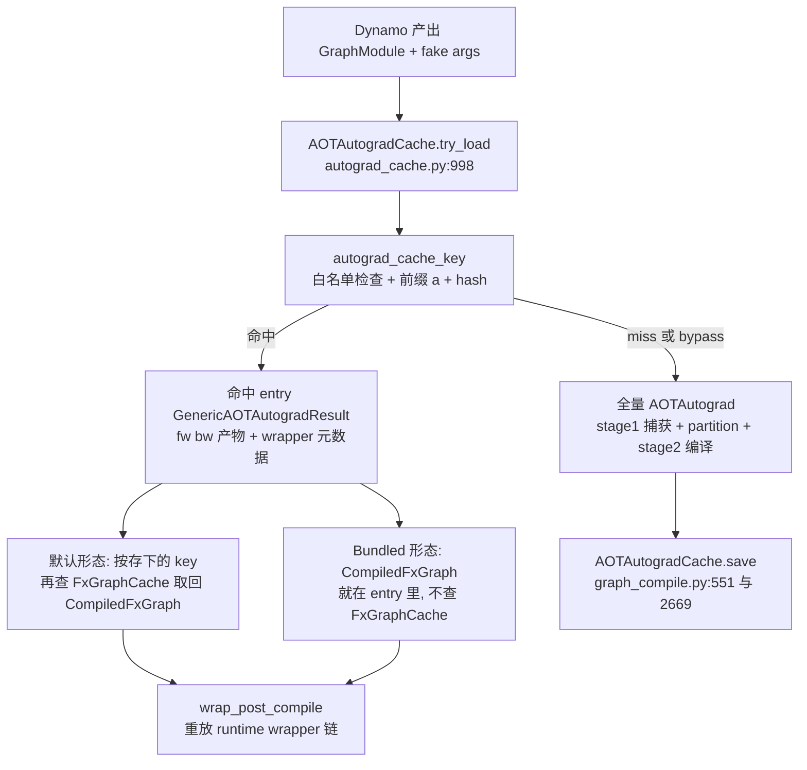
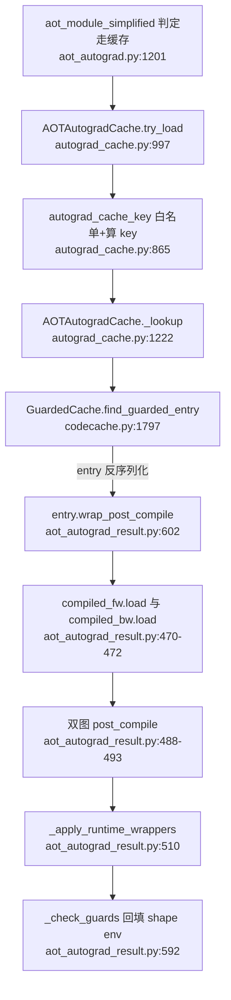

# AOTAutogradCache — 在 dynamo 图层面直接命中「整个前反向编译单元」，连 AOTAutograd 本身也跳过

> [!note] 页面角色与审计状态
> **页面角色**：AOTAutograd result cache 的 key、entry、bypass 与 runtime wrapper 重放专题；它回答“哪些构图/分图工作可被缓存跳过”，不是 AOT 正反向图构造本身的课程替代。
> **原始基线**：PyTorch `3bda74318624581502db16e6439c36effdb16481`；**当前审计基线**：PyTorch `e8f97c1a6ef8cbcdd0a946606bc1e924e4f07e52`。
> **审计状态**：已纳入历史 manifest，但当前只完成结构 inventory 与导航迁移，尚未把全部 claim/locator 和 cache-hit 实验复核到当前基线。正反向构图见 [[19_torch_compile_end_to_end/09_aotautograd_joint_forward_backward_graphs]]，阶段身份与 artifact 追踪见 [[graph_stage_boundaries_identity_and_provenance_analysis]]；缓存领域入口见 [[02_compile_stack/06_compile_cache/index]]。

> **分析对象**：PyTorch AOTAutograd 级编译缓存 `AOTAutogradCache`（`torch/_functorch/_aot_autograd/autograd_cache.py`，1523 行）——缓存 dynamo 输出的 FX graph 到「编译后的 forward/backward + runtime wrapper 元数据」整个编译单元的映射，命中时连 AOTAutograd 的 dispatch/functionalization/metadata 收集/partition 都不再跑。
> **Source baseline**：PyTorch upstream 本地检出 `E:\97-codes\torch_parallel\pytorch` @ branch `main`, commit `3bda74318624581502db16e6439c36effdb16481`（2026-07-10, version 2.14.0a0）。所有 `file:line` 均对该 commit 逐一开文件核验。
> **最后更新**：2026-07-10

本页回答四件事：为什么 [[fx_graph_cache_analysis|FxGraphCache]] 命中了还不够、必须在它**上面**再加一级；AOTAutogradCache 的 key 如何在「dynamo 图可含任意 Python callable」的前提下算得安全（白名单 + 名字归一化）；缓存产物如何以**两种形态**（引用 FxGraphCache key vs 直接内嵌 CompiledFxGraph）组织、命中时 runtime wrapper 链如何逐层重放；以及全部 bypass 约束的精确清单。GuardedCache 多 entry 挑选、FxGraphHashDetails 因素清单、TritonBundler 机制均已由 [[fx_graph_cache_analysis]] 覆盖，本页只引用其结论。总览与目录索引见 [[02_compile_stack/06_compile_cache/index]]。

---

## 一、总览

**一条主线**：FxGraphCache 的 key 算在 **post-grad 图**上——而要拿到 post-grad 图，必须先把 AOTAutograd 全套跑完：fake tensor dispatch tracing、functionalization、`ViewAndMutationMeta` 收集、joint graph 构建、min-cut partition。这段纯 Python 工作本身就贵（源码把它计入省下的时间：`forward_time_taken_ns` 明确定义为「AOTAutograd tracing time + inductor compilation time」，`aot_autograd_result.py:378-380`）。`AOTAutogradCache` 把 key 直接算在 **dynamo 输出的图**上（`AOTAutogradCache` 类 docstring，`autograd_cache.py:961-970`），命中时整段 AOTAutograd + 两次 Inductor 编译全部跳过：`aot_module_simplified` 里命中则 `compiled_fn is None` 分支不进，`create_aot_state`/`aot_stage1_graph_capture`/`aot_stage2_compile` 一个都不执行（`aot_autograd.py:1220-1247`）。

代价是**安全性问题变难了**：post-grad 图已 normalize 成 ATen ops，天然可序列化；dynamo 图的 `call_function` 却可以指向任意 Python callable（其行为不体现在图结构里，key 盖不住）。所以本级缓存有 FxGraphCache 没有的一整套**节点白名单**（§五），且 key 计算在 FxGraphHashDetails 之上又叠了 AOT 专属因素（§二）。

| 概念 | 说明 | 定位 |
|---|---|---|
| `AOTAutogradCache` | 主类，继承 `GuardedCache[GenericAOTAutogradResult]` | `autograd_cache.py:956` |
| `AOTAutogradCacheDetails` | key 因素容器，**继承** `FxGraphHashDetails` | `autograd_cache.py:449` |
| `AOTAutogradCachePickler` | 定制 pickler，继承 `FxGraphCachePickler` | `autograd_cache.py:568` |
| `autograd_cache_key` | 白名单检查 + details → 前缀 `"a"` + hash | `autograd_cache.py:865`（前缀 `codecache.py:207`） |
| `GenericAOTAutogradResult` | 缓存产物基类（fw/bw + wrapper 元数据） | `aot_autograd_result.py:340` |
| `AOTAutogradResult` | 默认形态：只存 FxGraphCache 的 **key 引用** | `aot_autograd_result.py:648` |
| `BundledAOTAutogradResult` | Bundled 形态：`CompiledFxGraph` 直接内嵌 | `aot_autograd_result.py:655` |
| `check_cacheable` / `check_node_safe` | 逐节点白名单判定，不过则 `BypassAOTAutogradCache` | `autograd_cache.py:284 / :146` |
| `normalize_placeholder_names` | 算 key 前把 placeholder 名归一化为 `p_0..` | `autograd_cache.py:757` |

两级缓存的嵌套关系：

**Quick Start（最小触发路径 + 从哪读起）**

- 开关：`torch._functorch.config.enable_autograd_cache`，默认 `True`（`config.py:71-75`，justknob + env `TORCHINDUCTOR_AUTOGRAD_CACHE`）；remote 端 `TORCHINDUCTOR_AUTOGRAD_REMOTE_CACHE`（`config.py:115-123`）；`torch.compiler.config.force_disable_caches` 一键全关（`autograd_cache.py:116/:137`）。
- 触发条件：`fw_compiler` 是 `SerializableAOTDispatchCompiler`（标准 inductor backend 即是）或 `force_autograd_cache=True`（`aot_autograd.py:1201-1204`，后者 `config.py:443`）。
- 入口从这里读起：`AOTAutogradCache.try_load`（`autograd_cache.py:997`），调用点 `aot_autograd.py:1209`。
- 观察：`counters["aot_autograd"]["autograd_cache_hit"/"autograd_cache_miss"/"autograd_cache_bypass"/"autograd_cache_guard_miss"/"autograd_cache_saved"]`（`autograd_cache.py:1039/:1065/:1085/:1250/:1377`）；磁盘 `<cache_dir>/aotautograd/<key>/`（`:1164-1175`）；调试时 `strict_autograd_cache=True` 把静默 bypass 变成硬报错（`config.py:385`）。

---

## 二、Cache key——在 FxGraphHashDetails 上叠 AOT 专属因素

`AOTAutogradCacheDetails` **继承** `FxGraphHashDetails`（`autograd_cache.py:449`）：`__init__` 末尾调 `_init_fx_graph_hash_details`（`:535`），先跑 `FxGraphCache._check_can_cache` 预检、再 `super().__init__(gm, example_inputs, fx_config, [])`（`:561-562`），把 Inductor 级的全部因素（gm、输入 metadata、inductor config、torch_version、system info……清单见 [[fx_graph_cache_analysis]] §二）原样纳入；`BypassFxGraphCache` 异常被转成 `BypassAOTAutogradCache`（`:563-565`）——**下层不可缓存则上层也不缓存**（默认形态 entry 只存 key 引用，下层缺席则引用悬空）。在此之上叠加 AOT 专属因素：

| 因素 | 定位 | 为什么必须进 key |
|---|---|---|
| `aot_config`（10 字段，**刻意忽略 `aot_id`**） | `:509` + `_reduce_aot_config :724-747` | `dynamic_shapes`/`static_input_indices` 等改变切分产物；`aot_id` 是纯调试序号，进 key 会让等价图假 miss（`:732-733` 注释） |
| `grad_enabled` | `:538` | grad 开关决定走 inference 还是 autograd dispatch，产物形态完全不同 |
| `autocast_state`（逐 device 的 autocast dtype） | `:542-545` | 注释明言：避免 bfloat16 下编的图在 float16 autocast 下被复用 |
| `deterministic_algorithms` | `:546` | 影响 decomposition/lowering 选择 |
| `autograd_config = config.save_config()` | `:547` | functorch config（partitioner 策略等）改变前反向切分 |
| `triton_kernel_source_codes`（custom op 内注册的 triton kernel 传递闭包源码） | `:548-549`，收集逻辑 `:455-497` | kernel 源码不在图结构里，改 kernel 体不改图，必须单列 |
| saved_tensors_hooks 子图的 user_cache_hash | `:512-514` + `:378-393` | 全局 hooks 被内联进 aot 图，主图结构盖不住 |
| SAC `context_fn` 的 `cache_hash` | `:515` + `:345-367` | context_fn 决定 SAC 区域内哪些 op 存/重算，任意 Python 函数 pickle 只剩名字（`:315-330` docstring） |
| `region_activation_memory_budget` | `:522-527` | 注释明言：`node.meta` 被 `GraphModule.__reduce__` 剥掉，不单独记则改 budget 不会 invalidate |
| activation memory budget 的自定义 estimator/solver `uuid()` | `:534` + `:396-446` | 影响 partition 结果，callable 本体不可稳定 hash |
| `act_input_paths` | `:510` | 激活输入路径影响 partitioner 决策 |

### 2.1 `AOTAutogradCachePickler`——dynamo 图与 tensor subclass 的稳定序列化

继承 `FxGraphCachePickler` 后追加三类 reducer（`:572-578`）与一个 `reducer_override`（`:581-599`）：

- **GraphModule**（`_reduce_graph_module_for_cache_key`，`:611-629`）：`recompile()` 出源码、取 `__dict__` 去掉 `_graph`、外加**排序后的 import block**。注意与 FxGraphCache 的差异（`:615-619` 注释）：FxGraphCache 会用正则抹掉 wrapper 代码里的 triton side-table 索引，这里处理的是任意 AOT GraphModule 代码，**保持生成代码原样**，triton 源码已由 §二表中 `triton_kernel_source_codes` 单独进 key。
- **tensor subclass（如 DTensor）**（`_reduce_tensor_subclass`，`:670-684`）：dispatch_table 只做精确类型匹配，subclass 会漏到默认 `__reduce_ex__`（含非确定性 storage 地址），故用 isinstance 在 override 里接住（`:581-589` docstring）。稳定 hash 用 **blake2b 而非 Python `hash()`**——后者受 `PYTHONHASHSEED` 影响跨进程不稳定（`:631-643` NOTE）。扩展点：subclass 可实现 `_stable_hash_for_caching()`（`:634-638`）；没实现则 warn 一次并用 `__tensor_flatten__` 递归 hash 内层 tensor 的默认实现（`:677-683`、`:711-722`）——**不 bypass**，这是白名单机制里少见的宽松处理。
- **普通 tensor**：`_reduce_tensor`（`:749-754`）只取 `extract_tensor_metadata_for_cache_key` 的 metadata，与 FxGraphCache 同源。

### 2.2 placeholder 名字归一化——消灭「变量名不同」造成的假 miss

dynamo 生成的 placeholder 名来自用户源码变量名（如 `L_x_`）：两段**同构**的代码只因变量名不同，`recompile()` 出的源码字节不同 → key 不同 → 假 miss。`normalize_placeholder_names`（`:757-810`，开关 `autograd_cache_normalize_inputs`，`config.py:91`，默认 `not is_fbcode()`）在算 key 期间把所有**非 SymInt** placeholder 临时改名为 `p_0, p_1, ...`（`:779-788`），算完在 finally 里精确还原（`:793-810`）。为什么安全：docstring 明言「AOTAutograd 之下没有任何东西使用 dynamo 原图上的节点名——AOTAutograd 用自己的节点重新 trace，guard 是以原始 source 而非 placeholder 名表达的」（`:763-767`）。它被包在 `sanitize_gm_for_cache`（`:909-941`）里一起生效，后者还临时清掉 `meta`/`compile_subgraph_reason`/`_param_name_to_source`/`_backend_id` 四个「dynamo 用但不影响编译产物」的字段（`:924-930`）。

> **注意（docstring 已过时的陈述）**：`AOTAutogradCache` 类 docstring 仍写着「currently specializes on the sizes and strides of the **real tensor** inputs when dynamic shapes are turned on. In a later PR, we'll likely generate the cache key based on the FakeTensors」（`autograd_cache.py:972-975`）。但当前调用点传给 `try_load` 的已是 `process_inputs` 产出的 `FakifiedFlatArgs`（`aot_autograd.py:1112/:1179/:1211`），且 entry 携带 `guards_expr` 在命中时做符号 guard 校验（§四），动态形状路径与 FxGraphCache 同款——「符号名进 key + 值靠 guard」。以代码为准。

---

## 三、Entry 结构与两种形态——key 引用 vs 自包含

缓存产物是 `GenericAOTAutogradResult`（`aot_autograd_result.py:340`），按模块头注释其设计目标是 Serializable / Addressable / Reusable 三性（`:8-11`），字段分三组（`:354-390`）：

1. **编译产物**：`compiled_fw` / `compiled_bw`——各是一个 `InductorOutput`（ABC，`pre_save`/`load`/`post_compile` 三接口，`:68-80`）；
2. **wrapper 链重建元数据**：`runtime_metadata: ViewAndMutationMeta`（`:366`）、`dispatch_wrappers: list[CompilerWrapper]`（`:368-369`）、`maybe_subclass_meta`、`indices_of_inps_to_detach`、`backward_state_indices`/`num_symints_saved_for_bw`（挂在 backward 侧，`:262-263`）——命中时靠它们把 AOTAutograd 当初包在编译产物外面的整条 wrapper 链**逐层重放**（§四）；
3. **旁路信息**：`guards_expr`（`:387`，AOT 级 shape guard）、`serialized_bw_module`（`:389-390`，供 compiled autograd 惰性反序列化 backward 图）、fw/bw 耗时（`:378-382`，命中时报「省了多少」）、`sanitized_aot_config`（`:385`，`CacheableAOTConfig`，`schemas.py:1127`）。

**两种形态**由 `make_entry` 按 `should_bundle_autograd_cache()`（= `bundled_autograd_cache` config **或** dynamo `caching_precompile`，`autograd_cache.py:142-143`；后者 `torch/_dynamo/config.py:752`）二选一（`autograd_cache.py:1433/:1475`）：

| | 默认形态 `AOTAutogradResult` | Bundled 形态 `BundledAOTAutogradResult` |
|---|---|---|
| fw/bw 载体 | `CompiledForward/CompiledBackward`，即 `FxGraphCacheLoadable`：只存 `fx_graph_cache_info=(key, debug_lines)` + `fx_graph_guard_expr`（`aot_autograd_result.py:154-156`） | `BundledCompiledForward/Backward`，即 `BundledOutputCodeLoadable`：`CompiledFxGraph` 整个内嵌（`:87-95`），存前 `prepare_for_serialization`（`:97-101`） |
| 命中时取产物 | 拿存下的 key 再查一次 `FxGraphCache.load_with_key`（`:193-202`）；查不到抛 `FXGraphCacheMiss`（`:214`） | 不查 FxGraphCache，直接 `FxGraphCache.cache_hit_post_compile` 重建（`:113-118`） |
| Inductor 侧行为 | FxGraphCache 正常独立存取 | Inductor 自己的缓存被关掉：`bundled_autograd_cache` 出现在 `use_cache` 的否定条件里（`compile_fx.py:966-972`），产物只此一份 |
| 生成时 | 从 `compiled_fw_func._fx_graph_cache_key` 属性取 key（`autograd_cache.py:1476-1486`） | `unwrap_output_code` 沿 `__wrapped__` 剥掉 aotdispatch 包装取出裸 `OutputCode`（`:1436-1443`），wrapper 命中时重加 |
| 用途 | 常规 warm-start 缓存 | precompile / Mega-cache：`PrecompileContext.record_artifact` 挂钩（`:1368-1375`、`:1256-1268`），载入走 `deserialize_bundled_cache_entry`（`aot_autograd_result.py:697`） |

**取舍**：默认形态一份 `CompiledFxGraph` 两级共享、不重复占盘，且 FxGraphCache 保持独立可用（AOT 级 bypass 时下层仍可命中）；Bundled 形态**自包含可搬运**——precompile 要的是「单个 artifact 拷到另一台机器就能跑」，不能假设目标机存在同版本 FxGraphCache 目录（`BundledAOTAutogradResult` docstring 明言支持任意 `OutputCode` 含 `RegionalOutputCode`，`:661-694`）。config 注释显示上游曾在两个方向间摇摆：「We will either make this the default with AOTAutogradCache, or we'll just use it in the precompile flow」（`config.py:81-84`）——截至本 baseline，默认仍是引用形态，Bundled 专供 precompile 流。

> **对照 FxGraph 级 guard 的降级**：默认形态命中时对下层的 guard 校验**不是重新求值**而是**字符串相等比较**——`check_exact_guard_match`（`aot_autograd_result.py:185-191`）：「AOTAutogradCache 自己管 guard，这里只把 guard 表达式当第二 key，找回当初存的那一份 entry」。为什么：同一 FxGraph key 下挂多套 guard 的 entry（见 [[fx_graph_cache_analysis]] §三），若按 hint 求值可能命中另一份 guard 也满足、但与本 AOT entry 的 wrapper 元数据不配套的产物。

命中/生成两侧都会把 callable 包进 `SerializableCompiledFunction`（`runtime_wrappers.py:2569`；命中侧 `autograd_cache.py:1034-1036` 用 pickled bytes 闭包、生成侧 `graph_compile.py:568/:2565` 用 entry 闭包）——让产物**再序列化**成为可能，这是 precompile 整包导出的前提。

---

## 四、命中路径真实调用链

逐跳：

1. **入口**：`aot_module_simplified` 判定 `SerializableAOTDispatchCompiler or force_autograd_cache` 且 local/remote 至少一开（`aot_autograd.py:1201-1207`）→ `AOTAutogradCache.try_load`（`:1209`）。
2. **key**：`autograd_cache_key`（`autograd_cache.py:1020` → `:865`）：`sanitize_gm_for_cache`（含名字归一化）→ `check_cacheable` 白名单（`:880`，§五）→ `_check_triton_cache_version`（`:881`）→ details + pickler → `"a" + hash`（`:891`）。
3. **guard 挑 entry**：`_lookup`（`:1024` → `:1222`）：`_filter_backed_symints(args)` 取 backed symint、转 hints（`:1236-1237`）→ 复用 [[fx_graph_cache_analysis]] §三的 `GuardedCache.find_guarded_entry`（`:1241-1247`，`codecache.py:1797`），guard 求值器是 `AOTAutogradCache.evaluate_guards`（`:1213-1220`，同样受 `unsafe_skip_cache_dynamic_shape_guards` 短路）。guard 不满足计 `autograd_cache_guard_miss`（`:1249-1250`）。
4. **wrapper 链重建**：命中后 `entry.wrap_post_compile(args, aot_config, fx_config)`（`:1031` → `aot_autograd_result.py:602`），docstring 明言「这里的步骤必须与 aot_dispatch_base / aot_dispatch_autograd 实跑的步骤精确一致」（`:616`），且刻意**不**重放 `DebugAssertWrapper`/`FakifiedOutWrapper`（`:618-621`）。内部三步：
   - `_load_and_post_compile`（`:463`）：先把 fw、bw **都 load 完**再各自 `post_compile`——「避免在 forward、backward 双双命中之前就往 fx_config 里设 BoxedBool」（`:477-480` 注释）；默认形态的 load 即上文 `FxGraphCacheLoadable.load` 查 FxGraphCache，任一 miss 抛 `FXGraphCacheMiss`（`:214`）→ 上层按 **miss 而非 bypass** 计数（`autograd_cache.py:110-112/:1069-1073`）。backward 的 `post_compile` 还要重新套 `torch._dynamo.disable`——「命中时不会调 bw_compiler，原本由它加的 disable 必须重加」（`aot_autograd_result.py:270-275`）。
   - `_apply_runtime_wrappers`（`:510`）：按序重放 `AOTDispatchSubclassWrapper`（`:519-526`）→ `FunctionalizedRngRuntimeWrapper`（`:535-539`）→ autograd 路径 `AOTDispatchAutograd.post_compile` 重建 `autograd.Function`（`:558-572`，`serialized_bw_module` 化为 `CachedAutogradLazyBackwardCompileInfo` 供 compiled autograd 惰性取 bw 图 `:548-552`）或 inference 路径 `RuntimeWrapper`（`:575-581`）→ 最后重放 entry 里存的 `dispatch_wrappers` 链（`:584-589`）。
   - `_check_guards`（`:592-599`，在 `:644` 调用）：用**真 symint**（非 hint）再评一次 `guards_expr` 并断言为真——与 FxGraphCache 命中路第 5 跳同理，把本产物依赖的 guard 注入当前 shape env。为什么一份 `guards_expr` 就够：类 docstring 的不变量「**Inductor 编译结束后不再有新 guard 进 shape env**」（`autograd_cache.py:983-989`）。
5. **计收益**：命中侧把 entry 里存的 fw/bw 编译耗时报成 `time_saved_ms`（`:1042-1053`），并据此临时抬高分布式 NCCL timeout（`add_ephemeral_timeout_increase_for_distributed`，`:1057-1061`）。

**miss 侧的保存链**：miss 时 `try_load` 把 `AOTAutogradCacheInfo(cache_key, start_time, forward_symints)` 植入 `aot_config.cache_info`（`:1102-1113`；结构 `schemas.py:1120`）带回编译流程。真正落盘在 stage2 编译完成后：inference 路径 `_cache_inference_info`（`graph_compile.py:515-557`）；autograd 路径 `_cache_autograd_info`（`:2584-2691`）——backward 若即时编译则当场 `make_entry + save`（`:2677-2688`），若惰性编译则把 `try_save_cache_entry` 闭包传进 `AOTDispatchAutograd`，首次 backward 实跑、lazy 编译完成后才补存（`runtime_wrappers.py:2905-2911`）。`save`（`autograd_cache.py:1358`）：`pre_save` → 禁用 dispatch mode 下 pickle（`:1321`）→ `CacheArtifactRecorder` 登记（Mega-cache 挂钩，`:1367`）→ 本地 `write_atomic`（文件名 = 内容 sha256，`:1283-1294`）→ remote 存 base64 + `time_taken_ms`（`:1386-1396`，cache id `"autograd-experimental"`，`:1404`）。

---

## 五、约束 / bypass——白名单而非黑名单

设计陈述（`check_node_safe` docstring，`autograd_cache.py:148-163`）：「节点安全 = 同一 cache key 必然对应同一行为」；起步「非常保守，逐步放开」。与 FxGraphCache 的 `CacheabilityValidator`（黑名单式列坏情况）相反，本级对 `call_function` 采**白名单**——因为 dynamo 图里 target 可以是任意 Python 函数，默认必须假定不安全。全部 raise 点：

| bypass 条件 | 定位 | 为什么 |
|---|---|---|
| `call_function` target 不在白名单 | `:244-249` | 白名单 =：OpOverload/Packet（`:208`）、safe numpy wrapper（`:210`）、`torch`/`torch.functional`/`torch.nn.functional` 下非下划线公开 API（`:181-187`）、HOP 且 `target.cacheable()`（`:216-217`）、builtin（`:218-220`）、`torch_non_c_binding_in_graph_functions`（保证「不闭包全局态、或全局态已被 dynamo guard」，`trace_rules.py:2407-2414`）、`SAFE_TORCH_FUNCTIONS`（`:166-175`）、用户自担风险的 `unsafe_marked_cacheable_functions`（`:204`）、以及 einops `rearrange/repeat`（`:176-179`） |
| 自定义 autograd Function（`FunctionCtx`） | `:193-196` | 其 fw/bw 是任意用户代码，图里只剩 call 节点，key 盖不住行为变化；`autograd_cache_allow_custom_autograd_functions` 可放行（`config.py:77-79`，**默认 False**） |
| `fx.wrap` 函数且无 `user_cache_hash` | `:234-239` | 未知函数默认 bypass；用户显式给 hash 则允许（hash 进 key，`:370-375`） |
| `call_method` 不在 base tensor 上 / method 名非法 | `:250-270` | 只信任基础 tensor 方法（有 `example_value` meta 者，`:228-230`） |
| 未知 node op | `:281` | 兜底 |
| freezing 开启 | `:289-290` | 冻结常量跨 run 不稳定（同 FxGraphCache 的对应约束） |
| FX graph cache 未开（local+remote 都关） | `:292-295` | 默认形态 entry 只存 key 引用，下层缺席则引用悬空 |
| `fakify_first_call` | `:297-301` | 首调 fakify 的输入协议与缓存重建路径不兼容 |
| SAC `context_fn` 无 `cache_hash` | `:358-365` | §二表；报错信息直接教用户怎么加 hash |
| memory budget estimator/solver 是裸 callable 或 `uuid()` 返回 None | `:428-432/:437-443` | 影响 partition 却无法进 key；None 是「实现方显式禁缓存」 |
| triton < 3.2.0 | `:830-843` | triton issue #3729：缓存命中路径会在 autograd 线程上未初始化 CUDA context 就加载 |
| `FxGraphCache._check_can_cache` 失败 | `:557-565` | 下层黑名单（torchbind、mkldnn、无 uuid 的 custom pass 等，见 [[fx_graph_cache_analysis]] §五）整体继承 |
| entry pickle 失败（保存期） | `:1316-1341` | 不 raise，放弃保存并用 `_find_unpicklable_field` 定位坏字段打进 tlparse |

两个反直觉点：① **tensor subclass 不 bypass**——没实现 `_stable_hash_for_caching` 只 warn 并退回 `__tensor_flatten__` 默认 hash（`:677-683`），DTensor 等 PT2 subclass 是重点支持对象（`SAFE_TORCH_FUNCTIONS` 里躺着 `torch.distributed.tensor._api.from_local`，`:174`）；② `try_load` 用**裹全部异常**的 try 实现 bypass（`:1083-1101` 注释：「永远不该硬抛，总能退化为 bypass」），只有 `strict_autograd_cache`/`strict_precompile` 打开才上抛（`:1100`）。AOT precompile 模式下连 key 算不出都可接受——`bypass_autograd_cache_key` 退化为随机 nonce key（`:894-906`，`config.py:87`），因为该模式下 artifact 分发完全由用户掌控。

---

## 六、进展时间线与收益

**关键节点**（`git log` 核验，日期 = commit date）：

| 日期 | commit | 事件 |
|---|---|---|
| 2024-04-30 | `07958c538cb` | 初始 harness + cache key 生成（#124642，文件诞生） |
| 2024-06-12 | `abc3eec22d3` | First version of AOTAutogradCache（#126791） |
| 2024-12-12 | `fbbafd03200` | **OSS 默认打开**（#141981，"Turn on AOTAutogradCache by default on open source"） |
| 2025-04-22 | `a4fdae5c84e` | guard 校验逻辑上提为 `GuardedCache`，与 FxGraphCache 共用（#151563） |
| 2025-05-21 | `c31e2399101` | Bundled entry 形态引入，供 precompile（#152840） |
| 2025-07-14 | `fb462cec8d8` | placeholder 名归一化（#157916，§2.2） |
| 2025-10-31 | `08f4535378b` | `AOTAutogradCacheEntry` 重构更名为 `AOTAutogradResult`，entry 类迁入独立文件 `aot_autograd_result.py`（#166656） |

> **对旧资料的更正**：2025-10 以前的文章（及训练记忆）里的 `AOTAutogradCacheEntry`/`CompiledForward` 都定义在 `autograd_cache.py`；本 baseline 下 entry 体系已更名 `*AOTAutogradResult` 并整体迁至 `aot_autograd_result.py`（上表最后一行），`autograd_cache.py` 只剩 key 计算与 save/load 编排（`autograd_cache.py:957-959` docstring 明言此分工）。

**收益结论**：命中时跳过的阶段——① AOTAutograd 全套（dispatch tracing、functionalization、`ViewAndMutationMeta` 收集、joint graph、min-cut partition：`create_aot_state`/`aot_stage1_graph_capture`/`aot_stage2_compile` 整体不执行，`aot_autograd.py:1229-1247`）；② 两次 Inductor 编译（默认形态降级为两次 FxGraphCache 查询 + 反序列化，Bundled 形态连查询都省）。省下的时间被显式度量：entry 存 `forward/backward_time_taken_ns`（前者含 AOT tracing + inductor 编译，`aot_autograd_result.py:378-382`），命中时报 `time_saved_ms` 并抬高分布式 timeout（`autograd_cache.py:1042-1061`）。剩余开销为 key 计算（含一次 `recompile()`）、entry 反序列化与 wrapper 链重放——源码未给固定加速比（**推断**：图越大、AOTAutograd tracing 占比越高，此级相对 FxGraphCache 的额外收益越大）。

---

## Related Pages

- [[19_torch_compile_end_to_end/00_pytorch_graph_series_index]] — 当前固定基线的图编译系统化课程入口
- [[02_compile_stack/06_compile_cache/index]] — 编译缓存总览（本页是栈中第二级）
- [[fx_graph_cache_analysis]] — 下层图级缓存：`FxGraphHashDetails`/`FxGraphCachePickler`/`GuardedCache`/`TritonBundler` 机制均在彼页，本页大量继承复用
- Mega-cache / precompile：Bundled entry 的主要消费方；尚未完成独立当前基线审计，作为知识缺口保留
- [[triton_autotune_cache_analysis]] — 远端缓存基础设施（本页 remote 端走同一 `create_cache`）
- [[dynamo_pgo_cache_analysis]] — Dynamo 侧缓存（本页 key 的输入图由其上游产出）
- [[02_compile_stack/06_compile_cache/index]] — 本目录索引
- [[19_torch_compile_end_to_end/09_aotautograd_joint_forward_backward_graphs]] — 被 AOTAutogradCache 命中所跳过的 joint/fw/bw 构图主线
- [[graph_stage_boundaries_identity_and_provenance_analysis]] — cache entry 与跨阶段 artifact/identity 边界
- [[aotautograd_analysis]] — 命中时被跳过的那整段：dispatch/functionalization/partition
- [[torch_compile_architecture]] — torch.compile 整体栈
- [[symbolic_shapes_guards_and_graph_reuse_analysis]] — `guards_expr`/backed symint/shape env 的上游机制
- [[PyTorch_Inductor_Technical_Analysis]] — Inductor 编译（默认形态命中时降级为缓存查询的那段）
