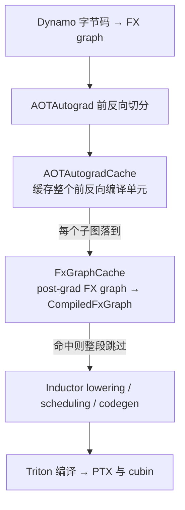
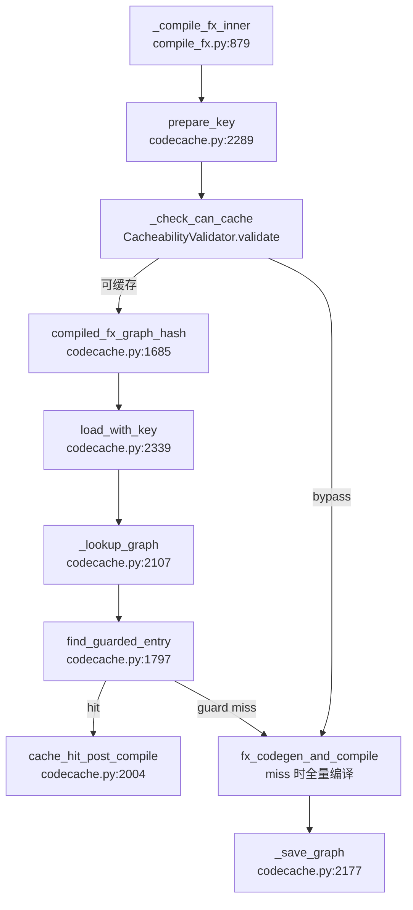

# FxGraphCache — 用「post-grad 图指纹 + 形状 guard」把 Inductor 的 lowering/codegen/Triton 编译整段省掉

> [!note] 页面角色与审计状态
> **页面角色**：Inductor post-grad FX graph artifact cache 的 key、guarded multi-entry、bypass 与产物恢复专题；它不与 Dynamo PGO 的决策画像或 AOTAutograd result cache 混为一层。
> **原始基线**：PyTorch `3bda74318624581502db16e6439c36effdb16481`；**当前审计基线**：PyTorch `e8f97c1a6ef8cbcdd0a946606bc1e924e4f07e52`。
> **审计状态**：已纳入历史 manifest，但结构 inventory 尚未升级为逐 claim 当前基线复核，cache hit/bypass 也未在本轮环境端到端重跑。图阶段与产物身份见 [[20_graph_stage_boundaries_identity_and_provenance_analysis]]，生成 kernel/wrapper 与 provenance 见 [[codegen_kernel_mapping_autotuning_and_provenance_analysis]]；缓存领域入口见 [[02_compile_stack/06_compile_cache/index]]。

> **分析对象**：PyTorch Inductor 图级编译缓存 `FxGraphCache`（`torch/_inductor/codecache.py`）——缓存 post-grad FX graph 到编译产物 `CompiledFxGraph`（Python wrapper 代码 + Triton kernels）的映射，命中时跳过 Inductor lowering / codegen / Triton 编译整段。
> **Source baseline**：PyTorch upstream 本地检出 `E:\97-codes\torch_parallel\pytorch` @ branch `main`, commit `3bda74318624581502db16e6439c36effdb16481`（2026-07-10, version 2.14.0a0）。所有 `file:line` 均对该 commit 逐一开文件核验。
> **最后更新**：2026-07-10

本页回答三件事：进 cache key 的**因素精确清单**及其「为什么必须进」；命中路径上 **shape-env guard** 如何在同一 key 的多个 entry 里挑出正确产物；以及**产物序列化 / bypass 约束 / Triton bundling** 的机制。它是 torch.compile 编译缓存里最古老、最核心的一级——上有 [[aotautograd_cache_analysis]]（缓存整个前反向编译单元、复用本页的 `GuardedCache`），旁有 [[triton_autotune_cache_analysis]]（本页只简述的 autotune/远端缓存设施）。总览与目录索引见 [[02_compile_stack/06_compile_cache/index]]。

---

## 一、总览

**一条主线**：`torch.compile` 的编译栈里，Inductor 对一张 post-grad FX graph 做 lowering→scheduling→codegen→Triton 编译，是整个 warm-start 里最贵的一段。`FxGraphCache` 把这段的**输入指纹**（图结构 + 输入 metadata + 全部影响 codegen 的 config/环境）算成一个稳定 hash key，把**输出产物** `CompiledFxGraph`（wrapper 源码 + Triton kernel 产物）序列化到磁盘；下次同 key 命中，直接反序列化 + `PyCodeCache.load_by_key_path` 重建可调用对象，**完全不再跑 lowering/codegen/triton.compile**。

难点有二，本页大半篇幅在讲：① tensor / GraphModule 不能直接 pickle 且含跨进程变化的东西，怎么算出**稳定又安全**的 key（§二、`FxGraphCachePickler` 只取 metadata）；② 动态形状下同一张图对应多套 symbolic 约束，一个 key 会挂多个 entry，靠 **shape-env guard** 在命中时挑对的那个（§三）。

| 概念 | 说明 | 定位 |
|---|---|---|
| `FxGraphHashDetails` | 收集全部进 key 的因素的容器对象 | `codecache.py:1271` |
| `FxGraphCachePickler` | 定制 pickler，tensor 只取 metadata，算出稳定 key | `codecache.py:679` |
| `compiled_fx_graph_hash` | 把 details pickle→hash，返回 `(key, debug_lines)` | `codecache.py:1685` |
| `GuardedCache` | 带 guard 的缓存 mixin（多 entry + `evaluate_guards`） | `codecache.py:1735` |
| `FxGraphCache` | 主类，继承 `GuardedCache[CompiledFxGraph]` | `codecache.py:1915` |
| `CompiledFxGraph` | 缓存的产物对象（磁盘序列化单位） | `output_code.py:495` |
| `CacheabilityValidator` | 集中判定「能不能缓存」，不能就抛 `BypassFxGraphCache` | `codecache.py:1038` |
| `TritonBundler` | 把 Triton 编译产物打包进 cache entry | `triton_bundler.py:92` |

架构位置（谁在谁之下）：



> **对照**：`FxGraphCache` 和 `AOTAutogradCache` 是**两级独立**缓存。当 `bundled_autograd_cache` 打开时，Inductor 侧**不自己存**（`compile_fx.py:971` 把它从 `use_cache` 条件里排除），产物直接交给 AOTAutogradCache 打包——但仍用 `TritonBundler`（`compile_fx.py:1042`）。参见 [[aotautograd_cache_analysis]]。

**Quick Start（最小触发路径 + 从哪读起）**

- 开关：`torch._inductor.config.fx_graph_cache`，默认 `True`（`config.py:109`，OSS 默认开、内部 justknob 控）；强制关全部缓存用 `config.force_disable_caches`。env：`TORCHINDUCTOR_FX_GRAPH_CACHE=1`（force）/ `TORCHINDUCTOR_FX_GRAPH_CACHE_DEFAULT`。
- 入口函数从这里读起：`_compile_fx_inner`（`compile_fx.py:879`）——`use_cache` 判定（`:966`）→ `FxGraphCache.prepare_key`（`:1006`）→ `FxGraphCache.load_with_key`（`:1017`）→ 命中/未命中/bypass 三分支（`:1072/:1099/:1149`）。
- 最小观察：`counters["inductor"]["fxgraph_cache_hit"/"fxgraph_cache_miss"/"fxgraph_cache_bypass"]`（`codecache.py:2367/2384/2313`）；磁盘目录 `<cache_dir>/fxgraph/`（`codecache.py:1950`）。

---

## 二、Cache key 的构成——`FxGraphHashDetails` 与稳定序列化

key 的计算是 details → pickle → hash 三步（`compiled_fx_graph_hash`，`codecache.py:1685`）：

```python
details = FxGraphHashDetails(gm, example_inputs, fx_kwargs, inputs_to_check)   # 收集因素
pickler = FxGraphCachePickler(gm, has_user_defined_triton_kernels)            # 定制序列化
key = pickler.get_key(details)                                               # bytes → hash
```

$$\text{key} = \text{prefix} \,\|\, H\big(\text{pickle}_{\text{stable}}(\text{FxGraphHashDetails})\big)$$

key 带一个前缀字符区分缓存类别（`codecache.py:1698` 注释），落盘时用 `key[1:3]` 作分片子目录（`codecache.py:1957`）。

### 2.1 进 key 的因素清单（`FxGraphHashDetails.__init__`, `codecache.py:1408`）

| 因素 | 取什么 | 定位 | 为什么必须进 key |
|---|---|---|---|
| `gm` | GraphModule（经定制 reducer） | `:1415` | 图结构本身就是编译输入 |
| `example_inputs` | 逐个输入（opaque 换序号） | `:1419–1428` | tensor metadata/symint 决定 codegen（见 2.2） |
| `fx_kwargs` | 排序后的编译 kwargs，去掉 `EXCLUDED_KWARGS` | `:1434–1442` | 如 `cudagraphs`/`is_backward` 改变产物；`graph_id`/`compile_region_name` 是调试标签故排除（`:1280`） |
| 用户自定义 Triton 源码 | kernel 传递闭包源码 + 常量 + configs | `:1455–1492` | node.meta 不进 gm 的 reduce，必须单列，否则改 kernel 体命中旧产物 |
| `default_cuda_device_index` | 仅当无 tensor 输入时 | `:1494–1499` | 无 tensor 输入的图 device 未被 metadata 覆盖 |
| `deterministic_algorithms_settings` | 确定性算法 3 元组 | `:1502–1506` | 影响 lowering 到哪个 cuda kernel |
| `cpp_runtime_thread_count` | 仅 CPU C++ 且线程配置为运行时默认 | `:1512–1517` | C++ kernel 特化线程数，跨线程数不可复用 |
| `provenance_tracking_level` | provenance 级别 | `:1519–1526` | 决定是否把 provenance 数据存进产物 |
| `default_dtype` | `torch.get_default_dtype()` | `:1530` | `dtype=None` 的工厂 op 用环境默认 dtype lower |
| `cuda_matmul_settings` | fp32 precision / reduced-precision 开关 | `:1533–1537` | 影响 matmul codegen |
| `cudagraph_override/annotation` | 仅当 annotation 改变行为 | `:1543–1553` | 前后向 cudagraph 覆盖不同则影响产物 |
| `torch_version` | `torch_key()` | `:1556` | 含 Triton 编译器版本；换 torch/triton 版本旧产物可能不兼容 |
| `system_info` | `CacheBase.get_system()` | `:1557` | 设备/驱动等系统信息 |
| `inductor_config` | `save_config_portable(...)` 全部 config | `:1558` | Inductor 几乎每个 config 都可能改 codegen |
| 各 custom pass | pre/post-grad、joint、fusion、ddp 的 `uuid()` | `:1567–1599` | pass 会改图，必须靠 UUID 进 key |
| `var_to_hint_override` | shape hint 覆盖值 | `:1617–1625` | `_reduce_symint` 只 hash 符号名不 hash hint 值，需补 |

> **对照 config 过滤**：并非所有 config 都进 key。`_cache_config_ignore_prefix`（`config.py:2930`）明确剔除 `trace*`、`compile_threads`、缓存开关本身（`fx_graph_cache`/`fx_graph_remote_cache`）、`cudagraph_policy`（只影响 post_compile 不影响产物）等——这些改了不该让 cache 失效。

### 2.2 为什么每个因素必须进（两个反例）

- **反例 A：若不 hash `default_dtype`**。工厂 op（如 `torch.ones(...)` 带 `dtype=None`）会用当前默认 dtype lower（`codecache.py:1528–1530` 注释）。先在 float32 默认下编译存了产物，用户切到 `torch.set_default_dtype(float64)` 后同一张图 key 不变→命中 float32 产物→**数值/dtype 全错**。所以 `default_dtype` 必须进 key。
- **反例 B：若不 hash custom pass 的 UUID**。post-grad custom pass 会重写图（`codecache.py:1571`）。用户改了 pass 逻辑但图/输入不变，key 不变→命中未经新 pass 处理的旧产物→**优化/正确性丢失**。所以每个 pass 靠 `uuid()` 进 key（`_get_custom_pass_detail`，`:1654`），拿不出 UUID 的 pass 直接 bypass（见 §五）。

### 2.3 `FxGraphCachePickler`——把不可稳定 pickle 的东西变成稳定 key（`codecache.py:679`）

普通 `pickle` 不行：tensor 含跨 run 变化、且大 tensor 不该整份进 key。定制 pickler 用 `dispatch_table` 换掉几类对象的 reducer（`codecache.py:711–724`）：

- **FakeTensor / Tensor**：`_reduce_fake_tensor`（`:781`）与 `_reduce_tensor`（`:794`）只取 `extract_tensor_metadata_for_cache_key`——**只留 metadata（dtype/shape/stride/device...），且抹掉 `storage_offset`/`storage_bytes`**（`codecache.py:625–634`，除非 tensor 被标 `_is_inductor_static`）。为什么抹：storage 偏移是运行时地址级细节，不影响 codegen，进 key 只会白白降低命中率。这个 `_is_inductor_static` 标记由 `_compile_fx_inner` 在缓存查询前给「GPU 上的 static input」打上（`compile_fx.py:988–994`）——static 输入（如 cudagraph 固定地址的参数）的 storage 布局**会**影响产物，故对它们保留 offset 进 key。
- **常量 tensor**：若是挂在 GraphModule 上的常量且可 inline（`is_frozen_param` 且 `can_inline_constant`），则**连值一起 hash**（`TensorMetadataAndValues`，`:830`）——因为常量值会被烧进生成代码，值变了产物就得变；否则只取 metadata。
- **SymInt / SymBool**：`_reduce_symint`（`:832`）/`_reduce_symbool`（`:841`）**只 hash 符号名字符串**，不 hash 具体 backed 值——具体值靠 §三的 guard 在命中时校验，这样一张动态图不同具体值能共享同一 key。
- **用户自定义 Triton kernel 的 GraphModule**：仅当图里有 user-defined triton kernel 时才注册 `_reduce_graph_module`（`codecache.py:725–729`），它把生成代码里的 `kernel_idx = N`/`constant_args_idx = N` 用正则抹掉（`:870–871`）。为什么：这些数字是 dynamo 侧表的索引，会因 ordering 抖动而给出**假不命中**；kernel 真正的源码已经通过 §2.1 的 `user_defined_triton_source` 进了 key（`:859–866` 注释）。
- **不可 pickle 的类型**：`reducer_override`（`:736`）探测能否默认 pickle，不能则用 `_get_stable_obj_key` 生成确定性字符串（如 pybind11 enum，`:651`）；连这也失败就抛 `BypassFxGraphCache`（`:775`）。
- `pickler.fast = True`（`:733`）关字符串 interning 让结果更可预测（对含 opaque 自定义类的 FakeScriptObject 会临时关掉 fast 以正确处理循环引用，`:889–893`）；调试用 `debug_lines`（`:930`）逐字段打 hash，用来定位「两张本该相同的图为什么 hash 不同」。

---

## 三、命中路径与 guard 处理——一个 key 多个 entry

**为什么图级缓存还需要 guard**：§2.3 里 SymInt 只 hash 名字，所以「同一张图、不同 symbolic 约束（如 `s0>=16` vs `s0` 任意）」会**落到同一个 key**。这些约束下 Inductor 会生成**不同**的产物（不同 tiling / 特化）。于是同一 key 目录下挂**多个 entry**，每个带自己的 `guards_expr`，命中时逐个用当前 shape-env 的 hint 求值，第一个通过的就是命中（`FxGraphCache` 类 docstring，`codecache.py:1932–1938`）。

> **被否掉的替代方案**：最直白的做法是把 symint 的**具体值**烧进 key（这样根本不需要 guard），但源码刻意不这么做——`_reduce_symint` 注释明写「we only care about the name of the symbol and not the backed value」（`codecache.py:836`）。原因：动态形状下每个不同 batch size 都会变成一个不同 key、各自触发一次「编译 + 落盘」，动态图的复用价值荡然无存。用「名字进 key + 值靠 guard 命中时校验」把 key 空间收敛到「图 × 约束集」而非「图 × 每个具体值」，才是 guard 机制存在的根本理由。

### 3.1 `GuardedCache` mixin（`codecache.py:1735`）

2025-04-22 抽出来给 AOTAutogradCache 复用（commit `a4fdae5c`，"Lift guard checking logic to AOTAutogradCache"）。核心是 `find_guarded_entry`（`:1797`）：

```python
for candidate, content, in_local in cls.iterate_over_candidates(local, remote_cache, key):
    if not candidate.guards_expr:            # 无 guard → 直接命中
        graph = candidate; result_status = "hit"; break
    hit = bool(evaluate_guards(candidate.guards_expr, hints))   # 用 hint 求值,不污染当前 env
    if hit:
        graph = candidate; result_status = "hit"; break
    else:
        result_status = "guard_miss"          # 该 entry guard 不满足,继续下一个
```

`iterate_over_candidates`（`:1755`）遍历本地 `<key>/` 目录下所有叶子文件（跳过 `.` 开头的并发写临时文件，`:1766`），再看 remote。**关键设计**：guard 用 `hints`（具体整数）求值而非 symbol，避免命中判定过程往当前 shape-env 里塞新 guard（`:1843–1846` 注释）。

### 3.2 真实调用链（每一跳 file:line）



逐跳：

1. `_compile_fx_inner`（`compile_fx.py:879`）算 `use_cache`（`:966`），调 `FxGraphCache.prepare_key`（`:1006`）。
2. `prepare_key`（`codecache.py:2289`）先 `_check_can_cache`（`:2308`）——不可缓存则抛 `BypassFxGraphCache`、返回 `cache_state="bypass"`、`fxgraph_cache_bypass` 计数 +1（`:2313`）；否则算 `compiled_fx_graph_hash` 得 key。
3. `load_with_key`（`codecache.py:2339`）→ `_lookup_graph`（`:2107`）：取 shape-env（`:2126`，无则 assert）、过滤 backed symint 取 hints（`:2130`）；`unsafe_skip_cache_dynamic_shape_guards` 打开时把 `evaluate_guards` 短路成恒真（`:2137`），否则用 `shape_env.evaluate_guards_expression`（`:2140`）。
4. `find_guarded_entry`（`:2145`）挑 entry；命中后还要校 `extern_libs_key`（如 libdevice）是否匹配当前环境，不匹配当 `guard_miss`（`:2152–2161`）。
5. **命中后再用真 symint 复评一次 guard**（`:2168`），把该产物依赖的 guard**加进当前 shape-env**（`assert check is True`, `:2170`）——这样后续 dynamo 层的 guard 体系知道这份缓存产物的约束。这一步的必要性见 `FxGraphCache` docstring `:1939`「on a cache hit, we need to make sure any guards that would have been created during compilation are added to the current context」。
6. `cache_hit_post_compile`（`:2004`）：先 `TritonBundler.read_and_emit` 把打包的 triton 产物落地（`:2018`），再 `graph.after_deserialization(constants)` 重建 callable（`:2035`），最后重放 metrics/counter deltas（`:2056`）、发 `trace_structured` 产物。
7. miss → `fx_codegen_and_compile` 全量编译（`compile_fx.py:1109`）→ `_save_graph`（`:1141`）落盘。

> **注意（第二个 guard 维度）**：命中校验不止 shape guard。`_lookup_graph` 在 shape guard 通过后还比对 `extern_libs_key`（`codecache.py:2153–2161`）——它在 `_save_graph` 时由当前 Triton backend 的 extern libs（如 libdevice）算出（`:2228–2231`）。若加载环境的 extern libs 与产物记录的不一致，即使图和形状都对也判 `guard_miss` 重新编译。这是「同图同形状、但底层数学库变了」的正确性兜底，独立于 symbolic 约束。

---

## 四、产物 `CompiledFxGraph` 与序列化

`CompiledFxGraph`（`output_code.py:495`）是磁盘序列化单位。字段分两类：**可序列化的编译结果**与**运行时重建的 callable**。

- **可序列化**：`cache_key`、`source_code`（wrapper 源码，从 `graph.cache_path` 读入，`output_code.py:582`）、`cache_linemap`、`device_types/idxs`、`mutated_inputs`、`constants`（+ 冻结参数名映射 `frozen_param_names`）、`output_strides`、`guards_expr`、`extern_libs_key`、`metrics_deltas`/`counter_deltas`、`_triton_bundle` 等（字段定义 `output_code.py:501–551`）。
- **运行时重建（不进磁盘）**：`current_callable`、`recursively_apply_fns`、`compiled_fn_runner`、`_compile_context`——`prepare_for_serialization`（`output_code.py:978`）在 pickle 前把它们统统置 `None`，理由是「不能序列化可能是 C++/Triton 的 callable，只序列化它们的 PyCodeCache 磁盘位置」（`:979` 注释）。

**为什么这样切**：产物的可执行体是编译出来的 Python module（`.py` wrapper + Triton kernel），本身在 `PyCodeCache` 有自己的磁盘 cache。cache entry 只需存**源码 + 重建所需 metadata**；命中时 `after_deserialization`（`output_code.py:1010`）把源码写回磁盘（`write_to_disk`，`:997`），再 `PyCodeCache.load_by_key_path` 载出 module，把 `current_callable` 接回来（`:1027`）。

**冻结参数的特殊处理**（`output_code.py:597–613`）：有冻结参数时不直接存常量值，而存「GraphLowering 里的名字 → GraphModule 原始属性名」的映射，命中时从当前 GraphModule 查回常量——正是这个 scheme 才让「freezing + caching」在受控条件下能共存（默认仍 bypass，见 §五）。

**`post_compile` 重建运行时状态**（`output_code.py:821`）：无论命中与否都跑一次，重建**不进 cache 的运行时状态**——设置 tracing context 的 output strides、按需 `cudagraph_post_compile`/`cudagraph_partition_post_compile` 重新捕获 cudagraph（`:915`/`:907`）、`maybe_realign_inputs` 对齐输入（`:925`）、必要时从 `_serialized_original_gm` 反序列化出用于 fake propagation 的原始图（`:932`）。cudagraph 是运行时对象，绝不可能进磁盘 cache，只能这样在加载后重建。

**磁盘目录布局**：

```
<cache_dir>/fxgraph/            _get_tmp_dir()            codecache.py:1950
  └─ <key[1:3]>/                两字符分片(key[0] 是类别前缀)  codecache.py:1957
       └─ <key>/                同一 key 下挂多个 entry
            ├─ <sha256(content)>   一个 guard 版本 = 一个文件   codecache.py:2186
            └─ <sha256(content)>   另一套 guard 的同 key 产物
```

写盘走 `write_atomic`（`_write_to_local_cache`，`codecache.py:2178`），文件名用产物内容的 sha256，因为 lookup 是遍历整个 `<key>/` 目录，文件名本身不参与匹配（`:2183` 注释）。

**写入时的 CacheArtifact 记录**：`_save_graph` 在写盘前先 `CacheArtifactRecorder(...).record(content)`（`codecache.py:2247`），把这份 bytes 也登记进 `InductorCacheArtifact`（`codecache.py:1902`）。它的 `populate_cache` 会 `_write_to_local_cache` + `_emit_triton_bundle`（`:1905–1907`）——这是 Mega-cache「一次编译、打包全部 artifact、异地整包重放」的挂钩点；其独立当前基线审计尚未完成。

### 4.1 TritonBundler——把 Triton 产物打包进 entry

**动机**：即便 FxGraphCache 命中拿回了 wrapper 源码，若 Triton kernel 的编译产物（cubin 等）不在，warm start 仍要重跑 `triton.compile`（很贵）。`TritonBundler`（`triton_bundler.py:92`）在编译期记下每个编译过的 Triton kernel，`collect`（`:265`）把**获胜的 autotune config** 对应的 kernel 产物打包成 bytes 塞进 `CompiledFxGraph._triton_bundle`；命中时 `read_and_emit`（`codecache.py:2018`）把它们写回 Triton 的 cache 目录，于是连 triton.compile 都省了。

- 开关 `bundle_triton_into_fx_graph_cache`（`config.py:125`），OSS 默认 `True`（`config.py:45–49`）；`is_enabled` 还受 `force_disable_caches` 影响（`triton_bundler.py:120`）。
- 只打包**获胜 config**（`collect` `:285–295`，靠 `put_winner` 标记）——autotune 会编很多候选 kernel，只有胜者进产物，避免 entry 膨胀。
- 该机制 2024-10-31 引入（commit `69ea2e72`，"Consolidate Triton cache into Inductor cache" #138239），与本页 §六的远端缓存同源，细节属 [[triton_autotune_cache_analysis]]。

---

## 五、约束 / bypass 条件——`CacheabilityValidator`

`_check_can_cache`（`codecache.py:2269`）委托给 `CacheabilityValidator.validate`（`codecache.py:1038/1053`）。任一条件不满足即 `bypass(reason)` 抛 `BypassFxGraphCache`（`:1098`），`prepare_key` 捕获后走**不缓存**的编译路径（`compile_fx.py:1072`）。清单：

| bypass 条件 | 触发点 | 定位 | 为什么（源码理由） |
|---|---|---|---|
| 不可缓存的 HigherOrderOperator | `target.cacheable()` 为假 | `:1069–1075` | HOP 语义无法保证可安全缓存 |
| torchbind / ScriptObject 常量 | `get_attr` 指向 `ScriptObject` | `:1081–1084` | torchbind 对象不可序列化 |
| 不支持的 custom pass | pass 非 `CustomGraphPass` 或无 `uuid()` | `:1115–1147` | 无 UUID 无法进 key，缓存不安全（§2.2 反例 B） |
| **冻结常量（freezing）** | `has_frozen_params(gm)` 且 justknob 未放行 | `:1149–1154` | freezing 会烧入跨 run 不稳定的常量 |
| runtime constant folding | `aot_inductor.use_runtime_constant_folding` | `:1156–1161` | 会引入跨 run 非静态常量 |
| compiler bisector | `CompilerBisector.bisection_enabled` | `:1163–1168` | 二分调试时不能命中缓存 |
| 无 shape env | `require_shape_env` 且 `shape_env is None` | `:1170–1175` | guard 处理（§三）依赖 shape env |
| mkldnn tensor | `t.is_mkldnn` | `:1092–1095` | mkldnn tensor 当前不可 pickle |
| BackwardState | 输入含 `BackwardState` | `:1193–1194` | reduce 不支持 |
| 序列化 pickle 失败 | pickle key 抛错 | `:1101–1107` | 算不出稳定 key |

> **注意**：`_pre_fusion_custom_pass`/`_post_fusion_custom_pass`/`_fuse_ddp_communication_passes` 是「有时可缓存」的灰色地带——是字符串名就能安全缓存，是裸 callable 就 bypass（`_get_custom_pass_detail_unsafe` 返回 `None`，配合 `_check_custom_passes` 在 `:1139–1147` 拒绝，`codecache.py:1627–1636` 注释解释了这个权宜）。

开关层面：`config.fx_graph_cache`（`config.py:109`，Config 对象，justknob `enable_local_fx_graph_cache` + env `TORCHINDUCTOR_FX_GRAPH_CACHE`）；`config.force_disable_caches` 一键全关（`compile_fx.py:967`）。

---

## 六、本地 / 远端两级

`_lookup_graph`/`_save_graph` 同时接受本地目录与 `remote_cache`（`codecache.py:2112/2204`）。远端接入点：

- `config.fx_graph_remote_cache`（`config.py:122`）：`None`=OSS 关、内部 justknob；env `TORCHINDUCTOR_FX_GRAPH_REMOTE_CACHE`（`config.py:25`）。
- `FxGraphCache.get_remote_cache`（`codecache.py:2326`）：cache id `"fx-graph-v1"`，OSS 用 `RemoteFxGraphCache`、内部 `FbRemoteFxGraphCache`（`create_cache`，`:2332`）。
- 读顺序：`iterate_over_candidates`（`:1755`）先本地目录、后 remote；写时 `_save_graph` 本地写文件、remote 写 base64 编码的同一 bytes（`:2252–2258`）。remote 命中意味着 local miss（`find_guarded_entry` 的 `_record_result` 统计逻辑，`:1863–1875`）。

远端缓存基础设施（`RemoteCache` 后端、bundled autotune remote cache 等）细节属 [[triton_autotune_cache_analysis]]，本页只标接入点。

---

## 七、进展时间线与收益

**关键节点**（git 核验，日期=commit date）：

| 日期 | commit | 事件 |
|---|---|---|
| 2023-10-08 | `8a8668e1aea` | FxGraphCache 引入（PR #103453，"Implement Fx graph caching to improve warm compilation time"） |
| 2024-10-31 | `69ea2e726c2` | TritonBundler + `bundle_triton_into_fx_graph_cache` 引入（PR #138239，"Consolidate Triton cache into Inductor cache"） |
| 2025-04-22 | `a4fdae5c84e` | `GuardedCache` 抽象化，guard 校验逻辑上提给 AOTAutogradCache 复用（PR #151563） |

（时间线用 `git log -S` + `git show -s` 核验；引入 PR 标题即源码给出的收益陈述——「improve warm compilation time」。）

**收益结论**：命中时省掉 **Inductor lowering / scheduling / codegen / `triton.compile`** 整段（`FxGraphCache` docstring `codecache.py:1919–1941` 描述的正是这条「fetch from disk 后 recreate compiled artifact」路径），只剩反序列化 + `PyCodeCache.load_by_key_path` + `post_compile` 运行时重建。命中省下的时间被记进 `_time_taken_ns`（`load_with_key` `:2370`），甚至用来临时抬高分布式 NCCL timeout（`add_ephemeral_timeout_increase_for_distributed`, `:2377`），可见「省了多少编译时间」是被显式度量并利用的。

> **推断（非源码明述）**：由于 §四把 Triton 产物一并 bundle 进 entry，warm start 的净开销主要落在磁盘 IO + PyCodeCache 载入 + cudagraph 重捕获，而非编译本身；具体加速比取决于图规模与 kernel 数，源码未给固定数字。

---

## Related Pages

- [[19_torch_compile_end_to_end/00_pytorch_graph_series_index]] — 当前固定基线的图编译系统化课程入口
- [[02_compile_stack/06_compile_cache/index]] — 编译缓存总览（本页是其最核心一级）
- [[aotautograd_cache_analysis]] — 上层缓存，复用本页 `GuardedCache`；`bundled_autograd_cache` 下 Inductor 不自存
- [[triton_autotune_cache_analysis]] — Triton bundling / 远端缓存设施细节
- [[dynamo_pgo_cache_analysis]] — Dynamo 侧 PGO 缓存
- Mega-cache / precompile：尚未完成独立当前基线审计
- [[02_compile_stack/06_compile_cache/index]] — 本目录索引
- [[20_graph_stage_boundaries_identity_and_provenance_analysis]] — post-grad FX、Inductor artifact 与跨阶段 identity 边界
- [[codegen_kernel_mapping_autotuning_and_provenance_analysis]] — 被缓存复用的 kernel/wrapper 与 provenance 产物
- [[torch_compile_architecture]] — torch.compile 整体栈
- [[inductor_autotuning_analysis]] — autotune 生命周期（获胜 config 即 TritonBundler 打包对象）
- [[02_compile_stack/04_inductor/index]] — Inductor lowering/codegen（命中时被跳过的那段）
- [[20_symbolic_shapes_guards_and_graph_reuse_analysis]] — 动态形状与 guard（§三 guard 校验的上游）
- [[11_aotautograd_joint_forward_backward_graphs_analysis]] — AOTAutograd 前反向切分
