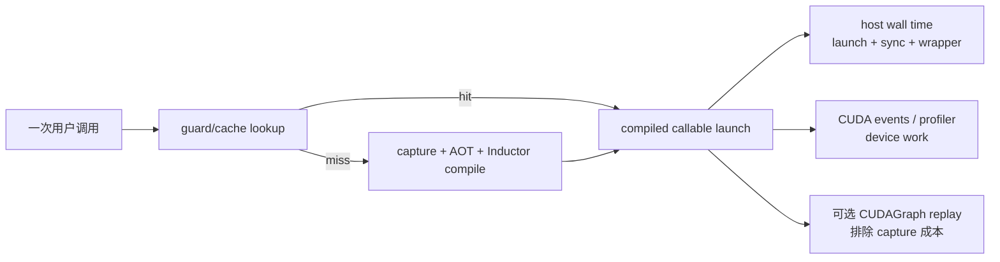

# E07 · Compile Latency、Cache 与 Steady-State 性能

> 卷别：E · 调试、正确性与性能  
> 固定源码：PyTorch `e8f97c1a6ef8cbcdd0a946606bc1e924e4f07e52`  
> 前置：[[compiled_correctness_validation_methodology_analysis]]  
> 后续：[[kernel_fusion_memory_and_hardware_performance_analysis]]  
> 最后更新：2026-07-30(§12-16 并入 A05 独有的细粒度成本模型/dynamic·mode 权衡/四层缓存对照内容;§1 补注旧页无源加速数字的弃置说明,使例外在页面本身可见,不止存于 changelog)

## 1. 为什么一个“平均耗时”没有诊断价值

`torch.compile`把成本分布到多个时点：

- wrapper创建；
- 首次frame capture；
- Dynamo、AOT、Inductor编译；
- native/Triton编译与module load；
- lazy backward compile；
- runtime autotune；
- CUDAGraph warmup/record；
- 稳态guard、wrapper与kernel/replay。

如果把这些轮次平均，既看不出冷启动SLO，也看不出稳态吞吐，更无法判断cache是否有效。

> 注:曾有旧页(PyTorch_Dynamo_Technical_Analysis,已删)给出"2-3x/4x/1.5-2x"类平均加速数字,无源且正属本节所批评的口径,整改时按记录弃置(见 changelog 2026-07-30 条),未作 [!todo] 保留。

## 2. 五个必须分开的测量场景

### 2.1 Eager baseline

同一输入语义、相同精度和同步边界下的eager延迟/吞吐。

### 2.2 Cold compile

干净进程、目标cache层按实验定义为空、设备context状态明确。测量从首次调用到结果可用。

### 2.3 Warm process / cold specialization

进程与toolchain已初始化，但输入触发新的Dynamo specialization。用于观察真实shape流量的
增量编译成本。

### 2.4 Disk/remote cache hit

新进程复用持久化artifact。仍包含key/guard、deserialize、module load、post-compile和可能
的first-call runtime工作。

### 2.5 Steady state

guards命中、所有lazy工作完成、无意外recompile。按稳定窗口报告分位数和吞吐。

## 3. 时间分解

\[
T_{\text{cold}} =
T_{\text{wrapper}}
+T_{\text{Dynamo}}
+T_{\text{AOT}}
+T_{\text{Inductor}}
+T_{\text{native}}
+T_{\text{load}}
+T_{\text{first-runtime}}
\]

\[
T_{\text{steady}} =
T_{\text{guard}}
+T_{\text{wrapper-runtime}}
+T_{\text{kernel/replay}}
+T_{\text{sync-visible}}
\]

训练还需：

\[
T_{\text{first-step}} =
T_{\text{fw-compile/run}}
+T_{\text{lazy-bw-compile/run}}
+T_{\text{optimizer}}
\]

若只计forward，会把lazy backward compile移到“第二阶段”，形成错误的冷启动结论。

## 4. 源码提供哪些阶段指标

`CompilationMetrics`同时记录frame、backend、Inductor、codegen时间，以及runtime
CUDAGraph、Triton autotune和backward累计编译时间
（`torch/_dynamo/utils.py:1581-1605`、
`torch/_dynamo/utils.py:1613-1635`）。

记录函数把同一事件标记为forward/backward/runtime，并用 `compile_id` 关联结构化日志
（`torch/_dynamo/utils.py:2013-2037`）。

这些字段适合阶段归因，但端到端用户延迟仍应在调用边界测量，因为：

- Python wrapper与排队可能不全在单个timer内；
- 设备执行异步；
- 多线程/多进程等待会跨context；
- 日志本身有扰动。

## 5. Cache 实验必须定义清理范围

不同“清cache”可能只清：

- Dynamo code entries；
- 进程内GraphModule/module/future；
- AOTAutograd cache；
- FX graph local/remote cache；
- generated source/native binary；
- Triton/autotune cache；
- CUDAGraph runtime tree；
- allocator/device context。

因此报告不得只写“清了cache”，而要列出清理层、进程是否重启、disk/remote是否保留。

Inductor会把部分metrics delta写入FX cache并在hit时恢复；这些字段包括kernel count、
fusion前IR node和估算bytes
（`torch/_inductor/metrics.py:101-124` 与
`torch/_inductor/metrics.py:127-140`）。所以metric恢复不代表本进程重新生成了这些kernel。

## 源码跟读：从计时 context 到 CUDA steady-state 样本

### 1. compile-time指标是嵌套事件，不是一次总秒表

`dynamo_timed`同时服务五类消费者：PT2 compile events、CompilationMetrics、Chromium
events、wait counter 与进程内 `compilation_time_metrics`
（`torch/_dynamo/utils.py:726-755`）。`key`与可选 `phase_name`分别承担明细函数名和阶段事件
名；`compile_id`/`is_backward`让 runtime autotune或 lazy backward 也能归属到正确编译
（`torch/_dynamo/utils.py:757-778`）。

进入 context 时记录 `time.time_ns()`并启动事件
（`torch/_dynamo/utils.py:779-808`）；退出在 `finally`中无论成功失败都追加秒数、结束事件，
并把嵌套阶段累计到 microsecond 字段
（`torch/_dynamo/utils.py:830-860`;
`torch/_dynamo/utils.py:861-870`）。所以：

- 一个 key 可以有多次 specialization 样本；
- nested阶段之和可能与 wall time重叠，不能盲目相加；
- 异常编译仍有 duration，不能因没有 callable 就把时间删掉；
- forward、backward、runtime autotune必须靠 compile context/字段拆开。

`compile_times(aggregate=False)`保留同 key 的多次值，`aggregate=True`才求和
（`torch/_dynamo/utils.py:884-920`）。只看 aggregate 会看不到第几次调用发生了重新捕获。

### 2. 结构化CompilationMetrics怎样保留失败与阶段归属

metric schema分别保存 entire frame、backend、Inductor、codegen、Triton、CUDAGraph、
runtime autotune与 backward累计时间
（`torch/_dynamo/utils.py:1581-1605`;
`torch/_dynamo/utils.py:1613-1635`）。写入时从 metrics context取得 compile ID，并把异常类型、
原因、配置与版本一起封装
（`torch/_dynamo/utils.py:1984-2013`）；随后根据 backward/runtime状态选择事件名并发出
structured log（`torch/_dynamo/utils.py:2013-2037`）。

这就是测量表必须带 `compile_id / is_forward / is_runtime / cache state / status`的源码依据。
只有 duration 没有身份字段时，cold compile、lazy backward 与 runtime autotune会被混成一个
无法解释的数。

### 3. cache hit恢复metric，不等于重新执行编译

`CachedMetricsHelper`在 cache entry生成前后取部分全局 metric差值；cache hit时
`apply_deltas`把这些历史差值加回当前进程计数
（`torch/_inductor/metrics.py:120-142`）。因此 hit 后看到
`generated_kernel_count`或 `ir_nodes_pre_fusion`增加，只能说明 cache artifact携带并恢复了
编译结果统计，不能证明本进程刚生成 kernel。

判断 cold/warm/hit必须同时观察 cache lookup、compiler调用次数、artifact mtime/identity 与
阶段计时，不能拿单一累积 counter下结论。

### 4. host wall time与device execution time是两种测量

PyTorch内部简单的 `timed` helper会在计时前以及每轮调用后执行 accelerator synchronize
（`torch/_dynamo/utils.py:2839-2855`）；Inductor版本同样在 loop前后按 device同步
（`torch/_inductor/utils.py:715-738`）。这类 wall time包含 Python launch与同步开销，适合
端到端 steady-state latency，不等于纯 kernel duration。

Inductor CUDA profiler路径先用 CUDA Event估算单次时间，据此决定 warmup/repeat次数，再为
每次样本记录 start/end events并同步读取 elapsed time
（`torch/_inductor/utils.py:257-280`;
`torch/_inductor/utils.py:280-299`）。runtime benchmark抽象还明确区分 CPU median loop 与
GPU benchmark；CUDAGraph模式先 side-stream warmup/capture，再只 benchmark
`cuda_graph.replay`（`torch/_inductor/runtime/benchmarking.py:318-350`;
`torch/_inductor/runtime/benchmarking.py:358-398`）。



因此本篇五个测量场景不能共用一列“latency”：cold compile看编译事件，cache hit看 lookup与
artifact复用，steady state同时报告 host wall与device分布，CUDAGraph还要把 capture和
replay分开。

## 6. 正确计时异步设备

设备kernel launch通常异步。计时应：

- 在窗口前排空先前工作；
- 在窗口后等待结果真正完成；
- 不把每个kernel都强制同步而改变执行形态；
- 区分host latency与device elapsed time；
- 固定stream和并发负载策略；
- 预热allocator、library handle和频率状态。

同步的位置是测量契约的一部分。只围住Python函数而不等待device，得到的可能只是launch
开销。

## 7. Break-even 分析

设eager每次成本 \(E\)，compiled稳态成本 \(C\)，一次性冷启动成本 \(K\)，要求 \(E>C\)：

\[
N_{\text{break-even}} =
\left\lceil\frac{K}{E-C}\right\rceil
\]

若有多个specialization \(s\)：

\[
K_{\text{total}}=\sum_s K_s,\qquad
N_s \text{ 必须足以摊销 }K_s
\]

生产价值应按真实shape频率加权。一个只出现一次的长尾shape即使稳态很快，也可能永远无法
摊销编译成本。

## 8. 推荐结果表

| 场景 | 进程/cache | 调用 | 应报告 |
|---|---|---|---|
| eager | 新进程 | 多轮 | p50/p95/吞吐/显存 |
| cold compile | 全冷 | 首个完整step | 总时延与各阶段 |
| new specialization | warm进程 | 首次新shape | recompile原因与增量成本 |
| persistent hit | 新进程/保留artifact | 首次调用 | key/load/post-compile/first runtime |
| steady | warm且guard hit | 稳定窗口 | p50/p95/p99/吞吐 |

训练额外报告forward、backward、optimizer和端到端step；分布式额外报告最慢rank与同步等待。

## 9. 统计设计

- 编译延迟通常长尾，应报告分位数和最大值；
- 冷启动用多个独立进程样本，而不是同进程重复；
- 稳态剔除轮次必须基于状态证据，不是固定“前5次”；
- 同时记录compile id/recompile count；
- 吞吐测试固定并发、batch和队列；
- 性能比较先通过正确性；
- 版本、配置、频率和后台负载固定。

## 10. 成本模型

对 \(N\) 次调用、\(S\) 个specialization：

\[
T_{\text{compiled,total}}
=\sum_{s=1}^{S}K_s+\sum_{i=1}^{N}C_i
\]

空间成本：

\[
M_{\text{total}}
=M_{\text{code cache}}
+M_{\text{runtime modules}}
+M_{\text{allocator}}
+M_{\text{CUDAGraph pools}}
\]

速度收益不能脱离cache容量、编译CPU、disk IO和device reserved memory评估。

## 11. 常见误解

- **“第一次调用就是compile time。”** 还可能包含load、autotune、record和实际执行。
- **“第二次调用就是steady state。”** lazy backward或CUDAGraph可能尚未完成。
- **“disk hit等于0编译开销。”** 仍有load/post-compile/first-runtime。
- **“kernel time下降就代表端到端加速。”** guard、wrapper、通信和队列可能主导。
- **“平均值足够。”** 编译与线上延迟常是长尾分布。
- **“dynamic一定减少总成本。”** 它减少 specialization 但可能增加通用 graph/kernel 成本。
- **“max-autotune一定提高端到端性能。”** 候选测量增加 compile 成本，收益依 workload 和调用次数。

## 12. 跨调用摊销：参数化多次调用成本模型

> 本节至 §15 内容原属 P4 知识库整改被删除的 A 卷回顾页(`19_torch_compile_end_to_end/a05_eager_capture_compile_and_replay_cost_model_analysis.md`)。它给出的是本页§7-§10 break-even分析的**更细粒度前身**——把"一次性成本"进一步拆成 wrapper/capture/optimization/native-compile/warmup 五个子项，并显式给出 `dynamic`/`mode` 参数如何在这套分解里两头影响成本；本页此前的模型（§3、§10）在跨调用层面只用 \(K_s\)/\(C_i\) 两项概括，未展开到这个粒度，故逐字迁入作为补充视角，不替换已有模型。

对一种输入分布和调用总数 \(N\)，设：

- \(T_w\)：wrapper creation；
- \(T_{g,i}\)：第 \(i\) 次调用的 guard/cache lookup；
- \(T_{c,j}\)：第 \(j\) 个新 specialization 的 capture；
- \(T_{o,j}\)：该 specialization 的 graph optimization/AOT/Inductor；
- \(T_{n,j}\)：native compile/load；
- \(T_{u,j}\)：warmup/record；
- \(T_{r,i}\)：steady runtime wrapper + kernel；
- \(S\)：实际生成的 specializations 数。

总时间可写为：

\[
T_{\text{compiled}}
=T_w
+\sum_{i=1}^{N}(T_{g,i}+T_{r,i})
+\sum_{j=1}^{S}(T_{c,j}+T_{o,j}+T_{n,j}+T_{u,j})
\]

eager 总时间为：

\[
T_{\text{eager}}=\sum_{i=1}^{N}T_{e,i}
\]

只有：

\[
\sum(T_{e,i}-T_{g,i}-T_{r,i})
>
T_w+\sum(T_c+T_o+T_n+T_u)
\]

才在该调用分布和测量窗口内获得净收益。

这是机制推论 `[I]`，不是固定硬件的性能测量。它与本页 §7/§10 的 break-even 模型描述同一件事，区别只是把一次性成本 \(K\) 进一步拆到 wrapper/capture/optimize/native-compile/warmup 五个可分别归因的子项。

## 13. `dynamic` 为什么影响两端成本

公开入口定义三种策略：

- `dynamic=True`：尽量预先生成动态 kernel；
- `dynamic=False`：始终 specialization；
- `dynamic=None`：先静态，检测到变化后尝试更动态。

见 `torch/__init__.py:3175-3181`。

动态 graph可能：

- 减少 \(S\) 和重复 compile；
- 增加 guards/symbolic expressions；
- 限制 specialization-based optimization；
- 使 kernel处理更一般的 shape。

所以动态不是单向“更快”或“更慢”，而是在 compile multiplicity 与每个 graph/kernel
通用性之间交换成本。

## 14. mode 不是性能承诺

当前 public docstring把：

- `default`定义为性能与 overhead 平衡；
- `reduce-overhead`与 CUDA Graph、更多 workspace memory、输入 mutation限制关联；
- `max-autotune`与候选 profiling 和 GPU CUDAGraph默认策略关联。

见 `torch/__init__.py:3192-3210`。

这只是策略含义，不是对任意 workload 的加速保证。`reduce-overhead`不能消除 guard；
`max-autotune`会增加 compile-time measurement；CUDAGraph也要求 runtime invariants。

## 15. 四种常被混淆的“缓存命中”

| 命中层 | 跳过的工作 | 仍可能发生 |
|---|---|---|
| Dynamo code cache | frame重新捕获与 backend callback | guards、wrapper/runtime |
| AOTAutograd cache | functionalization/joint/partition/compile result | 外层 Dynamo 与 runtime |
| FXGraph/code cache | Inductor部分 lowering/codegen/native compile | AOT、load、runtime |
| kernel/autotune cache | candidate编译或重新测量 | wrapper、launch、其他 kernels |

这张表与本页 §5 的清单是同一件事的两种切面：§5 按"清 cache 要清哪些层"组织，此表按
"命中这一层跳过什么、仍会发生什么"组织；诊断"为什么这次调用还是慢"时按此表逐层排查
比只看一个笼统的 cache-hit 布尔值更准确。

## 16. 复杂度的主导参数（覆盖到 backend/codegen 阶段）

本页 §4 的 `CompilationMetrics` 覆盖 frame/backend/Inductor/codegen 各阶段的**实测**耗时字段；这里补充每个阶段成本**由什么主导**，用于解释这些字段为什么会漂移：

- wrapper creation：与 option/backend setup相关；
- Dynamo lookup：与 cache entries和 guard expressions相关；
- capture：与解释 instructions、inline calls、operator数量相关；
- graph passes：与各阶段 Node/Edge/candidates相关；
- codegen/native compile：与 kernels、source size、toolchain相关；
- autotune：与 candidates × repetitions × measurement cost相关；
- replay：与 guards、wrapper operations、kernel/extern workload相关；
- dynamic workload：还要乘实际 specializations \(S\)。

“模型有 \(N\) 个 FX nodes，所以 compile是 \(O(N)\)”不足以描述整条路径。

## 配套 Demo

本页对应卷级入口 `tools/labs_torch_compile/demo_e_diagnostics.py` 的 `cold_warm_steady` 用例。默认以 CUDA 为验收设备：

```powershell
python -B tools\labs_torch_compile\demo_e_diagnostics.py `
  --case cold_warm_steady --device cuda `
  --output-dir tools\labs_torch_compile\artifacts\volume_demos\e07
```

先用 `--list --json` 查看用例声明的能力要求。无 CUDA 的机器可把 `--device` 改为 `cpu` 探索设备无关机制；CUDA/Triton/多卡专属用例会返回 `BLOCKED`，且不会执行用例正文。不要把 `BLOCKED` 写成 `PASS`。

重点读取 `summary.json` 与 `cold_warm_steady/result.json`：`status` 区分 `PASS/BLOCKED/FAIL`，`environment` 固化运行环境，`observations` 保存本页机制的实测字段，`artifacts` 指向图代码、日志、trace 或进程证据。`PASS` 只表示该次运行中的断言通过，不外推到其他 PyTorch 版本、shape、dtype 或硬件。

## Related Pages

- [[00_torch_compile_end_to_end_index]]
- [[02_compile_stack/06_compile_cache/index]]
- [[compiled_artifact_lifecycle_and_runtime_failures_analysis]]
- [[compiled_correctness_validation_methodology_analysis]]
- [[kernel_fusion_memory_and_hardware_performance_analysis]]
- [[production_rollout_fallback_and_monitoring_analysis]]
