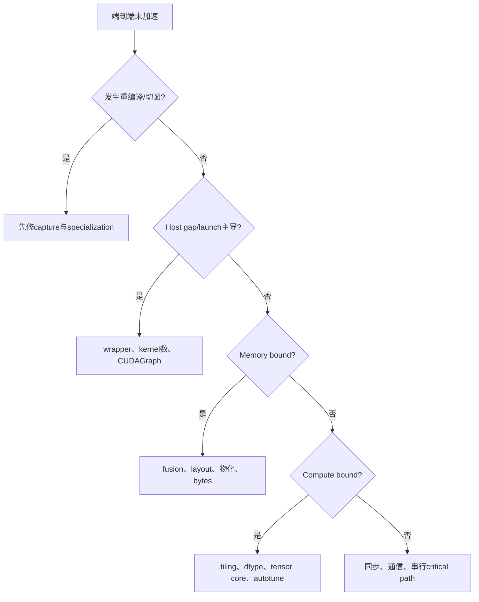

# E08 · Kernel、Fusion、Memory 与 Hardware 性能归因

> 卷别：E · 调试、正确性与性能  
> 固定源码：PyTorch `e8f97c1a6ef8cbcdd0a946606bc1e924e4f07e52`  
> 前置：[[compile_latency_cache_and_steady_state_performance_analysis]]  
> 后续：[[production_rollout_fallback_and_monitoring_analysis]]  
> 最后更新：2026-07-28

## 1. 为什么“kernel少了”不等于“更快”

fusion可能减少：

- launch次数；
- 中间buffer写回与读取；
- Python/wrapper调度；
- allocator活动。

但也可能增加：

- register pressure；
- shared memory；
- 单kernel工作集；
- 同步/依赖；
- 编译与autotune成本；
- occupancy下降和spill。

因此要沿“图结构 → schedule/fusion → generated code → memory traffic → hardware counters →
端到端”逐层建立证据。

## 2. Scheduler 中 fusion 的两个问题

一次fusion至少要回答：

1. **是否合法**：依赖、mutation、device、layout、reduction与cycle允许吗；
2. **是否值得**：共享内存访问、launch节省和benchmark是否有收益。

`fuse_nodes_once`明确把逻辑分为 `can_fuse` 与 `score_fusion`
（`torch/_inductor/scheduler.py:6395-6417`）。

候选从共享buffer等分组中产生，只检查受配置限制的pair，并先过滤legal pair，再按fusion
score排序（`torch/_inductor/scheduler.py:6836-6865`、
`torch/_inductor/scheduler.py:6866-6868` 与
`torch/_inductor/scheduler.py:6870-6884`）。

这不是对全部node对做无条件最优搜索，而是受限启发式。

## 3. Fusion 是迭代收敛而非一次扫描

`fuse_nodes`最多执行十轮，每轮比较scheduler node数量；数量不变或只剩一个node时停止，
必要时再做reorder round
（`torch/_inductor/scheduler.py:5268-5297` 与
`torch/_inductor/scheduler.py:5298-5301`）。

因为早期fusion会创建新的 `FusedSchedulerNode`，它又可能与后续node形成新候选。由此产生
两个调试结论：

- 某个最终fused kernel是多轮决策结果；
- 只观察一次候选列表不足以解释最终schedule。

## 4. Memory score 表示什么

fusion score的一部分估算可省的memory operations。对producer write与consumer read，
系统检查可融合的依赖并按size hint累加
（`torch/_inductor/scheduler.py:8547-8576` 与
`torch/_inductor/scheduler.py:8577-8587`）。

`score_fusion_memory`文档明确说明高分表示共享memory access pattern更有利
（`torch/_inductor/scheduler.py:8631-8645`）。

但它是估算：

- 不等于实际HBM bytes；
- 不自动包含cache命中、coalescing、spill；
- symbolic size可能依赖hint；
- 硬件瓶颈仍需运行测量。

## 5. Benchmark Fusion 的边界

Scheduler可以在随机生成输入上benchmark fused nodes，并把时间计入compile-time autotune
（`torch/_inductor/scheduler.py:5314-5331`）。

若未开启benchmark fusion，普通候选通常直接认为可获益；某些template/foreach/CPU路径也有
特殊处理（`torch/_inductor/scheduler.py:5570-5599` 与
`torch/_inductor/scheduler.py:5600-5607`）。

因此：

- “选择了fusion”不一定意味着对真实输入做过benchmark；
- 随机输入benchmark不覆盖数据相关性能；
- benchmark成本属于compile latency；
- cache key/config必须保证选择可复用。

## 6. 四层性能证据

### 图层

- graph break数量；
- Dynamo/AOT/Inductor pass后node；
- 是否存在阻断fusion的mutation/effect/layout；
- saved/recompute是否增加计算或显存。

### Scheduler/Codegen层

- pre/post fusion IR；
- kernel数量与类型；
- 每个kernel读写buffer；
- loop order、tiling、reduction；
- generated wrapper中的allocation/free/reuse。

### Runtime层

- kernel launch数与duration；
- host gap；
- memcpy与synchronization；
- allocator活动；
- CUDAGraph replay；
- communication overlap。

### Hardware层

- DRAM/HBM throughput；
- L2/cache hit；
- SM/compute utilization；
- occupancy/register/shared-memory；
- warp stall；
- tensor core/vectorization；
- power/clock/throttling。

没有硬件counter时，结论应写成“从code/estimate推断”，不能写成已测事实。

## 7. Roofline 视角

算术强度：

\[
I=\frac{\text{FLOPs}}{\text{bytes transferred}}
\]

理论上限：

\[
P \le \min(P_{\text{peak}}, I\cdot BW_{\text{peak}})
\]

- memory-bound：优先减少物化、改访问、fusion；
- compute-bound：优先kernel实现、tensor core、vectorization；
- launch-bound：减少小kernel或使用CUDAGraph；
- latency/serial-bound：检查依赖、同步与critical path。

峰值只是上界，实际应使用可达带宽/算力和对应dtype。

## 8. Memory 生命周期与峰值

Scheduler逆序计算last usage，随后为不再需要的buffer生成free
（`torch/_inductor/scheduler.py:8959-8985`）。

峰值显存不只由Tensor总大小决定，还受：

- live range重叠；
- buffer reuse规划；
- workspace；
- autotune候选；
- saved tensors/recompute；
- CUDAGraph pool；
- allocator reserved与fragmentation；
- distributed bucket/shard；
- 异步执行导致的延迟释放。

`allocated`、`reserved`、CUDAGraph private pool和进程RSS必须分别解释。

## 9. 归因流程



每次改变只验证一个假设，并重新做正确性、cold cost和steady-state。

## 10. 复杂度

候选pair若不受限制，最坏可接近 \(O(V^2)\)；源码通过buffer grouping和
`max_fusion_buffer_group_pairwise_attempts`限制局部pair搜索。多轮fusion再乘常数轮数。

benchmark \(B\) 个候选、每个重复 \(R\) 次，额外编译/测量成本近似：

\[
T_{\text{autotune}}=O\left(\sum_{b=1}^{B}
(T_{\text{codegen},b}+R\cdot T_{\text{run},b})\right)
\]

性能搜索空间与冷启动预算必须共同设计。

## 11. 常见误解

- **“kernel数越少越好。”** 过度fusion会伤害occupancy或并行度。
- **“fusion score就是实际节省bytes。”** 它是启发式估算。
- **“GPU利用率高就是高效。”** 可能在执行低效或无用计算。
- **“峰值显存等于live Tensor大小。”** allocator、workspace和graph pool也占用。
- **“microkernel变快就能解释端到端。”** host、通信与critical path可能不变。

## 配套 Demo

本页对应卷级入口 `tools/labs_torch_compile/demo_e_diagnostics.py` 的 `fusion_memory_profiler` 用例。默认以 CUDA 为验收设备：

```powershell
python -B tools\labs_torch_compile\demo_e_diagnostics.py `
  --case fusion_memory_profiler --device cuda `
  --output-dir tools\labs_torch_compile\artifacts\volume_demos\e08
```

先用 `--list --json` 查看用例声明的能力要求。无 CUDA 的机器可把 `--device` 改为 `cpu` 探索设备无关机制；CUDA/Triton/多卡专属用例会返回 `BLOCKED`，且不会执行用例正文。不要把 `BLOCKED` 写成 `PASS`。

重点读取 `summary.json` 与 `fusion_memory_profiler/result.json`：`status` 区分 `PASS/BLOCKED/FAIL`，`environment` 固化运行环境，`observations` 保存本页机制的实测字段，`artifacts` 指向图代码、日志、trace 或进程证据。`PASS` 只表示该次运行中的断言通过，不外推到其他 PyTorch 版本、shape、dtype 或硬件。

## Related Pages

- [[00_torch_compile_end_to_end_index]]
- [[scheduler_dependency_graph_fusion_and_ordering_analysis]]
- [[buffer_liveness_memory_planning_and_reuse_analysis]]
- [[codegen_kernel_mapping_autotuning_and_provenance_analysis]]
- [[wrapper_execution_memory_allocation_and_reuse_analysis]]
- [[compile_latency_cache_and_steady_state_performance_analysis]]
- [[production_rollout_fallback_and_monitoring_analysis]]
