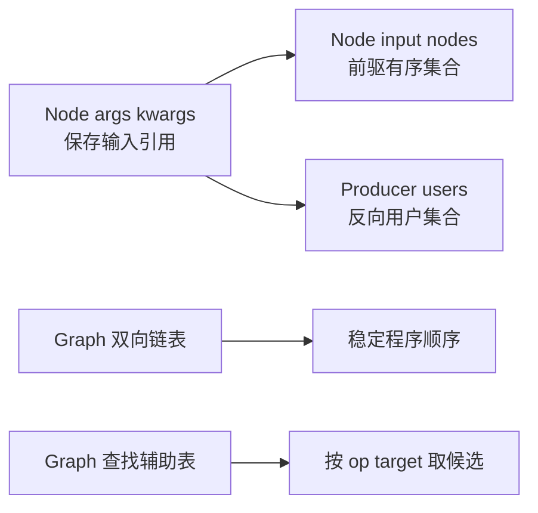
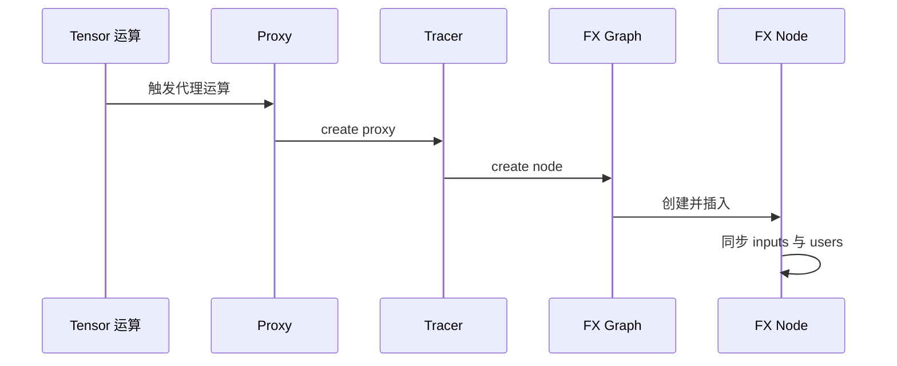
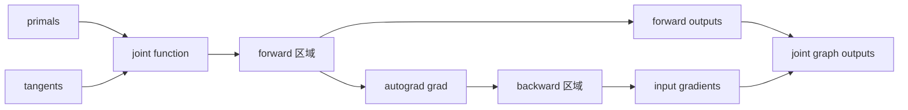
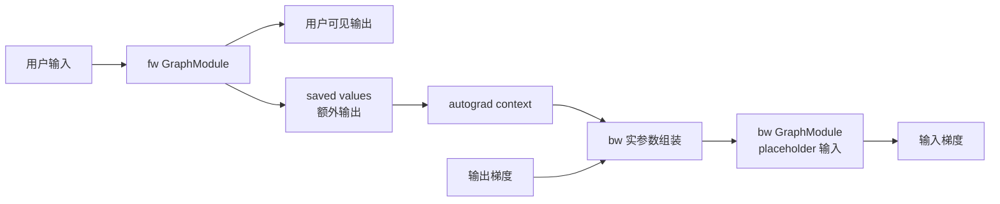
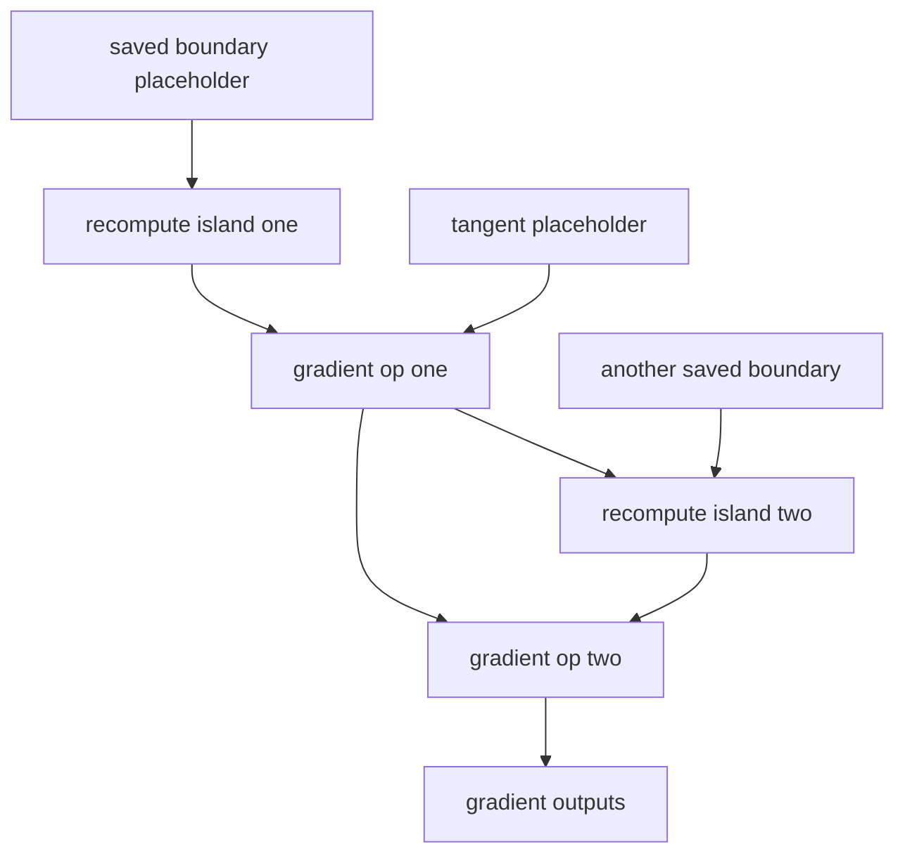

# FX Graph 构图与改图机制 — AOTAutograd 正反向分图、PatternMatcher、DCE 与保序

> **页面角色**：2026-07-23 问答形成的综合报告快照，保留原问题链与长篇推导。  
> **原始基线**：见下方页头；**当前审计基线**：PyTorch `e8f97c1a6ef8cbcdd0a946606bc1e924e4f07e52`。  
> **课程分工**：系统化、可执行的当前主线见 [[19_torch_compile_end_to_end/00_pytorch_graph_series_index]]；本页不是废弃页，但不再作为唯一事实入口。

> **源码基线**：PyTorch `ea5655fcebf726ec4cf1a859de75d2d0e6425805`，`main`，提交日期 2026-07-21。  
> **分析范围**：`torch.fx` IR、AOTAutograd joint graph 与 partition、Inductor PatternMatcher、DCE、稳定拓扑排序和运行时正反向桥接。  
> **结论口径**：标注为“源码事实”的描述可由所列 `file:line` 直接核验；复杂度上界和设计动机属于基于实现的分析。
> **配套文档**：[Design Report Word 版](../../../../docs/reports/fx_graph_construction_and_transformation_design_report.docx)。
---

## 阅读定位与迁移去向

本页保留最初问答形成的连续报告；新系列不是删掉这些内容，而是把它们拆成可独立核源、
运行和验收的课程页：

| 本页原章节 | 新系列主目的地 |
|---|---|
| §1 核心结论 | [[19_torch_compile_end_to_end/00_pytorch_graph_series_index]] |
| §2 FX对象模型、边和图序 | [[19_torch_compile_end_to_end/02_fx_graph_core_data_model]]；图序另见 [[19_torch_compile_end_to_end/14_dead_code_topology_and_effect_order]] |
| §3 joint→fw/bw与跨图ABI | [[19_torch_compile_end_to_end/09_aotautograd_joint_forward_backward_graphs]] |
| §4 saved/recompute、节点复制与reorder | [[19_torch_compile_end_to_end/10_saved_tensors_recompute_and_runtime_abi]] |
| §5–§6 PatternExpr、候选、匹配与替换 | [[19_torch_compile_end_to_end/13_pattern_expression_and_matcher_engine]] |
| §7–§8 dead、DCE、拓扑与effect order | [[19_torch_compile_end_to_end/14_dead_code_topology_and_effect_order]] |
| §9–§10 复杂度、合法性与验证 | [[19_torch_compile_end_to_end/16_graph_rewrite_legality_validation_and_complexity]] |
| §11 源码导航 | 上述课程页各自的源码路径、Lab与证据边界 |

旧报告的源码基线与新系列不同，不能用“目标页存在”推断每条历史claim都已无损迁移；
逐结构单元状态原以`docs/audits/pytorch_graph_series/`下的coverage ledger为准；该目录属审计流水线中间产物，已在 kb-reorg 清理中移出工作区（可经 git 历史追溯，删除前末次提交 `1ebafb5`），当前 checkout 不再包含该路径。

## 1. 核心结论

> **注**：以下机制结论保留，但旧完整路径 `torch/_functorch/_aot_autograd/partitioners.py` 已发生 locator drift；当前文件是 `torch/_functorch/partitioners.py`。现行提取机制见 [[19_torch_compile_end_to_end/09_aotautograd_joint_forward_backward_graphs#7. 提取新 Graph 的机制]]。

1. **FX 图不是单独的邻接表，也没有独立 `Edge` 对象。** `Graph` 用侵入式双向链表保存全局节点顺序；每个 `Node` 的 `args/kwargs` 保存输入引用，`_input_nodes` 汇总前驱，前驱的 `users` 保存反向 use-def 邻接。因此一份节点对象同时承载“程序语句、数据依赖和反向用户索引”。源码见 `torch/fx/node.py:258-322`、`torch/csrc/fx/node.cpp:154-205`。
2. **AOTAutograd 最终产物本质是两张独立 FX `GraphModule`：fw 与 bw。** 二者之间没有跨图 `Node` 边；跨图依赖由 ABI 表达为“fw 的额外输出 → 运行时保存 → bw 的 placeholder 输入”。源码见 `torch/_functorch/_aot_autograd/partitioners.py:1343-1592`、`runtime_wrappers.py:3215-3256,3288-3301`。
3. **recompute 不是特殊节点类型。** partitioner 选择少保存某些激活后，把必要的前向 `call_function` 节点复制到 bw 图；它们仍是普通 FX 节点，只是元数据可标记其重计算来源。源码见 `partitioners.py:514-705,1920-1995`。
4. **Pattern 是“待匹配子图的声明式语法树”，不是另一张运行图。** `CallFunction` 描述算子节点与参数结构；`Arg`、`KeywordArg`、`Ignored` 描述叶子的捕获策略；`MultiOutputPattern` 描述共享内部节点、但有多个外露输出的子图。源码见 `torch/_inductor/pattern_matcher.py:526-583,745-762,965-1019,1058-1064,1162-1223`。
5. **PatternMatcherPass 不是无条件扫描整图并尝试全部规则。** 它先按 pattern 根节点的 `(op, target)` 从 `Graph.find_nodes` 辅助索引取候选，再对候选做逆图序匹配；因此遍历的是注册根节点桶的并集，而不是每个节点乘以全部 pattern。源码见 `pattern_matcher.py:2583-2656`、`torch/fx/graph.py:1360-1391,1497-1520`。
6. **DCE 的“死”是图内语义，不是“没有连接到另一张图”。** 默认可删除条件是：节点无副作用且 `users` 为空。placeholder/output 对 DCE 永远视为有副作用。源码见 `torch/fx/node.py:760-808`、`torch/fx/graph.py:2688-2774`。
7. **改写后不会由 PatternMatcher 自动执行一套通用清理。** 替换实现负责局部插入、替换 uses、擦除已匹配节点；阶段驱动器在特定检查点运行 DCE、稳定拓扑排序、`lint()` 和 `recompile()`。它们不是每命中一个 pattern 就全部执行一次。源码见 `pattern_matcher.py:1374-1628,2609-2726`、`pre_grad.py:353-433`、`joint_graph.py:699-771`、`post_grad.py:165-180,227-297,416-474`。

---

## 2. FX IR 的对象模型

### 2.1 `Graph`、`Node`、`GraphModule` 分别是什么

| 对象 | 角色 | 关键存储 |
|---|---|---|
| `torch.fx.Graph` | 一段单赋值风格的程序与节点容器 | root sentinel、侵入式双向链表、节点查找辅助表、插入点、owning module |
| `torch.fx.Node` | 一条 IR 语句，也是依赖图顶点 | `op`、`target`、`args`、`kwargs`、`users`、`_input_nodes`、`meta`、链表前后指针 |
| `torch.fx.GraphModule` | `Graph` 加上可执行模块外壳 | 原始属性/子模块、生成的 Python `forward`、代码对象与调试映射 |

FX 核心公开类型叫 `torch.fx.Node`；“GraphNode”通常只是泛称，并非这套 IR 的另一种基础节点类型。一个 `Node` 的 `op` 决定语句类别：`placeholder`、`get_attr`、`call_function`、`call_method`、`call_module`、`output`；`target` 再决定具体函数、方法或模块路径。源码见 `torch/fx/node.py:258-284`。

`GraphModule` 的 `forward` 是从 `Graph` 生成的 Python 代码。原地改 `gm.graph` 后，若需要执行新图，必须 `gm.recompile()` 重新安装生成代码；只改链表并不会自动改掉已经存在的 `forward`。源码见 `torch/fx/graph_module.py:517-528,924-990`。

### 2.2 一条边到底存在哪里

假设：

```text
n0 = placeholder x
n1 = call_function relu n0
n2 = call_function add n1 n1
```

存储关系是：

- `n1.args` 直接引用 `n0`；
- `n1._input_nodes` 包含 `n0`；
- `n0.users` 包含 `n1`；
- `n2.args` 中可以两次引用 `n1`，但 `n1.users` 是“用户节点集合式字典”，通常只记录一次 `n2`，不表示使用次数；
- 节点在程序中的稳定顺序由 `n0.next == n1`、`n1.next == n2` 这样的双向链表表达。

`_update_args_kwargs` 会先移除旧输入的 `users` 关系，再遍历新 `args/kwargs`，同步 `_input_nodes` 与 producer 的 `users`。当前热点实现位于 C++ `_NodeBase`，源码见 `torch/csrc/fx/node.cpp:307-359`。

因此：



这里有两种“反向”需要严格区分：

- **反向邻接**：同一张图里 producer 的 `users`，用于从值流向消费者；
- **反向传播图**：AOTAutograd 生成的 bw `GraphModule`，是一张独立图。

前者不是另一张图；后者也不是把 fw 的边方向翻转后复用同一批节点。

### 2.3 图序与拓扑序

`Graph.nodes` 返回的是双向链表上的程序顺序，遍历期间允许安全删除。源码见 `torch/fx/graph.py:1473-1486`。合法 FX 图要求每个节点的输入已经在它之前出现，`graph.lint()` 用 seen set 检查这一点，同时检查节点归属、查找表一致性和 target 合法性。源码见 `torch/fx/graph.py:2608-2685`。

链表顺序与依赖边是两个维度：

- 依赖边回答“谁产生谁消费”；
- 链表回答“生成代码时语句以什么顺序出现”；
- 合法拓扑序要求生产者在消费者前，但互不依赖的节点可以有多个合法顺序。

FX 使用链表而非普通 Python list，是因为在 pass 中把节点插到某节点之前/之后、删除节点、把节点移动到 cursor 后面都可以做到常数时间的链表操作。源码见 `torch/csrc/fx/node.cpp:154-205,420-450`。

---

## 3. FX 图是怎样构造出来的

### 3.1 通用 tracing 路径

以 Proxy tracing 为例：



`Proxy` 包装一个 `Node`；代理运算经 tracer 的 `create_proxy` 进入 `create_node`，再由 `Graph.create_node` 分配名字、构造 `Node`、插入链表并更新查找表。源码见 `torch/fx/proxy.py:186-245,340-374,600-635`、`torch/fx/graph.py:1583-1659`。

`make_fx` 使用 ProxyTensor/FakeTensor 路径执行待捕获函数并记录算子，最终把 tracer 中的 `Graph` 封装为 `GraphModule`。源码见 `torch/fx/experimental/proxy_tensor.py:3312-3351`。这里“构图”的结构工作近似线性，但 tracing 过程中真实算子、fake propagation、decomposition 和 shape 处理的成本需单独计算。

### 3.2 AOTAutograd 先构造 joint graph

AOTAutograd 的关键不是直接在 Dynamo 前向图上“倒推并挂边”，而是构造一个 joint function：

1. 输入组织为 `primals` 与 `tangents`；
2. 在 tracing 上下文中执行原始 forward；
3. 把当前已有节点标记为 forward 区域；
4. 调用 `torch.autograd.grad` 生成梯度计算；
5. joint function 返回 `(forward outputs, gradients)`；
6. `make_fx` 把整段执行捕获为一张 joint FX 图。

源码入口见 `torch/_functorch/_aot_autograd/graph_capture.py:92-136,471-535`，joint function 见 `graph_capture_wrappers.py:294-330,414-477`。



注意：joint graph 是 partition 前的中间产物。真正交给 fw compiler 与 bw compiler 的，通常是 partition 后两张独立图。

### 3.3 partition 如何得到 fw 与 bw

> **注**：旧完整 partitioner 路径已迁至 `torch/_functorch/partitioners.py`；现行结论见 [[19_torch_compile_end_to_end/09_aotautograd_joint_forward_backward_graphs#7. 提取新 Graph 的机制]]。

partitioner 先按 joint 输出和依赖闭包识别：

- forward required nodes；
- backward required nodes；
- 两边共享或可作为边界值的节点；
- 不被最终输出闭包需要的 unclaimed nodes。
源码见 `torch/_functorch/_aot_autograd/partitioners.py:4005-4088`。

随后 `_extract_graph_with_inputs_outputs` 创建一张新 `Graph`：

- 被指定为子图输入的 joint 节点，在新图中变成 fresh placeholder；
- 其余需要的 `call_function` 节点通过 `node_copy` 按 joint 拓扑序复制；
- `env` 字典建立“旧 joint Node → 新子图 Node”的映射；
- 最后创建 output，执行 DCE 和 lint。

源码见 `partitioners.py:514-705`、`torch/fx/graph.py:2384-2418`。

最终 `_extract_fwd_bwd_modules`：

- 先以 `saved_values + tangents` 为 bw 输入抽取 bw 图；
- 剪掉 bw 中未使用的 saved placeholder；
- 再确定 fw 的输入与输出，其中 fw 输出除用户结果外还包含真正需要保存的边界值；
- 分别封装为 fw 与 bw `GraphModule`。

源码见 `partitioners.py:1343-1592`。

### 3.4 fw 与 bw 的跨图依赖

你的理解基本正确，但“通过判断 save tensors 连接上正反向依赖关系”更精确的说法是：

> partition 在编译期把跨图依赖编码进两张图的输入输出签名；运行时 wrapper 再按这份签名把 fw 的额外输出保存到 autograd context，并作为 bw placeholder 的实参传入。两张图之间始终没有对象级 `Node` 边。



运行时生成的 compiled forward 调用 `_compiled_fw_` 后执行 `_save_(ctx, fw_outs)`；compiled backward 从 `ctx.saved_tensors`、symints、opaque objects 与 grad args 组装 `all_args`。源码见 `runtime_wrappers.py:3215-3256,3288-3301`。这就是跨图的真实“桥”。

---

## 4. recompute 怎样进入 bw 图

### 4.1 选择：保存值还是重新计算

min-cut rematerialization partitioner 把 joint graph 转成流网络：

- 不允许重计算的节点通过无穷容量约束固定在 source 侧；
- 必须属于 backward 的节点固定在 sink 侧；
- 可保存激活的代价编码为割边容量；
- minimum cut 的 source/sink 分界决定 saved values；
- 未保存但 bw 又需要的 forward 计算成为重计算区域。

源码见 `partitioners.py:2641-2708,2888-2889,3052-3072,3446-3481,4091-4288`。`activation_memory_budget=0` 倾向最大重算，`1` 使用 min-cut 结果；二者之间还会结合内存预算选择方案。

这一步的“边”是 partition 算法临时构造的 flow-network 边，不是最终 fw/bw GraphModule 的跨图边。

### 4.2 构图：把普通前向节点复制进 bw

假设 joint 图里有：

```text
x,w -> a -> b -> forward_output
                 \
                  gradient_region
```
如果保存 `a`，bw 大致是：

```text
placeholder saved_a
placeholder tangent
gradient_ops saved_a tangent
```

如果不保存 `a`，但保存或已有边界输入 `x,w`，bw 大致是：

```text
placeholder saved_x
placeholder saved_w
placeholder tangent
recomputed_a = forward_op saved_x saved_w
gradient_ops recomputed_a tangent
```

`recomputed_a` 没有 recompute 专用 opcode；仍是 `call_function`。partition extraction 通过 `node_copy` 复制它，输入由 bw 图的 placeholder 或已复制节点重映射。源码见 `partitioners.py:514-705`。

### 4.3 为什么还需要 reorder

按 joint 图“先 forward、后 backward”的原顺序复制，会把所有 recompute 节点集中放在 bw 的梯度计算之前，延长临时值生命周期。`reorder_backward_graph` 重新构造 bw 图，只在某个 backward 节点即将需要依赖时，才递归 materialize 对应 recompute 节点，使峰值活跃张量更低。源码见 `partitioners.py:1920-1995`。

因此带 recompute 的 bw 图在逻辑上通常呈现：



“island”只是阅读上的分组；IR 里仍是一列合法拓扑序的普通节点。

---

## 5. PatternExpr 为什么设计成语法树

### 5.1 Pattern 定义的到底是什么

Pattern 定义三件事：

1. **结构约束**：根节点是什么 `op/target`，参数嵌套结构是什么，子节点还要满足什么 pattern；
2. **共享与使用约束**：某个 pattern 对象是否必须绑定同一个 FX node、节点能否有多个 users、多个输出如何通过共享 anchor 相连；
3. **handler ABI**：哪些命中值按位置传给 handler，哪些按名字传入，哪些只参与匹配但不传。

它不定义：

- 整张 FX 图的存储；
- 图执行顺序；
- 独立的 forward/backward 语义；
- 替换后的全局清理策略。

### 5.2 基类与子类是由哪些图场景决定的

`PatternExpr._match` 是抽象匹配协议，`match` 创建一次 `MatchContext` 并启动递归。源码见 `pattern_matcher.py:526-558`。把 pattern 设计成多态 AST，是因为图模式并不只有“节点 target 相等”一种条件：

| 图中场景 | 对应 pattern 节点 | 设计原因 |
|---|---|---|
| 匹配函数调用及其输入子图 | `CallFunction` | FX 的 `call_function` 有 `target + args + kwargs`，需递归匹配参数树 |
| 匹配方法或模块调用 | `CallMethod`、`CallModule` | FX `op` 不同，target 解释与候选索引方式也不同 |
| 捕获任意输入并按位置交给 handler | `Arg` | 叶子结构不限，但 handler 需要此值；深度优先收集 |
| 捕获任意输入并按名字交给 handler | `KeywordArg("q")` | 多层 pattern 中位置易变，命名捕获形成稳定 handler ABI |
| 只检查此处“存在一个值” | `Ignored` | wildcard 参与结构匹配，但不污染 handler 参数 |
| 常量或特定值约束 | 常量 pattern 节点 | 图里 shape、dtype、标量参数可能决定融合是否合法 |
| 同一内部子图导出多个外部结果 | `MultiOutputPattern` | 单根树不足以表达多个 output root，需要从已匹配 anchor 沿 `users` 找其他输出 |

`CallFunction` 的核心实现会先校验 `op/target/users`，必要时按函数 schema 规范化参数，再把 node 与 pattern 的 `args/kwargs` flatten；结构一致后递归调用 `ctx.match`。普通常量要求相等，`PatternExpr` 子项则继续递归。源码见 `pattern_matcher.py:965-1019,1058-1064`。

`MatchContext.pattern_to_node` 使同一个 `PatternExpr` 实例重复出现时必须绑定同一个 FX `Node`，这正是 DAG 共享关系无法仅靠“普通树递归”表达的部分。源码见 `pattern_matcher.py:483-523`。

`MultiOutputPattern` 先从第一个 output root 匹配，再让其他输出 pattern 从已匹配节点形成的 anchor 出发沿 `users` 搜候选。它描述的是“一个匹配结果有多个外露根”，不等同于“某个 FX node 返回 tuple”。源码见 `pattern_matcher.py:1162-1223`。

### 5.3 一个模式如何命中 FX 子图

```text
PatternExpr AST                         FX Graph

CallFunction add                       add_0
├── CallFunction mm        matches     ├── mm_0
│   ├── KeywordArg a                   │   ├── x
│   └── KeywordArg b                   │   └── w
└── Ignored                            └── bias
```

命中后：

- `a=x`、`b=w` 进入 `Match.kwargs`；
- `bias` 被验证存在，但不传给 handler；
- `mm_0`、`add_0` 进入 matched nodes；
- handler 可以据此创建替换节点、选择 lowering 或执行自定义图改写。

`Match` 本身保存捕获参数、命中节点、targets、context 和可选 replacement graph，见 `pattern_matcher.py:234-315`。

---

## 6. PatternMatcherPass 怎样遍历、匹配与替换

### 6.1 注册与候选索引
每条 `PatternEntry` 以 pattern 根的 `(op, target)` 注册到桶：

```text
patterns[
    call_function,
    aten.add.Tensor
] -> entry_0, entry_1, ...
```

源码见 `pattern_matcher.py:1342-1370,2583-2607`。

`Graph` 维护 `_FindNodesLookupTable`，`call_function` 可按 `(op,target)` 快速查候选；`find_nodes(..., sort=False)` 不先做全图过滤。源码见 `torch/fx/graph.py:1360-1391,1497-1520`。

所以“逆图序逐个 Node 匹配”应理解为：

1. 对当前 pass 已注册的每种根 key，取对应候选桶；
2. 合并这些候选；
3. 按 FX 节点顺序逆序排序；
4. 对每个候选，只尝试它所属 key 的 pattern entries。

源码见 `pattern_matcher.py:2628-2656`。若注册的 root keys 覆盖了几乎全部算子，候选集才会接近整图。

### 6.2 为什么逆序

逆序意味着优先从消费者侧、较靠后的 root 开始改写。其工程价值是：

- pattern 通常以子图输出为 root，自 root 向输入递归最自然；
- 替换后擦除内部节点时，后部消费关系更容易先收束；
- 避免正序扫描中刚插入的 replacement 又被同一轮当作前方候选反复处理；
- 与 `Match.erase_nodes()` 的反向擦除顺序相配合。

这不是“把图变成反向图”，只是候选处理顺序。

### 6.3 三种命中后的落地方式

| Entry | 命中后做什么 | 结果 |
|---|---|---|
| `LoweringPatternEntry` | 在匹配 root 前插入 handler 节点，替换 uses，擦除旧节点 | FX 中留下延迟到 lowering 执行的特殊 target |
| `GraphPatternEntry` | 调用自定义 handler 直接编辑 `Graph` | handler 自己决定插入、替换和删除 |
| `ReplacementPatternEntry` | 解释 traced replacement graph，把 replacement 节点复制到当前图并接回输出 | 用另一段 FX 子图替换原子图 |

源码见 `pattern_matcher.py:1374-1628,1828-1880,2296-2351`。

匹配成功后还会拒绝跨 mutation region、stream 或 mempool 边界的结果，再运行 `extra_check`。源码见 `pattern_matcher.py:2657-2710`。这说明 pattern AST 只表达局部结构，阶段语义与安全边界仍由 matcher/entry 的外层机制负责。

### 6.4 替换后会不会自动全局重排
不会由 `PatternMatcherPass.apply()` 自动完成。它返回命中数量；局部 entry 尽量借助 `graph.inserting_before`、`replace_all_uses_with`、`erase_node` 维持合法关系。真正的收尾取决于所属 driver：

- **pre-grad**：阶段末执行稳定拓扑排序、lint、recompile；
- **joint**：发生改图时在阶段末执行稳定拓扑排序、lint、recompile；
- **post-grad**：入口先 DCE，中间 pattern 后有稳定拓扑排序，collective 重排后可能再次排序，mutation 类 pass 保持在尾部，最终 recompile 与 lint。

源码见 `torch/_inductor/fx_passes/pre_grad.py:353-433`、`joint_graph.py:699-771`、`post_grad.py:165-180,227-297,416-474`。

因此正确模型是“**局部改写保持尽量合法，阶段检查点统一规范化**”，而不是“每条规则命中后立刻 DCE + sort + lint + recompile”。

---

## 7. DCE：dead node 的准确定义

### 7.1 默认判定

`Graph.eliminate_dead_code()` 逆序遍历节点；若：

```text
not node.is_impure() and len(node.users) == 0
```

则删除该节点。逆序很关键：删除消费者会使其生产者的 `users` 变空，于是同一轮继续向上游级联删除。源码见 `torch/fx/graph.py:2688-2774`。

`Node.is_impure()` 的默认规则包括：

- `placeholder` 与 `output` 永远保留；
- `call_module` 读取模块的 `_is_impure` 标志；
- `call_function` 委托统一副作用判定；
- 其他类型默认纯。

源码见 `torch/fx/node.py:760-808`。

### 7.2 “dead”“unclaimed”“没跨图边”不是一回事

| 术语 | 所属阶段 | 含义 |
|---|---|---|
| dead node | 单张 FX 图的 DCE | 无用户且可安全删除 |
| unclaimed node | joint partition 分类 | 不在最终 fw/bw 输出依赖闭包中 |
| 未保存激活 | fw/bw 边界选择 | 不作为 fw 额外输出传给 bw，可能被重算或根本不需要 |
| fw 与 bw 无 Node 边 | 跨 GraphModule 结构 | 正常设计，由运行时输入输出 ABI 桥接 |

因此不能用“bw node 没有连接 fw node”判断它死不死。bw 中的 placeholder 是 bw 图自己的 live 输入；它接收的值来自运行时参数，而不是跨图对象引用。

### 7.3 DCE 的安全前提

源码明确警告：默认 DCE 假定 graph 是函数式的，或者 impurity 判定能识别所有副作用。若一个会写内存、通信、更新状态或影响外部世界的节点被误判为纯，即使没有 users，也不能删除。`eliminate_dead_code` 支持自定义 impurity predicate，见 `torch/fx/graph.py:2688-2774`。

---

## 8. 保序机制

FX 的“保序”不是单一排序函数，而是五层机制共同作用：

1. **链表插入点**：`inserting_before/after` 让 pass 把新节点放在已知合法位置；
2. **use-def 同步**：更新 `args/kwargs` 时同步 `_input_nodes/users`；
3. **局部替换 API**：`replace_all_uses_with` 重写消费者输入，`erase_node` 拒绝删除仍有 users 的节点；
4. **稳定拓扑排序**：只移动违反依赖顺序的节点，并尽量保留原有相对顺序；
5. **验证与再编译**：`lint()` 验证结构，`recompile()` 更新可执行 `forward`。

源码见 `torch/fx/node.py:713-757`、`torch/fx/graph.py:1673-1711,2608-2774`、`pattern_matcher.py:2946-2980`。

`stable_topological_sort` 维护：

- `pending`：尚未处理的节点；
- `ready`：依赖已满足且已排定的节点；
- `waiting[dependency]`：等待某依赖的节点；
- `cursor`：已排定序列的尾部。

节点依赖全部 ready 时，利用双向链表把它移动到 cursor 后；若仍有未满足输入，则挂到最后一个未满足依赖的 waiting 桶。源码见 `pattern_matcher.py:2946-2980`。

稳定性的重要意义是：互不依赖节点的原相对顺序尽量不变，从而减少代码 diff、保持确定性，也降低对隐含调度假设的扰动。但它不能代替副作用建模；有 mutation/collective/stream 时，pass 仍需遵守对应 region 和阶段次序。

---

## 9. 复杂度分析

设：

- `N`：图中节点数；
- `E`：`args/kwargs` 中 Node 引用的总数，近似依赖边数；
- `C`：当前 PatternMatcherPass 的根候选节点总数，`C ≤ N`；
- `B(v)`：候选 `v` 对应根桶内的 pattern 数；
- `K(p)`：pattern AST 的节点数；
- `A(p,v)`：`MultiOutputPattern` 从 anchor 沿 users 搜索的额外访问量；
- `R`：一次 replacement 新建节点数；
- `d(v)`：节点输入引用数。

| 操作 | 时间复杂度 | 额外空间 | 说明 |
|---|---:|---:|---|
| FX 结构构图 | `O(N + E)` | `O(N + E)` | 不含真实 Tensor 计算、decomposition、shape propagation |
| 链表插入/移除 | `O(1)` | `O(1)` | 更新 args/users 仍与相邻依赖数有关 |
| `find_nodes` 取根候选 | 期望 `O(C)` | `O(C)` | 借助 `(op,target)` 查找表；候选合并要物化 |
| 候选逆序排序 | `O(C log C)` | `O(C)` | Node 用稳定 sort key 比较 |
| 一轮 pattern 匹配 | `Σv Σp∈B(v) O(K(p)+A(p,v))` | 与匹配深度和命中集相关 | 常量 pattern 规模与小桶下接近线性；同根规则很多时放大 |
| 一次 replacement | `O(R + E_match + U)` | `O(R)` | `U` 为要重写的 uses；复杂 handler 另算 |
| DCE | `O(N + E)` | `O(N)` | 逆序一次并随删除清理输入关系 |
| `lint` | `O(N + E)` 加 target 解析 | `O(N)` | seen set 与所有输入检查 |
| 稳定拓扑排序 | 常见 `O(N + E)`；严格上界 `O(N + E + Σd(v)^2)` | `O(N + E)` | waiting 重试时会重新扫描该节点全部参数 |
| `recompile` | `O(N + code_size)` | 与生成代码相当 | 重新生成并安装 Python forward |
| joint 分类与两图抽取 | `O(N + E)` | `O(N + E)` | 不含 min-cut |
| min-cut partition | `O(N + E) + T_maxflow(V',E')` | `O(N + E)` | `V'=O(N)`、`E'=O(N+E)`；实际由所用 max-flow 实现决定 |
| recompute reorder | 常见 `O(N + E)`，含批次排序时上界 `O(N log N + E)` | `O(N + E)` | 重新复制图并按需 materialize |

### 9.1 Pattern passes 的总体复杂度

若一个阶段有 `Q` 个 matcher pass，总体不是简单的 `O(N × 全部规则数)`，而是：

```text
Σ pass q [
    Cq log Cq
    + Σ candidate v Σ pattern p in bucket q v match_cost p v
    + rewrite_cost q
    + optional DCE sort lint recompile
]
```

工程上常接近线性的条件是：

- root key 区分度高，使 `C << N` 或桶较小；
- pattern AST 大小、算子参数个数和 multi-output anchor 扇出有界；
- 阶段清理按批执行，而非每个命中执行；
- replacement 不导致大范围 uses 重写。

最坏情况会明显退化：大量 pattern 共用同一 root、每个候选都在深层才失败、`MultiOutputPattern` 扫描高扇出 users，或 pass 反复重写出下一轮的新候选。

### 9.2 整条 AOTAutograd 与 Inductor 改图管线

只看图算法、不计 kernel 编译与真实 Tensor 计算，可写为：

```text
T_total
= T_trace_and_joint
 + T_classify
 + T_maxflow_partition
 + T_extract_fw_bw
 + Σ stage_passes
     pattern_match
     rewrite
     optional_DCE
     optional_toposort
     lint
     recompile
```

其中 min-cut 的 max-flow 和多轮 pattern 匹配通常比基础链表维护更可能成为非线性项；而真实系统总耗时还可能被 FakeTensor/shape 推导、Python tracing、backend compile 和 autotune 主导。

---

## 10. 实现不变量与排查清单

### 10.1 写 pass 时必须维护

- 新节点的所有输入必须在它之前，或在阶段末保证稳定拓扑排序；
- 替换输出后再删除内部节点，且删除时 `users` 必须为空；
- 有副作用的节点不可仅因无 users 就删除；
- 多输出/共享子图 pattern 要显式表达 anchor 与 multiple-user 约束；
- 不跨 mutation region、stream、mempool 边界融合；
- graph 改完先 `lint()`，需要执行时再 `recompile()`；
- 不把 bw 叫“反向边图”：它的内部边仍是生产者到消费者；
- 不把 saved tensor 理解为跨图 Node 引用：它是 fw 输出/bw 输入 ABI。
### 10.2 阅读图时的四问

1. 当前看到的是 Dynamo forward graph、AOT joint graph，还是 partition 后 fw/bw？
2. 某个值是普通用户输出、saved value、tangent，还是重计算边界输入？
3. 所谓“反向”是 `users` 反向邻接、逆序遍历，还是 backward GraphModule？
4. 当前 pass 的收尾责任在 entry、自定义 handler，还是阶段 driver？

回答这四问，基本可以避免把三种“反向”和两种“图连接”混为一谈。

---

## 11. 关键源码导航

> **注**：下表中的旧完整路径 `torch/_functorch/_aot_autograd/partitioners.py` 仅是 locator drift，不能作为当前源码入口；当前入口及提取关系见 [[19_torch_compile_end_to_end/09_aotautograd_joint_forward_backward_graphs#7. 提取新 Graph 的机制]]。

| 主题 | 当前基线位置 |
|---|---|
| Node 数据模型与输入/用户关系 | `torch/fx/node.py:258-322`；`torch/csrc/fx/node.cpp:154-205,307-359` |
| Graph 链表、查找表、创建与删除 | `torch/fx/graph.py:1360-1520,1583-1711` |
| Graph lint、DCE | `torch/fx/graph.py:2608-2774` |
| GraphModule recompile | `torch/fx/graph_module.py:924-990` |
| Proxy tracing | `torch/fx/proxy.py:186-245,340-374,600-635` |
| AOT joint graph 捕获 | `torch/_functorch/_aot_autograd/graph_capture.py:92-136,471-535`；`graph_capture_wrappers.py:294-477` |
| fw/bw 分类与抽取 | `torch/_functorch/_aot_autograd/partitioners.py:514-705,1343-1592,4005-4288` |
| min-cut 与 recompute reorder | `partitioners.py:2641-3072,3446-3481,1920-1995` |
| saved tensors 运行时桥接 | `torch/_functorch/_aot_autograd/runtime_wrappers.py:3215-3256,3288-3301` |
| PatternExpr 与捕获叶子 | `torch/_inductor/pattern_matcher.py:526-583,745-762` |
| CallFunction 与 MultiOutputPattern | `pattern_matcher.py:965-1019,1058-1064,1162-1223` |
| Pattern 注册、候选遍历与安全边界 | `pattern_matcher.py:1342-1402,2583-2726` |
| replacement 与稳定拓扑排序 | `pattern_matcher.py:1411-1628,2946-2980` |
| pre/joint/post 阶段收尾 | `torch/_inductor/fx_passes/pre_grad.py:353-433`；`joint_graph.py:699-771`；`post_grad.py:165-180,227-297,416-474` |

---

## Related Pages

- [[19_torch_compile_end_to_end/00_pytorch_graph_series_index]] — 当前系统课程入口
- [[19_torch_compile_end_to_end/02_fx_graph_core_data_model]]
- [[19_torch_compile_end_to_end/09_aotautograd_joint_forward_backward_graphs]]
- [[19_torch_compile_end_to_end/10_saved_tensors_recompute_and_runtime_abi]]
- [[19_torch_compile_end_to_end/13_pattern_expression_and_matcher_engine]]
- [[19_torch_compile_end_to_end/14_dead_code_topology_and_effect_order]]
- [[19_torch_compile_end_to_end/16_graph_rewrite_legality_validation_and_complexity]]
- [[03_aot_autograd/index]] — AOTAutograd 模块索引
- [[aotautograd_analysis]] — AOTAutograd 全流程与 runtime wrappers 深入分析
- [[aot_autograd_quickstart]] — 正反向图、joint graph 与重计算的实操查看方法
- [[joint_graph_passes_guide]] — partition 前 joint graph 的 Inductor pass
- [[torch_upstream_pass_deepdive]] — PatternMatcher 与三阶段上游 pass 全集
- [[fx_pass_optimization_methodology]] — Pass 阶段选择、约束和验证方法
- [[fx_graph_export_and_custom_ops_analysis]] — FX Proxy、Node/Graph/GraphModule 与 export 扩展机制
