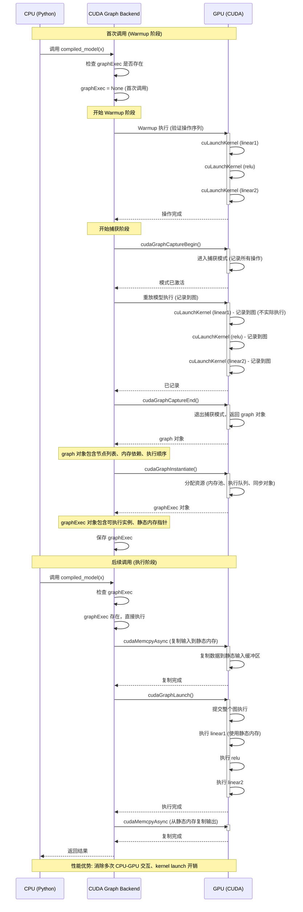
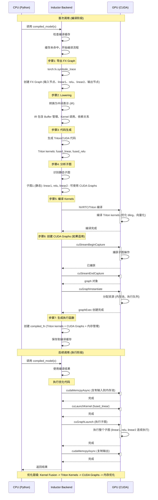
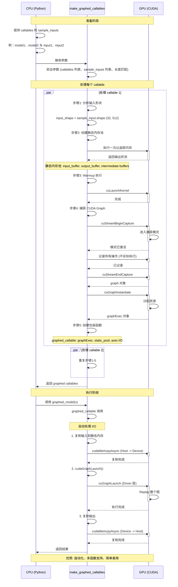

```mermaid
sequenceDiagram
    participant CPU as CPU (Python)
    participant API as CUDA Graph API
    participant GPU as GPU (CUDA)
    
    Note over CPU,GPU: 初始化阶段
    
    CPU->>CPU: 创建静态内存池
    CPU->>CPU: static_input = torch.empty_like(x)
    CPU->>CPU: static_output = torch.empty_like(y)
    
    Note over CPU: 静态内存池布局: 输入缓冲区(固定形状) + 输出缓冲区(固定形状)
    
    CPU->>API: stream = cuda.Stream()
    API->>GPU: cuStreamCreate
    activate GPU
    GPU-->>API: Stream 创建完成
    deactivate GPU
    
    CPU->>CPU: graph = CUDAGraph()
    
    Note over CPU,GPU: 捕获阶段
    
    CPU->>API: 进入 graph 上下文 (with torch.cuda.graph)
    API->>API: __enter__()
    API->>API: 保存当前 stream
    API->>API: 切换到目标 stream
    API->>GPU: cuStreamSetCurrent
    activate GPU
    GPU-->>API: Stream 已切换
    deactivate GPU
    
    API->>API: 开始捕获
    API->>GPU: cuStreamBeginCapture
    activate GPU
    GPU->>GPU: 进入捕获模式 (mode=GLOBAL, 记录所有操作)
    deactivate GPU
    GPU-->>API: 捕获模式已激活
    
    Note over CPU,GPU: 执行模型操作 (使用静态内存)
    
    CPU->>API: temp = static_input
    API->>GPU: 记录 buffer 引用
    
    CPU->>API: temp = model.linear1(temp)
    API->>GPU: cuLaunchKernel (linear1)
    activate GPU
    GPU->>GPU: 记录到图: kernel 参数、buffer 指针、执行配置 (不实际执行)
    deactivate GPU
    GPU-->>API: 已记录
    
    CPU->>API: temp = model.relu(temp)
    API->>GPU: cuLaunchKernel (relu)
    activate GPU
    GPU->>GPU: 记录到图
    deactivate GPU
    GPU-->>API: 已记录
    
    CPU->>API: temp = model.linear2(temp)
    API->>GPU: cuLaunchKernel (linear2)
    activate GPU
    GPU->>GPU: 记录到图
    deactivate GPU
    GPU-->>API: 已记录
    
    CPU->>API: static_output.copy_(temp)
    API->>GPU: cudaMemcpyAsync (Device -> Device)
    activate GPU
    GPU->>GPU: 记录内存操作
    deactivate GPU
    GPU-->>API: 已记录
    
    CPU->>API: 退出 graph 上下文
    API->>API: __exit__()
    API->>API: 结束捕获
    API->>GPU: cuStreamEndCapture
    activate GPU
    GPU->>GPU: 退出捕获模式，验证图完整性，返回 graph 对象
    deactivate GPU
    GPU-->>API: graph 对象
    
    Note over API: graph 对象包含节点列表、边列表、内存依赖、执行顺序
    
    API->>API: 实例化图
    API->>GPU: cuGraphInstantiate
    activate GPU
    GPU->>GPU: 分配资源: 验证节点、分配内存池、创建执行队列、设置同步对象
    deactivate GPU
    GPU-->>API: graphExec 对象
    
    Note over API: graphExec 对象包含可执行实例、静态内存映射、准备好执行
    
    API->>API: 恢复 stream
    API->>GPU: cuStreamSetCurrent
    activate GPU
    GPU-->>API: Stream 已恢复
    deactivate GPU
    
    API-->>CPU: 上下文退出
    
    Note over CPU,GPU: 执行阶段
    
    CPU->>CPU: 后续调用: 复制输入到静态内存
    CPU->>CPU: static_input.copy_(x)
    CPU->>API: cudaMemcpyAsync()
    API->>GPU: cudaMemcpyAsync (Host -> Device)
    activate GPU
    deactivate GPU
    GPU-->>API: 复制完成
    
    CPU->>CPU: Replay 图
    CPU->>API: graph.replay()
    API->>GPU: cuGraphLaunch()
    activate GPU
    GPU->>GPU: 提交整个图执行 (一次性提交)
    GPU->>GPU: 执行 linear1 (使用静态内存)
    GPU->>GPU: 执行 relu
    GPU->>GPU: 执行 linear2
    GPU->>GPU: copy output
    deactivate GPU
    GPU-->>API: 执行完成
    
    CPU->>CPU: 复制输出
    CPU->>CPU: result = static_output.clone()
    CPU->>API: cudaMemcpyAsync()
    API->>GPU: cudaMemcpyAsync (Device -> Host)
    activate GPU
    deactivate GPU
    GPU-->>API: 复制完成
    
    CPU->>CPU: 返回结果
    
    Note over CPU,GPU: 优势: 静态内存管理、完全控制、高性能
```

# PyTorch CUDA Graphs 完整使用指南

## 目录
1. [概述](#概述)
2. [方式1: torch.compile(backend="cudagraphs")](#方式1-torchcompilebackendcudagraphs)
3. [方式2: torch.compile(backend="inductor", mode="reduce-overhead")](#方式2-torchcompilebackendinductor-modereduce-overhead)
4. [方式3: torch.cuda.graph() 上下文管理器](#方式3-torchcudagraph-上下文管理器)
5. [方式4: torch.cuda.make_graphed_callables](#方式4-torchcudamake_graphed_callables)
6. [综合比较](#综合比较)
7. [最佳实践](#最佳实践)

---

## 概述

### 什么是 CUDA Graphs?

CUDA Graphs 是 NVIDIA 提供的性能优化技术，它允许将一系列 GPU 操作预先记录为一个"图"，然后可以一次性提交执行。这消除了每次操作时的 CPU 开销，包括：
- Kernel launch 开销
- CPU-GPU 同步开销
- 内存分配开销
- 驱动程序调用开销

### CUDA Graphs 的优势

```
传统执行流程:
CPU → Launch Kernel 1 → GPU → CPU → Launch Kernel 2 → GPU → CPU → Launch Kernel 3 → GPU
     (开销)              (等待)    (开销)              (等待)    (开销)              (等待)

CUDA Graphs 执行流程:
CPU → Replay CUDA Graph → GPU (执行所有操作)
     (一次开销)           (连续执行)
```

### 性能提升原理

1. **消除 CPU-GPU 交互**: 所有操作预先记录，只需一次 CPU 调用
2. **减少驱动程序开销**: 避免多次 CUDA API 调用
3. **优化内存访问**: 预先分配内存，减少运行时分配
4. **提高 GPU 利用率**: 连续执行，减少空闲时间
5. **量化收益**: 综合上述优化，理论上可减少总执行时间 30-70%（具体幅度取决于模型与硬件，未附实测来源）

---

## 方式1: torch.compile(backend="cudagraphs")

### 完整示例代码

```python
import torch
import torch.nn as nn
import time

class SimpleModel(nn.Module):
    def __init__(self):
        super().__init__()
        self.linear1 = nn.Linear(1024, 2048)
        self.linear2 = nn.Linear(2048, 1024)
        self.relu = nn.ReLU()
    
    def forward(self, x):
        x = self.linear1(x)
        x = self.relu(x)
        x = self.linear2(x)
        return x

def example_cudagraphs_backend():
    device = torch.device("cuda")
    model = SimpleModel().to(device)
    model.eval()
    
    # 准备输入数据
    batch_size = 32
    input_size = 1024
    x = torch.randn(batch_size, input_size, device=device)
    
    # 使用 cudagraphs backend 编译模型
    compiled_model = torch.compile(model, backend="cudagraphs")
    
    # Warmup: 首次运行会捕获 CUDA Graph
    print("首次运行（捕获 CUDA Graph）...")
    with torch.no_grad():
        output = compiled_model(x)
    
    # 性能测试
    num_iterations = 100
    
    # 未编译模型
    start_time = time.time()
    with torch.no_grad():
        for _ in range(num_iterations):
            _ = model(x)
    uncompiled_time = time.time() - start_time
    
    # 编译后模型
    start_time = time.time()
    with torch.no_grad():
        for _ in range(num_iterations):
            _ = compiled_model(x)
    compiled_time = time.time() - start_time
    
    print(f"未编译: {uncompiled_time:.4f}s")
    print(f"编译后: {compiled_time:.4f}s")
    print(f"加速比: {uncompiled_time / compiled_time:.2f}x")

if __name__ == "__main__":
    example_cudagraphs_backend()
```

### 实现原理

#### 1. Backend 架构

```
torch.compile(backend="cudagraphs")
    ↓
CUDAGraphsBackend 类
    ↓
├── __init__: 初始化 backend
├── compile: 编译函数
│   ├── 分析输入形状
│   ├── 创建静态内存池
│   └── 准备捕获
└── call: 执行函数
    ├── 首次调用: 捕获 CUDA Graph
    └── 后续调用: Replay CUDA Graph
```

#### 2. 捕获流程

**首次调用（Warmup）:**

```python
# 伪代码（对应 torch.cuda.CUDAGraph 的 Python 方法）
def first_call(model, input):
    g = torch.cuda.CUDAGraph()
    # 1. Warmup 执行（验证操作序列）
    output = model(input)
    
    # 2. 开始捕获
    g.capture_begin()
    
    # 3. 重放操作（记录到图中）
    output = model(input)
    
    # 4. 结束捕获
    g.capture_end()
    
    # 5. 实例化图（分配资源）
    g.instantiate()
    
    # 6. 保存 graph 用于后续调用
    return g
```

**后续调用:**

```python
# 伪代码
def subsequent_call(g, input, output):
    # 1. 复制输入到静态内存
    static_input.copy_(input)
    
    # 2. Replay CUDA Graph
    g.replay()
    
    # 3. 从静态内存复制输出
    output.copy_(static_output)
    
    return output
```

#### 3. 内存管理

CUDA Graphs 要求所有内存预先分配：

```
静态内存池布局:
┌─────────────────────────────────────┐
│ 输入张量 (固定形状)                 │
├─────────────────────────────────────┤
│ 中间结果 1                          │
├─────────────────────────────────────┤
│ 中间结果 2                          │
├─────────────────────────────────────┤
│ ...                                 │
├─────────────────────────────────────┤
│ 输出张量 (固定形状)                 │
└─────────────────────────────────────┘

所有张量在捕获前分配，捕获时记录指针
```

### 代码调用流程时序图



### 限制和注意事项

1. **固定形状**: 输入形状必须完全固定
2. **无控制流**: 不支持 if/else、循环等动态控制流
3. **静态内存**: 不能在图内分配新内存
4. **CUDA 10+**: 需要 CUDA 10 或更高版本

---

## 方式2: torch.compile(backend="inductor", mode="reduce-overhead")

> 本节的编译流程与 CUDA Graph 集成为简化示意(伪代码)。真实的 `cudagraph_trees` 运行时是一棵
> 按 memory-path 组织的树(warmup→record→replay 状态机、按 static input 地址与动态整数 key
> 分流的多份 recording、fallback 而非重新编译),源码级机制见 [[10_cudagraph_trees_warmup_record_and_replay_analysis]];
> training/inference/freezing 与 CUDA Graph 的组合边界(freezing 变换链、地址不变式、组合矩阵)见
> [[20_training_inference_cudagraph_and_freezing_analysis]]。

### 完整示例代码

```python
import torch
import torch.nn as nn
import time

class TransformerBlock(nn.Module):
    def __init__(self, d_model=512, nhead=8):
        super().__init__()
        self.self_attn = nn.MultiheadAttention(d_model, nhead)
        self.linear1 = nn.Linear(d_model, d_model * 4)
        self.linear2 = nn.Linear(d_model * 4, d_model)
        self.norm1 = nn.LayerNorm(d_model)
        self.norm2 = nn.LayerNorm(d_model)
        self.dropout = nn.Dropout(0.1)
        self.activation = nn.ReLU()
    
    def forward(self, x):
        # Self attention
        attn_out, _ = self.self_attn(x, x, x)
        x = x + self.dropout(attn_out)
        x = self.norm1(x)
        
        # Feed forward
        ff_out = self.linear2(self.dropout(self.activation(self.linear1(x))))
        x = x + self.dropout(ff_out)
        x = self.norm2(x)
        
        return x

def example_inductor_reduce_overhead():
    device = torch.device("cuda")
    model = TransformerBlock().to(device)
    model.eval()
    
    # 准备输入数据
    batch_size = 32
    seq_len = 128
    d_model = 512
    x = torch.randn(seq_len, batch_size, d_model, device=device)
    
    # 使用 inductor backend 编译，启用 reduce-overhead 模式
    compiled_model = torch.compile(
        model,
        backend="inductor",
        mode="reduce-overhead"
    )
    
    # Warmup: 首次运行会触发编译
    print("首次运行（触发编译）...")
    with torch.no_grad():
        output = compiled_model(x)
    
    # 性能测试
    num_iterations = 100
    
    # 未编译模型
    start_time = time.time()
    with torch.no_grad():
        for _ in range(num_iterations):
            _ = model(x)
    uncompiled_time = time.time() - start_time
    
    # 编译后模型
    start_time = time.time()
    with torch.no_grad():
        for _ in range(num_iterations):
            _ = compiled_model(x)
    compiled_time = time.time() - start_time
    
    print(f"未编译: {uncompiled_time:.4f}s")
    print(f"编译后: {compiled_time:.4f}s")
    print(f"加速比: {uncompiled_time / compiled_time:.2f}x")

if __name__ == "__main__":
    example_inductor_reduce_overhead()
```

### 实现原理

#### 1. Inductor Backend 架构

```
torch.compile(backend="inductor", mode="reduce-overhead")
    ↓
InductorBackend 类
    ↓
├── compile: 编译函数
│   ├── 导出 FX Graph
│   ├── AOT Autograd (如果需要)
│   ├── Lowering (Triton/CUDA)
│   ├── 代码生成
│   ├── 编译 Kernels
│   └── 创建 CUDA Graphs (如果适用)
└── call: 执行函数
    ├── 检查缓存
    ├── 执行优化代码
    └── 可能使用 CUDA Graphs
```

#### 2. 编译流程详解

```python
# 伪代码
def inductor_compile(model, inputs):
    # 1. 导出 FX Graph
    fx_graph = torch.fx.symbolic_trace(model)
    
    # 2. AOT Autograd (训练时)
    if requires_grad:
        fx_graph = aot_autograd(fx_graph)
    
    # 3. Lowering 到中间表示
    ir = lower_to_ir(fx_graph)
    
    # 4. 代码生成
    if mode == "reduce-overhead":
        # 生成优化的 Triton/CUDA 代码
        code = generate_triton_code(ir)
        
        # 分析是否可以使用 CUDA Graphs
        if can_use_cuda_graphs(ir):
            # 生成 CUDA Graphs 包装代码
            code = wrap_with_cuda_graphs(code)
    
    # 5. 编译 Kernels
    compiled_kernels = compile_kernels(code)
    
    # 6. 创建执行函数
    def compiled_fn(*inputs):
        return execute_compiled(compiled_kernels, inputs)
    
    return compiled_fn
```

#### 3. reduce-overhead 模式的优化策略

> 跨层级总览见 综合比较 节的优化层级速览。

```
reduce-overhead 模式优化层级:

Level 1: Kernel Fusion
┌─────────────────────────────────────┐
│ 多个小操作 → 一个融合 kernel       │
│ matmul + bias + relu → fused_kernel │
└─────────────────────────────────────┘

Level 2: Triton Kernels
┌─────────────────────────────────────┐
│ 使用 Triton 生成高效 kernels        │
│ 自动优化 tiling、向量化等          │
└─────────────────────────────────────┘

Level 3: CUDA Graphs
┌─────────────────────────────────────┐
│ 对静态形状的子图使用 CUDA Graphs   │
│ 消除 kernel launch 开销            │
└─────────────────────────────────────┘

Level 4: 内存优化
┌─────────────────────────────────────┐
│ 预先分配内存池                      │
│ 减少运行时内存分配                  │
└─────────────────────────────────────┘
```

#### 4. CUDA Graphs 集成

Inductor 如何集成 CUDA Graphs:

```python
# 伪代码
class InductorCompiledFunction:
    def __init__(self, ir):
        # 分析 IR，识别可捕获的子图
        self.static_subgraphs = identify_static_subgraphs(ir)
        self.dynamic_subgraphs = identify_dynamic_subgraphs(ir)
        
        # 为静态子图创建 CUDA Graphs
        for subgraph in self.static_subgraphs:
            subgraph.cuda_graph = create_cuda_graph(subgraph)
    
    def __call__(self, *inputs):
        # 执行动态子图（常规方式）
        for subgraph in self.dynamic_subgraphs:
            execute_regular(subgraph, inputs)
        
        # 执行静态子图（使用 CUDA Graphs）
        for subgraph in self.static_subgraphs:
            replay_cuda_graph(subgraph.cuda_graph, inputs)
        
        return outputs
```

### 代码调用流程时序图



### 优势

1. **多级优化**: 结合 kernel fusion、Triton、CUDA Graphs
2. **灵活性**: 支持部分动态形状
3. **自动化**: 自动选择最优策略
4. **生产就绪**: PyTorch 2.0 推荐
5. **量化收益**: 综合 Kernel Fusion → Triton → CUDA Graphs → 内存优化四级叠加，理论上可达 2-5x 加速（具体幅度取决于模型与硬件，未附实测来源）

---

## 方式3: torch.cuda.graph() 上下文管理器

### 完整示例代码

```python
import torch
import torch.nn as nn
import time

class CustomModel(nn.Module):
    def __init__(self):
        super().__init__()
        self.conv1 = nn.Conv2d(3, 64, kernel_size=3, padding=1)
        self.conv2 = nn.Conv2d(64, 128, kernel_size=3, padding=1)
        self.pool = nn.MaxPool2d(2)
        self.relu = nn.ReLU()
    
    def forward(self, x):
        x = self.conv1(x)
        x = self.relu(x)
        x = self.pool(x)
        x = self.conv2(x)
        x = self.relu(x)
        x = self.pool(x)
        return x

def example_cuda_graph_context():
    device = torch.device("cuda")
    model = CustomModel().to(device)
    model.eval()
    
    # 准备输入数据
    batch_size = 16
    x = torch.randn(batch_size, 3, 224, 224, device=device)
    
    # 创建静态内存池
    # 注意: 所有张量必须预先分配
    static_input = torch.empty_like(x)
    static_output = torch.empty(
        batch_size, 128, 56, 56,  # 计算后的输出形状
        device=device
    )
    
    # 创建 CUDA Stream
    stream = torch.cuda.Stream()
    
    # 创建 CUDA Graph
    graph = torch.cuda.CUDAGraph()
    
    print("捕获 CUDA Graph...")
    with torch.cuda.graph(graph, stream=stream):
        # 在这个上下文中，所有操作都会被记录
        # 必须使用静态内存，不能创建新张量
        temp = static_input
        temp = model.conv1(temp)
        temp = model.relu(temp)
        temp = model.pool(temp)
        temp = model.conv2(temp)
        temp = model.relu(temp)
        temp = model.pool(temp)
        static_output.copy_(temp)
    
    print("CUDA Graph 捕获完成")
    
    # 性能测试
    num_iterations = 100
    
    # 未使用 CUDA Graph
    start_time = time.time()
    with torch.no_grad():
        for _ in range(num_iterations):
            _ = model(x)
    uncompiled_time = time.time() - start_time
    
    # 使用 CUDA Graph
    start_time = time.time()
    for _ in range(num_iterations):
        # 复制输入到静态内存
        static_input.copy_(x)
        # Replay CUDA Graph
        graph.replay()
        # 复制输出
        result = static_output.clone()
    compiled_time = time.time() - start_time
    
    print(f"未使用 CUDA Graph: {uncompiled_time:.4f}s")
    print(f"使用 CUDA Graph: {compiled_time:.4f}s")
    print(f"加速比: {uncompiled_time / compiled_time:.2f}x")

if __name__ == "__main__":
    example_cuda_graph_context()
```

### 实现原理

#### 1. 上下文管理器机制

```python
# torch.cuda.graph() 的简化实现
class CUDAGraphContext:
    def __init__(self, graph, stream=None):
        self.graph = graph
        self.stream = stream or torch.cuda.current_stream()
        self.old_stream = None
    
    def __enter__(self):
        # 保存当前 stream
        self.old_stream = torch.cuda.current_stream()
        
        # 切换到目标 stream
        torch.cuda.set_stream(self.stream)
        
        # 开始捕获
        torch.cuda._C._cuda_graph_capture_begin(
            self.stream,
            torch.cuda._C._cuda_graph_capture_mode_global
        )
        
        return self
    
    def __exit__(self, exc_type, exc_val, exc_tb):
        # 结束捕获
        torch.cuda._C._cuda_graph_capture_end(self.stream)
        
        # 恢复 stream
        torch.cuda.set_stream(self.old_stream)
        
        return False
```

#### 2. 捕获模式

CUDA Graphs 支持多种捕获模式：

```python
# 模式 1: Global Capture (默认)
# 捕获所有 stream 上的操作
with torch.cuda.graph(graph, stream=stream):
    # 所有操作都会被捕获
    output = model(input)

# 模式 2: Thread Local Capture
# 只捕获当前线程的操作
with torch.cuda.graph(graph, stream=stream, capture_mode="thread_local"):
    output = model(input)

# 模式 3: Stream Capture
# 只捕获指定 stream 上的操作
with torch.cuda.graph(graph, stream=stream, capture_mode="stream"):
    output = model(input)
```

#### 3. 内存管理详解

```python
# 静态内存池的设计
class StaticMemoryPool:
    def __init__(self, input_shape, output_shape, intermediate_shapes):
        # 预先分配所有需要的内存
        self.input_buffer = torch.empty(input_shape, device="cuda")
        self.output_buffer = torch.empty(output_shape, device="cuda")
        
        # 中间结果缓冲区
        self.intermediate_buffers = []
        for shape in intermediate_shapes:
            self.intermediate_buffers.append(
                torch.empty(shape, device="cuda")
            )
    
    def get_input_buffer(self):
        return self.input_buffer
    
    def get_output_buffer(self):
        return self.output_buffer
    
    def get_intermediate_buffer(self, index):
        return self.intermediate_buffers[index]
```

#### 4. Replay 机制

```python
# CUDA Graph.replay() 的简化实现
class CUDAGraph:
    def __init__(self):
        self._graph = None
        self._exec = None
    
    def replay(self, stream=None):
        """Replay 捕获的图"""
        if stream is None:
            stream = torch.cuda.current_stream()
        
        # 调用 CUDA API replay 图
        torch.cuda._C._cuda_graph_launch(
            self._exec,
            stream
        )
```

### 代码调用流程时序图



### 高级用法

#### 1. 多 Stream 捕获

```python
# 捕获多个 stream 上的操作
stream1 = torch.cuda.Stream()
stream2 = torch.cuda.Stream()

graph = torch.cuda.CUDAGraph()

with torch.cuda.graph(graph, stream=stream1):
    with torch.cuda.stream(stream1):
        # Stream 1 上的操作
        output1 = model1(input)
    
    with torch.cuda.stream(stream2):
        # Stream 2 上的操作
        output2 = model2(output1)
```

#### 2. 嵌套 CUDA Graphs

```python
# 虽然不支持直接嵌套，但可以组合使用
graph1 = torch.cuda.CUDAGraph()
graph2 = torch.cuda.CUDAGraph()

# 捕获第一个图
with torch.cuda.graph(graph1):
    output1 = model1(input)

# 捕获第二个图
with torch.cuda.graph(graph2):
    output2 = model2(output1)

# 组合执行
graph1.replay()
graph2.replay()
```

#### 3. 与事件同步

```python
# 使用 CUDA Events 同步
event = torch.cuda.Event()

graph1 = torch.cuda.CUDAGraph()
graph2 = torch.cuda.CUDAGraph()

with torch.cuda.graph(graph1):
    output1 = model1(input)
    event.record()

with torch.cuda.graph(graph2):
    event.wait()
    output2 = model2(output1)
```

### 优势

**静态内存管理:**
- 所有内存预先分配
- 避免运行时内存分配
- 提高内存访问效率

**完全控制:**
- 手动管理输入/输出
- 精确控制执行流程
- 支持自定义同步

**高性能:**
- 一次性提交整个图
- 消除所有 kernel launch 开销
- 连续执行所有操作

**适用场景:**
- 需要精细控制的场景
- 自定义推理 pipeline
- 与其他 CUDA 操作同步

### 限制和注意事项

1. **静态内存**: 必须预先分配所有内存
2. **固定形状**: 输入形状必须固定
3. **无动态操作**: 不支持动态形状、控制流
4. **手动管理**: 需要手动管理内存和同步
5. **CUDA 10+**: 需要 CUDA 10 或更高版本

---

## 方式4: torch.cuda.make_graphed_callables

### 完整示例代码

```python
import torch
import torch.nn as nn
import time

class Model1(nn.Module):
    def __init__(self):
        super().__init__()
        self.linear = nn.Linear(512, 1024)
        self.relu = nn.ReLU()
    
    def forward(self, x):
        return self.relu(self.linear(x))

class Model2(nn.Module):
    def __init__(self):
        super().__init__()
        self.linear = nn.Linear(1024, 512)
        self.dropout = nn.Dropout(0.1)
    
    def forward(self, x):
        return self.dropout(self.linear(x))

def example_make_graphed_callables():
    device = torch.device("cuda")
    
    model1 = Model1().to(device)
    model2 = Model2().to(device)
    model1.eval()
    model2.eval()
    
    # 准备样本输入
    input1 = torch.randn(32, 512, device=device)
    input2 = torch.randn(32, 1024, device=device)
    
    # 使用 make_graphed_callables 包装多个模型
    print("创建 graphed callables...")
    graphed_models = torch.cuda.make_graphed_callables(
        [model1, model2],
        [input1, input2]
    )
    
    graphed_model1, graphed_model2 = graphed_models
    
    print("CUDA Graphs 创建完成")
    
    # 性能测试
    num_iterations = 100
    
    # 未使用 CUDA Graphs
    start_time = time.time()
    with torch.no_grad():
        for _ in range(num_iterations):
            out1 = model1(input1)
            out2 = model2(input2)
    uncompiled_time = time.time() - start_time
    
    # 使用 CUDA Graphs
    start_time = time.time()
    with torch.no_grad():
        for _ in range(num_iterations):
            out1 = graphed_model1(input1)
            out2 = graphed_model2(input2)
    compiled_time = time.time() - start_time
    
    print(f"未使用 CUDA Graphs: {uncompiled_time:.4f}s")
    print(f"使用 make_graphed_callables: {compiled_time:.4f}s")
    print(f"加速比: {uncompiled_time / compiled_time:.2f}x")

if __name__ == "__main__":
    example_make_graphed_callables()
```

### 实现原理

#### 1. make_graphed_callables 架构

```python
# make_graphed_callables 的简化实现
def make_graphed_callables(callables, sample_inputs):
    """
    将多个 callable 包装为使用 CUDA Graphs 的版本
    
    Args:
        callables: 可调用对象列表
        sample_inputs: 样本输入列表
    
    Returns:
        包装后的 callable 列表
    """
    graphed_callables = []
    
    for callable, sample_input in zip(callables, sample_inputs):
        # 1. 分析输入形状
        input_shape = sample_input.shape
        
        # 2. 创建静态内存池
        static_pool = create_static_pool(callable, sample_input)
        
        # 3. Warmup 执行
        output = callable(sample_input)
        
        # 4. 捕获 CUDA Graph
        graph = capture_cuda_graph(callable, static_pool)
        
        # 5. 创建包装函数
        def graphed_callable(input):
            return execute_graphed(graph, static_pool, input)
        
        graphed_callables.append(graphed_callable)
    
    return graphed_callables
```

#### 2. 静态内存池管理

```python
class StaticMemoryPool:
    """管理 CUDA Graphs 的静态内存池"""
    
    def __init__(self, callable, sample_input):
        # 执行一次以追踪内存使用
        with torch.no_grad():
            output = callable(sample_input)
        
        # 创建输入缓冲区
        self.input_buffer = torch.empty_like(sample_input)
        
        # 创建输出缓冲区
        self.output_buffer = torch.empty_like(output)
        
        # 追踪中间张量
        self.intermediate_tensors = []
        self._trace_intermediate_tensors(callable, sample_input)
    
    def _trace_intermediate_tensors(self, callable, sample_input):
        """追踪中间张量并创建缓冲区"""
        # 使用 hook 追踪
        hooks = []
        
        def create_hook():
            def hook(module, input, output):
                # 为每个中间输出创建缓冲区
                buffer = torch.empty_like(output)
                self.intermediate_tensors.append(buffer)
            return hook
        
        # 注册 hooks
        for module in callable.modules():
            if isinstance(module, (nn.Linear, nn.Conv2d)):
                hook = create_hook()
                hooks.append(module.register_forward_hook(hook))
        
        # 执行一次
        with torch.no_grad():
            _ = callable(sample_input)
        
        # 移除 hooks
        for hook in hooks:
            hook.remove()
```

#### 3. 图捕获和执行

```python
def capture_cuda_graph(callable, static_pool):
    """捕获 callable 的 CUDA Graph"""
    graph = torch.cuda.CUDAGraph()
    stream = torch.cuda.Stream()
    
    with torch.cuda.graph(graph, stream=stream):
        # 使用静态内存池执行
        output = callable(static_pool.input_buffer)
        static_pool.output_buffer.copy_(output)
    
    return graph

def execute_graphed(graph, static_pool, input):
    """执行 graphed callable"""
    # 复制输入到静态内存
    static_pool.input_buffer.copy_(input)
    
    # Replay CUDA Graph
    graph.replay()
    
    # 从静态内存复制输出
    output = static_pool.output_buffer.clone()
    
    return output
```

### 代码调用流程时序图



### 高级用法

#### 1. 批量处理多个输入

```python
# 为不同输入形状创建独立的 graphed callables
input_shapes = [(32, 512), (64, 512), (128, 512)]

graphed_callables = []
for shape in input_shapes:
    sample_input = torch.randn(*shape, device="cuda")
    graphed = torch.cuda.make_graphed_callables(
        [model],
        [sample_input]
    )
    graphed_callables.append((shape, graphed[0]))

# 使用时选择合适的 graphed callable
def process_input(input_tensor):
    for shape, graphed in graphed_callables:
        if input_tensor.shape == shape:
            return graphed(input_tensor)
    raise ValueError("Unsupported input shape")
```

#### 2. 与其他优化结合

```python
# 先使用 torch.compile，再使用 make_graphed_callables
compiled_model = torch.compile(model, backend="inductor")
sample_input = torch.randn(32, 512, device="cuda")

graphed_model = torch.cuda.make_graphed_callables(
    [compiled_model],
    [sample_input]
)[0]
```

### 优势

1. **自动化**: 自动管理内存和 I/O
2. **多函数支持**: 可以同时优化多个函数
3. **简单易用**: 比直接使用 torch.cuda.graph() 更简单
4. **灵活性**: 支持不同输入形状的多个实例

### 限制

1. **固定形状**: 每个 graphed callable 只支持固定形状
2. **CUDA 10+**: 需要 CUDA 10 或更高版本
3. **内存开销**: 需要为每个 callable 分配静态内存

---

## 综合比较

### 功能对比表

| 特性 | backend="cudagraphs" | backend="inductor" + reduce-overhead | torch.cuda.graph() | make_graphed_callables |
|------|---------------------|-------------------------------------|-------------------|----------------------|
| **易用性** | ⭐⭐⭐⭐⭐ | ⭐⭐⭐⭐⭐ | ⭐⭐ | ⭐⭐⭐⭐ |
| **灵活性** | ⭐⭐⭐ | ⭐⭐⭐⭐⭐ | ⭐⭐⭐⭐⭐ | ⭐⭐⭐⭐ |
| **性能** | ⭐⭐⭐⭐ | ⭐⭐⭐⭐⭐ | ⭐⭐⭐⭐⭐ | ⭐⭐⭐⭐ |
| **自动内存管理** | ✅ | ✅ | ❌ | ✅ |
| **多函数支持** | ❌ | ❌ | ❌ | ✅ |
| **动态形状支持** | ❌ | 部分 | ❌ | ❌ |
| **生产就绪** | ✅ | ✅ | ✅ | ✅ |
| **最低 PyTorch 版本** | 2.0 | 2.0 | 1.10 | 1.10 |

### 时序图复杂度对比

| 方式 | 捕获复杂度 | 执行复杂度 |
|------|-----------|-----------|
| backend="cudagraphs" | 低 | 低 |
| backend="inductor" + reduce-overhead | 中 | 低 |
| torch.cuda.graph() | 高 | 中 |
| make_graphed_callables | 中 | 低 |

### 硬件与适用场景

- **GPU 架构要求**: 需要 Volta（V100）及更新架构的 NVIDIA GPU 才支持 CUDA Graphs；推荐使用 Ampere（A100）及更新架构以获得更好性能。
- **适用场景**: CUDA Graphs 主要用于推理场景优化，训练场景中使用相对较少。训练/推理/freezing 三者与
  CUDA Graph 的组合不等价——四轴拆解、组合矩阵与失败/回退边界见 [[20_training_inference_cudagraph_and_freezing_analysis]]。

### 使用场景推荐

```
场景 1: 快速原型和简单模型
推荐: backend="cudagraphs"
原因: 最简单，自动处理所有细节

场景 2: 生产环境推理优化
推荐: backend="inductor" + mode="reduce-overhead"
原因: PyTorch 2.0 推荐，多级优化，生产就绪

场景 3: 需要完全控制内存和执行
推荐: torch.cuda.graph()
原因: 最大灵活性，精细控制

场景 4: 同时优化多个函数
推荐: make_graphed_callables
原因: 支持多函数，自动内存管理
```

### 方式2 优化层级速览(详见方式2 §3)

> 注:Level 1-2 为 Inductor/Triton 编译管线专属,仅方式2(reduce-overhead)经过;方式1/3/4 直接使用 CUDA Graphs(Level 3)。

```
Level 0: 原始 PyTorch
  └─ 基础执行

Level 1: Kernel Fusion
  └─ 融合多个操作

Level 2: Triton Kernels
  └─ 自动优化

Level 3: CUDA Graphs
  └─ 消除 kernel launch

Level 4: 内存优化
  └─ 预先分配内存

Level 5: 混合优化
  └─ 静态+动态结合
```

### 性能对比

```
理论性能排序（从高到低）:

1. torch.cuda.graph() + 手动优化
   └─ 完全控制，可以做到最优

2. backend="inductor" + mode="reduce-overhead"
   └─ 多级优化，自动选择最优策略

3. make_graphed_callables
   └─ 自动管理，有一定开销

4. backend="cudagraphs"
   └─ 简单但有效

实际性能取决于:
- 模型复杂度
- 输入形状
- GPU 型号
- CUDA 版本
- 批量大小
```

---

## 最佳实践

### 1. 选择合适的使用方式

```python
def choose_cuda_graphs_method(model, use_case):
    """
    根据使用场景选择 CUDA Graphs 方法
    
    Args:
        model: 要优化的模型
        use_case: 使用场景
    """
    if use_case == "simple_inference":
        # 简单推理场景
        return torch.compile(model, backend="cudagraphs")
    
    elif use_case == "production_inference":
        # 生产环境推理
        return torch.compile(
            model,
            backend="inductor",
            mode="reduce-overhead"
        )
    
    elif use_case == "custom_pipeline":
        # 自定义 pipeline
        # 需要手动实现 torch.cuda.graph()
        return create_custom_cuda_graph(model)
    
    elif use_case == "multiple_models":
        # 多个模型
        return torch.cuda.make_graphed_callables(
            models,
            sample_inputs
        )
```

### 2. 错误处理

```python
def safe_compile_with_cuda_graphs(model, input_sample):
    """安全地使用 CUDA Graphs 编译模型"""
    try:
        # 尝试使用 cudagraphs backend
        compiled = torch.compile(model, backend="cudagraphs")
        
        # Warmup
        with torch.no_grad():
            _ = compiled(input_sample)
        
        return compiled, "cudagraphs"
    
    except Exception as e:
        print(f"cudagraphs backend 失败: {e}")
        
        try:
            # 回退到 inuctor
            compiled = torch.compile(
                model,
                backend="inductor",
                mode="reduce-overhead"
            )
            
            # Warmup
            with torch.no_grad():
                _ = compiled(input_sample)
            
            return compiled, "inductor"
        
        except Exception as e2:
            print(f"inductor backend 失败: {e2}")
            # 回退到原始模型
            return model, "none"
```

### 3. 性能分析

```python
def benchmark_cuda_graphs_methods(model, input_sample, num_iterations=100):
    """对比不同 CUDA Graphs 方法的性能"""
    import time
    
    results = {}
    
    # 测试原始模型
    start = time.time()
    with torch.no_grad():
        for _ in range(num_iterations):
            _ = model(input_sample)
    results["original"] = time.time() - start
    
    # 测试 cudagraphs backend
    try:
        compiled1 = torch.compile(model, backend="cudagraphs")
        with torch.no_grad():
            _ = compiled1(input_sample)
        
        start = time.time()
        with torch.no_grad():
            for _ in range(num_iterations):
                _ = compiled1(input_sample)
        results["cudagraphs"] = time.time() - start
    except:
        pass
    
    # 测试 inductor backend
    try:
        compiled2 = torch.compile(
            model,
            backend="inductor",
            mode="reduce-overhead"
        )
        with torch.no_grad():
            _ = compiled2(input_sample)
        
        start = time.time()
        with torch.no_grad():
            for _ in range(num_iterations):
                _ = compiled2(input_sample)
        results["inductor"] = time.time() - start
    except:
        pass
    
    # 打印结果
    print("性能对比:")
    for method, time_taken in results.items():
        speedup = results["original"] / time_taken
        print(f"  {method}: {time_taken:.4f}s (加速比: {speedup:.2f}x)")
    
    return results
```

### 4. 内存管理

```python
class CUDAGraphModelWrapper:
    """CUDA Graphs 模型包装器，管理内存和执行"""
    
    def __init__(self, model, sample_input):
        self.model = model
        self.device = sample_input.device
        
        # 创建静态内存池
        self._create_static_pool(sample_input)
        
        # 捕获 CUDA Graph
        self._capture_graph()
    
    def _create_static_pool(self, sample_input):
        """创建静态内存池"""
        # 执行一次以获取输出形状
        with torch.no_grad():
            sample_output = self.model(sample_input)
        
        # 创建输入/输出缓冲区
        self.static_input = torch.empty_like(sample_input)
        self.static_output = torch.empty_like(sample_output)
        
        # TODO: 创建中间结果缓冲区
    
    def _capture_graph(self):
        """捕获 CUDA Graph"""
        self.graph = torch.cuda.CUDAGraph()
        self.stream = torch.cuda.Stream()
        
        with torch.cuda.graph(self.graph, stream=self.stream):
            output = self.model(self.static_input)
            self.static_output.copy_(output)
    
    def __call__(self, input_tensor):
        """执行模型"""
        # 复制输入
        self.static_input.copy_(input_tensor)
        
        # Replay 图
        self.graph.replay()
        
        # 复制输出
        return self.static_output.clone()
    
    def to(self, device):
        """移动到指定设备"""
        # TODO: 实现设备移动
        pass
```

### 5. 调试和监控

```python
def debug_cuda_graphs(model, input_sample):
    """调试 CUDA Graphs"""
    import torch
    
    # 启用详细日志
    torch._C._set_graph_debug_option("all")
    
    # 编译模型
    compiled = torch.compile(
        model,
        backend="inductor",
        mode="reduce-overhead",
    )
    
    # Warmup
    with torch.no_grad():
        output = compiled(input_sample)
    
    # 打印编译信息
    print("编译信息:")
    print(f"  输入形状: {input_sample.shape}")
    print(f"  输出形状: {output.shape}")
    
    # 检查是否使用了 CUDA Graphs
    if hasattr(compiled, "_cuda_graphs"):
        print(f"  CUDA Graphs 数量: {len(compiled._cuda_graphs)}")
        for i, graph in enumerate(compiled._cuda_graphs):
            print(f"    Graph {i}: {graph}")
    
    return compiled
```

---

## 总结

PyTorch 提供了多种使用 CUDA Graphs 的方式，每种方式都有其适用场景：

1. **backend="cudagraphs"**: 最简单，适合快速原型
2. **backend="inductor" + mode="reduce-overhead"**: 生产环境推荐，多级优化
3. **torch.cuda.graph()**: 最大灵活性，精细控制
4. **make_graphed_callables**: 多函数支持，自动管理

选择合适的方式取决于您的具体需求：
- 如果追求简单易用，选择 backend="cudagraphs"
- 如果需要生产级性能，选择 backend="inductor" + mode="reduce-overhead"
- 如果需要完全控制，选择 torch.cuda.graph()
- 如果需要优化多个函数，选择 make_graphed_callables

希望这份指南能帮助您更好地理解和使用 PyTorch 中的 CUDA Graphs！

## Related Pages

- [[02_engineering/01_ai_frameworks/index]]
- [[10_cudagraph_trees_warmup_record_and_replay_analysis]] — 方式2 CUDA Graph 集成的源码级机制(`cudagraph_trees.py`:Tree 状态机、warmup/record/replay、按整数 key 分流的多份 recording)
- [[20_training_inference_cudagraph_and_freezing_analysis]] — training/inference/freezing 与 CUDA Graph 的组合边界、地址不变式、失败与回退
- [[30_comparison]]
- [[vllm_compilation_cudagraph_analysis]] — 生产推理框架的应用实例:vLLM 分段 CUDA Graph(`CUDAGraphWrapper`)、`CudagraphDispatcher` 按形状选图
- [[megatron_precision_cudagraph_fusion_analysis]] — 生产训练框架的应用实例:Megatron-LM 三粒度 CUDA Graph(local/transformer_engine/full_iteration)、RNG 状态与 VPP chunk 处理
