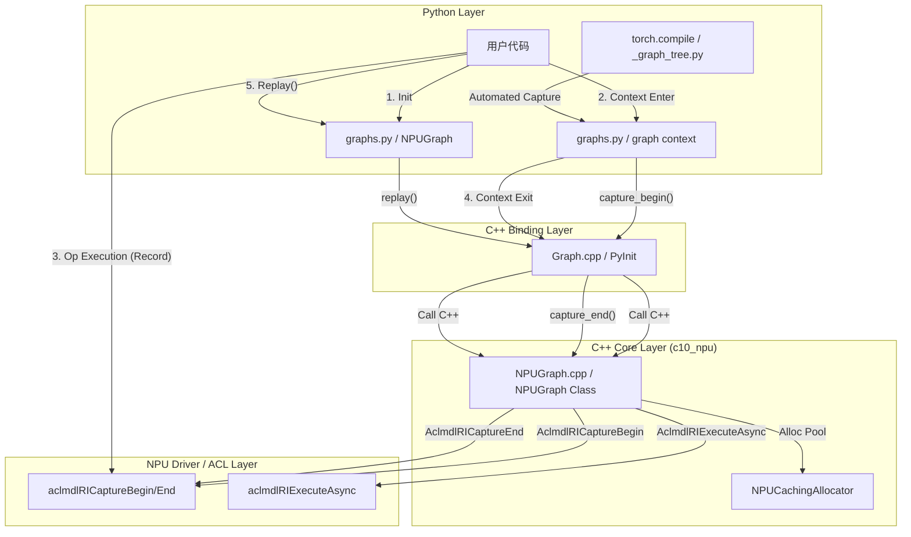
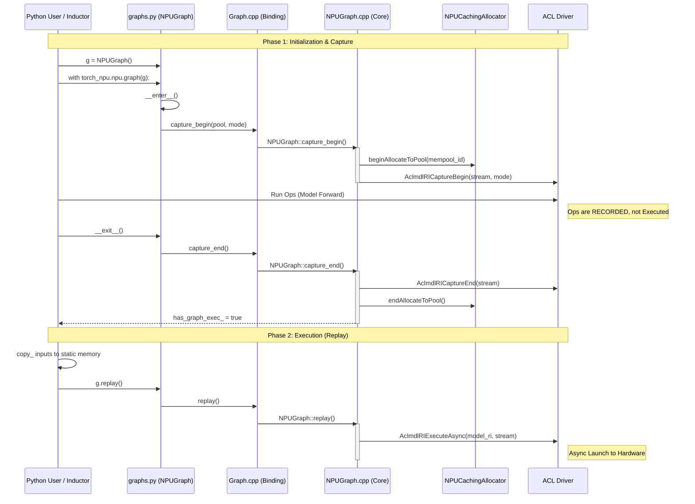

# PyTorch NPU Graphs (ACL Graph)

## 目标
梳理 PyTorch NPU Graphs 的实现原理和使用方法，并给出详细的代码示例（包含训练与推理）及端到端的架构分析。

> NPU Graphs 是 torch_npu 对应 CUDA Graphs 的实现，用于华为昇腾 NPU 设备的性能优化。与 CUDA Graphs 的 API 逐项对应关系、概念/架构/代码示例对比见 [[30_comparison]]。

## 1. 实现原理

PyTorch NPU Graphs 是一种基于 NPU 后端（aclgraph）的图模式执行机制，旨在通过将多个算子操作捕获并融合为一个静态图来减少 CPU Launch 开销，提高执行效率。其核心流程包括图捕获、图编译和图执行。

### 1.1 核心流程
1.  **图捕获 (Graph Capture)**:
    *   在 `torch_npu.npu.graph` 上下文管理器中，调用底层 ACL 接口将 Stream 置于捕获模式。
    *   所有下发的 NPU 算子不会立即执行，而是记录到 `NPUGraph` 对象中。
    *   底层使用 `AclmdlRICaptureBegin` 和 `AclmdlRICaptureEnd`。

2.  **图编译/构建**:
    *   捕获结束后，ACL 驱动会将录制的算子序列组织成 NPU 可识别的图结构（Model RI）。
    *   输入 Tensor 的内存地址通常需要是静态的（Static Memory Address）。

3.  **图执行 (Replay)**:
    *   通过 `NPUGraph.replay()` 触发 `AclmdlRIExecuteAsync`。
    *   一次系统调用即可下发整个计算图，极大降低 Host 端 CPU 负载。

## 2. 使用方法

### 2.1 训练场景 (Training)

参考 `make_graphed_callables` 或基础 `torch_npu.npu.graph` 用法（见上文基础文档）。

### 2.2 推理场景 (Inference)

在推理场景中，我们不需要处理反向传播（Backward），且通常结合 `torch.no_grad()` 使用。以下是使用 `NPUGraph` 进行高性能推理的完整示例。

```python
import torch
import torch_npu
import time

# 1. 定义推理模型
class InferenceNet(torch.nn.Module):
    def __init__(self):
        super().__init__()
        self.conv = torch.nn.Conv2d(3, 64, 3, padding=1)
        self.bn = torch.nn.BatchNorm2d(64)
        self.relu = torch.nn.ReLU()
        self.pool = torch.nn.AdaptiveAvgPool2d((1, 1))
        self.fc = torch.nn.Linear(64, 10)

    def forward(self, x):
        x = self.conv(x)
        x = self.bn(x)
        x = self.relu(x)
        x = self.pool(x)
        x = torch.flatten(x, 1)
        return self.fc(x)

# 初始化
device = "npu:0"
model = InferenceNet().to(device).eval()
B, C, H, W = 32, 3, 224, 224

# 2. 准备静态内存 (Static Memory)
# NPU Graph 录制的是固定的内存地址操作
static_input = torch.randn(B, C, H, W, device=device)
# 预先运行一次以分配输出内存（可选，但推荐）
with torch.no_grad():
    static_output = model(static_input)

# 3. 预热 (Warmup)
# 关键步骤：确保 lazy init 完成，cache 分配完毕
stream = torch_npu.npu.Stream()
stream.wait_stream(torch_npu.npu.current_stream())
with torch_npu.npu.stream(stream):
    with torch.no_grad():
        for _ in range(5):
            model(static_input)
torch_npu.npu.current_stream().wait_stream(stream)

# 4. 图捕获 (Capture)
g = torch_npu.npu.NPUGraph()

with torch.no_grad():
    # 开启捕获上下文
    with torch_npu.npu.graph(g):
        # 这里的计算逻辑会被录制
        # 注意：这里使用的是 static_input，录制的是对这块内存的操作
        final_out = model(static_input)

# 5. 推理执行 (Replay Loop)
# 模拟真实请求
num_requests = 100
real_inputs = [torch.randn(B, C, H, W, device=device) for _ in range(num_requests)]
results = []

print("Start Inference...")
t0 = time.time()
for i in range(num_requests):
    # (A) Data Copy: 将新数据拷贝到静态输入内存中
    static_input.copy_(real_inputs[i])

    # (B) Graph Replay: 下发整个图的执行指令
    g.replay()

    # (C) 获取结果: static_output (或 capture 时的返回 tensor) 中现在存储了计算结果
    # 注意：如果需要保留结果，需要 clone，否则会被下一次 replay 覆盖
    results.append(final_out.clone())

torch_npu.npu.synchronize()
print(f"Average time per batch: {(time.time() - t0) / num_requests * 1000:.2f} ms")
```

## 3. 端到端架构分析

基于提供的代码文件 `_graph_tree.py`, `graphs.py`, `Graph.cpp`, `NPUGraph.cpp`，我们将分析从 Python 前端到 C++ 后端再到 ACL 驱动的调用流程。

### 3.1 模块职责划分

1.  **Python User API (`graphs.py`)**:
    *   提供 `NPUGraph` 类封装和 `graph` 上下文管理器。
    *   处理 `make_graphed_callables` 高级接口。
    *   处理 Autograd 相关的逻辑 (`_GraphDispatchMode`)。

2.  **Inductor Integration (`_graph_tree.py`)**:
    *   这是 PyTorch 2.0 `torch.compile` (Inductor) 对接 NPU Graph 的桥梁。
    *   `npugraphify_impl`: 负责处理动态图转静态图的内存管理、Warmup 和 Graph Capture 的自动化流程。

3.  **C++ Binding (`Graph.cpp`)**:
    *   使用 Pybind11 将 C++ 类暴露给 Python。
    *   将 Python 的 `NPUGraph` 映射到 C++ 的 `c10_npu::NPUGraph`。

4.  **C++ Core Implementation (`NPUGraph.cpp`)**:
    *   实现具体的图管理逻辑。
    *   调用 ACL (Ascend Compute Library) 接口 (`aclmdlRICaptureBegin`, `aclmdlRIExecuteAsync` 等)。

### 3.2 调用流程图 (Flow Chart)



### 3.3 详细调用时序图 (Sequence Diagram)

下图展示了从 Python 端发起捕获到执行的完整时序。



### 3.4 关键调用栈分析 (Call Stack Analysis)

#### 1. 图捕获 (Capture) 调用栈
*   **Python**: `graphs.py:395` -> `self.npu_graph.capture_begin(...)`
*   **Binding**: `Graph.cpp:256` -> `.def("capture_begin", ...)` lambda wrapper
*   **C++ Core**: `NPUGraph.cpp:145` -> `NPUGraph::capture_begin`
    *   `NPUGraph.cpp:196`: 调用 `NPUCachingAllocator::beginAllocateToPool`，确保捕获期间的内存分配绑定到特定内存池。
    *   `NPUGraph.cpp:214`: 调用 `c10_npu::acl::AclmdlRICaptureBegin` 开启 ACL 录制模式。

#### 2. 图结束 (Capture End) 调用栈
*   **Python**: `graphs.py:400` -> `self.npu_graph.capture_end()`
*   **Binding**: `Graph.cpp:283` -> `&c10_npu::NPUGraph::capture_end`
*   **C++ Core**: `NPUGraph.cpp:221` -> `NPUGraph::capture_end`
    *   `NPUGraph.cpp:231`: 调用 `c10_npu::acl::AclmdlRICaptureEnd` 结束录制，获取 `model_ri` (Resource ID)。
    *   `NPUGraph.cpp:233`: `NPUCachingAllocator::endAllocateToPool`。
    *   `NPUGraph.cpp:246`: 设置 `has_graph_exec_ = true`。

#### 3. 图回放 (Replay) 调用栈
*   **Python**: `graphs.py:300` -> `super().replay()`
*   **Binding**: `Graph.cpp:295` -> `&c10_npu::NPUGraph::replay`
*   **C++ Core**: `NPUGraph.cpp:255` -> `NPUGraph::replay`
    *   `NPUGraph.cpp:267`: 调用 `c10_npu::acl::AclmdlRIExecuteAsync`。这是一个异步操作，仅下发任务 ID 到 Stream，CPU 消耗极低。

#### 4. Inductor 接入层 (`_graph_tree.py`)
这是 `torch.compile(backend="npu")` 或 Inductor 模式下使用 NPU Graph 的入口。
*   **Entry**: `npugraphify` (line 82) -> `npugraphify_impl` (line 125).
*   **Logic**:
    1.  **Memory Check**: 识别 `static_input_idxs`，处理内存对齐 (lines 133-137)。
    2.  **Warmup**: 创建私有 Stream，执行一次模型 (lines 163-178)，确保 lazy init 不被录制。
    3.  **Capture**: 实例化 `torch.npu.NPUGraph()`，使用 `with torch.npu.graph(...)` 捕获 `model` 的执行 (lines 181-183)。
    4.  **Codegen**: 返回 `run` 函数 (lines 218-227)，该函数内部执行 `index_expanded_dims_and_copy_` (内存拷贝) 然后调用 `graph.replay()`。

## 4. 使用限制与注意事项

1. **设备要求**: 需要华为昇腾 NPU 设备
2. **torch_npu 版本**: 需要支持 NPU Graphs 的 torch_npu 版本
3. **ACL 版本**: 需要支持图捕获的 ACL 版本
4. **静态形状**: 输入形状必须固定
5. **无控制流**: 不支持动态控制流

## Related Pages

- [[02_engineering/01_ai_frameworks/index]]
- [[11_torch_compile_npugraphs_deep_dive]]
- [[21_aclgraph_multistream_rng_analysis]] —— 多流 fork/join、Event 语义与 graph-safe RNG 算子适配
- [[30_comparison]]
