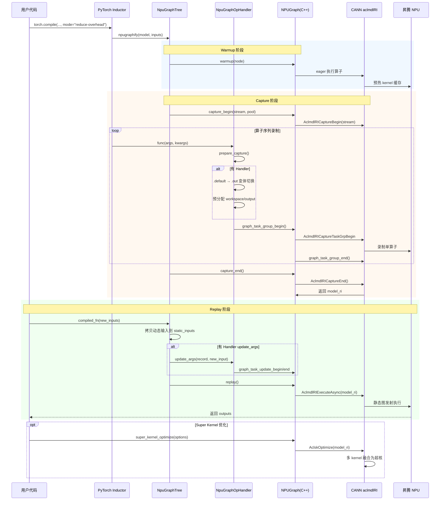
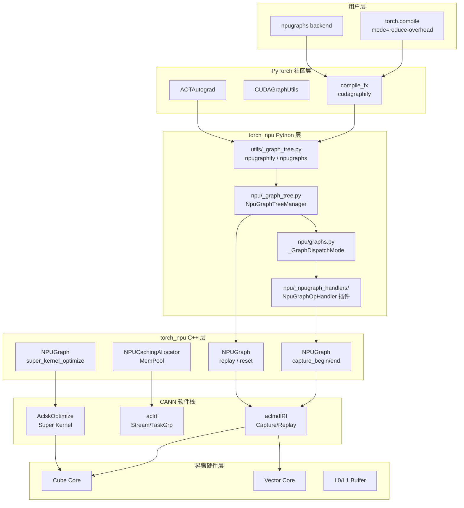

# torch.compile 路径分析（二）：ACLGraph 路径

> 分析对象：`torch.compile(..., mode="reduce-overhead")` 或 `cudagraphs` backend 触发的图捕获与重放机制
> 核心代码位置：`torch_npu/utils/_graph_tree.py`、`torch_npu/csrc/core/npu/NPUGraph.cpp`、
> `torch_npu/npu/_npugraph_handlers/`、`torch_npu/_inductor/__init__.py`
> 版本：torch_npu v2.7.1

---

## 一、路径概述

ACLGraph 是 torch_npu 对 PyTorch `CUDAGraph` 机制的适配实现。当用户通过 `torch.compile(..., mode="reduce-overhead")` 或使用 `npugraphs` backend 时，Inductor 编译后的 FX graph 会被包裹在 NPU graph capture/replay 框架中执行，以消除 Python 层 dispatch 和 host 端调度开销。

### 1.1 完整数据流

```
PyTorch Python Code
    ↓
Dynamo (bytecode → FX Graph)
    ↓
AOTAutograd (forward/backward 分离)
    ↓
Inductor 编译生成 kernel / extern call 序列
    ↓
ACLGraph Capture (warmup → capture_begin → 执行 → capture_end)
    ↓
ACLGraph Replay (输入更新 → replay → 输出返回)
    ↓
CANN Runtime (aclmdlRIExecuteAsync) → NPU 执行
```

### 1.2 与社区 CUDA Graph 的直观对比

| 阶段 | CUDA Graph | ACLGraph | 差异程度 |
|---|---|---|---|
| 图捕获 API | `cudaStreamBeginCapture` / `cudaGraphInstantiate` | `AclmdlRICaptureBegin` / `AclmdlRIExecuteAsync` | **极大**（不同闭源 SDK） |
| 图树管理 | `CUDAGraphTree` | `NpuGraphTree`（复刻 + 补丁） | 中等 |
| 算子 Handler | 无（纯 API 录制） | `NpuGraphOpHandler` 插件框架 | **大** |
| Super Kernel | CUDA Graph 无此概念 | `AclskOptimize` + `super_kernel_scope_*` | **大** |
| 内存池 | `cudaMallocAsync` + mempool | `NPUCachingAllocator` + `MemPool` | 中等 |
| 回调机制 | `cudaLaunchHostFunc` | `AclrtLaunchHostFunc` / `AclrtLaunchCallback` | 中等 |
| warmup 路径 | 标准 eager 执行 | `StaticKernelCompiler` 预编译 ACLNN | 中等 |
| 多流支持 | 单流 capture 为主 | 多流 + stream attribute 设置 | 中等 |

### 1.3 NPU 调用流程图



### 1.4 软件逻辑架构图



### 1.5 mode 参数与两条路径的触发关系

`torch.compile` 的 `mode` 参数只在 `backend="inductor"`（默认）时生效，用于控制 Inductor 的预设配置（`torch/_inductor/__init__.py` 的 `list_mode_options`）：

| mode | 对应 config | 是否触发 ACLGraph |
|---|---|---|
| `"default"` | `{}` | 不触发 |
| `"reduce-overhead"` | `{"triton.cudagraphs": True}` | **触发**（即本页分析对象） |
| `"max-autotune"` | `{"max_autotune": True, "triton.cudagraphs": True, "coordinate_descent_tuning": True}` | **触发**，额外做 Triton autotune + 坐标下降调优，录制进图的内核更优但编译更慢 |
| `"max-autotune-no-cudagraphs"` | `{"max_autotune": True, "coordinate_descent_tuning": True}` | 不触发 |

`mode="max-reduce"` 并非有效值，会抛出 `RuntimeError: Unrecognized mode=max-reduce`；需要"最大化减少开销"应使用 `"reduce-overhead"`。

`torch.compile` 按 `backend` 参数分发到两个不同的 Wrapper（`torch/__init__.py:2745-2751`）：

| | `_TorchCompileInductorWrapper`（`backend="inductor"`，默认，`torch/__init__.py:2384-2456`） | `_TorchCompileWrapper`（`backend="npugraphs"` 等非 inductor 后端） |
|---|---|---|
| mode 处理 | `apply_mode()` → `list_mode_options()` → 转成 Inductor `config_patches` | 原样存入 `kwargs["mode"]` 传给后端 |
| options 处理 | `apply_options()` → 校验后存入 config | 作为 `kwargs["options"]` 传给后端 |
| 调用目标 | `compile_fx(model_, inputs_, config_patches=self.config)` | `self.compiler_fn(model_, inputs_, **self.kwargs)` |
| reset 行为 | 调用 `reset_cudagraph_trees()` | 调用后端的 `reset()` 方法 |

当使用 `torch.compile(model, backend="npugraphs", mode="reduce-overhead")` 时：`_TorchCompileWrapper.__init__` 把 `mode` 存入 `self.kwargs = {"mode": "reduce-overhead"}`；`__call__` 时执行 `self.compiler_fn(model_, inputs_, mode="reduce-overhead")` → `NpugraphsBackend.__call__(model, inputs, mode="reduce-overhead")` → `npugraphs(model, inputs)`。但 `NpugraphsBackend.__call__` 的签名是 `def __call__(model, inputs)`，并不接受 `mode` 参数——按 Python 的函数调用机制，若该 `@staticmethod` 方法不接受额外 kwargs，这会导致 **TypeError**，而不是简单的"静默忽略"。因此 `mode` 参数在 `backend="npugraphs"` 时实际上**不应与非默认 mode 组合使用**，这是一个真实的 footgun——这是本页分析对象（路径 A：`mode="reduce-overhead"`，经 Inductor）与 [[torch_compile_npugraphs_deep_dive]] 正文分析对象（路径 B：`backend="npugraphs"`，绕开 Inductor）分道的起点，两条路径的完整对比见 §四·4.4。

---

## 二、为什么有这些差异？

### 2.1 底层 SDK 差异是根本驱动力

PyTorch CUDA Graph 建立在 NVIDIA 的 `cudaGraph*` API 之上，而 ACLGraph 建立在华为 CANN 的 **aclmdlRI**（Model Runtime Instance）API 之上。这是两套完全不同的闭源运行时抽象：

| 特性 | CUDA Graph | CANN aclmdlRI |
|---|---|---|
| 捕获粒度 | Stream-level API 录制 | Model-level 算子序列录制 |
| 执行接口 | `cudaGraphLaunch` | `AclmdlRIExecuteAsync` |
| 超核优化 | 无原生支持 | `AclskOptimize` 合并多个 kernel |
| 调试导出 | `cudaGraphDebugDotPrint` | `AclmdlRIDebugJsonPrint` |
| 任务分组 | 无 | `AclmdlRICaptureTaskGrpBegin/End` |

这导致**无法通过简单的 API 映射实现兼容**，必须在 C++ 和 Python 两层同时做适配。

### 2.2 十大关键差异点（带代码证据）

#### 差异 1：Python 层完全复刻并补丁 CUDAGraph 逻辑

**位置**：`torch_npu/utils/_graph_tree.py:371-378`

```python
def _apply_npugraph_tree_methods():
    register_backend(name="npugraphs", compiler_fn=NpugraphsBackend())
    torch._inductor.compile_fx.cudagraphify = npugraphify
    torch._inductor.cudagraph_utils.check_multiple_devices_or_any_cpu_nodes = check_multiple_devices_or_any_cpu_nodes
    torch.compiler.npugraph_mark_step_begin = npugraph_mark_step_begin
```

NPU 没有独立的 graph tree 注册接口，而是**直接 monkey-patch 上游的 cudagraphify 函数**。这意味着 ACLGraph 的激活依赖于替换 PyTorch 内部符号。

**为什么必须 patch**：社区 `cudagraphify` 在 `torch/_inductor/compile_fx.py` 中是模块级函数，没有 backend 注册机制，只能通过替换实现。

#### 差异 2：C++ 层使用 CANN 特有的 aclmdlRI API

**位置**：`torch_npu/csrc/core/npu/NPUGraph.cpp:235-252`

```cpp
void NPUGraph::capture_begin(MempoolId_t pool, aclmdlRICaptureMode capture_mode, bool report_shape)
{
    // ...
    NPU_CHECK_ERROR(c10_npu::acl::AclmdlRICaptureBegin(capture_stream_, capture_mode));
    aclmdlRICaptureStatus status;
    NPU_CHECK_ERROR(c10_npu::acl::AclmdlRICaptureGetInfo(stream, &status, &model_ri_));
    TORCH_INTERNAL_ASSERT(status == aclmdlRICaptureStatus::ACL_MODEL_RI_CAPTURE_STATUS_ACTIVE);
}

void NPUGraph::capture_end()
{
    // ...
    aclmdlRI model_ri;
    NPU_CHECK_ERROR(c10_npu::acl::AclmdlRICaptureEnd(capture_stream_, &model_ri));
    TORCH_CHECK(model_ri == model_ri_, "Invalid end capture model id: ", model_ri);
    has_graph_exec_ = true;
}

void NPUGraph::replay()
{
    // ...
    NPU_CHECK_ERROR(c10_npu::acl::AclmdlRIExecuteAsync(model_ri_, stream));
    if (c10_npu::option::OptionsManager::CheckBlockingEnable()) {
        NPU_CHECK_ERROR(c10_npu::acl::AclrtSynchronizeStreamWithTimeout(stream));
    }
}
```

CUDA Graph 使用 `cudaStreamBeginCapture` → `cudaGraphGetRootNode` → `cudaGraphInstantiate` → `cudaGraphLaunch` 四级 API，而 CANN 使用 `AclmdlRICaptureBegin` → `AclmdlRICaptureEnd` → `AclmdlRIExecuteAsync` 三级 API。**模型实例（model_ri）在 capture_begin 时即创建**，而非 CUDA 的 capture 结束后再 instantiate。

#### 差异 3：NPU Graph Op Handler 插件框架

**位置**：`torch_npu/npu/_npugraph_handlers/_fa3_graph_handler.py:33-89`

```python
@register_npu_graph_handler([
    "npu_fusion_attention_v3",
    "npu_fusion_attention_v3.default",
    "npu_fusion_attention_v3.out",
])
class FA3ForwardHandler(_FA3TensorListOutHandler):
    @classmethod
    def prepare_capture(cls, func, args, kwargs):
        func_out = torch_npu.npu_fusion_attention_v3.out
        # ... 预分配输出、计算 workspace、将 .default 切换到 .out 变体
        kwargs["workspace"] = workspace
        kwargs["out"] = [attention_score, softmax_max, softmax_sum, softmax_out, seed, offset]
        return func_out, args, kwargs
```

CUDA Graph 没有"算子 handler"概念——所有 CUDA API 调用都被录制即可。但 CANN 的**某些融合算子（如 FlashAttention v3）在图捕获时需要特殊处理**：
- 预分配输出 tensor（`.out` 变体）
- 计算并注入 workspace
- 更新动态序列长度参数
- 某些 layout + dropout 组合甚至直接报错要求 fallback

这是 ACLGraph 独有的**插件化预处理框架**。

#### 差异 4：Super Kernel 优化机制

**位置**：`torch_npu/csrc/core/npu/NPUGraph.cpp:312-317`

```cpp
void NPUGraph::super_kernel_optimize(const aclskOptions *options)
{
    TORCH_CHECK(has_graph_exec_, ...);
    NPU_CHECK_ERROR(c10_npu::skapi::AclskOptimize(model_ri_, options));
}
```

以及 `torch_npu/csrc/core/npu/NPUGraph.h:38-39`：

```cpp
TORCH_NPU_API void super_kernel_scope_begin(const char* scope_name);
TORCH_NPU_API void super_kernel_scope_end(const char* scope_name);
```

NPU 提供 **Super Kernel** 机制（`AclskOptimize`），可以将多个细粒度 CANN kernel 合并为一个大 kernel，减少 launch overhead。**CUDA 没有等价机制**。`super_kernel_scope_begin/end` 允许开发者在捕获时标记"可合并区域"。

#### 差异 5：静态 kernel 编译器（StaticKernelCompiler）

**位置**：`torch_npu/utils/_graph_tree.py:176-184`

```python
if torch_npu.npu.aclnn._use_static_aclnn_kernel:
    from torch_npu._inductor.npu_static_kernel import StaticKernelCompiler
    static_kernel_complier = StaticKernelCompiler()
    with static_kernel_complier:
        with torch.npu.stream(stream):
            model(list(static_inputs))
else:
    with torch.npu.stream(stream):
        model(list(static_inputs))
```

在 warmup 阶段，NPU 可以选择使用 **StaticKernelCompiler** 将 ACLNN kernel 提前编译为静态二进制，以确保 capture 时的 kernel 序列与 replay 时完全一致。CUDA warmup 就是标准 eager 执行，不需要这种预编译包装器。

#### 差异 6：任务分组（Task Group）与动态更新

**位置**：`torch_npu/csrc/core/npu/NPUGraph.cpp:49-71`

```cpp
void graph_task_group_begin(c10_npu::NPUStream stream)
{
    NPU_CHECK_ERROR(c10_npu::acl::AclmdlRICaptureTaskGrpBegin(stream));
}

NPUTaskGroupHandle graph_task_group_end(c10_npu::NPUStream stream)
{
    aclrtTaskGrp group;
    NPU_CHECK_ERROR(c10_npu::acl::AclmdlRICaptureTaskGrpEnd(stream, &group));
    // ...
}

void graph_task_update_begin(c10_npu::NPUStream stream, NPUTaskGroupHandle handle)
{
    NPU_CHECK_ERROR(c10_npu::acl::AclmdlRICaptureTaskUpdateBegin(stream, handle.task_group));
}
```

CANN 支持**任务分组捕获**和**分组动态更新**。这使得部分子图可以在不重新捕获整个 graph 的情况下被替换。CUDA Graph 在 CUDA 12.x 之前没有这种"部分更新"能力（CUDA Graph 有条件节点但语义不同）。

#### 差异 7：Stream Attribute 的 Cache Op Info 设置

**位置**：`torch_npu/csrc/core/npu/NPUGraph.cpp:23-38`

```cpp
void apply_cache_op_info(aclrtStream stream, bool enabled)
{
    if (!IsGteCANNVersion("8.5.0", "CANN")) {
        return;
    }
    aclrtStreamAttrValue val;
    val.cacheOpInfoSwitch = static_cast<uint32_t>(enabled ? 1u : 0u);
    int32_t ret = c10_npu::acl::AclrtSetStreamAttribute(
        stream, aclrtStreamAttr::ACL_STREAM_ATTR_CACHE_OP_IFNO, &val);
    // ...
}
```

NPU 在 capture 前后需要设置 stream 的 `cacheOpInfoSwitch` 属性，这是 CANN 8.5.0+ 引入的**算子信息缓存开关**。CUDA 没有这种 stream-level 的 capture 辅助属性。

#### 差异 8：CPU 输入检查可禁用

**位置**：`torch_npu/utils/_graph_tree.py:65-88`

```python
def check_multiple_devices_or_any_cpu_nodes(device_node_mapping):
    from torch_npu._inductor import config as npu_config
    if npu_config.npugraph_trees.disable_cpu_input_check:
        device_node_mapping.pop(torch.device("cpu"), None)
    # ...
```

NPU Graph 允许通过配置**禁用 CPU 输入检查**，而 CUDA Graph 的 CPU 节点检查是硬编码的。这反映了 NPU 场景下 CPU tensor 作为输入的常见需求（如小尺寸 scalar tensor）。

#### 差异 9：Generator / RNG 状态管理差异

**位置**：`torch_npu/csrc/core/npu/NPUGraph.cpp:160-164`

```cpp
void NPUGraph::register_generator_state(const at::Generator& generator)
{
    c10::intrusive_ptr<at_npu::NPUGeneratorImpl> npu_gen =
        c10::dynamic_intrusive_pointer_cast<at_npu::NPUGeneratorImpl>(generator.getIntrusivePtr());
    npu_gen->register_graph(this);
}
```

NPU 使用 `NPUGeneratorImpl` 替代了 CUDA 的 `CUDAGeneratorImpl`。虽然两者都实现了"per-graph RNG offset"机制，但 NPU 的 secondary stream capture state 管理（`set_secondary_stream_capture_state`）是**NPU 特有的**，用于处理多流场景下的随机数同步。

多流并不是捕获多个子图后合并，而是通过 Event Record/Wait 把其他 stream 纳入同一个 `model_ri_`；RNG 则通过 device seed/offset tensor 让每次 replay 推进状态。两者及 dropout 的联合路径详见 [[aclgraph_multistream_rng_analysis]]。

#### 差异 10：NPU Graph  Trees 的独立管理器

**位置**：`torch_npu/npu/_graph_tree.py`（由 `_graph_tree.py` 导入）

NPU 没有复用 `torch._C._cuda_cudaHostFromDeviceDiskFile` 等 CUDA 专用 C++ 对象，而是实现了独立的 `NpuGraphTree` 管理器（C++ + Python 绑定）。这导致：
- 独立的 `mark_step_begin()`
- 独立的 `get_manager()` / `reset_npugraph_trees()`
- 独立的 `npugraphify_impl`（支持 tree-based memory pooling）

---

## 三、实现思路是否遵循社区逻辑？

### 3.1 "遵循社区逻辑"的部分

| 组件 | 遵循方式 |
|---|---|
| **图树抽象** | 完全复刻 CUDAGraphTree 的"树状图 + memory pool 共享"设计 |
| **warmup → capture → replay 三阶段** | 与 CUDA Graph 的执行模型一致 |
| **静态输入检测** | 复用 `get_input_idxs_to_check`、`remove_unaligned_input_idxs` 等工具函数 |
| **输入 mutation 检查** | 复用 `check_for_mutation_ignore_cuda_graph_managed_tensor` |
| **BoxedBool / BoxedDeviceIndex** | 复用社区的 boxed 状态传递机制 |

### 3.2 "打破社区逻辑"的部分

| 组件 | 打破方式 | 原因 |
|---|---|---|
| **激活方式** | Monkey-patch `torch._inductor.compile_fx.cudagraphify` | 社区没有 device-agnostic 的 graph backend 注册接口 |
| **C++ API** | 完全替换为 CANN aclmdlRI | NVIDIA CUDA Graph API 与 CANN 无交集 |
| **算子预处理** | `NpuGraphOpHandler` 插件框架 | CANN 融合算子需要预分配和变体切换 |
| **warmup** | 引入 `StaticKernelCompiler` | 确保 ACLNN 在 capture 前已静态编译 |
| **调试导出** | JSON 格式而非 DOT 格式 | CANN 调试工具链输出 JSON |

### 3.3 总体判断

ACLGraph 路径在**用户语义**上完全遵循了社区 CUDA Graph 的设计（warmup/capture/replay、图树、memory pool），但在**实现层**上因 CANN SDK 差异而不得不全面替换底层 API。Python 层的复刻程度很高（`_graph_tree.py` 几乎是 CUDAGraphTree 的 NPU 翻译版），C++ 层则是独立实现。

---

## 四、这条路径为什么会存在？

### 4.1 它解决的问题

1. **消除 host 端调度开销**：对于小 kernel 密集的模型（如 Transformer inference），Python → C++ → CANN 的 dispatch 链开销占比很高，graph replay 可以将其压缩到一次 `AclmdlRIExecuteAsync` 调用。
2. **固定内存地址**：graph capture 要求输入/输出 tensor 的内存地址稳定，这配合 `NPUCachingAllocator` 的 memory pool 机制显著降低了动态分配开销。
3. **Super Kernel 优化**：通过 `AclskOptimize` 将多个细粒度 kernel 合并，进一步提升执行效率。

### 4.2 它的优势和劣势

**优势**：
- 与 `torch.compile(..., mode="reduce-overhead")` 完全兼容，用户无感知
- 推理延迟显著降低（典型提升 10%-30%）
- 支持 forward + backward graph capture
- Super Kernel 可进一步压缩 kernel launch gap

**劣势**：
- **内存占用高**：static input/output + workspace + memory pool 预留，峰值内存通常比 eager 大
- **动态形状不友好**：graph 要求输入形状固定，dynamic shapes 会导致频繁 re-capture
- **部分算子不支持**：某些 layout 组合或 dropout 配置会触发 handler 报错（如 FA3 TND + dropout）
- **调试困难**：CANN JSON 调试输出不如 CUDA Graph DOT 可视化成熟

### 4.3 用户选择这条路径的场景

- **推理优化**：固定 batch size、固定 sequence length 的部署场景
- **小规模 kernel 密集模型**：元素级操作多、kernel launch overhead 占比高的模型
- **训练中的 static 部分**：如 optimizer step、loss scaling 等固定计算图

### 4.4 与 backend="npugraphs" 路径（路径 B）的对比

路径 A（`mode="reduce-overhead"`，本页分析对象）在进入 NPU Graph Tree 前先经过完整的 Inductor 编译，逐 Phase 源码定位：

| Phase | 组件 | 代码位置 | 作用 |
|---|---|---|---|
| 1 | `_TorchCompileInductorWrapper.__init__` | `torch/__init__.py:2384-2456` | `apply_mode("reduce-overhead")` → `list_mode_options()` → `self.config = {"triton.cudagraphs": True}`（见 §1.5） |
| 2 | `compile_fx` | `torch/_inductor/compile_fx.py`（第2483行） | 递归应用 `config_patches`：`config.patch({"triton.cudagraphs": True})` 在整个编译过程全局生效 |
| 3 | `_compile_fx_main` | `compile_fx.py`（第2650行） | pre-grad passes → 构造 `fw_compiler`/`bw_compiler`/`inference_compiler` → `aot_autograd(..., cudagraphs=BoxedBool(True))` |
| 4 | `_compile_fx_inner`（Inductor Codegen） | `compile_fx.py`（第829行） | `graph_lowering` → Scheduling（算子融合/内存规划）→ Triton/C++ Codegen，产出 `CompiledFxGraph`（`current_callable` + `cudagraph_info`） |
| 5 | `cudagraph_post_compile` | `torch/_inductor/output_code.py`（第195行） | 检查 `cudagraph_fail_reasons`；可行则把 `current_callable`（Triton 内核）传入 `cudagraphify`（已被 torch_npu monkey-patch 为 `npugraphify`，见 §二·差异1）包装进 NPU Graph；不可行则 `BoxedBool.disable(cudagraphs)` 退化为普通执行 |
| 6-8 | NPU Graph Tree（与路径 B 共享） | `torch_npu/npu/_graph_tree.py` | Warmup → Record → Replay，与 [[torch_compile_npugraphs_deep_dive]] 正文 Phase 5-8（§2.5-2.8）完全相同的实现 |

Phase 4 的 Inductor 编译阶段是路径 B 没有的，各阶段对性能的影响：

| 优化阶段 | 说明 | 对性能的影响 |
|---|---|---|
| **Pre-grad passes** | 图级别优化（常量折叠、死代码消除等） | 减少计算量 |
| **Joint graph passes** | 联合前反向图优化（重计算策略等） | 优化内存/计算平衡 |
| **Post-grad passes** | 后梯度优化（算子融合、布局优化等） | 减少内核数量 |
| **Scheduling** | 算子融合（pointwise fusion、reduction fusion 等）、内存规划 | 显著减少内核启动次数 |
| **Triton Codegen** | 生成高性能 Triton GPGPU 内核 | 单内核执行效率更高 |
| **Memory Planning** | 静态内存分配、buffer 复用 | 减少内存碎片 |

路径 B（`backend="npugraphs"`，详见 [[torch_compile_npugraphs_deep_dive]] 正文）跳过 Phase 2-5，AOT Autograd 分离出前向/反向后直接用 `boxed_nop` 解释执行原始 FX 图，再进入同一套 Phase 6-8 Graph Tree。两条路径录制进图的内容、稳态表现差异：

| 维度 | 路径 A：`mode="reduce-overhead"` | 路径 B：`backend="npugraphs"` |
|---|---|---|
| 录制进图的内容 | 少量融合 Triton/C++ 内核（如 `fused_matmul_add_relu`） | 大量原始 aten op（`matmul` → `add` → `relu` → … 逐个） |
| 稳态 NPU 利用率 | 高（内核少、计算密度高） | 中（内核多、launch 数量大；两者的 CPU dispatch 开销均已被 `graph.replay()` 消除） |
| 编译耗时 | 长（Inductor codegen + Graph 录制） | 短（仅 AOT 分解 + Graph 录制） |
| 首次执行延迟 | 高（Triton 编译 + warmup + recording） | 中（warmup + recording） |
| 内存占用 | 较高（Triton 编译缓存 + Graph 内存池） | 较低（仅 Graph 内存池） |
| 典型定位 | 生产部署（推理/训练稳态性能优先） | 调试、baseline、快速验证 NPU Graph 兼容性 |

Graph 捕获失败时的回退，按触发场景细分：

| 场景 | 路径 A | 路径 B |
|---|---|---|
| NPU Graph 捕获失败（泛化场景） | 回退到 Inductor 编译后的 Triton 内核（仍然很快） | 回退到 `boxed_nop`（FX 图解释执行，较慢） |
| 包含 CPU 节点 | 跳过 `cudagraph_post_compile`，直接执行 Triton 内核 | `check_for_skip` 返回 skip_msg，回退到 `interp` |
| 输入 mutation | 可能跳过整个图或部分图的 cudagraph 包装 | `BoxedBool.disable(do_npugraphs)` 跳过 Graph |

一句话：路径 A = "优化内核 + 快速启动"，路径 B = "原始内核 + 快速启动"。选型场景：
- 优先用路径 A（`mode="reduce-overhead"`）：大模型推理（Triton 融合 + Graph replay → 极低延迟）、训练循环（前反向均优化）、稳定生产环境（编译一次，持续高效执行）、对首次编译延迟不敏感的场景；能接受更长首次编译再叠加 autotune 选 `mode="max-autotune"`。
- 优先用路径 B（`backend="npugraphs"`）：调试和开发阶段（编译快，问题定位容易）、作为性能 baseline（隔离 Inductor 优化的效果）、Inductor 不支持的特殊算子场景、快速验证 NPU Graph 兼容性。
- 不需要 NPU Graph 加速 → `mode="default"`（仅 Inductor 优化，不触发 ACLGraph，见 §1.5）

核心文件索引：

| 文件 | 路径 A 角色 | 路径 B 角色 |
|---|---|---|
| `torch/__init__.py` | `_TorchCompileInductorWrapper` 创建与配置 | `_TorchCompileWrapper` 创建 |
| `torch/_inductor/__init__.py` | `list_mode_options()` mode→config 映射 | 不涉及 |
| `torch/_inductor/compile_fx.py` | `compile_fx` 主编译入口 + `cudagraphify` 定义 | 不涉及（被绕过） |
| `torch/_inductor/output_code.py` | `cudagraph_post_compile` NPU Graph 包装 | 不涉及 |
| `torch/_dynamo/backends/inductor.py` | `inductor` 后端注册 | 不涉及 |
| `torch_npu/utils/_graph_tree.py` | `npugraphify`（monkey-patch）+ `npugraphs` 后端注册 | `NpugraphsBackend` + `npugraphs()` 函数 |
| `torch_npu/npu/_graph_tree.py` | NPU Graph Tree 核心（共享） | NPU Graph Tree 核心（共享） |

---

## 五、后续如何演进贴近社区？

### 5.1 短期（v2.9.0 / master 已在推进）

| 演进动作 | 状态 | 效果 |
|---|---|---|
| 将 ACLGraph patch 归入 `patch_torch_for_aoti()` | v2.9.0 已做 | 非核心 patch 可一键禁用，便于切换 backend |
| `NPUDeviceOpOverrides` 替代部分 stream 相关 patch | v2.9.0 已做 | 减少 monkey-patch 数量 |
| `_compat` 兼容层隔离版本差异 | master 已做 | 上游 cudagraph_utils 变化时降低同步成本 |

### 5.2 中期（建议）

#### A. 推动社区定义 device-agnostic 的 Graph Backend 接口

当前最大的架构债务是 **monkey-patch `cudagraphify`**。建议推动社区：

```python
# 理想中的社区接口
torch._inductor.compile_fx.register_graph_backend("npu", npugraphify)
```

而非直接替换函数指针。这可以将 ACLGraph 从"hack"变为"plugin"。

#### B. 统一 CUDAGraph / ACLGraph 的 Python 抽象

PyTorch 社区正在讨论将 `CUDAGraph` 重命名为 `DeviceGraph`。如果社区能接受：
- `torch._C._cuda_cudaHostFromDeviceDiskFile` → `torch._C._graph_*`
- `cudagraph_trees` → `graph_trees`
- `CUDAGraphTree` → `GraphTree`

则 torch_npu 可以删除 `check_multiple_devices_or_any_cpu_nodes` 等 patch，直接注册 NPU 实现。

#### C. 完善 NpuGraphOpHandler 的 fallback 策略

当前某些 handler（如 FA3 TND + dropout）直接抛 `RuntimeError` 要求用户手动 partition。应改为：
1. 自动触发 graph partition，将该 op 移出 graph capture 范围
2. 提供清晰的日志说明哪些算子被移出及原因

### 5.3 长期（架构演进）

#### A. 让 ACLGraph 支持 Dynamic Shapes

CUDA 在 CUDA 12.x 引入了 **cudaGraphConditionalNodes** 和 **cudaGraphNodeSetEnabled**，允许一定程度的动态控制流。CANN 的 task group update 机制（`graph_task_update_begin/end`）可能可以用于实现类似功能。如果能实现：
- 基于形状的 graph 缓存池（shape-keyed graph pool）
- 或基于 task group 的动态子图替换

则可大幅扩展 ACLGraph 在 dynamic shape 场景（如 NLP variable length）的适用性。

#### B. 与 torchair 图编译器协同

ACLGraph 目前仅捕获**运行时算子调度序列**，不做图层面的优化。而 torchair 在编译期即可做算子融合、内存优化、并行策略选择。如果能：
1. 让 torchair 编译后的图作为一个整体被 ACLGraph capture
2. 在 torchair 编译期就生成"graph-friendly"的算子序列（预分配 workspace、固定输出格式）

则 ACLGraph 的 handler 复杂度将大幅降低，甚至可以取消 `NpuGraphOpHandler` 框架。

---

#### 差异 8：aclop/aclnn 捕获门禁 — 只有 aclnn 算子能入图（2026-06-13 补，源码 a6655d4）

**位置**：`torch_npu/csrc/framework/OpCommand.cpp:129-228`、`torch_npu/csrc/core/npu/NPUGraphsUtils.h:93-105`

这是 ACLGraph **最关键、CUDA 完全没有**的一道捕获资格门禁。NPU 算子有两条执行路径，捕获期待遇相反：

```cpp
// OpCommand.cpp:129  aclop 路径
void OpCommand::Run() {
    if (aclCmd->CheckCustomHandlerNull()) {        // :132 真 aclop(无 opapi 自定义句柄)
        at_npu::aclops::LazyInitAclops();           // :135
        AclSetCompileopt(ACL_OP_JIT_COMPILE, ...);  // :137 运行时 JIT 编译!
        c10_npu::assertNotCapturingAclop(...);      // :139 捕获中 → 直接报错
    }
    ...
}
// OpCommand.cpp:183  aclnn(opapi)路径 —— 无 assertNotCapturing，可入图
void OpCommand::RunOpApi(...) { ... }
```

- **根因**：aclop 在执行期做**主机侧 JIT 编译**（`:135-137`），而 capture 只记录 device 任务下发，host 侧 JIT 行为无法被录制 → 必须禁止；aclnn 是预编译 kernel，纯下发，故可捕获。
- **internal format 放大**：私有格式（NZ 等）常把算子打到 aclop 路径，故报错提示 `torch.npu.config.allow_internal_format = False`（`NPUGraphsUtils.h:100`），逼出 aclnn。
- **官方口径**：`pytorch_compile_npugraph_desc.md:53` "仅支持 NN 算子：所有算子必须为 aclnn 算子方可入图"。
- **与 fallback 关连通**：见 [[npu_lowering_guide]] §9——**一个 fallback 到 aclop 的算子，既破坏 inductor 融合，又会直接让 aclgraph 捕获报错**；走 aclnn 的 `ExternKernel` 则两关都安全。aclnn/aclop 是 inductor fallback 关与 aclgraph 捕获关的公共枢纽。

**capture_begin 的其它硬前置**（`NPUGraph.cpp`，均无 CUDA 对应或语义不同）：

| 门禁 | 行号 | 说明 |
|---|---|---|
| `TASK_QUEUE_ENABLE != 2` | :170-173 | NPU 二级流水 Level 2 与捕获不兼容，须 export 为 0/1（纯 NPU 概念） |
| 非默认流 | :181-184 | 须在非默认流捕获（同 CUDA `cudaStreamCaptureModeGlobal`） |
| 能力门 `IsCaptureSupported()` | NPUGraphsUtils.cpp:7 | CANN/硬件不支持时捕获状态恒 `None`，等于禁用 graph |

此外 RNG 状态变更在捕获期也被禁（`NPUGeneratorImpl.cpp` 的 register_state / seed / set_offset / clone 等挂 `assertNotCapturing`，`:139/269/301/484/517`），须走 graph-safe RNG 协作（`NPUGraph.cpp:188-195` 注册 generator + `capture_prologue/epilogue`）。

> [!note] 与 [[comparison]] 的出入已订正
> [[comparison]]「捕获/执行时序差异」表已按本页差异 2/8 核验：① aclop 在捕获期被 `assertNotCapturingAclop` 禁止（`OpCommand.cpp:139`），真正入图的是 aclnn；② `model_ri` 在 `capture_begin` 即创建（本页三·差异 2），torch_npu 路径中**无独立 instantiate**。comparison 页不再重复画简化时序图，直接引用本页差异 2/8 结论。

---

## 六、总结

ACLGraph 是 torch_npu 与社区差异**中等但很关键**的一条路径。它的核心差异来源于 **CANN aclmdlRI API 与 CUDA Graph API 的本质不同**，而非 Inductor 层面的设计分歧。

**演进优先级**：
1. 🔴 **最高**：推动社区定义 device-agnostic graph backend 注册接口（替代 `cudagraphify` patch）
2. 🟠 **高**：完善 `NpuGraphOpHandler` 的自动 partition fallback（替代硬抛异常）
3. 🟡 **中**：探索 task group update 实现 dynamic shape 支持
4. 🟢 **低**：与 torchair 编译器协同，从源头降低 capture 复杂度

---

## Related Pages

- [[npu_compile_paths_overview]] — torch_npu 三条编译路径全景概览（上级分析）
- [[aclgraph]] — ACL Graph 基础集成（已有页面）
- [[comparison]] — CUDA Graphs vs NPU Graphs 特性对比
- [[torch_compile_npugraphs_deep_dive]] — NPU Graphs 与 torch.compile 集成深度分析；§3.4-3.8 内存管理与复用；reduce_overhead vs npugraphs 对比
- [[aclgraph_multistream_rng_analysis]] — 多流依赖、通信流边界与 graph-safe RNG 算子适配
- [[npu_lowering_guide]] — NPU lowering 与 fallback（§9）；差异 8 的 aclnn/aclop 把 fallback 关与捕获关连通
