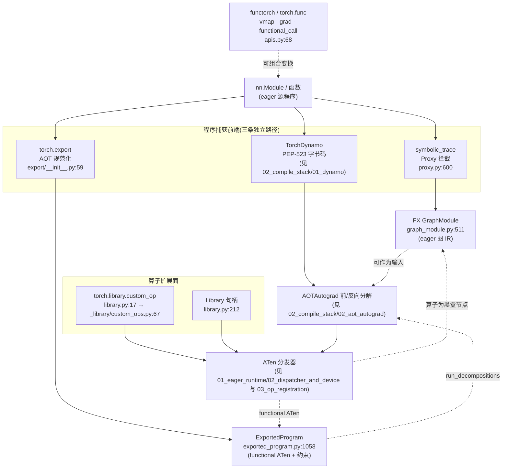
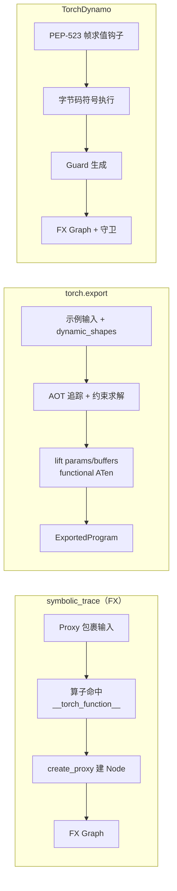

# 01 · FX 图 IR · torch.export · 算子扩展 — 目录索引

> 层次:overview(浅)
> 核验基准:PyTorch upstream `E:\97-codes\pytorch\pytorch`(v2.13.0a0, commit 9922478)
> 最后更新:2026-07-27

---

## 模块概述

本模块覆盖 PyTorch 中**不依赖 `torch.compile` 字节码栈**的那一组「程序捕获 + 程序变换 + 程序扩展」能力。它们各自独立成体系,却又共享同一套底层基础设施(`__torch_function__` 覆盖、ATen 分发器、FX IR),理解它们的边界与接入点,是看懂整条编译/导出/扩展链路的关键。

四个子主题、一句话定位:

- **torch.fx** —— PyTorch 的 **eager 图 IR**。通过 `symbolic_trace` 把一次符号执行记录成一张可读、可改写、可重新生成 Python 源码的 `Graph` / `GraphModule`。它是「在 Python 层做图变换」的标准底座。公开 API 面见 `torch/fx/__init__.py:103`(`__all__`),核心数据结构 `Graph` 在 `torch/fx/graph.py:1307`、`GraphModule` 在 `torch/fx/graph_module.py:511`。
- **torch.export** —— **AOT 规范化**前端。`export()` 把一个 `nn.Module` 提前(ahead-of-time)规范化成 `ExportedProgram`:functional ATen 算子集、消除 Python 控制流/数据结构、参数/buffer 被「lifted」成显式图输入,并把形状假设记录为 `range_constraints` 约束。入口 `torch/export/__init__.py:59`,产物类 `torch/export/exported_program.py:1058`。
- **torch.library / custom_op** —— **算子扩展面**。向 ATen 分发器注册新算子(定义 schema + 为各后端/子系统注册实现),使自定义 kernel 成为 autograd / torch.compile / export / FX 都能正确处理的「一等公民」。现代入口 `torch.library.custom_op`(从 `torch/library.py:17` 再导出,真实实现 `torch/_library/custom_ops.py:67`),底层句柄 `Library` 在 `torch/library.py:212`。
- **functorch(torch.func)** —— **可组合函数变换**。`vmap` 自动向量化、`grad` 函数式求导、`functional_call` 用外部参数 dict 做无状态调用。锚点:`vmap` 在 `torch/_functorch/apis.py:68`,`functional_call` 在 `torch/_functorch/functional_call.py:13`。

### 为什么把它们放在一起

这四者的共同点是:**都在 eager Python 层工作,都最终落到同一套 ATen 算子/分发器之上**,且都不经过 Dynamo 的 PEP-523 帧求值。它们之间是「上下游 + 互补」关系:

- FX 提供 IR 与变换框架;`torch.export` 的产物 `ExportedProgram` 内部正是持有一张 `torch.fx.Graph`。
- `custom_op` 注册的算子,对 FX 追踪与 export 是**不透明黑盒**(不会被错误内联),因此能被这两条捕获路径安全地记录为单个节点。
- functorch 的变换与上述捕获正交,可叠加使用(如对 export 前的模型做 `vmap`/`grad`)。

### 全景图

---

## 三条图捕获路径的对比

理解本模块最重要的一点:**FX、torch.export、Dynamo 是三种不同层次、不同机制的「程序捕获」**。它们常被混淆,但取舍完全不同。

| 维度 | symbolic_trace(FX) | torch.export | TorchDynamo |
|------|---------------------|--------------|-------------|
| 捕获层次 | eager Python 层(不碰解释器) | eager + AOT 规范化 | CPython 字节码层 |
| 捕获机制 | `Tensor.__torch_function__` + `Proxy` 魔术方法重载(`proxy.py:600`) | 内部走追踪 + 形状约束求解(`export/__init__.py:59`) | PEP-523 帧求值钩子 + 字节码符号执行(见 [[02_compile_stack/01_dynamo/index]]) |
| 产物 | `GraphModule`(可重生成 Python 源码,`graph_module.py:511`) | `ExportedProgram`(可序列化,`exported_program.py:1058`) | FX `Graph` + Guards |
| 算子集 | 原始算子(call_function/call_module 等) | functional ATen 算子集 | 原始算子,交给下游 AOTAutograd 分解 |
| 形状/约束 | 无;按追踪时的具体值 | `range_constraints` + `Dim` 显式声明动态维 | Guard 隐式编码假设,失败即重编译 |
| 控制流 | **不支持**数据依赖控制流(`Proxy` 不可布尔化/迭代) | 用 `Dim`/约束 + 控制流算子规范化,AOT 健全性保证 | graph break 后回退 eager |
| 失败/逃逸 | 不可追踪逻辑需 `fx.wrap` / leaf module 边界 | 约束冲突直接报错并给修复建议 | graph break / `disable` 逃生阀 |
| 典型用途 | 量化、图改写、自定义 pass、可视化 | 部署、序列化、跨运行时移植、AOTInductor | `torch.compile` 即时加速 |

要点:**FX 轻、可读、可改写,但看不到控制流;export 重、健全、可序列化,把形状假设固化成约束;Dynamo 兜底任意 Python,但以 graph break 为代价。** 三者并非替代关系——例如 `ExportedProgram` 内部持有的就是一张 FX `Graph`,而 Dynamo 捕获后同样产出 FX IR 再交给下游。

---

## 接入点:它们在编译/分发栈中的位置

- **接 [[02_compile_stack/01_dynamo/index]]**:Dynamo 是第四条捕获路径(字节码层),与 `symbolic_trace`/`export` 形成对照——同样产出 FX IR,但机制是 PEP-523 帧求值而非 Proxy 拦截。理解三者差异是看懂 `torch.compile` 前端的前提。
- **接 [[02_compile_stack/02_aot_autograd/index]]**:`ExportedProgram.run_decompositions` 把图进一步分解到更小的 ATen 算子集,与 AOTAutograd 的前/反向分解共用 decomposition 机制;FX `GraphModule` 亦可作为下游分解/编译的输入。
- **接 [[01_eager_runtime/03_op_registration/index]] / [[01_eager_runtime/02_dispatcher_and_device/index]]**:`torch.library` / `custom_op` 注册的算子最终落到 ATen 分发器;`Library` 句柄(`library.py:212`)是对 C++ 分发器的 Python 包装(kind ∈ DEF / IMPL / FRAGMENT)。export 产物所用的「functional ATen 算子集」也由分发器定义。custom_op 的「不透明黑盒」语义,正是为了让分发器一等公民的算子在 FX 追踪/export 中被记录为单节点。

---

## 页面列表(按层次)

| 页面 | 层次 | 核心主题 |
|------|------|---------|
| [[fx_export_custom_op_quickstart]] | **保留的 quick start** | 最小可用路径:`symbolic_trace` + 遍历/插点改写 `Graph` + `recompile`/`lint`;写一个 `PassBase`;`export` + `dynamic_shapes`(`Dim`)+ 查看 `graph_signature`/`range_constraints`/`module()`;用 `torch.library.custom_op` + `register_kernel`/`register_fake` 注册算子;`vmap`/`functional_call` 用法 |
| [[fx_graph_export_and_custom_ops_analysis]] | **保留的 deep dive** | 源码级:Proxy 拦截与 `TracerBase.create_proxy`、Node/Graph 双向链表 IR 与 use-def、`GraphModule` 代码生成 + linecache、`PassBase.__call__` 前置/变换/后置、`ExportedProgram` 的 lifted params/buffers 与约束、`Library`/`custom_op` 的分发与 autograd 桥接、functorch 的 BatchedTensor 语义 |
| [[custom_operators_fake_kernels_and_decompositions_analysis]] | deep dive(专题) | custom op 作为"编译器边界契约"的深度分析:fake kernel 正确性要求、mutation/version 与 ADInplaceOrView、decomposition/direct lowering/fallback 的选择、失败定位分层、测试矩阵;2026-07-30 迁入,与上一篇 §7 判重后保留独立(独有内容 >50%),详见页头判重结论 |
| [[02_compile_stack/03_graph_ir_and_passes/index]] | **cross-domain reference** | FX 图的数据结构、改图原语、PatternMatcher/DCE/保序与合法性验证全套索引(AOT 正反向分图见 [[02_compile_stack/02_aot_autograd/index]] 的 [[aotautograd_joint_forward_backward_graphs_analysis]]/[[saved_tensors_recompute_and_runtime_abi_analysis]]) |
| [[19_torch_compile_end_to_end/00_pytorch_graph_series_index]] | **current source-faithful series** | 图 IR 设计动机、FX 数据结构/值语义、捕获与规范化、改图原语、PatternMatcher、DCE/保序、合法性与复杂度；旧页冲突时以此系列的固定源码定位为准 |

---

## 关联域

- [[02_compile_stack/01_dynamo/index]] — 第四条捕获路径(字节码层),与本模块的 Proxy/AOT 捕获对照
- [[02_compile_stack/02_aot_autograd/index]] — 下游:decomposition / 前后向分解,`run_decompositions` 共用机制
- [[01_eager_runtime/03_op_registration/index]] — 算子注册全景,`custom_op` 的注册去向
- [[01_eager_runtime/02_dispatcher_and_device/index]] — ATen 分发器,扩展面与 functional ATen 的共同底座
- [[19_torch_compile_end_to_end/01_graph_ir_motivation_and_taxonomy]] — 图 IR 为什么这样分层
- [[fx_graph_core_data_model_analysis]] — 当前基线的 FX `Graph` / `Node` / use-def
- [[graph_capture_frontends_and_tracing_analysis]] — FX、make_fx、Dynamo 与 export 的捕获边界
- [[symbolic_shapes_guards_and_graph_reuse_analysis]] — dynamic shape、guard与图复用
- [[structured_outputs_higher_order_and_nested_graphs_analysis]] — pytree、HOP与嵌套GraphModule
- [[fx_graph_editing_primitives_and_invariants_analysis]] — 改图原语与必须维护的不变量
- [[01_ai_frameworks/index]] — 本域总索引

---

## Related Pages

- [[19_torch_compile_end_to_end/00_torch_compile_end_to_end_index]] — 编号化端到端课程：卷 C 讲 FX 图，卷 F 讲 custom op/backend/AOTI
- [[fx_export_custom_op_quickstart]] — 本模块 quick start
- [[fx_graph_export_and_custom_ops_analysis]] — 本模块 deep dive
- [[02_compile_stack/03_graph_ir_and_passes/index]] — FX IR 如何进入改图、pattern 与 Inductor 底座（AOT 分图见 [[02_compile_stack/02_aot_autograd/index]]）
- [[19_torch_compile_end_to_end/00_pytorch_graph_series_index]] — 当前系统化图编译主线
- [[02_compile_stack/01_dynamo/index]]
- [[02_compile_stack/02_aot_autograd/index]]
- [[01_eager_runtime/03_op_registration/index]]
- [[01_eager_runtime/02_dispatcher_and_device/index]]
