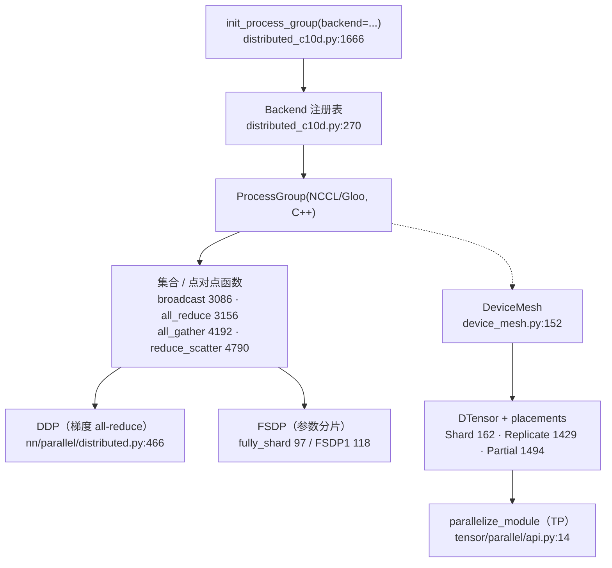

# torch.distributed 原生原语 Quick Start：建组 / 集合通信 / DDP / FSDP / DeviceMesh+DTensor / 张量并行

> 层次：quick start（浅、实用）
> 核验基准：PyTorch upstream `E:\97-codes\pytorch\pytorch`(v2.13.0a0, commit 9922478)
> 最后更新：2026-06-15

**一句话**：`torch.distributed`（c10d）把「多进程之间搬张量」抽象成两层——底层是可插拔的 **ProcessGroup/Backend**（NCCL/Gloo/…，实现在 C++），上层是一组同步语义的 **集合/点对点函数**（`all_reduce`/`broadcast`/`all_gather`/…）；再往上叠出三套常用并行：数据并行 **DDP**、参数分片 **FSDP**、以及围绕 **DeviceMesh + DTensor** 的张量并行 **TP**。本页给最小可跑路径和关键 API，所有引用均指向 `E:\97-codes\pytorch\pytorch` 真实行号。

概念全景与并行家族关系见 [[index]]；源码级深析（Reducer 分桶、FlatParameter、placement 传播、group split/shrink）见 [[c10d_ddp_fsdp_dtensor_analysis]]。

---

## 0. 心智模型：一张图看清栈



要点：**先有进程组，才有一切通信**；`async_op=True` 的集合返回 `Work` 句柄（C++）需 `.wait()`；DDP/FSDP/DTensor 三者都建立在同一组进程组之上，不是互斥而是可组合（如 FSDP×TP 的 2-D 并行靠多维 `DeviceMesh`）。

---

## 1. init_process_group + rank / world_size

最常见的启动方式是 `torchrun`：它把 `RANK` / `WORLD_SIZE` / `MASTER_ADDR` / `MASTER_PORT` 写进环境变量，`init_method="env://"`（默认）从中读取。

```python
# train.py —— 用 torchrun --nproc_per_node=8 train.py 启动
import os
import torch
import torch.distributed as dist


def setup():
    # backend 留空时(>=2.6)会按 device_id 自动选；显式写 "nccl"(GPU)/"gloo"(CPU) 最稳
    dist.init_process_group(backend="nccl")          # distributed_c10d.py:1666
    local_rank = int(os.environ["LOCAL_RANK"])
    torch.cuda.set_device(local_rank)                # 每进程独占一张卡，关键!
    return local_rank


def main():
    local_rank = setup()
    rank = dist.get_rank()                           # distributed_c10d.py:2552 全局 rank
    world = dist.get_world_size()                    # distributed_c10d.py:2579 总进程数
    assert dist.is_initialized()                     # distributed_c10d.py:1394
    print(f"[rank {rank}/{world}] on cuda:{local_rank}")
    # ... 训练 ...
    dist.destroy_process_group()                     # distributed_c10d.py:2361 退出前必清理


if __name__ == "__main__":
    main()
```

| 你要的 | API | 锚点 |
|---|---|---|
| 建默认进程组 | `init_process_group(backend, init_method, world_size, rank, store, device_id, ...)` | `torch/distributed/distributed_c10d.py:1666` |
| 我是谁 | `get_rank(group=None)` | `torch/distributed/distributed_c10d.py:2552` |
| 一共几个 | `get_world_size(group=None)` | `torch/distributed/distributed_c10d.py:2579` |
| 是否已初始化 | `is_initialized()` | `torch/distributed/distributed_c10d.py:1394` |
| 收尾 | `destroy_process_group(group=None)` | `torch/distributed/distributed_c10d.py:2361` |
| 后端名规范化/第三方注册 | `class Backend` / `Backend.register_backend` | `torch/distributed/distributed_c10d.py:270` / `:340` |

`backend` 不再硬填时（PyTorch 2.6+）会按 `device_id` 指示的设备类型选已注册后端；第三方设备（如 NPU）通过 `Backend.register_backend`（`distributed_c10d.py:340`）把自定义后端注册进来——这是 `init_process_group(backend="...")` 对扩展开放的根本机制。

---

## 2. 集合通信：broadcast / all_reduce / all_gather + async_op

集合函数全部「就地」语义（结果写回入参张量），调用前需 `init_process_group` 完成。下面三个是最常用的：

```python
import torch
import torch.distributed as dist

rank = dist.get_rank()
device = torch.device(f"cuda:{rank}")

# (1) broadcast: src 的张量覆盖到全组            distributed_c10d.py:3086
t = torch.arange(4, device=device) if rank == 0 else torch.empty(4, device=device)
dist.broadcast(t, src=0)

# (2) all_reduce: 全组逐元素规约,结果人手一份(就地)  distributed_c10d.py:3156
g = torch.ones(4, device=device) * (rank + 1)
dist.all_reduce(g, op=dist.ReduceOp.SUM)           # 每个 rank 都得到 sum

# (3) all_gather: 收集每个 rank 的张量到列表        distributed_c10d.py:4192
out = [torch.empty(4, device=device) for _ in range(dist.get_world_size())]
dist.all_gather(out, g)                            # out[i] = rank i 的 g
```

**async_op 异步用法**：传 `async_op=True`，集合立即返回一个 `Work` 句柄（实现在 C++），调用方在真正需要结果前 `.wait()`，从而把通信与本地计算重叠。所有集合函数的尾部都是同一套模式（以 `broadcast` 为例）：

```python
# torch/distributed/distributed_c10d.py:3145-3151 —— 所有集合的统一收尾
work = group.broadcast([tensor], opts)             # opts.asyncOp = async_op
if async_op:
    return work                                     # 调用方自己 .wait()
elif work is not None:                              # 后端未在 C++ 层同步时
    work.wait()                                     # 同步路径:就地等
# 否则后端已在 C++ 层同步完成
```

```python
# 重叠示例:发起异步 all_reduce,期间做别的计算,再 wait
handle = dist.all_reduce(grad, op=dist.ReduceOp.SUM, async_op=True)  # 返回 Work
loss_value = compute_something_local()              # 与通信重叠
handle.wait()                                       # 用 grad 之前必须等
```

| 集合 | 语义 | 锚点 |
|---|---|---|
| `broadcast(tensor, src, group, async_op, group_src)` | src 张量广播到全组 | `torch/distributed/distributed_c10d.py:3086` |
| `all_reduce(tensor, op, group, async_op)` | 逐元素规约后人手一份 | `torch/distributed/distributed_c10d.py:3156` |
| `all_gather(tensor_list, tensor, group, async_op)` | 收集全组张量到列表 | `torch/distributed/distributed_c10d.py:4192` |
| `reduce_scatter(output, input_list, op, group, async_op)` | 规约后按 rank 切片分发 | `torch/distributed/distributed_c10d.py:4790` |

> 想让 `torch.compile` 能 trace 通信并做代数优化？用 **函数式集合**（`torch.distributed._functional_collectives`，返回新张量而非就地，首次使用前自动 `wait`）。机制见 [[c10d_ddp_fsdp_dtensor_analysis]]，编译侧背景见 [[02_compile_stack/01_dynamo/index]] 与 [[02_compile_stack/04_inductor/index]]。

---

## 3. 用 DDP 包模型（数据并行）

DDP 把每个进程上的模型副本在反向时按桶 `all_reduce` 梯度并与反向计算重叠；它**不切分输入**——数据切分由你自己（如 `DistributedSampler`）负责。

```python
from torch.nn.parallel import DistributedDataParallel as DDP   # nn/parallel/distributed.py:466

model = MyModel().to(local_rank)
ddp_model = DDP(model, device_ids=[local_rank], output_device=local_rank)

# 之后照常训练:反向时 DDP 自动 all-reduce 梯度
for x, y in loader:                                 # loader 应配 DistributedSampler
    out = ddp_model(x.to(local_rank))
    loss = loss_fn(out, y.to(local_rank))
    loss.backward()                                 # 此处触发分桶 all-reduce
    optimizer.step(); optimizer.zero_grad()
```

官方 docstring 给的最小骨架（`init_process_group` + `DDP`)：

```python
# torch/nn/parallel/distributed.py:508-511
>>> torch.distributed.init_process_group(
>>>     backend=vendor_backend, world_size=N, init_method='...'
>>> )
>>> model = DistributedDataParallel(model, device_ids=[i], output_device=i)
```

要点：① 必须先 `init_process_group`（DDP 构造时会检查，见类 docstring `:480`-`481`）；② 每进程一张卡、`device_ids=[local_rank]`；③ 梯度同步默认全开，梯度累积时可用 `ddp_model.no_sync()` 上下文跳过中间步的 all-reduce。分桶/Reducer 的源码级细节见 [[c10d_ddp_fsdp_dtensor_analysis]]。

---

## 4. FSDP 基础：fully_shard（FSDP2）/ FullyShardedDataParallel（FSDP1）

FSDP 按 ZeRO-3 把**参数、梯度、优化器状态**都切到各 DP worker：前向前 `all_gather` 还原全量参数、用后 `reshard` 释放，反向再 `all_gather` 一次并以 `reduce_scatter` 同步梯度——用通信换显存。

新一代 **FSDP2（`fully_shard`）** 是「无包装」的：原地给 module 装上分片能力（用 `DTensor` 表示分片），而不是替换成 wrapper 类。推荐对子模块**自底向上**逐层调用，让每层成为一个通信组以获得重叠与峰值显存收益。

```python
from torch.distributed.fsdp import fully_shard      # 实现: fsdp/_fully_shard/_fully_shard.py:97
from torch.distributed.device_mesh import init_device_mesh

mesh = init_device_mesh("cuda", (dist.get_world_size(),))   # 1-D = 纯 FSDP

model = Transformer(...)
for block in model.layers:                           # 自底向上:先包子模块
    fully_shard(block, mesh=mesh)
fully_shard(model, mesh=mesh)                         # 最后包根模块
# model 现在是 FSDPModule;照常 forward/backward 即可,all-gather/reduce-scatter 自动插入
```

`fully_shard(module, *, mesh, reshard_after_forward, mp_policy, offload_policy, ...)` 是 `@contract` 装饰的函数（`fsdp/_fully_shard/_fully_shard.py:97`，重载签名在 `:64`/`:79`）。`mesh` 维度决定形态：**1-D → 纯 FSDP（`Shard(0)`)**；**2-D → HSDP（`(Replicate(), Shard(0))`，跨节点复制+节点内分片）**（见 docstring `:172`-`:178`）。

经典 **FSDP1** 仍可用，是 wrapper 类 `FullyShardedDataParallel`（`fsdp/fully_sharded_data_parallel.py:118`，简称 FSDP）：

```python
# torch/distributed/fsdp/fully_sharded_data_parallel.py:118 —— 旧式 wrapper API
from torch.distributed.fsdp import FullyShardedDataParallel as FSDP
sharded = FSDP(MyModel())
```

新项目优先 FSDP2（`fully_shard`）。FlatParameter 切分 / unshard / reshard 的实现细节见 [[c10d_ddp_fsdp_dtensor_analysis]]。

---

## 5. DeviceMesh + Shard/Replicate/Partial → 造 DTensor

`DeviceMesh`（`device_mesh.py:152`）用 n 维数组描述 rank 布局，每一维对应一个 ProcessGroup——这是表达 N 维并行的统一抽象。推荐用 `init_device_mesh`（`device_mesh.py:1498`）构造，可命名维度：

```python
from torch.distributed.device_mesh import init_device_mesh

mesh_1d = init_device_mesh("cuda", (8,))                              # device_mesh.py:1498
mesh_2d = init_device_mesh("cuda", (2, 8), mesh_dim_names=("dp", "tp"))
tp_mesh = mesh_2d["tp"]                                               # 切出 1-D 子 mesh 给 TP
```

`DTensor`（`tensor/_api.py:290`）= `_local_tensor`（本 rank 那片）+ `_spec`（`DeviceMesh` + 一组 **placement**）。placement 三选一，描述某张量在某 mesh 维上的分布：

| placement | 含义 | 锚点 |
|---|---|---|
| `Shard(dim)` | 沿张量 `dim` 切分（`torch.chunk` 语义，不整除时尾部分片可能为空） | `torch/distributed/tensor/placement_types.py:162` |
| `Replicate()` | 该 mesh 维上每个 rank 各持一份完整副本 | `torch/distributed/tensor/placement_types.py:1429` |
| `Partial(reduce_op)` | 各 rank 持「待规约」的部分值，`redistribute` 到 Replicate/Shard 时触发 all-reduce/reduce-scatter | `torch/distributed/tensor/placement_types.py:1494` |

两种造 DTensor 的入口：

```python
import torch
from torch.distributed.tensor import distribute_tensor, DTensor, Shard, Replicate

# (A) distribute_tensor: 从"全局"逻辑张量切出 DTensor(以 mesh 维首 rank 为数据源)
big = torch.randn(1024, 512)
dt = distribute_tensor(big, mesh_1d, [Shard(0)])      # tensor/_api.py:857；沿第0维切到8个rank

# (B) DTensor.from_local: 把"本 rank 已有的局部张量"组装成 DTensor(Autograd 中途常用)
local = torch.randn(128, 512)                          # 每 rank 自己的一片
dt2 = DTensor.from_local(local, mesh_1d, [Shard(0)])  # tensor/_api.py:450
```

`distribute_tensor`（`tensor/_api.py:857`）输入是全局张量、做 scatter/broadcast 保持单卡语义；`DTensor.from_local`（`tensor/_api.py:450`）输入已是局部张量、不校验（`run_check=False`）成本更低。后续对 DTensor 的算子调用会由内部 `OpDispatcher` 自动传播 placement 并在需要处插入通信。张量子类拦截的背景见 [[01_eager_runtime/01_tensor_and_storage/index]]。

---

## 6. parallelize_module + Colwise / RowwiseParallel（张量并行）

张量并行用 `parallelize_module`（`tensor/parallel/api.py:14`）把指定子模块按 plan 改造成 DTensor 并行。**它只接受 1-D `DeviceMesh`**——N 维要先切片（如 `mesh["tp"]`）。

经典 MLP 切法：第一层 `ColwiseParallel`（权重切 `Shard(0)`，输出按最后一维分片），第二层 `RowwiseParallel`（权重切 `Shard(1)`，输出规约回 `Replicate`)，两层配对后中间无需额外通信、只在 Rowwise 输出处 all-reduce 一次。

```python
from torch.distributed.tensor.parallel import (
    parallelize_module, ColwiseParallel, RowwiseParallel,    # api.py:14 / style.py:45 / :186
)
from torch.distributed.device_mesh import init_device_mesh

tp_mesh = init_device_mesh("cuda", (8,))    # 或 mesh_2d["tp"]

# m 含两层 Linear: w1(列并行) -> 激活 -> w2(行并行)
tp_model = parallelize_module(
    m,
    tp_mesh,
    {
        "w1": ColwiseParallel(),            # 权重 Shard(0),输出 Shard(-1)
        "w2": RowwiseParallel(),            # 权重 Shard(1),输出 Replicate
    },
)
```

| 组件 | 作用 | 锚点 |
|---|---|---|
| `parallelize_module(module, device_mesh, parallelize_plan, *, src_data_rank)` | 按 `{FQN: ParallelStyle}` 改造模块；仅 1-D mesh | `torch/distributed/tensor/parallel/api.py:14` |
| `ParallelStyle`（抽象基，定义 `_apply`) | 并行风格契约 | `torch/distributed/tensor/parallel/style.py:31` |
| `ColwiseParallel` | 列并行：权重 `Shard(0)`，默认输入 `Replicate`、输出 `Shard(-1)` | `torch/distributed/tensor/parallel/style.py:45` |
| `RowwiseParallel` | 行并行：权重 `Shard(1)`，默认输出 `Replicate` | `torch/distributed/tensor/parallel/style.py:186` |

`ColwiseParallel.__init__`（`style.py:82`-`96`）把默认 `input_layouts` 设为 `Replicate()`、`output_layouts` 设为 `Shard(-1)`；其 `_prepare_input_fn`（`style.py:98`）在输入不是 DTensor 时用 `DTensor.from_local` 包装并按需 `redistribute`——这就是「TP 把普通张量与 DTensor 缝起来」的位置。模块如何被 `parallelize_module` 遍历改造，结合 [[01_eager_runtime/06_nn_module_system/index]] 的 `named_modules`/`register_parameter` 一起看更清楚。

---

## 7. 常见开关与排查

- **启动**：优先 `torchrun --nproc_per_node=<N> --nnodes=<M> script.py`；单机调试可设 `MASTER_ADDR=127.0.0.1 MASTER_PORT=29500 RANK=0 WORLD_SIZE=1`。
- **挂起（hang）多半是不对齐**：所有 rank 必须以**相同顺序、相同形状**调用同一组集合；`init_device_mesh` 的 `mesh_shape` 在各 rank 必须一致（否则 hang，见 docstring `device_mesh.py:1514`-`1517`）。
- **NCCL 诊断**：`NCCL_DEBUG=INFO`（看握手/拓扑）、`TORCH_DISTRIBUTED_DEBUG=DETAIL`（c10d 侧更详细日志与集合一致性检查）、`NCCL_P2P_DISABLE=1`（排查 P2P/NVLink 问题）。
- **超时**：`init_process_group(timeout=timedelta(...))` 或对 NCCL 设 `TORCH_NCCL_BLOCKING_WAIT=1` 让 `Work.wait()` 阻塞而非轮询。
- **退出**：进程结束前调 `destroy_process_group()`（`distributed_c10d.py:2361`），否则可能残留 NCCL 通信子。
- **device_id**：把 `device_id=torch.device(f"cuda:{local_rank}")` 传给 `init_process_group` 可让后端尽早绑定设备、加速建组并支持 backend 自动选择。

---

## Related Pages

- [[index]] —— 本模块 overview：并行家族全景与页面导航
- [[c10d_ddp_fsdp_dtensor_analysis]] —— 本模块 deep dive：Reducer 分桶、FlatParameter、placement 传播、group split/shrink 源码级解析
- [[01_eager_runtime/06_nn_module_system/index]] —— `nn.Module` 注册与遍历（DDP/FSDP/TP 改造的对象）
- [[01_eager_runtime/01_tensor_and_storage/index]] —— Tensor 子类与 Storage（DTensor / AsyncCollectiveTensor 的拦截基础）
- [[02_compile_stack/01_dynamo/index]] —— `torch.compile` 前端如何把集合映射为函数式集合
- [[02_compile_stack/04_inductor/index]] —— 编译后端对通信算子的代数优化与调度
- [[02_train_frameworks/index]] —— 其上层的 Megatron / torchtitan 等训练框架
