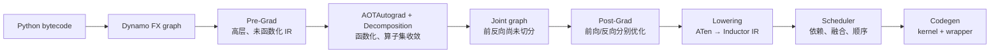

# FX Pass 优化开发方法论 — 从 upstream / torch_npu / vLLM / SGLang 四家现状归纳

> [!correction] 页面角色、审计状态与集中纠错（见 [[correction_report]]）
> **页面角色**：跨项目、跨阶段的FX pass工程方法论。
> **原始基线**：见下方四项目快照；**当前审计基线**：PyTorch `e8f97c1a6ef8cbcdd0a946606bc1e924e4f07e52`。
> **课程分工**：本页继续负责多项目综合；PyTorch当前改图原语、阶段顺序、合法性与复杂度见 [[19_torch_compile_end_to_end/12_fx_graph_editing_primitives_and_invariants]]、[[19_torch_compile_end_to_end/15_graph_pass_pipeline_ordering_and_fixpoint]] 和 [[19_torch_compile_end_to_end/16_graph_rewrite_legality_validation_and_complexity]]。

> **Updated**: 2026-07-22

> **Source baseline**: 归纳自四套已核源分析——upstream pytorch `9922478dffa`、torch_npu `b3c8a815b`(v2.7.1)、vLLM `97a98006b0`、SGLang `d6ef68881e`（均 2026-07-20 前后核验）
> **Dimension**: Methodology（跨源综合，非单源走读）
> 本页把 [[torch_upstream_pass_deepdive]]、[[npu_vs_upstream_fusion_passes]] / [[npu_fusion_passes_deepdive]]、[[vllm_ir_and_fusion_passes_analysis]]、[[sglang_compilation_passes_analysis]] 四份分析里反复出现的**共性与分歧**抽出来，归纳成一套「要不要做、在哪做、怎么做、怎么保证对、怎么可运维」的 pass 开发方法论。每条论断都能追回上述某页的已核 `file:line`（本页只给代表性引用，细节在各源页）。

> [!important] 2026-07-22 阶段模型订正
> 本页现在以 PyTorch `9922478dffa` 为固定基线，完整覆盖 Dynamo、Pre-Grad、Decomposition、Joint、Post-Grad、Lowering、Scheduler、Codegen 八个可扩展层次。下方原有“四个决策问题”和跨项目对照继续保留，但“SymInt 一律跳过”“所有扩展都是 FX Pass”等旧式概括不再作为结论；应以本节的阶段边界和不变量为准。

---

## 0. 先判断：这是改语义、改图、产 IR，还是产代码？

Pass 放置不是按“越早越好”或“离硬件越近越好”，而是按**优化所依赖的信息第一次完整出现、且改写后仍有下游可以兑现收益**的位置决定。



> [!note] Decomposition 的真实位置
> Decomposition 不是“Post-Grad 之后再跑的一轮 FX Pass”。`compile_fx()` 把 `select_decomp_table()` 交给 AOTAutograd（`torch/_inductor/compile_fx.py:2710,2728,3061-3066`），它在 AOT 图生成过程中把算子收敛到后端可处理的集合。Joint/Post-Grad 看到的是这个过程产出的 ATen 图。

### 八阶段选择表

| 阶段 | 此时独有的信息 | 最适合做什么 | 不适合做什么 | 主要入口 |
|---|---|---|---|---|
| **Dynamo** | Python 控制流、模块边界、graph break、guards | 划分图、检查/改写整张捕获图、接入编译后端 | 假装已经看到前反向图或 kernel 布局 | backend callable、`register_backend` |
| **Pre-Grad** | `F.linear`/module 等高层语义仍在 | 高层结构融合、规范化、批量小算子、训练前通用改写 | 依赖函数化、精确 ATen overload 或反向图 | `pre_grad_custom_pass`、`PatternMatcherPass` |
| **Decomposition** | 算子语义与目标 ATen 算子集 | 把复合 op 展开为后端支持且可优化的基本 op | 单纯为了“节点更多”而分解；设备调度 | `register_decomposition`、decomp table |
| **Joint** | 函数化 ATen；前向与反向尚在同一张图 | 跨前反向可见的规范化、随机/常量处理、切图前变换 | 只对 forward 或 backward 成立的设备特化 | `joint_custom_pre_pass/post_pass`、`early_patterns`/`patterns` |
| **Post-Grad** | 前向/反向已分开；ATen overload 与 fake meta 稳定 | 后端融合、通信改写、量化/布局相关图改写 | 仍依赖 module/Python 语义的匹配 | `post_grad_custom_pre_pass/post_pass`、三轮 `pass_patterns` |
| **Lowering** | ATen 节点即将变成带 layout/read-write 的 Inductor IR | 定义 op 如何产 IR、选择 fallback、实现 lowering-time 融合 | 再造一轮高层 FX 规范化 | `register_lowering`、`register_lowering_pattern`、`make_fallback` |
| **Scheduler** | buffer 依赖、读写集合、设备、候选融合组 | 融合可行性、节点次序、并行/stream、融合前后调度改写 | 改 ATen 语义或凭空改变张量值 | `_pre_fusion_custom_pass`、`_post_fusion_custom_pass`、`BaseScheduling` |
| **Codegen** | 已确定的调度组、indexing、target ISA/runtime | 发射 kernel、wrapper、设备运行时调用；接新设备后端 | 重新决定高层数学等价关系 | `register_backend_for_device`、`BaseScheduling`、Wrapper codegen |

### 一条可执行的放置规则

1. 先写出优化成立所需的**最小信息集合**：高层 op 名、精确 overload、前反向共现、layout、读写依赖、target ISA，分别需要哪些？
2. 找到这些信息**首次同时可靠出现**的阶段。
3. 再确认该阶段之后仍有机制兑现收益：例如 FX 融合必须能 lowering；scheduler 融合必须有 codegen 支持。
4. 如果两个阶段都能做，优先选择 IR 更稳定、守卫更少、测试面更窄的阶段，而不是机械地选更早阶段。
5. 把“为什么不放相邻阶段”写进设计：这一步能暴露对阶段边界的误判。

---

## 0.1 Dynamo：它是什么，为什么不是普通 Inductor Pass？
> [!correction] P-011、P-017、P-019：本区段按固定基线纠错；现行结论见 [[19_torch_compile_end_to_end/08_graph_normalization_decomposition_and_functionalization#4. Decomposition]]，逐项说明见 [[correction_report]]。
**是什么。** Dynamo 在 Python frame 上做符号执行，产出带 guards 的 FX `GraphModule`，再把 `(gm, example_inputs)` 交给 backend callable。`torch._dynamo.register_backend()` 只是让 backend 能以字符串名传给 `torch.compile`；直接把函数传给 `backend=` 更简单。源码契约见 `torch/_dynamo/backends/registry.py:81-114`，Inductor 自身也是同一注册机制（`torch/_dynamo/backends/inductor.py:19-30`）。

**为什么放这里。** 只有这里还掌握 graph break、Python 特化和编译区域边界。若优化目标是“某段 Python 为什么没入图”“是否合并/拒绝一个捕获区域”“在送入 AOT 前做整图审计”，Dynamo backend 是正确边界。

**适合做。** 调试/审计 backend、把 FX 图交给自定义编译器、在保持 backend 契约的前提下做少量整图预处理、决定返回 eager callable 还是继续调用 Inductor。

**为什么不放 Pre-Grad。** Pre-Grad 只处理已经成功捕获的区域，看不到被 graph break 留在图外的 Python。反过来，依赖函数化 ATen overload 的融合也不该放 Dynamo，因为此时高层图尚未经过 AOT 规范化。

```python
import torch
from torch._dynamo import register_backend
from torch._inductor.compile_fx import compile_fx

@register_backend(name="audit_then_inductor")
def audit_then_inductor(gm: torch.fx.GraphModule, example_inputs):
    gm.graph.lint()
    print(gm.graph)
    return compile_fx(gm, example_inputs)

compiled = torch.compile(model, backend="audit_then_inductor")
```

> [!warning]
> backend 返回值必须是可调用的 compiled function；它不是“返回改写后的 GraphModule 就结束”。注册表是内部 API，第三方包还要保证注册模块在 `torch.compile(..., backend="name")` 前已被 import；否则优先直接传 callable。

详见 [[dynamo_pass_methodology]]。

---

## 0.2 Pre-Grad：高层语义最后仍清晰的窗口

**是什么。** `pre_grad_passes()` 运行在 AOTAutograd 前。固定基线的配置注释明确称这里的 IR **non-functional、non-normalized、prone to change**（`torch/_inductor/config.py:309-313`），因此不能把它描述成“已经函数化”。

**为什么放这里。** `torch.nn.functional.linear`、module/复合调用、Python 风格参数等高层结构尚未完全拆散；这使 Conv-BN、linear-permute、group batch fusion 一类优化更容易表达。等到 decomposition 后，高层意图可能已变成多个 ATen 节点。

**主要 Pass 与顺序。** OSS 路径先做 NumPy 兼容和 `fuse_fx`，按配置做 normalization/group-batch/PRE_GRAD_PATTERNS，再做 efficient Conv-BN、Gumbel trick、`pre_grad_custom_pass`，最后稳定拓扑、lint、recompile（`torch/_inductor/fx_passes/pre_grad.py:287-369`）。

**为什么不放相邻阶段。** 依赖精确 `aten.*.default`、别名已消除或前反向共现的规则应后移到 Joint/Post-Grad；否则每种高层调用变体和 mutation 都要自己兜底。仅因 SymInt 出现也不能一律跳过：若等价性只依赖符号表达式恒等、或可以由 ShapeEnv/guard 证明，就应支持动态形状；只有无法证明条件时才拒绝匹配。

开发细节、注册示例与已核 Pass 清单见 [[pre_grad_passes_guide]]。

---

## 0.3 Decomposition：收敛算子集，不是“越碎越快”

**是什么。** Decomposition 是 `OpOverload -> Python callable` 的语义表。`torch/_inductor/decomposition.py:150-156` 的 `register_decomposition()` 最终把实现登记到 Inductor 的 `decompositions` 表；`select_decomp_table()` 会按配置选择实际交给 AOT 的表（同文件 `:972-983`）。

**为什么放这里。** AOT 正在建立函数化、可求导/可编译的 ATen 图，这是把后端不支持的复合算子变成既有 lowering 能理解的基本算子的正确时机。它同时影响前向与生成的反向，语义责任比普通后处理 rewrite 更重。

**适合做。** 移除后端无法 lowering 的复合 op；暴露后续 pattern/fusion 需要的基本结构；选择能保持 dtype、layout、alias、随机数和数值语义的等价公式。

**为什么不放 Post-Grad 或 Lowering。** 到 Post-Grad 才发现缺 decomposition，可能前向/反向图已经按错误的算子边界生成；到 Lowering 再展开，会丢失 AOT 对函数化和反向语义的统一处理。反之，若目标 op 本来就有一个高质量外部 kernel，强行 decomposition 会破坏该 kernel 的选择机会，此时应保留 op 并写 lowering/fallback。

详见 [[decomposition_passes_guide]]。

---

## 0.4 Joint：切分前才能完成的全局整理

**是什么。** Joint graph 是 AOT 生成、前向和反向尚未切开的函数化 ATen 图。固定基线中 `joint_graph_passes()` 先运行必须最先执行的 `canonicalize_aten_ir_passes`，再运行 custom-pre、noop/constant folding、early patterns、auto chunker、两轮 `pass_patterns`、随机算子替换、custom-post，最后按需排序/lint/recompile（`torch/_inductor/fx_passes/joint_graph.py:640-720`）。

**为什么放这里。** 这是最后一个能同时看见前向保存值、反向消费和跨边界关系的位置。切图前规范化还可以让 partitioner 看到更清晰的代价结构。

**适合做。** 必须先于所有其他 Joint 规则的 ATen canonicalization；切图前常量折叠；会影响前反向共同结构的 rewrite；随机算子函数化；为 partition/后续两张图准备规范形态。

**为什么不放 Post-Grad。** Post-Grad 已经丢失另一半图，无法判断跨前反向的保存/消费关系。只对 inference 或只对 backward 成立的特化则应后移，否则 Joint 规则会误伤另一种图。

详见 [[joint_graph_passes_guide]]。

---

## 0.5 Post-Grad：后端 FX 融合的默认落点

**是什么。** `post_grad_passes(gm, is_inference)` 分别作用于前向和反向图；固定基线显式把 `is_inference` 传给 inference-aware custom pass。主流程包含 DCE、推理局部性、custom-pre、group batch、noop/assert 清理、三轮 pattern、配置化 fusion、通信处理、custom-post、拓扑整理，最后以 `reinplace_inplaceable_ops` 收尾，因为 reinplace 会重新引入 mutation（`torch/_inductor/fx_passes/post_grad.py:144-446`）。

**为什么放这里。** ATen overload、fake tensor meta 和前/反向身份已经稳定，离 lowering 又足够近，因此下游框架的设备融合、量化、通信和 KV-cache rewrite 往往选 `post_grad_custom_post_pass`。

**适合做。** 精确 ATen pattern；只对 inference 生效的替换；通信 bucket/overlap 前的结构准备；将一段 ATen 子图替换为后端已有 op/kernel 的入口。

**为什么不放 Joint 或 Lowering。** Joint 无法安全区分前向、反向和 inference-only 约束；Lowering 已经进入 IR 构造，若只是把一段 ATen 图替成另一个 ATen op，那里太晚且更难复用 PatternMatcher。

详见 [[post_grad_passes_guide]]。

---

## 0.6 Lowering：定义“这个 ATen op 怎样成为 IR”

**是什么。** `GraphLowering.call_function()` 根据 `lowerings[target]` 把 ATen 节点解释成 Inductor IR；不存在 lowering 时，根据 allow-list、`implicit_fallbacks` 和 decomposition 状态决定 fallback 或报错（`torch/_inductor/graph.py:1367-1450`）。

**为什么放这里。** layout、realization、读写与 IR 节点类型在这里首次成为一等信息。优化若必须产生 `Pointwise`/`Reduction`/`ExternKernel` 等 IR，或需要选择外部 kernel，就应在这里兑现。

**适合做。** `register_lowering` 注册 op-to-IR；`register_lowering_pattern` 把一段 ATen pattern 直接降成 IR；`make_fallback` 接 eager/外部实现；`add_needs_realized_inputs` 声明输入必须先物化；layout constraint 管理调用边界。

**为什么不放 Post-Grad 或 Scheduler。** Post-Grad 不应手工伪造 Inductor IR；Scheduler 只应重排/融合已有 IR 节点，不应再解释 ATen 语义。若只需产生等价 ATen 子图，则 decomposition/FX rewrite 更合适；若需要精确控制 IR，则 Lowering 才合适。

详见 [[lowering_analysis]]。

---

## 0.7 Scheduler：优化“哪些 IR 节点组成一个 kernel、以什么顺序运行”

**是什么。** Scheduler 在依赖分析、DCE、拓扑排序之后构造调度节点，再做融合和 codegen。固定基线在 `fuse_nodes()` 前把 `list[BaseSchedulerNode]` 交给 `config._pre_fusion_custom_pass`，融合后交给 `_post_fusion_custom_pass`（`torch/_inductor/scheduler.py:4099-4141`）；两个 hook 都必须返回新的节点列表。

**为什么放这里。** 只有 Scheduler 同时掌握 buffer 读写、未满足依赖、设备、节点组、可融合性与预计代价。横向/纵向融合、stream 顺序、kernel 边界不能仅从 FX dataflow 正确推出。

**适合做。** 融合前重排/分组，融合后拆分或最终排序；在设备 `BaseScheduling` 中实现 `can_fuse_vertical/horizontal`、`fuse` 与 codegen 能力协商。

**为什么不放 Lowering 或 Codegen。** Lowering 是逐节点产 IR，尚未拥有完整调度依赖；Codegen 接到的 kernel 分组已经确定，再改变依赖/融合既晚又容易使 wrapper 与 kernel 不一致。

> [!warning]
> 两个 config 名以 `_` 开头，源码明确警告 scheduler IR 仍是 prototype（`torch/_inductor/config.py:315-330`）。hook 参数不是 `GraphLowering`，也不存在通用的 `node.fusable = True` 协议。

详见 [[scheduler_analysis]]。

---

## 0.8 Codegen：实现目标代码，不再证明高层数学等价

**是什么。** `GraphLowering.codegen()` 创建 Scheduler，`Scheduler.codegen()` 按设备选择 `BaseScheduling`，再由 `codegen_node()`/`codegen_template()` 生成 kernel，并由 Wrapper 生成定义、调用、内存和设备运行时代码（`torch/_inductor/graph.py:2620-2637`、`torch/_inductor/scheduler.py:9470-9505`）。

**为什么放这里。** target ISA、kernel 模板、launch 参数、stream/device guard、wrapper ABI 直到这里才完整。新设备或新代码生成技术必须在这个边界接入。

**适合做。** 继承/实现 `BaseScheduling`；实现 Python/CPP/FX wrapper；通过 `register_backend_for_device()` 注册设备到 scheduling/wrapper 的映射；用 `DeviceOpOverrides` 定义设备 guard、stream、header/driver 等 wrapper 片段。

**为什么不放 Scheduler。** Scheduler 决定“分成哪些 kernel”，Codegen 决定“这些 kernel 写成什么代码”。需要改变数学图或融合边界的优化应前移；仅涉及指令选择、向量化、launch、wrapper ABI 的优化才留在 Codegen。

详见 [[codegen_extension_guide]] 与 [[inductor_codegen_analysis]]。

---

## 0.9 跨阶段共同方法：每个 Pass 都要回答六个“为什么”

一个可合入、可维护的 Pass 设计至少写清以下内容：

1. **收益为什么存在**：减少 launch、HBM 往返、同步、重排、fallback，还是暴露更强 kernel？
2. **为什么是这个阶段**：依赖的信息何时首次出现；为什么相邻阶段不合适？
3. **等价为什么成立**：dtype、shape、stride/layout、alias/mutation、随机数、异常和数值误差分别有什么前提？
4. **动态形状为什么安全**：是符号恒等、运行时 guard，还是必须拒绝？“看到 SymInt 就跳过”只是临时保守策略，不是方法论。
5. **收益为什么能兑现**：替换后的 op 是否有 lowering/kernel；scheduler/codegen 是否真的把它融合或发射成目标实现？
6. **为什么可运维**：是否可开关、可计数、可 dump、可 bisect；缓存 key 是否包含影响生成结果的 Pass 配置/源码？

### 最小验证矩阵

| 维度 | 至少覆盖 |
|---|---|
| 语义 | eager vs compile；训练时同时比较输出与梯度 |
| dtype | fp32、低精度、整数/布尔中与规则相关的类型 |
| shape | 正常、边界、空张量、广播、静态与动态形状 |
| layout | contiguous、transpose/view、非零 storage offset（若可达） |
| alias/mutation | 单用户/多用户、view alias、in-place 边界 |
| 模式 | inference、forward、backward；CPU/GPU/目标设备门控 |
| 收益 | Pass 开/关 A/B；命中计数、kernel 数和端到端性能 |

---

## 0.10 旧版跨项目方法论（保留）
> [!correction] P-006、P-010、P-015、P-020、P-021：本区段按固定基线纠错；现行结论见 [[19_torch_compile_end_to_end/13_pattern_expression_and_matcher_engine#1. Pattern 定义了什么]]，逐项说明见 [[correction_report]]。
> [!deprecated]
> 以下章节形成于完整八阶段模型之前，仍保留 upstream/torch_npu/vLLM/SGLang 的横向经验。涉及阶段选择时，以 §0～§0.9 为准；尤其不要把 `post_grad_custom_post_pass` 当成所有优化的唯一入口，也不要把动态形状简单等同于“不支持”。

## 1. 一条主线

**一个「pass 优化」本质是一个下注：「一段可被识别的子图，能被一段更便宜的等价子图（或一个更强的 kernel）替换」。** 工程上它永远拆成同样四个问题——

1. **在哪做（WHERE）**：落在哪个 IR 阶段 / 哪个钩子；
2. **匹配什么（WHAT）**：怎么声明「要识别的子图」；
3. **怎么落地（HOW）**：命中后改成什么形态、在哪一步兑现；
4. **怎么保证对（SAFE）**：靠什么不变式、护栏、门控保证等价与稳定。

四家现状的差异，几乎都能投影到这四个问题的不同选择上。下面先给一张全景对照，再逐问题归纳可复用的判据。

### 四家现状对照

| 维度 | upstream Inductor | torch_npu | vLLM | SGLang |
|---|---|---|---|---|
| **主引擎** | 声明式 `PatternMatcherPass`（自建） | 官方钩子 + 手工遍历（自建 `ascend_custom_passes` 注册表） | **复用** torch 的 `pattern_matcher` + `VllmInductorPass` 包装 | **fork vLLM 骨架，但抽空**融合层 |
| **落点** | pre/joint/post_grad + lowering | post_grad/pre_grad **custom 钩子**（仅推理为主） | post_grad_custom_post_pass 钩子 + pre_grad IR functionalization | post_grad_custom_post_pass 钩子（但 pass 为 no-op） |
| **融合朝向** | codegen（Triton/C++ 模板） | **厂商手工库 ACLNN** + Cube 模板/DVM | **厂商/手写 kernel**（FlashInfer/cutlass/symm_mem/AITER/`_C.*`） | 预融合 kernel + inductor 原生 `combo_kernels` |
| **真实图重写 pass 数** | 数十（三阶段全集） | 26 个自定义 + 后端融合 | ~16 融合 + ~7 IR/utility + 1 pre-grad | **0**（唯一的 fix_functionalization 是 no-op） |
| **新增的融合维度** | 算术/结构（GEMM/softmax/view-cat/conv-bn） | **硬件布局/dtype**（int64→int32、连续访存、Cube epilogue） | **集合通信 + 量化 + KV-cache 写入** | 无（下推到 kernel 层） |
| **代表页** | [[torch_upstream_pass_deepdive]] | [[npu_fusion_passes_deepdive]] | [[vllm_ir_and_fusion_passes_analysis]] | [[sglang_compilation_passes_analysis]] |

> 一句话读法：**upstream 造引擎、定义在哪三阶段落地；三家下游都从 `post_grad_custom_post_pass` 这个官方钩子接进去，然后各自决定「融合朝向什么」——这个选择直接决定了要不要写融合 pass（vLLM 写十几个、SGLang 一个不写）。**

---

## 2. 四个决策问题（可复用判据）

### Q1 · 落在哪一层？

上游把「改图」摊在五个可选落点上（[[torch_upstream_pass_deepdive]] §1 流水线），越早语义越高、越晚越规范：

| 落点 | IR 状态 | 适合放什么 | 代价 |
|---|---|---|---|
| **pre_grad** | Torch IR，未函数化/未规范化 | 高层语义融合（linear+permute、conv-bn）、batch 化 | 要自己处理别名与突变 |
| **joint** | aten，函数化后·切分前 | 跨 fwd/bwd 的融合（SDPA、pad_mm）、常量折叠 | 需 fake trace，训练/推理两版 pattern |
| **post_grad** | aten，切分后·lowering 前 | 设备/内存/通信优化、后端特化 | 已按 fwd/bwd 分开，shape 更具体 |
| **lowering** | aten→Inductor IR | 要「产一个自定义 kernel」的融合（lowering-pattern） | 只能产 IR，不能再改 aten 图 |
| **scheduler** | Inductor IR | 逐元素/规约的 kernel 级融合（can_fuse、epilogue） | 受 tiling/内存复用约束 |

**判据**：能在高层语义表达的融合尽量早放（信息最全）；依赖「已函数化、已规范化」的 pattern 放 joint/post_grad；**下游框架统一走 `post_grad_custom_post_pass` 钩子**（torch_npu/vLLM/SGLang 三家一致，[[torch_upstream_pass_deepdive]] §2.6）——因为这是唯一「不改上游源码就能插进优化管线」的官方插入点。第六个选择是**根本不做 FX pass**，把融合下推到 kernel + inductor `combo_kernels`（SGLang 路线，[[sglang_compilation_passes_analysis]] §3.3）。

### Q2 · 怎么声明匹配？

两条路线，判据清晰：

- **声明式 pattern**（`register_replacement` 从「例子函数」trace 出 pattern + 序列化缓存，或手写 `PatternExpr` 语法树）——**能用一对 `search_fn/replace_fn` 例子表达的融合走这条**。upstream 的 SDPA/pad_mm、vLLM 的全部融合 pass 都用它（vLLM 只在外面包 `VllmInductorPass` 做计时/uuid/计数，[[vllm_ir_and_fusion_passes_analysis]]）。优点：声明即正确、可序列化缓存避免每次 trace（[[torch_upstream_pass_deepdive]] §2.4）。
- **手工 `graph.find_nodes` 遍历**——**结构归一化、布局重排、无法用「一个子图例子」表达的改写走这条**。torch_npu 的 26 个 fold/融合 pass（[[npu_fusion_passes_deepdive]] §7）、vLLM 的 utility pass（noop_elimination/split_coalescing/scatter_split_replace/fix_functionalization）、SGLang 的 fix_functionalization 都是手工遍历。

> 一个反复出现的配套技巧：**为「归一化」单开前置 pass 给「融合」pass 铺路**。vLLM 的 `SplitCoalescingPass`/`ScatterSplitReplacementPass`、upstream 的 `normalization_pass`、torch_npu 的 `fold_sink_view` 都是——先把图整理成 pattern 能对上的规范形态，融合命中率才高。

### Q3 · 命中后怎么落地？

这是「两种 pattern 匹配」的真正分野（[[torch_upstream_pass_deepdive]] §4.1），判据由**「融合目标是什么」**决定：

| 落地形态 | 融合目标 | 代表 |
|---|---|---|
| **graph-pattern（即时改 FX 图）** | 另一串 aten 节点 | upstream `bmm_to_mm`；torch_npu 全部 fold |
| **lowering-pattern（推迟到 lowering 产 IR）** | 一个自定义 Triton/外部 kernel | upstream `mm_plus_mm`、b2b_gemm |
| **replacement（贴入 traced 子图）** | 一段等价子图 | upstream SDPA |
| **rewrite-existing-op（改写已有算子）** | 让已有 kernel 多干一步 | vLLM 把 quant 塞进 `unified_attention_with_output` 的 epilogue（[[vllm_ir_and_fusion_passes_analysis]]） |
| **fallback / 换手工算子** | 厂商手工库 | torch_npu 把 attention/通信 fallback 到 ACLNN；vLLM 换 FlashInfer/AITER |
| **push-to-kernel（不改图）** | 预融合 kernel + inductor combo | SGLang |

**核心洞察——融合「朝向什么」的谱系**：codegen（upstream 默认）→ 厂商手工库（torch_npu/vLLM，因硬件专用单元或厂商已调极致）→ 预融合 kernel（SGLang，干脆不写 pass）。**这条谱系解释了为什么同为推理框架，vLLM 写十几个融合 pass 而 SGLang 一个不写**：不是能力差异，而是「把融合放在编译层还是 kernel 层」的路线选择。

### Q4 · 怎么保证等价与稳定？

七条护栏，四家共享（细节见 [[npu_fusion_passes_deepdive]] §7.4 与 [[torch_upstream_pass_deepdive]] §4.2）：

1. **算子类别不变式**：只在共享某条不变式的一类算子内改写——view 类＝扁平序/元素数不变；masked＝掩码互补；bool×＝按位选择。**绝不跨类别改写**（不碰 permute/真广播这些会重排元素的算子）。这是「只改元数据、不重算数值」的根据。
2. **边局部改写 + 纯函数**：post-functionalization 的图是 SSA 式纯算子，`replace_input_with` 只动本节点入边，对 DAG 扇出天然安全（[[npu_fusion_passes_deepdive]] §7.3）。
3. **单用户门槛判据**：只改自己入边 → 不需要单用户；会「吃掉/改动前驱」→ 必须查单用户（torch_npu `fold_cat`/`fold_squeeze`）。
4. **引擎级边界护栏**：`PatternMatcherPass.apply` 逆拓扑序遍历，且**丢弃跨突变区、跨 stream 的匹配**（pattern_matcher.py:2400/2409）——保证融合不越过 in-place 或多流边界。
5. **meta 一等公民 + 动态 shape 可证明性**：改写后必维护 `FakeTensor`（下游 lowering/tiling 靠它）；SymInt 条件若是符号恒等或可由 ShapeEnv/guard 证明就应支持，只有无法证明等价时才跳过。旧版“一律跳过”策略过度保守，已在 §0.2/§0.9 订正。
6. **顺序约束**：规范化必须最前（`canonicalize_aten_ir_passes`）、依赖顺序（auto_chunker 在 pad_mm 前）、突变类保持最后（`reinplace_inplaceable_ops`）。
7. **收尾三件套**：`stable_topological_sort` + `graph.lint()` + `recompile`（+ DCE 删孤儿），保证确定性与图合法。

---

## 3. 工业界沉淀的工程护栏（可运维性）

「能融合」只是一半，「能上线、能调试、能回滚」是另一半。四家共同沉淀出这些：

- **uuid = 源码哈希 → pass 改动触发重编译**：torch_npu `get_hash_for_files`、vLLM/SGLang `hash_source`（inductor_pass.py）、upstream pattern 的序列化校验。改了 pass 逻辑而 cache 不失效会静默跑旧代码——这条是硬需求。
- **可禁用 / 可 bisect**：upstream `GraphTransformObserver` 支持按 subsystem（`"post_grad_passes"`）或按名禁用（`config.disabled_passes` / `CompilerBisector`）；torch_npu `SHUT_DOWN_FX_PASS_LIST=<name>`（含 `all`）；这是「怀疑某 pass 引入 bug/劣化」时的一键排查抓手。
- **可观测**：vLLM `VllmInductorPass` 提供计时（`time_and_log`）、全局 match 计数表、`dump_patterns`（把 Inductor pattern 反打成近似 Python）与前后图 dump；upstream `dynamo_timed(f"pass.{subsystem}.{name}")`。
- **门控分层**：总闸（`config.pattern_matcher`）→ 特性开关（`*_fusion_options` / `PassConfig`）→ 平台守卫（`is_cuda()`/`rocm_aiter_ops.is_enabled()`）→ 运行期尺寸（vLLM `is_applicable_for_range(compile_range)`、只在小 batch decode 的 token 区间触发重通信/KV 融合）。分层门控让一个融合能「按硬件、按特性、按 batch 尺寸」精确启停。
- **pattern 对 custom_ops 开关鲁棒**：vLLM `MatcherCustomOp.forward = custom if enabled else native`——同一 pattern 既能匹配「启用 custom op 的图」又能匹配「native 分解图」，避免因一个开关导致融合失配。
- **序列化 pattern 缓存**：upstream 把 SDPA 等 30 个 pattern 预 trace 落盘（`serialized_patterns/*.py`），运行期只 import 不 trace（[[torch_upstream_pass_deepdive]] §2.4）——从「例子函数 trace pattern」很贵，这是规模化的必要工程。

---

## 4. 开发一个新 pass 的流程（actionable checklist）

综合四家，落一个新融合 pass 的标准动作：

1. **定位可优化子图**：profiling 找「重复的小 kernel / 反复的 HBM 往返 / launch 密集 / 一个 kernel 结果立刻被下一个读回」。这是下注的依据，不是拍脑袋。
2. **Q1 选层**：能改上游就注册进对应阶段 pass_dict；不能改上游（下游框架）就挂 `post_grad_custom_post_pass` 钩子；若目标其实是「换个更强的 kernel」，考虑根本不写 pass（Q3 的 push-to-kernel）。
3. **Q2 选声明方式**：可用例子函数表达 → `register_replacement`（并考虑序列化缓存）；结构清理/布局重排 → 手工遍历；必要时先写一个前置**归一化** pass 铺路。
4. **Q3 选落地**：产 aten → graph-pattern；产自定义 kernel → lowering-pattern；让已有 kernel 多干一步 → rewrite-op；用厂商算子 → fallback/换 op。
5. **Q4 写不变式与 guard**：明确「我只在哪类算子内改、靠什么不变式等价」；加 dtype/shape/单用户/静态-shape 守卫；改写后 `propagate_fake_tensor`。
6. **收尾**：`stable_topological_sort` + `lint` + DCE。
7. **工程化**：`uuid`（源码哈希）+ 计时/计数 + 分层门控（config/平台/尺寸）+ 可禁用开关。
8. **验证**：数值等价（单测）+ **实测开关对比**（用 `SHUT_DOWN_FX_PASS_LIST` / config flag / bisect 关掉该 pass 跑 profiling）——因为几乎没有 pass 自带 benchmark 计数器，收益必须实测（见 §5）。

---

## 5. 反模式与诚实边界

- **效果多为结构性，真实收益要实测**：四家的 pass 里**几乎没有内建 benchmark/counter**（唯一的例外之一是 vLLM CATLASS-类 epilogue 与各 pass 的 match 计数）。「少 N 个 kernel / 少一次拷贝 / 转零拷贝」是结构性收益，不是加速比——上线前必须用「开/关该 pass」实测（[[npu_fusion_passes_deepdive]] §1 效果口径）。
- **搬框架容易，搬正确融合难**：SGLang 逐文件 fork 了 vLLM 的 pass 框架，却把融合内容整个抽空、`fix_functionalization` 沦为 no-op（[[sglang_compilation_passes_analysis]] §3.2）。**「有 pass 框架」≠「有融合优化」**——评估一个项目时要看 `configure()`/pass_dict 里实际挂了什么，而非目录里有多少文件。
- **pass 会腐化，以源码为准**：upstream 本 commit 里 `fused_int_mm_mul` 已成孤儿（无 register 引用）、`config.decompose_mem_bound_mm` 门控失效（[[torch_upstream_pass_deepdive]] §3.3）；torch_npu 的 `patch_pattern_mm_plus_mm` 是**删除**上游融合而非添加（[[npu_vs_upstream_fusion_passes]] §6）。民间说法/旧文档常与现状不符——**每条断言都要回源码那一行核**。
- **跨类别改写会错**：只在共享不变式的算子类内改；一旦碰会重排元素/改 stride 语义的算子（permute/transpose/真广播），「只改元数据」的等价前提就破了。
- **门控失配的静默坑**：pass 挂上了但因平台/尺寸/开关不满足而从不触发（vLLM 大量 `is_applicable_for_range`、平台守卫），或因 `custom_ops` 开关导致 pattern 失配——「pass 存在」不代表「pass 生效」，要用可观测手段确认命中数。

---

## Related Pages

- [[19_torch_compile_end_to_end/00_pytorch_graph_series_index]] — 当前固定基线的图编译系统化课程入口
- [[dynamo_pass_methodology]] — Dynamo backend 与整图改写边界
- [[decomposition_passes_guide]] — AOT Decomposition 开发
- [[pre_grad_passes_guide]] · [[joint_graph_passes_guide]] · [[post_grad_passes_guide]] — 三阶段逐页指南
- [[lowering_analysis]] · [[scheduler_analysis]] · [[codegen_extension_guide]] — IR、调度与目标代码扩展
- [[torch_upstream_pass_deepdive]] — 上游 Inductor pass 全集与 PatternMatcher 机制（本页 Q1–Q4 的引擎基线）
- [[npu_vs_upstream_fusion_passes]] · [[npu_fusion_passes_deepdive]] — torch_npu 侧：谁有谁无 + 26 个自定义 pass 的场景/问题/优化/效果 + 改图原语
- [[vllm_ir_and_fusion_passes_analysis]] — vLLM：复用 pattern_matcher、朝厂商 kernel 融合、通信/量化/KV-cache 三维度
- [[sglang_compilation_passes_analysis]] — SGLang：fork 骨架但不写融合、下推到 kernel 的反例
- [[scheduler_analysis]] — 后端 scheduler 融合（Q1 的 scheduler 落点）
