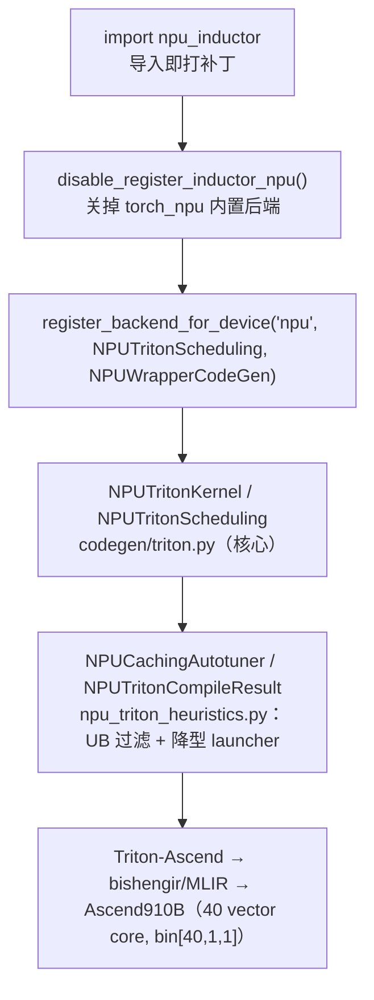

# NPU Inductor Linearize 后端分析（实验性 `npu_inductor_2.9.0`）

> 分析对象：**独立实验性** monkey-patch 后端 `npu_inductor_2.9.0`（**≠** torch_npu 内置 `_inductor`）
> 核心代码位置：`E:\97-codes\pytorch\npu_inductor_2.9.0\npu_inductor\`（约 9 千行 / 9 个 `.py`）
> 版本基线：`npu_inductor_2.9.0` 包 + upstream PyTorch **2.9.0**（区别于内置后端的 torch_npu v2.7.1.post5）
> 最后更新：2026-06-17

> [!important] 两个「NPU Inductor」别混淆
> 本页讲的是**独立实验性**的 monkey-patch 后端 `npu_inductor_2.9.0`；torch_npu **内置**的 `_inductor`（Split-Tiling / CATLASS / MLIR / DVM 多后端框架）见 [[npu_compile_paths_overview]]、[[npu_triton_backend_deep_analysis]]、[[NPU_Inductor_Backend_Analysis]]。二者是**两条注册时互斥的路线**——本后端 `import` 时主动调 `torch_npu.utils._dynamo.disable_register_inductor_npu()` 关掉内置后端（`npu_inductor/__init__.py:87-101`），运行时只有一个生效。本页与内置后端的逐维对比见 §六。

---

## 一、定位：monkey-patch 复用上游，而非独立框架

`npu_inductor_2.9.0` 的根本取向是**最小侵入地复用上游 Inductor**：不重写调度框架，而是在上游 `SIMDScheduling`/`SIMDKernel`（`TritonScheduling`/`TritonKernel` 基类，见 [[inductor_compiler_pipeline_analysis]]/[[scheduler_analysis]]）的少数扩展点上挂子类 + monkey-patch，**白继承上游已验证的调度、lowering、内存规划**，只在 NPU 真正需要差异化处改写：索引线性化、tiling、融合门控、autotune 计时、类型适配。

`import npu_inductor` 时按固定顺序装配（`__init__.py`）：

| 顺序 | 动作 | 位置 | 作用 |
|---|---|---|---|
| 1 | `disable_register_inductor_npu()` | `__init__.py:87-101` | **关掉 torch_npu 内置 inductor 后端**（否则首次 compile 时它会注册 `NPUCombinedScheduling` 覆盖本后端） |
| 2 | `register_backend_for_device('npu', NPUTritonScheduling, NPUWrapperCodeGen)` | `__init__.py:103-108` | 注册本后端（机制见 [[scheduler_analysis]] 的「新设备 backend 注册」） |
| 3 | `_override_disable_pointwise_autotuning()` | `__init__.py:120` | 让 autotune 忽略 `use_deterministic_algorithms`（否则锁死默认 tile，6.3M gelu_backward 慢约 154×） |
| 4 | `_force_triton_available()` | `__init__.py:144` | NPU `get_device_capability()` 返 None 会让 `has_triton()` 抛错，强制 True |
| 5 | config 覆盖 | `__init__.py:187-192` | 关 `layout_optimization` / `coordinate_descent_tuning` / `split_reductions` |
| 6 | `add_npu_patch()` | `npu_patch.py:1352` | monkey-patch 总入口（range-tree header、decomp/lowering 覆盖、类型降型、IR 补丁） |
| 7 | `_register_npu_inductor_fallbacks()` | `lowering.py:132` | 白名单 lowering + 其余 fallback（见 §五） |



类与基类（均继承上游）：`NPUTritonKernel`(`triton.py:438`)←`TritonKernel`；`NPUTritonScheduling`(`triton.py:2305`)←`TritonScheduling`；`NPUCachingAutotuner`(`npu_triton_heuristics.py:265`)←`CachingAutotuner`；`NPUTritonCompileResult`(`:69`)←`TritonCompileResult`。

---

## 二、Linearize：多维迭代空间 → 40-CU 单维 group dispatch（本后端灵魂）

这是本后端**最具特色、内置后端没有对应物**的核心，由 `TRITON_CODEGEN_LINEARIZE=1`（默认开）启用。

**思想**：上游 GPU 路线用 `tl.program_id(0/1/2)` 把多维 grid 交给硬件调度器、kernel 内无循环（见 [[inductor_codegen_analysis]]）；昇腾是固定 40 个 vector core 的单维 dispatch（`bin[40,1,1]`）。Linearize 不做「哪根轴当 split / tiling」的逐算子启发式，而依赖一个**与算子无关的代数恒等式**：

$$\text{任意多维迭代空间} \equiv [0, \text{numel}),\quad \text{coord}_k = \left(\frac{\text{flat}}{\text{divisor}_k}\right) \bmod \text{length}_k$$

于是「适配 NPU」归约为：为每个 range-tree 选一组**基础轴**承载扁平空间，其余节点表达成基础轴的除/模派生。`_apply_linearize`(`triton.py:3372`) 即此：选 rank 最长的迭代视图作基础轴，线性扫描其余视图登记 `tree_node_mapping`，并对 permute 制造的退化输入做四遍折叠：

| 折叠 | 触发 | 不折叠后果 | 开关 |
|---|---|---|---|
| 基础降秩映射 | 节点 rank < 基础 | —（常规） | 默认 |
| 转置等秩折叠 | rank 相同但轴为基础的纯置换 | 4 独立轴笛卡尔积（200× 慢） | `NPU_FOLD_TRANSPOSED_XNODE` |
| flat 辅助节点折叠 | 节点 divisor=1 且 length==numel | 扁平视图与分解视图并存重复计数 | 默认 |
| dual-decomp 折叠 | 同一 flat 空间带两条完整 divisor 链 | Cartesian 爆炸，**既慢又错** | `NPU_FOLD_DUAL_DECOMP`（`_fold_dual_decomp:3284`） |

**40-CU group dispatch prologue**（`codegen_kernel`，`triton.py:1711-1791`）：

```python
def triton_kernel(..., XBLOCK: tl.constexpr):
    total_thread = 40                       # = get_npu_vector_core_count()（npu_config.py:33）
    group_id = tl.program_id(0)
    # pre_loop_code: real_block_x0 / x0_blocks（loop-invariant，循环外只算一次）
    total_blocks = x0_blocks * x1_blocks * ...
    group_size = total_blocks // total_thread
    group_tail = total_blocks % total_thread
    group_base = group_id * group_size + group_tail
    if group_id < group_tail: group_size += 1; group_base = group_id * group_size
    for i in range(group_size):              # 每个 core 顺序处理自己负责的连续 block
        ...                                  # 地址由 (group_base + i) 经除/模映射展开，全部线性
```

`iteration_ranges_get_pid`(`triton.py:1357`) 把上游 `tl.program_id(0)` 替换为 `(group_base + i)`。

**索引线性化**（NPU 对 `(x//c)`/`(x%c)` 非线性地址退化为 scalar/间接寻址，故必须消除；GPU 上 mod/div 廉价、上游直接内联）——一组纯代数 pass：

| pass | 位置 | 作用 |
|---|---|---|
| `_maybe_split_fused_axes` | `triton.py:948` | 撤销上游对融合轴的合并，融合符号还原为子轴 `outer*c+inner` |
| `_simplify_compound_indexing` | `triton.py:490` | 用 range-tree 把 `ModularIndexing`/`FloorDiv` 折叠为已有子节点 |
| `_expand_divmod_nodes` | `triton.py:2680` | body 里同现 `y0//D`/`y0%D` → 拆 inner/outer 子节点并改写文本 |
| `_collapse_rowmajor_xtrees` | `triton.py:2811` | reduction kernel 把连续 row-major x-node 合并为单一 flat 轴 |
| `_npu_order_trees_by_stride`/`_npu_repermute_tensor_dims` | `triton.py:3098/3240` | 按真实 stride 重排 tensor_dim 槽位（如 `sum(dim=0)` 把连续轴放内层） |

---

## 三、动态 shape：编译一次，运行期自适应

哲学是「**compile once, adapt at runtime**」——与内置后端「编译期分桶（gears）」相反（内置后端的动态 shape 难点与 4 个改进方向见 [[npu_compile_paths_overview]] §九、[[npu_inductor_optimization_analysis]] §十一）。

Linearize 展平 + 固定 `grid[40,1,1]` + group 循环后，**只把真正动态的 `length`/`divisor` 作为运行时标量实参进签名**，静态值折叠为 `tl.constexpr`（`codegen_kernel` 签名生成，`triton.py:1542-1554`）：

```python
if not isinstance(node.length, (int, sympy.Integer)):
    signature.append(SizeArg(f"{node.name}numel", node.length))     # 动态 length
if not isinstance(node.divisor, (int, sympy.Integer)):
    signature.append(SizeArg(f"{node.name}divisor", node.divisor))  # 动态 divisor（GPU 不需要）
```

header（`_codegen_header_npu_for_tree`，`npu_patch.py:420-637`）用 `real_block`/`_blocks`/`offset` 三件套描述每轴迭代；因 **Triton 要求 `tl.arange` 上界是 constexpr**，按 `divisor` 静态性 + `divisor_hint` 分三种情形：

| 情形 | 进签名 | `arange_upper` | inner loop |
|---|---|---|---|
| A：numel 单独动态 | `x0numel` | `XBLOCK`（constexpr） | 否 |
| B：divisor 动态，hint==1 | `x0divisor` | `real_block_x0` | 否 |
| B/C：divisor 动态，hint>1 | `x0divisor`(+`x0numel`) | `(XBLOCK // divisor_hint)`（编译期估） | **是**（兜运行期真实 divisor 偏小） |

> 关键差异：本后端把 permute 维**保持为原生子轴**（divisor 动态），故比上游/GPU 多传 `*divisor` 实参；上游靠 kernel 内 `y//s`/`y%s` 运行期还原（GPU mod/div 廉价）。Dynamo/sizevars 的符号化前半段（`s0→ks0`、`size_hints` dict、guard）则**完全继承上游**，见 [[dynamic_shapes_full_analysis]]。

---

## 四、融合门控：复用上游 + `NPU_MAX_FUSED_READS`

本后端**不自建融合模型**，完全复用上游 Scheduler 的 `can_fuse_vertical/horizontal` + `score_fusion`（numel 兼容 + 依赖匹配 + 共享内存打分，见 [[scheduler_analysis]]）。只在其通过**之后**加一道后端门控（`NPUTritonScheduling.can_fuse`，`triton.py:2315`）：

- 统计待融合节点集合的 **read 依赖并集**，超过 `NPU_MAX_FUSED_READS`（默认 24）即拒绝（模板豁免）。read 依赖与发射 load 数单调相关，从而直接约束融合 kernel 的 load 数。
- **病灶**：T5 position-bias backward 把多层 softmax-bw 横向融成一个 70+ 指针、~290 load、~700 行 body 的 kernel，bishengir 编译爆炸（~12 min）；上游三个上限只看节点数/单节点读数，全放行。加门控后同 case 编译 **726s→45.5s（约 16×）**、单 kernel 最大 load **144→15**、bit-exact。
- **必修坑**：`SIMDScheduling` 把 `can_fuse_vertical/horizontal` 绑成指向父类的别名，子类只覆盖 `can_fuse` 不生效；须在子类重绑别名（`triton.py:2375-2376`）。

---

## 五、r 轴 rsplit / 类型降型 / 白名单 lowering

- **r 轴 rsplit**（`NPU_RSPLIT_OUTER`，默认开）：针对「窄输出、长 OUTER reduction」拆成两个 kernel——partial 沿连续归约轴跨核切分写 per-core workspace、combine 求和（`_npu_rsplit_outer_applicable:2225`、`_npu_emit_rsplit_combine:2481`）。这是 cooperative reduction 的 r 轴思路 + 拆两 kernel 绕开 barrier——因昇腾**无 cross-block barrier**（上游 cooperative reduction 用 semaphore barrier，NPU 不可用），且 `split_reductions` 在动态 numel 下产生非线性 broadcast 故默认关。
- **类型降型**（昇腾 vector core 不支持 fp64/i64 计算）：fp64→fp32 / i64→i32 / bool→int1 全链路——printer(`triton.py:122-132`)、`triton_compute_type`(`:287`)、`_triton_type_mapping["tl.int64"]="tl.int32"`(`npu_patch.py:1447`)、签名 `*i64→*i32`(`:1560`)、launcher 运行期 downcast(`npu_triton_heuristics.py:309`)。
- **白名单 lowering**（`lowering.py:132`）：`GENERATE_LIST`（约 70 算子）内才走 Inductor codegen（可被融合），其余 `make_fallback` 到 CANN aclnn。`mm`/卷积/池化等**不在白名单 → 走 CANN，无 GEMM codegen**（对比内置后端的 CATLASS，见 [[npu_triton_backend_deep_analysis]]）。另 `cat→ConcatD`、短尾 broadcast realize 等专项。
- **autotune**：`NPUCachingAutotuner` 复用上游骨架，但加 **UB 192KB 预算过滤**(`_filter_by_ub_estimate`，`npu_triton_heuristics.py:1454`)、mspti/profiler 计时、`grid_0` clamp、`coordinate_descent` 强制关。

---

## 六、与 torch_npu 内置后端的对比（Linearize vs Split-Tiling）

> 内置后端细节见 [[npu_triton_backend_deep_analysis]]（Triton/Split-Tiling 路径）、[[npu_compile_paths_overview]]（三路径全景）、[[npu_inductor_optimization_analysis]]（硬件→思想→案例）。

| 维度 | 本后端 `npu_inductor_2.9.0` | torch_npu 内置 `_inductor`（default） |
|---|---|---|
| 形态/规模 | monkey-patch 复用上游，~9 千行 / 9 文件，单一 Triton 路径 | 独立框架 127 文件，三后端（Triton+CATLASS / MLIR / DVM） |
| 注册 | `NPUTritonScheduling`；关掉内置后端 | `NPUCombinedScheduling` 分派 CATLASS / Split-Tiling / 非线性 |
| 多维 kernel | **Linearize 整体展平 + 40-CU group dispatch**（四遍折叠） | **Split-Tiling**（split_axis/tiling_axis/no_loop_axis + SUB_BLOCK 嵌套循环 + `GridNpu` 动态多维 grid） |
| 动态 shape | **一个 kernel 运行期自适应**（运行时 numel/divisor + group 循环），编译 1 次 | 多变体编译期**分桶**（gears / `NPUShapeHandling`），编译 N 次 |
| 融合 | 复用上游 + `NPU_MAX_FUSED_READS` 门控 | 自定义 can_fuse（numel/rnumel + tiling 一致），proximity 收到 20 |
| persistent reduction | **恒关**（走 looped + 自研 rsplit） | **支持**（UB 塞满的单核 persistent） |
| GEMM | 无 codegen，`mm` 走 CANN | **CATLASS / CK** 模板 + EVG epilogue 融合 |
| 实测（仓库设计文档 §0，未独立复跑） | 算子级 OP 几何均值 1.30 vs dvm 1.15；京东 OneRec 单轴动态 shape 训练：内置当前 triton 全跑不通、本后端唯一跑通且吞吐第一 | — |

> 设计取舍：内置后端覆盖面全（GEMM/persistent/多后端/Ascend950），是通用框架；本后端代码轻、单一路径、动态 shape 编译一次、在 view/permute 重排类场景优势明显、逐个真实模型精修。本后端正是 [[01_ai_frameworks/index]] 列出的「**NPU Monkey Patch 演进追踪 v2.9.0**」知识空白的填补。

---

## 七、可优化点

- **reduction/归一化反向是实测短板**（dvm/NI<1：`bn_backward_reduce` 0.28×、`clip_ln_bw_sum_transpose` 0.41×、`softmax_dyn` 0.57× 等）——rsplit 触发窄（仅单个非 welford OUTER），可扩展到 welford/多输出/INNER。
- **已实现但默认关闭的优化**（验证后可放开）：per-node BLOCK autotune（`npu_per_node_block` 代码内强制 False）、`NPU_SUBTILE`、`NPU_STATIC_SPLIT_BLOCK`、`NPU_MASK_CMP_FP32`、care_padding 注入（`NPU_INJECT_CARE_PADDING=0`——注意设计文档称已注入，实际默认关）。
- **无 GEMM/epilogue 融合**（最大能力缺口，mm 全走 CANN）——可先做 `mm + 逐点 epilogue` 融合。
- **i64→i32 全局降型**：张量元素数或扁平索引 > 2³¹ 时**静默溢出**（上游对动态 `ks*` 反而升 i64 防溢出，见 [[inductor_autotuning_analysis]]/[[dynamic_shapes_full_analysis]]）——应加 size_hint 检查/告警。
- **文本级正则改写脆弱**（care_padding / int1 cast / rsplit body / 地址子串替换）依赖上游生成文本形态，升级易静默失配；建议上移到 IR/结构化层。
- **monkey-patch 随上游版本漂移**（各文件头部的 2.3.1→2.7.1→2.9.0 迁移注记即证据），建议为关键 patch 点加版本探测 fail-fast。
- 4 个模型精度未过（`hf_Bart`、两个 `hf_T5`、`soft_actor_critic`）需逐 case 修。

---

## Related Pages

- [[npu_compile_paths_overview]] — torch_npu 内置三条编译路径全景（本后端的对照物；§九 GPU vs NPU 动态 shape）
- [[npu_triton_backend_deep_analysis]] — torch_npu 内置 Triton/Split-Tiling 路径深度（§六对比的内置后端）
- [[npu_inductor_optimization_analysis]] — 内置后端「硬件特性→优化思想→案例」（对照本后端 Linearize 取向）
- [[NPU_Inductor_Backend_Analysis]] — 内置 NPU Inductor 后端集成架构与融合规则
- [[npu_lowering_guide]] — NPU 特定 lowering / fallback（与本后端白名单 lowering 对照）
- [[scheduler_analysis]] — 上游融合模型（本后端复用并加门控）
- [[dynamic_shapes_full_analysis]] — 上游动态 shape 全链路（本后端继承的前半段）
- [[inductor_codegen_analysis]] — 上游 codegen / grid 派发（本后端 Linearize 替换的对象）
- [[inductor_autotuning_analysis]] — 上游 autotune 与 Triton 编译（本后端 autotune 的基线）
- [[04_inductor/npu/index]] — NPU Inductor 后端目录索引
