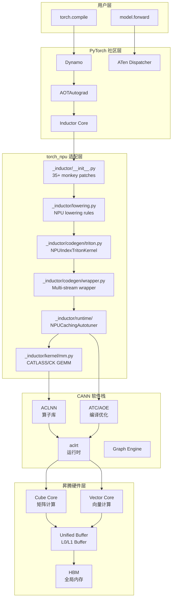

# torch.compile 路径分析（一）：Inductor Triton 路径

> 分析对象：`Dynamo → AOTAutograd → Decomposition → Lowering → Scheduler → Codegen`（default/Triton 路径）  
> 核心代码位置：`torch_npu/_inductor/`  
> 版本：torch_npu v2.7.1

---

## 一、路径概述

这是 torch_npu 三条编译路径中最复杂、维护成本最高的一条。它表面上复用了 PyTorch Inductor 的编译管线，但在**每一个阶段都插入了 NPU 特有的修改**。该路径由 `TORCHINDUCTOR_NPU_BACKEND=default`（默认）激活。

### 1.1 完整数据流

```
PyTorch Python Code
    ↓
Dynamo (bytecode → FX Graph)
    ↓
AOTAutograd (forward/backward 分离)
    ↓
Decomposition (aten → prims / custom decomp)
    ↓
NPU Lowering (prims → NPU IR, 859+ aten op fallback 到 ACLNN)
    ↓
NPU Scheduler (NPUCombinedScheduling: CATLASS + Triton + NoLinearTriton)
    ↓
NPU Codegen (NPUWrapperCodeGen / CppWrapperNpu)
    ↓
NPU Runtime (NPUCachingAutotuner + profiling-based benchmark)
    ↓
ACLNN / CATLASS Kernel / NPU Triton Kernel → CANN Runtime → NPU 执行
```

### 1.2 与社区 CUDA 路径的直观对比

| 阶段 | CUDA 路径 | NPU Triton 路径 | 差异程度 |
|---|---|---|---|
| Backend 注册 | `register_backend_for_device('cuda', ...)` | `register_backend_for_device('npu', ...)` + 35 patches | 表面一致，底层 diverge |
| Lowering | ~200 个 Triton lowerings | 859 个 aten op fallback + 自定义 lowering | **极大** |
| Scheduler | `TritonScheduling` | `NPUCombinedScheduling` (CATLASS + Triton + NoLinear) | 大 |
| Codegen | `PythonWrapperCodegen` | `NPUWrapperCodeGen` (multi-stream, static kernel) | 大 |
| GEMM | Triton GEMM + CUTLASS | CATLASS + CK + CppGemm + ATen fallback | 大 |
| Autotune | CUDA events | NPU profiler (`torch_npu.profiler`) | 中等 |
| Runtime | `CachingAutotuner` | `NPUCachingAutotuner` | 中等 |

### 1.3 NPU 调用流程图

```mermaid
flowchart TD
    A[用户调用 torch.compile(model)] --> B[Dynamo<br/>torch._dynamo.optimize]
    B --> C{后端选择}
    C -->|default| D[AOTAutograd<br/>torch._functorch.aot_autograd]
    D --> E[Decomposition<br/>torch._inductor.decomposition]
    E --> F[NPU Lowering<br/>torch_npu._inductor.lowering]
    F --> G{859 fallback ops?}
    G -->|是| H[ACLNNEager<br/>aten fallback]
    G -->|否| I[Inductor IR<br/>Pointwise/Reduction]
    H --> J[NPU Scheduler<br/>NPUCombinedScheduling]
    I --> J
    J --> K{调度决策}
    K -->|GEMM| L[CATLASS/CK/CppGemm]
    K -->|Element-wise<br/>Reduction| M[NPU Triton Codegen<br/>NPUIndexTritonKernel]
    K -->|NoLinear| N[NPUNoLinearTritonScheduling]
    L --> O[NPU Wrapper CodeGen<br/>NPUWrapperCodeGen]
    M --> O
    N --> O
    O --> P[Async Compile<br/>CustomAsyncCompile]
    P --> Q[NPU Runtime<br/>NPUCachingAutotuner]
    Q --> R{Autotune 选择}
    R --> S[ACLNN Kernel]
    R --> T[CATLASS Kernel]
    R --> U[NPU Triton Kernel]
    S --> V[CANN Runtime<br/>aclrtLaunchKernel]
    T --> V
    U --> V
    V --> W[NPU 达芬奇架构<br/>Cube Core + Vector Core]
```

### 1.4 软件逻辑架构图



---

## 二、为什么有这些差异？

### 2.1 硬件架构差异是根本驱动力

Ascend NPU 采用**达芬奇架构**，与 CUDA GPU 的 SIMT（Single Instruction Multiple Threads）模型存在本质区别：

| 特性 | CUDA GPU | Ascend NPU |
|---|---|---|
| 计算核心 | SM (Streaming Multiprocessor) | Cube Core + Vector Core |
| 并行模型 | SIMT (thread/block/grid) | SIMD (vector) + SIMT (scalar) 混合 |
| 内存层次 | Global → Shared → Register | L0 Buffer → L1 Buffer → Unified Buffer |
| 矩阵运算 | Tensor Core (WMMA) | Cube Core ( specialized MAC array) |
| 向量运算 | CUDA cores | Vector Core |

这导致**社区 Triton 无法直接为 NPU 生成高效 kernel**。Triton 的编程模型（`tl.load`/`tl.store` 基于 block/thread 语义）假设了 CUDA SIMT 的内存和执行模型，而 NPU 需要完全不同的 tiling 策略和索引线性化逻辑。

### 2.2 十大关键差异点（带代码证据）

#### 差异 1：Triton Codegen 中的 Golden Var List / Unified Axis 逻辑

**位置**：`torch_npu/_inductor/codegen/triton.py:2933-2959`

这是 NPU Triton codegen 最核心的独创逻辑。在 CUDA Triton 中，kernel 的迭代维度（tiling axis）直接从 scheduler 继承，不需要额外的 "golden variable selection"。但 NPU 由于 SIMD/SIMT 混合执行模式，需要：

1. **检测不同 load/store 索引中的 expansion 模式差异**（`_detect_different_expansions`）
2. **选择一组 "golden vars" 作为统一的 tiling 基准**（`select_golden_varlist`）
3. **对存在差异的维度做坐标变换**（`_generate_coordinate_transform_code`）

```python
def select_golden_varlist(self):
    different_expansions = self._detect_different_expansions()
    guarded_expansions = self._build_guarded_expansions(different_expansions)
    if different_expansions:
        self._apply_guarded_expansions(guarded_expansions)
    else:
        self._select_golden_varlist_normal_case()
```

**为什么 CUDA 不需要**：CUDA Triton kernel 中所有 load/store 操作共享相同的 block/thread 迭代空间，不需要跨不同 buffer 的维度对齐和坐标变换。

#### 差异 2：Scheduler 继承自 `CUDACombinedScheduling`

**位置**：`torch_npu/_inductor/codegen/npu_combined_scheduling.py:23`

```python
class NPUCombinedScheduling(CUDACombinedScheduling):
    def __init__(self, scheduler: Optional[Scheduler]) -> None:
        BaseScheduling.__init__(self, scheduler)
        self._nolinear_triton_scheduling = NPUNoLinearTritonScheduling(scheduler)
        self._triton_scheduling = NPUTritonScheduling(scheduler)
        self._catlass_scheduling = CATLASSScheduling(scheduler)
```

NPU 没有独立的 Scheduling 基类，而是**寄生在 CUDA 的调度器之上**，再叠加三个子调度器。这本身就说明了社区没有为 NPU 这类 "SIMD+SIMT 混合架构" 提供标准抽象。

#### 差异 3：CATLASS 作为 GEMM 首选模板

**位置**：`torch_npu/_inductor/kernel/mm.py:103-110`

```python
if (is_contiguous_input and is_nonzero and use_catlass_template("mm", layout, m, n, k)):
    CATLASS1xGemmTemplate.add_catlass_gemm_choices(choices, layout, [mat1, mat2])
```

NPU 的 `tuned_mm` 优先尝试 CATLASS 模板，其次 CK (Composable Kernel)，最后才是 CppGemm。社区 CUDA 路径优先使用 Triton GEMM template。CATLASS 是华为基于 CUTLASS 理念为 Ascend 开发的模板库，**社区没有等价物**。

#### 差异 4：Inductor 核心函数的 30+ Monkey Patches

**位置**：`torch_npu/_inductor/__init__.py`

完整清单见主报告。最典型的是：

- `patch_is_gpu()`：将 `'npu'` 硬塞进 `GPU_TYPES` list
- `patch_has_triton()`：欺骗上游认为 NPU 支持 Triton
- `patch_triton_scheduling()`：完全替换 `TritonScheduling`

这些 patch 的存在直接证明：**社区 Inductor 的设备抽象层在 v2.7.1 时期远远不够成熟**。

#### 差异 5：Lowering Fallback 规模

**位置**：`torch_npu/_inductor/lowering_fallback_list.py`

859 个 aten op 被强制 fallback。这意味着 **Inductor 的融合优化管道对 NPU 基本不可用**——绝大多数 op 会直接调用 eager ACLNN，无法参与 fusion。

为什么这么多 op 不能 lowering？
- **位运算**（`__and__`, `__or__`, `__lshift__` 等）：NPU 的 Cube Core 不支持位运算的向量化 tiling
- **分布式通信**：Inductor 没有为 NPU 实现通信算子的 lowering
- **Higher-order ops**（`cond`, `while_loop`）：控制流在 NPU 上需要特殊处理
- **Random/RNG**：NPU 的 RNG 状态管理与 CUDA 不同

#### 差异 6：`make_reduction` 被全局替换

**位置**：`torch_npu/_inductor/__init__.py:96`

```python
inductor_lowering.make_reduction = make_reduction
```

NPU 的 `make_reduction` 在创建 reduction IR 时会附加 `traced_graph` metadata，供下游 MLIR/kernel 选择使用。这是 NPU 特有的 tracing 需求，社区没有这种 metadata。

#### 差异 7：NPU 特有的 Indirect Memory Mode

**位置**：`torch_npu/_inductor/config.py:173-180`

```python
inductor_indirect_memory_mode = os.environ.get("INDUCTOR_INDIRECT_MEMORY_MODE", "simd_simt_mix")
# 可选值：fallback, simt_template, simt_only, simd_simt_mix
```

NPU 为间接内存访问（`gather`, `scatter`, `index_select`）定义了四种执行模式。这是因为 NPU 的 SIMD/SIMT 混合架构对不规则内存访问有不同的处理策略。社区 CUDA 没有这种概念——所有间接内存都走标准的 Triton pointer arithmetic。

#### 差异 8：Wrapper CodeGen 的多流支持

**位置**：`torch_npu/_inductor/codegen/wrapper.py`

NPU 的 `NPUWrapperCodeGen` 在生成的 Python wrapper 中注入了**多流执行**的代码（`buffer_define_multi_stream`、`extern_node_intent_multi_stream`）。CUDA Inductor 生成的 wrapper 是单流的。这是因为 NPU 的异步执行模型和 stream 语义与 CUDA 不同。

#### 差异 9：Autotune 使用 NPU Profiler 而非 CUDA Events

**位置**：`torch_npu/_inductor/runtime/triton_heuristics.py`

```python
# NPUCachingAutotuner 使用 torch_npu.profiler 做 benchmark
# 而非上游的 CUDA events
```

NPU 没有 CUDA event 的精确计时机制，autotune 只能依赖 profiler 的粗略时间统计。这导致 NPU 的 autotune 精度比 CUDA 低。

#### 差异 10：Decomposition 表的增删改

**位置**：`torch_npu/_inductor/decomposition.py`

NPU 从上游 decomposition 表中**移除**了 `nll_loss_forward`、`log_softmax_backward_data`、`addmm`、`gelu`、`native_layer_norm`，因为这些 op 在 NPU 上**预先编译好的融合 kernel** 比分解后的子 op 更快。同时**新增**了 `expm1`、`erfc` 的 decomposition。

这说明 NPU 的算子融合策略与社区**截然相反**：社区倾向于 decomposition + auto-fusion，NPU 倾向于保留粗粒度融合算子。

---

## 三、实现思路是否遵循社区逻辑？

### 3.1 "遵循社区逻辑"的部分

| 组件 | 遵循方式 |
|---|---|
| **Backend 注册** | 正确使用 `register_backend_for_device('npu', ...)` |
| **Lowering 架构** | 使用 `@register_lowering(aten.xxx)` 装饰器，与社区一致 |
| **Scheduler 接口** | `NPUCombinedScheduling` 实现了 `BaseScheduling` 的所有抽象方法 |
| **Wrapper CodeGen 继承** | `NPUWrapperCodeGen(PythonWrapperCodegen)`、`CppWrapperNpu(CppWrapperCpu)` |
| **FX Pass 注册** | 使用社区标准的 `pre_grad`/`post_grad` pass 机制 |

### 3.2 "打破社区逻辑"的部分

| 组件 | 打破方式 | 原因 |
|---|---|---|
| **Triton Kernel 生成** | 完全替换 `TritonScheduling` + `TritonKernelOverrides` | NPU Triton 不支持标准 TL builtins |
| **Autotune** | 替换 `CachingAutotuner` 为 `NPUCachingAutotuner` | 无 CUDA event，需用 profiler |
| **Device 识别** | Monkey-patch `GPU_TYPES` 和 `has_triton()` | 社区没有 NPU 设备类型 |
| **Cache Key** | Monkey-patch `CacheBase.get_system` | 社区 cache key 不含 CANN 版本 |
| **AOTI C++ Wrapper** | Monkey-patch `AotCodeCompiler.compile` | 社区 AOTI 不支持 NPU extern kernel |
| **GraphLowering** | 复刻 `run_node` 并添加 NPU 逻辑 | 需要 origin_node tracking for NPU IR |

### 3.3 总体判断

NPU Triton 路径在**宏观架构**上遵循了社区 Inductor 的设计模式（backend registration → lowering → scheduling → codegen → runtime），但在**微观实现**上几乎每一个阶段都需要 override。这不是 torch_npu 团队的问题，而是**社区 Inductor 在 v2.7.1 时期的设备抽象确实没有为 "非 CUDA SIMT 架构" 做好准备**。

---

## 四、这条路径为什么会存在？

### 4.1 它解决的问题

1. **训练场景的支持**：torchair（graph compiler）主要面向推理优化，对训练中的 dynamic shapes、autograd、checkpointing 支持有限。Triton 路径是训练 `torch.compile()` 的唯一可行选择。
2. **通用算子覆盖**：虽然 859 个 op fallback，但剩余的可 lowering op（如 element-wise、reduction、简单的 matmul）仍然可以通过 Inductor 的 fusion 获得性能提升。
3. **与 PyTorch 生态兼容**：用户可以用标准的 `torch.compile()` API，无需切换到华为特定的编译接口。

### 4.2 它的优势和劣势

**优势**：
- 兼容标准 `torch.compile()` API
- 支持 training + autograd
- 动态形状支持较好（相对于 MLIR 路径）
- 版本迁移成本低于 fork PyTorch

**劣势**：
- 维护成本极高（35+ patches，上游每变一次就需跟进）
- 性能受限于 fallback 规模（大量 op 无法融合）
- autotune 精度低于 CUDA
- Triton-like codegen 对 NPU 硬件的利用率不如手工优化 kernel

### 4.3 用户选择这条路径的场景

- 使用 `torch.compile()` 做**训练**
- 模型中包含大量**动态形状**（如 NLP 中的 variable sequence lengths）
- 不需要极致推理性能，更看重**开发效率**
- torchair 路径不支持某些算子时的 fallback

---

## 五、后续如何演进贴近社区？

### 5.1 短期（v2.9.0 / master 已在推进）

从 `tools/compile_pr_radar/knowledge/` 可以看到 torch_npu 团队已在执行：

| 演进动作 | 状态 | 效果 |
|---|---|---|
| 将 patches 归入 `patch_torch_for_aoti()` | v2.9.0 已做 | 非核心 patch 可一键禁用 |
| 引入 `NPUDeviceOpOverrides` | v2.9.0 已做 | 用标准接口替代部分 patch |
| 引入 `_compat` 兼容层 | master 已做 | 隔离上游版本差异 |
| 删除已合并的 20+ patches | v2.9.0 → master | patch 数从 35→10→8 |

### 5.2 中期（建议）

#### A. 减少 lowering fallback list

这是**最关键的改进点**。当前 859 个 fallback 使 Inductor 的价值大打折扣。

**优先级 1**：位运算 lowering（`__and__`, `__or__`, `__xor__`, `__lshift__`, `__rshift__`）
- 这些 op 在 mask 计算中极其常见
- 实现难度低（element-wise， tiling 简单）
- 移除后可显著提升 transformer 类模型的 fusion 覆盖率

**优先级 2**：reduction 相关 fallback（`cumsum`, `cumprod`, `prod`, `var`）
- NPU 的 Vector Core 适合做 reduction
- 社区已有成熟的 Triton reduction template，可参考移植

**优先级 3**：distributed op lowering
- 当前所有 `c10d_functional` 算子都 fallback
- 这导致 `torch.compile()` + FSDP/DDP 在 NPU 上几乎无法工作
- 需要与社区共同推动 distributed compile 的标准化

#### B. 推动社区完善设备抽象

| 社区修改点 | 对 NPU 的收益 | 推动难度 |
|---|---|---|
| `is_gpu()` → `supports_backend_feature()` | 删除 `patch_is_gpu` | 低 |
| `cudagraphs` → `device_graphs` | 删除 ACLGraph patch | 中 |
| `CUDA_VISIBLE_DEVICES` → `TORCH_DEVICE_IDS` | 删除 `patch_tuning_process` | 低 |
| `CacheBase.get_system` 支持插件 | 删除 `patch_cache_base_get_system` | 中 |
| `TritonKernelOverrides` 可扩展 | 减少 Triton codegen patch | **高** |
| `Scheduler.are_long_distant_nodes` 可配置 | 删除 `patch_scheduler` | 中 |

#### C. 统一 ascend_npu_ir 与 default 路径的 runtime

当前 MLIR 路径和 default 路径有**完全独立的 code cache、async compile、runtime**。建议将两者的 runtime 层统一：
- 共用 `NPUCachingAutotuner`
- 共用 autotune cache 格式
- 仅替换 kernel compiler（Triton-like vs MLIR）

### 5.3 长期（架构演进）

#### A. 投资 NPU Triton Backend

如果能实现一个标准的 Triton backend for Ascend（类似 Intel XPU Triton、AMD ROCm Triton），则可以：
- 删除 `patch_triton_scheduling`、`patch_gen_common_triton_ext_imports` 等核心 patch
- 复用社区的 Triton GEMM template，减少 CATLASS 维护成本
- 让社区开发者能为 NPU 写 Triton kernel

**挑战**：Triton 的核心设计假设（block/thread/threadblock、shared memory）与达芬奇架构差异较大。需要华为与 OpenAI Triton 团队深度合作。

#### B. 让 torchair 替代 Inductor 成为主力路径

对于推理场景，torchair（graph compiler）的性能往往优于 Inductor。如果能：
1. 让 torchair 支持更多训练特性（autograd、dynamic shapes）
2. 推动社区定义标准的 `torch.compile(backend="graph_compiler")` 接口
3. 让 torchair 成为与 Inductor 平行的官方后端

那么 Triton 路径的维护压力将大幅降低，只需保留作为 torchair 不支持场景下的 fallback。

---

## 六、总结

Inductor Triton 路径是 torch_npu 与社区差距**最大**的一条路径。它的 35+ monkey patches 和 859 个 lowering fallback 是**结构性问题**的表象，根源在于：

1. **达芬奇架构与 CUDA SIMT 的本质差异**，导致 Triton 编程模型不完全适用
2. **社区 Inductor 设备抽象的历史不成熟**，大量 CUDA-hardcoded 逻辑缺乏扩展钩子
3. **CANN 闭源软件栈的限制**，很多 kernel 只能以 pre-built binary 存在

**演进优先级**：
1. 🔴 **最高**：减少 lowering fallback（尤其是位运算和 reduction）
2. 🟠 **高**：推动社区 Inductor 设备抽象完善（Scheduler 可配置、cache key 可扩展等）
3. 🟡 **中**：统一 MLIR / default 路径的 runtime
4. 🟢 **低**：投资 NPU Triton backend（长期但根本性）

---

## Related Pages

- [[npu_compile_paths_overview]] — torch_npu 三条编译路径全景概览（上级分析）
- [[NPU_Inductor_Backend_Analysis]] — NPU Inductor 后端集成架构
- [[NPU_Inductor_Backend_Mechanism]] — NPU 后端内部机制
- [[npu_lowering_guide]] — NPU 特定 lowering 步骤与算子映射
- [[npu_compile]] — NPU 编译工作流
- [[inductor_compiler_pipeline_analysis]] — PyTorch Inductor 端到端编译管线
- [[triton_vs_mlir_backend_analysis]] — Triton vs Torch-MLIR 后端对比
- [[npu_inductor_optimization_analysis]] — NPU Inductor 优化思想全景（硬件特性 → 思想 → 案例，本页「what/how」的「why」侧互补）
