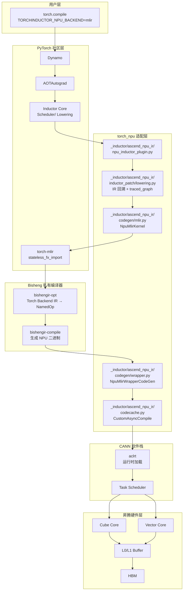

# torch.compile 路径分析（三）：MLIR 路径

> 分析对象：`TORCHINDUCTOR_NPU_BACKEND=mlir` 触发的 Inductor-MLIR 编译管线
> 核心代码位置：`torch_npu/_inductor/ascend_npu_ir/`、`torch_npu/_inductor/__init__.py`
> 版本：torch_npu v2.7.1

---

## 一、路径概述

MLIR 路径是 torch_npu 三条编译路径中最"激进"的一条——它**完全弃用了 Triton**，将 Inductor 作为前端图优化器，通过 `torch-mlir` 将 FX Graph 转换为 MLIR，再经由华为私有的 **Bisheng 编译器**生成 NPU 二进制。该路径由 `TORCHINDUCTOR_NPU_BACKEND=mlir` 激活。

### 1.1 完整数据流

```
PyTorch Python Code
    ↓
Dynamo (bytecode → FX Graph)
    ↓
AOTAutograd (forward/backward 分离)
    ↓
Decomposition (aten → prims)
    ↓
NPU MLIR Lowering (prims → Inductor IR, 带 traced_graph 回溯)
    ↓
NPU MLIR Scheduler (NpuMlirScheduling: 融合后回溯为 FX 子图)
    ↓
MLIR Codegen (NpuMlirKernel: FX Graph → torch-mlir → Bisheng → NPU 二进制)
    ↓
NpuMlirWrapperCodeGen (生成 wrapper, 调用 mlir_fused_xxx.run)
    ↓
CustomAsyncCompile + NPUTritonFuture (异步编译 + 自动 fallback)
    ↓
CANN Runtime → NPU 执行
```

### 1.2 与社区默认 Inductor 的直观对比

| 阶段 | 社区默认 Inductor | NPU MLIR 路径 | 差异程度 |
|---|---|---|---|
| Backend 注册 | `register_backend_for_device('cuda', TritonScheduling, PythonWrapperCodegen)` | `register_backend_for_device('npu', NpuMlirScheduling, NpuMlirWrapperCodeGen)` | 表面一致 |
| Triton codegen | 默认走 Triton | 改用 MLIR codegen（`has_triton` 仍返回 True，见 §2.1） | **极大** |
| Lowering | Triton lowerings + extern kernel | 自定义 lowering + `traced_graph` 回溯 | **极大** |
| Scheduler | `TritonScheduling` / `CUDACombinedScheduling` | `NpuMlirScheduling`（SIMDScheduling 子类） | 大 |
| Codegen | Triton kernel / Cpp wrapper | `NpuMlirKernel.codegen_kernel`（torch-mlir + Bisheng） | **极大** |
| IR 中间层 | Triton AST / C++ | Torch-MLIR → NamedOp Backend IR | **极大** |
| 编译方式 | JIT Triton compilation | `bishengir-opt` + `bishengir-compile` 离线编译 | **极大** |
| Fallback | ATen eager / CppGemm | `auto_fallback` 自动回退到 FX Graph | 中等 |
| 异步编译 | `AsyncCompile` | `CustomAsyncCompile` + `MulitprocessCompileFuture` | 中等 |

### 1.3 NPU 调用流程图

```mermaid
flowchart TD
    A[用户调用 torch.compile(model,<br/>options={npu_backend: mlir})] --> B[Dynamo<br/>torch._dynamo]
    B --> C[AOTAutograd<br/>AotAutograd.__call__<br/>注入 npu_optimize_fx_graph]
    C --> D[Decomposition<br/>禁用上采样分解]
    D --> E[NPU MLIR Lowering<br/>inductor_patch/lowering.py]
    E --> F{为每个 IR 节点<br/>附加 traced_graph}
    F --> G[Inductor IR<br/>Pointwise/Reduction]
    G --> H[NPU MLIR Scheduler<br/>NpuMlirScheduling]
    H --> I{Scheduler Monkey Patch<br/>npu_can_fuse_vertical}
    I --> J[融合后子图<br/>merge_traced_graphs]
    J --> K[NpuMlirKernel<br/>codegen_kernel]
    K --> L[torch-mlir<br/>stateless_fx_import]
    L --> M[Torch Backend IR<br/>torch-lower-to-backend-contract]
    M --> N[Bisheng 编译器<br/>bishengir-opt]
    N --> O[NamedOp Backend IR]
    O --> P[bishengir-compile]
    P --> Q[NPU 二进制<br/>*.so / *.bin]
    Q --> R[NpuMlirWrapperCodeGen<br/>生成 wrapper]
    R --> S[CustomAsyncCompile<br/>异步编译]
    S --> T{NPUTritonFuture}
    T -->|编译成功| U[加载 kernel<br/>mlir_fused_xxx.run]
    T -->|编译失败| V[auto_fallback<br/>回退到 FX Graph]
    U --> W[CANN Runtime]
    V --> W
    W --> X[NPU 执行]
```

### 1.4 软件逻辑架构图



---

## 二、为什么有这些差异？

### 2.1 Triton 不可用的根本约束

NPU 达芬奇架构与 Triton 的编程模型（block/thread/shared memory）不匹配，故 MLIR 后端**改用 MLIR codegen、不生成 Triton kernel**（**订正**：并非通过 `has_triton=False` 关闭——`patch_has_triton` 对 NPU 实际返回 True；旁路 Triton 是经后端选择实现）：

**位置**：真实的 triton 门控逻辑在 `torch_npu/_inductor/utils.py:25-63` 的 `patch_has_triton()`（由 `torch_npu/_inductor/__init__.py:23` 调用）。`npu_inductor_plugin.py:68-69` 实为 `atexit.register(shutdown_compile_workers)`，并非 triton 禁用代码。（triton 禁用/门控位置随版本变动，以当前源码为准）

```python
# torch_npu/_inductor/utils.py:25-63
def patch_has_triton():
    @functools.lru_cache(None)
    def has_triton() -> bool:
        ...  # 按设备能力门控（npu 在 triton_supported_devices 中）
    torch.utils._triton.has_triton = has_triton
    torch._inductor.scheduler.has_triton = has_triton
```

这导致默认 Inductor 的核心 codegen 路径（TritonScheduling → TritonKernel → Triton AST → ptx/cubin）**完全不可用**，必须从零构建替代路径。

### 2.2 十大关键差异点（带代码证据）

#### 差异 1：IR 回溯机制（Inductor IR → FX Graph）

**位置**：`torch_npu/_inductor/ascend_npu_ir/ascend_npu_ir/npu/inductor_patch/ir.py:47-65`

```python
def _patch_loops_create(cls, *args, **kwargs):
    traced_graph = kwargs.pop("traced_graph", None)
    node_name = kwargs.pop("node_name", None)
    r = cls(*args, **kwargs)
    r._post_init_setattr("traced_graph", traced_graph)
    r._post_init_setattr("node_name", node_name)
    return ir.TensorBox.create(r)

ir.Loops.create = _patch_loops_create
```

以及 `inductor_patch/lowering.py` 中的 `make_pointwise`：

```python
input_graphs = fetch_graphs(inputs)
node_name = f'pointwise_{next(node_id)}'
origin_fn = fn_to_aten_fn[fn]
new_graph = merge_traced_graphs(input_graphs, origin_fn, node_name, **kwargs)
return Pointwise.create(
    device=device, dtype=dtype, inner_fn=inner_fn, ranges=ranges,
    node_name=node_name, traced_graph=new_graph,
)
```

这是 MLIR 路径**最核心的独创逻辑**。默认 Inductor 的 lowering 产生的是纯 Inductor IR（`Pointwise` / `Reduction` / `ExternKernel`），scheduler 融合后直接生成 Triton/C++ 代码。但 MLIR 路径需要**将融合后的子图重新构造成 FX Graph**，才能喂给 `torch-mlir` 的导入接口。

**为什么需要回溯**：`torch-mlir` 的 `stateless_fx_import` 只接受 `torch.fx.GraphModule` 作为输入，不接受 Inductor 的 `ir.Loops`。因此必须在 lowering 阶段就为每个 IR 节点保留其来源的 FX 子图，并在 scheduler 融合后合并这些子图。

#### 差异 2：Scheduler 的多处 Monkey Patch

**位置**：`torch_npu/_inductor/ascend_npu_ir/ascend_npu_ir/npu/npu_inductor_plugin.py:267-398`

```python
def npu_compute_ancestors(self) -> None:
    # 重新计算节点祖先依赖
    ...

def _npu_prune_redundant_deps(...) -> None:
    # 剪枝冗余弱依赖
    ...

def npu_can_fuse_vertical(self, node1, node2) -> bool:
    # 定制垂直融合规则
    ...

def wrap_scheduler_codegen(fn):
    # 在 codegen 前重新计算 last_usage
    ...

if anir_config.enable_graph_trace:
    Scheduler._codegen = wrap_scheduler_codegen(Scheduler._codegen)
    Scheduler.compute_ancestors = npu_compute_ancestors
    scheduler._prune_redundant_deps = _npu_prune_redundant_deps
    Scheduler.can_fuse_vertical = npu_can_fuse_vertical
    Scheduler._get_unmet_dep_nodes = _npu_get_unmet_dep_nodes
```

默认 Inductor 的 scheduler 融合策略针对 Triton kernel 的内存和并行模型优化。MLIR 路径需要**面向 Bisheng 编译器的融合偏好**重新调整：
- `npu_compute_ancestors`：Bisheng 对跨融合节点的数据依赖有更严格的要求
- `npu_can_fuse_vertical`：修改垂直融合条件，避免生成 Bisheng 难以优化的子图形状
- `wrap_scheduler_codegen`：重新计算 `last_usage` 以匹配 NPU 的内存回收策略

#### 差异 3：NpuMlirKernel 的 codegen_kernel 完全重写

**位置**：`torch_npu/_inductor/ascend_npu_ir/ascend_npu_ir/npu/codegen/mlir.py:109-146`

```python
def codegen_kernel(self, name=None):
    code = IndentedBuffer()
    import torch_mlir
    from ..torch_mlir_patch import stateless_fx_import
    from torch_mlir.compiler_utils import run_pipeline_with_repro_report

    mlir_module = stateless_fx_import(
        self._gm_with_prim_cast,
        model_name=model_name,
        import_symbolic_shape_expressions=False)

    run_pipeline_with_repro_report(
        mlir_module,
        f"builtin.module(torch-lower-to-backend-contract)",
        "Lowering TorchFX IR -> Torch Backend IR",
    )
```

默认 Inductor 的 `TritonKernel.codegen_kernel` 生成的是 Triton Python 代码字符串。`NpuMlirKernel` 则：
1. 将 FX Graph 通过 `torch-mlir` 导入为 MLIR 模块
2. 运行 `torch-lower-to-backend-contract` pipeline
3. 后续再调用 `bishengir-opt` 和 `bishengir-compile` 生成 NPU 二进制

这是**与社区路径完全不同的 codegen 范式**。

#### 差异 4：私有后端编译器 Bisheng

**位置**：`torch_npu/_inductor/ascend_npu_ir/ascend_npu_ir/npu/utils.py`（MLIRProcessor）

```python
cmd = (f"{self.bisheng_torch_mlir_path} "
       "--torch-backend-to-named-op-backend-pipeline="
       "\"ensure-no-implicit-broadcast=true\" "
       f"{torch_mlir_path}")
result = subprocess.check_output(cmd, text=True, shell=True)
```

以及 `mlir_compiler.py`：

```python
bisheng_ir_compile_path = os.path.join(bisheng_install_path, "bishengir-compile")
command = [
    bisheng_ir_compile_path,
    "-enable-hfusion-compile=true",
    "--enable-bin-relocation=0",
    f"-block-dim={anir_config.block_dim}",
]
```

社区 MLIR 路径通常是 `torch-mlir` → `linalg` → `LLVM IR` → 执行（如 IREE）。MLIR 路径在 Torch Backend IR 之后转入了**华为私有的 Bisheng 编译器**，生成昇腾专用二进制。这是与社区差距最大的点。

#### 差异 5：大量 Inductor 优化被强制关闭

**位置**：`torch_npu/_inductor/ascend_npu_ir/ascend_npu_ir/npu/npu_inductor_plugin.py:79-82`

```python
config.layout_optimization = False
config.size_asserts = False
config.fallback_random = True
config.optimize_scatter_upon_const_tensor = False
```

以及：

```python
dynamo_config.fake_tensor_cache_enabled = False
```

MLIR 路径**主动禁用了多项社区 Inductor 优化**：
- `layout_optimization=False`：Bisheng 编译器自行处理 layout，Inductor 的 layout 优化反而可能冲突
- `size_asserts=False`：动态 shape 场景下避免编译期断言失败
- `fallback_random=True`：NPU 的 RNG 实现与社区不同，需要 fallback 处理
- `fake_tensor_cache_enabled=False`：避免 fake tensor 缓存与 MLIR 导入的元数据不一致

#### 差异 6：dynamo run_node 被 patch

**位置**：`torch_npu/_inductor/ascend_npu_ir/ascend_npu_ir/npu/npu_inductor_plugin.py:147-200`

```python
def _patch_run_node(tracer, node, args, kwargs, nnmodule):
    # patch start
    if 'npu.npu_fusion_attention' in str(node.target):
        if 'actual_seq_qlen' in kwargs:
            kwargs['actual_seq_qlen'] = list(kwargs['actual_seq_qlen'])
        if 'actual_seq_kvlen' in kwargs:
            kwargs['actual_seq_kvlen'] = list(kwargs['actual_seq_kvlen'])
    # patch end
    return node.target(*args, **kwargs)

torch._dynamo.utils.run_node = _patch_run_node
```

MLIR 路径直接 patch 了 Dynamo 最核心的 `run_node` 函数，将 NPU 融合注意力算子的序列长度参数从 tensor 转换为 list。这反映了**Dynamo 对 NPU 原生算子的支持不足**，必须在执行期做类型转换。

#### 差异 7：AotAutograd 被包装以注入 NPU 优化

**位置**：`torch_npu/_inductor/ascend_npu_ir/ascend_npu_ir/npu/npu_inductor_plugin.py:202-222`

```python
def wrap_compiler(fn):
    def npu_compiler(gm, example_inputs, *args, **kwargs):
        npu_optimize_fx_graph(gm)
        return fn(gm, example_inputs, *args, **kwargs)
    return npu_compiler

def wrap_aot_autograd(fn):
    def npu_aot_autograd(*args, **kwargs):
        _register_npu_inductor_fallbacks()
        def wrap_compiler_by_key(name):
            if name in kwargs:
                kwargs[name] = wrap_compiler(kwargs[name])
        wrap_compiler_by_key('fw_compiler')
        wrap_compiler_by_key('bw_compiler')
        wrap_compiler_by_key('inference_compiler')
        return fn(*args, **kwargs)
    return npu_aot_autograd

AotAutograd.__call__ = wrap_aot_autograd(AotAutograd.__call__)
```

MLIR 路径在 AOTAutograd 的编译器回调中**强制注入了 `npu_optimize_fx_graph`**，这是社区没有的前置优化 pass。同时通过 `_register_npu_inductor_fallbacks` 注册了 NPU 特有的 fallback 算子表。

#### 差异 8：隐式分解的禁用列表

**位置**：`torch_npu/_inductor/ascend_npu_ir/ascend_npu_ir/npu/npu_inductor_plugin.py:128-144`

```python
def disable_implicit_decomposition():
    disable_aten_ops = [
        'aten.upsample_nearest1d.vec', 'aten.upsample_nearest1d.default',
        'aten.upsample_nearest2d.vec', 'aten.upsample_nearest2d.default',
        'aten.upsample_nearest3d.vec', 'aten.upsample_nearest3d.default',
        'aten.upsample_bilinear2d.vec', 'aten.upsample_bilinear2d.default',
    ]
    for op_override in decomposition_table.keys():
        if str(op_override) in disable_aten_ops:
            if DispatchKey.Autograd in op_override.py_kernels:
                op_override.py_kernels.pop(DispatchKey.Autograd)
            if DispatchKey.CompositeImplicitAutograd in op_override.py_kernels:
                op_override.py_kernels.pop(DispatchKey.CompositeImplicitAutograd)
```

MLIR 路径**从社区的 decomposition_table 中移除了上采样算子的隐式分解**。原因是：这些算子在分解为多个子算子后，Bisheng 编译器的融合效果反而不如保留原算子。这与默认 Triton 路径"分解 + 自动融合"的哲学**完全相反**。

#### 差异 9：Wrapper CodeGen 的环境变量注入

**位置**：`torch_npu/_inductor/ascend_npu_ir/ascend_npu_ir/npu/codegen/wrapper.py:61-94`

```python
def write_header(self) -> None:
    self.header.splice(f"""
        from ctypes import c_void_p, c_long
        import torch
        import torch_npu
        import math
        import random
        import os
        os.environ["TORCHINDUCTOR_NPU_BACKEND"] = 'mlir'
        ...
    """)
```

`NpuMlirWrapperCodeGen` 在生成的 Python wrapper 中**硬编码了环境变量设置**。这是为了确保运行时子进程也能识别当前处于 MLIR 模式。默认 Inductor 的 wrapper 不需要这种自引用环境变量注入。

#### 差异 10：独立的异步编译与自动 fallback 机制

**位置**：`torch_npu/_inductor/ascend_npu_ir/ascend_npu_ir/npu/codecache.py`（NPUTritonFuture）

```python
class NPUTritonFuture(CodeCacheFuture):
    def result(self) -> ModuleType:
        try:
            self.future.result()
            kernel = _load_kernel(...)
        except Exception as e:
            kernel = _load_fx_graph(...)  # 编译失败则回退到 FX Graph
```

MLIR 路径有自己的 `CustomAsyncCompile` 和 `MulitprocessCompileFuture`，并且实现了**编译失败自动 fallback 到 FX Graph** 的机制（`auto_fallback` 模式）。默认 Inductor 的 `AsyncCompile` 编译 Triton kernel 失败后通常直接抛异常，没有这种自动降级策略。

---

## 三、实现思路是否遵循社区逻辑？

### 3.1 "遵循社区逻辑"的部分

| 组件 | 遵循方式 |
|---|---|
| **torch-mlir 前端** | 使用 `stateless_fx_import`（社区推荐）和 `torch-lower-to-backend-contract`（社区标准 pipeline） |
| **Backend 注册** | 正确使用 `register_backend_for_device('npu', ...)` |
| **Inductor Scheduler 继承** | `NpuMlirScheduling` 继承 `SIMDScheduling`，复用拓扑排序、依赖分析等基础逻辑 |
| **Wrapper CodeGen 继承** | `NpuMlirWrapperCodeGen(PythonWrapperCodegen)` |
| **AOTAutograd 包装** | 在社区 AOTAutograd 框架内注入 NPU 优化，未替换整个框架 |

### 3.2 "打破社区逻辑"的部分

| 组件 | 打破方式 | 原因 |
|---|---|---|
| **Triton codegen 旁路** | MLIR 后端改用 MLIR codegen（`has_triton` 仍 True） | 达芬奇架构与 Triton block/thread 模型不匹配 |
| **IR 回溯** | monkey-patch `ir.Loops.create` 附加 `traced_graph` | torch-mlir 需要 FX Graph 输入 |
| **Scheduler 融合规则** | monkey-patch `Scheduler.can_fuse_vertical` 等 | Bisheng 编译器的融合偏好不同 |
| **后端编译器** | `bishengir-opt` + `bishengir-compile` | 社区无昇腾后端 |
| **Dynamo run_node** | 替换 `torch._dynamo.utils.run_node` | NPU 算子参数类型需要转换 |
| **Inductor 配置** | 强制关闭 layout_optimization / size_asserts / fake_tensor_cache | 与 MLIR / Bisheng 路径冲突 |

### 3.3 总体判断

MLIR 路径在**宏观理念**上遵循了社区 "torch.compile → FX Graph → 编译器后端" 的架构，但在**微观实现**上因缺少标准化的后端插件接口而大量依赖 monkey-patch。其核心问题与 Triton 路径类似：**社区 Inductor 没有为 "非 Triton 后端" 提供足够的扩展钩子**。

---

## 四、这条路径为什么会存在？

### 4.1 它解决的问题

1. **Triton 不可用的替代方案**：为 NPU 提供一条不依赖 Triton 的编译路径
2. **利用昇腾原生编译生态**：通过 Bisheng 编译器生成针对达芬奇架构深度优化的二进制
3. **保留 Inductor 前端能力**：复用 Inductor 的图优化、调度器融合、内存规划等成熟能力
4. **与 torchair 的差异化定位**：torchair 基于 XLA/StableHLO，MLIR 路径基于 Inductor + torch-mlir，两者覆盖不同用户场景

### 4.2 它的优势和劣势

**优势**：
- 绕过了 Triton 对 NPU 的适配难题
- Bisheng 编译器可对达芬奇架构做深度优化（如 Cube Core 指令调度、L0/L1 Buffer  tiling）
- 保留了 `torch.compile()` 标准 API，用户无感知切换
- `auto_fallback` 机制提供了编译失败的 graceful degradation

**劣势**：
- **IR 回溯机制脆弱**：monkey-patch `ir.Loops.create` 和 `merge_traced_graphs` 在上游 IR 结构变化时容易失效
- **Scheduler patch 维护成本高**：每次 Inductor scheduler 升级都需要重新验证融合规则
- **Bisheng 编译器是闭源黑盒**：调试困难，编译失败时错误信息不透明
- **动态形状支持有限**：虽然支持 symbolic shapes，但 `size_asserts=False` 掩盖了部分问题
- **与社区 MLIR 生态割裂**：无法复用 IREE、ONNX-MLIR 等社区后端

### 4.3 用户选择这条路径的场景

- **推理性能优先**：Bisheng 编译器生成的二进制在固定 shape 推理场景通常优于 Triton 路径
- **算子融合深度要求高**：MLIR 路径可以表达更复杂的融合模式（如 multi-op fusion with custom tiling）
- **Triton 路径 fallback 过多**：当默认路径的 859 个 fallback 导致性能不可接受时，MLIR 路径可能通过 Bisheng 的 broader op support 获得更好效果
- **torchair 不兼容的模型**：某些模型在 torchair 的 XLA 路径上有问题，但在 Inductor-MLIR 路径上可以工作

---

## 五、后续如何演进贴近社区？

### 5.1 短期（v2.9.0 / master 已在推进）

| 演进动作 | 状态 | 效果 |
|---|---|---|
| `_compat` 兼容层隔离版本差异 | master 已做 | Inductor 升级时降低 patch 同步成本 |
| `NPUDeviceOpOverrides` 替代部分 patch | v2.9.0 已做 | 减少 monkey-patch 数量 |
| `patch_torch_for_aoti()` 条件化管理 patch | v2.9.0 已做 | 非核心 patch 可一键禁用 |

### 5.2 中期（建议）

#### A. IR 回溯机制的上游化

当前的 `traced_graph` / `node_name` patch 是 monkey-patch，脆弱且难以维护。建议向 PyTorch Inductor 上游提出：

1. **IR 扩展接口**：允许后端在 `ir.Loops` / `SchedulerNode` 上附加自定义元数据（如 `fx_subgraph`）
2. **FX subgraph reconstruction 钩子**：在 `Scheduler` 中增加通用机制，允许融合后的节点输出其对应的 FX 子图

理想形态：

```python
# 建议的上游化形式
class BackendSpecificLowering:
    def attach_metadata(self, ir_node, fx_node):
        ...

class BackendSpecificScheduler:
    def reconstruct_fx_subgraph(self, fused_nodes) -> torch.fx.GraphModule:
        ...
```

#### B. 推动昇腾后端进入 torch-mlir 社区

当前最大的私有化点是 `bishengir-opt` 和 `bishengir-compile`。演进路径：

1. **参与 torch-mlir 社区**：将昇腾后端作为 `torch-mlir` 的一个官方 target（类似 IREE HAL）
2. **标准化后端 pipeline**：使用 `torch-mlir` 的 `linalg-on-tensors` pipeline 替代私有的 `named-op-backend-pipeline`
3. **LLVM 昇腾后端**：如果 LLVM 社区有昇腾后端（或推动建设），则可走 `torch-mlir → linalg → LLVM IR → 昇腾` 的标准路径

#### C. Scheduler 插件化

`npu_inductor_plugin.py` 中的 scheduler monkey-patch 应转化为正式的继承/组合机制：

```python
# 建议形式
class NpuMlirScheduling(SIMDScheduling):
    def compute_ancestors(self):
        ...
    def can_fuse_vertical(self, node1, node2):
        ...
    def prune_redundant_deps(self):
        ...
```

而非运行时替换类方法。这需要社区将 `Scheduler` 的部分内部方法从"私有约定"提升为"可覆盖的扩展点"。

#### D. 减少 Dynamo 层的 run_node patch

`npu_fusion_attention` 的 `actual_seq_qlen` 类型转换应在 `torch_npu` 的算子注册层解决，而非 patch `torch._dynamo.utils.run_node`。这可以通过：
- 在 `torch.ops.npu.npu_fusion_attention` 的 Python 包装层做参数转换
- 或推动社区在 Dynamo 中支持更灵活的 `call_function` 参数适配器

### 5.3 长期（架构演进）

#### A. 统一三条路径的 runtime

当前 MLIR 路径、default 路径、ACLGraph 路径有**完全独立的 code cache、async compile、runtime 和 fallback 机制**。建议：
- 统一 `CustomAsyncCompile` 和 `AsyncCompile` 的接口
- 统一 cache key 格式（纳入 CANN 版本、Bisheng 版本）
- 统一 `auto_fallback` 策略

#### B. 让 torch-mlir 替代 Bisheng 的前端

`torch-mlir` 社区正在快速发展（如 `fx_importer` 新接口、更完善的 `linalg` pipeline）。torch_npu 应：
- 使用新版 `torch-mlir.fx_importer` 替代旧的 `stateless_fx_import`
- 参与 `torch-mlir` 的稀疏性、量化、动态形状等社区工作
- 将 NPU 特有的优化 pass 贡献回社区，而非在 Bisheng 中私有实现

---

## 六、总结

MLIR 路径是 torch_npu 三条编译路径中**与社区差异最大、架构最独特**的一条。它的核心差异来源于 **NPU 不支持 Triton** 和 **华为私有编译器生态** 两个根本约束。

**演进优先级**：
1. 🔴 **最高**：IR 回溯机制的上游化（将 `traced_graph` 变为正式 IR 扩展接口）
2. 🟠 **高**：推动昇腾后端进入 torch-mlir / LLVM 社区标准生态
3. 🟡 **中**：Scheduler 插件化（减少 can_fuse_vertical 等 monkey-patch）
4. 🟢 **低**：统一三条路径的 runtime 层（长期架构治理）

---

## Related Pages

- [[npu_compile_paths_overview]] — torch_npu 三条编译路径全景概览（上级分析）
- [[NPU_MLIR_Backend_Technical_Analysis]] — 基于 MLIR 的 NPU 后端技术分析（已有页面）
- [[npu_mlir_pipeline_analysis]] — NPU MLIR 六阶段适配全景（已有页面）
- [[torch_mlir_pass_pipeline_analysis]] — torch-mlir Pass 管线分析
- [[mlir_core_concepts]] — MLIR 基础概念
- [[triton_vs_mlir_backend_analysis]] — Triton vs Torch-MLIR 后端对比
