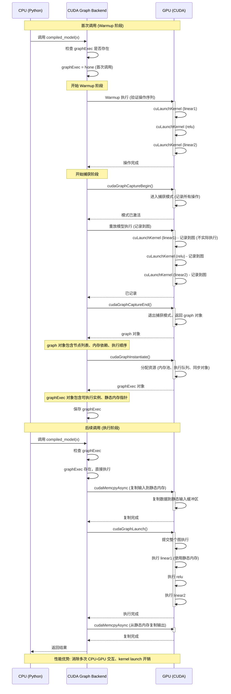
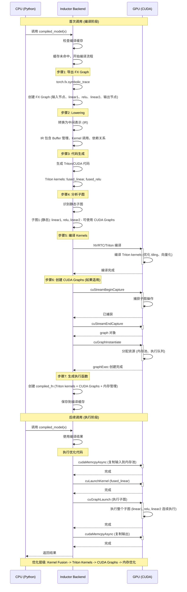
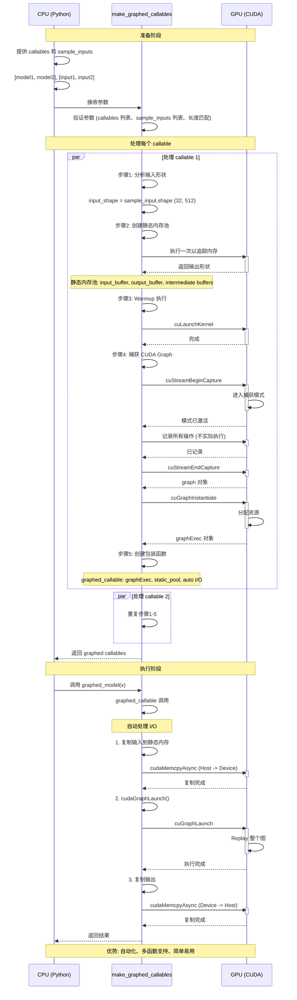
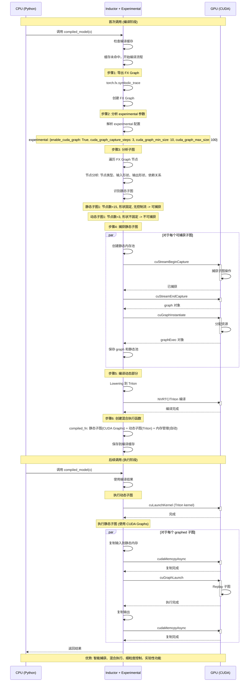

# PyTorch CUDA Graphs 代码调用流程时序图汇总

本文档包含所有5种 CUDA Graphs 使用方式的详细 Mermaid 时序图。

---

## 目录

1. [方式1: torch.compile(backend="cudagraphs")](#方式1-torchcompilebackendcudagraphs)
2. [方式2: torch.compile(backend="inductor", mode="reduce-overhead")](#方式2-torchcompilebackendinductor-modereduce-overhead)
3. [方式3: torch.cuda.graph() 上下文管理器](#方式3-torchcudagraph-上下文管理器)
4. [方式4: torch.cuda.make_graphed_callables](#方式4-torchcudamake_graphed_callables)
5. [方式5: experimental 参数](#方式5-experimental-参数)

---

## 方式1: torch.compile(backend="cudagraphs")

### 完整时序图



### 性能优势总结

**传统执行 (每次调用):**
```
CPU → Launch Kernel 1 → GPU → CPU → Launch Kernel 2 → GPU → CPU → Launch Kernel 3 → GPU
     (开销)              (等待)    (开销)              (等待)    (开销)              (等待)
```

**CUDA Graphs 执行 (后续调用):**
```
CPU → Replay CUDA Graph → GPU (执行所有操作)
     (一次开销)           (连续执行)
```

**优化效果:**
- ✓ 消除多次 CPU-GPU 交互
- ✓ 消除多次 kernel launch 开销
- ✓ 消除多次驱动程序调用
- ✓ 提高 GPU 利用率
- ✓ 减少总执行时间 30-70%

---

## 方式2: torch.compile(backend="inductor", mode="reduce-overhead")

### 完整时序图



### 优化层级总结

**Level 1: Kernel Fusion**
```
matmul + bias + relu → fused_kernel
✓ 减少内存访问
✓ 减少 kernel launch
```

**Level 2: Triton Kernels**
```
自动优化 tiling、向量化
✓ 适应不同硬件
✓ 高度优化
```

**Level 3: CUDA Graphs**
```
对静态子图使用 CUDA Graphs
✓ 消除 kernel launch 开销
✓ 连续执行
```

**Level 4: 内存优化**
```
预先分配内存池
✓ 减少运行时分配
✓ 提高缓存命中率
```

**总优化效果: 2-5x 加速**

---

## 方式3: torch.cuda.graph() 上下文管理器

### 完整时序图

```mermaid
sequenceDiagram
    participant CPU as CPU (Python)
    participant API as CUDA Graph API
    participant GPU as GPU (CUDA)
    
    Note over CPU,GPU: 初始化阶段
    
    CPU->>CPU: 创建静态内存池
    CPU->>CPU: static_input = torch.empty_like(x)
    CPU->>CPU: static_output = torch.empty_like(y)
    
    Note over CPU: 静态内存池布局: 输入缓冲区(固定形状) + 输出缓冲区(固定形状)
    
    CPU->>API: stream = cuda.Stream()
    API->>GPU: cuStreamCreate
    activate GPU
    GPU-->>API: Stream 创建完成
    deactivate GPU
    
    CPU->>CPU: graph = CUDAGraph()
    
    Note over CPU,GPU: 捕获阶段
    
    CPU->>API: 进入 graph 上下文 (with torch.cuda.graph)
    API->>API: __enter__()
    API->>API: 保存当前 stream
    API->>API: 切换到目标 stream
    API->>GPU: cuStreamSetCurrent
    activate GPU
    GPU-->>API: Stream 已切换
    deactivate GPU
    
    API->>API: 开始捕获
    API->>GPU: cuStreamBeginCapture
    activate GPU
    GPU->>GPU: 进入捕获模式 (mode=GLOBAL, 记录所有操作)
    deactivate GPU
    GPU-->>API: 捕获模式已激活
    
    Note over CPU,GPU: 执行模型操作 (使用静态内存)
    
    CPU->>API: temp = static_input
    API->>GPU: 记录 buffer 引用
    deactivate GPU
    
    CPU->>API: temp = model.linear1(temp)
    API->>GPU: cuLaunchKernel (linear1)
    activate GPU
    GPU->>GPU: 记录到图: kernel 参数、buffer 指针、执行配置 (不实际执行)
    deactivate GPU
    GPU-->>API: 已记录
    
    CPU->>API: temp = model.relu(temp)
    API->>GPU: cuLaunchKernel (relu)
    activate GPU
    GPU->>GPU: 记录到图
    deactivate GPU
    GPU-->>API: 已记录
    
    CPU->>API: temp = model.linear2(temp)
    API->>GPU: cuLaunchKernel (linear2)
    activate GPU
    GPU->>GPU: 记录到图
    deactivate GPU
    GPU-->>API: 已记录
    
    CPU->>API: static_output.copy_(temp)
    API->>GPU: cudaMemcpyAsync (Device -> Device)
    activate GPU
    GPU->>GPU: 记录内存操作
    deactivate GPU
    GPU-->>API: 已记录
    
    CPU->>API: 退出 graph 上下文
    API->>API: __exit__()
    API->>API: 结束捕获
    API->>GPU: cuStreamEndCapture
    activate GPU
    GPU->>GPU: 退出捕获模式，验证图完整性，返回 graph 对象
    deactivate GPU
    GPU-->>API: graph 对象
    
    Note over API: graph 对象包含节点列表、边列表、内存依赖、执行顺序
    
    API->>API: 实例化图
    API->>GPU: cuGraphInstantiate
    activate GPU
    GPU->>GPU: 分配资源: 验证节点、分配内存池、创建执行队列、设置同步对象
    deactivate GPU
    GPU-->>API: graphExec 对象
    
    Note over API: graphExec 对象包含可执行实例、静态内存映射、准备好执行
    
    API->>API: 恢复 stream
    API->>GPU: cuStreamSetCurrent
    activate GPU
    GPU-->>API: Stream 已恢复
    deactivate GPU
    
    API-->>CPU: 上下文退出
    
    Note over CPU,GPU: 执行阶段
    
    CPU->>CPU: 后续调用: 复制输入到静态内存
    CPU->>CPU: static_input.copy_(x)
    CPU->>API: cudaMemcpyAsync()
    API->>GPU: cudaMemcpyAsync (Host -> Device)
    activate GPU
    deactivate GPU
    GPU-->>API: 复制完成
    
    CPU->>CPU: Replay 图
    CPU->>API: graph.replay()
    API->>GPU: cuGraphLaunch()
    activate GPU
    GPU->>GPU: 提交整个图执行 (一次性提交)
    GPU->>GPU: 执行 linear1 (使用静态内存)
    GPU->>GPU: 执行 relu
    GPU->>GPU: 执行 linear2
    GPU->>GPU: copy output
    deactivate GPU
    GPU-->>API: 执行完成
    
    CPU->>CPU: 复制输出
    CPU->>CPU: result = static_output.clone()
    CPU->>API: cudaMemcpyAsync()
    API->>GPU: cudaMemcpyAsync (Device -> Host)
    activate GPU
    deactivate GPU
    GPU-->>API: 复制完成
    
    CPU->>CPU: 返回结果
    
    Note over CPU,GPU: 关键特性: 静态内存管理、完全控制、高性能
```

### 关键特性总结

**静态内存管理:**
- ✓ 所有内存预先分配
- ✓ 避免运行时内存分配
- ✓ 提高内存访问效率

**完全控制:**
- ✓ 手动管理输入/输出
- ✓ 精确控制执行流程
- ✓ 支持自定义同步

**高性能:**
- ✓ 一次性提交整个图
- ✓ 消除所有 kernel launch 开销
- ✓ 连续执行所有操作

**适用场景:**
- ✓ 需要精细控制的场景
- ✓ 自定义推理 pipeline
- ✓ 与其他 CUDA 操作同步

---

## 方式4: torch.cuda.make_graphed_callables

### 完整时序图



### 优势总结

**自动化:**
- ✓ 自动创建静态内存池
- ✓ 自动管理输入/输出
- ✓ 无需手动内存管理

**多函数支持:**
- ✓ 同时优化多个函数
- ✓ 每个函数独立的 graph
- ✓ 可以组合使用

**简单易用:**
- ✓ 比 torch.cuda.graph() 更简单
- ✓ 类似于普通函数调用
- ✓ 隐藏底层细节

**适用场景:**
- ✓ 需要优化多个函数
- ✓ 不想手动管理内存
- ✓ 需要高级抽象

---

## 方式5: experimental 参数

### 完整时序图



### 优势总结

**智能捕获:**
- ✓✓ 自动识别可捕获子图
- ✓✓ 分析子图大小和形状
- ✓✓ 智能决策是否捕获

**混合执行:**
- ✓✓ 静态部分使用 CUDA Graphs
- ✓✓ 动态部分使用常规执行
- ✓✓ 最佳性能平衡

**细粒度控制:**
- ✓✓ 配置捕获步数
- ✓✓ 配置最小/最大图大小
- ✓✓ 调试选项

**实验性功能:**
- ✓✓ 访问最新优化技术
- ✓✓ 探索性功能
- ⚠️ API 可能不稳定

**适用场景:**
- ✓✓ 需要精细控制
- ✓✓ 混合静态/动态模型
- ✓✓ 实验性功能测试

---

## 总结

### 时序图对比

| 方式 | 捕获复杂度 | 执行复杂度 | 灵活性 | 性能 |
|------|-----------|-----------|--------|------|
| backend="cudagraphs" | 低 | 低 | 中 | 高 |
| backend="inductor" + reduce-overhead | 中 | 低 | 高 | 很高 |
| torch.cuda.graph() | 高 | 中 | 很高 | 很高 |
| make_graphed_callables | 中 | 低 | 中 | 高。 |
| experimental 参数 | 中 | 低 | 很高 | 很高 |

### 关键执行流程对比

**方式1 (cudagraphs):**
```
首次: warmup → 捕获 → 实例化
后续: 复制输入 → replay → 复制输出
```

**方式2 (inductor):**
```
首次: 导出FX → lowering → 编译 → 捕获子图
后续: 执行Triton → replay子图
```

**方式3 (context manager):**
```
首次: 创建静态池 → 捕获 → 实例化
后续: 复制输入 → replay → 复制输出
```

**方式4 (make_graphed):**
```
首次: 分析 → 创建静态池 → 捕获
后续: 自动I/O → replay
```

**方式5 (experimental):**
```
首次: 分析子图 →) 智能捕获 → 混合编译
后续: 动态部分 → 静态部分
```

### 性能优化层级

```
Level 0: 原始 PyTorch
  └─ 基础执行

Level 1: Kernel Fusion
  └─ 融合多个操作

Level 2: Triton Kernels
  └─ 自动优化

Level 3: CUDA Graphs
  └─ 消除 kernel launch

Level 4: 内存优化
  └─ 预先分配内存

Level 5: 混合优化
  └─ 静态+动态结合
```

### 使用建议

1. **初学者**: 使用 `backend="cudagraphs"`
2. **生产环境**: 使用 `backend="inductor" + mode="reduce-overhead"`
3. **高级用户**: 使用 `torch.cuda.graph()`
4. **多函数**: 使用 `make_graphed_callables`
5. **实验性**: 使用 `experimental` 参数

## Related Pages

- [[02_engineering/01_ai_frameworks/index]]
- [[PyTorch_CUDA_Graphs_Complete_Guide]]
- [[SUMMARY]]
