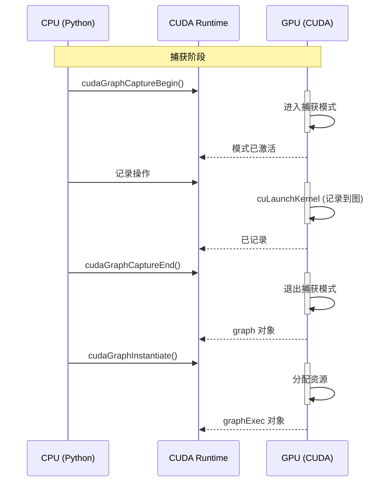
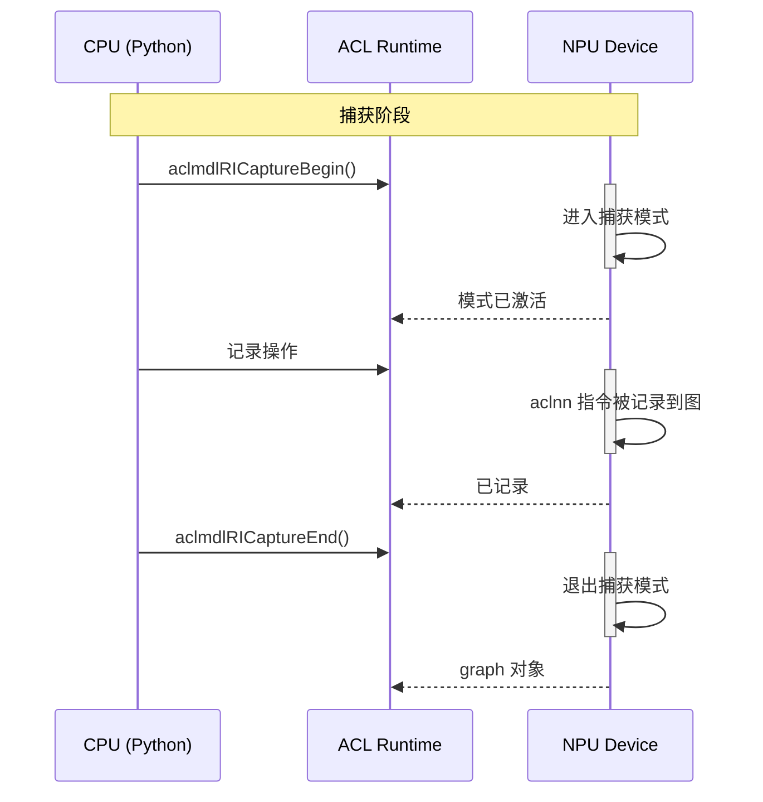
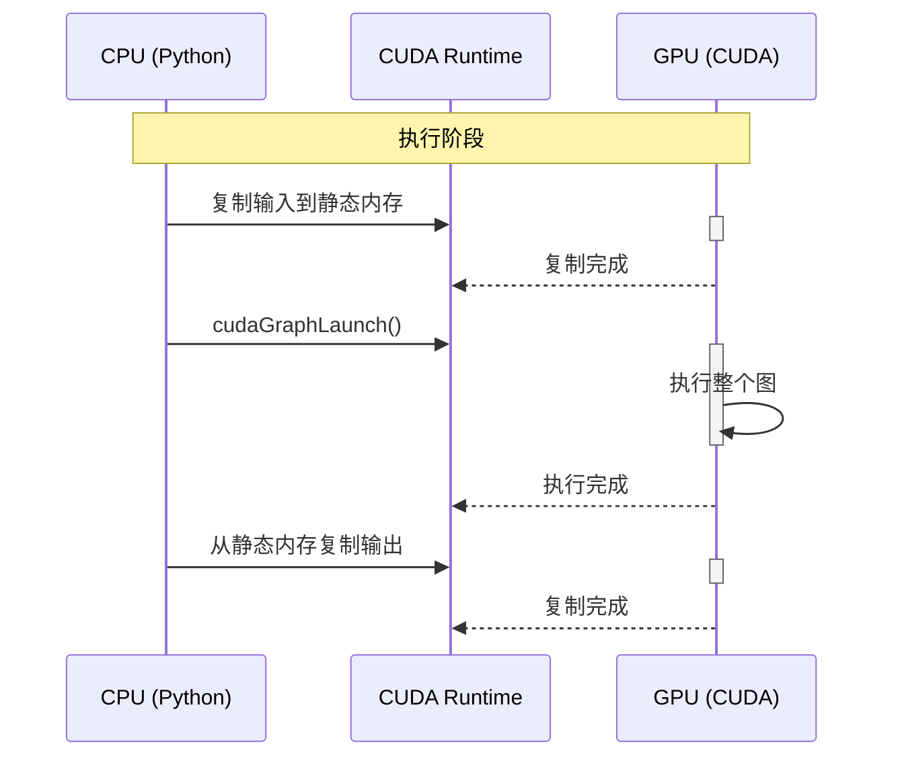
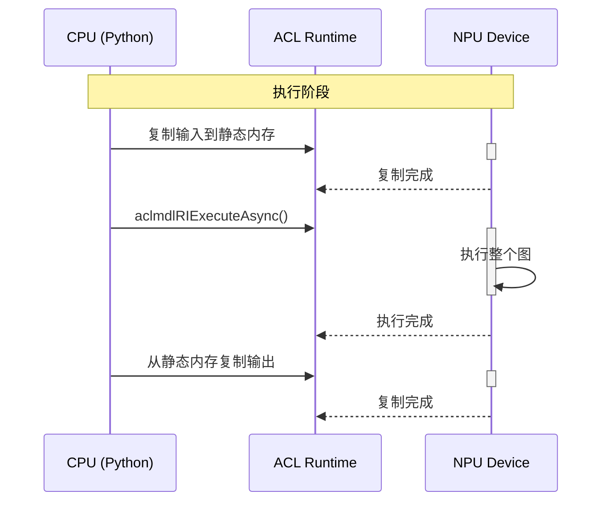

# CUDA Graphs vs NPU Graphs 完整对比

本文档详细对比 PyTorch CUDA Graphs 和 torch_npu NPU Graphs 的实现和使用方式。

---

## 目录

1. [概述](#概述)
2. [API 对比](#api-对比)
3. [实现原理对比](#实现原理对比)
4. [时序图对比](#时序图对比)
5. [代码示例对比](#代码示例对比)
6. [性能优化对比](#性能优化对比)
7. [使用建议](#使用建议)

---

## 概述

### CUDA Graphs

CUDA Graphs 是 NVIDIA 提供的性能优化技术，用于 NVIDIA GPU 设备：
- 预先记录 GPU 操作序列
- 一次性提交执行
- 消除 CPU-GPU 交互开销

### NPU Graphs

NPU Graphs 是 torch_npu 对应的实现，用于华为昇腾 NPU 设备：
- 基于 ACL (Ascend Computing Language) Graph API
- 与 CUDA Graphs API 设计相似
- 适配华为昇腾 NPU 硬件

### 核心概念对比

| 概念 | CUDA Graphs | NPU Graphs |
|------|------------|-------------|
| 设备 | NVIDIA GPU | 华为昇腾 NPU |
| 库 | PyTorch (torch.cuda) | torch_npu (torch_npu.npu) |
| 底层 API | CUDA Runtime API | ACL (Ascend Computing Language) |
| 捕获 | cudaGraphCaptureBegin/End | aclmdlRICaptureBegin/End |
| 执行 | cudaGraphLaunch | aclmdlRIExecuteAsync |

---

## API 对比

### 1. 上下文管理器

#### CUDA Graphs

```python
import torch

graph = torch.cuda.CUDAGraph()
stream = torch.cuda.Stream()

with torch.cuda.graph(graph, stream=stream):
    # 记录操作
    output = model(input)

graph.replay()
```

#### NPU Graphs

```python
import torch_npu

graph = torch_npu.npu.NPUGraph()
stream = torch_npu.npu.Stream()

with torch_npu.npu.graph(graph, stream=stream):
    # 记录操作
    output = model(input)

graph.replay()
```

### 2. 高级 API

#### CUDA Graphs

```python
import torch

graphed_model = torch.cuda.make_graphed_callables(model, [sample_input])
output = graphed_model(input_tensor)
```

#### NPU Graphs

```python
import torch_npu

graphed_model = torch_npu.npu.make_graphed_callables(model, [sample_input])
output = graphed_model(input_tensor)
```

### 3. 编译后端

#### CUDA Graphs

```python
import torch

compiled_model = torch.compile(model, backend="cudagraphs")
output = compiled_model(input_tensor)
```

#### NPU Graphs

```python
import torch_npu

compiled_model = torch.compile(model, backend="npugraphs")
output = compiled_model(input_tensor)
```

### API 完整对比表

| 功能 | CUDA Graphs | NPU Graphs | 说明 |
|------|------------|-------------|------|
| 图对象 | `torch.cuda.CUDAGraph()` | `torch_npu.npu.NPUGraph()` | 管理图的生命周期 |
| 上下文管理器 | `torch.cuda.graph()` | `torch_npu.npu.graph()` | 捕获和重放 |
| Stream | `torch.cuda.Stream()` | `torch_npu.npu.Stream()` | 异步执行流 |
| 高级 API | `make_graphed_callables()` | `make_graphed_callables()` | 自动管理 |
| 编译后端 | `backend="cudagraphs"` | `backend="npugraphs"` | torch.compile |
| 捕获开始 | `cudaGraphCaptureBegin()` | `aclmdlRICaptureBegin()` | 底层 API |
| 捕获结束 | `cudaGraphCaptureEnd()` | `aclmdlRICaptureEnd()` | 底层 API |
| 执行图 | `cudaGraphLaunch()` | `aclmdlRIExecuteAsync()` | 底层 API |

---

## 实现原理对比

### CUDA Graphs 架构

```
torch.cuda.graph()
    ↓
CUDAGraphContext (Python)
    ↓
CUDAGraph (C++)
    ↓
CUDA Runtime API
    ├── cudaGraphCaptureBegin()
    ├── cudaGraphCaptureEnd()
    ├── cudaGraphInstantiate()
    └── cudaGraphLaunch()
```

### NPU Graphs 架构

```
torch_npu.npu.graph()
    ↓
NPUGraphContext (Python)
    ↓
NPUGraph (C++)
    ↓
ACL Graph API
    ├── aclmdlRICaptureBegin()
    ├── aclmdlRICaptureEnd()
    └── aclmdlRIExecuteAsync()
```

### 核心组件对比

| 组件 | CUDA Graphs | NPU Graphs | 文件位置 |
|------|------------|-------------|----------|
| Python 包装 | `torch.cuda.graph()` | `torch_npu.npu.graph()` | `torch/cuda/graph.py` | `torch_npu/npu/graphs.py` |
| C++ 实现 | `CUDAGraph` | `NPUGraph` | `torch/csrc/cuda/CUDAGraph.cpp` | `torch_npu/csrc/core/npu/NPUGraph.cpp` |
| 头文件 | `CUDAGraph.h` | `NPUGraph.h` | `torch/csrc/cuda/CUDAGraph.h` | `torch_npu/csrc/core/npu/NPUGraph.h` |
| 内存管理 | CUDACachingAllocator | NPUCachingachingAllocator | `torch/csrc/cuda/CUDACachingAllocator.h` | `torch_npu/csrc/core/npu/NPUCachingAllocator.h` |

---

## 时序图对比

### CUDA Graphs 捕获流程



### NPU Graphs 捕获流程



> [!note] 时序图已按源码订正（详见 [[aclgraph_deep_analysis]] 差异 8）
> ① 捕获期 **aclop 被禁止**（`OpCommand.cpp:139` `assertNotCapturingAclop`，根因是 aclop 运行时做主机侧 JIT 编译），真正入图的是 **aclnn**；② torch_npu 路径中 `model_ri` 在 `capture_begin` 即创建，**无独立 `aclmdlRIInstantiate()` 步骤**（`NPUGraph.cpp` 三级 API：CaptureBegin/CaptureEnd/ExecuteAsync，237/255/293）。

### CUDA Graphs 执行流程



### NPU Graphs 执行流程



---

## 代码示例对比

### 方式1: 上下文管理器

#### CUDA Graphs

```python
import torch
import torch.nn as nn

class Model(nn.Module):
    def __init__(self):
        super().__init__()
        self.linear1 = nn.Linear(1024, 2048)
        self.linear2 = nn.Linear(2048, 1024)
        self.relu = nn.ReLU()
    
    def forward(self, x):
        x = self.linear1(x)
        x = self.relu(x)
        x = self.linear2(x)
        return x

model = Model().cuda()
model.eval()

# 创建静态内存池
static_input = torch.randn(32, 1024).cuda()
static_output = torch.randn(32, 1024).cuda()

# 捕获 CUDA Graph
graph = torch.cuda.CUDAGraph()
stream = torch.cuda.Stream()

with torch.cuda.graph(graph, stream=stream):
    temp = static_input
    temp = model.linear1(temp)
    temp = model.relu(temp)
    temp = model.linear2(temp)
    static_output.copy_(temp)

# 执行
static_input.copy_(input_tensor)
graph.replay()
result = static_output.clone()
```

#### NPU Graphs

```python
import torch
import torch.nn as nn
import torch_npu

class Model(nn.Module):
    def __init__(self):
        super().__init__()
        self.linear1 = nn.Linear(1024, 2048)
        self.linear2 = nn.Linear(2048, 1024)
        self.relu = nn.ReLU()
    
    def forward(self, x):
        x = self.linear1(x)
        x = self.relu(x)
        x = self.linear2(x)
        return x

model = Model().npu()
model.eval()

# 创建静态内存池
static_input = torch.randn(32, 1024).npu()
static_output = torch.randn(32, 1024).npu()

# 捕获 NPU Graph
graph = torch_npu.npu.NPUGraph()
stream = torch_npu.npu.Stream()

with torch_npu.npu.graph(graph, stream=stream):
    temp = static_input
    temp = model.linear1(temp)
    temp = model.relu(temp)
    temp = model.linear2(temp)
    static_output.copy_(temp)

# 执行
static_input.copy_(input_tensor)
graph.replay()
result = static_output.clone()
```

### 方式2: make_graphed_callables

#### CUDA Graphs

```python
import torch
import torch.nn as nn

model = Model().cuda()
model.eval()

sample_input = torch.randn(32, 1024).cuda()

# 创建 graphed callable
graphed_model = torch.cuda.make_graphed_callables(model, [sample_input])

# 使用
output = graphed_model(input_tensor)
```

#### NPU Graphs

```python
import torch
import torch.nn as nn
import torch_npu

model = Model().npu()
model.eval()

sample_input = torch.randn(32, 1024).npu()

# 创建 graphed callable
graphed_model = torch_npu.npu.make_graphed_callables(model, [sample_input])

# 使用
output = graphed_model(input_tensor)
```

### 方式3: torch.compile

#### CUDA Graphs

```python
import torch
import torch.nn as nn

model = Model().cuda()
model.eval()

# 编译模型
compiled_model = torch.compile(model, backend="cudagraphs")

# 使用
output = compiled_model(input_tensor)
```

#### NPU Graphs

```python
import torch
import torch.nn as nn
import torch_npu

model = Model().npu()
model.eval()

# 编译模型
compiled_model = torch.compile(model, backend="npugraphs")

# 使用
output = compiled_model(input_tensor)
```

---

## 性能优化对比

### 优化机制对比

| 优化机制 | CUDA Graphs | NPU Graphs | 说明 |
|---------|------------|-------------|------|
| 消除 kernel launch 开销 | ✓ | ✓ | 一次性提交整个图 |
| 减少 CPU-GPU/NPU 交互 | ✓ | ✓ | 预先记录操作序列 |
| 静态内存分配 | ✓ | ✓ | 预先分配内存池 |
| 连续执行 | ✓ | ✓ | GPU/NPU 连续执行 |
| 内存访问优化 | ✓ | ✓ | 提高缓存命中率 |

### 性能提升对比

**理论性能提升（两者类似）：**

```
传统执行:
CPU → Launch Kernel 1 → GPU → CPU → Launch Kernel 2 → GPU → CPU → Launch Kernel 3 → GPU
     (开销)              (等待)    (开销)              (等待)    (开销)              (等待)

Graphs 执行:
CPU → Replay Graph → GPU (执行所有操作)
     (一次开销)        (连续执行)

性能提升: 30-70%
```

### 实际性能考虑

| 因素 | CUDA Graphs | NPU Graphs |
|------|------------|-------------|
| GPU/NPU 架构 | Volta/Ampere/Hopper | Ascend 910/910B |
| 驱动版本 | CUDA 10+ | ACL 20.0+ |
| 模型复杂度 | 越复杂效果越好 | 越复杂效果越好 |
| 批量大小 | 固定批量效果更好 | 固定批量效果更好 |

---

## 使用建议

### 选择标准

| 场景 | 推荐使用 | 原因 |
|------|---------|------|
| NVIDIA GPU | CUDA Graphs | 原生支持 |
| 华为昇腾 NPU | NPU Graphs | 原生支持 |
| 需要跨平台 | 抽象 API | 统一接口 |
| 性能调优 | 对应平台 API | 最佳性能 |

### 代码复用策略

```python
# 使用抽象层实现跨平台
import torch

def create_graphed_model(model, sample_input):
    device = sample_input.device
    
    if device.type == 'cuda':
        # 使用 CUDA Graphs
        return torch.cuda.make_graphed_callables(model, [sample_input])
    elif device.type == 'npu':
        # 使用 NPU Graphs
        import torch_npu
        return torch_npu.npu.make_graphed_callables(model, [sample_input])
    else:
        # 回退到原始模型
        return model

# 使用
model = Model()
device = torch.device('cuda' if torch.cuda.is_available() else 'npu')
model = model.to(device)

sample_input = torch.randn(32, 1024, device=device)
graphed_model = create_graphed_model(model, sample_input)

output = graphed_model(input_tensor)
```

### 最佳实践

1. **设备检测**
   ```python
   if torch.cuda.is_available():
       use_cuda_graphs()
   elif hasattr(torch, 'npu') and torch.npu.is_available():
       use_npu_graphs()
   ```

2. **错误处理**
   ```python
   try:
       compiled_model = torch.compile(model, backend="cudagraphs")
   except Exception:
       try:
           compiled_model = torch.compile(model, backend="npugraphs")
       except Exception:
           compiled_model = model
   ```

3. **性能测试**
   ```python
   # 在目标设备上测试
   device = torch.device('cuda' if torch.cuda.is_available() else 'npu')
   model = model.to(device)
   
   # 运行基准测试
   benchmark_model(model, input_tensor)
   ```

---

## 总结

### 相似性

1. **API 设计**: 两者 API 设计高度相似
2. **使用方式**: 代码可以基本复用
3. **优化原理**: 都通过预先记录计算图来优化性能
4. **性能提升**: 都能带来 30-70% 的性能提升

### 差异性

1. **硬件平台**: NVIDIA GPU vs 华为昇腾 NPU
2. **底层 API**: CUDA Runtime API vs ACL API
3. **Python 库**: torch.cuda vs torch_npu.npu
4. **实现细节**: 内存管理、调度策略等

### 未来发展

- **统一接口**: 可能会有统一的抽象层
- **性能优化**: 持续优化底层实现
- **功能扩展**: 支持更多场景和用例

---

## 参考资料

### CUDA Graphs

- [PyTorch CUDA Graphs 文档](https://pytorch.org/docs/stable/generated/torch.cuda.graph.html)
- [NVIDIA CUDA Graphs 文档](https://docs.nvidia.com/cuda/cuda-c-programming-guide/index.html#cuda-graphs)
- [PyTorch 2.0 性能优化指南](https://pytorch.org/tutorials/recipes/recipes/tuning_guide.html)

### NPU Graphs

- [torch_npu 文档](../torch_npu/README.md)
- [华为 ACL 文档](https://www.hiascend.com/document)
- [torch_npu graphs.py](../torch_npu/torch_npu/npu/graphs.py)

### 相关文档

- [CUDA Graphs 使用指南](../cudagraphs_usage_guide.py)
- CUDA Graphs 时序图:已并入 [[PyTorch_CUDA_Graphs_Complete_Guide]] 各"方式"小节的"代码调用流程时序图"

## Related Pages

- [[02_engineering/01_ai_frameworks/index]]
- [[PyTorch_CUDA_Graphs_Complete_Guide]]
- [[aclgraph]]
