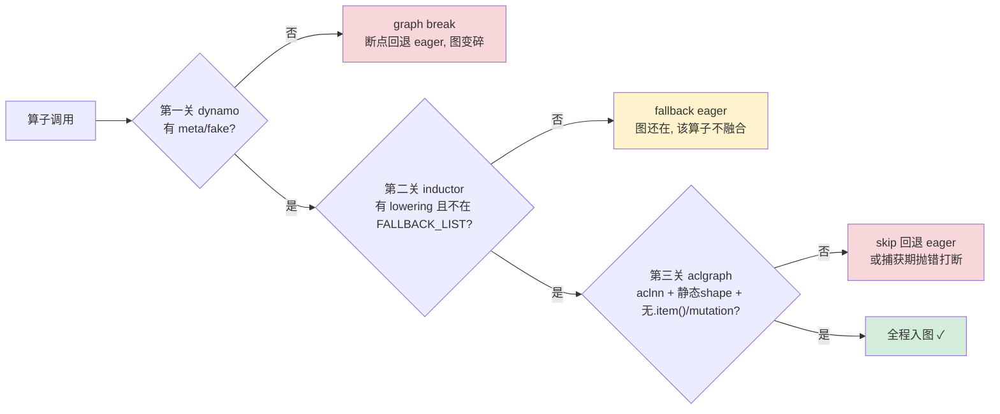
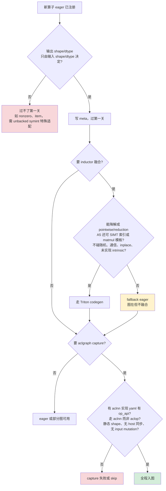

# NPU 算子入图判别指南（dynamo / inductor+triton / aclgraph 三关）

> **判别视角**：给定一个算子，如何判断它能否「入图」、会卡在哪一关、用什么命令验证。这不是路径实现介绍（实现全景见 [[npu_compile_paths_overview]]、各关深度见 [[npu_triton_backend_deep_analysis]] / [[aclgraph_deep_analysis]] / [[PyTorch_Dynamo_Technical_Analysis]]），而是一份面向「这个算子能不能入图」的可操作判别清单。
>
> 基于版本：`E:\97-codes\pytorch\torch_npu` 当前 checkout
> 分析日期：2026-06-12
> 前置：算子先要在 dispatcher 注册（eager 可用），见 [[op_registration_pipeline_analysis]]；其 `op_api`/`acl_op` 配置见 [[op_plugin_config_and_classification_guide]]。

---

## 目录

1. [核心认知：没有单一「是否支持入图」标志](#1-核心认知没有单一是否支持入图标志)
2. [入图四条路线总览](#2-入图四条路线总览)
3. [非 torchair 路线 = 三关递进流水线](#3-非-torchair-路线--三关递进流水线)
4. [第一关 · dynamo：有没有 meta/fake](#4-第一关--dynamo有没有-metafake)
5. [第二关 · inductor+triton：lowering 还是 fallback](#5-第二关--inductortritonlowering-还是-fallback)
6. [第三关 · aclgraph：只有 aclnn 能 capture](#6-第三关--aclgraph只有-aclnn-能-capture)
7. [贯穿主线：op_api/acl_op 一路决定到入图](#7-贯穿主线op_apiacl_op-一路决定到入图)
8. [三关的硬性不变量：为什么这些算子进不去](#8-三关的硬性不变量为什么这些算子进不去)
9. [面向新算子的前瞻判据](#9-面向新算子的前瞻判据)
10. [三关速查表](#10-三关速查表)

---

## 1. 核心认知：没有单一「是否支持入图」标志

`op_plugin_functions.yaml` 里**没有任何「入图」字段**（grep `graph/torchair/ge/fx_node` 零命中）。`op_api`（aclnn）也**不是**入图开关，它只表示「有 aclnn 的 eager kernel」。

「能否入图」取决于**走哪条路线、过哪几关**——每条路线、每一关各有独立判据。这正是判别的难点：要分关排查，而不是查一个标志位。

---

## 2. 入图四条路线总览

| 路线 | backend | 图引擎 | 「能否入图」由谁决定 | 深度页 |
|------|---------|--------|---------------------|--------|
| **torchair** | `"npu"` | CANN GE 整图 | torchair 的 `ge_converter`（把 aten/npu IR 翻成 GE 节点）+ meta | — |
| **inductor+triton** | `"inductor"` | inductor → Triton-Ascend | dynamo meta + inductor lowering/fallback | [[npu_triton_backend_deep_analysis]] |
| **aclgraph** | `"inductor"` + `mode="reduce-overhead"` | NPUGraph（CANN `AclmdlRI*` capture/replay） | 上两关 + capture 约束 | [[aclgraph_deep_analysis]] |
| **npugraphs / npugraph_ex** | `"npugraphs"` / `"npugraph_ex"` | 直接 capture FX 图 / 独立外部包 | 同 aclgraph 门禁 | [[torch_compile_npugraphs_deep_dive]] |

> **torchair 路线注记**：本 checkout 里 torchair 是**未初始化的空 submodule**（`.gitmodules` 指向 `gitcode.com/ascend/torchair.git`），converter 清单无法本地 grep。判别需先 `git submodule update --init third_party/torchair/torchair`，或到已 `pip install torch_npu` 的环境看 `torch_npu/dynamo/torchair/_ge_concrete_graph/ge_converter/{aten,custom,prims,experimental}/` 是否有该算子的 `register_fx_node_ge_converter`。
> **npugraph_ex 注记**：`torch_npu/dynamo/__init__.py:150-159` 运行时 `import npugraph_ex`，是独立外部包、本仓无源码，文档归 torchair 系。

下面聚焦你最常问的**非 torchair 路线**（inductor+triton±aclgraph）。

---

## 3. 非 torchair 路线 = 三关递进流水线

`dynamo → inductor+triton → aclgraph` 不是三选一，而是**层层递进**，每关是下一关的前提；一个算子要**全程入图必须三关都过**：



注意三关「没过」的**代价不同**：dynamo 断图最伤（图碎、图间开销）；inductor fallback 只是少了融合（图还在）；aclgraph 没过则失去 capture-replay 的调度开销节省。

---

## 4. 第一关 · dynamo：有没有 meta/fake

**判据**：dynamo trace 时要在 `FakeTensorMode` 下推 shape/dtype，**算子必须有 Meta/fake 实现**。

- npu 自定义算子：op-plugin 的 `op_plugin/python/meta/_meta_registrations.py`（`:17-18` 建 `Library("npu","IMPL","Meta")`，约 148 个 `@impl(m, "op_name")`，import 即生效）。**缺 meta → 抛 `UnsupportedOperatorException` → graph break**——因为 `npu`/`atb` 命名空间不在 fake_tensor 的 fallback 白名单里（`pytorch/torch/_subclasses/fake_tensor.py:3104`），自定义算子缺 meta 必断图；dynamo 在 `pytorch/torch/_dynamo/utils.py:4096-4121` 接住并翻译成 graph break。
- aten 算子：用 torch 自带 meta，或 torch_npu 的 override（`torch_npu/utils/_npu_meta_registration.py`，`register_meta_npu` `:95`、`npu_patch_meta` `:104`，如 `index_put`/`native_dropout`，会删掉 torch 原生 meta 重注册 `:116-117`）。
- 设备管理 API（stream/device）：靠 `torch_npu/dynamo/trace_rule.py` 标记成 in-graph，避免误断图。

**判别方法**：
```python
# 1) 查 meta 是否注册
torch.ops.npu.<op>.default.has_kernel_for_dispatch_key(torch._C.DispatchKey.Meta)
# 2) 实跑看 graph break（backend=eager 只验 dynamo 抓图，隔离 inductor）
#    TORCH_LOGS="graph_breaks" python script.py
torch.compile(f, backend="eager", fullgraph=True)(*inputs)   # 缺 meta 直接报错指向该算子
# 3) 直接测 fake 传播
from torch._subclasses.fake_tensor import FakeTensorMode
with FakeTensorMode():
    torch.ops.npu.<op>(<fake inputs>)   # 无 meta 抛 UnsupportedOperatorException
```
或直接 grep `_meta_registrations.py` 找 `@impl(m, "算子名"`。

---

## 5. 第二关 · inductor+triton：lowering 还是 fallback

**判据（两条同时满足）**：① 算子在 inductor 的 `lowerings` 字典里有 lowering（或能 decompose 成有 lowering 的）；② **不在** torch_npu 的 `FALLBACK_LIST` 黑名单。
- 满足 → lower 成 pointwise/reduction/template → 生成 `@triton.jit` kernel；
- 不满足 → `make_fallback` 回落 eager（NPU 上即 op-plugin 的 aclnn/aclop）。

机制位置：
- 后端挂载：`torch_npu/_inductor/__init__.py:128-137` `register_backend_for_device("npu", NPUCombinedScheduling, NPUWrapperCodeGen, CppWrapperNpu)`。`backend="inductor"` 是上游后端，torch_npu 不改它，上游按张量 device=`"npu"` 自动路由到这套 codegen。
- 回落编排：`torch_npu/_inductor/__init__.py:153-167`；黑名单回落 + 自定义 lowering 在 `torch_npu/_inductor/lowering.py:191-218`；一键全回落 `:1039-1050`（`NPU_INDUCTOR_FALLBACK_LIST=allfallback`）。
- 黑名单：`torch_npu/_inductor/lowering_fallback_list.py`——`NPU_EXTRA_FALLBACK_LIST`（`:40` 起，通信 `_c10d_functional.*`、位运算、`acos/atan/erfc` 等超越函数、卷积/池化、随机数、inplace 系）+ `TORCH_NATIVE_FALLBACK_LIST`（`:658` 起，SDPA/linalg/sort 等上游本就 fallback），`FALLBACK_LIST` 合并于 `:1009`。
- **第三道隐性门槛**：生成的 Triton 还要能被 triton-ascend（`triton-ascend/third_party/ascend/backend/compiler.py`，ttir→linalg→bishengir）编译；不支持的 Triton 语义会在编译期挂掉，与「能否 lower」是两回事。

> 关于 fallback 规模：当前 checkout 有近千个 aten/prims 算子被强制 fallback，统计与机制详见 [[npu_compile_paths_overview]] §2.3 与 [[npu_lowering_guide]]。

**判别方法**：
```python
import torch, torch_npu
from torch._inductor import lowering
op = torch.ops.aten.gather.default
print(op in lowering.lowerings)   # 有 lowering?
print(op in lowering.fallbacks)   # 被注册为 fallback?
# 在 lowerings 且不在 fallbacks → 走 Triton codegen；在 fallbacks → 回落 eager
```
或 `TORCH_LOGS="inductor,output_code"` 看 output_code——走 codegen 的在 `@triton.jit def triton_...` 里，fallback 的是 `extern_kernels.*` / `aten.*`；或 `INDUCTOR_ASCEND_LOG_LEVEL=INFO` 看 `make_fallback` 摘要；或 `NPU_INDUCTOR_FALLBACK_LIST=allfallback` 跑全 eager 基线对比 kernel 数。

---

## 6. 第三关 · aclgraph：只有 aclnn 能 capture

NPUGraph = CANN `AclmdlRICaptureBegin/End/ExecuteAsync`（`torch_npu/csrc/core/npu/NPUGraph.cpp:237/255/293`）对 CUDA Graph 的逐行移植。**两道判别**：

**编译期 FX 图级 skip**（命中即放弃 aclgraph、回退 eager；`torch_npu/utils/_graph_tree.py:244`、`torch_npu/_inductor/utils.py:128-171`）：CPU 张量/多设备、输入被原地 mutation、动态 shape（unbacked symint）、不兼容算子黑名单（`aten._local_scalar_dense` 即 `.item()`、RNG 相关、bool 索引的 `index_put` 触发 `.nonzero()` 数据依赖）。

**捕获期运行时硬门禁**（命中即抛错打断；`torch_npu/csrc/core/npu/NPUGraphsUtils.h:93-105`、`torch_npu/csrc/framework/OpCommand.cpp:129-140`）：

- ⭐ **只有 aclnn 算子能入图**：走 aclop 路径的算子在捕获期一执行就 `assertNotCapturingAclop` 抛错——`Cannot run aclop operators during NPU graph capture. Current working aclop is <op>...`。**修复杠杆：`torch.npu.config.allow_internal_format = False`**（强制 ND/aclnn，避开私有格式触发 aclop）；仍失败说明该算子根本没有 aclnn 实现。
- 还要：非默认流捕获（`NPUGraph.cpp:181-184`）；不支持 `TASK_QUEUE_ENABLE=2`（`:169-173`）；显存走私有 mempool、地址固定（更新输入要用 `copy_` 写回原地址，不能重新赋值）；RNG/HCCL 有额外约束。
- 特例：IFA/FA3/PagedAttention 等可入图但 seqlen 每步变，靠 task-group update（`g.update(...)`）在重放前刷新，无需重捕。

**判别方法**：
- `TORCH_LOGS="cudagraphs"`（torch_npu 注册了 `torch_npu.npugraph` logger）看 skip 原因；skip 计数 `counters["inductor"]["cudagraph_skips"]`。
- 捕获失败按报错特征对号入座（aclop / 默认流 / TASK_QUEUE）。
- `torch.npu.is_current_stream_capturing()` 查当前是否在捕获。

---

## 7. 贯穿主线：op_api/acl_op 一路决定到入图

第三关那条铁律，**正是 [[op_plugin_config_and_classification_guide]] 里 `op_api`(aclnn) vs `acl_op`(aclop) 的区别**：到 **aclgraph** 入图，它升级成**硬门槛**——一个算子如果在当前 shape/format 下落到了 aclop 分支，就无法被 capture。

所以一个算子要走完整条 reduce-overhead 流水线入图，前提之一是它在 yaml 里**有 `op_api`(aclnn)**、且运行时确实走到了 aclnn（没被私有格式逼回 aclop）——这也是 `allow_internal_format=False` 能救场的底层原因。

> 交叉引用：op_api/acl_op 的**工程分类**见 [[op_plugin_config_and_classification_guide]] §4；两者**物理差异**（两段式 vs 运行时编译）见本页 §8.3 / [[op_registration_pipeline_analysis]] §7。

---

## 8. 三关的硬性不变量：为什么这些算子进不去

前面几节讲了「卡在哪、怎么查」，但要对一个**还没写完的新算子**做前瞻判断，得理解每一关背后的**硬性不变量（invariant）**：这一关的机器（FakeTensor / Inductor lowering / stream capture）依赖它才能运转，**违反它机器就转不动**——这才是「不能入图」的根因，而非名单本身。三关的不变量层层收紧：

| 关 | 硬性不变量 | 这一关的机器靠它做什么 | 违反 = 哪类算子进不去 |
|----|-----------|----------------------|--------------------|
| dynamo | 输出 shape/dtype 必须能从输入 shape/dtype **纯符号推导**（不看数值、不真执行） | FakeTensor 假执行推导输出元数据，才能把算子记成 FX 节点 | 缺 meta 的自定义算子；输出依赖运行时**数值**的算子（nonzero/`.item()`） |
| inductor+triton | 算子必须能**降解成有限 IR 原语**（固定输出形状上的 pointwise/reduction/索引访存/matmul 模板），且只用 triton-ascend 已实现的 intrinsic | lowering 把算子翻成循环 IR → codegen 成 Triton kernel | 复杂算法（卷积/sort/SDPA/linalg）；昇腾缺的 intrinsic；随机/通信/inplace/老芯片间接访存 |
| aclgraph | 被捕获区间必须是**一串只往 stream 塞、对固定地址操作、shape 已定型、不回 host 决策**的纯异步 task | capture 录 device 异步序列，replay 原样重发（不重选址/不重算 tiling/不回 host） | aclop（运行时编译+执行融合）；动态 shape；host 同步；input mutation；私有格式逼出的 aclop |

> 一句话：**第一关要「形状可预测」，第二关要「计算可表达」，第三关要「执行可录制」。**

### 8.1 dynamo —— 为什么要「输出元数据可符号推导」

dynamo 抓图时不在 NPU 上真执行，而是用 FakeTensor（只有 shape/dtype/device 的「假张量」）走一遍，借此推出每个算子的输出形态、记成 FX 节点。

- **缺 meta → 推不出 → 断**：自定义算子没注册 meta，FakeTensor 不知道输出 shape/dtype；且 `npu`/`atb` 命名空间不在 fake_tensor 的 fallback 白名单（`pytorch/torch/_subclasses/fake_tensor.py:3104`），直接抛 `UnsupportedOperatorException`（`:3057-3120`）→ graph break。**这就是新自定义算子必须手写 meta（`op_plugin/python/meta/_meta_registrations.py`）的根因。**
- **输出依赖数值 → 天然推不出**：`nonzero`/`.item()` 这类，输出形状 = 非零元素个数 / 标量真值，假执行时数据还没算，shape 无法符号化（→ unbacked symint 或 `DataDependentException`）。这**不是补个 meta 能解决的**——它违反了不变量本身。详见 [[unbacked_symint_analysis]]。

### 8.2 inductor+triton —— 为什么只能 codegen「可表达成 IR 原语」的算子

Inductor 的核心抽象是 **define-by-run 的 loop-level IR**（`pytorch/torch/_inductor/ir.py:989` `class Loops` docstring 原文「Base class for pointwise and reduction loop-body IR nodes」；核心节点 `Pointwise`/`Reduction`，以及 `Scatter`/`Scan`/`Sort` 等 `Loops` 子类）。一个算子要被**自动** codegen，得有人把它注册成 lowering（`register_pointwise`/`make_reduction`，`lowering.py:1064/6969`）、或经 decomposition 落到这些 IR；Inductor 没覆盖、又没写模板的，才经 `make_fallback`→`FallbackKernel`（`lowering.py:2728`、`ir.py:8765` docstring「operators that are not directly support by inductor」）退回 eager。`FALLBACK_LIST` 头注释（`lowering_fallback_list.py:1-6`）也点明它是一张「待跑通/验证」的运行黑名单。两类根因：

- **`TORCH_NATIVE_FALLBACK_LIST`（`:658`，GPU 也 fallback）= Inductor 上游没写 lowering/模板的复杂算子**：SDPA/linalg(svd/qr/cholesky)/fft/cdist/embedding_bag/RNN/nonzero 等——多是复杂算法或输出形状数据相关，Inductor 没为它们写自动 lowering，退回 ExternKernel。**这类在任何后端(含 GPU)都 fallback。**（注意：sort/topk/conv-backward/cumsum 其实是**条件性**实现——`ir.Sort`/`ir.Scan` 也是 `Loops` 子类、conv-backward 有 Triton 反向模板，满足形状/配置/设备时就生成 Triton，否则才 fallback，并非无条件退回。）
- **`NPU_EXTRA_FALLBACK_LIST`（`:40`，仅 NPU 加）= 昇腾后端成熟度差距**：
  - **超越函数 / 位运算移位**（acos/cosh/sinh/atanh/erfc/lgamma、bitwise/lshift）——**GPU 把它们当普通 pointwise codegen**（上游 `torch/_inductor/lowering.py:6699-6709` 是 `register_pointwise_numeric`，codegen 发 `libdevice.acos` 等 intrinsic），但 NPU 的 `NPUTritonKernelOverrides`（`torch_npu/_inductor/codegen/triton.py:126-279`）没重写、triton-ascend/bishengir 没实现（或精度未验证）这些 libdevice intrinsic，只能拉黑。
  - **随机**（rand/randn）：`config.fallback_random=True`（`torch_npu/_inductor/config.py:29`），philox RNG 在昇腾 triton 未落地。
  - **通信**（`_c10d_functional.*`）：HCCL 通信原语，根本不是计算 kernel。
  - **inplace**（add_/mul_）：原地变异破坏 Inductor 的无副作用 buffer 模型。
  - **间接访存**（gather/scatter/index/embedding/cat，`INDIRECT_MEM_FALLBACK_LIST:1016`）：**A2/A3 只有 SIMD、离散地址只能逐标量搬运（比 eager 还慢），只有 A5 加了 SIMT 才能走索引模板**（`config.py:190-204` 仅 A5 赋非空 `inductor_indirect_memory_mode`；硬件根因见 `torch_npu/_inductor/docs/feature/non_contiguous_accesses/overview.md:23`）。

> **两类的实践意义**：落在 `NPU_EXTRA` 的算子是「昇腾待补齐」，会随 triton-ascend 完善被移出黑名单（头注释「fixed and verified 后可移除」）；落在 `TORCH_NATIVE` 的是通用限制。**且 fallback ≠ 不能入图**——图还在，只是该算子不被融合、运行时调 eager aclnn/aclop，这一关「没过」最不致命。

> ⚠️ **关键澄清：这是 Inductor 的边界，不是 Triton 语言的上限**。Triton 语言本身能手写任意复杂 kernel——matmul、flash-attention、softmax 都有 tutorial（`triton-ascend/python/tutorials/06-fused-attention.py` 就是手写 flash-attention），而且 Inductor 对 mm/conv/attention 用的正是**人工预写的 Triton 模板**（`pytorch/torch/_inductor/kernel/mm.py:85` `TritonTemplate` + `templates/triton_mm.py.jinja` 里手写 `tl.dot` 的 K 维循环）。所以「fallback」的基本含义是「**Inductor / torch_npu 还没为它写 lowering 或 Triton 模板**」，而非「Triton 写不出」；只有复数/稀疏/部分 fp8 这类少数情形，fallback 才真正源于后端特性缺失（`lowering.py:3613` 的 `# 5) Impossible (missing triton/CPU features)`）。

> 🔧 **对 NPU 适配的含义**：一个算子在 NPU 上 fallback，绝大多数是**工程投入问题而非物理不可能**——为它加 decomposition / 注册 NPU lowering / 写 Triton 模板，就能让它进 codegen。torch_npu 的 `torch_npu/_inductor/lowering.py:227-994` 正是这么做的（为 max/min/mean/var/native_layer_norm 等注册了 NPU 自己的 lowering）。所以第二关的边界是**会随适配推进移动的「软」边界**，不像第一关（meta 可符号推导）和第三关（aclnn-only）那样是硬约束；判断新算子时，除了「现在在不在 FALLBACK_LIST」，更要看「**能否 / 值不值得为它写 lowering 或模板**」。

### 8.3 aclgraph —— 为什么只有 aclnn 能 capture（核心根因）

capture 录的是「一串只往 stream 上塞的 device 异步 task」，replay 用 `AclmdlRIExecuteAsync`（`NPUGraph.cpp:293`）原样重发——不重选址、不重算 tiling、不回 host。算子下发必须恰好是这种形态：

- **aclnn = 两段式，天然 capture-safe**：host 段 `aclnnXxxGetWorkspaceSize`（`op_api_common.h:1300-1302`）算 tiling/workspace、把计划烧进 executor（不碰 stream）；stream 段 `aclnnXxx`（`:1314`）只把**预编译好的 kernel**（`libopapi.so` 里 dlopen 出来的，`:144-207`）挂上 stream 立即返回——纯异步 task，正好能录。
- **aclop = 运行时编译+执行融合，capture-unsafe**：aclop 走 `aclopCompileAndExecute`（`OpParamMaker.cpp:226-238`），**在下发时按 shape/dtype 运行时 JIT 编译算子再执行**；为此要 `Py_BEGIN_ALLOW_THREADS` 释放 GIL（`OpParamMaker.cpp:144`，注释直说「we need to release GIL for NPU to compile op」），还有 OOM 重试的 host 控制流（`:197-266`）、可能插 TransData(又是 aclop)。这不是「纯 device 异步序列」，所以门禁 `assertNotCapturingAclop`（`NPUGraphsUtils.h:93-105`，触发于 `OpCommand.cpp:129-140`）直接拒。**这就是「只有 aclnn 能入图」的机制根因。**
- **`allow_internal_format=False` 为什么救场**：私有格式（NZ/NC1HWC0）会让 matmul 等的 `DO_MATMUL_COMPATIBILITY`（`op_api_common.h:1551-1571`）直接 `return aclop`，或逼出 TransData(aclop)；关掉私有格式（`TensorFactories.cpp:346-350` 强制 base format）→ 张量保持 ND → `is_two_tensor_base_format` 成立 → 留在 aclnn 分支 → 可 capture。
- **其它约束同源**：
  - **静态 shape**：capture 时 `GetWorkspaceSize` 把 tiling/workspace/地址烧进 executor，replay 不重算；shape 变则全对不上。
  - **固定地址 / 私有 mempool / `copy_` 写回**：kernel task 里写的是绝对 data 指针，replay 不重新解析张量，所以捕获期分配走私有池（`NPUGraph.cpp:219-224`），replay 前要把新输入 `copy_` 进当年录下的静态地址（`graphs.py:1062-1065`）。
  - **无 host 同步**（`.item()`/动态控制流）：capture 期 kernel 没真执行、没真值可同步，且 host 同步引入「读真值→host 分支」的动态控制流，图只能重放一条静态序列。
  - **非默认流**：默认流共享 + 隐式同步会污染 capture（`NPUGraph.cpp:181-184`）。

---

## 9. 面向新算子的前瞻判据

把三关不变量翻译成「写一个新算子时，怎么提前判断它能否入图」。前提是 eager（dispatcher 注册，见 [[op_registration_pipeline_analysis]]）已跑通，再逐关自检：



**第一关 dynamo（能否被 trace）**
- [ ] 输出 shape/dtype 能否只由输入 shape/dtype 算出（不看数值）？→ 能则写一个 meta（`@impl(Library("npu",...,"Meta"))`）即可过。
- [ ] 是否有数据相关输出（输出行数=非零数、依赖 `.item()`）？→ 是则天然过不了 fullgraph，要 graph break 或 unbacked symint 特殊适配。
- 自检：`FakeTensorMode` 直跑 / `torch.compile(backend="eager", fullgraph=True)`。

**第二关 inductor（能否被 codegen，仅当你要融合收益）**
- [ ] 能否写成 固定输出形状上的 逐元素 + 规约（或 matmul，A5 的索引访存）？复杂算法（排序/卷积/分解类）→ 注定 fallback。
- [ ] 是否用到昇腾 triton 还没实现的 intrinsic（超越函数/位运算/移位）、随机、通信、inplace？→ 是则 fallback。
- 注意：fallback 不阻断入图，只少了融合，这一关「没过」最不致命。
- 自检：`TORCH_LOGS="inductor,output_code"` 看是 `@triton.jit` 还是 `extern_kernels`。

**第三关 aclgraph（能否被 capture，要 reduce-overhead/ACLGraph 时）**
- [ ] 算子在 yaml 里有没有 `op_api`(aclnn)？没有 aclnn → 必走 aclop → capture 必失败。**要支持 aclgraph，写新算子时第一件事就是给它做 aclnn 适配。**
- [ ] 目标 shape/format 下会不会被私有格式逼回 aclop？→ 用 `allow_internal_format=False` 验证/兜底。
- [ ] 是否静态 shape、无内部 host 同步、无对输入的原地 mutation？
- 自检：`TORCH_LOGS="cudagraphs"` 看 skip；捕获报错 `Cannot run aclop operators...` 对号。

> **总则**：输出元数据可符号推导（meta）→ 过第一关；可降解成 IR 原语且不碰昇腾未实现/随机/通信/inplace（或接受 fallback）→ 过第二关；有 aclnn 实现且全程走 aclnn + 静态 shape + 无 host 同步 → 过第三关。

---

## 10. 三关速查表

| 关卡 | 入图判据 | 没过的后果 | 最快判别 |
|------|---------|-----------|---------|
| **① dynamo** | 有 Meta/fake（能推 shape/dtype） | graph break，断点回退 eager、图变碎 | grep `_meta_registrations.py`；`TORCH_LOGS=graph_breaks` + `fullgraph=True` |
| **② inductor+triton** | 在 `lowerings` 且不在 `FALLBACK_LIST` | fallback 成 eager aclnn/aclop（图还在，不融合） | 查 `lowering_fallback_list.py`；`TORCH_LOGS=inductor,output_code` 看 `@triton.jit` vs `extern_kernels` |
| **③ aclgraph** | 只用 aclnn + 静态 shape + 无 `.item()`/mutation + 非默认流 + 地址固定 | 编译期 skip 回退 eager，或捕获期抛错打断 | `TORCH_LOGS=cudagraphs` 看 skip；报错对号；`allow_internal_format=False` |

---

## Related Pages

- [[op_plugin_config_and_classification_guide]] —— 算子的 `op_api`/`acl_op` 配置（第三关 aclnn-only 铁律的源头）
- [[op_registration_pipeline_analysis]] —— eager 注册与 acl_op/op_api 运行时三层选择
- [[npu_compile_paths_overview]] —— 三条后端路径实现全景（本页的判别对象）
- [[npu_triton_backend_deep_analysis]] —— 第二关 Triton/Inductor default 路径深度分析
- [[aclgraph_deep_analysis]] —— 第三关 ACLGraph 图捕获/重放深度分析
- [[PyTorch_Dynamo_Technical_Analysis]] —— 第一关 dynamo 图捕获机制
- [[npu_lowering_guide]] —— 第二关 NPU lowering 与算子映射细节
