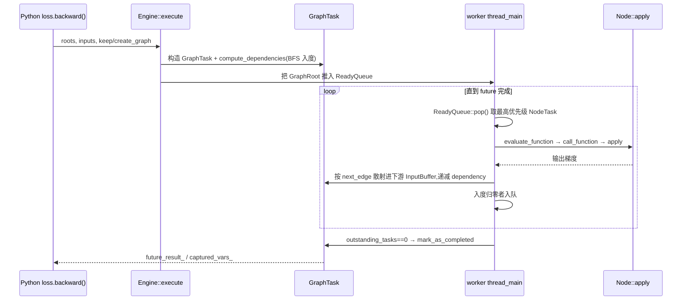
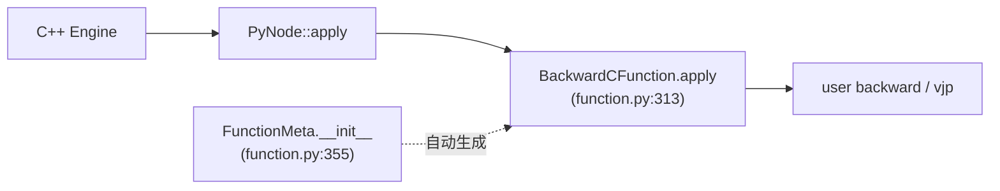

# PyTorch Eager 反向自动微分引擎 — 源码级深析

> 层次:deep dive
> 核验基准:PyTorch upstream `E:\97-codes\pytorch\pytorch`(v2.13.0a0, commit 9922478)
> 最后更新:2026-06-15

本页深入 eager 模式下反向自动微分的 C++ 引擎实现:前向运行时如何「磁带式」动态长出反向 DAG、单次 `backward()`/`grad()` 的执行上下文 `GraphTask`、多线程 `Engine` 与每设备 `ReadyQueue` 的优先级调度与可重入反向、`InputBuffer` 的梯度累积与跨流同步、叶子汇点 `AccumulateGrad` 的 layout 契约,以及 `SavedVariable`、`ForwardGrad`、`PyNode` 等关键配件。

阅读前建议先看本模块 [[10_eager_autograd/index]](概念定位)与 [[autograd_engine_quickstart]](API 用法)。本页所有引用写作「相对路径:行号」,相对 `E:\97-codes\pytorch\pytorch` 仓库根。

---

## 0. 全局视图

eager autograd 没有「预捕获的反向图」。前向每跑一个可微算子,codegen 的 `VariableType` 层就为它建一个反向 `Node` 并把边连到各输入的「梯度边」上,反向图随前向逐 op 生长(磁带 / tape)。`loss.backward()` 时,`Engine` 从 root 出发按拓扑序逆向执行这张图。

```mermaid
flowchart TD
    subgraph 前向建图["前向(动态建图)"]
      A["x, y (leaf, requires_grad)"] -->|"z = x * y"| Z["z.grad_fn = MulBackward0"]
    end
    subgraph 反向执行["反向(Engine 执行)"]
      R["GraphRoot<br/>(loss.grad_fn)"] --> M["MulBackward0"]
      M -->|next_edges[0]| AX["AccumulateGrad(x)"]
      M -->|next_edges[1]| AY["AccumulateGrad(y)"]
      AX --> GX["x.grad"]
      AY --> GY["y.grad"]
    end
    Z -.记录于磁带.-> M
```

与 [[03_aot_autograd/index]] 的根本区别:AOTAutograd 在 trace 期一次性捕获**前向+反向的联合 FX 图**交给 Inductor 编译;eager 引擎则无预捕获、Python/C++ 混跑、每次反向重新遍历动态长出的 DAG。两者共用同一套 `Node`/`Edge` 抽象,但执行机制完全不同。



---

## 1. 反向 DAG 的构建

### 1.1 Node:反向图的顶点

`Node`(`torch/csrc/autograd/node.h:112`)是反向图的抽象操作节点:输入是「前向输出对应的梯度」,输出是「前向输入对应的梯度」。它继承 `c10::intrusive_ptr_target`,用侵入式引用计数与 Python wrapper 共享生命周期。

```cpp
// node.h:112
struct TORCH_API Node : c10::intrusive_ptr_target {
  explicit Node(uint64_t sequence_nr, edge_list&& next_edges = edge_list())
      : sequence_nr_(sequence_nr), next_edges_(std::move(next_edges)) {
    for (const Edge& edge : next_edges_) update_topological_nr(edge);  // :117
    ...
    thread_id_ = at::RecordFunction::currentThreadId();                // :133
  }
```

子类(`MulBackward0`、`AccumulateGrad`、`GraphRoot`、`PyNode`…)重写纯虚 `apply`。`operator()`(`node.h:154`)在调用 `apply` 前后包一层 profiler 的 `RecordFunction`,并用 `sequence_nr()` + `thread_id_` 关联前向算子,这是 profiler 把反向 `XxxBackward` 对回前向 op 的依据。这种统一接口允许零输入(`GraphRoot`)与零输出(`AccumulateGrad` 作为汇点)。

### 1.2 Edge:有向边 = (Node, input_nr)

`Edge`(`torch/csrc/autograd/edge.h:14`)是轻量值类型:把上游节点的第 `i` 个输出连到下游节点的第 `input_nr` 个输入位。

```cpp
// edge.h:14
struct Edge {
  c10::intrusive_ptr<Node> function;   // 指向的下游 Node
  uint32_t input_nr;                   // 下游 Node 的第几个输入
};
```

多条边指向同一 `(Node, input_nr)` 时,梯度在该位的 `InputBuffer` 里隐式求和(见 §6)。

### 1.3 AutogradMeta:grad_fn vs grad_accumulator

每个 Tensor 通过 `AutogradMeta`(`torch/csrc/autograd/variable.h:225`)携带 autograd 历史。`Variable` 已是 `at::Tensor` 的别名,历史上的分离已合并。

```cpp
// variable.h:225
struct TORCH_API AutogradMeta : public c10::AutogradMetaInterface {
  Variable grad_;                                    // :228 .grad 字段
  c10::intrusive_ptr<Node> grad_fn_;                 // :229 非叶子:强引用产生它的反向函数
  c10::weak_intrusive_ptr<Node> grad_accumulator_;   // :230 叶子:弱引用 AccumulateGrad,避免环
  mutable std::shared_ptr<ForwardGrad> fw_grad_;     // :241 前向 AD 切向量
  bool requires_grad_{false};   // :263 仅叶子有意义
  bool retains_grad_{false};    // :266 仅非叶子有意义
  uint32_t output_nr_;          // :274 本张量是产生它那个 Node 的第几个输出
  bool requires_grad() const override { return requires_grad_ || grad_fn_; }  // :301
};
```

关键非对称:叶子用**弱引用**持有 `grad_accumulator_`,内部张量用**强引用**持有 `grad_fn_`。叶子的弱引用是避免「Tensor ↔ AccumulateGrad」循环引用的核心设计——`AccumulateGrad` 内部反过来持有 `variable`,若叶子也强引用它就会成环。`requires_grad()` 对叶子看 `requires_grad_`,对非叶子看是否存在 `grad_fn_`(`variable.h:301`)。

### 1.4 建图:collect_next_edges / create_gradient_edge

前向算子在 codegen 的 `VariableType` 层运行时,用 `collect_next_edges`(`torch/csrc/autograd/function.h:70`)把当前 grad_fn 的 `next_edges_` 指向各输入的「梯度边」。核心是 `detail::MakeNextFunctionList`(`function.h:19`)对每个输入变量取 `impl::gradient_edge`:

```cpp
// function.h:22
void operator()(const Variable& variable) {
  if (variable.defined())
    next_edges.emplace_back(impl::gradient_edge(variable)); // 叶→grad_acc,内→grad_fn
  else
    next_edges.emplace_back();                              // 无效边占位
}
```

`impl::gradient_edge`(`variable.h:147`)是「连接点」:内部张量返回 `grad_fn` 边,叶子返回 `grad_accumulator` 边(`variable.h:137` 按需惰性创建 `AccumulateGrad`)。`create_gradient_edge`(`function.h:53`)则反向把新输出 `variable` 的 `grad_fn` 设为刚建的 `Node`,并 `add_input_metadata` 递增其输入数。这就是磁带逐 op 生长的机制。

### 1.5 sequence_nr 与 topological_nr

`Node` 携带两个序号,服务于执行顺序与剪枝:

- **sequence_nr**(`node.h:332` NOTE,访问器 `node.h:350`):线程内单调递增,在 `Node()` 默认构造时由 `at::sequence_number::get_and_increment()` 取得(`node.h:138`)。用途有二:(1) 决定引擎优先级——后构造的(前向更晚的)先执行,从而模拟逆序反传;(2) 与 `thread_id_` 配对供 profiler 关联前/反向。注意它是 thread-local 的,跨线程无序保证。
- **topological_nr**(`node.h:358` NOTE,访问器 `node.h:391`):到任意叶子的最长路径长。性质:存在有向路径 X→Y ⟹ `topo(X) > topo(Y)`(逆命题不成立)。它使 `compute_dependencies` 能 O(1) **证否**一条路径,配合 `inputs=` 剪掉不可能到达目标的分支。`update_topological_nr`(`node.h:281`)在建边时维护,并用 `has_parent_` 断言一旦节点有了父节点就不能再改 topo_nr。

`AccumulateGrad` 是 sequence_nr 的特例,构造时显式设为 `UINT64_MAX`(`torch/csrc/autograd/functions/accumulate_grad.cpp:88-91`),使其在引擎中永远最高优先级、尽早执行:

```cpp
// accumulate_grad.cpp:88
// AccumulateGrad sets sequence_nr to the max value so it's always called ASAP
AccumulateGrad::AccumulateGrad(Variable variable_)
    : Node(/*sequence_nr=*/UINT64_MAX), variable(std::move(variable_)) {
  add_input_metadata(variable);
}
```

建图侧的访问器在 `node.h:301`(`add_next_edge`)、`node.h:317/321`(`next_edges()` const / mutable),后者对应 Python 侧 `grad_fn.next_functions`。

---

## 2. SavedVariable:循环引用规避 + 版本跟踪

`ctx.save_for_backward` 与 codegen 会把前向中间量快照成 `SavedVariable`(`torch/csrc/autograd/saved_variable.h:22`),反向时 `unpack` 取回。难点在于:若一个 `Node` 直接强引用自己的 output(而 `output.grad_fn == 该 Node`),就形成「Node ↔ Tensor」环导致泄漏。

构造时按三分支规避(`torch/csrc/autograd/saved_variable.cpp:70-88`):

```cpp
// saved_variable.cpp:78
// 1. 非 output:其 grad_fn 已建好,必是与当前正在构造的 Node 不同的 Node → 安全
// 2. leaf:只有对 grad_accumulator 的弱引用 → 无法成环
if (!is_output || is_leaf_) { saved_original_ = true; data_ = variable; return; }
save_metadata(variable);          // :84 单独存 output_nr / version / fw_grad
data_ = variable.tensor_data();   // :87 output:只存裸数据,不存 grad_fn
```

对 output,`data_` 只保存 `tensor_data()`(剥掉 autograd 历史),元数据另存,`unpack(saved_for)` 时由调用方回填 grad_fn。对 inplace-on-view 还存 `weak_grad_fn_`(`saved_variable.h:108`,设置见 `saved_variable.cpp:55-56`)。

**inplace 检测**靠版本号。构造时记下 `saved_version_`(`saved_variable.h:110`),`unpack` 时与当前版本比对(`saved_variable.cpp:167-186`),不一致即抛错:

```cpp
// saved_variable.cpp:167
if (!hooks_) {
  auto current_version = impl::version_counter(data_).current_version();
  if (saved_version_ != current_version) {
    // "one of the variables needed for gradient computation has been
    //  modified by an inplace operation: [...] is at version N; expected M"
  }
}
```

报错信息(`saved_variable.cpp:173-186`)会指出该量是哪个前向 op 的第几个输出,并提示开启 anomaly 检测。`SavedVariable` 的析构(`saved_variable.h:37-42`)还负责清理关联的 `fw_grad_`,避免前向 AD 切向量泄漏。

---

## 3. GraphTask:单次反向的执行上下文

`GraphTask`(`torch/csrc/autograd/graph_task.h:18`)持有一次 `.backward()/.grad()` 的全部可变状态,被多线程 worker 并发写,故大部分字段受 `mutex_`(`graph_task.h:29`)保护。

```cpp
// graph_task.h:18
struct GraphTask : std::enable_shared_from_this<GraphTask> {
  std::atomic<uint64_t> outstanding_tasks_{0};           // :19 未完成 NodeTask 计数
  std::mutex mutex_;                                      // :29
  std::unordered_map<Node*, InputBuffer> not_ready_;     // :30 未集齐输入的缓冲池
  std::unordered_map<Node*, int> dependencies_;          // :31 每节点剩余入度
  std::unordered_map<Node*, ExecInfo> exec_info_;        // :117 选择性执行表
  std::vector<Variable> captured_vars_;                  // :121 .grad() 的返回值
  const int reentrant_depth_;                            // :148 可重入深度
  c10::intrusive_ptr<at::ivalue::Future> future_result_; // :185 完成信号
};
```

各字段职责:

- **`dependencies_`**:节点的剩余入度。每条入边执行完递减 1,归零即「就绪」。
- **`not_ready_`**:键为 `Node*`,值为正在积累输入的 `InputBuffer`。一个有多个输入位/多条入边的节点,在全部入度满足前都待在这里。
- **`exec_info_`**:选择性执行表(见 §7)。**为空**=默认模式,所有遇到的 next_edge 都执行;**非空**=只执行有条目且 `needed_`/`captures_` 为真的节点(`graph_task.h:36-46` 的 Note [Exec info])。
- **`captured_vars_`**:`.grad()` 经 `ExecInfo::Capture`(`graph_task.h:48`)收集的返回梯度。
- **`future_result_`**:`at::ivalue::Future`,worker 完成时 mark,调用方据此阻塞等待。

构造器在 `engine.cpp:657`,设置 `keep_graph`、`grad_mode`、`reentrant_depth` 等。完成判定 `completed()`(`engine.cpp:676`)= `outstanding_tasks_ == 0`(或 `exit_on_error_` 且有错)。完成后 `mark_as_completed_and_run_post_processing()`(`engine.cpp:681`)用 `future_completed_.exchange(true)` 保证只一个线程做收尾,再 `exec_post_processing()`(`engine.cpp:708`)同步 leaf streams 并跑 final callbacks,最后 `future_result_->markCompleted`。

---

## 4. 多线程引擎:ReadyQueue 优先级 + 可重入反向

`Engine`(`torch/csrc/autograd/engine.h:130`)是进程级单例。每个加速器设备一条常驻 worker 线程 + 一个优先级 `ReadyQueue`;CPU 工作走调用方线程自带的 `cpu_ready_queue_`。

### 4.1 NodeTask 与 ReadyQueue 优先级

`NodeTask`(`engine.h:51`)= (GraphTask 弱引用, 待执行 `fn_`, 输入 `InputBuffer`)。`ReadyQueue`(`engine.h:86`)是按 `CompareNodeTaskTime`(`engine.h:90`)排序的优先队列:

```cpp
// engine.h:90
struct CompareNodeTaskTime {
  bool operator()(NodeTask const& t1, NodeTask const& t2) {
    if (t2.isShutdownTask_) return true;
    else if (!t1.fn_ || t1.isShutdownTask_) return false;
    else if (!t2.fn_) return true;
    else if (t1.getReentrantDepth() == t2.getReentrantDepth())
      return t1.fn_->sequence_nr() < t2.fn_->sequence_nr();   // 同深度:大 seq_nr 先
    else
      return t1.getReentrantDepth() < t2.getReentrantDepth(); // 深度大者先
  }
};
```

优先级 = 先比可重入深度(深者先),再比 `sequence_nr`(大者先,即前向更晚的算子在反向更早跑)。由于 `AccumulateGrad` 的 `sequence_nr == UINT64_MAX`,它总是优先被消费,梯度尽早落到叶子。

### 4.2 worker 主循环 thread_main

`thread_main`(`engine.cpp:518`)是 worker 的主循环。设备线程传 `graph_task == nullptr`(长跑);可重入/用户线程传非空(对应 GraphTask 完成即退出):

```cpp
// engine.cpp:527
while (graph_task == nullptr || !graph_task->future_result_->completed()) {
  NodeTask task = local_ready_queue->pop();        // :536 取最高优先级
  if (task.isShutdownTask_) break;                 // :539 引擎析构时投递关停任务
  auto local_graph_task = task.base_.lock();       // :544
  ...
  evaluate_function(local_graph_task, task.fn_.get(), task.inputs_,
                    local_graph_task->cpu_ready_queue_);   // :574
  // 之后递减 outstanding_tasks_,归零则 mark_as_completed_and_run_post_processing
}
```

### 4.3 可重入反向

反向中又触发反向(如 `create_graph` 二阶导、自定义 Function 的 `backward` 内部再调 autograd)即「可重入」。为防止单线程持锁过多触发 TSAN 死锁检测(每个 C++ Node 持一把 mutex),深度超过 `MAX_DEPTH = 60`(`engine.h:37`)时改派到线程池新线程 `reentrant_thread_init`(`engine.cpp:618`):

```cpp
// engine.cpp:618
void Engine::reentrant_thread_init() {
  ...
  while (true) {
    // 等待 graphtasks_queue_ 有任务
    auto graph_task = task.lock();
    set_device(graph_task->owner_);
    local_ready_queue = ready_queue_by_index(graph_task->cpu_ready_queue_, graph_task->owner_);
    total_depth = graph_task->reentrant_depth_;
    thread_main(graph_task);   // :642 复用同一主循环
  }
}
```

未超深度时复用当前线程的 ready queue 继续跑,共享 `cpu_ready_queue_` 是性能优化。

---

## 5. evaluate_function:引擎核心一步

`evaluate_function`(`engine.cpp:1064`)处理一个就绪节点,分四步:

**① 输入流同步**(`engine.cpp:1085-1101`):对每个加速器输入,若产出梯度的 ready_stream 与本节点的 parent_stream 不同,则 `opt_parent_stream->wait(event)`,确保跨流可见。parent_stream 取 `InputBuffer` 上缓存的 `opt_overridden_consumer_stream`(应对 CUDA graph capture)或 `func->stream()`(`engine.cpp:1078`)。

**② 选择性执行 / NaN 检查**:`exec_info_` 非空时按表决定是否执行/capture(见 §7);anomaly 模式且 `check_nan` 时逐输出查 NaN(`engine.cpp:1158`)并报具体是第几个输出。

**③ 调 apply**:`call_function` → `fn(inputs)` → `Node::apply`,得到本节点产生的输出梯度。

**④ 散射到下游**(`engine.cpp:1176-1222`,持 `graph_task->mutex_`):遍历本节点每个输出 i 及其 `next_edge(i)`,递减下游入度,把梯度加进下游 `InputBuffer`:

```cpp
// engine.cpp:1191
} else if (--it->second == 0) {       // dependency 归零
  dependencies.erase(it);
  is_ready = true;
}
...
// engine.cpp:1209 下游尚无缓冲 → 新建并写入
input_buffer.add(next.input_nr, std::move(output),
                 opt_parent_stream, next.function->stream(), next.function.get());
if (is_ready)
  queue->push(NodeTask(graph_task, next.function, std::move(input_buffer)));  // 入度满,入队
else
  not_ready.emplace(next.function.get(), std::move(input_buffer));            // 待集齐
```

若 `not_ready_` 已有该节点的缓冲,则继续累加进既有 `InputBuffer`(`engine.cpp:1223-1227`)。

### compute_dependencies:BFS 统计入度

执行前 `compute_dependencies`(`engine.cpp:1256`)从 root 出发 BFS,对每条 next_edge 的目标 `dependencies[next] += 1`,同时用 `topological_nr() < min_topo_nr` 剪枝(配合 `inputs=`):

```cpp
// engine.cpp:1270
if (fn->topological_nr() < min_topo_nr) continue;   // 不可能到达目标,剪掉
for (const auto& edge : fn->next_edges()) {
  if (auto next_ptr = edge.function.get()) {
    dependencies[next_ptr] += 1;
    if (task.nodes_in_graph_.insert(next_ptr).second) queue.push_back(next_ptr);
  }
}
```

`execute`(`engine.cpp:1294`)是顶层入口,签名含 `keep_graph`(对应 `retain_graph`)、`create_graph`、`accumulate_grad`(`true`=backward,`false`=grad,且要求 `inputs` 非空,见 `engine.cpp:1321`),并在 `accumulate_grad && create_graph` 时警告会形成参数-梯度环。

---

## 6. InputBuffer:梯度累积 + 跨流同步

`InputBuffer`(`torch/csrc/autograd/input_buffer.h:39`)是「隐式加法节点」:同一节点多个输入位、或同一输入位多条边时,在此就地累加,避免误用 in-place 改写传入张量。

```cpp
// input_buffer.h:39
struct InputBuffer {
  std::vector<Variable> buffer;                              // :67 各输入位的梯度
  std::vector<std::optional<c10::Stream>> opt_accum_streams; // :69 累加所用流
  std::vector<std::optional<c10::Event>> ready_events;       // :72 跨流等待的 event
  std::vector<std::optional<c10::Stream>> ready_streams;     // :75
  TORCH_API void add(size_t pos, Variable&& var,
      const std::optional<c10::Stream>& opt_producer_stream,
      const std::optional<c10::Stream>& opt_consumer_stream, Node* fn);  // :53
  std::optional<c10::Stream> opt_overridden_consumer_stream;  // :85 stale-capture 覆盖
};
```

`add`(`input_buffer.h:53`)按 producer/consumer 流决定累加运行在哪条流、并用 event 同步。CUDA graph capture 下,节点在构造期快照的流可能已「过期」,`maybe_override_stale_capture_stream`(`input_buffer.h:34`)检测并按全局开关返回 capturing_stream / 抛错 / 原样返回,结果缓存到 `opt_overridden_consumer_stream`(`input_buffer.h:85`)供 `evaluate_function` 复用。

---

## 7. 选择性执行 / 拓扑剪枝(.grad(inputs=...))

`.backward()` 不带 `inputs` 时 `exec_info_` 为空 = 默认全跑;`.grad()` 或带 `inputs=` 时,`init_to_execute`(`engine.cpp:1675`)反向标记从 root 能到达任一 output 的节点。

```cpp
// engine.cpp:1709
for (auto& output_edge : outputs) {
  Node* output = output_edge.function.get();
  auto& info = exec_info_[output];
  if (accumulate_grad) {            // .backward(inputs=...) → 直接 needed_
    info.needed_ = true;            // :1716
  } else {                         // .grad() → 用 captures_ 收集返回值
    info.captures_->emplace_back(output_edge.input_nr, output_idx++);  // :1724
  }
}
```

`ExecInfo::should_execute()`(`graph_task.h:109`)= `needed_ || captures_`。运行期 `evaluate_function` 在散射时(`engine.cpp:1200`)查 `exec_info_`,跳过既不 `needed_` 也无 `captures_` 的下游。`captures_`(`graph_task.h:48` 的 `Capture`)记录「Node 内第几个输入」对应「GraphTask 输出向量第几个槽」,反向收集到 `captured_vars_`。`init_to_execute` 的 `min_topo_nr` 与 §5 的剪枝协同:topo_nr 小于目标的分支根本不会被遍历到。

---

## 8. AccumulateGrad:叶子汇点 + Layout 契约

`AccumulateGrad`(`torch/csrc/autograd/functions/accumulate_grad.h:43`)是叶子节点对应的反向 `Node`,把流入的梯度汇集进 `variable.grad_`,自身无输出(sink)。它对 `variable` 只被弱引用持有(`accumulate_grad.h:55-58` 注释),故可能在 Tensor 仍存活时被销毁,hook 需惰性读取。

### Layout 契约

`accumulate_grad.h:69-106` 的 Note [Gradient Layout Contract] 规定:让 grad 的 strides 与 param 匹配——(1) 若 `variable.is_non_overlapping_and_dense()` 则 grad strides 与之相同;(2) 否则 row-major contiguous。目的是让 optimizer kernel 与 DDP 的 `c10d::Reducer` 高效。契约非 100% 强制,违反只是性能退化而非崩溃。

### accumulateGrad 分支

核心累加逻辑在静态模板 `accumulateGrad`(`accumulate_grad.h:181`),用 `update_grad` 回调写回,分三大情形:

```cpp
// accumulate_grad.h:181
template <typename T>
static void accumulateGrad(const Variable& variable, at::Tensor& variable_grad,
    const at::Tensor& new_grad, size_t num_expected_refs, const T& update_grad) {
  if (!variable_grad.defined()) {
    if (!GradMode::is_enabled() && ... && impl::is_tensor_stealable(...)
        && (... || utils::obeys_layout_contract(new_grad, variable))) {
      update_grad(new_grad.detach());                       // Case 1.1 偷(满足契约则直接 steal)
    } else { ... update_grad(utils::clone_obey_contract(new_grad, variable)); }  // Case 1.5 按契约 clone
  } else if (!GradMode::is_enabled()) {
    ...
    variable_grad += new_grad;                              // Case 2.3 in-place(省内存,DDP 友好)
  } else {
    result = variable_grad + new_grad;                      // Case 3.2 out-of-place(保留计算图,二阶导)
    update_grad(std::move(result));
  }
}
```

- **Case 1**(`accumulate_grad.h:187`,无既有 grad):非二阶且可偷且合契约 → `detach()` 偷用(1.1);稀疏可偷分支(1.2);否则按类型 clone(1.3/1.4/1.5)。
- **Case 2**(`accumulate_grad.h:237`,有 grad 且非二阶):优先 in-place `variable_grad += new_grad`(2.3,`accumulate_grad.h:250`),保持 layout、省内存——DDP 依赖此就地累加;稀疏/vmap 不兼容时退化为 out-of-place(2.1/2.2)。
- **Case 3**(`accumulate_grad.h:267`,二阶 `create_graph`):必须 out-of-place `variable_grad + new_grad`(3.2,`accumulate_grad.h:280`)以把加法本身记进计算图,供二阶导反传;稀疏+稠密走 3.1。

稀疏/稠密混合在各 Case 内分别处理(Case 2.1 / 3.1),确保 `sparse + dense` 走 CPU 后端支持的顺序。

---

## 9. ForwardGrad:前向模式 AD(JVP / 对偶数)

前向 AD 与函数求值同步进行(JVP / tangent 传播),与反向(VJP)正交。每个 Tensor 的 `AutogradMeta::fw_grad_`(`variable.h:241`)存 level→tangent 映射,`ForwardGrad`(`torch/csrc/autograd/forward_grad.h:127`)是其载体,`ForwardADLevel`(`forward_grad.h:102`)是进程级全局 level 表。

```cpp
// forward_grad.h:127
struct TORCH_API ForwardGrad : std::enable_shared_from_this<ForwardGrad> {
  void set_value(const at::Tensor& value, uint64_t level) {     // :161
    auto forward_level = ForwardADLevel::get_by_idx(level);
    forward_level->insert(shared_from_this());                  // 注册到该 level
    std::lock_guard<std::mutex> lock(mutex_);
    content_.insert({level, value});                            // :168 level -> tangent
  }
  void clear();   // :139 析构时从所有 level 反注册,避免泄漏
};
```

「level」区分嵌套调用,`EXPECTED_MAX_LEVEL = 2`(`forward_grad.h:100`)——默认只到二阶。设计为进程级、用整数 handle 表示 level,是为支持跨线程前向 AD,同步只需进出 level。

inplace/view 场景下切向量的传播由 `AutogradMeta::set_fw_grad`(`torch/csrc/autograd/autograd_meta.cpp:148`)处理:它校验同 level 不重复设置(`autograd_meta.cpp:153-158`)、惰性初始化 `fw_grad_`(`autograd_meta.cpp:166-168`),并确保对没有原始 fw_grad 的张量做 inplace 时,把切向量正确地变成 base 的视图。

---

## 10. PyNode:桥接 Python 自定义 Function

autograd 的关键数据类型大多有「C++ 类型 + Python 对象」双实现(`torch/csrc/autograd/README.md:1-17`)。Function 是最复杂的一例(`README.md:19-28`):

- `Node`(`function.h`)—— C++ 类型;
- `THPFunction`(`python_function.h`)—— Python 对象类型;
- `PyNode`(`python_function.h`)—— `Node` 子类,`apply` 转发到 `THPFunction`(`README.md:27`)。

Python 侧,定义 `class MyFn(Function)` 时元类 `FunctionMeta`(`torch/autograd/function.py:346`)在 `__init__`(`function.py:355`)自动生成 `MyFnBackward`:

```python
# function.py:355
def __init__(cls, name, bases, attrs):
    backward_fn = type(name + "Backward", (BackwardCFunction,), {"_forward_cls": cls})
    cls._backward_cls = backward_fn
```

反向时引擎(经 `PyNode`)调用 `BackwardCFunction`(`function.py:297`)的 `apply`(`function.py:313`),后者 `_get_user_fn()` 取出用户的 `backward`/`vjp`(二者只能实现其一,`function.py:305-310`)并调用。前向模式则走 `apply_jvp`(`function.py:335`)转发到用户 `jvp`。



---

## 11. 与 AOTAutograd 的边界

eager 引擎是「运行时、动态、Python/C++ 混跑」的反向执行器;[[aotautograd_analysis]] 描述的 AOTAutograd 则在 `torch.compile` 编译期用 `__torch_dispatch__` 一次性 trace 出前向+反向联合图,交 partitioner 切分、再交 Inductor 编译。二者共享 `Node`/`Edge`/`SavedVariable` 抽象,但 AOT 路径下反向不再走本页的 `Engine::execute` 逐 op 调度,而是执行已编译好的反向 kernel。建图所依赖的 dispatch 机制见 [[01_dispatcher_and_device/index]],Tensor/`AutogradMeta` 的底层载体见 [[00_tensor_and_storage/index]]。

---

## 社区参考

- PyTorch 官方文档,**Autograd mechanics** — https://pytorch.org/docs/stable/notes/autograd.html(叶子/非叶子、inplace、版本计数、no_grad 的官方说明)
- PyTorch Blog,**Overview of the PyTorch Autograd Engine** — https://pytorch.org/blog/overview-of-pytorch-autograd-engine/(引擎/ReadyQueue/多线程执行的官方综述)
- PyTorch Blog,**How Computational Graphs are Constructed in PyTorch** — https://pytorch.org/blog/computational-graphs-constructed-in-pytorch/(Node/Edge/next_edges 建图细节)
- 仓库内设计说明,**torch/csrc/autograd/README.md**(Variable/Node/PyNode 桥接的一手文档)

## Related Pages

- [[10_eager_autograd/index]] — 本模块概览(是什么 / 与 AOT 的区别 / 全景图)
- [[autograd_engine_quickstart]] — API 用法、最小示例与排错命令
- [[03_aot_autograd/index]] — 编译期 AOT 捕获前/反向联合图
- [[aotautograd_analysis]] — AOTAutograd 源码级深析(对照本页理解 eager vs 编译)
- [[01_dispatcher_and_device/index]] — Dispatcher:VariableType 层在此建反向图
- [[00_tensor_and_storage/index]] — Tensor / AutogradMeta 的底层数据结构
