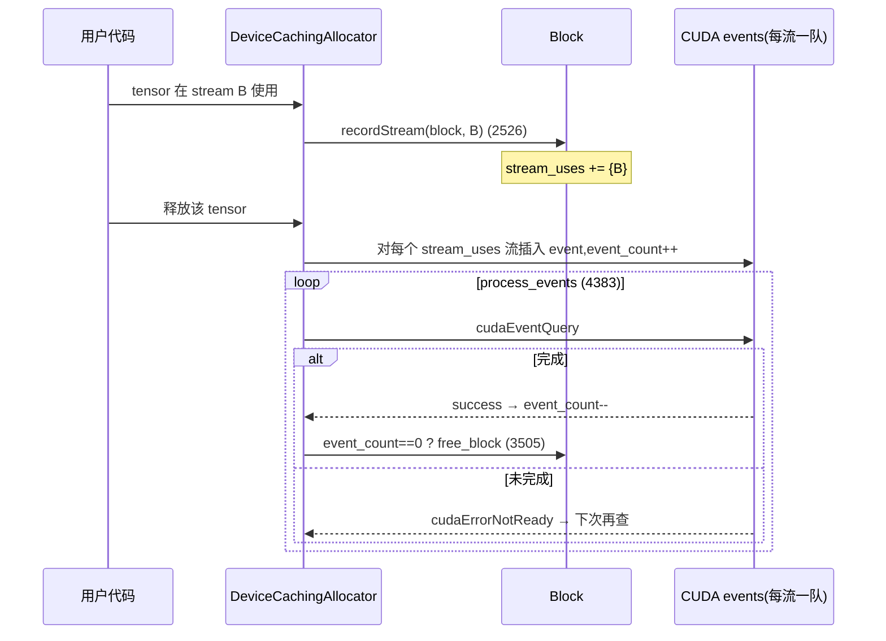
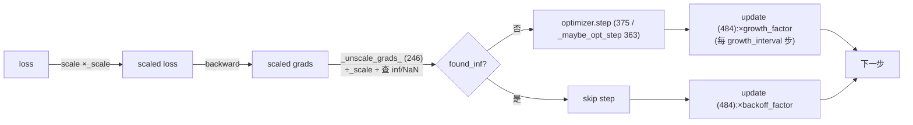
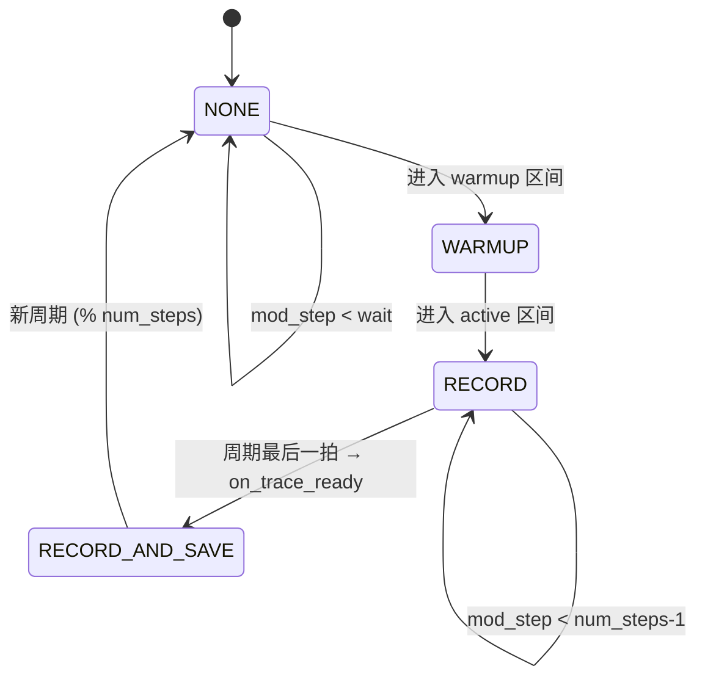

# 运行时三支柱源码深析:缓存分配器 / AMP / Kineto Profiler

> 层次:deep dive(深)
> 核验基准:PyTorch upstream `E:\97-codes\pytorch\pytorch`(v2.13.0a0, commit 9922478)
> 最后更新:2026-06-15

---

本页对运行时三根支柱做**源码级**拆解,逐机制回答「做什么 / 为什么这么设计 / 怎么实现」,并密集挂上 `路径:行号`(均相对 `E:\97-codes\pytorch\pytorch` 实际打开核实)。想先看「怎么用 / 怎么查 / 怎么验证」请回 [[amp_and_memory_tooling_quickstart]];想看三支柱如何咬合的全景图请回 [[index]]。

> 配置层全局提醒(读源码先建立的心智模型):分配器的配置真身已**下沉**到设备无关的 `c10/core/AllocatorConfig.h:162 AcceleratorAllocatorConfig`;`c10/cuda/CUDAAllocatorConfig.h` 里很多同名静态方法现在只是带 `C10_DEPRECATED_MESSAGE` 的**转发壳**(如 `pinned_use_background_threads()` 在 `CUDAAllocatorConfig.h:85-90` 直接转发到 `AcceleratorAllocatorConfig`)。环境变量主名升级为通用的 **`PYTORCH_ALLOC_CONF`**,旧名 `PYTORCH_CUDA_ALLOC_CONF` 仅低优先级兼容(`AllocatorConfig.h:156-159`)。本页凡说「配置」,指的是下沉后的真身。

---

## 一、缓存设备分配器(Caching Allocator)

### 1.1 Block —— 复用的基本单位与切分链

**做什么**:`cudaMalloc/cudaFree` 是同步且昂贵的驱动调用;DL 训练每步要做成千上万次张量分配/释放,绝不能每次都打扰驱动。分配器在一次 `cudaMalloc` 拿到的大 segment 上,切出可反复借还的子区间 —— 这个子区间就是 `Block`。

**怎么实现**:`Block` 用一对 `prev/next` 指针构成**双向链表**,表示「从同一个大块切分出来的相邻子块」;`stream_uses` 记录该块被哪些非分配流用过(见 1.3);`mapped` 标记该虚拟地址区间是否已由物理页支撑(配合 expandable segments,见 1.2)。

```cpp
// c10/cuda/CUDACachingAllocator.cpp:201
struct Block {
  c10::DeviceIndex device;       // gpu
  cudaStream_t stream;           // allocation stream
  stream_set stream_uses;        // streams on which the block was used
  size_t size;                   // block size in bytes
  size_t requested_size;         // memory originally requested
  BlockPool* pool{nullptr};      // owning memory pool
  void* ptr{nullptr};            // memory address
  bool allocated{false};         // in-use flag
  bool mapped{true};             // 虚拟地址是否已被物理页 backing(见 expandable segments)
  Block* prev{nullptr};          // prev block if split from a larger allocation
  Block* next{nullptr};          // next block if split from a larger allocation
  int event_count{0};            // number of outstanding CUDA events
  ExpandableSegment* expandable_segment_{nullptr};
  ...
  bool is_split() const { return (prev != nullptr) || (next != nullptr); }  // :254
};
```

**为什么这么设计**:把「设备级 segment」与「客户端可见 block」分离,使得释放一个 block 只是把它标回空闲并尝试与相邻 `prev/next` 合并(coalesce),而不必归还给驱动。`requested_size` 与 `size` 分开记录,正是后续可观测性(`requested_bytes` vs `allocated_bytes`)与碎片度量的基础。

**碎片从哪来**:当请求大小落在两个缓存 block 之间,分配器会从一个更大的空闲 block 上切出所需部分,剩余尾巴变成 `inactive_split` 块 —— 它「未被占用却无法独立归还给驱动」,这正是 `DeviceStats::inactive_split / inactive_split_bytes`(`c10/core/CachingDeviceAllocator.h:20-22, 35-36`)度量的碎片。`malloc`(`CUDACachingAllocator.cpp:1722`)、`free_block`(`:3505`)、整个 `DeviceCachingAllocator` 类(`:1426`)构成这套切分/合并/回收逻辑的主体。

### 1.2 Expandable Segments —— 用虚拟地址增长缓解碎片

**做什么**:不再「一次分配 = 一个 segment」,而是**每个 stream 维护一个可增长的大 segment**,用 CUDA 低层内存 API(类 mmap)按需把物理页映射进已预留的虚拟地址空间。

**为什么**:官方设计注释 `Note [Expandable Segments]`(`CUDACachingAllocator.cpp:296`)讲得很直白 —— 当 batch size 在 N 与 N±1 间轻微抖动时,旧策略会在各 segment 尾部留下「装不下下一个块、又收不回来」的碎屑(slivers);模型 50+ 层深时这种碎屑可重复几十次,最终逼出一次找不到连续空间的 OOM:

```text
// c10/cuda/CUDACachingAllocator.cpp:306  (Note [Expandable Segments] · Rationale)
// ...one common exception is when the batch size changes slightly from one
// iteration to the next... As the model runs it will partially fill up all of
// these segments leaving unusable free slices of memory at the end... With
// models 50+ layers deep, this pattern might repeat 50+ times creating many slivers.
```

**怎么实现**:见同一注释的 Implementation 段(`CUDACachingAllocator.cpp:333-339`):用 `cuMemCreate`(分配物理内存)与 `cuMemAddressReserve`(预留虚拟地址)分离,再以 `cuMemMap`/`cuMemSetAccess` 把两者关联;segment 用满后只需把新物理页**追加映射**到已有虚拟地址尾部。开关在 `CUDAAllocatorConfig::expandable_segments()`(`CUDAAllocatorConfig.h:34-46`,转发 `AcceleratorAllocatorConfig::use_expandable_segments()`,并对不支持的平台 `TORCH_WARN_ONCE` 后强制返回 false)。映射/解映射会落成 `TraceEntry::SEGMENT_MAP / SEGMENT_UNMAP` 事件(`CachingDeviceAllocator.h:126-127`),`SegmentInfo::is_expandable`(`:105`)标记该 segment 性质。

### 1.3 经 recordStream() / stream_uses 的跨流安全复用

**做什么**:当一个 block 在**非分配流**上被使用(例如在 stream A 上分配、却被 stream B 的 kernel 读写),释放时不能立刻把它还进空闲池,否则可能在 B 仍在读写时被重新分配出去 —— 数据竞争。

**怎么实现**:`recordStream` 只做一件轻量事 —— 把使用流插入 `stream_uses`(同分配流直接忽略,无需同步):

```cpp
// c10/cuda/CUDACachingAllocator.cpp:2526
void recordStream(Block* block, cuda::CUDAStream stream) {
  std::lock_guard<std::recursive_mutex> lock(mutex);
  if (stream.stream() == block->stream) {
    return;  // 同分配流上的使用无需特殊同步
  }
  block->stream_uses.insert(stream);
  if (C10_UNLIKELY(is_capture_context())) {
    block_to_cudagraph_stream_uses[block].insert(stream);  // 图捕获期单独记账
  }
}
```

真正的「延迟释放」发生在 `process_events`(`CUDACachingAllocator.cpp:4383`):释放带 `stream_uses` 的 block 时,会在每条相关流上插入一个 CUDA event;`process_events` 按流轮询 `cudaEventQuery`,event 完成才递减 `event_count`,归零后才 `free_block` 真正归还:

```cpp
// c10/cuda/CUDACachingAllocator.cpp:4400
cudaError_t err = C10_CUDA_ERROR_HANDLED(cudaEventQuery(*event));
if (err == cudaErrorNotReady) { ...; break; }      // 该流尚未跑完,留待下次
...
block->event_count--;                              // :4411
if (block->event_count == 0) { free_block(block, context); }  // :4412-4413
```

**为什么这么设计**:per-stream 的 event 队列(注释 `:4388-4390`)而非单一全局队列,是为了避免「队头阻塞」—— 一条长跑 kernel 的流不应拖住其它流上早已可回收的 block。



### 1.4 可观测性底账:DeviceStats / TraceEntry / SegmentInfo

这三者是 `torch.cuda.memory_*` 一族 Python API 的 C++ 背身,也是 profiler 内存时间线的数据源(见 3.3)。

- **`DeviceStats`**(`c10/core/CachingDeviceAllocator.h:13-70`)是 `memory_stats()` 的真身:`allocation/segment/active/inactive_split` 四个 `StatArray`(各含 current/peak/allocated/freed),`allocated_bytes/reserved_bytes/active_bytes/inactive_split_bytes/requested_bytes` 字节维度,以及 `num_alloc_retries`(:42)、`num_ooms`(:46)、`oversize_*`(:49-52) 等诊断计数;`reserved_bytes_by_private_pools`(:31-32)按图私有池单独记账(见 1.7)。
- **`TraceEntry`**(`CachingDeviceAllocator.h:116-168`)是 `_record_memory_history` 时间线的逐事件记录,`Action` 枚举覆盖 `ALLOC / FREE_REQUESTED / FREE_COMPLETED / SEGMENT_ALLOC / SEGMENT_FREE / SEGMENT_MAP / SEGMENT_UNMAP / SNAPSHOT / OOM`(:117-132)。注意 `FREE_REQUESTED` 与 `FREE_COMPLETED` 分离 —— 正对应 1.3 的延迟释放语义。
- **`SegmentInfo` / `BlockInfo`**(`CachingDeviceAllocator.h:83-109`)是 `snapshot()` 的结构,`SegmentInfo::blocks` 给出一个 segment 内部所有子块的占用情况,`is_large / is_expandable / owner_private_pool_id`(:104-106)标记其性质。`RecordContext`(:74-79)的 `NEVER/STATE/ALLOC/ALL` 控制为快照保留多深的调用栈。

整套快照对外封装为 `SnapshotInfo`(`c10/cuda/CUDACachingAllocator.h:79-84`,含 `segments / device_traces / external_annotations / config_metadata`),配置回放信息则在 `AllocatorConfigInfo`(`:65-77`)。

### 1.5 Pinned 内存注册池化

**做什么**:host 端 pinned(page-locked)内存的分配与「向 CUDA 注册」可以多线程加速,并可预留 segment 复用。

**怎么实现**:`pinned_use_cuda_host_register()`(`CUDAAllocatorConfig.h:77-79`)决定是否用 `cudaHostRegister` 路径;`pinned_num_register_threads()`(:81-83)给注册并行度,上限由 `pinned_max_register_threads()` 硬编码为 **128**(:96-101,注释说明经验上 8 线程已较优、留 128 为未来系统);`pinned_reserve_segment_size_mb()`(:92-94)控制预留 segment 大小;后台事件处理线程开关 `pinned_use_background_threads()` 已下沉(:85-90 转发壳)。

### 1.6 CPU 分配器路径与 Allocator / DataPtr 基类

**做什么**:CPU 侧默认是一个**非缓存**的简单 `Allocator`(可被替换);另有一个**实验性** `CPUCachingAllocator`,目前唯一使用方是 StaticRuntime。

**怎么实现**:入口在 `c10/core/CPUAllocator.h:41-57` —— `GetCPUAllocator/SetCPUAllocator`(:41-44)、`GetDefaultCPUAllocator`(:47)、`GetDefaultMobileCPUAllocator`(:50),以及注释明确「仅 StaticRuntime 用、未来可能消失」的 `Set/GetCPUCachingAllocator`(:52-57)。

所有分配器都实现统一抽象基类 `struct Allocator`(`c10/core/Allocator.h:180`),核心是纯虚 `allocate(size_t)`(:183)返回一个 `DataPtr`;`raw_deleter()`(:204)在能返回非空时表明 raw 分配/释放 API 可安全使用。内存句柄 `DataPtr`(`Allocator.h:40`)= 一个带 deleter 的 `UniqueVoidPtr` + `Device`(:42-43),它正是 storage 持有内存、并让 profiler 能把字节归因到设备的统计单元(见 [[00_tensor_and_storage/index]])。

### 1.7 CUDA-graph 私有池隔离

**做什么**:图捕获(stream capture)期间,所有分配必须落进一个**私有 mempool**,使图重放时拿到稳定地址、且与普通分配互不干扰。

**怎么实现**:抽象基类 `CUDAAllocator` 暴露一组私有池 API(`c10/cuda/CUDACachingAllocator.h:145-162`):`snapshot(MempoolId_t, ...)`(:145-147)、`beginAllocateToPool(device, mempool_id, filter)`(:148-151)把符合 `filter` 的分配路由进指定池、`endAllocateToPool`(:152-154)结束路由、`releasePool`(:162)释放整池。关键设计是 `markCaptureBegin/End`(:160-161)与 begin/endAllocateToPool **分离** —— 后者「只路由分配进私有池」,可在没有真正 `cudaStreamBeginCapture` 时被调用(注释 :155-159 列举:`torch.cuda.use_mem_pool`、NCCL 注册、inductor cudagraph_trees 的 warmup),前者才标记「真正的 stream capture 已开始」。每个私有池的字节占用由 `DeviceStats::reserved_bytes_by_private_pools`(`CachingDeviceAllocator.h:31-32`)按 `MempoolId_t` 单独记账。详见 [[06_graphs/index]]。

---

## 二、AMP(Autocast + GradScaler)

### 2.1 Autocast = dispatch key 拦截

**做什么**:在 `autocast` 区域内,算子被路由到 `Autocast*` dispatch key 的包装实现,按算子类别决定输入是否降精度(matmul/conv → fp16/bf16,reduction/loss 类保 fp32)。

**为什么在 dispatcher 层做**:无需改任何 Python 模型代码,且精度策略对算子集中管理 —— 这正是 dispatch key 机制(见 [[01_dispatcher_and_device/index]])的典型用法。

**怎么实现**:设备类型 → dispatch key 的映射在 `get_autocast_dispatch_key_from_device_type`(`aten/src/ATen/autocast_mode.h:174`)。注意一个易错点 —— **CUDA 用的是裸 `Autocast` key,CPU 才是 `AutocastCPU`**:

```cpp
// aten/src/ATen/autocast_mode.h:174
inline DispatchKey get_autocast_dispatch_key_from_device_type(c10::DeviceType d) {
  switch (d) {
    case c10::DeviceType::CUDA: return DispatchKey::Autocast;     // 注意:不是 AutocastCUDA
    case c10::DeviceType::CPU:  return DispatchKey::AutocastCPU;
    case c10::DeviceType::XPU:  return DispatchKey::AutocastXPU;
    ...
  }
}
```

「enable/disable」本质就是在线程局部状态(TLS)里 include/exclude 该 key —— `is_autocast_enabled == 未被 exclude`:

```cpp
// aten/src/ATen/autocast_mode.cpp:11
bool is_autocast_enabled(at::DeviceType device_type) {
  at::DispatchKey dispatch_key = get_autocast_dispatch_key_from_device_type(device_type);
  return !c10::impl::tls_is_dispatch_key_excluded(dispatch_key);
}
void set_autocast_enabled(at::DeviceType device_type, bool enabled) {  // :16
  ...
  c10::impl::tls_set_dispatch_key_excluded(dispatch_key, !enabled);   // enabled == 未 exclude
}
```

某张量是否「有资格」被 autocast 处理(必须是对应设备的浮点张量)由 `is_autocast_eligible`(`autocast_mode.h:142`)判定。

### 2.2 逐设备默认 dtype

**做什么**:每种设备有自己的默认低精度类型 —— CPU 默认 **bf16**,CUDA 默认 **half**。

**怎么实现**:一个 thread-local 数组,下标即 `DeviceType`,并用 `static_assert` 把数组长度钉死在 `COMPILE_TIME_MAX_DEVICE_TYPES == 21`,强制数组顺序与 `c10/core/DeviceType.h` 的设备枚举顺序逐一对齐(顺序错位会编译失败):

```cpp
// aten/src/ATen/autocast_mode.cpp:56
static_assert(at::COMPILE_TIME_MAX_DEVICE_TYPES == 21, "...");
thread_local std::array<at::ScalarType, at::COMPILE_TIME_MAX_DEVICE_TYPES>
    autocast_dtype = {
        at::kBFloat16,             // CPU
        at::kHalf,                 // CUDA
        ...
        at::kHalf,                 // XPU
        at::kHalf,                 // MPS
        at::kBFloat16,             // HPU / HABANA
        ...
};
```

### 2.3 weakref 张量缓存(参数复用)

**做什么**:把 fp32 权重做低精度 cast 的结果缓存起来 —— 同一权重在一次 forward 里常被多个算子使用,缓存可避免重复 cast。

**怎么实现**:缓存键是源张量的 `TensorImpl*`(作为 uuid 代理,浅拷贝下不变),值是 `(weakref, casted tensor)` 元组:

```cpp
// aten/src/ATen/autocast_mode.cpp:38
using weakref_type = c10::weak_intrusive_ptr<TensorImpl, UndefinedTensorImpl>;
using val_type = std::tuple<weakref_type, Tensor>;
ska::flat_hash_map<TensorImpl*, val_type>& get_cached_casts();  // :41
```

**为什么要 weakref**:设计注释(`autocast_mode.cpp:22-37`,标注与 @ezyang 讨论得出)说明 —— 用裸 `TensorImpl*` 当键有个隐患:源张量若被回收,另一个新张量可能恰好分配到同一个 `TensorImpl*` 地址,从而**误命中**这个罕见、间歇、不可复现的 bug。weakref 持有源 `TensorImpl` 不被删除,堵死了这个地址复用的缝隙。

缓存生命周期由 nesting 控制:`nesting`(thread_local,`autocast_mode.cpp:52`)记录 Python 上下文管理器的嵌套深度;归零(退出最外层 autocast,即一次 forward 结束)时调 `clear_cache()`(`autocast_mode.cpp:89`)清空,防止缓存张量泄漏到 autocast 区域之外。是否启用缓存本身由 `cache_enabled`(:85)控制。

### 2.4 Autocast 的 Python 上下文管理器

`torch.amp.autocast`(`torch/amp/autocast_mode.py:52`)是用户入口,`__enter__/__exit__` 严格对称:

```python
# torch/amp/autocast_mode.py:308  __enter__:保存旧状态 → 设新状态 → 自增 nesting
self.prev_cache_enabled = torch.is_autocast_cache_enabled()
self.prev = torch.is_autocast_enabled(self.device)
self.prev_fastdtype = torch.get_autocast_dtype(self.device)
torch.set_autocast_enabled(self.device, self._enabled)
torch.set_autocast_dtype(self.device, self.fast_dtype)
torch.autocast_increment_nesting()
torch.set_autocast_cache_enabled(self._cache_enabled)

# torch/amp/autocast_mode.py:343  __exit__:nesting 归零时清缓存 → 回滚旧状态
if torch.autocast_decrement_nesting() == 0:
    torch.clear_autocast_cache()         # :348-349 —— 对应 2.3 的缓存生命周期
torch.set_autocast_enabled(self.device, self.prev)
torch.set_autocast_dtype(self.device, self.prev_fastdtype)
torch.set_autocast_cache_enabled(self.prev_cache_enabled)
```

「保存 prev → 设新值 → 退出回滚」是可重入(嵌套 autocast)安全的标准做法;nesting 计数则把「缓存何时清」与「最外层何时退出」对齐。

### 2.5 GradScaler 动态放缩 + inf/NaN skip

**做什么**:fp16 的动态范围窄,小梯度容易下溢成 0。`scale(loss)` 把损失乘上一个放大因子,使反向得到的梯度落在 fp16 可表示区间;`step` 前先 unscale 并检查 inf/NaN,干净才真正 `optimizer.step()`;`update` 据本步是否溢出来增大/回退 scale。

**状态机不变量**:`OptState`(`torch/amp/grad_scaler.py:43-46`)的 `READY → UNSCALED → STEPPED` 保证「`step` 之后必须 `update`」;每个 optimizer 的状态由 `_refresh_per_optimizer_state`(:49-50)重置为 `{stage: READY, found_inf_per_device: {}}`。默认参数在构造器:`init_scale=2**16`、`growth_factor=2.0`、`backoff_factor=0.5`、`growth_interval=2000`(`grad_scaler.py:126-129`)。

**unscale + 查溢出**:`_unscale_grads_`(`grad_scaler.py:246`)把梯度按 (device, dtype) 分组,一次性喂给融合核 `_amp_foreach_non_finite_check_and_unscale_`;并默认禁止直接 unscale fp16 梯度(`allow_fp16=False` 时遇 fp16 抛错,:274-275)。`_MultiDeviceReplicator`(:20-35)把 `inv_scale`/`found_inf` 标量按需懒复制到各设备,避免多设备重复同步。

**仅在无溢出时 step**:

```python
# torch/amp/grad_scaler.py:363
def _maybe_opt_step(self, optimizer, optimizer_state, *args, **kwargs):
    retval = None
    if not sum(v.item() for v in optimizer_state["found_inf_per_device"].values()):
        retval = optimizer.step(*args, **kwargs)   # 所有设备都无 inf/NaN 才真正 step
    return retval
```

**update 更新 scale**:`update`(`grad_scaler.py:484`)把各 optimizer 收集到的 `found_inf` 汇总成一个张量,交给融合核原子地更新 scale 与 growth tracker —— 溢出则乘 `backoff_factor` 回退,连续 `growth_interval` 步无溢出则乘 `growth_factor` 增长:

```python
# torch/amp/grad_scaler.py:549
torch._amp_update_scale_(
    _scale, _growth_tracker, found_inf_combined,
    self._growth_factor, self._backoff_factor, self._growth_interval,
)
```



---

## 三、Kineto Profiler

### 3.1 Kineto / CUPTI shim —— 统一 CPU/GPU tracing

**做什么**:`torch/csrc/profiler/kineto_shim.h` 把第三方库 libkineto(及其 CUDA 后端 CUPTI)包成一层薄抽象,使上层 profiler 代码可以**无条件编译** —— 即便构建时 `USE_KINETO` 关闭,接口仍在,只是退化为 Dummy 类型。

**怎么实现**:用 `#ifdef USE_KINETO` 切换底层类型别名,接口签名保持不变:

```cpp
// torch/csrc/profiler/kineto_shim.h:49
#ifdef USE_KINETO
using trace_t = libkineto::CpuTraceBuffer;
using activity_t = libkineto::GenericTraceActivity;
#else
struct DummyTraceBuffer {};
using trace_t = DummyTraceBuffer;
struct activity_t;
#endif
```

关键封装:`DeviceAndResource`(:43-46,device/resource id)、`TraceWrapper`(:68,包 `CpuTraceBuffer`,`addCPUActivity` 在 :72)、`ActivityTraceWrapper`(:93,`save(path)` 在 :97,且注释 :106 提示 Kineto 的 save 是破坏性的)。采集生命周期函数:`prepareTrace`(:114-119)、`startTrace`(:122)、`stopTrace`(:123,返回 `ActivityTraceWrapper`),以及相关性 id 的 `pushCorrelationId/popCorrelationId`(:124-127)。

### 3.2 profile 上下文 + schedule 状态机

**做什么**:`torch.profiler.profile`(`torch/profiler/profiler.py:773`,继承自低层 `_KinetoProfile`,:150)按一个 `schedule` 在每个 `step()` 切换四种动作,做**周期性采样**而非全程录制(全程录制开销大且数据量爆炸)。

**怎么实现**:`schedule(wait, warmup, active, repeat, skip_first)`(`profiler.py:667`)返回一个把 `step -> ProfilerAction` 的纯函数 `schedule_fn`(:691)。一个周期 `wait + warmup + active`:wait 阶段不采(`NONE`)、warmup 阶段预热(`WARMUP`,丢弃以排除冷启动偏差)、active 阶段录制(`RECORD`),且**最后一拍**用 `RECORD_AND_SAVE` 触发落盘:

```python
# torch/profiler/profiler.py:704
mod_step = step % num_steps                       # num_steps = wait + warmup + active
if mod_step < wait:               return ProfilerAction.NONE
elif mod_step < wait + warmup:    return ProfilerAction.WARMUP
else:
    return (ProfilerAction.RECORD if mod_step < num_steps - 1
            else ProfilerAction.RECORD_AND_SAVE)   # 周期最后一拍落盘
```

每次 `prof.step()`(`profiler.py:1150`)推进状态机,跨态时按需 prepare/start/stop trace 并在周期末触发 `on_trace_ready`。导出端:`export_chrome_trace`(:409,Chrome `chrome://tracing` / Perfetto 格式)、`tensorboard_trace_handler`(:737,常作 `on_trace_ready`,产出 `*.pt.trace.json[.gz]`)、`export_memory_timeline`(:591,内存时间线,见 3.3)。



### 3.3 Memory profiler 时间线归因

**做什么**:把每一块 storage 在时间轴上归类为 INPUT / TEMPORARY / ACTIVATION / GRADIENT / AUTOGRAD_DETAIL / PARAMETER / OPTIMIZER_STATE,生成「按类别堆叠的内存随时间变化」时间线(HTML / raw JSON)。

**怎么实现**:类别枚举与配色在 `torch/profiler/_memory_profiler.py:37`:

```python
# torch/profiler/_memory_profiler.py:37
class Category(enum.Enum):
    INPUT; TEMPORARY; ACTIVATION; GRADIENT; AUTOGRAD_DETAIL; PARAMETER; OPTIMIZER_STATE  # :38-44
# :47 _CATEGORY_TO_COLORS —— 每类一个固定颜色(PARAMETER=darkgreen, ACTIVATION=red, ...)
# :61 class Action: PREEXISTING / CREATE / INCREMENT_VERSION / DESTROY
```

storage 的可哈希身份用 `allocation_id`(而非易复用的裸指针)承载:`_Storage`(:76-94)的 `__eq__/__hash__` 都基于 `allocation_id`;`TensorKey`(:97-)在此之上加设备维度。整张时间线最终由 `export_memory_timeline`(:1085)写 JSON、`export_memory_timeline_html`(:1166)写可视化 HTML。

**数据来源(与分配器底账的呼应)**:memory profiler 的事件来自 profiler 采集到的 `_ExtraFields_Allocation` 等(`_memory_profiler.py:12-19` 从 `torch._C._profiler` 导入)。这与第一支柱分配器吐出的 `TraceEntry` / `DeviceStats`(1.4)是**同一笔内存账的两个视角** —— 一边是「分配器底账」(谁向驱动要了多少、碎片多少),一边是「profiler 时间线」(每块字节属于哪种语义类别、何时生灭),互为印证。这正是把三支柱放在一页的根本原因。

---

## 社区参考

- PyTorch 官方文档,**CUDA semantics — Memory management**(缓存分配器、PYTORCH_CUDA_ALLOC_CONF、expandable_segments)— https://pytorch.org/docs/stable/notes/cuda.html
- PyTorch 官方文档,**Understanding CUDA Memory Usage**(memory snapshot / 时间线)— https://pytorch.org/docs/stable/torch_cuda_memory.html
- PyTorch 官方文档,**Automatic Mixed Precision package** — https://pytorch.org/docs/stable/amp.html;AMP recipe — https://pytorch.org/tutorials/recipes/recipes/amp_recipe.html
- PyTorch 官方文档,**torch.profiler** — https://pytorch.org/docs/stable/profiler.html

## Related Pages

- [[index]] — 本模块 overview:三支柱全景图与它们如何咬合
- [[amp_and_memory_tooling_quickstart]] — 本模块 quick start:怎么用 / 怎么查 / 怎么验证
- [[06_graphs/index]] — CUDA / NPU Graphs:图私有内存池(`beginAllocateToPool`/`releasePool`)的消费方
- [[inductor_memory_management_analysis]] — torch.compile 内存管理三层:本页(缓存分配器)是其「层 2 运行期物理池」,上接 Inductor 编译期 `empty_strided` 规划、下接 CUDA Graphs 私有池
- [[01_dispatcher_and_device/index]] — Dispatcher:autocast 作为 `Autocast*` dispatch key 在分发层拦截算子
- [[00_tensor_and_storage/index]] — Tensor / Storage / DataPtr / Allocator 抽象:分配器交付的内存句柄与 profiler 归因的统计单元
