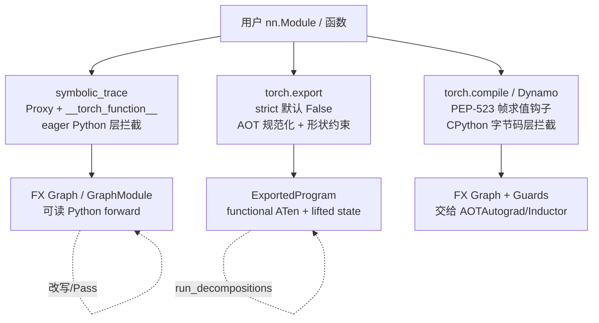
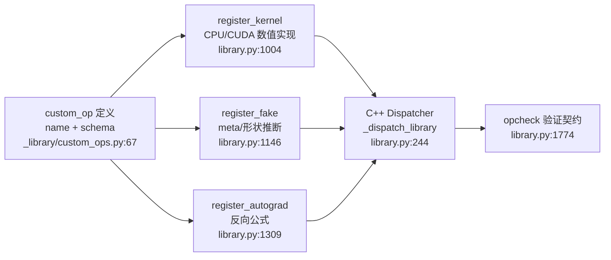
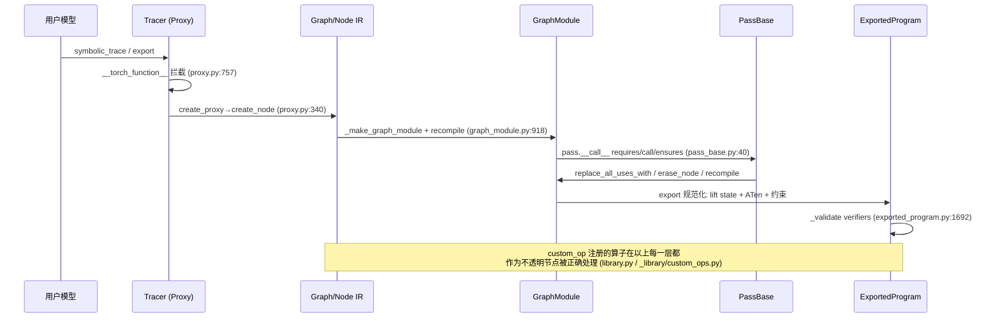

> [!correction] 页面角色、审计状态与集中纠错（见 [[correction_report]]）
> **页面角色**：FX、export、custom-op 与 functorch 的完整 deep dive。
> **原始基线**：见下方页头；**当前审计基线**：PyTorch `e8f97c1a6ef8cbcdd0a946606bc1e924e4f07e52`。
> **审计状态**：保留专题纵深；图 IR、捕获、值语义和安全改图的当前课程主线见 [[19_torch_compile_end_to_end/00_pytorch_graph_series_index]]，逐结构单元历史迁移仍在 ledger 中跟踪。

> 层次:deep dive
> 核验基准:PyTorch upstream `E:\97-codes\pytorch\pytorch`(v2.13.0a0, commit 9922478)
> 最后更新:2026-06-15

# torch.fx / torch.export / 扩展机制 — 源码级深析

本页面向已经会用 `torch.compile` 但想真正理解「图是怎么被捕获、表示、改写、规范化、扩展」的工程师。我们从最底层的 **Proxy 拦截** 一路深挖到 **ExportedProgram 的 AOT 规范化** 与 **torch.library 的算子分发桥接**,每一处机制都给出 `相对路径:行号`(相对 `E:\97-codes\pytorch\pytorch` checkout 根),并解释「做什么 / 为什么这么设计 / 怎么实现」。

上层用法速查见 [[fx_export_custom_op_quickstart]],模块全景与关联域见 [[14_fx_export_and_extensibility/index]]。捕获机制的「另一条路」(字节码层)见 [[02_dynamo/index]];规范化后的 ATen 分解链见 [[03_aot_autograd/index]];算子注册的分发器底座见 [[01_dispatcher_and_device/index]] 与 [[07_op_registration/index]]。

---

## 0. 三条捕获路径的分野

FX、export、Dynamo 都在做「程序捕获(program capture)」,但拦截层次完全不同。理解这点是读懂本页的前提:



- **symbolic_trace**:不碰解释器,靠 `Tensor` 的 `__torch_function__` 协议 + `Proxy` 重载魔术方法,在 eager Python 层「记录」算子调用。实现轻、图可读、可任意改写;代价是无法处理依赖数据的控制流(`Proxy` 不可布尔化/迭代)。
- **torch.export**:在 trace 的基础上做 **AOT 规范化** —— 算子降到 functional ATen 算子集、参数/buffer 被 lift 成显式图输入、形状假设被记录为可校验/可序列化的约束。
- **Dynamo**:经 CPython PEP-523 帧求值钩子在字节码层捕获,能处理控制流(靠 guard + graph break)。本页不展开,详见 [[02_dynamo/index]]。

---

## 1. 机制一:Proxy 拦截式捕获
> [!correction] F-016：本区段按固定基线纠错；现行结论见 [[19_torch_compile_end_to_end/07_graph_capture_frontends_and_tracing#2. `symbolic_trace`]]，逐项说明见 [[correction_report]]。
**做什么**:把一次「符号执行」记录成 FX Graph。输入张量被包成 `Proxy`(内部持有一个占位 `Node`),算子调用命中拦截点后建节点、返回新 `Proxy`,层层串成数据流图。

**为什么这么设计**:FX 选择复用 PyTorch 已有的 `__torch_function__` 覆盖协议(与 `__torch_dispatch__` 同源的扩展点,背景见 [[01_dispatcher_and_device/index]]),而不是去 hook 解释器。好处是实现极轻、产物是可读 Python、可被任意 Python 改写;代价是它看到的是「Python 层的 torch 调用」,因此遇到 `if proxy:`、`for x in proxy:`、`len(proxy)` 这类需要具体值的操作只能报错(见 `Proxy` docstring,`torch/fx/proxy.py:600`,以及 `__len__` 的显式报错 `torch/fx/proxy.py:750`)。

**怎么实现**:核心拦截点是 `Proxy.__torch_function__`(`torch/fx/proxy.py:757`)。它先用 `tree_map_` 在所有 args/kwargs 里找出唯一的 tracer(多个 tracer 会报错),再按算子类型路由到 `create_proxy`:

```python
# torch/fx/proxy.py:773  从实参里收集 tracer
tree_map_(find_tracer, args)
tree_map_(find_tracer, kwargs)
...
tracer = next(iter(tracers.keys()))                 # :781
...
if torch.overrides.is_tensor_method_or_property(orig_method):   # :786
    return tracer.create_proxy("call_method", orig_method.__name__, args, kwargs)
else:
    return tracer.create_proxy("call_function", orig_method, args, kwargs, ...)  # :800
```

真正建节点的是 `TracerBase.create_proxy`(`torch/fx/proxy.py:340`):它先把 `Proxy` 实参 **降解**为对 `Node` 的引用(`create_arg`),再建节点、包回 `Proxy`:

```python
# torch/fx/proxy.py:360
args_ = self.create_arg(args)            # Proxy → Node 引用(create_arg :411)
kwargs_ = self.create_arg(kwargs)
node = self.create_node(kind, target, args_, kwargs_, name, type_expr)   # :367
proxy = self.proxy(node) if not proxy_factory_fn else proxy_factory_fn(node)
```

- `TracerBase` 基类 `torch/fx/proxy.py:186`;`create_arg`(把 Python 对象降解成可入 IR 的 `Argument`)`torch/fx/proxy.py:411`。
- **进阶**:`MetaProxy`(`torch/fx/proxy.py:810`)是 `Proxy` 子类,其 `__torch_function__`(`torch/fx/proxy.py:824`)在 fake_mode 下顺带传播 `meta["val"]`,这是「在 trace 时同时做形状/meta 传播」的钩子,与 export 的 fake 张量推断衔接。

---

## 2. 机制二:Tracer 子类化(leaf modules / wrapped fns / concrete_args)

**做什么**:`symbolic_trace(m)` 等价于 `Tracer().trace(m)`(`torch/fx/_symbolic_trace.py:263`),薄封装层只是 new 一个默认 `Tracer`、调 `trace`、再打包成 GraphModule:

```python
# torch/fx/_symbolic_trace.py:1416  symbolic_trace 主体
tracer = Tracer()
graph = tracer.trace(root, concrete_args)
name = root.__class__.__name__ if isinstance(root, torch.nn.Module) else root.__name__
return _make_graph_module(tracer.root, graph, name)
```

(`symbolic_trace` 的 `def` 在 `torch/fx/_symbolic_trace.py:1361`,签名与 docstring 占 1361–1415。)

**为什么**:并非所有子模块都该被展开 —— 自定义 CUDA 模块、含不可追踪逻辑的模块,应当作为「叶子」原样保留成一个 `call_module` 节点;某些顶层函数(如带 Python 控制流的工具函数)应当被整体当作一个 `call_function` 节点。这两个边界都需要可定制。

**怎么实现**:
- **叶子边界**:覆写 `Tracer.is_leaf_module`(`torch/fx/_symbolic_trace.py:476`)。返回 `True` 的模块不再深入展开,生成 `call_module` 节点(默认实现把所有 `torch.nn` 内置模块视为叶子)。
- **函数边界**:`torch.fx.wrap`(`torch/fx/_symbolic_trace.py:1292`,带类型重载 1288/1290)。它必须在模块顶层调用,把函数登记进待 patch 列表,使追踪时该函数整体成为一个 `call_function`,而不进入其内部。
- **偏特化消控制流**:`trace(root, concrete_args)`(`torch/fx/_symbolic_trace.py:769`)。`concrete_args` 给某些输入「钉死具体值」,让依赖该值的 `if`/循环在 trace 期就被求值掉,从而绕过 `Proxy` 不可布尔化的限制。

---

## 3. 机制三:Node / Graph 双向链表 IR 与 users 依赖跟踪

**做什么**:`Graph`(`torch/fx/graph.py:1307`)是 `Node` 的有序双向链表;每个 `Node`(`torch/fx/node.py:238`)有六种 `op`,语义写在类 docstring(`torch/fx/node.py:244–263`):

| op | 含义 | target | args/kwargs |
|---|---|---|---|
| `placeholder` | 函数输入 | 参数名 | (可选默认值) |
| `get_attr` | 取 param/buffer | 限定名 | — |
| `call_function` | 调自由函数 | 函数对象 | 调用实参 |
| `call_module` | 调子模块 forward | 模块限定名 | 实参(不含 self) |
| `call_method` | 调方法 | 方法名(str) | 实参(含 self) |
| `output` | 返回值 | — | `args[0]` 为返回 |

**为什么用双向链表 + 反向 users 边**:
- 双向链表支持 **O(1) 插入/删除**(`prepend` `torch/fx/node.py:405`、`append` `torch/fx/node.py:420`)与稳定遍历,改写时不必重建整张图。
- `Node` 同时维护正反两条边:`all_input_nodes`(`torch/fx/node.py:479`,「我用谁」)与 `users`(「谁用我」)。反向 `users` 边让改写安全 —— 删除一个节点前可断言它无用户,替换时可一次性把所有用户重定向。

**怎么实现**:`args`/`kwargs` 是带 setter 的 property(`torch/fx/node.py:432`/`444`、`456`/`467`),赋值会自动维护双向 use-def(注释明确「All accounting of uses and users is updated automatically on assignment」`torch/fx/node.py:439`)。以 `insert_arg` 为例可看到这套记账逻辑的真身:

```python
# torch/fx/node.py:529  插入实参时同步双向边
for new_use in _new_input_nodes:
    if new_use not in self._input_nodes:
        self._input_nodes.setdefault(new_use)   # 正向:我→输入
        new_use.users.setdefault(self)          # 反向:输入→我(users)
```

改写时最常用的两个原语:
- `replace_all_uses_with`(`torch/fx/node.py:693`):把所有用我的节点重定向到新节点(支持 `delete_user_cb` 过滤、`propagate_meta` 搬运 `.meta`)。
- `Graph.erase_node`(`torch/fx/graph.py:1571`):删节点,若仍有 users 则抛异常(由 docstring 明确)。

配套的图级 API:`Graph.nodes` 遍历(`torch/fx/graph.py:1386`)、`create_node`(`torch/fx/graph.py:1495`)、插点上下文 `inserting_after`(`torch/fx/graph.py:1637`)、合法性自检 `Graph.lint`(`torch/fx/graph.py:2121`,检查 ownership / 拓扑序 / target 存在性)。

---

## 4. 机制四:GraphModule 代码生成 + linecache 注入

**做什么**:`GraphModule`(`torch/fx/graph_module.py:511`)从 `Graph` **生成真实的 Python `forward` 源码并编译**,而非解释执行图。给 `graph` 重新赋值会触发自动 `recompile`;**原地修改图后必须手动调 `recompile()`**,否则生成代码会过期(`torch/fx/graph_module.py:920` docstring 明确警告)。

**为什么生成源码而非解释**:生成可读 Python 源码后,profiler 能按行归因、调试器能单步、异常 traceback 能定位到具体生成行 —— 这对调试由 pass 改写过的图至关重要。关键的「让 traceback 找得到代码」靠把生成源码塞进 `linecache`。

**怎么实现**:`recompile`(`torch/fx/graph_module.py:918`)调 `graph.python_code(...)` 拿到源码 `src` 与行号映射 `_lineno_map`,再编译成 `forward`:

```python
# torch/fx/graph_module.py:930
python_code = self._graph.python_code(root_module="self", record_func=...)
self._code = python_code.src
self._lineno_map = python_code._lineno_map           # :935 生成行↔节点 行号映射
...
cls.forward = _forward_from_src(self._code, python_code.globals, co_fields)   # :984
```

`_forward_from_src`(`torch/fx/graph_module.py:146`)→ `_exec_with_source`(`torch/fx/graph_module.py:134`)→ `exec(compile(src, key, "exec", dont_inherit=True), globals)`(`torch/fx/graph_module.py:143`;`dont_inherit=True` 防止本模块的 `from __future__ import annotations` 泄漏进生成代码)。而 `_EvalCacheLoader.cache` 把源码注册进 linecache,使 `<eval_with_key>.N` 这样的「虚拟文件名」在 traceback 里能取到源码行:

```python
# torch/fx/graph_module.py:96
linecache.lazycache(key, globals_copy)
```

- 序列化:`reduce_graph_module`(`torch/fx/graph_module.py:187`)是 pickle 的反序列化入口;`to_folder`(`torch/fx/graph_module.py:683`)把整个 GraphModule 落盘成可导入的 Python 包。

---

## 5. 机制五:PassBase —— 前置/变换/后置三段式
> [!correction] F-017：本区段按固定基线纠错；现行结论见 [[19_torch_compile_end_to_end/15_graph_pass_pipeline_ordering_and_fixpoint#5. Single round、bounded repeat、fixed point]]，逐项说明见 [[correction_report]]。
**做什么**:统一的图变换 pass 接口(`torch/fx/passes/infra/pass_base.py:28`)。`__call__` 把「前置不变量检查 → 变换 → 后置不变量检查」串成一条流水线。

**为什么**:把「不变量断言」与「变换逻辑」解耦,保证 pass 链每一步都能验证图仍然合法;`PassResult(graph_module, modified)`(`torch/fx/passes/infra/pass_base.py:14`)把「这个 pass 是否改了图」回传给 PassManager,使其知道是否需要再迭代到不动点。

**怎么实现**:子类只须实现抽象方法 `call`(`torch/fx/passes/infra/pass_base.py:51`);`requires`/`ensures` 是可选覆写的钩子(`torch/fx/passes/infra/pass_base.py:60`/`70`,默认空实现):

```python
# torch/fx/passes/infra/pass_base.py:40
def __call__(self, graph_module: GraphModule) -> PassResult | None:
    self.requires(graph_module)        # 前置不变量(默认 no-op)
    res = self.call(graph_module)      # 抽象方法:实际变换
    self.ensures(graph_module)         # 后置不变量(默认 no-op)
    return res
```

典型用法:`call` 内遍历 `graph_module.graph.nodes`、用 `inserting_after` + `create_node` 插新节点、`replace_all_uses_with` 重定向、`erase_node` 删旧节点,最后 `graph_module.recompile()`,返回 `PassResult(gm, modified=True)`。

---

## 6. 机制六:ExportedProgram —— AOT 规范化、lifted state、Dim 约束
> [!correction] F-008、F-009：本区段按固定基线纠错；现行结论见 [[19_torch_compile_end_to_end/03_graph_values_metadata_and_signatures#9.2 ExportGraphSignature]]，逐项说明见 [[correction_report]]。
**做什么**:`export(mod, args, kwargs, *, dynamic_shapes=...)`(`torch/export/__init__.py:59`)产出 `ExportedProgram`(`torch/export/exported_program.py:1058`)—— 一张已规范化到 **functional ATen 算子集**、消除了 Python 控制流/数据结构、并带形状约束的 IR,可序列化、可重放。注意 **`strict` 默认 `False`**:

```python
# torch/export/__init__.py:59
def export(mod, args, kwargs=None, *, dynamic_shapes=None,
           strict=False, preserve_module_call_signature=(),
           prefer_deferred_runtime_asserts_over_guards=False) -> ExportedProgram:
```

**为什么相比 FX 图更「健全」**:普通 FX 图是 eager 捕获的产物,不对形状/状态做任何保证;export 提供 **AOT 健全性保证**:

1. **lifted params/buffers**:参数与 buffer 被「提升」为显式图输入,图因此变成 **纯函数**。`ExportedProgram` 把状态拆开持有 —— `_graph_module / _graph_signature / _state_dict / _range_constraints / _module_call_graph / _constants / _verifiers`(字段声明块 `torch/export/exported_program.py:1074–1099`)。`graph_signature`(属性 `torch/export/exported_program.py:1165`)的 input_specs 用 `InputKind` 区分 `PARAMETER` / `BUFFER` / `USER_INPUT`;`_num_lifted_params_buffers`(`torch/export/exported_program.py:1490`)正是数到第一个 `USER_INPUT` 之前有多少个被 lift 的输入。
2. **形状约束**:静态维在 export 时自动校验;动态维必须用 `Dim` 显式声明并经 `dynamic_shapes` 绑定,否则报错并给出建议。结果存为 `range_constraints`(属性 `torch/export/exported_program.py:1236`,`{sympy.Symbol: ValueRanges}`)。`Dim` / `ShapesCollection` 从 `torch/export/__init__.py:43` 处再导出。

**怎么实现**:
- `.module()`(`torch/export/exported_program.py:1465`)做反向操作 —— 把 lifted 的 params/buffers **inline 回**一个普通 GraphModule,方便用 FX pass 改写后再 `export` 一次:

```python
# torch/export/exported_program.py:1478
module = _unlift_exported_program_lifted_states(self, check_guards=check_guards)
```

- `run_decompositions`(`torch/export/exported_program.py:1501`)做进一步 ATen 分解(decomp table),这条链与 [[03_aot_autograd/index]] 的分解栈同源。
- `_validate`(`torch/export/exported_program.py:1692`)跑所有 verifier(`v().check(self)`),保证产物满足导出 IR 的不变量。

> [!note] FX 图 vs ExportedProgram 一句话区分
> FX 图 = 「我捕获到的 Python torch 调用」;ExportedProgram = 「规范化到 functional ATen、参数 lift 成输入、形状假设记成可校验约束的纯函数」。前者随便改,后者要改得先 `.module()` 拆出来。

---

## 7. 机制七:torch.library / custom_op —— 算子扩展 + 分发 + autograd 桥接

**做什么**:向 PyTorch 分发器注册新算子,使第三方/自定义 kernel 成为「分发器一等公民」。分两步:**定义**(name + schema)→ 为各后端/子系统**注册实现**(CPU/CUDA、fake/meta、autograd 等)。

**为什么**:只有进了分发器,自定义 kernel 才能被 autograd、`torch.compile`、export、FX 正确处理。`custom_op` 包裹的函数对编译/追踪是 **不透明黑盒**(docstring 明确:"Preventing torch.compile/export/FX tracing from peeking inside your function" `torch/_library/custom_ops.py:82`),从而避免被错误内联或被 trace 进去看到不该看的内部实现。分发器底座见 [[01_dispatcher_and_device/index]]。

**两套 API(必须区分)**:

- **现代(推荐)**:`torch.library.custom_op` 装饰器。它在 `torch/library.py:17` 从 `torch._library.custom_ops` 再导出(并列入 `__all__` `torch/library.py:40`),真身在 `torch/_library/custom_ops.py:67`,需要类型注解来推断 schema,`mutates_args` 必须准确声明:

```python
# torch/_library/custom_ops.py:67
def custom_op(name, fn=None, /, *, mutates_args, device_types=None,
              schema=None, tags=None) -> Callable | "CustomOpDef":
```

  装饰结果是 `CustomOpDef`(`torch/_library/custom_ops.py:271`),它持有各种 `register_*` 方法。配套的顶层注册函数都在 `torch/library.py`:`register_kernel`(`:1004`,按 device 注册数值实现)、`register_fake`(`:1146`,注册 meta/形状推断,torch.compile/export 必需)、`register_autograd`(`:1309`,注册反向公式 —— 这就是 autograd 桥接的落点)、`opcheck`(`:1774`,验证注册是否符合分发器契约)。

- **底层**:`Library` 句柄(`torch/library.py:212`)。它是对 C++ 分发器的 Python 句柄,`kind ∈ {"DEF" 新建, "IMPL" 覆写, "FRAGMENT" 片段}`:

```python
# torch/library.py:244  Library:拿到 C++ 分发器句柄
self.m: Any | None = torch._C._dispatch_library(kind, ns, dispatch_key, filename, lineno)
```

  方法级入口:`Library.define`(`torch/library.py:272`)、`Library.impl`(`torch/library.py:438`);顶层便捷函数 `define`/`impl` 另在 `torch/library.py:682`/`:763` 起。

- **legacy(旧,仅作对照)**:`torch._custom_ops.custom_op`(`torch/_custom_ops.py:24`)定义、`torch._custom_ops.impl`(`torch/_custom_ops.py:121`)注册后端实现。新代码不要用。

算子注册的更完整图景(尤其 NPU/PrivateUse1 侧)见 [[07_op_registration/index]]。



---

## 8. 机制八:functorch —— vmap(BatchedTensor)/ functional_call

**做什么**:可组合的函数变换。`vmap`(`torch/_functorch/apis.py:68`)自动向量化(把「批维」推进算子内部);`functional_call`(`torch/_functorch/functional_call.py:13`)用外部 dict 替换模块的 params/buffers 做一次 **无状态(stateless)** 调用。

**为什么**:
- `vmap` 把 map 推进 PyTorch 算子内部(docstring:"vmap pushes the map into PyTorch operations" `torch/_functorch/apis.py:79`),免手写广播,且能与 autograd 组合算批量梯度(`vmap(grad(...))` 得 per-sample 梯度)。
- `functional_call` 是把 `nn.Module` 当纯函数喂给 `grad`/`vmap` 的桥,也是 ensembling、元学习的基础原语。

**怎么实现**:
- `vmap(func)(inputs)`:把张量输入包成 **BatchedTensor**(隐藏一个批维),送入 `func`,算子在 BatchedTensor 上按批处理语义执行,出口再 unwrap。两端均带 `@exposed_in("torch.func")`(`torch/_functorch/apis.py:67`),公共面在 `torch.func`。同模块还有 `grad`(`torch/_functorch/apis.py:356`)、`grad_and_value`(`torch/_functorch/apis.py:469`)。
- `functional_call(module, parameter_and_buffer_dicts, args, kwargs, *, tie_weights=True, strict=False)`:临时把传入的 `{name: tensor}` 安装为模块参数后调用 `forward`,支持多 dict 合并与 `tie_weights`:

```python
# torch/_functorch/functional_call.py:13
def functional_call(module, parameter_and_buffer_dicts, args=None,
                    kwargs=None, *, tie_weights=True, strict=False) -> Any:
```

> 注意:`functional_call` 是「传入参数覆盖模块自身参数」的无状态调用;若模块内部对参数做了 in-place 操作,改动会反映回传入的 dict(docstring `torch/_functorch/functional_call.py:31`)。

---

## 9. 全链路串联(从 trace 到扩展)



---

## 社区参考

- PyTorch 官方文档,**torch.fx** — https://pytorch.org/docs/stable/fx.html;**torch.export** — https://pytorch.org/docs/stable/export.html
- 论文,**torch.fx: Practical Program Capture and Transformation for Deep Learning in Python**(MLSys 2021)— arXiv:2112.08429(Proxy/Tracer 设计的一手论述)
- PyTorch 官方教程,**PyTorch Custom Operators Landing Page** — https://pytorch.org/tutorials/advanced/custom_ops_landing_page.html
- PyTorch 官方文档,**torch.func**(functorch:vmap/grad/functional_call)— https://pytorch.org/docs/stable/func.html

## Related Pages

- [[14_fx_export_and_extensibility/index]] — 本模块 overview / 目录索引
- [[fx_graph_construction_and_transformation_analysis]] — 从 Node/Graph 存储延伸到 AOT fw/bw、PatternMatcher、DCE 与保序
- [[fx_export_custom_op_quickstart]] — 本模块 quickstart(最小可用路径与排查命令)
- [[02_dynamo/index]] — 另一条捕获路径:PEP-523 字节码层拦截
- [[03_aot_autograd/index]] — export `run_decompositions` 的 ATen 分解栈同源
- [[07_op_registration/index]] — 算子注册的工程化(含 NPU/PrivateUse1)
- [[01_dispatcher_and_device/index]] — `__torch_function__`/分发器底座,custom_op 的分发落点
