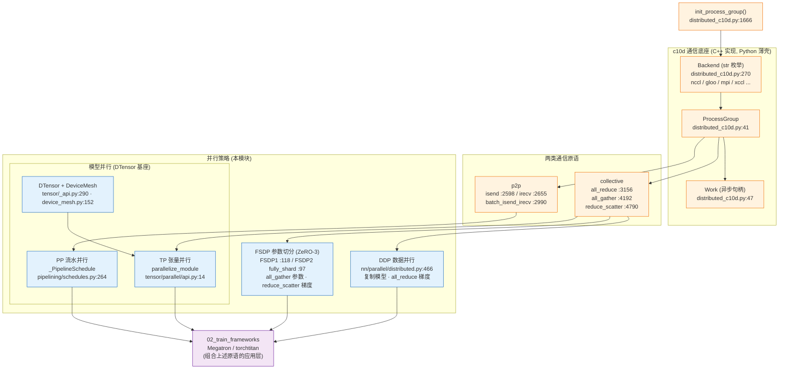

# 15 · torch.distributed 原生原语 — 目录索引

> 层次:overview(浅)
> 核验基准:PyTorch upstream `E:\97-codes\pytorch\pytorch`(v2.13.0a0, commit 9922478)
> 最后更新:2026-06-15

---

## 模块概述

单机训练里,模型、数据、梯度都在一张卡上,「谁和谁通信」根本不是问题。一旦跨越多卡、多机,所有问题都归结为一句话:**哪些张量需要在哪些进程之间、用什么集合操作、在什么时机同步,才能让一组进程算出和单卡等价的结果?** 这正是 `torch.distributed` 要回答的。

本模块讲的是 **PyTorch 原生的分布式原语**——从最底层的进程组与集合通信,到搭在其上的三类并行(数据并行 DDP、参数切分 FSDP、张量/流水并行 DTensor/TP/PP)。它**不**包含 Megatron-LM、torchtitan 这类训练框架的应用层封装,后者建立在本模块之上,见 [[02_train_frameworks/index]](本页只交叉链接、不重复其内容)。

### 边界:原语层 vs 框架层

```
┌─────────────────────────────────────────────┐
│  02_train_frameworks  Megatron / torchtitan  │  ← 应用层:调度策略、配方、并行组合
├─────────────────────────────────────────────┤
│  15_distributed_primitives (本模块)           │  ← 原语层:DDP / FSDP / DTensor / TP / PP
│       ↑ 都站在下面这层之上                      │
│  c10d:ProcessGroup + collective/p2p + Work    │  ← 通信底座(Python 薄壳 + C++ 实现)
└─────────────────────────────────────────────┘
```

一句话划界:**本模块 = PyTorch 仓库里 `torch/distributed/` 与 `torch/nn/parallel/` 内的原生能力**;凡是「把这些原语按某种配方拼起来训大模型」的工程,归 [[02_train_frameworks/index]]。

### 通信底座:c10d(ProcessGroup + Backend + Work)

最底层叫 **c10d**(c10 distributed)。它的 Python 入口几乎只是从 C 扩展导入符号——`ProcessGroup`(`torch/distributed/distributed_c10d.py:41`)、`Work`(`distributed_c10d.py:47`)的真正实现都在 C++(`torch/csrc/distributed/c10d/`),Python 侧只做参数封装与分派。三个核心概念:

- **`ProcessGroup`**:一组参与通信的进程(rank)的句柄。一次通信总是发生在某个 ProcessGroup 内;默认全局组由 `init_process_group`(`distributed_c10d.py:1666`)建立。
- **`Backend`**(`distributed_c10d.py:270`):`str` 子类的枚举,把 `"nccl"/"gloo"/"mpi"/"xccl"` 等后端名规范化;`register_backend`(`distributed_c10d.py:340`)让第三方设备(如 NPU)注册自定义后端,从而 `init_process_group(backend="hccl")` 对扩展开放。后端决定通信走哪套库:GPU 走 NCCL、CPU 走 Gloo。
- **`Work`**(`distributed_c10d.py:47`):异步通信的句柄。`async_op=True` 时集合操作立即返回 `Work`,由调用方择时 `.wait()`;这正是「通信与计算重叠」的硬件基础。

### 两类通信:collective vs p2p

c10d 把通信分两族:

| 族 | 含义 | 代表 API(`distributed_c10d.py`) |
|---|---|---|
| **collective**(集合) | 组内全员参与的规约/分发 | `all_reduce`(`:3156`)、`all_gather`(`:4192`)、`reduce_scatter`(`:4790`)、`broadcast`、`all_to_all`(`:5145`) |
| **p2p**(点对点) | 指定 src↔dst 两方收发 | `isend`(`:2598`)、`irecv`(`:2655`)、`batch_isend_irecv`(`:2990`,接受一组 `P2POp` `:563`) |

经验法则:**数据/张量并行靠 collective(all-reduce/all-gather/reduce-scatter),流水并行靠 p2p(相邻 stage 间 send/recv 激活与梯度)。**

### 三类并行:DDP / FSDP / DTensor·TP·PP

站在 c10d 之上,PyTorch 给出三条并行路线,对应「复制什么、切分什么」的不同取舍:

| 路线 | 入口(源码锚点) | 切什么 | 主要通信 | 显存特征 |
|---|---|---|---|---|
| **DDP**(数据并行) | `DistributedDataParallel`(`torch/nn/parallel/distributed.py:466`) | 不切参数,**复制整模型**;切数据 | 反向按桶 `all_reduce` 梯度 | 每卡一份完整参数/梯度/优化器态 |
| **FSDP**(参数切分,ZeRO-3 式) | FSDP1 `FullyShardedDataParallel`(`fsdp/fully_sharded_data_parallel.py:118`);FSDP2 `fully_shard`(`fsdp/_fully_shard/_fully_shard.py:97`) | **切参数/梯度/优化器态**到各 rank | 前/反向 `all_gather` 还原参数 + `reduce_scatter` 规约梯度 | 常态只存分片,峰值在临时全量 buffer |
| **DTensor / TP / PP**(模型并行) | `DTensor`(`tensor/_api.py:290`) + `DeviceMesh`(`device_mesh.py:152`);TP `parallelize_module`(`tensor/parallel/api.py:14`);PP `_PipelineSchedule`(`pipelining/schedules.py:264`) | 把**单个算子/层**或**模型阶段**切到多卡 | TP:层内 `all_reduce`/`all_gather`;PP:stage 间 p2p | 单层/单阶段只占一片 |

三者**正交、可叠加**:大模型训练常把它们组合成 N 维并行(如 FSDP × TP × PP),用 `DeviceMesh` 描述 rank 在各维的布局——这套组合配方正是 [[02_train_frameworks/index]] 的主场。

> DDP vs FSDP 的直觉:DDP 是「人手一份完整模型,各算各的数据,反向时对一遍答案(all-reduce 梯度)」;FSDP 是「模型太大谁也存不下,平时各拿一片,用到某层时临时把这层的全量拼出来(all-gather)、用完即扔」。前者省通信、费显存,后者省显存、费通信。

### 并行全景图



读图顺序:`init_process_group` 建组 → `Backend` 选定 NCCL/Gloo 并实例化 `ProcessGroup` → 在组内发起 collective 或 p2p(返回 `Work` 异步句柄)→ 上层三类并行各自编排这些通信 → 再上一层的 Megatron/torchtitan 把它们组合(归 [[02_train_frameworks/index]],本模块不展开)。

### functional collectives 与 torch.compile 的衔接

除了上述「就地」的传统集合 API,PyTorch 另有一套 **functional collectives**(`torch/distributed/_functional_collectives.py`):不原地改输入、返回新张量,实际下发到 `torch.ops._c10d_functional.*` 算子,返回值包成 `AsyncCollectiveTensor`(首次真正使用前自动 `wait`)。这让通信对 [[02_dynamo/index]] / [[04_inductor/index]] 可见、可被编译器做通信代数优化与计算重叠调度。这是 DTensor / TP 能与 `torch.compile` 协同的关键,细节见本模块 deepdive。

## 页面列表(按层次)

| 页面 | 层次 | 核心主题 |
|------|------|---------|
| [[distributed_primitives_quickstart]] | **quick start** | 怎么用、怎么查、怎么验证:`init_process_group`/`init_device_mesh` 起组;集合原语最小示例(`broadcast`/`all_reduce`/`all_gather`/`reduce_scatter`)与 `async_op` 重叠;DDP 包模型;FSDP2 `fully_shard`;DTensor 的 `Shard`/`Replicate`/`Partial` 与 `distribute_tensor`/`from_local`;TP 的 `parallelize_module` + `ColwiseParallel`/`RowwiseParallel`;`torchrun` 启动与常见排查 |
| [[c10d_ddp_fsdp_dtensor_analysis]] | deep dive | 源码级机制深析:Backend 注册表与 `register_backend`;collective/p2p → `Work` 的异步分派;DDP 的 C++ `Reducer` 分桶 + 反向 all-reduce 重叠;FSDP1 `FlatParameter` 的 shard/unshard/reshard 与显存核算;FSDP2 non-wrapper 设计;DTensor 的 placement 传播与通信插入;functional collectives + `AsyncCollectiveTensor`;`DeviceMesh` 层级与 `split_group`/`shrink_group`;TP `ParallelStyle` 契约;PP 调度族与 microbatching |

---

## 关联域

- [[01_theory/06_distributed_parallelism/index]] — **原理层对应**:同一套 DP/TP/SP/CP/EP/PP/ZeRO 的「为什么这么切 + α-β 通信代价 + 显存账本」引擎无关解读;本模块讲源码怎么实现,那里讲原理为什么如此
- [[02_train_frameworks/index]] — **直接上层**:Megatron / torchtitan 把本模块的 DDP/FSDP/TP/PP 组合成端到端训练配方;本模块只提供原语,不重复其应用层内容
- [[12_nn_module_system/index]] — DDP/FSDP 都包裹 `nn.Module`,在 Module 树上挂 autograd hook、改写参数为分片;理解参数/buffer 注册表是前提
- [[00_tensor_and_storage/index]] — DTensor 是 `torch.Tensor` 子类,分片即对底层 storage 的切片与 `resize_`;张量/存储语义是基座
- [[02_dynamo/index]] — functional collectives 让通信对 Dynamo 图捕获可见,从而进入编译流水
- [[04_inductor/index]] — 编译期对通信算子做调度/重叠优化(comm-compute overlap)的承接方
- [[01_ai_frameworks/index]] — 本域总索引

## Related Pages

- [[distributed_primitives_quickstart]] — 本模块 quick start:最小可用路径、关键 API 与可跑示例
- [[c10d_ddp_fsdp_dtensor_analysis]] — 本模块 deep dive:c10d/DDP/FSDP/DTensor 源码级机制深析
- [[02_train_frameworks/index]] — 建立在这些原语之上的训练框架(Megatron/torchtitan)
- [[12_nn_module_system/index]] — Module 树:DDP/FSDP 的包裹对象
- [[00_tensor_and_storage/index]] — 张量与存储:DTensor 分片的基座
- [[02_dynamo/index]] — 图捕获:functional collectives 的可编译入口
- [[04_inductor/index]] — 通信-计算重叠的编译期优化
