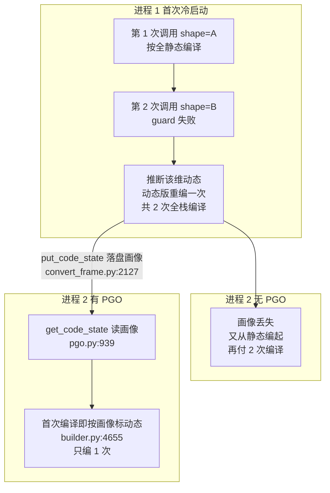
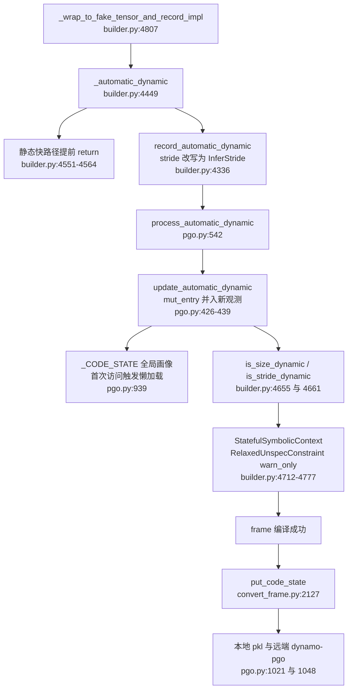

# Dynamo PGO 缓存 — 持久化的不是编译产物,而是「动态形状画像」,把 automatic dynamic 的第二次重编译从冷启动里抹掉

> **分析对象**:Dynamo 侧 profile-guided optimization 缓存(`torch/_dynamo/pgo.py`,全文 1093 行)——把「这个 frame 的哪些输入维度最终是动态的」聚合成画像(`CodeState`/`FrameStateSizeEntry`)并跨进程持久化,让新进程**第一次**编译就直接按动态编,省掉 automatic dynamic 「先静态、shape 变了再动态重编」的那次全栈重编译。
> **Source baseline**:PyTorch upstream 本地检出 `E:\97-codes\torch_parallel\pytorch` @ branch `main`, commit `3bda74318624581502db16e6439c36effdb16481`(2026-07-10, version 2.14.0a0)。所有 `file:line` 均对该 commit 逐一开文件核验。
> **最后更新**:2026-07-10

本页与本目录其它页面有一个本质区别:[[fx_graph_cache_analysis]]/[[aotautograd_cache_analysis]] 缓存的是**编译输出**(命中=跳过编译),PGO 缓存的是**编译决策的输入**(命中=第一次编译就编「对的版本」,编译本身一次也不少跑,但少跑一整轮)。也因此它的正确性模型完全不同:画像允许「soundly stale」——过期的画像不产生错误结果,只会让编译偏保守地多动态化(`torch/_dynamo/config.py:844-848`)。上游概念(automatic dynamic、guard、符号形状)见 [[dynamic_shapes_full_analysis]];总览见 [[compile_cache_overview]],目录索引 [[17_compile_cache/index]]。

---

## 一、总览

**一条主线**:automatic_dynamic 机制下(`torch/_dynamo/config.py:180-187`,默认开),一个 frame 第一次见到 `shape=A` 时**按全静态编译**;第二次见到 `shape=B` 时 guard 失败,才推断该维是动态的并**重编一个动态版本**。这意味着每个「实际上是动态」的 frame,冷启动都要付**两次**全栈编译(Dynamo 追踪 + AOTAutograd + Inductor)。PGO 的做法:把「第二次才学到的结论」——每个输入 source 的 scalar/size/stride 哪些位置见过多个不同值——用一个**有界半格(semilattice)上的 union** 聚合成画像,编译成功后 pickle 到磁盘/远端(`put_code_state`,`torch/_dynamo/convert_frame.py:2127`);下个进程首次编译时读回画像(`get_code_state`,`torch/_dynamo/pgo.py:939`),`VariableBuilder` 建 tensor/int 变量时直接按画像把对应维 mark 成 dynamic(`torch/_dynamo/variables/builder.py:4655`)——冷启动编译次数从 2 回到 1。

| 概念 | 说明 | 定位 |
|---|---|---|
| `FrameStateSizeEntry` | 单个输入 source 的画像:scalar/size/stride 三类观测 | `pgo.py:252-266` |
| `auto_unset` / `auto_dynamic` | 半格的恒等元(「一无所知」)/ 顶元(「确定动态」) | `pgo.py:228-249` |
| `__ior__`(`\|=`) | 画像合并:多次观测 union 成「静态值或 auto_dynamic」 | `pgo.py:394-423` |
| `InferStride` | stride 的间接表示,保住 stride 与 size 的关系再做 union | `pgo.py:204-222` |
| `CodeState` | 按 code object 组织:source name → entry | `pgo.py:191-195` |
| `CodeId` | code object 标识:文件内容 hash + 行号 + 函数名 + 闭包 hash | `pgo.py:142-188` |
| `_CODE_STATE` | 进程内唯一全局画像(取代旧 frame_state) | `pgo.py:64-70,199` |
| `process_automatic_dynamic` | 消费+生产合一的入口(读画像并合入新观测) | `pgo.py:542` |
| `put_code_state` | 落盘时机:每次**成功**的 frame 编译之后 | `convert_frame.py:2127` |
| `PGOCacheArtifact` | Mega-cache 挂钩(画像作为 artifact 打包/重放) | `pgo.py:765-794` |
| `job_id` | 没有它 PGO 完全不生效的 cache key 根 | `torch/compiler/config.py:48-76` |

两次冷启动对比(无 PGO vs 有 PGO):

**Quick Start(开关 / env / 从哪读起)**

- 本地 PGO:`torch._dynamo.config.automatic_dynamic_local_pgo`,**默认 `True`**(justknob + env force `TORCH_DYNAMO_AUTOMATIC_DYNAMIC_LOCAL_PGO`,`config.py:857-861`);远端 PGO:`automatic_dynamic_remote_pgo`,三态 env `TORCH_DYNAMO_AUTOMATIC_DYNAMIC_REMOTE_PGO`,OSS 默认关(`config.py:863-866`;判定链 `pgo.py:650-670`)。
- **必要条件**:`torch.compiler.config.job_id`(env `TORCH_COMPILE_JOB_ID`,别名 `TORCH_COMPILE_STICKY_PGO_KEY`,`torch/compiler/config.py:48-51`)。拿不到 job_id(OSS 下 MAST 探测恒返回 `None`,`torch/_utils_internal.py:266-267`)则 `get_cache_key()` 返回 `None`,PGO 即使开着也不读不写(`pgo.py:947-949,983-986`)。`torch.compiler.config.force_disable_caches` 一键关(`pgo.py:604-608`)。
- 本地文件:`<cache_dir>/dynamo/code_state_<job_id>:<rank>:<tag>.pkl`(`code_state_path`,`pgo.py:639-647`)。
- 从哪读起:文件头的两大段设计注释——内存模型 `pgo.py:64-70`、cache key 设计问答 `pgo.py:73-112`;然后 `update_automatic_dynamic`(`pgo.py:426`)与 `_automatic_dynamic`(`builder.py:4449`)。
- 观察:tlparse artifact `get_local_code_state` / `put_local_code_state`(`pgo.py:804-808,1041-1045`);画像的人类可读渲染 `render_code_state`(`pgo.py:745-762`),里面还会直接打印一条可操作建议:把已检出的动态 source 设进 `TORCH_COMPILE_DYNAMIC_SOURCES`(`pgo.py:756-761`)。

---

## 二、画像的数据结构:一个有界半格上的状态机

### 2.1 三类观测与两个哨兵

`FrameStateSizeEntry`(`pgo.py:252-266`)对每个输入 source 记三类画像:`scalar`(裸 int/float 输入)、`size` 与 `stride`(tensor 输入,逐维)。每个位置的取值构成一个**有界半格**:

- `auto_unset`(`pgo.py:228-237`):恒等元,「还没见过任何观测」,合并时总是让位;
- 具体 int:「至今只见过这一个值」;
- `auto_dynamic`(`pgo.py:240-249`):顶元,「见过不止一个值,确定动态」,与任何元素合并仍是它自己。

### 2.2 `|=` 合并:union 的单调语义

合并的原子规则 `_merge_atom`(`pgo.py:368-376`):`unset` 让位;两个具体值相同则保留;**不同、或任一方已是 `auto_dynamic`,结果就是 `auto_dynamic`**。元组版 `_merge_atom_tup`(`pgo.py:378-392`)额外规定:**维数(rank)不同直接整体 `auto_dynamic`**(`pgo.py:390-391`)。`__ior__`(`pgo.py:394-423`)把三类字段分别做这个 union。

这个半格结构决定了 PGO 的两条根本性质(源码结构直接蕴含,非注释明述):**单调**——画像只会「变得更动态」,永不回退到静态;**有上界**——最坏退化为 `auto_dynamic`(完全动态),不会发散。这正是「soundly stale」的代数基础:画像错了顶多让编译更动态,配合 `RelaxedUnspecConstraint(warn_only=True)`(见 §三)不会产生错误结果。唯一的例外:`automatic_dynamic_shapes=False` 时不做 union 而是**直接覆盖**(`pgo.py:528-537`)——关掉 automatic dynamic 就没有「聚合观测」的意义了。

> **为什么 stride 需要 `InferStride` 间接层(被否掉的替代:直接存裸 stride 值)**:`InferStride(dim)` 表示「`stride[dim] * size[dim]`,即紧凑布局下下一个物理维的 stride」(`pgo.py:204-222` docstring)。若直接对裸值 union,`[2,3][3,1]` 与 `[2,4][4,1]` 会合并成 `[2,?][?,1]`,符号化后变成 `[2,s0][s1,1]`——**s0 与 s1 的乘法关系被打断**;改写成 `[2,3][InferStride(1),1]` 与 `[2,4][InferStride(1),1]`,union 得 `[2,?][InferStride(1),1]`,符号化成 `[2,s0][s0,1]`,关系保住(`pgo.py:213-219`)。生产侧在 `record_automatic_dynamic` 里用与 `_create_symbolic_sizes_strides_storage_offset` 相同的推断算法把裸 stride 先改写成 `InferStride`(`builder.py:4336-4357`)。

另有一条刻意保守的规则:**只有 size 各维全是具体静态 int 时,才允许判 stride 动态**(`is_stride_dynamic`,`pgo.py:316-340`;注释自述动态 stride 「a bit buggy」,并举了物理转置例子说明按 stride 判动态本身可能是错的问题建模——「we really should have just guarded on dim order」`pgo.py:327-331`)。

### 2.3 exclusion 字段:让旧输入继续命中旧的静态 entry

`excluded_sizes`/`excluded_scalar`(`pgo.py:263-266`,`compare=False` 不参与画像等值比较)记录「从静态跃迁到动态的那一刻,跃迁前的静态值」(`__ior__` 里维护,`pgo.py:395-420`)。消费端把它塞进 `StatefulSymbolicContext.excluded_sizes`(`builder.py:4777`)/`create_unspecified_symint_and_symbol(excluded_value=...)`(`builder.py:3320-3331`),最终在 ShapeEnv 产 guard 时生成「排除旧静态值」的 exclusion guard(`torch/fx/experimental/symbolic_shapes.py:6850-6877`):新的动态 entry 主动**拒绝**恰好等于旧静态值的输入,让它们落回更特化的旧静态 entry。开关 `automatic_dynamic_exclusion_guard` **默认 `False`**,且与 compiler collectives 互斥(`config.py:192-210`;`symbolic_shapes.py:6850-6853`),2026-03-20 引入(见 §七)。

### 2.4 `CodeState` 与 `CodeId`:画像跟什么绑定

`CodeState` 就是一个 `source name → FrameStateSizeEntry` 的 defaultdict(`pgo.py:191-195`);全局画像 `_CODE_STATE` 按 `CodeId` 组织(`pgo.py:199`),并且模块头注释明确:这里持有**唯一**的全局状态,旧的 per-code-object `frame_state` 已被彻底retire,信息从不 GC(`pgo.py:64-70`)。

`CodeId`(`pgo.py:142-188`)由四元组标识一段代码:**`file_hash`(整个源文件内容的 CRC32,`_hash_containing_file`,`pgo.py:116-125`)+ `co_firstlineno` + `co_name` + `closure_hash`(闭包 cell 里可调用对象的 `__code__` hash,`pgo.py:128-139,174-188`)**。`__eq__`/`__hash__` **刻意排除 `filename`**(`pgo.py:157-169`):job 重启后代码可能被拷到不同路径,路径不该导致画像失效,`filename` 仅作为可读指针保留(`pgo.py:147-152` 注释)。`closure_hash` 针对 factory function 场景——同一工厂在不同闭包下造出的函数行号/名字全同,不加闭包 hash 会串画像(2026-03-03,#173512,见 §七)。

> **对代码变更的敏感性(约束)**:`file_hash` 是**整文件** CRC32,文件里任何一处改动(哪怕与该函数无关)都会换 hash → 该文件全部函数的画像 miss;函数上方增删空行改变 `co_firstlineno` 同样 miss。config 注释直说:画像只在「用户源码 100% 不变」时保证有效,代码变更后应用画像只是 best effort,「adding/removing newlines will typically cause cache misses」(`config.py:850-854`)。没有 per-function 源码 hash——`file_hash` 解决的只是「同内容不同路径」问题(#152628),不是细粒度失效检测(推断:细化到函数级 hash 成本/复杂度不划算,且画像 stale 本就无害)。

---

## 三、生产与消费:一条调用链上的读写合一

PGO 没有分离的「查缓存」与「填缓存」阶段:`process_automatic_dynamic` 在**每次建输入变量时**既读画像(决定动态性)又写画像(把本次观测 union 进去);磁盘 IO 只发生在进程首次访问(懒加载)与每次编译成功后(落盘)。

**消费(tensor 路径)**,每跳 file:line:

1. `wrap_to_fake_tensor_and_record`(`builder.py:4782`)→ `_wrap_to_fake_tensor_and_record_impl`(`:4807`)对每个 tensor 输入调 `_automatic_dynamic`(`:4830` → 定义 `:4449`)。
2. 静态快路径:必须静态(如 `force_parameter_static_shapes` 下的参数)且不在 dynamic-source 白名单的 tensor,在**记录画像之前**直接返回全 STATIC context(`builder.py:4551-4564`)——注释明确这是为了不让被强制静态的形状「污染」画像,否则 PGO 会把参数维「学」成动态(`:4546-4550`)。
3. `record_automatic_dynamic`(`builder.py:4336`)把本次观测造成 `FrameStateSizeEntry.make_tensor(size, stride)`(stride 先经 InferStride 改写,`:4339-4357`),调 `process_automatic_dynamic`(`:4359`)。
4. `update_automatic_dynamic`(`pgo.py:426`):`CodeId.make(tx.f_code, tx.closure)` 定位画像桶(`:433`),`get_code_state()[code_id]`(`:434`,首次触发磁盘/远端懒加载),`mut_entry |= entry` 完成 union(`:439`),返回合并后的 entry。
5. 回到 builder:`frame_state_entry.is_size_dynamic(i)` / `is_stride_dynamic(i)` 决定 `automatic_dynamic_size/stride`(`builder.py:4654-4662`;dynamic-sources/values 白名单可再覆盖,`:4664-4679`),据此给该维发 `RelaxedUnspecConstraint(warn_only=True)`(`:4712-4717`)并把 `dynamic_size` 设为 `get_automatic_dynamic_shapes_mark_as()`(`:4742-4743`,默认 `DimDynamic.DYNAMIC`,`config.py:190`),最后连同 `excluded_sizes` 一起装进 `StatefulSymbolicContext`(`:4765-4778`)。

**消费(scalar 路径)**:`wrap_symint` 对非常量 int 输入调 `process_automatic_dynamic(FrameStateSizeEntry.make_scalar(value))`(`builder.py:3281-3286`),`scalar is auto_dynamic` 则按动态 wrap(`:3296-3301`),否则仍特化为常量 + `CONSTANT_MATCH`(`:3315-3318`);nn.Module 上被特化的 int 也会**只记录不消费**地打点画像,为未来重编积累观测(`builder.py:2771-2776`);`wrap_symfloat` 同型(`:3392-3398`)。

**生产(落盘)**:唯一调用点在 `_compile` 的成功分支——`put_code_state()`(`convert_frame.py:2127`)。**不是 atexit、不是进程退出钩子**(全库 grep `put_code_state` 仅此一处调用);注释解释了边界:只在成功时写,「成功」包括产生了部分图的 graph break(为 graph break 上传画像能避免后续 break 重编),而完全编不过的 frame 不写——反正下次还会以同样方式失败,画像帮不上(`convert_frame.py:2118-2126`)。写之前有两道免写优化:`_CODE_STATE` 与加载时深拷贝的 `_INIT_CODE_STATE` 快照(`pgo.py:810`)相等则跳过(`:979-981`);无 cache key 跳过(`:983-986`)。
**读取(懒加载)**:`get_code_state`(`pgo.py:939-971`)首次调用时按 local(`:952`)→ remote(`:956`)→ sticky extra read(`:959-965`)顺序尝试,全 miss 就用空 defaultdict 起步。`torch._dynamo.reset()` 会经 `reset_code_state` 清掉内存画像(`torch/_dynamo/__init__.py:156,200`;`pgo.py:1089-1093`,注释明确**不清磁盘**)。

---

## 四、cache key 与本地/远端/sticky 三路存储

### 4.1 key:`job_id : rank : tag`

`format_cache_key` 拼出 `f"{key}:{rank}:{tag}"`(`pgo.py:591-599`;rank 取 `dist.get_rank()`,tag 是通用破缓存开关 `torch.compiler.config.cache_key_tag`,`compiler/config.py:92`)。`get_cache_key`(`pgo.py:602-625`)的 key 来源:用户显式 `job_id`(`mast:` 前缀保留给系统,用户使用直接抛 `ReservedWorkflowIdUserError`,`:613-618`)> MAST job name:version(fbcode 自动探测;OSS stub 返回 `None`,`torch/_utils_internal.py:266-267`)> `None`(PGO 整体 no-op)。

> **为什么强制要求 job_id(文件头设计问答,`pgo.py:73-88`)**:不带 job_id 的全局共享缓存会让「不相关的 PyTorch 调用不可预测地改变彼此行为」;要求 job_id 至少让用户知道有一份关联「状态」存在。想要「YOLO 全共享」也可以——给所有调用传同一个 job_id 即可(`:86-88`)。
>
> **为什么不跨 rank 共享(被否掉的替代,`pgo.py:89-112`)**:注释推演了共享方案——各 rank 原子写 CAS-store、读侧 on-the-fly merge、或选举一个 rank 事后 bundling——然后指出 compiler collectives 已经填了同一个位置(编译期各 rank 互通画像,rank 0 天然聚齐全部信息)。于是分工定案:**compiler collectives 负责 run 内跨 rank 共享,PGO 缓存负责单 rank 跨 attempt 持久化**,「No need to have one mechanism to do everything」(`:107-112`)。per-rank key 还顺带消灭了写竞争,本地写只需防同机自竞争的 FileLock + `os.replace` 原子替换(`write_local_impl`,`pgo.py:996-1018`)。

### 4.2 local / remote

- **local**:`<cache_dir>/dynamo/code_state_<cache_key>.pkl`(`code_state_path`,`pgo.py:639-647`;正则把 `<>:"/\|?*` 换成 `_`,是 Windows 路径修复,#147708)。读 `get_local_code_state`(`:814-838`),整包 `pickle.loads`;写 `put_local_code_state`(`:1021-1045`),整包 `pickle.dumps`——没有按 CodeId 的增量 IO,文件头注释自己留了话头:「maybe worry about O(n^2) IO if we updated every compile--let's just instrument this」(`:92-93`)。
- **remote**:`should_use_remote_dynamo_pgo_cache`(`pgo.py:650-670`)——OSS 下除非显式 env 打开否则 `False`;fbcode 走 justknob 版本比对。`get_remote_cache` 用与 Inductor 远端缓存同一套设施 `create_cache("dynamo-pgo", is_fbcode(), "FbRemoteDynamoPGOCache", "RemoteDynamoPGOCache")`(`:673-684`,cache id 字符串即 `"dynamo-pgo"`;RemoteCache 基础设施细节属 [[triton_autotune_cache_analysis]])。payload 是 base64 进 JSON 的同一份 pickle(`:1073-1076`)。远端读写耗时被单列进 dynamo_compile 遥测列 `pgo_get/put_remote_code_state_time_us`(`:891,1057`)。

### 4.3 sticky key:跨 job 复用画像

两层机制,都已核验 env 名:

- **`TORCH_COMPILE_STICKY_PGO_KEY`** 是 `job_id` 的 env 别名(`compiler/config.py:48-51`,#154418 引入):同一模型的不同 job 设同一个 sticky key,即共享同一份画像(读+写同 key)。
- **extra read/write key**(#160715):`pgo_extra_read_key`/`pgo_extra_write_key`(env `TORCH_COMPILE_STICKY_PGO_READ`/`TORCH_COMPILE_STICKY_PGO_WRITE`,`compiler/config.py:78-89`)。写:`put_code_state` 在默认 local+remote 之外**额外**写一份到 extra key(`pgo.py:990-993`);读:**仅当** local 与默认 remote 都 miss 时才去读 extra key(`get_code_state`,`:959-965`),且 `get_extra_remote_code_state` assert 当前画像为空后整体替换(`:925-930`)——docstring 说「merges」(`:903`),但当前实现是「默认画像存在则忽略 extra」(#163810 的行为:warm/cold cache 在场就跳过 sticky 读),**源码行为与 docstring 措辞有出入**,以行为为准。

### 4.4 Mega-cache 挂钩:`PGOCacheArtifact`

画像是 Mega-cache(`torch.compiler.save/load_cache_artifacts`)打包的 artifact 类型之一,type 字符串 `"pgo"`(`pgo.py:779-780`):本地/远端每次读到或写出画像 bytes 时都会 `CacheArtifactRecorder(PGOCacheArtifact.type(), cache_key).record(...)` 登记(读侧 `:834,876`,写侧 `:1031`);异地 `load_cache_artifacts` 反序列化后 `populate_cache` 把 bytes 直接写回本地画像文件(`:768-775`)。特殊处理:MAST 自动生成的 `mast:name:version` key 在新 job 上重放时会被 `_rewrite_cache_key_for_mega_cache` 替换成**新 job** 的 key(`:783-794`)——否则画像会写到旧 job 名下永远读不到。注册面:`CacheInfo.pgo_artifacts`(`torch/compiler/_cache.py:133`)、fresh 进程反序列化前的强制 import(`_cache.py:335`)。机制全貌属 [[megacache_and_precompile_analysis]]。

---

## 五、多 rank:compiler collectives 负责空间,PGO 负责时间

`process_automatic_dynamic`(`pgo.py:542-588`)是 PGO 与 compiler collectives 的交汇点,三分支:

1. **非分布式**(`tx.distributed_state is None`):直接 `update_automatic_dynamic`(`:549-555`)。
2. **preflight**(`st.all_states is None`,即 collective 尚未跑):**假装全静态**,只把观测记到 `st.local_state`,不动全局画像(`:556-571`)——注释解释:preflight 要快,静态跑得快,反正 collective 之后会重启分析、把既有画像重新应用。
3. **collective 之后**:遍历 `all_states`(含本 rank)逐个 union 进画像(`:572-588`)——即**跨 rank 观测的 union**,任何 rank 见过的 shape 抖动都会让所有 rank 把该维标成动态。

collective 本体在 `OutputGraph.run_compiler_collective`(`torch/_dynamo/output_graph.py:2669-2706`):`dist.all_gather_object` 收齐各 rank 的 `LocalState` 后抛 `CompileCollectiveRestartAnalysis` 重启追踪;`distributed_state` 只在 `enable_compiler_collectives`(env `TORCH_COMPILER_COLLECTIVES`,默认关,`config.py:829`)且有 compile 进程组时创建(`convert_frame.py:1970-1973`),编译结束前有断言保证 collective 确实跑过(`:1790-1793`)。`job_id` 的 docstring 把这个分工说给了用户:画像永远 per-rank 收集,SPMD 负载想要各 rank 画像一致就开 compiler collectives(`compiler/config.py:72-75`)。

---

## 六、约束与风险清单

| 约束/风险 | 机制 | 出处 |
|---|---|---|
| 无 job_id 则整体 no-op | `get_cache_key()` 返回 `None`,读写全跳过 | `pgo.py:947-949,983-986`;`compiler/config.py:67-68` |
| 画像跟代码绑定,粗粒度失效 | `CodeId` = 整文件 CRC32 + 行号 + 函数名 + 闭包 hash;**没有**函数级源码 hash;增删空行即 miss | `pgo.py:116-125,142-188`;`config.py:850-854` |
| 画像只会更动态,不回退 | union 半格单调,顶元 `auto_dynamic` 封顶;过度动态化「soundly stale」,但可能 tickle 编译器 latent bug 反而编失败 | `pgo.py:368-392`;`config.py:844-848` |
| 过度动态化的缓解(默认关) | exclusion guard 让旧静态输入落回旧 entry;与 compiler collectives 互斥 | `config.py:192-210`;`symbolic_shapes.py:6850-6853` |
| 只在编译成功后落盘 | 完全编不过的 frame 不写(graph break 部分成功仍写) | `convert_frame.py:2118-2127` |
| 全量 pickle 写,无增量 | 每次成功编译整包 dumps;仅「画像无变化」时跳过;O(n²) IO 风险作者自知,先靠遥测观察 | `pgo.py:979-981,1029;91-93` |
| 强制静态的 tensor 不入画像 | 静态快路径先于 `record_automatic_dynamic` 返回,防画像污染 | `builder.py:4544-4564` |
| `torch._dynamo.reset()` 只清内存 | 磁盘画像保留,下次仍会加载 | `pgo.py:1088-1093`;`__init__.py:156` |
| stride 动态判定极保守 | 仅 size 全静态时允许;动态 stride 自述「a bit buggy」 | `pgo.py:316-340` |
| 陈旧注释(源码内部不一致) | `config.py:838` 说 PGO 依赖 `torch.compiler.config.workflow_id`——该配置**不存在**,实际生效的是 `job_id` | `config.py:836-839` vs `compiler/config.py:48` |
| 画像的「毕业」出口 | `render_code_state` 建议把检出的动态 source 固化进 `TORCH_COMPILE_DYNAMIC_SOURCES`(显式白名单,不再依赖画像) | `pgo.py:753-762`;`compiler/config.py:123-125` |

---

## 七、进展时间线与收益

**关键节点**(`git log --format='%cs %h %s' -- torch/_dynamo/pgo.py` 核验,日期=commit date):

| 日期 | commit | 事件 |
|---|---|---|
| 2024-10-27 | `14a45d77931` | pgo.py 引入:「Refactor core algorithm for automatic dynamic shapes」(#138717),frame_state 算法半格化并抽成独立模块 |
| 2024-10-27 | `c480a479b13` | 画像改按 `CodeId` 组织,脱离 code object 存活期(#138740) |
| 2024-11-01→03 | `a6630bcf873`/`585dbfa583b` | PGO 本体「Profile guided optimization for automatic_dynamic」(#139001,两次 revert 后落地):local/remote 持久化 + job_id key |
| 2025-01-07 | `9ee242213b7` | Mega-cache RFC(#143341),`PGOCacheArtifact` 挂钩 |
| 2025-05-02 | `f65fb0a23d1` | `CodeId.file_hash`:按文件内容 hash,路径搬迁不失效(#152628) |
| 2025-05-27 | `2560c1f3f00` | sticky PGO key:`TORCH_COMPILE_STICKY_PGO_KEY` 作为 job_id 别名(#154418) |
| 2025-08-18 | `075a2e69678` | extra read/write key(#160715),后续 #163799/#163810 细化 sticky 读写语义 |
| 2025-09-05 | `5da573c42c3` | PGO profile merge 处理(#162097) |
| 2026-03-03 | `fabd1c48981` | `CodeId.closure_hash`:factory function 不再串画像(#173512) |
| 2026-03-20 | `7eabe3bdc42` | exclusion guard:静→动跃迁记录排除值,旧输入回落旧 entry(#174993) |

**收益结论**:命中(读到有效画像)省掉的是**一整次全栈重编译**——Dynamo 重追踪 + AOTAutograd 重切分 + Inductor 重 lowering/codegen,而不是栈内某一段。源码的量化陈述在 `job_id` docstring:「the first time you run your program we may compile twice as we discover what inputs are dynamic, and then PGO will save this state so subsequent invocations only need to compile once」(`compiler/config.py:60-64`)——对每个最终动态的 frame,冷启动编译次数 2→1。PGO 自身开销(远端读写耗时、画像字节数)被显式计量进 `pt2_compile_events`/`dynamo_compile`(`pgo.py:828,891,1039,1057,1072`)。

> **推断(非源码明述)**:实际节省与「动态 frame 数 × 单次编译成本」成正比,且与产物缓存正交:PGO 让第一次就编出动态版本,这个动态版本的 key 又更容易被 [[fx_graph_cache_analysis]]/[[aotautograd_cache_analysis]] 跨进程命中(symbolic key + guard,天然覆盖多 shape),两者叠加才是完整的 warm-start 故事;Mega-cache 正是把 PGO 画像与这些产物缓存一起打包搬运(§4.4)。

---

## Related / Cross-references

- [[compile_cache_overview]] — 编译缓存总览(本页是其中唯一「缓存决策而非产物」的一级)
- [[dynamic_shapes_full_analysis]] — automatic dynamic / guard / DimDynamic / ShapeEnv(本页画像的消费下游)
- [[fx_graph_cache_analysis]] — Inductor 图级产物缓存(与 PGO 正交叠加)
- [[aotautograd_cache_analysis]] — AOT 级产物缓存
- [[triton_autotune_cache_analysis]] — `create_cache`/RemoteCache 远端设施(§4.2 复用)
- [[megacache_and_precompile_analysis]] — Mega-cache 打包/重放(`PGOCacheArtifact` 挂钩)
- [[17_compile_cache/index]] — 本目录索引
- [[torch_compile_architecture]] — torch.compile 整体栈
- [[PyTorch_Dynamo_Technical_Analysis]] — Dynamo 追踪机制(`VariableBuilder`/guard 的宿主)
- [[dynamo_quickstart]] — Dynamo 入门
