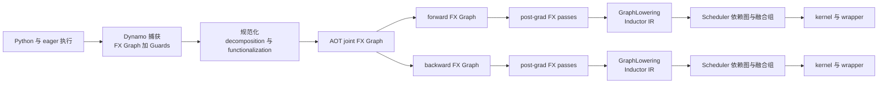

# 00 · PyTorch 图编译器基础：从 FX 到 Kernel

> 层次：系统学习主线 · 上游 PyTorch 通用机制
> 当前实现基线：PyTorch `e8f97c1a6ef8cbcdd0a946606bc1e924e4f07e52`，2026-07-23
> Lab 环境：PyTorch `2.9.1+cpu`，git `5811a8d7da873dd699ff6687092c225caffcf1bb`
> 最后更新：2026-07-28

> [!warning] 验收边界
> 本系列由 `00` 总览和 `01–21` 正文组成；发布门禁逐条覆盖正文段落、表格数据行和非空
> 代码块，并区分 pinned source、当前 CPU 实测、显式推断、codegen-only 与环境阻塞。
> 当前主机没有可用的 MSVC `cl`、CUDA 或 Triton，因此原生 C++ kernel 的真实
> compile/execute、GPU 性能和 autotune 仍是 `[B]`，不得从已生成源码或 CPU 内部结构
> 观察外推。权威范围只覆盖最终 claim ledger 已闭环的 `[S]/[R]/[I]/[M]` 结论。

## 在 `torch.compile` 端到端课程中的位置

本系列现作为 [[19_torch_compile_end_to_end/00_torch_compile_end_to_end_index]] 的**卷 C**，
正文和 Labs 已与 A/B/D/E/F 实体归并到同一课程目录。文件内部沿用成熟的 `01–21`
编号，端到端总索引显示为 `C01–C21`：

```text
卷 A：Tensor、Dispatcher、Frame、Fake/Proxy 前置
→ 卷 B：torch.compile API 与 Dynamo frame 捕获
→ 卷 C（本系列）：FX、AOTAutograd、pass、Inductor IR、Scheduler、kernel
→ 卷 D：编译产物、缓存、装载与 replay runtime
→ 卷 E：调试、正确性、性能与生产方法
→ 卷 F：训练、分布式、扩展与部署
```

从卷 B进入本系列时，先读 `01–07`，把 Dynamo的 transformed bytecode/guards与“交给
backend的FX region”分开；随后读 `08–16`理解正反向构图和安全改图；`17–21`只覆盖
FX之后的后端IR到kernel，不覆盖产物cache/load/runtime生命周期，那部分继续读卷 D。

这个系列回答的不是“FX 有哪些 API”，而是一个更完整的问题：

> 一段 Python/PyTorch 计算为什么会经历多种图；每张图保存什么事实；正反向如何构造；
> pass 如何安全改图；最终又如何变成 Inductor IR、Scheduler 依赖图和 kernel？

旧资料常把 eager autograd tape、FX、AOT joint/fw/bw、Inductor IR、Scheduler graph 和
CUDA Graph 都叫“图”。它们的节点、边、值、顺序和生命周期并不相同。这里先建立统一
分类，再按捕获、正反向构造、改图、后端四段逐层深入。

## 一张总图



图中 fw 与 bw 是两张独立 FX 图。二者之间没有跨 `Graph` 的 `Node` 边；save/recompute
关系通过 partition 时的节点复制、forward 输出、backward placeholder 和运行时 ABI
表达。Inductor 也不会保持 FX Node 身份：lowering 可一对多、延迟物化，fusion 又可多对一。

## 四部分知识地图

### Part I：概念与语义基础

| 编号 | 页面 | 先解决的问题 |
|---:|---|---|
| 01 | [[01_graph_ir_motivation_and_taxonomy]] | 为什么需要图；不同“图”到底差在哪里 |
| 02 | [[fx_graph_core_data_model_analysis]] | FX 如何同时保存程序顺序与 use-def |
| 03 | [[graph_values_metadata_and_signatures_analysis]] | 边上传递什么；签名如何对应用户程序 |
| 04 | [[symbolic_shapes_guards_and_graph_reuse_analysis]] | 一张图为何只对某些输入成立 |
| 05 | [[graph_effects_alias_mutation_and_order_analysis]] | 没有数据边为何也可能不能换序或删除 |
| 06 | [[structured_outputs_higher_order_and_nested_graphs_analysis]] | 多输出、控制流与嵌套图如何扩展普通 DAG |

### Part II：捕获、规范化与正反向构造

| 编号 | 页面 | 先解决的问题 |
|---:|---|---|
| 07 | [[graph_capture_frontends_and_tracing_analysis]] | symbolic_trace、make_fx、Dynamo、export 为何产生不同图 |
| 08 | [[graph_normalization_decomposition_and_functionalization_analysis]] | 捕获后为何还要规范化 |
| 09 | [[aotautograd_joint_forward_backward_graphs_analysis]] | joint 如何切成独立 fw 与 bw |
| 10 | [[saved_tensors_recompute_and_runtime_abi_analysis]] | 正反向之间保存、重算和传递什么 |
| 11 | [[graph_stage_boundaries_identity_and_provenance_analysis]] | 节点身份改变后如何跨阶段追踪 |

### Part III：安全改图、匹配、清理与验证

| 编号 | 页面 | 先解决的问题 |
|---:|---|---|
| 12 | [[fx_graph_editing_primitives_and_invariants_analysis]] | 一次最小改图必须同步哪些结构 |
| 13 | [[pattern_expression_and_matcher_engine_analysis]] | PatternExpr 如何描述可捕获 DAG 共享的子图 |
| 14 | [[dead_code_topology_and_effect_order_analysis]] | 节点何时真的 dead，拓扑正确为何仍可能错 |
| 15 | [[graph_pass_pipeline_ordering_and_fixpoint_analysis]] | pass 为什么必须处于正确阶段和顺序 |
| 16 | [[graph_rewrite_legality_validation_and_complexity_analysis]] | 结构命中后如何证明改写合法、正确且值得 |

### Part IV：从 FX 到 Inductor IR、Scheduler 和 Kernel

| 编号 | 页面 | 先解决的问题 |
|---:|---|---|
| 17 | [[fx_lowering_to_inductor_ir_analysis]] | 为什么 FX 与代码生成之间还需要一层 IR |
| 18 | [[18_inductor_ir_values_loops_layouts_and_buffers]] | loop、寻址、layout 与 storage 如何表达 |
| 19 | [[19_buffer_liveness_memory_planning_and_reuse]] | Buffer 何时物化、何时释放、如何复用 |
| 20 | [[20_scheduler_dependency_graph_fusion_and_ordering]] | Scheduler 边为何不同于 FX users |
| 21 | [[21_codegen_kernel_mapping_autotuning_and_provenance]] | fusion group 如何成为 kernel 并映射回源码 |

## 每篇前置依赖与学习成果

| 篇 | 最小前置 | 读完应能独立完成 |
|---:|---|---|
| 01 | Python/PyTorch eager | 区分 program graph、dataflow projection、autograd tape、Scheduler graph 与 CUDA Graph |
| 02 | 01 | 从链表顺序、`args/kwargs`、`users`和 ownership 解释一张 FX 图 |
| 03 | 02 | 区分 runtime value、Node reference、meta 与 graph signature |
| 04 | 02–03 | 解释 specialization、symbol、guard、range constraint 与重编译 |
| 05 | 02–04 | 判断 data edge 之外的 alias、mutation 与 effect 顺序约束 |
| 06 | 02–05 | 阅读 pytree、多输出、HOP 与 nested GraphModule |
| 07 | 01–06 | 为程序选择 symbolic FX、make_fx、Dynamo 或 export |
| 08 | 05、07 | 区分 decomposition、functionalization、canonicalization 与 mutation tail |
| 09 | 03、08 | 解释 joint 如何复制成无跨图 Node 边的 fw/bw |
| 10 | 09 | 从 fw output/bw placeholder ABI 判断 save 与 recompute |
| 11 | 07–10 | 跨 stage 用语义/provenance 追踪，而不依赖 Node identity |
| 12 | 02、08、11 | 使用 FX API 完成事务式插入、替换、擦除与 recompile |
| 13 | 12 | 阅读 PatternExpr AST、capture ABI、候选索引与 replacement |
| 14 | 05、12–13 | 区分 dead、拓扑合法和 effect 保序 |
| 15 | 08、12–14 | 选择 pass stage、顺序和重复策略 |
| 16 | 04–05、12–15 | 为 rewrite 建立 shape/grad/alias/mutation/原子性测试矩阵 |
| 17 | 08、11、16 | 从 FX lowering 定位 TensorBox、IR value、fallback/extern |
| 18 | 17 | 阅读 loop domain、index、layout、view 与 buffer |
| 19 | 10、18 | 区分 logical liveness、静态 peak、wrapper reuse 与 allocator peak |
| 20 | 18–19 | 从 reads/writes 构造 Scheduler 依赖并解释 fusion/reorder |
| 21 | 11、17–20 | 沿 wrapper/kernel provenance 反查 post-grad FX 与用户源码 |

## 三条阅读路径

### 建立完整心智模型

按 01 → 21 顺序阅读。每篇开头只依赖前文已经定义的术语。

### 开发 FX/Inductor pass

01 → 02 → 03 → 05 → 08 → 11 → 12 → 13 → 14 → 15 → 16。

### 理解后端与性能

01 → 02 → 04 → 05 → 09 → 10 → 11 → 17 → 18 → 19 → 20 → 21。

## 如何阅读本系列的源码部分

源码解读不按“类名百科”组织，而按一次状态变化的调用链阅读。每遇到一个机制，依次回答：

1. **入口是谁调用的？** 先找到 driver，而不是从某个抽象基类孤立开始；
2. **读取哪套状态？** 例如 FX `args/users`、Interpreter `env`、IR `read_writes`；
3. **写回哪套状态？** 是原图就地修改、fresh graph、lazy IR，还是 Scheduler users；
4. **不变量在哪检查？** 找 `lint`、assert、legality check、guard 或 runtime ABI；
5. **后续谁消费结果？** 由 consumer 反推当前数据结构为何必须这样设计；
6. **对象 identity 是否保留？** 跨 capture、partition、lowering、fusion 时默认不保留，除非
   源码明确证明。

主线源码入口如下。表中的“输出状态”是该入口真正产生或更新的对象，不代表整个阶段只
调用这一处代码：

| 阶段 | 建议先读的入口 | 重点跟踪的状态变化 | 对应正文 |
|---|---|---|---|
| FX 构图 | `Tracer.trace()`、`create_proxy()`、`Graph.create_node()` | Python 拦截 → Proxy → Node；链表、`args/users`、ownership 同步 | 02、07 |
| FX 改图 | `Node._update_args_kwargs()`、`replace_all_uses_with()`、`Graph.erase_node()` | consumer 引用与 producer users 的双向维护 | 02、12 |
| AOT joint | `create_joint()`与 `aot_dispatch_autograd_graph()` | primals/tangents → joint outputs；autograd engine 被 trace 成 FX | 09 |
| partition | `default_partition()`、`min_cut_rematerialization_partition()` | joint Node → fresh fw/bw Node；saved/recomputed ABI | 09、10 |
| pattern | `PatternExpr.match()`、`CallFunction._match()`、`PatternMatcherPass.apply()` | pattern AST → MatchContext captures → handler → FX rewrite | 13、16 |
| 图清理 | `Graph.eliminate_dead_code()`、stable topo、Scheduler DCE | purity/users、程序序、effect/order 分层处理 | 14、15 |
| lowering | `GraphLowering.run_node()`、`call_function()`、`register_lowering()` | `env[fx_node]` → lazy IR；必要时 fallback/extern | 17 |
| realization | `StorageBox.realize()` | lazy Loops → registered ComputedBuffer/Operation | 17–19 |
| Scheduler | `compute_dependencies()`、`fuse_nodes()`、`compute_last_usage()` | read/write/alias/mutation → 依赖、融合、最终生命周期 | 19–20 |
| codegen | `GraphLowering.codegen()`、`Scheduler.codegen()`、wrapper `generate()` | Scheduler group → kernel/call + host wrapper | 21 |

阅读时应同时打开调用者和被调用者。例如只读 `StorageBox.realize()`只能知道“如何注册
buffer”，不能知道“为什么此刻必须 realize”；触发原因分别位于 output、extern input、
layout、mutation、stream/mempool 等消费者位置。系列正文会把这类“决策位置”和“执行位置”
分开说明。

## 贯穿示例

全系列使用 `tools/labs_torch_compile/series_artifact_bundle.py`中的一个稳定计算前缀，包含：

- parameter、buffer 与 lifted state；
- matmul、pointwise、reduction；
- view 和可选 mutation；
- dynamic shape；
- tuple/dict 结构化输出；
- `torch.cond` 分支变体。

`UnifiedGraphModel.forward`直接调用同一个 `backend_core`；前端/AOT 使用 Module 形态，
后端使用显式 parameter/buffer 输入的同一函数。HOP 单独 export，是因为 branch
GraphModule 有独立 ownership/signature 边界，并不伪装成和普通 FX 同一张平面图。

当前有 21 个机制/贯穿脚本、1 个原生后端证据合同工具和两组自动合同。可复现命令、
正例、边界例与 artifact 树见
[`tools/labs_torch_compile/README.md`](tools/labs_torch_compile/README.md)。本仓库不把不同 PyTorch 版本、CPU/GPU 后端或未安装的
本地编译器伪装成一次“全链路实测”。当前证据分五类：

- `[S]` pinned main 源码事实；
- `[R]` 本机真实执行；
- `[I]` 从一个或多个 `[S]`/`[R]` 事实推出、并显式写出边界的机制推论；
- `[M]` mock compiler/no-op kernel 下真实走到 source codegen，kernel 未编译、未执行；
- `[B]` 环境阻塞或未测试。

宽模型 bundle 为下列生命周期生成来自同一语义计算前缀的分段 artifact；它证明阶段可
观察，但后端部分会重新捕获显式参数化的 `backend_core`。

另一个范围受限的 `part2_continuous_aot_inductor.py`在同一次调用中真实记录 AOT
partition 的 fw/bw、compiler callback、GraphLowering 与 Scheduler：forward 对象保持，
backward 在 partition→callback 重建，Scheduler owner 因 `orig_gm`浅拷贝转换。external
matmul/fallback 和这条连续 extern-matmul 链是 `[R]`。

CPU generated source 是 `[M]`：它到达 source codegen，但未编译、未执行 kernel。

真实 pointwise C++ compile/execute 因缺 MSVC `cl`为 `[B]`；Triton/GPU autotune
也未实测：

```text
用户 Python
  → Dynamo/FX dump 与 guards
  → functional ATen
  → AOT joint、fw、bw
  → post-grad FX
  → Inductor IR
  → Scheduler dependencies 与 fusion groups
  → generated kernel 与 wrapper
```

Part IV还单独保存`part4_ir/ir_matrix.json`、Scheduler dependency/fusion/reorder对照和
静态liveness timeline；这些是无需native compiler的`[R]`内部结构观察。静态peak不等于
allocator物理峰值，codegen-only source不等于已执行kernel。Part II 的
`part2_activation_peak.py`另用真实 saved-tensor pack/unpack 事件测量 logical tensor
peak 与去重 backing-storage peak；两者也都不等于 CUDA allocator peak。

生成或回归检查：

```powershell
python -B tools\labs_torch_compile\series_artifact_bundle.py `
  --output-dir tools\labs_torch_compile\artifacts\end_to_end
python -m unittest discover `
  -s tools\labs_torch_compile `
  -p test_series_contract.py -v
```

`aot_joint_to_fw_bw_node_mapping.json`用同次partition中的lab-only origin token记录
精确old-to-new映射，`artifact_manifest.json`明确整体continuity为`partial`；
`stage_node_mapping.json`记录各次捕获的节点、已验证 transition 和证据断点，不声称
跨阶段对象 identity，也不把同语义重捕获伪装成 AOT→Inductor 连续输入。

`backend/inductor_provenance_tracking_node_mappings.json`记录该后端捕获内部的
post-grad→generated-source provenance；这段映射随 mock compiler/no-op kernel 的
source-codegen 路径生成，证据等级是 `[M]`，不证明 native kernel 已编译或执行。

Scheduler/IR stable ID、真实 native kernel 和 GPU autotune 仍未取得足以升级为
`[R]`的证据；不能从文件“存在”反推出已执行。

## 五个贯穿不变量

1. **图类型先于结论。** “这个 Node dead”必须先说是哪张图、哪个阶段的 Node。
2. **顺序不等于边。** FX 链表保存程序序；`args/kwargs` 保存数据引用；隐藏 effect 可能另有约束。
3. **身份不跨阶段稳定。** decomposition 可一对多，partition 会复制，lowering 会重建，fusion 会多对一。
4. **结构命中不等于改写合法。** shape、dtype、layout、alias、mutation、effect 和 autograd 都可能否决。
5. **源码事实与推断分开。** 当前实现断言绑定固定 SHA；性能结果必须绑定实际 Lab。

## 源码与验证等级

本系列统一采用五种标签：`[S]` 源码事实、`[R]` 真实 Lab、`[I]` 有父证据的机制推论、
`[M]` 只走通 source/codegen 而未执行 native kernel、`[B]` 环境阻塞或未测试。标签描述
证据强度与边界，不代表把一种证据自动升级成另一种。

Lab 版本和源码审计版本不同，因此 Lab 用来验证公开语义与可观察结构，不替代当前
main 的实现定位。内部 API 示例只有在当前环境实际运行后才会被称为“已验证 Lab”。

## 术语速查

| 术语 | 本系列中的严格含义 |
|---|---|
| program order | Graph 链表中的节点顺序 |
| data dependency | consumer 的嵌套 `args/kwargs` 中引用 producer |
| user | 使用某 Node 值的不同 consumer Node；不是 use 次数 |
| graph signature | 图位置与用户输入、参数、buffer、mutation 输出等语义的映射 |
| joint graph | AOTAutograd capture 的前向加反向联合 FX 图 |
| saved value | partition 后由 fw 输出并作为 bw 输入的边界值 |
| recompute | forward 计算节点被复制到 bw 并再次执行 |
| realization | lazy Inductor value 变成具名、可调度 Buffer/Operation |
| Scheduler graph | 以 buffer reads/writes、alias、mutation 和额外顺序约束构造的依赖图 |
| runtime CUDA Graph | 捕获并回放设备工作流的运行时机制；不是 FX/Inductor IR |

## Related Pages

- [[19_torch_compile_end_to_end/00_torch_compile_end_to_end_index]]
- [[01_ai_frameworks/index]]
- [[02_compile_stack/02_aot_autograd/index]]
- [[02_compile_stack/04_inductor/index]]
- [[04_export_and_distributed/01_fx_export_extensibility/index]]
- [[01_eager_runtime/07_memory_amp_profiler/index]]
- [[02_compile_stack/06_compile_cache/index]]
- [[01_eager_runtime/05_autograd_engine/index]]
- [[03_runtime_graphs/index]]
