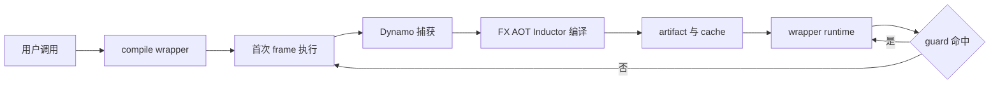

# 00 · `torch.compile` 端到端学习总索引

> 固定源码：PyTorch `e8f97c1a6ef8cbcdd0a946606bc1e924e4f07e52`  
> 本地精确 checkout：`E:/97-codes/torch_parallel/p`（detached HEAD，课程源码定位只以此目录为准）
> 运行观察：PyTorch `2.9.1+cpu` / git `5811a8d7da873dd699ff6687092c225caffcf1bb`  
> 范围：从 eager/Python 执行模型到 production rollout  
> 当前阶段：原理解读、源码链路与 CUDA-first 配套 Demo
> 最后更新：2026-07-29

## 1. 核心问题

`torch.compile`不是“把 Module 立刻转成一个 kernel”的单步骤 API。它把一次 Python
调用拆成多个时间尺度和多种状态：



初学者必须同时理解：

- 用户在何时只创建 wrapper，何时才真正编译；
- Python frame、FX Node、AOT fresh Node、IR value 和 Scheduler node 的身份边界；
- graph break、guard failure、backend failure 与 runtime failure 的区别；
- 编译结果怎样缓存、加载、执行、失效和回退；
- 性能收益是否足以覆盖捕获、编译、warmup 和重编译成本。

## 2. 六卷总览

| 卷 | 核心问题 | 完成后应能 |
|---|---|---|
| A | PyTorch/Python 执行对象是什么 | 解释编译器捕获的值、算子、frame 和成本 |
| B | Dynamo 如何把 Python 变成 guarded FX regions | 定位 break、guard、cache 和 recompile |
| C | FX 如何变成 fw/bw、IR、Scheduler 与 kernel | 阅读图与开发/审查 pass |
| D | 编译产物怎样缓存、加载和运行 | 分析 artifact lifecycle 与 runtime failure |
| E | 如何调试、验证和测量 | 建立证据驱动的诊断与性能验收 |
| F | 如何进入训练、分布式、扩展和部署 | 判断高级机制的接入层与约束 |

## 3. 卷 A：执行模型前置基础（已并入功能页，2026-07-30）

> A01-A05 五篇回顾页(Tensor/Storage/View、operator/dispatcher/autograd、Python frame/bytecode、dispatch mode/ProxyTensor/FakeTensor、cost model)经 P4 知识库整改判重后删除：其"编译器为什么在乎"独有分析已逐字迁入对应功能页——[[01_eager_runtime/01_tensor_and_storage/10_tensor_impl_and_storage_analysis]] §13、[[10_pytorch_dispatcher_analysis]] §12、[[11_eval_frame_callback_and_code_cache_analysis]] §13、[[12_instruction_translator_and_bytecode_state_machine_analysis]] §14、[[10_dispatch_modes_proxytensor_faketensor_analysis]]（2026-07-30 起独立成页，原落点 `aotautograd_analysis` §13）、[[10_torch_compile_api_and_first_call_lifecycle_analysis]] §12、[[compile_latency_cache_and_steady_state_performance_analysis]] §12-§16；与功能页重复的机制说明未搬运。本节的导读性重排列入 Task 10（课程页 + 索引重建）。

## 4. 卷 B：`torch.compile` API 与 TorchDynamo（已迁移至 `02_compile_stack/01_dynamo/`，2026-07-30）

> B01-B10 十篇经 P4 知识库整改随两级重组迁移并去前缀重命名到 [[02_compile_stack/01_dynamo/index]]：API 与首次编译生命周期(B01)→backend 参数/stance/fullgraph(B02)→eval-frame callback/code cache(B03)→字节码符号执行(B04)→VariableTracker/来源(B05)→OutputGraph/side effects(B06)→guard/cache/recompile(B07)→graph break/resume(B08)→动态形状泛化/fallback(B09)→backend contract(B10)，阅读顺序不变，完整卷内表格重建见该目录 index.md。本节的导读性重排列入 Task 10。

## 5. 卷 C：图编译核心

卷 C 的 [[00_pytorch_graph_series_index]]、`01–21` 正文和配套 Labs 已实体并入本目录。
端到端显示编号 `C01–C21`，文件内部继续保留成熟的 `01–21` 顺序；以下页面直接属于
本课程的统一阅读顺序、manifest 和 claim ledger，不再依赖旧目录 16。

| 编号 | 页面 | 先回答的问题 |
|---:|---|---|
| C01 | [[01_graph_ir_motivation_and_taxonomy]] | 为什么需要图；不同“图”的节点、边和生命周期有何不同 |
| C02 | [[10_fx_graph_core_data_model_analysis]] | FX Graph、Node、use-def、图序和 GraphModule 如何协作 |
| C03 | [[11_graph_values_metadata_and_signatures_analysis]] | Node 引用、meta、pytree 和三类 signature 分别表达什么 |
| C04 | [[20_symbolic_shapes_guards_and_graph_reuse_analysis]] | symbolic shape、guard 和图复用怎样形成契约 |
| C05 | [[12_graph_effects_alias_mutation_and_order_analysis]] | 数据边之外的 alias、mutation 和 effect 顺序如何表达 |
| C06 | [[13_structured_outputs_higher_order_and_nested_graphs_analysis]] | 多输出、HOP 与 nested GraphModule 怎样扩展普通 DAG |
| C07 | [[14_graph_capture_frontends_and_tracing_analysis]] | symbolic_trace、make_fx、Dynamo 和 export 为何产生不同图 |
| C08 | [[15_graph_normalization_decomposition_and_functionalization_analysis]] | schema normalization、decomposition 和 functionalization 为何必须分层 |
| C09 | [[11_aotautograd_joint_forward_backward_graphs_analysis]] | AOT joint graph 怎样提取为两张 fresh fw/bw Graph |
| C10 | [[12_saved_tensors_recompute_and_runtime_abi_analysis]] | saved values、recompute 和 fw→bw runtime ABI 如何协作 |
| C11 | [[20_graph_stage_boundaries_identity_and_provenance_analysis]] | Node identity 跨阶段断开后如何维持 provenance |
| C12 | [[21_fx_graph_editing_primitives_and_invariants_analysis]] | replace、erase、copy、lint、recompile 怎样组成安全事务 |
| C13 | [[22_pattern_expression_and_matcher_engine_analysis]] | PatternExpr AST、候选索引和递归 matcher 如何工作 |
| C14 | [[23_dead_code_topology_and_effect_order_analysis]] | dead node、DCE、稳定拓扑和 effect order 有何边界 |
| C15 | [[24_graph_pass_pipeline_ordering_and_fixpoint_analysis]] | pass stage、registration order、迭代与 fixpoint 如何决定结果 |
| C16 | [[25_graph_rewrite_legality_validation_and_complexity_analysis]] | 结构命中后怎样验证 shape、dtype、alias、autograd 和收益 |
| C17 | [[fx_lowering_to_inductor_ir_analysis]] | GraphLowering 为什么不是 FX Node 的一对一替换 |
| C18 | [[inductor_ir_values_loops_layouts_and_buffers_analysis]] | TensorBox、Loops、Layout、Buffer 和 ExternKernel 如何分工 |
| C19 | [[buffer_liveness_memory_planning_and_reuse_analysis]] | logical buffer 怎样进入 liveness、free 和 reuse 决策 |
| C20 | [[scheduler_dependency_graph_fusion_and_ordering_analysis]] | Scheduler dependency、fusion candidate、legality 和 ordering 如何协作 |
| C21 | [[codegen_kernel_mapping_autotuning_and_provenance_analysis]] | Scheduler group 怎样映射到 kernel、wrapper、autotune 和 provenance |

关键桥接：

```text
B06 OutputGraph
  → B10 backend contract
  → C07 capture frontend
  → C08 normalization
  → C09–C10 AOT fw/bw ABI
  → C17–C21 Inductor
  → D01 compile_fx runtime orchestration
```

## 6. 卷 D：编译产物、缓存与运行时

| 编号 | 页面 | 先回答的问题 |
|---:|---|---|
| D01 | [[inductor_compile_fx_orchestration_analysis]] | Inductor backend 如何编排 AOT 与 inner compile |
| D02 | [[13_aot_runtime_wrappers_and_lazy_backward_compile_analysis]] | forward/backward wrapper 与 lazy bw compile 如何运行 |
| D03 | [[async_compile_workers_and_module_loading_analysis]] | 编译任务如何异步完成并加载为 module |
| D04 | [[02_compile_stack/06_compile_cache/index]] | 各层 cache 的 key、value 和失效边界是什么 |
| D05 | [[buffer_liveness_memory_planning_and_reuse_analysis]] | wrapper 如何分配、调用、复用和组装输出(2026-07-30 判重并入 C19 §18) |
| D06 | [[cudagraph_trees_warmup_record_and_replay_analysis]] | warmup、record、replay 与 liveness 如何形成 tree |
| D07 | [[compiled_artifact_lifecycle_and_runtime_failures_analysis]] | artifact 从创建到失效有哪些状态 |

## 7. 卷 E：调试、正确性与性能（已迁移至 `02_compile_stack/07_debugging/`，2026-07-30）

> E01-E09 九篇经 P4 知识库整改随两级重组迁移并去前缀重命名到 [[02_compile_stack/07_debugging/index]]：observability(E01)→dynamo explain/graph break(E02)→guard failure/recompile(E03)→AOTAutograd/Inductor failure localization(E04)→minifier/bisector(E05)→correctness validation(E06)→compile latency/cache(E07)→kernel fusion/memory/hardware performance(E08)→production rollout(E09)，阅读顺序不变，完整卷内表格重建见该目录 index.md。本节的导读性重排列入 Task 10。

## 8. 卷 F：训练、分布式、扩展与部署

| 编号 | 页面 | 先回答的问题 |
|---:|---|---|
| F01 | [[20_compiled_autograd_analysis]] | Compiled Autograd 与 AOTAutograd 有何不同(2026-07-30 迁入 `01_eager_runtime/05_autograd_engine/`,与 [[10_autograd_engine_analysis]] 互指划界) |
| F02 | [[20_activation_checkpoint_recompute_and_compile_analysis]] | checkpoint 与 AOT recompute 怎样叠加(2026-07-30 迁入 `02_compile_stack/02_aot_autograd/`,与 [[12_saved_tensors_recompute_and_runtime_abi_analysis]] 互指划界) |
| F03 | [[ddp_compile_boundaries_and_optimizer_analysis]] | DDP/reducer/optimizer 如何改变 compile region(2026-07-30 迁入 `04_export_and_distributed/02_distributed_primitives/`,与 [[c10d_ddp_fsdp_dtensor_analysis]] 互指划界) |
| F04 | [[fsdp_dtensor_and_distributed_graphs_analysis]] | shard、placement、collective 与 rank state 如何入图(2026-07-30 迁入同上,与 [[c10d_ddp_fsdp_dtensor_analysis]] 互指划界) |
| F05 | [[custom_operators_fake_kernels_and_decompositions_analysis]] | custom op 怎样补齐编译契约(2026-07-30 迁入 `04_export_and_distributed/01_fx_export_extensibility/`,与 [[fx_graph_export_and_custom_ops_analysis]] §7 判重后保留独立页+互指) |
| F06 | [[20_custom_backends_and_device_integration_analysis]] | backend/device 怎样接入 lowering 与 codegen(2026-07-30 迁入 `01_eager_runtime/02_dispatcher_and_device/`,与 [[11_privateuse1_device_integration_analysis]]+[[codegen_extension_guide]] 三方划界) |
| F07 | [[aotinductor_packaging_and_deployment_analysis]] | AOTInductor 与 JIT compile 的产物和 ABI 有何不同(2026-07-30 迁入 `02_compile_stack/04_inductor/`,纯平移;解答了 [[22_backend_modes_options_stances_and_fullgraph_analysis]] §14.2 的 `use_aoti` todo) |
| F08 | [[training_inference_cudagraph_and_freezing_analysis]] | training/inference/freezing/CUDAGraph 如何组合 |

## 9. 六卷 Demo 验收入口

每卷一个入口、每卷多个 case；`--list --json` 给出 case、对应页面与能力要求，
`--case <id>` 只运行一个机制，`--case all` 运行整卷：

| 卷 | 入口 | 主题 |
|---|---|---|
| A | `tools/labs_torch_compile/demo_a_execution_model.py` | Tensor/dispatcher/frame/Proxy-FakeTensor/成本 |
| B | `tools/labs_torch_compile/demo_b_dynamo_capture.py` | lifecycle/cache/bytecode/guard/break/dynamic/backend |
| C | `tools/labs_torch_compile/demo_c_graph_compiler.py` | 编排既有 Part I–IV 与贯穿 bundle |
| D | `tools/labs_torch_compile/demo_d_artifact_runtime.py` | compile_fx/AOT wrapper/cache/module load/memory/CUDAGraph |
| E | `tools/labs_torch_compile/demo_e_diagnostics.py` | explain/recompile/故障分层/repro/正确性/性能/回退 |
| F | `tools/labs_torch_compile/demo_f_advanced_topics.py` | compiled autograd/checkpoint/distributed/custom/AOTI |

统一运行契约：

```powershell
python -B tools\labs_torch_compile\demo_b_dynamo_capture.py `
  --case guards_recompile --device cuda `
  --output-dir tools\labs_torch_compile\artifacts\volume_demos\b07
```

- `PASS`：case 正文真实执行，且内置断言全部通过；
- `BLOCKED`：声明的 CUDA/Triton/native compiler/多卡等能力缺失，正文没有执行；
- `FAIL`：正文已经执行，但编译阶段、子进程、断言或 runtime 失败；
- `summary.json` 是卷级摘要，`<case>/result.json` 是单用例证据，其他 artifact 从后者列出。

默认 `--device cuda`。无 CUDA 的开发机可用 `--device cpu` 预检设备无关机制，但这不能替代
GPU、Triton、CUDAGraph、allocator 或多卡验收。页面到 case 的完整映射固定在
`tools/labs_torch_compile/demo_manifest.json`；卷 C 同时保留原有更细粒度脚本与证据目录。

## 10. 三条推荐路径

### 初学者完整路径

```text
A01 → A05
→ B01 → B10
→ C01 → C21
→ D01 → D07
→ E01 → E09
→ F01 → F08
```

### 捕获与编译器开发

```text
A03 → A04
→ B03 → B10
→ C02 → C16
→ D01 → D04
→ E01 → E06
→ F05 → F06
```

### 线上性能与稳定性

```text
A05
→ B01 → B03 → B07 → B09
→ C09 → C11 → C17 → C21
→ D01 → D07
→ E01 → E09
→ F01 → F04 → F08
```

## 11. 阅读源码的统一问题

每一机制都按同一顺序阅读：

1. driver 是谁；
2. 当前 owner 持有哪些状态；
3. 读取和写回分别是什么；
4. 新 identity 在哪里产生；
5. 不变量或拒绝条件在哪里检查；
6. 下游 consumer 使用什么；
7. 失败后是 break、recompile、fallback 还是异常；
8. 成本属于一次性、每 specialization 还是每次调用。

## 12. 验收边界

正文的实现结论仍以固定源码审计为准；Demo 只证明它实际运行过的 case、输入与环境，
不能用一次 `PASS` 外推其他版本、shape、dtype 或硬件。已有正式 runtime receipt 可以被
引用，但不能用历史脚本输出支撑未观测的新结论。当前 native CPU/CUDA/Triton 能力继续
保持环境 gate。

## Related Pages

- [[index]] — 本域入口
- [[00_pytorch_graph_series_index]] — 卷 C 完整课程
- [[02_compile_stack/01_dynamo/index]] — Dynamo 领域索引
- [[02_compile_stack/02_aot_autograd/index]] — AOTAutograd 领域索引
- [[02_compile_stack/04_inductor/index]] — Inductor 领域索引
- [[02_compile_stack/06_compile_cache/index]] — 编译缓存索引
- [[04_export_and_distributed/02_distributed_primitives/index]] — 分布式原语索引
- `tools/labs_torch_compile/README.md` — Demo 命令、状态和证据说明
