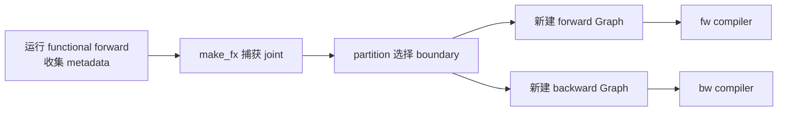
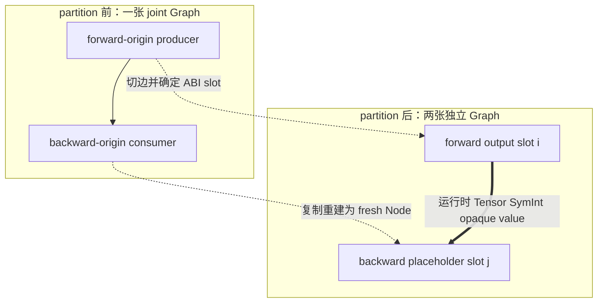

# 09 · AOTAutograd 的 Joint、Forward 与 Backward Graph

> 前置：[[08_graph_normalization_decomposition_and_functionalization]]
> 当前实现基线：PyTorch `e8f97c1a6ef8cbcdd0a946606bc1e924e4f07e52`
> Lab 环境：PyTorch `2.9.1+cpu`
> 最后更新：2026-07-28

## 1. 最重要的结论

AOTAutograd不是把一张“前向图”反转得到 backward，也不是在 fw Node 上挂反向边。它经历：



metadata、joint、fw、bw是不同状态；fw/bw是两张独立 FX Graph。

## 2. metadata analysis 不是构图

AOT先在 `FunctionalTensorMode`下执行 forward并返回 `ViewAndMutationMeta`。源码明确说明这一步
没有 tracing（`torch/_functorch/_aot_autograd/collect_metadata_analysis.py:167-242`）。

它收集：

- input data/metadata/storage mutation；
- duplicate/alias inputs；
- output alias与intermediate base；
- differentiability；
- tangent candidates；
- subclass/effect相关调用约定
  （`torch/_functorch/_aot_autograd/collect_metadata_analysis.py:252-274`;
  `torch/_functorch/_aot_autograd/collect_metadata_analysis.py:276-289`;
  `torch/_functorch/_aot_autograd/collect_metadata_analysis.py:291-320`;
  `torch/_functorch/_aot_autograd/collect_metadata_analysis.py:447-475`;
  `torch/_functorch/_aot_autograd/collect_metadata_analysis.py:488-510`;
  `torch/_functorch/_aot_autograd/collect_metadata_analysis.py:760-805`）。

这些信息控制后续 capture和runtime ABI。

## 3. joint inputs：primals 与 tangents

需要 autograd时，AOT准备：

- primals：forward输入；
- traced tangents：对可微forward输出的梯度输入。

`aot_dispatch_autograd_graph`准备 `create_joint`并通过 `make_fx`捕获 joint GraphModule
（`torch/_functorch/_aot_autograd/graph_capture.py:472-536`;
`torch/_functorch/_aot_autograd/graph_capture.py:92-183`）。

joint function概念上：

```python
def joint(primals, tangents):
    forward_outputs = functional_forward(*primals)
    grads = torch.autograd.grad(
        differentiable_forward_outputs,
        differentiable_primals,
        tangents,
    )
    return forward_side_outputs, grads
```

## 4. joint Node 的 forward/backward 标记

`create_joint`先执行prepared forward：

- 已产生的forward nodes标记 `is_forward`；
- tangent-originated/backward-created nodes标记 `is_backward`；
- 调用 `torch.autograd.grad`；
- 返回 forward-side outputs与每个primal对应的gradient-or-None
  （`torch/_functorch/_aot_autograd/graph_capture_wrappers.py:294-310`;
  `torch/_functorch/_aot_autograd/graph_capture_wrappers.py:311-325`;
  `torch/_functorch/_aot_autograd/graph_capture_wrappers.py:350-376`;
  `torch/_functorch/_aot_autograd/graph_capture_wrappers.py:377-390`;
  `torch/_functorch/_aot_autograd/graph_capture_wrappers.py:392-412`;
  `torch/_functorch/_aot_autograd/graph_capture_wrappers.py:439-458`;
  `torch/_functorch/_aot_autograd/graph_capture_wrappers.py:459-477`）。

标记服务于 partition/provenance，不是新的 Node opcode，也不代表两张图已生成。

## 5. joint graph 是 partition 的 supergraph

joint graph同时可见：

- forward value producer；
- backward计算；
- backward需要哪些forward values；
- mutation/effect/recompute metadata。

partitioner可在同一图上决定 boundary。它不是最终 runtime 直接执行“前半后半”的共享
GraphModule。

## 6. required-node closure 与 classify

partition需从：

- 用户可见forward outputs；
- backward gradient outputs；
- effect/mutation必要节点；
- forced save/recompute metadata

反向追踪 producer closure，识别：

- 必须留在 fw；
- 必须在 bw；
- 两边都需要，需save或recompute；
- dead/unclaimed。

“forward标记”不能单独决定位置，因为某个forward-origin op可被复制进bw重算。

## 7. 提取新 Graph 的机制

`_extract_graph_with_inputs_outputs`：

1. 创建 fresh `fx.Graph`；
2. 为指定 inputs创建 fresh placeholders；
3. 维护 joint old Node → new Node env；
4. 按顺序 `node_copy`所需节点；
5. 映射 outputs；
6. 返回 fresh `fx.Graph`
   （`torch/_functorch/partitioners.py:514-538`;
   `torch/_functorch/partitioners.py:544-568`;
   `torch/_functorch/partitioners.py:654-661`;
   `torch/_functorch/partitioners.py:676-705`）。

该 helper 本身不创建 GraphModule；调用它的 `_extract_fwd_bwd_modules` 随后在自身函数体
内分别把两个 fresh Graph 包装成 `fx.GraphModule`
（`torch/_functorch/partitioners.py:1577-1578`）。把这两步写开很重要：Graph ownership
在 extraction 时已经重新建立，Module codegen/attributes 则是下一层对象包装。

因此 joint Node与fw/bw Node：

- name可相似；
- meta可复制；
- origin可对应；
- Python object identity不同；
- owner Graph不同。

### 如何取得真实 old→new 表，而不是按 name 猜

生产实现的局部 `env`不会作为 partition 返回值暴露。Lab 因而采用只用于审计的 provenance
token：

1. 在同一次 `partition_fn`调用中，为每个 joint Node 的 `node.meta`写入唯一 token；
2. 立即调用 `default_partition`；
3. 在它刚返回的 fresh fw/bw Graph 上读取 token，形成 joint old Node → new Node 表；
4. 再在同一次 AOT 调用触发的 fw/bw compiler callback 上读取 token，核对 partition result
   到 compiler input 的连续性。

这条证据成立的实现基础不是“名字相同”，而是 `Graph.node_copy`在创建 fresh Node 后浅复制
源 Node 的 `meta`（`torch/fx/graph.py:2386-2420`），而 extraction 把既有计算转成
placeholder 时也显式继承源 `meta`（`torch/_functorch/partitioners.py:544-550`）。
joint 的 `output` Node 不经过 `node_copy`：提取器根据已映射 output values 创建 fresh
output Node。

token 是 Lab 注入的观测探针，不是 PyTorch 支持的稳定 metadata schema；artifact 因而把
fresh output 标成“结构重建”，不伪造 Node 对应。

## 8. 两张独立图

partition最终返回两个 GraphModule
（`torch/_functorch/partitioners.py:1573-1592`）。

```text
fw_graph:
  placeholders: primals 与附加forward输入
  body: forward计算
  output: user-visible prefix + saved boundary values

bw_graph:
  placeholders: saved values + tangents 与附加runtime输入
  body: copied recompute + gradient计算
  output: primal gradients
```

不存在合法的：

```python
bw_node.args = (some_fw_node,)
```

因为 `Graph.lint()`会拒绝跨Graph ownership。关系由位置ABI表达。

## 9. Forward output 的分层

forward-visible prefix可包括：

- mutated-input returns；
- user outputs；
- intermediate bases；
- effect token/RNG adaptations。

其后是供bw使用的：

- 需version-counter check的saved tensors；
- 不需version check的tensors；
- opaque objects；
- symbolic scalar values。

精确 slices由 `ViewAndMutationMeta`携带
（`torch/_functorch/_aot_autograd/schemas.py:446-475`;
`torch/_functorch/_aot_autograd/schemas.py:500-529`;
`torch/_functorch/_aot_autograd/schemas.py:781-863`）。

## 10. Backward input 的顺序

核心顺序是：

```text
symbolic scalar values
→ saved tensors
→ opaque objects
→ tangents
→ optional backward RNG inputs
→ optional BackwardState
```

partition extraction构造签名的位置见
`torch/_functorch/partitioners.py:1473-1546`。runtime wrapper还会根据effect/subclass/
filtered-grad规则适配。

## 11. 编译器调用

fw compiler与bw compiler可相同也可不同；Inductor通常把两张图各自当普通ATen FX图编译。
GraphLowering并不知道某 Node是否与另一Graph有跨图edge，因为没有这种edge。

正常Inductor partition path会先跑joint passes，再在无custom partitioner时使用min-cut
（`torch/_inductor/compile_fx.py:2454-2518`）。独立 `aot_function` API的默认
`partition_fn`仍是 `default_partition`
（`torch/_functorch/aot_autograd.py:712-738`）。

## 12. backward 何时编译

实现可提前编译bw以便forward时已知guards，也支持lazy backward compiler path；forward
compiler选择的saved activation stride还可反馈给bw布局适配
（`torch/_functorch/_aot_autograd/graph_compile.py:2304-2365`）。

“AOT”描述ahead-of-time构造/编译能力，不保证所有配置都在第一次forward前同步完成全部bw
machine code。

## 13. 与 eager autograd 的关系

eager autograd：

- forward运行时逐算子建立backward tape；
- `.backward()`由engine动态调度。

AOTAutograd：

- capture期间仍借助 autograd semantics构造joint；
- partition后将gradient computation变成普通FX Graph；
- runtime用generated `torch.autograd.Function`连接fw/bw compiled call。

它不是替换微分规则，而是把结果图化并交给backend。

## 源码跟读：从 `aot_dispatch_autograd_graph` 到两张 fresh Graph

这一段调用链直接回答“反向图是怎么构造的”，也能看清每个阶段创建了什么对象：

```text
flat_fn + primals + ViewAndMutationMeta
  │
  ├─ fn_prepped_for_autograd
  ├─ create_joint
  ├─ create_functionalized_fn / capture wrappers
  └─ make_fx(_create_graph...)
            │
            ▼
       joint GraphModule
            │ partition_fn
            ▼
 _extract_fwd_bwd_modules
   ├─ fresh fwd Graph → GraphModule
   └─ fresh bwd Graph → GraphModule
```

把对象所有权与跨阶段数据边分开画，会更容易看出“joint 中有边、partition 后没有跨图
Node 边”的区别：

```mermaid
flowchart LR
    Inputs["primals + tangents + metadata"] --> Capture["make_fx / create_joint"]
    Capture --> Joint["joint GraphModule<br/>forward-origin 与 backward-origin Node 同图相连"]
    Joint --> Partition["partition_fn"]
    Partition --> Extract["_extract_fwd_bwd_modules"]
    Extract --> FW["fresh forward GraphModule"]
    Extract --> BW["fresh backward GraphModule"]
    FW -->|runtime outputs: user outputs + saved values| ABI["generated autograd.Function ABI"]
    ABI -->|runtime args: saved values + tangents| BW
```



### 1. Joint 的输入不是从 forward Graph 猜出来，而由 metadata 显式准备

`aot_dispatch_autograd_graph` 把 `flat_args` 与
`fw_metadata.traced_tangents` 组成 `joint_inputs`；注释说明 tangents 对应需要
grad_outputs 的 traced-forward outputs，其中还可能包含 input mutation 的 updated outputs
（`torch/_functorch/_aot_autograd/graph_capture.py:472-492`）。

随后代码依次：

1. 用 metadata/AOT config 准备 autograd 函数；
2. `create_joint`；
3. 用 functionalization/subclass/effect wrapper 准备 joint capture；
4. `_create_graph_and_save_traced_inputs` 真正捕获 GraphModule
   （`torch/_functorch/_aot_autograd/graph_capture.py:494-531`）。

这说明 metadata analysis 不产出图；它产出决定 joint signature 和 wrapper 行为的描述。
真正的 joint Node 来自后面的 trace。

### 2. `create_joint` 是在一次 Proxy trace 中先跑 forward，再调用 autograd

joint wrapper `inner_fn(primals, tangents)` 先执行 prepared forward，得到 outputs 与
tangent mask。此时它遍历当前 tracer graph，把已出现 Node 标成 forward；由 tangent
origin 识别的节点标成 backward
（`torch/_functorch/_aot_autograd/graph_capture_wrappers.py:294-330`）。

接着它筛出需要梯度的 outputs/primals，最终调用 `torch.autograd.grad`，把
`grad_outputs=needed_tangents` 传入，并返回 `(forward outs, primal grads-or-None)`
（`torch/_functorch/_aot_autograd/graph_capture_wrappers.py:336-358`;
`torch/_functorch/_aot_autograd/graph_capture_wrappers.py:447-475`）。

由于整个 wrapper 正处在 ProxyTensor/make_fx capture 中，autograd 计算过程中触发的算子也
成为普通 FX call Nodes。这不是把 forward Graph 边反向，也不是复制 eager `grad_fn` 对象；
它是“执行微分规则时再次被 tracer 记录”。

### 3. partition 先确定两个签名列表，再分别调用同一个提取器

`_extract_fwd_bwd_modules` 对 saved values 先按 version-counter-check 语义稳定分组，并把
opaque objects 分离
（`torch/_functorch/partitioners.py:1473-1496`）。随后 forward extraction 的 outputs
按下面顺序拼接：

```text
fwd_outputs
+ saved tensors
+ saved opaque objects/nodes
+ saved SymInt nodes
```

backward extraction 的 inputs 则显式拼成：

```text
saved SymInt nodes
+ saved tensors
+ saved opaque objects/nodes
+ tangents
+ backward RNG seed/offset
+ BackwardState
```

对应调用位于 `torch/_functorch/partitioners.py:1507-1532` 与
`torch/_functorch/partitioners.py:1533-1546`。fw output slot 和 bw placeholder slot 的
位置关系在这里被建立；它不是之后通过 Node edge“发现”的。

### 4. 提取器如何把 joint Node 变成 fresh Node

`_extract_graph_with_inputs_outputs` 一开始创建 `new_graph` 和 `env`
（`torch/_functorch/partitioners.py:514-533`）。对指定 inputs，它无论原 Node 是
placeholder 还是普通 call，都创建 **新的 placeholder**，复制 meta，并写入
`env[old] = new`
（`torch/_functorch/partitioners.py:544-550`）。

随后顺序扫描 joint graph：

- 不允许进入当前子图的 Node 被标成 `InvalidNode`；
- placeholder 若不是指定 input，同样 invalid；
- call/get_attr 只有在所需 producer 已有有效映射时才复制；
- 普通复制调用 `new_graph.node_copy(node, lambda old_arg: env[old_arg])`
  （`torch/_functorch/partitioners.py:552-576`;
  `torch/_functorch/partitioners.py:609-659`）。

这里 `lambda x: env[x]` 是重建所有图内边的关键：new consumer 参数引用 new producer，
而不是 joint producer。于是新图从创建时就满足 ownership。

最后 outputs 通过 env 映射，创建 fresh output Node，再对 new graph 做 DCE 和 lint
（`torch/_functorch/partitioners.py:662-705`）。注意这也意味着 joint `output` Node 不被
`node_copy`，而是按选定 output values 重新构造。

### 5. Graph 与 GraphModule 的创建是两个连续但不同的步骤

提取器返回的是 `fx.Graph`。`_extract_fwd_bwd_modules` 再给 backward call/get_attr Nodes
添加 `autograd_backward` meta，然后分别调用 `_make_graph_module(joint_module, graph)`，
返回两个 GraphModule
（`torch/_functorch/partitioners.py:1573-1592`）。

所以对象关系是：

| 对象 | 何时创建 | 是否复用 joint Node identity |
|---|---|---|
| joint GraphModule | make_fx capture | 不适用 |
| fwd/bwd Graph | extraction | 否，fresh Node + remapped args |
| fwd/bwd GraphModule | extraction 后包装 | 持有各自 fresh Graph |
| runtime saved values | compiled fw 执行时 | 是 runtime value，不是 Node |

### 6. “正反向依赖”在三个时刻有三种表示

```text
partition 分析时：
  joint use-def：backward-origin Node 直接使用 forward-origin Node

partition 结果中：
  fw output slot i  ↔  bw placeholder slot j
  两张图间无 Node edge

runtime：
  compiled fw 返回真实 value
  generated autograd.Function 保存/持有它
  compiled bw 调用时把真实 value 作为第 j 个参数传入
```



因此“通过 saved tensors 连接正反向依赖”作为概念是对的，但必须补全：连接的是运行时值与
位置 ABI，不是创建跨 Graph `Node.args`。joint graph 中确实有直接 use-def，但 partition
后这条关系被切成了输出/输入边界。

### 源码边界

上述源码证明 joint 构造、签名拼接、fresh Graph extraction 与 ownership；它不单独决定
“保存哪个值”。`default_partition`、min-cut、memory budget、recompute metadata 和
effect/mutation constraints 会选择具体 boundary。下一篇沿这些选择解释 saved value 与
recompute Node 怎样落入 backward graph。

## 14. 复杂度

设joint有 `V/E`：

- metadata forward成本包含真实/functionalized operator执行，不只 `O(V+E)`；
- joint capture与被trace计算量成正比；
- closure/extraction结构工作通常 `O(V+E)`；
- old→new copy `O(V_selected+E_selected)`；
- partition算法若使用min-cut还包含flow network求解；
- compilation成本由两个新图及其后端决定。

必须分开“结构性图算法”与“被trace/compiled算子的计算和编译成本”。

## 15. 已验证 Lab

从知识库根目录运行：

```powershell
python -B wiki\02_engineering\01_ai_frameworks\19_torch_compile_end_to_end\labs\part2_aot_graphs.py
python -B wiki\02_engineering\01_ai_frameworks\19_torch_compile_end_to_end\labs\series_artifact_bundle.py `
  --output-dir wiki\02_engineering\01_ai_frameworks\19_torch_compile_end_to_end\labs\artifacts\end_to_end
```

机制脚本正例使用 custom partition wrapper与 fw/bw compiler捕获三张图并比较梯度；边界/不变量
检查遍历 bw 的所有 `args/kwargs`，跨 owner Node 引用数必须为 0。旧脚本曾把 fw 的全部
output leaves 误名为 saved outputs；现在明确拆成 user prefix、saved suffix 与 total：

```text
joint_graphs=1
forward_graphs=1
backward_graphs=1
fw_and_bw_are_distinct=True
fw_total_output_count=4
fw_user_output_count=1
fw_saved_value_count=3
bw_placeholder_count=4
cross_graph_node_refs=0
gradient_matches_eager=True
```

贯穿 bundle进一步保存逐阶段 Node 表与：

- `labs/artifacts/end_to_end/aot_joint.py`；
- `aot_forward.py`、`aot_backward.py`；
- `aot_partition_abi.json`；
- `aot_joint_to_fw_bw_node_mapping.json`；
- `artifact_manifest.json`；
- `stage_node_mapping.json`。

统一 bundle 的实测补充结果为：

```text
aot_joint_partition_mapping_exact=True
aot_partition_to_compiler_callback_continuity=True
aot_saved_slot_binding_origins_match=True
artifact_bundle_continuity=partial
joint_node_count=31
mapped_joint_node_count=30
unmapped_or_rebuilt_joint_node_count=1
joint_output_node_count=1
unmapped_non_output_joint_node_count=0
mapped_to_forward_count=12
mapped_to_backward_count=21
mapped_to_both_graphs_count=3
saved_slot_bindings=3
```

`aot_joint_to_fw_bw_node_mapping.json`逐 Node 保存 joint source、partition fw/bw
destination和compiler callback destination，并验证目标 Node 的 Python identity 与 owner
Graph 都不是 joint 的 identity/owner。本环境中 forward partition Graph 原对象直接进入
fw compiler callback；backward callback收到的不是同一个 Graph 对象，但完整 audit token
集合仍被保留。这正好说明“同一次连续 AOT 调用”不等于“每层都保持同一 Python 对象”。

`aot_partition_abi.json`显式记录 user output count、saved slots、bw placeholder、
三条 saved-slot→backward-placeholder 位置绑定与 cross-graph refs。每条绑定还核对 fw
output value与对应 bw placeholder携带相同 joint audit origin；它证明的是位置 runtime ABI，
不是 Node edge。

不过 `artifact_manifest.json`明确把整个 bundle 标为 `partial`：symbolic trace、Dynamo、
export、functional `make_fx`和 AOT 是对同一用户计算的独立 capture；只有
joint→partition fw/bw→compiler callback 是同一次 AOT 运行内的连续段。后端 artifact 又是
一次独立的 `torch.compile(backend_core)`运行，并没有直接消费这里保存的 `aot_forward`
GraphModule。`stage_node_mapping.json`只记录这些关系与各阶段 Node 表，不把独立 capture
伪装成一条连续编译。环境与命令见
[`labs/README.md`](labs/README.md)。

## 16. 回答开篇问题

> 本质还是两张图吗？

partition后是两张独立图；之前有一张joint图作为输入。

> save tensors如何连接？

不是Node edge，而是fw output slot、runtime context和bw placeholder slot的ABI。

> backward如何加入recompute？

partitioner把所需forward-origin nodes普通复制到bw，再按需要重排。详见下一篇。

## 学习顺序

- 上一篇：[[08_graph_normalization_decomposition_and_functionalization]]
- 下一篇：[[10_saved_tensors_recompute_and_runtime_abi]]

## Related Pages

- [[19_torch_compile_end_to_end/00_pytorch_graph_series_index]]
- [[08_graph_normalization_decomposition_and_functionalization]]
- [[10_saved_tensors_recompute_and_runtime_abi]]
- [[11_graph_stage_boundaries_identity_and_provenance]]
- [[03_aot_autograd/index]]
- [[aotautograd_analysis]]
