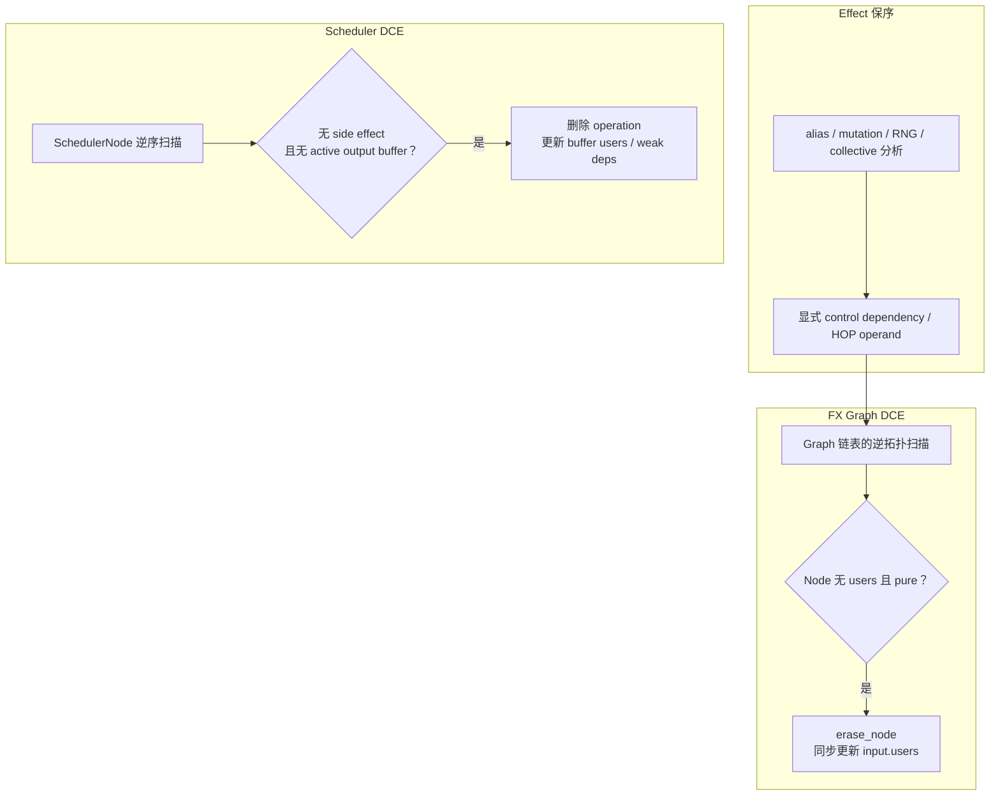

# 14 · Dead Code、拓扑与 Effect 保序

> 前置：[[05_graph_effects_alias_mutation_and_order]]、[[13_pattern_expression_and_matcher_engine]]
> 当前实现基线：PyTorch `e8f97c1a6ef8cbcdd0a946606bc1e924e4f07e52`
> Lab 环境：PyTorch `2.9.1+cpu`
> 最后更新：2026-07-28

## 1. “dead”必须先绑定图类型

| 语境 | dead含义 |
|---|---|
| FX | no users且按purity predicate可删除 |
| AOT partition | 不在任一分图的 required closure；“不需要跨边界保存”本身不等于 dead |
| lazy Inductor | 未materialize/realize本身不等于dead；producer可内联进仍存活consumer，需看是否进入最终消费/输出依赖 |
| Scheduler | operation无active outputs且无side effects |
| runtime | allocation已过last use可free/reuse |

这些predicate不能互换。

## 2. FX DCE

当前 `Graph.eliminate_dead_code()`：

1. 先lint确保topological；
2. reverse遍历；
3. 若Node非impure且 `len(users)==0`则erase；
4. 删除consumer后producer users立即更新，形成级联；
5. 递归到被 `get_attr`引用的child GraphModule并recompile
   （`torch/fx/graph.py:2690-2776`）。

reverse遍历是为了先处理users，不是构造reverse graph。

## 3. Pure + no users

两个条件缺一不可：

- 有users：值仍被读取；
- 无users但impure：effect仍可观察；
- pure/no users：可删除。

`placeholder/output`为DCE目的impure；call_function委托library impurity；random默认可视为
impure（`torch/fx/node.py:759-808`）。

默认检测不完备，源码要求调用者确认functional graph或提供custom predicate。

## 4. Pattern local cleanup 与全图DCE

`Match.erase_nodes()`只删matched list中reverse遍历且users为空的Node；replacement还可清理
自身dead nodes。这不是全图DCE。

PatternMatcherPass不自动调用universal DCE/sort/lint/recompile bundle
（`torch/_inductor/pattern_matcher.py:2609-2637`;
`torch/_inductor/pattern_matcher.py:2640-2665`;
`torch/_inductor/pattern_matcher.py:2666-2685`;
`torch/_inductor/pattern_matcher.py:2686-2710`;
`torch/_inductor/pattern_matcher.py:2711-2726`）。stage driver决定清理。

## 5. Scheduler DCE

Scheduler反向遍历topological operations：

- output buffer所有users都weak/removed才inactive；
- operation必须 `not has_side_effects()`；
- 删除后从read buffers users移除该operation；
- 最后prune weak deps
  （`torch/_inductor/scheduler.py:5055-5098`）。

它基于realized buffer users/operation effects，不是FX ancestors或Node.users。

## 6. 图顺序与拓扑顺序

FX链表顺序是generated program order。合法dataflow要求每个producer在consumer前。
`Graph.lint()`检查此不变量
（`torch/fx/graph.py:2620-2649`）。

链表也可包含彼此无data edge的Nodes；它们相对顺序可能是源顺序，也可能被pass改变。

## 7. Stable topological sort

stable sort目标：

- 修复producer-before-consumer；
- 对无依赖约束的Nodes尽量保留原相对顺序。

Inductor pattern工具的当前实现位于
`torch/_inductor/pattern_matcher.py:2946-2980`；FX tools也有GraphModule版本
`torch/fx/passes/tools_common.py:334-354`。

“stable”不是保证所有Node位置不变，而是在满足新dependencies的合法序列中保留尽可能多
原顺序。

## 8. 拓扑正确不等于effect正确

若write/read通过alias storage而非Node arg连接，stable sort看不到该edge。RNG、collective、
stream、I/O也类似。

所以：

```text
data topological order
  是结构必要条件
  不是完整语义充分条件
```

effect需functionalization、token、mutation metadata、Scheduler dependencies或stage-specific
规则显式表达。当前 post-grad 的 control-dependency pass 会先识别必须保序的节点，再把
ordering-only dependency 注入 FX，后续 topological/scheduler 才能“看见”它
（`torch/_inductor/fx_passes/control_dependencies.py:1-40`;
`torch/_inductor/fx_passes/control_dependencies.py:134-217`）。这不是普通
`args/kwargs`天然携带的能力。

## 9. Cleanup顺序

常见但非 universal 的安全顺序：

```text
rewrite
→ local reconnect/erase
→ stage-specific DCE
→ stable topological repair
→ lint
→ recompile
→ semantic tests
```

若rewrite先产生暂时out-of-order producer，DCE前后顺序需按driver contract调整。不要把上表
硬编码成每个stage必经。

## 10. nested graph

outer Node活着不表示child每个Node活着；outer DCE也不能仅凭child内users删除whole region。
当前FX DCE只递归到outer `get_attr`实际引用的child GraphModule；递归DCE后会调用该
child的 `recompile()`（`torch/fx/graph.py:2762-2774`）。

其他pass直接修改child时，仍应按该pass合同独立做child lint/recompile，并验证outer调用
约定没有被改变。

## 源码跟读：FX DCE、stable topo 与 Scheduler DCE 是三种不同算法

### 1. FX DCE 为什么必须先 `lint`、再逆序一次扫完

`eliminate_dead_code` 先调用 `self.lint()`，因为逆序级联删除假设 Graph 已按 producer-before-
consumer 排列（`torch/fx/graph.py:2734-2738`）。接着选择 caller predicate 或
`node.is_impure`，按 `reversed(self.nodes)` 扫描：

```python
if not has_side_effect(node) and len(node.users) == 0:
    self.erase_node(node)
```

（`torch/fx/graph.py:2740-2756`）。

逆序的作用可用链 `a → b → c` 说明：

```text
访问 c：若 dead，erase(c) 立即把 c 从 b.users 删除
访问 b：此时已看到更新后的 users，可继续 erase(b)
访问 a：同理级联
```

若正序只扫一次，访问 a/b 时它们尚有后继 user；删掉 c 后不会回头，需 fixed point 或额外
worklist。逆序利用已有拓扑顺序把纯/no-user DCE 压成一轮。

这也回答“反向图的 Node 和正向 Node 是否有边”：这里根本没有第二张反向图。算法只在同一
FX Graph 的链表上逆序访问，并依赖 `erase_node` 更新原图中的 `users` 反向索引。

### 2. Nested DCE 是源码显式递归，不是 Graph 的天然属性

本图扫描后，DCE 收集 outer `get_attr` targets，只对名字被引用且类型为 GraphModule 的
named child 递归；递归后显式 child recompile
（`torch/fx/graph.py:2762-2774`）。

所以 outer/child 之间也不是 Node use-def 跨图边。outer `get_attr` 指向 owning module 的
属性名，DCE driver 用这一 state relation 找到 child GraphModule，再启动独立子图算法。

### 3. In-place stable topo sort 如何移动 Node

Inductor matcher 工具的 `stable_topological_sort` 把每个 Node 放在三种状态之一：

- `pending`：尚待检查，初始为原顺序的 reverse list；
- `ready`：所有 producer 已处理；
- `waiting[dependency]`：仍等待某个 producer 的 Nodes
  （`torch/_inductor/pattern_matcher.py:2946-2958`）。

循环取一个 pending Node，扫描其 args 中尚未 ready 的输入。若存在，挂到最后一个未满足
dependency；否则加入 ready，并在必要时用 `cursor.append(node)` 把它移动到正确位置。
producer ready 后，再把等待它的 Nodes 放回 pending
（`torch/_inductor/pattern_matcher.py:2960-2980`）。

算法只读取显式 Node 参数依赖：

```text
ready producer 集合
       │
       ├─ consumer 所有 input 已 ready → 放到 cursor 后
       └─ 否则 → waiting[last_missing_producer]
```

“stable”来自两点：pending 按原顺序取、已合法的 Node 若紧跟 cursor 就不移动。它不是对所有
合法 topo orders 做全局最小编辑距离优化，也不会生成 effect edges。

FX `tools_common` 中另有 GraphModule 版本，源码说明采用 Kahn + original-position min-heap
（`torch/fx/passes/tools_common.py:334-360`）。两者目标相似但数据结构/复杂度不同，分析
Inductor matcher 的 pass 不能直接套 heap 版本的严格界。

### 4. 为什么 sort 后仍需 effect 保序机制

若两个 Node 没有 args/kwargs 引用，stable topo 允许保留其当前相对顺序，但它不知道当前
顺序是否已经被错误 rewrite 交换。alias write/read、RNG、I/O、collective 不会自动成为
`waiting_for`。

post-grad control-dependency pass 的解决方式是先识别 additional dependencies，再把原 op
包装进 `control_deps` HOP：

1. 为原 Node 创建 child subgraph；
2. 将 child 注册为 owning module attribute；
3. 在原 Node 前创建 `control_deps(additional_deps, child, original_args...)`；
4. 复制 meta、替换 uses、erase 原 Node并恢复名字
   （`torch/_inductor/fx_passes/control_dependencies.py:134-177`;
   `torch/_inductor/fx_passes/control_dependencies.py:179-217`）。

这一步把纯 ordering dependency 变成 FX 可见的 explicit operands。之后 topo/scheduler 才能
把它当成依赖。stable sort 本身没有做 alias/effect discovery。

### 5. Scheduler DCE 的“user”已经变成 buffer consumer

Scheduler 反向遍历 `self.nodes`，但判活对象是 operation outputs：

- buffer 的所有 users 都是 weak 或已 removed，buffer 才 inactive；
- operation 必须没有 side effects且没有 active buffer；
- 删除 operation 后，从每个 read buffer 的 users 中移除该 operation；
- 完成后 prune weak deps
  （`torch/_inductor/scheduler.py:5055-5098`）。

与 FX 对照：

| 层 | 节点 | user 索引 | effect 判定 |
|---|---|---|---|
| FX DCE | callsite/value Node | `Node.users` | `Node.is_impure`/callback |
| Scheduler DCE | realized operation/SchedulerNode | output buffer users | `has_side_effects` + weak deps |

lazy expression 未形成独立 SchedulerNode 时，不属于 Scheduler DCE 的候选；它可能已经内联
进 live operation。故“没有 Scheduler Node”不等于“被 Scheduler DCE 删除”。



这张图刻意没有画“正向 Node → 反向 Node”的边：所谓反向扫描只是访问顺序；真正的反向
索引分别是 FX 的 `Node.users` 和 Scheduler 的 buffer-user 关系。

### 6. 复杂度从实现得到，而不是统一写成 `O(V+E)`

FX DCE 在 bounded-arity 且 impurity callback O(1) 时是一轮逆序扫描加 erase 输入维护，
结构成本接近 `O(V+E)`。

当前 in-place stable topo 可能多次重新检查同一 waiting Node 的参数。令 `d(v)` 为其输入
use 数，则保守结构界包含 `Σ d(v)²`；每次 `cursor.append` 还会更新侵入式 Node sort key，
因此要加 `Σ_moved Lkey(v)`。只有 arity、重复唤醒和 sort-key 长度有界时才近似线性。

Scheduler DCE 的成本还包含遍历每个 output buffer 的 users、从 read buffer user list 中
过滤 removed operation，以及 effect/weak-dependency callback。它的 `E` 应定义为 buffer
read/write/user relation，不能用 FX use 数替代。

### 源码边界

三种算法都能在各自显式依赖模型上判定结构 dead/order；它们都不能凭空恢复未建模的
alias、effect 或跨图 ABI。正确流程是先由所在 stage 把必要依赖显式化，再运行相应 DCE/
topo，并用该层 verifier 检查结果。

## 11. 复杂度

单图：

- reverse DCE 在 bounded-arity/purity check有界时近 `O(V+E)`；
- 当前 in-place stable topo 在 waiting node 每次被 producer 唤醒时会重新扫描其参数。令
  `d(v)`为 Node 输入 use 数，常见 bounded arity 下接近 `O(V+E)`，实现级保守上界为
  `O(V+E+Σv d(v)²+Σmoved Lkey(v))`：最后一项是每个被移动Node在链表插入时复制/重建
  sort key的成本（`torch/_inductor/pattern_matcher.py:2946-2980`、
  `torch/fx/node.py:441-450`、`torch/csrc/fx/node.cpp:429-449`）；
- lint 为 `O(V+E+target lookup)`量级；
- nested tree对所有实际被引用、去重后的 graphs 求和。

若purity/alias分析需要全图points-to，成本可高于普通DCE。只有arity与sort-key长度都有界时，
stable topo才接近线性。没有degree、sort-key长度、nested reference与callback分布时，期望
复杂度未定义；不能把heap-based helper的界套给当前waiting-node实现。

## 12. 已验证 Lab

从知识库根目录运行：

```powershell
python -B wiki\02_engineering\01_ai_frameworks\19_torch_compile_end_to_end\labs\part1_effects_alias.py
python -B wiki\02_engineering\01_ai_frameworks\19_torch_compile_end_to_end\labs\part3_passes.py
```

正例/边界矩阵：

- 两节点 pure dead chain 被 reverse DCE 级联删除；
- no-user `copy_`因 impure 保留；
- 被 outer `get_attr`引用的 child GraphModule 递归清理 dead node；
- producer-after-consumer 先被 lint 拒绝，再由 stable sort 修复；
- 两个无 data edge、写同一 storage 的 `copy_`交换后，两种顺序均 lint 通过但结果不同，
  证明 stable data topology 不提供 effect correctness。

实测：

```text
dead_chain_removed=True
nested_child_dead_removed=True
impure_copy_retained=True
both_effect_orders_lint=True
effect_reorder_changes_result=True
lint_failed_before_sort=True
topology_repaired_value=8.0
```

自动合同 `EffectAndFunctionalizationContractTest`与
`EditingAndPassManagerContractTest`对字段做 assertions。stdout 可保存到
`labs/artifacts/logs/`；贯穿 pass 的 before/after graph 和 failure-atomicity 结果位于
`labs/artifacts/part3/`。完整命令与环境见 [`labs/README.md`](labs/README.md)。

## 13. 排查问题

1. dead predicate属于哪张图？
2. users是FX consumer、Scheduler buffer users还是runtime reference？
3. purity detection覆盖custom op/RNG/collective吗？
4. reverse traversal是否依赖当前已经topological？
5. nested graphs是否递归？
6. stable sort修的是data order还是effect order？
7. DCE后GraphModule是否recompile？

## 学习顺序

- 上一篇：[[13_pattern_expression_and_matcher_engine]]
- 下一篇：[[15_graph_pass_pipeline_ordering_and_fixpoint]]

## Related Pages

- [[19_torch_compile_end_to_end/00_pytorch_graph_series_index]]
- [[05_graph_effects_alias_mutation_and_order]]
- [[12_fx_graph_editing_primitives_and_invariants]]
- [[15_graph_pass_pipeline_ordering_and_fixpoint]]
- [[19_buffer_liveness_memory_planning_and_reuse]]
