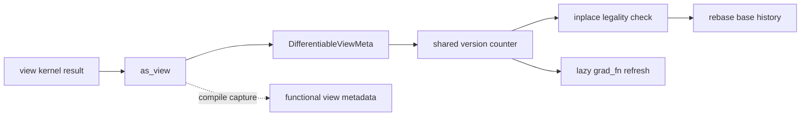

# A01 · Tensor、Storage、Layout 与 View：编译器看到的“值”不是一块内存

> 卷别：A · 执行模型前置基础  
> 固定源码：PyTorch `e8f97c1a6ef8cbcdd0a946606bc1e924e4f07e52`  
> 前置：Python 对象与基础张量操作  
> 后续：[[a02_operator_schema_dispatch_and_autograd_analysis]]  
> 最后更新：2026-07-28

## 1. 为什么端到端课程从 TensorImpl 开始

`torch.compile`最终优化的是 Tensor 计算，但“Tensor”至少同时承载四类事实：

1. 逻辑元素集合：dtype、device、sizes；
2. 从逻辑索引到地址的映射：strides、storage offset、layout；
3. 存储身份与容量：Storage、DataPtr、allocator、size bytes；
4. 变化与梯度历史：version counter、AutogradMeta、view relation。

若把这四类事实压成“一个数据指针”，编译器就无法判断：

- 两个 Tensor 是否 alias；
- 一个 view mutation 会影响谁；
- layout 能否满足某个 kernel；
- 输入是否仍满足已编译图的 guards；
- saved tensor 在 backward 前是否被原地修改。

**核心结论**：Tensor 是“带语义的索引视图”，Storage 才是可共享的存储身份；layout
决定如何解释 Storage，version/view metadata 决定共享后的 mutation 和 autograd 语义。

## 2. 四层对象模型

| 层 | 典型状态 | 解决的问题 |
|---|---|---|
| Python `torch.Tensor` | Python identity、subclass、hooks | 用户如何持有和扩展 Tensor |
| `TensorImpl` | Storage、dtype/device、sizes/strides/offset、version | 一个 Tensor 值如何解释存储 |
| `StorageImpl` | DataPtr、size bytes、allocator、resizable | 字节存储由谁拥有和释放 |
| Autograd view metadata | base、view function、creation metadata | alias mutation 如何更新梯度历史 |

`TensorImpl`直接保存 `Storage`，而 autograd metadata 是可空的独占指针；没有梯度信息的
Tensor 可以不分配完整 AutogradMeta（`c10/core/TensorImpl.h:2888-2914`）。
同一个 `TensorImpl`还保存 version counter、sizes/strides 和 storage offset
（`c10/core/TensorImpl.h:2919-2932`）。

这说明“值语义”不是 Storage 的附属注释，而是 TensorImpl 自己拥有的状态。

## 3. 地址映射为什么属于 TensorImpl

对普通 strided Tensor，逻辑索引
\((i_0,\ldots,i_{r-1})\)对应的元素偏移可写为：

\[
\operatorname{offset}
= s_0+\sum_{d=0}^{r-1}i_d\cdot stride_d
\]

其中 \(s_0\) 是 storage offset。实际字节地址还要乘 dtype item size。

因此，两个 Tensor 可以：

- 持有不同 TensorImpl；
- 具有不同 sizes、strides 和 offset；
- 却通过各自的 `Storage` 指向同一个 StorageImpl/DataPtr。

`TensorImpl::data()`实际在底层数据地址上增加 `storage_offset_`
（`c10/core/TensorImpl.h:1659-1666`）；sizes、strides 和 offset 的字段则位于
`TensorImpl`本体，而不是 StorageImpl。

### 为什么不把 stride 存在 Storage

一个 Storage 可以同时被 transpose、slice、narrow 等多个 view 解释。若 stride 属于
Storage，则同一存储只能有一种逻辑布局，无法表达多个 view。将 layout 放在 TensorImpl
允许多个逻辑 Tensor 共享存储而拥有不同索引函数。

## 4. StorageImpl 管什么

`StorageImpl`构造参数包括 size bytes、DataPtr、allocator 和是否可 resize；resizable
Storage 必须持有 allocator（`c10/core/StorageImpl.h:55-75`）。其核心字段包括
DataPtr、符号 size bytes、resizable flag、materialization hook 和 allocator
（`c10/core/StorageImpl.h:384-410`）。

Storage identity 不能简单替换成裸 `data_ptr` identity。源码注释列出两个 StorageImpl
指向同一 DataPtr 的风险：

- deleter/ownership 可能重复；
- Python deepcopy 按 storage equality 而非 data pointer equality；
- mutation/version tracking 可能断开。

对应说明见 `c10/core/StorageImpl.h:41-54`。

**设计原因**：DataPtr 是地址与释放能力，StorageImpl 是共享所有权和存储语义。编译器
做 alias/lifetime 判断时需要后者，不能只比较地址数值。

## 5. View 是共享 Storage 加额外语义

一个 view 至少包含两种关系：

1. **存储关系**：view 与 base 共享底层 Storage；
2. **autograd 关系**：梯度是否沿 view operation 回到 base。

二者不等价。源码明确区分 differentiable view 和 non-differentiable view：
后者仍可共享 storage/version counter，但梯度不沿 view relation 传播
（`torch/csrc/autograd/variable.h:645-664`）。

### DifferentiableViewMeta 保存什么

`DifferentiableViewMeta`分别保存 backward/forward view info，并在常见的二者相同时
只保留一份以减少对象数量（`torch/csrc/autograd/variable.h:721-736`）。
它还保存创建 `grad_fn` 时观察到的 `attr_version_`；当前 version 不同就意味着缓存的
`grad_fn`可能过期（`torch/csrc/autograd/variable.h:738-745`）。

构造 differentiable view 时，view TensorImpl 会共享 base 的 version counter
（`torch/csrc/autograd/variable.cpp:47-59`）。所以 base/view 任一可见 mutation 都能让
另一侧观察到版本变化。

## 6. Mutation 状态机

```text
创建 base
  → TensorImpl 持有 Storage + version v
创建 view
  → 新 TensorImpl
  → 共享 Storage
  → 共享或关联 version counter
执行 inplace
  → ADInplaceOrView / autograd wrapper 检查合法性
  → mutation 写入 Storage
  → version bump
后续访问 view grad_fn 或 saved tensor
  → 比较记录版本与当前版本
  → 更新历史或拒绝不安全执行
```

version counter 使用共享的原子计数对象。`bump()`在普通 Tensor 上增加版本；Inference
Tensor 在普通模式下禁止不安全 inplace，并且没有可读 version counter
（`c10/core/TensorImpl.h:390-416`）。

### 为什么 version counter 不能在 saved-for-backward 时再懒创建

源码注释给出的原因是 forward 的线程安全：多个线程可能在 forward 中同时保存同一
Tensor，懒初始化会引入竞态。因此普通 Tensor 需要在更早时建立可共享 version 状态
（`c10/core/TensorImpl.h:316-334`）。

## 7. View + inplace 为什么复杂

如果 base 被原地修改，view 的 `grad_fn`可能过期；如果 view 被修改，base 的历史又需要
rebase。源码因此要求：

- base inplace 后，访问 view grad_fn 时根据 version 重建；
- view inplace 后，`rebase_history()`更新 base；
- 单个 Node 的多个 view outputs 需要额外 creation metadata，避免错误丢弃原 grad_fn。

对应机制集中说明于 `torch/csrc/autograd/variable.h:605-622`。

这也是编译 pass 不能仅依据“输入和输出 shape 相同”把 view/inplace 随意替换的原因。
合法性还依赖 Storage alias、version 和 autograd creation context。

## 8. 这些事实如何进入编译器

| eager 状态 | 编译期常见表示 | 用途 |
|---|---|---|
| sizes/strides/offset | FakeTensor/meta、SymInt、layout | shape/layout guard 与 codegen |
| dtype/device | FakeTensor/meta | dispatch、lowering、kernel 选择 |
| Storage alias | functionalization alias info、mutation metadata | 合法改写、保序、复用 |
| version/mutation | guards、functionalization、runtime wrapper checks | saved tensor 与输入 mutation |
| Python Tensor identity | Source/guard | cache entry 是否适用 |

编译图中的 FX `Node`不是 TensorImpl，也不拥有 Storage。Node 只描述程序中的一次值产生；
`node.meta["val"]`通常是用来承载编译期属性的 FakeTensor。把 Node identity 当作 Storage
identity 会错误地合并别名或把 fresh value 当成原对象。

## 9. 为什么编译器倾向 functionalization

直接优化 mutation graph 会让每次移动、删除或融合都必须重新证明 Storage 与版本关系。
functionalization 尽量把 mutation 转成 functional value flow，再通过显式 mutation
outputs/runtime writeback 恢复用户可见语义。

它没有消除 alias/mutation 问题，而是把隐含 Storage side effect 转换为更容易分析的
图接口。最终 reinplace、buffer reuse 和 wrapper writeback 仍必须重新检查 layout、
liveness 与别名。

## 10. 复杂度与成本

设 Tensor rank 为 \(r\)，关联 alias/view 数为 \(a\)：

- 读取 dtype/device/storage identity 通常为常数级字段访问；
- 读取或比较完整 sizes/strides 为 \(O(r)\)；
- 计算连续性、可重排 layout 等一般至少扫描 rank，常为 \(O(r)\)；
- 单次 version bump 为 \(O(1)\)；
- 编译器建立完整 alias closure 的成本取决于 alias graph，而不是 TensorImpl 字段访问，
  可写为 \(O(V_a+E_a)\)。

不要把“version bump 是常数”外推成“mutation 合法性检查也是常数”；后者还包含 view、
effect、graph users 和 runtime ABI。

## 11. 常见误解

| 误解 | 修正 |
|---|---|
| Tensor 就是一块连续内存 | TensorImpl 用 sizes/strides/offset 解释 Storage |
| DataPtr 相同就足以表达 alias | Storage identity、ownership 和 version 也必须一致 |
| view 只是 metadata，不影响梯度 | differentiable view 还维护 base、grad history 和 version |
| FX Node 就是 runtime Tensor | Node 是程序值定义；runtime Tensor/Storage 是执行结果 |
| functionalization 后再也没有 mutation | mutation 被重编码，runtime writeback/reinplace 仍需恢复语义 |

## 12. 源码跟读：一个 view 如何从 Storage 关系进入 Autograd 与编译器

这一节沿着“创建 view → 共享版本 → inplace 检查 → 梯度历史重接 → 编译期显式化”走一遍。
目标不是背类名，而是确认一个关键事实：**view 语义同时跨越 TensorImpl、AutogradMeta
和编译期 alias 表示，任何一层单独存在都不足以保证改图正确。**



### 12.1 `as_view` 不是只返回一个共享 Storage 的 Tensor

Autograd 生成代码在 view kernel 得到结果后进入 `as_view`。入口首先区分 inference tensor：
inference mode 不需要追踪 differentiable view，因而可以直接返回原结果
（`torch/csrc/autograd/VariableTypeUtils.h:189-205`）。正常路径则读取 base 已有的
backward/forward view metadata；当 view-of-view 可以安全串联时，它把当前 view function
与原链组合，再调用 `make_variable_differentiable_view`
（`torch/csrc/autograd/VariableTypeUtils.h:207-225`）。

`make_variable_differentiable_view` 会确认新 Tensor 还没有 AutogradMeta，然后安装
`DifferentiableViewMeta`，而不是改写 kernel 已经创建的 TensorImpl
（`torch/csrc/autograd/variable.h:837-864`）。这解释了为什么“底层 Storage 已共享”和
“Autograd 知道它是哪个 base 的 view”是两种不同的关系：前者由 Tensor 实现承载，后者由
Autograd metadata 补齐。

### 12.2 version counter 为什么必须沿 alias 共享

`DifferentiableViewMeta` 构造时会标记 `is_view_`，并把当前变量的 version counter 指向
backward view base 的 counter，同时记录创建时的 `attr_version_`
（`torch/csrc/autograd/variable.cpp:42-59`）。因此，对 base 或任一共享 counter 的 view
做 inplace，其他 view 下次读取时能够观察到版本变化。

真正的 counter 接口位于 TensorImpl：可以设置、读取和 bump；inference tensor 在
inference mode 之外 bump 会报错（`c10/core/TensorImpl.h:2137-2159`）。Autograd 的
`set_version_counter` 与 `bump_version` 只是把操作转交给 TensorImpl
（`torch/csrc/autograd/variable.cpp:355-365`）。所以 counter 的所有权在 Tensor 实现层，
Autograd 用它检测自己记录的 view/梯度信息是否陈旧。

### 12.3 inplace 检查和 rebase 分别解决什么问题

写操作前，`check_inplace` 会根据 `can_mutate_inplace` 的结果区分普通可写、需要处理的
non-default backward view、leaf view 和 leaf Tensor；后两类在 grad mode 下直接报错
（`torch/csrc/autograd/VariableTypeUtils.h:67-82`）。它不是一般意义上的 alias analysis，
而是在当前 Autograd 规则下判断这次修改是否允许以及是否需要重接历史。

若修改的是 backward view，`rebase_history` 不会仅给这个 view 换 `grad_fn`。源码会在
base 上构造 `CopySlices`，把原 view 的 geometry、view function 和新 backward edge
编码进去，再把 hooks 移到新的节点
（`torch/csrc/autograd/variable.cpp:212-240`）。原因是后续梯度必须沿 base 的历史看见
这次写入；若只更新 view 对象，本来共享 base 的其他路径会得到不一致的梯度关系。

### 12.4 为什么 `grad_fn` 读取也可能触发修复

`VariableHooks::grad_fn` 对 backward view 比较当前 version 与 `attr_version_`。不相等时
调用 `handle_view_on_rebase`，再返回刷新后的 `grad_fn`
（`torch/csrc/autograd/variable.cpp:650-665`）。这是一种惰性一致性机制：mutation 通过
共享 counter 发出“历史可能失效”的信号，真正需要 Autograd 历史时再验证和重建。

由此也能解释编译器为什么不能把 version counter 简化成一个普通整数 guard：
counter 只负责暴露变化，合法性检查、历史重接和错误诊断仍依赖 view metadata 与创建上下文。

### 12.5 functionalization 把隐式关系改写成什么

编译捕获希望 pass 看到显式 value flow，而不是依赖运行时对象之间隐藏的 Storage/view
关系。functionalization 的 view fallback 会调用 functional view 表达，计算输出 stride；
若 symbolic stride 无法求出会明确报错，然后把 sizes/strides 写回包装结果
（`aten/src/ATen/FunctionalizeFallbackKernel.cpp:350-367`；
`aten/src/ATen/FunctionalizeFallbackKernel.cpp:369-383`）。

这一步不是删除 view 语义，而是把“这个对象悄悄共享了谁”转成可追踪的 functional
metadata 和 value relation。类似地，TensorImpl 的 shallow-copy/detach 路径仍必须决定
Python dispatch/subclass 参与方式，并显式设置 version counter
（`c10/core/TensorImpl.cpp:562-590`）。因此，编译期复制 metadata 或创建替代值时，也不能
默认“复制 TensorImpl 字段”就等价于复制完整 Tensor 语义。

### 12.6 跟读后应保留的设计结论

1. Storage alias 回答“数据可能共享”，DifferentiableViewMeta 回答“梯度历史如何关联”。
2. version counter 是跨 alias 的失效信号，不是 mutation 合法性的完整证明。
3. inplace 后需要把历史 rebase 到 base 可见的位置，不能只修改局部 view。
4. functionalization 的价值是把隐式对象关系提升为 pass 能分析的显式图关系。
5. 因此，FX Node identity、Tensor identity、Storage identity 和 Autograd view identity
   必须分别建模，任何两个都不能无条件互换。

## 配套 Demo

本页对应卷级入口 `labs/demo_a_execution_model.py` 的 `tensor_storage_layout` 用例。默认以 CUDA 为验收设备：

```powershell
python -B wiki\02_engineering\01_ai_frameworks\19_torch_compile_end_to_end\labs\demo_a_execution_model.py `
  --case tensor_storage_layout --device cuda `
  --output-dir wiki\02_engineering\01_ai_frameworks\19_torch_compile_end_to_end\labs\artifacts\volume_demos\a01
```

先用 `--list --json` 查看用例声明的能力要求。无 CUDA 的机器可把 `--device` 改为 `cpu` 探索设备无关机制；CUDA/Triton/多卡专属用例会返回 `BLOCKED`，且不会执行用例正文。不要把 `BLOCKED` 写成 `PASS`。

重点读取 `summary.json` 与 `tensor_storage_layout/result.json`：`status` 区分 `PASS/BLOCKED/FAIL`，`environment` 固化运行环境，`observations` 保存本页机制的实测字段，`artifacts` 指向图代码、日志、trace 或进程证据。`PASS` 只表示该次运行中的断言通过，不外推到其他 PyTorch 版本、shape、dtype 或硬件。

## Related Pages

- [[00_torch_compile_end_to_end_index]] — 六卷总索引
- [[a02_operator_schema_dispatch_and_autograd_analysis]] — operator/dispatcher/autograd
- [[19_torch_compile_end_to_end/03_graph_values_metadata_and_signatures]] — 图值与 metadata
- [[19_torch_compile_end_to_end/05_graph_effects_alias_mutation_and_order]] — alias、mutation 与 effect
- [[19_torch_compile_end_to_end/18_inductor_ir_values_loops_layouts_and_buffers]] — Inductor layout/storage
- [[00_tensor_and_storage/index]] — Tensor/Storage 领域资料
