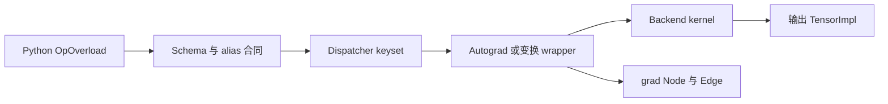
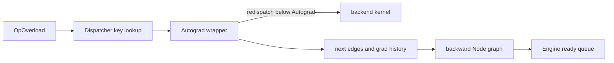

# A02 · Operator Schema、Dispatcher 与 Autograd：一次算子调用经过了哪些执行层

> 卷别：A · 执行模型前置基础  
> 固定源码：PyTorch `e8f97c1a6ef8cbcdd0a946606bc1e924e4f07e52`  
> 前置：[[a01_tensor_storage_layout_and_views_analysis]]  
> 后续：[[a03_python_frames_code_objects_and_bytecode_analysis]]  
> 最后更新：2026-07-28

## 1. 为什么要先拆开“算子执行”

用户写下：

```python
y = torch.ops.aten.add.Tensor(x, other)
```

这不是直接跳到一个 CPU/CUDA kernel。至少要区分：

```text
Python OpOverload
→ FunctionSchema / alias annotation
→ dispatcher key selection
→ Autograd / ADInplaceOrView 等 wrapper
→ backend kernel
→ eager autograd Node/Edge
```

编译系统会在其中不同层拦截：

- Dynamo 在 Python frame/bytecode 层；
- ProxyTensor/FakeTensor 在 dispatcher/Python dispatch mode 层；
- functionalization 在 dispatch transform 层；
- AOTAutograd 把 autograd 行为重新 trace 成 FX；
- Inductor 接收规范化后的 operator graph。

**核心结论**：operator schema 描述调用契约，dispatcher 选择“这一次调用由谁实现”，
autograd 则建立未来 backward 所需的动态图依赖。三者不能合并成一个 FX Node 概念。

## 2. OpOverload 是带 schema 的唯一 overload 对象

`OpOverload`同时保存：

- 底层 callable；
- 按 DispatchKey redispatch 的 callable；
- `FunctionSchema`；
- tags；
- overload packet/name。

对应字段见 `torch/_ops.py:837-865`。

构造时还会读取 schema arguments 的 alias information，区分只读 alias/view 与 write
alias（`torch/_ops.py:870-884`）。这意味着 schema 不只是参数类型说明，也携带 mutation/
alias 合同，是 functionalization、fake/meta、pass legality 的基础信息。

### 调用与 redispatch

`OpOverload.__call__()`最终调用其 `_op`；特殊 PyObject dispatcher 路径可以绕过 Python
fast path，直接使用保存的 C++ dispatcher handle（`torch/_ops.py:908-916`）。
`redispatch()`则显式携带剩余 keyset，用于 wrapper 消费自己的 key 后继续寻找下一实现
（`torch/_ops.py:920-925`）。

**为什么需要 redispatch**：Autograd、Functionalize、Fake、Proxy 等层都可能“包住”
真实 kernel。若 wrapper 再从完整 keyset 开始普通 dispatch，会重新命中自身并递归；
redispatch 让它从剩余 key 集继续。

## 3. Dispatcher 选择的是 kernel，不是图节点

boxed 调用时，Dispatcher：

1. 从 IValue stack 提取 DispatchKeySet；
2. 在 operator entry 中查最高优先级可用 kernel；
3. 可选地建立 RecordFunction；
4. 调用选中的 boxed kernel。

实现见 `aten/src/ATen/core/dispatch/Dispatcher.h:861-875` 和
`aten/src/ATen/core/dispatch/Dispatcher.h:879-902`。

typed redispatch 同样根据“当前剩余 keyset”查 kernel 并调用
（`aten/src/ATen/core/dispatch/Dispatcher.h:841-858`）。

因此同一个 operator overload 在不同调用中可能由不同实现处理：

- CPU/CUDA/PrivateUse1 backend；
- Autograd wrapper；
- Functionalize；
- Meta/Fake；
- Python/TorchDispatchMode；
- Composite fallback。

FX 中 `call_function(aten.add.Tensor, ...)`记录的是 operator target 和参数依赖，不固化
某次真实执行最终命中的全部 dispatch 层。

## 4. Autograd dispatch wrapper 做什么

以手写的 `copy_` autograd wrapper 为例，当前源码路径大致是：

```text
Autograd key 命中 VariableType::copy_
  → 判断是否需要 grad
  → 构造 CopyBackwards
  → collect_next_edges
  → AutoDispatchBelowAutograd
  → redispatch 到更低层实现
  → rebase_history
```

对应实现见 `torch/csrc/autograd/VariableTypeManual.cpp:201-215`。
Autograd wrapper 注册到 Autograd key
（`torch/csrc/autograd/VariableTypeManual.cpp:343-369`）；view/inplace 还有单独
`ADInplaceOrView`注册层（同文件 `:532-559`）。

### 为什么 Autograd 和 ADInplaceOrView 分层

- Autograd 负责梯度公式与 next edges；
- ADInplaceOrView 负责 version bump、view/inplace bookkeeping；
- inference/no-grad 等模式可能需要其中一部分而跳过另一部分。

若二者完全耦合，inference、functionalization 和 view-only tracking 很难只选择需要的
语义层。

## 5. eager autograd 的 Node 与 Edge

`Edge`不是普通“张量到张量”的数据边。它保存：

- 指向某个 autograd `Node`的 intrusive pointer；
- 该 Node 的某个 input number。

见 `torch/csrc/autograd/edge.h:13-38`。

`Node`构造时接收 `next_edges`，并据此更新拓扑编号；Node 不能 copy/move
（`torch/csrc/autograd/node.h:112-139`、`torch/csrc/autograd/node.h:141-146`）。
调用 Node 才会执行其 backward function
（同文件 `:152-175`）。

因此 eager backward graph 的语义是：

```text
当前 backward Node
  --next Edge-->
上游需要接收梯度的 backward Node/input slot
```

它不是 forward FX graph 的反向遍历视图，也不是 AOT partition 后的 bw FX Graph。

## 6. Engine 什么时候参与

forward operator 运行时只是在 Tensor 上逐步建立 autograd history。用户调用 backward/
grad 后，Engine 才从 roots/inputs 开始执行图：

- `Engine::execute()`沿 next-edge references 计算；
- `execute_with_graph_task()`运行已准备的 GraphTask/GraphRoot；
- `evaluate_function()`执行 ready Node 并调度后继。

入口声明见 `torch/csrc/autograd/engine.h:150-168` 和
`torch/csrc/autograd/engine.h:178-184`。

这形成两套不同生命周期：

| 阶段 | 创建/更新 | 何时发生 |
|---|---|---|
| eager forward | Tensor result、grad_fn、next edges、version | 每个 operator 调用 |
| eager backward | GraphTask、ready queue、InputBuffer、NodeTask | backward/grad 调用 |

## 7. 一次 eager operator 的状态变化



每一层读取和写回的状态不同：

| 层 | 主要读取 | 主要写回 |
|---|---|---|
| schema | 参数、alias annotation、tags | 参数规范与 mutation/view 分类 |
| dispatcher | tensor keyset、mode/TLS | 选择 kernel，消费 dispatch key |
| backend kernel | TensorImpl/Storage | 结果 Storage/TensorImpl 或 mutation |
| autograd wrapper | requires-grad、next edges、view/version | grad_fn、history、version |
| profiler hook | operator/schema/key/inputs | RecordFunction event |

## 8. 编译捕获点为什么有多个

### Dynamo：保留 Python 语义

Dynamo 在 operator 调用发生前后解释 Python bytecode，能看到模块、容器、控制流和普通
Python 值。代价是必须建模 Python 对象与 guards。

### ProxyTensor/FakeTensor：靠近 operator 语义

`__torch_dispatch__`层已经把大量 Python API 规范为 operator overload，适合记录 ATen
调用并传播 metadata；但它看不到所有 Python 控制流来源。

### AOTAutograd：重新表达 backward

AOTAutograd不是把 eager Node/Edge 直接序列化，而是在 trace 环境中运行 forward 和
autograd，得到可编译的 joint/fresh FX Graph。

**为什么没有一个万能捕获层**：越靠上，Python 语义越完整但 operator 规范度越低；
越靠下，operator 更稳定但 Python 结构已经丢失。多层捕获是信息与可编译性的权衡。

## 9. Schema 对图改写的意义

一个 pattern 命中 `aten` target，只证明 operator 名称和参数结构匹配。合法替换还需要：

- schema mutation/alias annotation；
- dtype/device/layout；
- autograd formula；
- effect/RNG；
- dynamic shape conditions；
- backend support。

`OpOverload`从 schema alias info 推导 view 属性的实现
（`torch/_ops.py:873-884`）说明 alias 不是后端随意猜测的附加信息，而属于 operator
contract。

## 10. 复杂度

设一次 operator 有 \(k\) 个参数，autograd graph 有 \(V_g\) 个 Node、\(E_g\) 条 Edge：

- schema 参数/alias 扫描为 \(O(k)\)；
- dispatcher key selection 的成本受固定宽度 DispatchKeySet 和注册表查找约束，不能用
  graph size 表示；
- 创建 backward Node 的 next edges 为 \(O(k_r)\)，其中 \(k_r\) 是相关 requires-grad
  inputs；
- Engine 依赖构造与一次完整 backward 调度至少与可达 \(V_g+E_g\) 成正比，kernel
  计算成本另计；
- 编译 capture 的额外成本取决于 Python instructions 和 operator 次数，不等于单个
  dispatcher lookup 成本。

## 11. 常见误解

| 误解 | 修正 |
|---|---|
| 调用 `aten.add`就是调用 CUDA kernel | 先经过 dispatcher 和可能的 wrapper/fallback |
| schema 只描述类型 | 还包含 overload、alias、write/view 等契约 |
| Autograd Edge 就是 FX data edge | Edge 指向 backward Node 的 input slot |
| AOT bw graph 是 eager Node 图的拷贝 | AOT 在 trace 中重新构造 joint，再提取 fresh FX Graph |
| 一个 operator 永远对应一个 kernel | dispatch key、backend、mode 和 fallback 都可改变实现 |

## 12. 源码跟读：一次 ATen 调用如何穿过 Dispatcher、Autograd 与 Engine

这一节选取手写 Autograd wrapper 作为可见样本，把 forward 调用和 backward 执行接起来。
手写 wrapper 不是所有 operator 的统一实现；大量 wrapper 由生成器产生。但它完整暴露了
生成代码同样需要遵循的契约，因此适合观察层次边界。



### 12.1 Python `OpOverload` 保存的是可分派 operator 句柄

`OpOverload.__call__` 根据当前状态选择直接调用缓存的 C++ dispatch handle，或进入
Python-side `_op`；`redispatch` 则显式带着剩余 DispatchKeySet 调用同一个 operator
（`torch/_ops.py:908-926`）。因此，FX 图上常见的 `torch.ops.aten.*` target 不是某个
CUDA kernel 的函数指针，而是带 schema/overload 身份、还能继续分派的 operator 对象。

进入 C++ 后，`TypedOperatorHandle::call` 和 `redispatch` 把类型安全参数转交给 Dispatcher
（`aten/src/ATen/core/dispatch/Dispatcher.h:614-634`）。redispatch 从给定 keyset 中查找
下一实现并调用 kernel（`aten/src/ATen/core/dispatch/Dispatcher.h:843-858`）；boxed 路径
也会先从参数提取 dispatch keyset，再完成 lookup
（`aten/src/ATen/core/dispatch/Dispatcher.h:861-884`）。这就是 wrapper 能“处理一次语义，
再继续走更低层实现”而不递归命中自己的基础。

### 12.2 Autograd wrapper 本身也是 Dispatcher 选中的 kernel

手写 `_fw_primal` wrapper 展示了典型结构：先判断输出是否需要梯度，必要时创建
`Identity` backward Node 并收集 next edges；随后在排除 Autograd keys 的 guard 下
redispatch；最后给输出安装 history
（`torch/csrc/autograd/VariableTypeManual.cpp:123-139`）。

这段顺序很重要：Autograd 不是在 backend kernel 之后扫描结果、凭空恢复输入关系；wrapper
在调用 lower kernel 前已经保存了构建 backward edge 所需的输入语义，kernel 返回后再把
输出与新 Node 连接。

`compute_requires_grad` 会先尊重全局 GradMode，再扫描参数是否需要梯度；
`set_history` 为 Node 添加 output metadata，并把 Tensor 的 gradient edge 指向该 Node
（`torch/csrc/autograd/functions/utils.h:59-84`）。所以 `requires_grad=True` 只是建图条件，
真正的依赖关系由 Node 的 next edges 与输出 gradient edge 共同组成。

### 12.3 mutation operator 为什么多出 inplace 检查和 rebase

`copy_` wrapper 先 unpack 输入并计算梯度需求，然后调用 `check_inplace`；需要建图时创建
`CopyBackwards`、设置 next edges，redispatch 执行真实写入，最后对被修改 Tensor
`rebase_history`（`torch/csrc/autograd/VariableTypeManual.cpp:196-215`）。

这比 functional operator 多出的步骤不是实现噪声。写操作保留了 Python 对象和 Storage，
却改变了它的数学历史；因此旧 gradient edge 不能原样继续代表“当前值从哪里来”。编译器
若把 mutation 改写为 functional op，也必须在图 ABI 或 runtime writeback 中恢复同一可见
语义。

### 12.4 backward 调用不是沿 FX Graph 反向遍历

当用户触发 backward 时，`Engine::execute` 接收 root edges、inputs、是否保留图以及
是否创建高阶图等参数，并验证执行契约
（`torch/csrc/autograd/engine.cpp:1294-1320`）。它为 root gradients 创建 InputBuffer，
交给 `execute_with_graph_task`，然后等待 future 完成
（`torch/csrc/autograd/engine.cpp:1382-1402`）。

执行线程和设备队列会按需初始化；root 被封装为 `NodeTask` 放入相应 ready queue
（`torch/csrc/autograd/engine.cpp:1418-1444`）。之后是 backward Node/Edge 图上的依赖调度，
不是把 forward FX Node 做一次逆拓扑循环。AOTAutograd 后续会通过 tracing **重新表达**
这段计算，才得到可交给编译器的 backward FX Graph。

### 12.5 跟读后应区分的三种“边”

| 关系 | 产生位置 | 语义 |
|---|---|---|
| Dispatcher redispatch | wrapper 到下一 dispatch key | 选择下一层 operator 实现 |
| Autograd Edge | output gradient edge / Node next edge | backward value 应送到哪个 Node input |
| FX data edge | Node 参数引用另一个 Node | 编译 IR 中值定义与使用 |

三者都可能在一次算子附近出现，但对象、所有者和生命周期不同。pattern 匹配 ATen target
只是在 FX data graph 上匹配 operator 结构；它不会自动证明 Autograd Edge、mutation
history 或 dispatch behavior 也保持不变。

## 配套 Demo

本页对应卷级入口 `tools/labs_torch_compile/demo_a_execution_model.py` 的 `dispatcher_autograd` 用例。默认以 CUDA 为验收设备：

```powershell
python -B tools\labs_torch_compile\demo_a_execution_model.py `
  --case dispatcher_autograd --device cuda `
  --output-dir tools\labs_torch_compile\artifacts\volume_demos\a02
```

先用 `--list --json` 查看用例声明的能力要求。无 CUDA 的机器可把 `--device` 改为 `cpu` 探索设备无关机制；CUDA/Triton/多卡专属用例会返回 `BLOCKED`，且不会执行用例正文。不要把 `BLOCKED` 写成 `PASS`。

重点读取 `summary.json` 与 `dispatcher_autograd/result.json`：`status` 区分 `PASS/BLOCKED/FAIL`，`environment` 固化运行环境，`observations` 保存本页机制的实测字段，`artifacts` 指向图代码、日志、trace 或进程证据。`PASS` 只表示该次运行中的断言通过，不外推到其他 PyTorch 版本、shape、dtype 或硬件。

## Related Pages

- [[00_torch_compile_end_to_end_index]]
- [[a01_tensor_storage_layout_and_views_analysis]] — Tensor/Storage/view
- [[a03_python_frames_code_objects_and_bytecode_analysis]] — Python frame 捕获边界
- [[a04_dispatch_modes_proxy_tensor_and_fake_tensor_analysis]] — dispatch mode 与 fake/proxy
- [[19_torch_compile_end_to_end/01_graph_ir_motivation_and_taxonomy]] — 不同图类型
- [[19_torch_compile_end_to_end/09_aotautograd_joint_forward_backward_graphs]] — AOT fw/bw
- [[01_eager_runtime/02_dispatcher_and_device/index]] — Dispatcher 领域资料
- [[01_eager_runtime/05_autograd_engine/index]] — eager autograd 领域资料
