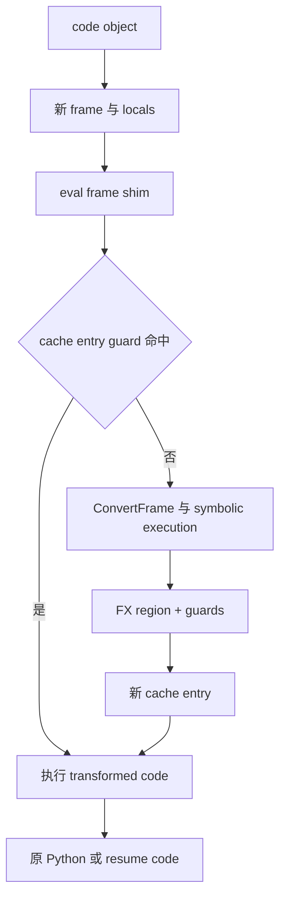

# A03 · Python Frame、Code Object 与 Bytecode：Dynamo 为什么从这里捕获

> 卷别：A · 执行模型前置基础  
> 固定源码：PyTorch `e8f97c1a6ef8cbcdd0a946606bc1e924e4f07e52`  
> 前置：[[a02_operator_schema_dispatch_and_autograd_analysis]]  
> 后续：[[a04_dispatch_modes_proxy_tensor_and_fake_tensor_analysis]]  
> 最后更新：2026-07-28

## 1. 为什么不只在 Tensor operator 层追踪

模型代码里决定计算的不只有 Tensor operator：

```python
if x.shape[0] > limit:
    y = self.large_path(x)
else:
    y = self.small_path(x)
return {"value": y, "tag": self.mode}
```

operator dispatch 能看到实际执行的 Tensor op，却无法独立还原：

- 哪条 Python `if`选择了路径；
- `self.mode`来自哪个对象属性；
- dict/tuple 如何构造；
- 函数调用是内联、跳过还是 graph break；
- 执行结束后从哪条指令继续。

**核心结论**：Dynamo 选择 Python frame/bytecode，是为了在执行 Tensor op 的同时保留
Python 控制流、对象来源和恢复点；代价是它必须实现一套 Python 字节码的符号解释器。

## 2. Code object、frame 与 instruction

| 对象 | 生命周期 | 关键状态 |
|---|---|---|
| code object | 函数实现可复用 | bytecode、consts、names、varnames、flags、line table |
| frame | 一次具体调用 | code、locals/globals/builtins、value stack、instruction offset |
| instruction | code 中的一个操作 | opcode、arg、offset、jump target、source position |
| transformed code | 某组 guards 下的可执行替代 | compiled subgraph calls、resume calls、原 Python 残余 |

同一 code object 可以产生许多 frame；每个 frame 有不同 inputs/locals，但 bytecode
结构相同。这正好对应“同一程序结构，按输入 guard 选择多个 specialization”。

## 3. eval-frame hook 是什么

PyTorch C 扩展保存原有 eval-frame function，并在启用 Dynamo 时把 interpreter 的 frame
evaluator 换成 `dynamo_custom_eval_frame_shim`
（`torch/csrc/dynamo/eval_frame.c:226-253`）。

未处理或禁用时，shim 可以转回之前 evaluator 或 CPython default evaluator
（同文件 `:233-244`）。因此 Dynamo 不是替换整个 Python interpreter，而是在 frame
进入执行时获得一次“使用原代码还是转换代码”的选择权。

### callback 的三种状态

`set_eval_frame`源码给出：

- `None`：关闭 Dynamo；
- `False`：run-only，只复用已有编译；
- Python callable：启用转换。

见 `torch/csrc/dynamo/eval_frame.c:616-638`。参数必须是这三类之一
（同文件 `:652-663`）。

这比一个简单的 on/off flag 更强：系统可以停止产生新 specialization，但继续使用
已存在的 compiled entries。

## 4. 为什么 cache 属于 code object

Dynamo cache 是 linked list；每个 entry 包含 guard manager、输出 code 和 next pointer，
并存储在 `f_code`的 `co_extra`空间。frame 调用时遍历 entries，逐个运行 guards；
没有命中才重新编译并增加 entry
（`torch/_dynamo/cache_size.py:13-21`）。

所以要区分：

- **code identity**：哪个 Python 程序共享 cache；
- **frame state**：本次 locals/globals/inputs 是什么；
- **cache entry**：哪组 guards 与 transformed code 配对；
- **compiled callable/cache**：transformed code 内部调用的图产物。

公开 API 说明也明确指出 cache 是 per-code-object，而不是 per-frame
（`torch/__init__.py:3157-3166`）。

### 为什么不是给每个 frame 单独缓存

frame 是一次调用的临时执行状态，调用结束即失去复用价值。code object 才能让后续调用
用 guards 判断是否可重用。若 cache 挂在 frame 上，每次调用都会冷启动；若全局只按函数
名字缓存，又会混淆闭包、代码重定义和不同 code identity。

## 5. Dynamo 的 mutable Instruction

PyTorch 定义的 `Instruction`是 `dis.Instruction`的可变版本，除 opcode/opname/arg/offset
外，还显式保存 jump target 和 exception table entry
（`torch/_dynamo/bytecode_transformation.py:71-95`）。

使用对象 target 而不是只保存原始字节 offset，可以在插入/删除指令后重新计算跳转。
Instruction equality 采用 identity，也符合“这是可重写程序位置，不是按字段合并的值”。

## 6. 从 code object 到可重写 instructions

`cleaned_instructions()`先从缓存取标准化 instructions，再 clone 一份，因为后续转换会
原地修改 instruction array
（`torch/_dynamo/bytecode_transformation.py:1899-1909`）。

缓存构建路径：

```text
code object
  → dis.get_instructions
  → convert_instruction
  → line number propagation
  → exception table / jump virtualization
  → strip extended args
```

见 `torch/_dynamo/bytecode_transformation.py:1944-1959`。

“virtualize jump”的意义是把原始数字 offset 变成 Instruction target；真正重新组装前再
根据新位置 devirtualize。

## 7. 代码重写状态机

`transform_code_object()`执行：

1. 从原 code object复制 code options；
2. 生成 cleaned instructions；
3. 运行 transformations；
4. 清理并重新 assemble；
5. 返回新 code object和 tracer output。

对应入口见 `torch/_dynamo/bytecode_transformation.py:1824-1845`。

assemble 前要：

- 检查 exception table；
- 修复 locals；
- 重复更新 offsets、devirtualize jumps、修复 extended args，直到 offset 稳定；
- 重建 bytecode、line table、stack size 和 exception table。

实现见 `torch/_dynamo/bytecode_transformation.py:1848-1875`。

**设计原因**：插入一个 compiled-graph call 可能改变后续 instruction offsets；offset
变化又可能使 jump 参数需要更多字节。一次线性写出不能保证稳定，因此要迭代修复布局。

## 8. 符号解释器必须保存哪些 frame 状态

InstructionTranslator初始化时保存：

- `symbolic_locals` / `symbolic_globals`；
- value `stack`；
- instruction pointer/current instruction；
- block stack、active context managers、exception VT stack；
- original `f_locals/f_globals/f_builtins`；
- code options 与 `f_code`。

源码位置：

- mutable execution state：`torch/_dynamo/symbolic_convert.py:5377-5401`；
- instructions 与 frame namespaces：同文件 `:5410-5422`。

这不是把 Python VM 全部复制一遍，而是保存“继续解释、回滚 speculation、生成 residual
bytecode 和 resume function”所需的最小状态集合。

## 9. 一次 frame 调用的端到端形态



注意：transformed code 不是“整函数机器码”。它仍是 Python code object，只是把可编译
region 替换成对 compiled callable 的调用，并保留/生成必要的 Python residual path。

## 10. 为什么 graph break 需要 bytecode 层

graph break 的目标不是简单停止 tracing，而是：

1. 编译 break 之前已积累的 FX region；
2. 在原 Python 语义下执行不支持的部分；
3. 恢复 value stack、locals、context managers；
4. 从准确的 bytecode offset 继续捕获。

只有 operator trace 没有 instruction pointer、stack 和 control context，无法生成正确
resume program。卷 B08 会继续追踪 `ContinueExecutionCache`。

## 11. 不变量与失败边界

- transformed code 的 locals 数必须与 `co_varnames`一致；
- jump target 必须引用当前 instruction array；
- exception table entries 必须有效；
- stack-size analysis 必须覆盖重写后控制流；
- generator/coroutine 的 resume 语义有额外限制；
- code object/cache identity 不能用函数名代替；
- Python 版本改变 opcode/exception-table 格式，源码结论必须绑定版本与 commit。

## 12. 复杂度

设 code object 有 \(I\) 条 instructions、cache entries 数为 \(C\)：

- 初次 disassemble/standardize 为 \(O(I)\)，可由 cleaned-instruction cache 复用；
- 每次 transformation 至少读取/修改 \(O(I)\)；
- offset/extended-arg fixpoint 若迭代 \(q\) 次，为 \(O(qI)\)；
- cache lookup 最坏运行 \(C\) 组 guard managers；guard 内部成本另按 guard 数和表达式计算；
- frame symbolic execution 的主干与实际解释的 instructions/inline calls 成正比，Tensor
  kernel 成本不在这部分。

## 13. 常见误解

| 误解 | 修正 |
|---|---|
| `torch.compile(fn)`立即编译函数 | wrapper 创建与首次 frame 执行是两个时刻 |
| cache 挂在每次 frame 上 | compiled entries 挂在 code object 的 `co_extra` |
| Dynamo 只记录 Tensor op | 它符号执行 Python instructions 和对象状态 |
| graph break 后从函数头重来 | resume code 从保存的 program point 恢复 |
| transformed code 就是 native kernel | 它是调用 compiled regions 的新 Python code object |

## 14. 源码阅读顺序

```text
torch/csrc/dynamo/eval_frame.c
  → torch/_dynamo/cache_size.py
  → torch/_dynamo/bytecode_transformation.py
  → torch/_dynamo/convert_frame.py
  → torch/_dynamo/symbolic_convert.py
```

先确认 frame hook 和 cache ownership，再读 instruction rewrite，最后进入符号状态机；从
InstructionTranslator 孤立开始会看见大量 opcode handler，却不知道它们最终要生成什么。

## 配套 Demo

本页对应卷级入口 `labs/demo_a_execution_model.py` 的 `python_frame_bytecode` 用例。默认以 CUDA 为验收设备：

```powershell
python -B wiki\02_engineering\01_ai_frameworks\19_torch_compile_end_to_end\labs\demo_a_execution_model.py `
  --case python_frame_bytecode --device cuda `
  --output-dir wiki\02_engineering\01_ai_frameworks\19_torch_compile_end_to_end\labs\artifacts\volume_demos\a03
```

先用 `--list --json` 查看用例声明的能力要求。无 CUDA 的机器可把 `--device` 改为 `cpu` 探索设备无关机制；CUDA/Triton/多卡专属用例会返回 `BLOCKED`，且不会执行用例正文。不要把 `BLOCKED` 写成 `PASS`。

重点读取 `summary.json` 与 `python_frame_bytecode/result.json`：`status` 区分 `PASS/BLOCKED/FAIL`，`environment` 固化运行环境，`observations` 保存本页机制的实测字段，`artifacts` 指向图代码、日志、trace 或进程证据。`PASS` 只表示该次运行中的断言通过，不外推到其他 PyTorch 版本、shape、dtype 或硬件。

## Related Pages

- [[00_torch_compile_end_to_end_index]]
- [[a02_operator_schema_dispatch_and_autograd_analysis]] — operator 执行层
- [[a04_dispatch_modes_proxy_tensor_and_fake_tensor_analysis]] — operator-level transform
- [[b03_eval_frame_callback_and_code_cache_analysis]] — eval-frame 与 cache 深入
- [[b04_instruction_translator_and_bytecode_state_machine_analysis]] — 符号解释器
- [[b08_graph_break_resume_functions_and_partial_graphs_analysis]] — resume code
- [[02_dynamo/index]] — Dynamo 领域资料
