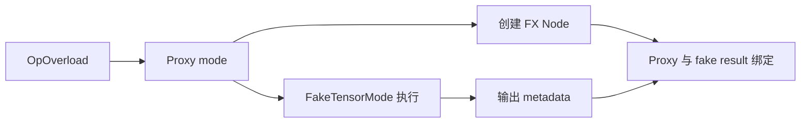
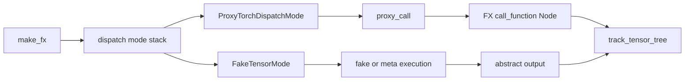

# A04 · Dispatch Modes、ProxyTensor 与 FakeTensor：记录计算和推导属性为什么分成两套机制

> 卷别：A · 执行模型前置基础  
> 固定源码：PyTorch `e8f97c1a6ef8cbcdd0a946606bc1e924e4f07e52`  
> 前置：[[a03_python_frames_code_objects_and_bytecode_analysis]]  
> 后续：[[a05_eager_capture_compile_and_replay_cost_model_analysis]]  
> 最后更新：2026-07-28

## 1. 四个名字解决四类问题

编译资料常把这些机制统称为“fake/proxy tracing”：

- `__torch_function__`
- `__torch_dispatch__` / `TorchDispatchMode`
- `ProxyTensor` / `ProxyTorchDispatchMode`
- `FakeTensor` / `FakeTensorMode`

它们实际位于不同抽象层：

| 机制 | 拦截对象 | 主要目的 |
|---|---|---|
| `__torch_function__` | public Python API | Tensor-like Python 类型覆盖 |
| `__torch_dispatch__` | dispatcher-visible operator | Tensor subclass/底层 operator 变换 |
| `TorchDispatchMode` | 动态作用域内 operator | 不包装所有输入也能全局拦截 |
| Proxy | operator call 与参数关系 | 创建 FX Node、追踪数据依赖 |
| FakeTensor | 无真实数据的 Tensor metadata | 推导 shape/dtype/device/stride 等属性 |

**核心结论**：Proxy 回答“这次 operator 在图里是什么”，FakeTensor 回答“该 operator 的
输出具有什么 Tensor 属性”。记录关系与计算属性是两种状态，不能由同一个对象隐式承担。

## 2. `__torch_function__`：public API override

`handle_torch_function()`先收集相关参数中的 overloaded types，再处理 mode 或逐个调用
对象的 `__torch_function__`
（`torch/overrides.py:1722-1745`、`torch/overrides.py:1763-1785`）。

它保留 public API identity，所以适合：

- ndarray-like/custom Tensor Python 类型；
- 希望按 `torch.add`、`torch.nn.functional.*` 等 API 覆盖行为；
- API 层类型协商。

但 public API 不一定与最终 ATen overload 一一对应；Python composite 函数可能展开成
多个 operator。因此编译器需要更低层的 operator interception。

## 3. `TorchDispatchMode`：动态作用域

`TorchDispatchMode`允许在 `with mode:`作用域里覆盖所有可 dispatch operator，而不要求
把 inputs 包成 Tensor subclass。源码列出的典型用途包括：

- factory function 没有 Tensor input；
- 记录全部中间计算；
- 显式控制多个 subclass/mode 的执行顺序。

见 `torch/utils/_python_dispatch.py:72-100`。

Modes 组成 stack；mode 内再次调用 PyTorch API 默认继续到下一 mode，而不是自动递归当前
mode。`supports_higher_order_operators`默认 false，说明普通 operator interception 不自动
获得 HOP 语义（同文件 `:102-115`）。

### 为什么需要 mode，而不只用 Tensor subclass

factory op 如 `torch.empty()`没有现成 Tensor argument，subclass 的
`__torch_dispatch__`无法由输入触发。动态 mode 让基础设施在整个作用域拦截此类调用。

## 4. FakeTensor：没有数据，不等于只有 meta device

FakeTensor以 meta tensor 为计算基础，但额外保存 `fake_device`，从而模拟真实 device
propagation；普通 meta tensor 本身不能表达“若真实执行会在 CUDA/CPU”
（`torch/_subclasses/fake_tensor.py:834-846`）。

FakeTensor还可以保存：

- 所属 FakeTensorMode；
- constant/real tensor 旁路信息；
- symbolic scalar memo；
- 原 Python type 与 dispatch keys。

对应字段见同文件 `:843-870`。

### FakeTensorMode 的 owner 状态

FakeTensorMode持有：

- dispatch cache/hit/miss/bypass；
- epoch；
- static-shape policy；
- `ShapeEnv`；
- 是否允许 fallback kernel/non-fake input；
- nested tensor id 状态。

见 `torch/_subclasses/fake_tensor.py:1526-1549` 和
`torch/_subclasses/fake_tensor.py:1550-1556`。

每次 retrace 同一个 mode 要推进 epoch，避免错误复用 unbacked-symbol memo
（同文件 `:1531-1546`）。所以 FakeTensor 不是无状态的“空 Tensor”；mode identity 和
epoch 会影响符号属性的安全复用。

## 5. ProxyTensor：真实/fake result 与 Proxy 的配对

Proxy tracing 需要同时维护：

```text
inner result
↔ FX Proxy
↔ tracer
↔ constant/meta/unbacked bindings
```

`track_tensor_tree()`对结构化 result 逐项把 Tensor/SymInt 等结果绑定到 Proxy，并把
metadata写入 Proxy；unbacked bindings 只在最外层设置一次，避免一个 symbol 对应多次
binding（`torch/fx/experimental/proxy_tensor.py:934-954`、
`torch/fx/experimental/proxy_tensor.py:956-971`）。

这说明“输出是 tuple”时也不是一个 Proxy 简单包住全部 runtime objects；树结构、
getitem/projection 和 symbol binding 都需要稳定映射。

## 6. ProxyTorchDispatchMode 的执行链

构造 Proxy mode 时保存 tracer、tracing mode、pre-dispatch policy、decomposition table
和 HOP subgraph cache
（`torch/fx/experimental/proxy_tensor.py:2102-2126`、
`torch/fx/experimental/proxy_tensor.py:2127-2142`）。

其 `__torch_dispatch__()`接收 `OpOverload`、args/kwargs，并进入 `proxy_call()`：

```text
dispatcher 命中 Proxy mode
  → ProxyTorchDispatchMode.__torch_dispatch__
  → proxy_call
  → 根据 decomposition/constant/data-dependent policy 处理
  → 创建 FX Proxy/Node
  → 执行 fake/inner operator取得 metadata result
  → track_tensor_tree 绑定 result 与 proxy
```

入口见 `torch/fx/experimental/proxy_tensor.py:2147-2161`。

## 7. 为什么 Proxy 和 Fake 常一起出现

只使用 Proxy：

- 能记录 `aten.add(x, y)`；
- 但不一定知道输出 shape/stride/device；
- 后续依赖这些属性的 Python/meta 逻辑无法继续。

只使用 FakeTensor：

- 能在不分配真实数据的情况下执行 meta kernels并得到输出属性；
- 但没有 FX Proxy 就没有持久化 program dependency graph。

组合后：



**设计原因**：图记录和抽象执行可以独立演进。Proxy tracer关心 program representation；
FakeTensorMode关心 operator semantics、symbolic shapes 和 device propagation。

## 8. 与 Dynamo 的关系

Dynamo不是用 ProxyTensor替代 Python symbolic interpreter：

- InstructionTranslator建模 Python stack/locals/control flow；
- VariableTracker建模 Python/Tensor values；
- OutputGraph/SubgraphTracer生成 FX；
- FakeTensor为 TensorVariable提供 metadata execution；
- operator-level modes处理 decomposition/functionalization 等变换。

也就是说，Dynamo位于更高的 Python program 层，但会复用较低层的 FakeTensor/FX 工具。
把 Dynamo 简化成“一个 TorchDispatchMode”会丢失 graph break、resume bytecode、guards
和 Python object state。

## 9. Decomposition 放在哪里

ProxyTorchDispatchMode持有 decomposition table
（`torch/fx/experimental/proxy_tensor.py:2115-2136`）。当某 operator有 decomposition，
tracer可以记录更基础的 operator序列；没有或不应分解时则记录原 target。

decomposition不是“FakeTensor算 shape”的同义词：

- decomposition 改变图的 operator粒度；
- fake/meta execution 推导每个 operator 的抽象结果；
- functionalization 改变 mutation/view 表达；
- Proxy 负责把最终选择记录为图。

顺序不同会产生不同 target、alias 表达和 pattern surface。

## 10. 数据相关 operator 的边界

FakeTensor没有真实 data。若输出 shape/value取决于 Tensor 内容，例如某些 `nonzero`、
`.item()`路径，系统必须：

- 创建 unbacked symbolic value；
- 使用 memo/constraint；
- graph break；
- 或在允许且安全时 fallback 到真实 kernel。

Proxy mode构造参数包括 `_error_on_data_dependent_ops`
（`torch/fx/experimental/proxy_tensor.py:2108-2123`），说明是否拒绝这类操作是显式策略，
不是所有 tracing mode 的统一行为。

## 11. 状态与所有权

| 状态 | Owner | 生命周期 |
|---|---|---|
| mode stack | thread-local dispatch infrastructure | 动态作用域 |
| fake tensor memo/cache/ShapeEnv | FakeTensorMode | 一次或多次相关 trace |
| proxy slot | traced value + tracer relation | 当前 trace |
| FX Graph/Node | tracer/GraphModule | trace 产物 |
| constant real value | FakeTensor/Proxy metadata | 条件允许时 |
| unbacked symbol bindings | ShapeEnv/proxy metadata | symbolic trace 与 guards/runtime asserts |

跨 trace 复用 FakeTensorMode 时必须尊重 epoch；跨 Graph 也不能按 Proxy object identity
推断值相同。

## 12. 复杂度

设一次 operator 的 pytree 输出有 \(m\) 个 leaves：

- mode stack dispatch 深度与激活 modes/subclasses 数相关；
- fake/meta kernel 成本通常远低于真实 Tensor data kernel，但仍取决于 operator metadata
  算法，不保证常数；
- `track_tensor_tree`遍历输出结构为 \(O(m)\)；
- decomposition展开为 \(d\) 个 operator 时，trace/node/meta 成本按 \(d\) 增长；
- dispatch cache 可以跳过重复 fake dispatch构造，但 key 生成与 cache bypass 仍有成本。

不能从“没有真实数据”推断 trace 免费；复杂 shape algebra、decomposition 和 Python
object modeling 仍可能主导 compile latency。

## 13. 常见误解

| 误解 | 修正 |
|---|---|
| FakeTensor 就是 meta Tensor | 它还模拟 fake device、ShapeEnv、mode/cache 等状态 |
| ProxyTensor 自己计算 shape | shape/dtype/device 通常来自 fake/meta execution |
| `__torch_function__`和 `__torch_dispatch__`相同 | 前者偏 public API，后者偏 operator dispatcher |
| TorchDispatchMode 必须包装 inputs | mode 是动态作用域，能拦截 factory op |
| Dynamo 就是 ProxyTorchDispatchMode | Dynamo还解释 Python bytecode、objects、guards 和 resume |

## 14. 源码跟读：`make_fx` 如何协同 Proxy 与 Fake 两套状态

Proxy 和 Fake 同时出现不是重复 tracing。Proxy 回答“这次 operator 在 FX 图中依赖谁”，
Fake 回答“若不运行真实 data kernel，输出的 shape、stride、dtype 和 device 是什么”。
`make_fx` 把两者放进同一动态作用域，再把两类结果绑定到同一输出树。



### 14.1 mode 是线程动态作用域，不要求预先包装所有输入

`TorchDispatchMode` 的注释说明 mode 在 operator dispatch 时生效，尤其能拦截没有 Tensor
输入的 factory function；多个 mode 以栈形式组合
（`torch/utils/_python_dispatch.py:72-100`）。进入 mode 时会更新相关 flags 并 push 到
mode stack（`torch/utils/_python_dispatch.py:146-175`），退出时恢复原状态
（`torch/utils/_python_dispatch.py:177-184`）。

因此，mode 的 owner 是当前动态执行上下文，不是某个 FX Node。这个设计让 tracing
能够看到 `torch.ones(...)` 一类尚无可包装输入的调用，也意味着嵌套 mode 的入栈顺序会
改变实际拦截链。

### 14.2 FakeTensorMode 维护抽象执行状态

FakeTensorMode 持有 cache、cache epoch 与相关状态
（`torch/_subclasses/fake_tensor.py:1526-1548`）。Fake Tensor 的
`__torch_dispatch__` 把 operator 转回所属 mode 的 dispatch
（`torch/_subclasses/fake_tensor.py:1692-1708`）；mode 再选择 meta handler、
直接实现或 cache 路径（`torch/_subclasses/fake_tensor.py:2464-2492`）。

这里的产物仍然是可供 Python 代码使用的 Tensor-like abstract value，而不是 FX Node。
它保留足够的 tensor metadata 让后续 operator 继续传播，但没有真实设备 data 可供任意
data-dependent 分支读取。

### 14.3 ProxyTorchDispatchMode 维护图关系与 tracing 策略

Proxy mode 构造时持有 tracer、decomposition table、是否允许 data-dependent operator
等策略（`torch/fx/experimental/proxy_tensor.py:2108-2137`）。它的
`__torch_dispatch__` 进入 `proxy_call`；进入 mode 时还会把自己注册为 infra mode
（`torch/fx/experimental/proxy_tensor.py:2148-2167`）。

`proxy_call` 首先校验类型并尝试 decomposition
（`torch/fx/experimental/proxy_tensor.py:1278-1308`），然后从输入提取 proxies，
处理 data-dependent 策略与相应错误
（`torch/fx/experimental/proxy_tensor.py:1334-1361`）。这说明 decomposition 发生在
图节点最终落定前；同一 eager operator 在不同 decomposition policy 下可以得到不同
FX surface。

### 14.4 一个 operator 为什么既创建 Node 又执行一次

在常规路径，`proxy_call` 先用输入 proxies 创建 FX `call_function` proxy，随后用去掉
proxy 外壳的 inner/fake args 真正调用 operator
（`torch/fx/experimental/proxy_tensor.py:1417-1426`）。这里的“执行”通常落到
FakeTensorMode/meta kernel，不是用用户真实数据跑 backend kernel。

获得 abstract output 后，源码用 `track_tensor_tree` 把 output pytree 中的 Tensor、
Proxy 与 metadata 逐叶绑定，再返回 real/fake result 给正在执行的 Python 程序
（`torch/fx/experimental/proxy_tensor.py:1490-1498`）。
`track_tensor_tree` 还会记录 unbacked symbol bindings，并为 Tensor 叶子建立
Tensor/Proxy/meta 对应关系（`torch/fx/experimental/proxy_tensor.py:934-965`）。

所以一次 trace operator 有两个同步产物：

- FX Node/Proxy：供图中的后续使用表达 data dependency；
- Fake Tensor：供原 Python 继续执行并计算后续 metadata。

只有 Node 没有 Fake value，下一步 Python 无法读取 `shape` 等抽象属性；只有 Fake value
没有 Proxy，最终 Graph 不知道这个值由哪个 operator 定义。

### 14.5 `make_fx` 在哪里组装两套 mode

`MakeFxTracer` 根据 tracing mode 进入 fake mode、proxy mode 与 metadata mode，然后调用
`dispatch_trace` 生成 GraphModule
（`torch/fx/experimental/proxy_tensor.py:3170-3213`）。trace 入口先初始化这些 modes
再执行 inner trace（`torch/fx/experimental/proxy_tensor.py:3257-3259`）。
public `make_fx` 暴露 decomposition、tracing mode、data-dependent policy 等契约
（`torch/fx/experimental/proxy_tensor.py:3312-3342`），最终 wrapper 调用
`make_fx_tracer.trace`（`torch/fx/experimental/proxy_tensor.py:3370-3385`）。

分层设计的原因由调用链直接给出：mode stack 负责拦截，Proxy tracer 负责 IR identity，
Fake mode 负责 abstract semantics，ShapeEnv/metadata 负责符号约束；它们的生命周期和
失败模式不同，合成一个“大 tracer 对象”反而会模糊所有权。

### 14.6 失败边界

- decomposition 不可用时，可能保留原 operator 或进入特定 fallback；
- data-dependent operator 不能从 Fake data 读取真实值，会按 policy 报错或产生符号；
- output pytree 无法与 proxy 对齐时，`track_tensor_tree` 不能建立完整关系；
- mode nesting 或跨 trace 复用状态错误，会让 operator 被错误层拦截或 metadata 串线。

因此，分析 Proxy/Fake bug 时应先问失败发生在“拦截、建 Node、abstract execution、
output binding”哪一步，而不是笼统归因于 `__torch_dispatch__`。

## 配套 Demo

本页对应卷级入口 `tools/labs_torch_compile/demo_a_execution_model.py` 的 `proxy_fake_tensor` 用例。默认以 CUDA 为验收设备：

```powershell
python -B tools\labs_torch_compile\demo_a_execution_model.py `
  --case proxy_fake_tensor --device cuda `
  --output-dir tools\labs_torch_compile\artifacts\volume_demos\a04
```

先用 `--list --json` 查看用例声明的能力要求。无 CUDA 的机器可把 `--device` 改为 `cpu` 探索设备无关机制；CUDA/Triton/多卡专属用例会返回 `BLOCKED`，且不会执行用例正文。不要把 `BLOCKED` 写成 `PASS`。

重点读取 `summary.json` 与 `proxy_fake_tensor/result.json`：`status` 区分 `PASS/BLOCKED/FAIL`，`environment` 固化运行环境，`observations` 保存本页机制的实测字段，`artifacts` 指向图代码、日志、trace 或进程证据。`PASS` 只表示该次运行中的断言通过，不外推到其他 PyTorch 版本、shape、dtype 或硬件。

## Related Pages

- [[00_torch_compile_end_to_end_index]]
- [[a03_python_frames_code_objects_and_bytecode_analysis]] — Python 捕获层
- [[a05_eager_capture_compile_and_replay_cost_model_analysis]] — 生命周期与成本
- [[b05_variable_tracker_source_and_python_object_model_analysis]] — Dynamo 值模型
- [[b06_output_graph_side_effects_and_graph_emission_analysis]] — OutputGraph
- [[19_torch_compile_end_to_end/07_graph_capture_frontends_and_tracing]] — 四种捕获前端
- [[19_torch_compile_end_to_end/04_symbolic_shapes_guards_and_graph_reuse]] — ShapeEnv 与 guards
