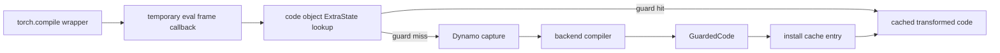

# A05 · Eager、Capture、Compile 与 Replay：`torch.compile` 的时间线和成本模型

> 卷别：A · 执行模型前置基础  
> 固定源码：PyTorch `e8f97c1a6ef8cbcdd0a946606bc1e924e4f07e52`  
> 前置：[[a04_dispatch_modes_proxy_tensor_and_fake_tensor_analysis]]  
> 后续：[[b01_torch_compile_api_and_first_call_lifecycle_analysis]]  
> 最后更新：2026-07-28

## 1. 最大的入门误区：把 wrapper 创建当成编译完成

```python
compiled_fn = torch.compile(fn)
```

这一步主要建立 backend wrapper 与 Dynamo optimize context。真实 frame、inputs、guards 和
specialization 通常要到：

```python
result = compiled_fn(x)
```

第一次执行时才出现。

**核心结论**：`torch.compile`是一套“按调用观察、按 guard 特化、按 cache 复用”的
多阶段生命周期。讨论性能前必须先说明测量的是 wrapper creation、capture、graph compile、
native compile/load、warmup 还是 steady-state replay。

## 2. 七个时间阶段

| 阶段 | 输入 | 主要产物 | 是否每次调用 |
|---|---|---|---|
| wrapper creation | Python callable + options | Dynamo context/backend wrapper | 否 |
| cache lookup | code object + frame state | 命中 entry 或 compile decision | 是 |
| capture | Python frame + inputs | FX region、guards、residual code | 每个新 specialization |
| graph compile | FX + fake inputs | AOT/Inductor transformed artifacts | 每个新 specialization/cache miss |
| native compile/load | generated source/binary | callable module/kernel | 取决于 artifact cache |
| warmup/record | callable + runtime state | runtime/cache/CUDAGraph 状态 | backend/模式相关 |
| replay | guards + callable + inputs | 用户结果 | 每次命中调用 |

“一次 compile”常同时包含 capture、AOT、Inductor 和 native compile，但这些阶段的 cache
边界不同，所以不能用一个总开关推断全部是否执行。

## 3. wrapper creation 做了什么

对默认 Inductor backend，公开入口最终构造 `_TorchCompileInductorWrapper`；其他 backend
构造 `_TorchCompileWrapper`，再把 wrapper 交给 `torch._dynamo.optimize()`
（`torch/__init__.py:3361-3378`）。

普通 backend wrapper：

- string backend 先走 registry lookup；
- 保存 backend callable、mode/options/dynamic；
- backend真正调用时接收 `model_`和 `inputs_`。

见 `torch/__init__.py:3057-3079` 和 `torch/__init__.py:3082-3091`。

Inductor wrapper 的 backend callback才导入并调用 `compile_fx`
（`torch/__init__.py:2984-2999`）。

所以 wrapper creation 既没有当前 frame，也没有 example inputs，无法完成需要输入
specialization 的后端编译。

## 4. 首次调用为何更贵

第一次遇到某个 code object/frame state 时，系统可能依次支付：

```text
eval-frame 与 cache lookup
→ Python bytecode symbolic execution
→ guards / transformed code
→ backend callback
→ AOTAutograd
→ Inductor FX passes / lowering / scheduling / codegen
→ native compile 或 module load
→ 第一次 callable 执行 / warmup
```

`compile_fx()`源码注释明确说明它为默认 Inductor backend 编排端到端 compilation，并在
内部调用 AOTAutograd，再通过 callback 进入实际 inner compile
（`torch/_inductor/compile_fx.py:2889-2907`）。

这解释了为什么只测第一次调用不能代表 compiled steady-state performance。

## 5. 后续调用并非“直接进 kernel”

命中 specialization 的调用仍可能执行：

1. eval-frame/run-only wrapper逻辑；
2. cache entry guards；
3. transformed Python code；
4. compiled callable wrapper；
5. input unpack/layout/alias checks；
6. allocation/reuse；
7. kernel/extern calls；
8. output assembly。

公开 API说明：compiled results按 code object缓存，guard failure会让同一 frame/code产生
多个结果（`torch/__init__.py:3157-3166`）。

因此 steady-state overhead 不为零。小模型/小 batch 中，guards、Python wrapper、
launch 和同步可能比 kernel 本身更显著。

## 6. Cache lookup 与 specialization

Dynamo code cache是 linked list。调用时依次运行每个 entry 的 guard manager；没有命中才
recompile并追加 entry
（`torch/_dynamo/cache_size.py:13-21`）。

若已有 \(C\) 个 entries：

- best case：第一项命中；
- worst case：运行 \(C\) 组 guards 后仍未命中；
- 新 specialization增加 capture/compile成本；
- 超过策略限制后可能 fallback eager。

cache hit 只说明当前层复用了 entry，不自动证明 AOT/FXGraph/code/kernel cache 的命中
状态；这些层有不同 key 与 value。

## 7. 参数化成本模型

对一种输入分布和调用总数 \(N\)，设：

- \(T_w\)：wrapper creation；
- \(T_{g,i}\)：第 \(i\) 次调用的 guard/cache lookup；
- \(T_{c,j}\)：第 \(j\) 个新 specialization 的 capture；
- \(T_{o,j}\)：该 specialization 的 graph optimization/AOT/Inductor；
- \(T_{n,j}\)：native compile/load；
- \(T_{u,j}\)：warmup/record；
- \(T_{r,i}\)：steady runtime wrapper + kernel；
- \(S\)：实际生成的 specializations 数。

总时间可写为：

\[
T_{\text{compiled}}
=T_w
+\sum_{i=1}^{N}(T_{g,i}+T_{r,i})
+\sum_{j=1}^{S}(T_{c,j}+T_{o,j}+T_{n,j}+T_{u,j})
\]

eager 总时间为：

\[
T_{\text{eager}}=\sum_{i=1}^{N}T_{e,i}
\]

只有：

\[
\sum(T_{e,i}-T_{g,i}-T_{r,i})
>
T_w+\sum(T_c+T_o+T_n+T_u)
\]

才在该调用分布和测量窗口内获得净收益。

这是机制推论 `[I]`，不是固定硬件的性能测量。

## 8. Break-even call count

若近似假设单一 specialization，eager 与 compiled steady-state 分别为
\(\bar T_e\)、\(\bar T_r+\bar T_g\)，一次性成本为 \(T_{\text{once}}\)，则：

\[
N_{\text{break-even}}
\approx
\frac{T_{\text{once}}}
{\bar T_e-(\bar T_r+\bar T_g)}
\]

前提是分母为正。若 compiled steady state不比 eager快，再多调用也无法摊薄一次性成本。
若 dynamic inputs不断触发 specialization，\(T_{\text{once}}\)也不再是一次。

## 9. `dynamic`为什么影响两端成本

公开入口定义三种策略：

- `dynamic=True`：尽量预先生成动态 kernel；
- `dynamic=False`：始终 specialization；
- `dynamic=None`：先静态，检测到变化后尝试更动态。

见 `torch/__init__.py:3175-3181`。

动态 graph可能：

- 减少 \(S\) 和重复 compile；
- 增加 guards/symbolic expressions；
- 限制 specialization-based optimization；
- 使 kernel处理更一般的 shape。

所以动态不是单向“更快”或“更慢”，而是在 compile multiplicity 与每个 graph/kernel
通用性之间交换成本。

## 10. mode 不是性能承诺

当前 public docstring把：

- `default`定义为性能与 overhead 平衡；
- `reduce-overhead`与 CUDA Graph、更多 workspace memory、输入 mutation限制关联；
- `max-autotune`与候选 profiling 和 GPU CUDAGraph默认策略关联。

见 `torch/__init__.py:3192-3210`。

这只是策略含义，不是对任意 workload 的加速保证。`reduce-overhead`不能消除 guard；
`max-autotune`会增加 compile-time measurement；CUDAGraph也要求 runtime invariants。

## 11. 四种常被混淆的“缓存命中”

| 命中层 | 跳过的工作 | 仍可能发生 |
|---|---|---|
| Dynamo code cache | frame重新捕获与 backend callback | guards、wrapper/runtime |
| AOTAutograd cache | functionalization/joint/partition/compile result | 外层 Dynamo 与 runtime |
| FXGraph/code cache | Inductor部分 lowering/codegen/native compile | AOT、load、runtime |
| kernel/autotune cache | candidate编译或重新测量 | wrapper、launch、其他 kernels |

完整 key/失效边界在 D04 展开。

## 12. 测量设计

端到端性能报告至少要分四组：

1. **eager baseline**：相同输入与同步边界；
2. **first call**：包括 capture/compile；
3. **warm cache process restart**：验证持久化 cache；
4. **steady-state**：排除 compile/warmup后测量调用。

还要记录：

- 输入 shape/dtype/device 分布；
- specializations/recompiles；
- graph breaks；
- backend/mode/options；
- PyTorch commit与环境；
- 同步位置；
- correctness结果。

只报告“第二次比第一次快”不能证明优于 eager，只能证明某些一次性工作被复用。

## 13. 生命周期状态机

```text
UNWRAPPED
  → WRAPPED
  → frame call
  → cache HIT ─────────────→ RUN COMPILED
  → cache MISS
      → CAPTURING
      → GRAPH COMPILING
      → NATIVE COMPILING / LOADING
      → CACHED
      → RUN COMPILED
  → guard miss/recompile limit/backend error
      → RECOMPILE / FALLBACK / RAISE
```

不同层的 failure 处置不同：graph break可产生 partial graph；guard miss可重编译；backend
failure可能在配置允许时 suppress/fallback；native runtime错误不能视为普通 cache miss。

## 14. 源码跟读：首次调用、cache miss 与后续 replay 的真实边界

前面的状态机给出了阶段；这一节把阶段落实到 owner。关键结论是：`torch.compile`
没有一个包办全程的“总 cache”。code-object guard cache、backend compile cache、
native artifact cache 和 runtime wrapper 各自跳过不同工作。



### 14.1 wrapper creation 与 first call 是两个事件

public API 在选择 backend wrapper 后调用 `torch._dynamo.optimize(...)(model)`，返回可调用
对象（`torch/__init__.py:3361-3378`）。真正执行这个对象时，wrapper 才在原函数调用周围
临时设置 eval-frame callback，并在退出时恢复旧 callback
（`torch/_dynamo/eval_frame.py:1480-1505`）。

因此，wrapper creation 的成本主要是配置与对象组装；捕获需要的 frame、locals 和 Tensor
输入只存在于 first call。把两段时间合成一个“compile latency”会让测量无法解释
lazy compilation。

### 14.2 code object 的 `ExtraState` 如何决定 hit 或 miss

C++ eval-frame 路径从 code object 取得或创建 `ExtraState`，并结合当前 frame strategy
决定是否尝试优化（`torch/csrc/dynamo/eval_frame_cpp.cpp:495-525`）。执行 guards 时会
暂时关闭 callback，避免 guard 自身再次被 Dynamo 捕获，然后查询 cache
（`torch/csrc/dynamo/eval_frame_cpp.cpp:526-555`）。

cache hit 直接取得 cached code 并进入自定义执行；miss 才继续 Python compiler callback
或对应错误路径（`torch/csrc/dynamo/eval_frame_cpp.cpp:589-607`）。miss 路径把 frame、
cache entry 与 frame state 传给 Python callback
（`torch/csrc/dynamo/eval_frame_cpp.cpp:614-634`）。这条边界说明：一次 guard lookup
发生在 Dynamo 再次符号解释 Python 之前，hit 能跳过的是 capture/compile，不是本次
运行的全部 wrapper 和 guard 工作。

### 14.3 cache entry 的选择为什么既看 backend 又跑 guards

`ExtraState::lookup_in_list` 会先核对 backend，再运行 entry 的 guard manager
（`torch/csrc/dynamo/extra_state.cpp:201-225`）。更外层 lookup 依次查询相应 backend 的
bucket 与 default bucket（`torch/csrc/dynamo/extra_state.cpp:292-316`）；命中后还会把
entry 移到链表前端并返回 cached code
（`torch/csrc/dynamo/extra_state.cpp:319-323`）。

因此，“同一 code object”只是 cache 搜索范围，不是充分命中条件。不同 backend 或不同
输入 specialization 可以对应多个 entries；每次调用的 guard cost 取决于实际检查过的
entries 和每组 guard 的内容。

### 14.4 miss 后 backend 在哪里接管

Dynamo 完成 capture 后，`OutputGraph` 在计时区域调用 compiler function，并检查 backend
返回值必须可调用；异常在这里被归类为 backend compiler failure
（`torch/_dynamo/output_graph.py:3217-3228`；
`torch/_dynamo/output_graph.py:3286-3300`）。若 backend 是 Inductor，
`compile_fx` 接收 FX GraphModule 与 example inputs，并负责继续编排 AOTAutograd/
Inductor 路径（`torch/_inductor/compile_fx.py:2889-2907`）。

这说明 backend handoff 是一个明确接口：Dynamo 提交一段图和样例输入，backend 可以再有
自己的 graph cache、code cache、native compiler 与 lazy backward compile。code-object
entry hit 只保证不再次走这次 Dynamo/backend handoff，不代表那些下层 cache 与 runtime
都不存在。

### 14.5 GuardedCode 如何返回 C 层 cache

ConvertFrame 完成后构造 guards，并把 transformed code 与 guard check 封装为
`GuardedCode`（`torch/_dynamo/convert_frame.py:1916-1938`）。C++ 路径收到 guarded code
后创建 cache entry，再执行 custom code
（`torch/csrc/dynamo/eval_frame_cpp.cpp:672-689`）；真正的 entry 创建会设置 ownership
links 并把对象接入 cache 结构（`torch/csrc/dynamo/extra_state.cpp:380-405`）。

至此 first-call miss 才闭环：

1. wrapper 安装 callback；
2. C 层按 code object 查 cache；
3. miss 进入 Dynamo capture；
4. backend 编译图；
5. transformed code 与 guards 返回为 GuardedCode；
6. C 层安装 entry 并执行；
7. 后续调用通过 guards 时复用 transformed code。

### 14.6 对性能测量的直接约束

测量至少要分别报告 wrapper creation、首次 miss、guarded hit 和 steady-state runtime。
若只测 first call，会把 capture、backend、native compile 和首次加载全部归给执行；
若只测第二次，又可能尚未越过 lazy backward、autotune 或 CUDAGraph warmup。cache
统计也必须标明层级，否则“hit”无法说明究竟跳过了哪段工作。

## 15. 复杂度的主导参数

- wrapper creation：与 option/backend setup相关；
- Dynamo lookup：与 cache entries和 guard expressions相关；
- capture：与解释 instructions、inline calls、operator数量相关；
- graph passes：与各阶段 Node/Edge/candidates相关；
- codegen/native compile：与 kernels、source size、toolchain相关；
- autotune：与 candidates × repetitions × measurement cost相关；
- replay：与 guards、wrapper operations、kernel/extern workload相关；
- dynamic workload：还要乘实际 specializations \(S\)。

“模型有 \(N\) 个 FX nodes，所以 compile是 \(O(N)\)”不足以描述整条路径。

## 16. 常见误解

| 误解 | 修正 |
|---|---|
| `torch.compile()`调用本身就是第一次编译 | 通常第一次 wrapped function执行才获得 frame/inputs |
| 第二次调用只执行 kernel | 仍有 guards、transformed code和 runtime wrapper |
| cache hit表示整条栈都没运行 | 每层 cache有独立 key和跳过范围 |
| dynamic一定减少总成本 | 它减少 specialization但可能增加通用 graph/kernel成本 |
| max-autotune一定提高端到端性能 | 候选测量增加 compile成本，收益依 workload和调用次数 |

## 17. 下一步

卷 A建立了五个坐标：

```text
Tensor/Storage
→ operator/dispatcher/autograd
→ Python frame/bytecode
→ Proxy/Fake abstract execution
→ multi-stage cost model
```

卷 B从 public `torch.compile()`入口开始，把这五类状态接成真实 Dynamo调用链。

## 配套 Demo

本页对应卷级入口 `labs/demo_a_execution_model.py` 的 `eager_compile_cost` 用例。默认以 CUDA 为验收设备：

```powershell
python -B wiki\02_engineering\01_ai_frameworks\19_torch_compile_end_to_end\labs\demo_a_execution_model.py `
  --case eager_compile_cost --device cuda `
  --output-dir wiki\02_engineering\01_ai_frameworks\19_torch_compile_end_to_end\labs\artifacts\volume_demos\a05
```

先用 `--list --json` 查看用例声明的能力要求。无 CUDA 的机器可把 `--device` 改为 `cpu` 探索设备无关机制；CUDA/Triton/多卡专属用例会返回 `BLOCKED`，且不会执行用例正文。不要把 `BLOCKED` 写成 `PASS`。

重点读取 `summary.json` 与 `eager_compile_cost/result.json`：`status` 区分 `PASS/BLOCKED/FAIL`，`environment` 固化运行环境，`observations` 保存本页机制的实测字段，`artifacts` 指向图代码、日志、trace 或进程证据。`PASS` 只表示该次运行中的断言通过，不外推到其他 PyTorch 版本、shape、dtype 或硬件。

## Related Pages

- [[00_torch_compile_end_to_end_index]]
- [[a04_dispatch_modes_proxy_tensor_and_fake_tensor_analysis]] — abstract execution
- [[b01_torch_compile_api_and_first_call_lifecycle_analysis]] — public API 与 first call
- [[b07_guards_cache_lookup_and_recompilation_analysis]] — cache/guard
- [[d04_compile_cache_hierarchy_keys_and_invalidation_analysis]] — 多层缓存
- [[e07_compile_latency_cache_and_steady_state_performance_analysis]] — 性能测量
- [[17_compile_cache/index]] — 编译缓存领域资料
