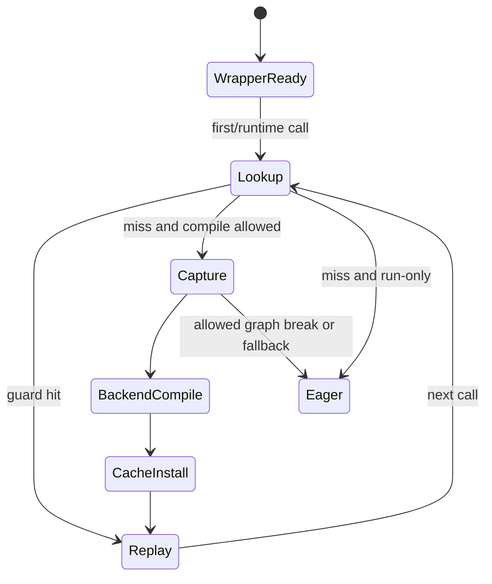

# B01 · `torch.compile` API 与第一次调用生命周期

> 卷别：B · TorchDynamo 捕获  
> 固定源码：PyTorch `e8f97c1a6ef8cbcdd0a946606bc1e924e4f07e52`  
> 前置：[[a05_eager_capture_compile_and_replay_cost_model_analysis]]  
> 后续：[[b02_backend_modes_options_stances_and_fullgraph_analysis]]  
> 最后更新：2026-07-28

## 1. 为什么公开入口必须很薄

`torch.compile`面对的是 Python callable，但真正的捕获对象只有调用发生后才存在：

- 当前 `code object`；
- 当前 frame 的 locals/globals/builtins；
- 当前 Tensor 的 shape、stride、dtype、device、alias 和 grad 状态；
- 当前 Python/dispatcher/global state；
- 能否匹配已有 compiled specialization 的 guard 结果。

因此 API 调用阶段只能完成参数归一化和 wrapper 组装，不能提前完成输入相关的捕获。

**核心结论**：`torch.compile(fn)`创建“以后怎样截获 frame”的策略；`compiled_fn(*args)`
第一次执行才让这项策略遇到真实 frame，并在 cache miss 时触发捕获和 backend compile。

## 2. 公开参数落到哪些控制平面

公开签名见 `torch/__init__.py:3134-3151`。参数并不处于同一层：

| 参数 | 主要控制层 | 作用 |
|---|---|---|
| `backend` | Dynamo/backend | FX graph交给谁 |
| `mode`、`options` | backend，默认是 Inductor | 后端策略和配置 patch |
| `fullgraph` | Dynamo | graph break是否变成错误 |
| `dynamic`、`dynamic_shapes` | Dynamo/ShapeEnv/backend | shape如何符号化和特化 |
| `disable` | API/Dynamo | wrapper退化为 no-op |
| `recompile_limit` | Dynamo code cache | specialization增长上限 |
| `isolate_recompiles` | code-object cache bucket | 同一 code object上的重编译计数隔离 |

`mode`和`options`互斥，未指定时 mode归一化为 `default`
（`torch/__init__.py:3323-3329`）。`dynamic`与`dynamic_shapes`也不能同时设置，
这一约束在 Dynamo context初始化时检查（`torch/_dynamo/eval_frame.py:890-902`）。

## 3. 从公开 API 到 Dynamo context

调用链为：

```text
torch.compile(fn, ...)
  → 选择默认 backend
  → 归一化 dynamic_shapes
  → 构造 _TorchCompileInductorWrapper 或 _TorchCompileWrapper
  → torch._dynamo.optimize(...)(fn)
  → 返回 compile_wrapper
```

默认 backend选择和 decorator mode处理见 `torch/__init__.py:3282-3307`；backend wrapper
选择及 `optimize`参数映射见 `torch/__init__.py:3361-3378`。

`torch._dynamo.optimize`再进入 `_optimize`。普通模式会：

1. 将 backend名字解析为 callable；
2. 读取可选 `backend_ctx_ctor`；
3. 用 `convert_frame.convert_frame(...)`创建 frame callback；
4. 用 `_optimize_catch_errors(...)`创建 `OptimizeContext`。

对应源码为 `torch/_dynamo/eval_frame.py:1826-1848` 和
`torch/_dynamo/eval_frame.py:1849-1862`。

## 4. wrapper 创建阶段实际拥有的对象


此时已有：

- 原 callable；
- backend callable和 backend config；
- eval-frame callback；
- dynamic/fullgraph/recompile策略；
- enter/exit hooks。

此时没有：

- 当前 FX graph；
- example inputs；
- 当前 guard manager；
- transformed code；
- Inductor kernel。

## 5. 第一次调用的真实控制流

`OptimizeContext`生成的 wrapper在调用前安装 eval-frame callback，调用原函数，然后恢复
TLS、dynamic-layer和 dispatcher状态。安装 callback、调用函数和 finally恢复逻辑见
`torch/_dynamo/eval_frame.py:1190-1216`、`torch/_dynamo/eval_frame.py:1217-1224` 与
`torch/_dynamo/eval_frame.py:1241-1265`、`torch/_dynamo/eval_frame.py:1266-1275`。

第一次遇到 code object 时：

```text
compile_wrapper(args)
  → 安装 callback
  → CPython准备执行目标 frame
  → Dynamo eval-frame shim截获
  → code-object ExtraState/cache lookup
  → cache miss
  → callback(frame, cache_entry, frame_state)
  → ConvertFrame
  → InstructionTranslator解释字节码并构造 FX + residual bytecode
  → OutputGraph调用 backend(gm, example_inputs)
  → 构造 guards + GuardedCode
  → 写入 code-object cache
  → 立即执行 transformed code
```

C++边界在 cache miss 后才调用 Python callback，并从返回值读取 execution strategy和
`guarded_code`（`torch/csrc/dynamo/eval_frame_cpp.cpp:614-638`）。非空
`guarded_code`被写入 cache后立即执行（`torch/csrc/dynamo/eval_frame_cpp.cpp:672-691`）。

## 6. 命中路径不是重新 capture

后续相同 code object调用先做 cache lookup。若某个 entry的 backend和 guards均匹配，
直接取出 transformed code并执行；不会再次调用 frame conversion callback。命中与 miss
分支见 `torch/csrc/dynamo/eval_frame_cpp.cpp:589-611`。

所以必须区分：

- wrapper复用：仍可能 cache miss；
- code cache hit：跳过 Dynamo capture和 backend callback；
- backend artifact cache hit：即便 Dynamo miss，后端也可能复用更深层产物；
- steady-state kernel replay：仍包含 guard与 wrapper成本。

## 7. `GraphModule`和 transformed bytecode为什么同时存在

Dynamo不是简单把整个 Python函数替换成一个 FX graph。一次捕获的结果通常包含：

1. 可张量化区域的 `fx.GraphModule`；
2. 调用 compiled callable的改写字节码；
3. 图外 Python语义、局部变量恢复和副作用回放；
4. graph break后的 resume函数；
5. 保护这一版本的 guards。

这就是“编译 Python frame”而不是“只追踪 Tensor算子列表”。详情见
[[b06_output_graph_side_effects_and_graph_emission_analysis]]。

## 8. 生命周期状态机



`fullgraph=True`改变“捕获失败能否切图/回退”，不改变“先 lookup、miss才捕获”的基本结构。

## 9. 复杂度

令：

- \(B\)：原函数字节码指令数；
- \(G\)：捕获出的 FX node数；
- \(C\)：该 cache bucket中的 entries数；
- \(Q_i\)：第 \(i\) 个 entry guard树的检查成本；
- \(K(G)\)：backend编译成本。

则：

- wrapper creation通常为 \(O(1)\)，不计配置字典复制；
- lookup worst case为 \(O(\sum_{i=1}^{C} Q_i)\)；
- Dynamo符号执行约为 \(O(B)\)，但 restart、内联和数据结构操作会放大常数；
- FX/bytecode emission约为 \(O(G+B_{\text{emitted}})\)；
- 首次 miss总成本由 \(K(G)\)主导时远大于 lookup；
- hit路径不再支付 \(O(B)+K(G)\)，但仍支付 guard与 runtime wrapper成本。

## 10. 常见误解

- **“调用 `torch.compile`就已经编译。”** 实际上通常只是创建 wrapper。
- **“第一次调用只跑编译，不执行模型。”** 编译成功后仍会执行生成代码并返回本次结果。
- **“命中 cache就是直接调用一个 kernel。”** transformed code可能调用多个 compiled
  regions、Python residual和runtime wrapper。
- **“同一个函数只有一个 compiled graph。”** cache按 guards保存多个 specialization。
- **“backend接收原 Python函数。”** Dynamo backend契约的核心输入是
  `GraphModule + example_inputs`。

## 11. 源码阅读顺序

1. `torch/__init__.py:3282-3307`：参数和 decorator形态；
2. `torch/__init__.py:3361-3378`：backend wrapper到 Dynamo；
3. `torch/_dynamo/eval_frame.py:1742-1765`、`torch/_dynamo/eval_frame.py:1766-1773`：
   Dynamo主入口契约；
4. `torch/_dynamo/eval_frame.py:1826-1848`：callback组装；
5. `torch/csrc/dynamo/eval_frame_cpp.cpp:536-562`：lookup/run-only；
6. `torch/csrc/dynamo/eval_frame_cpp.cpp:589-612`、
   `torch/csrc/dynamo/eval_frame_cpp.cpp:614-625`：hit/miss/callback；
7. `torch/csrc/dynamo/eval_frame_cpp.cpp:672-691`：cache安装和执行。

## Related Pages

- [[a05_eager_capture_compile_and_replay_cost_model_analysis]]
- [[b02_backend_modes_options_stances_and_fullgraph_analysis]]
- [[b03_eval_frame_callback_and_code_cache_analysis]]
- [[b06_output_graph_side_effects_and_graph_emission_analysis]]
- [[00_torch_compile_end_to_end_index]]
