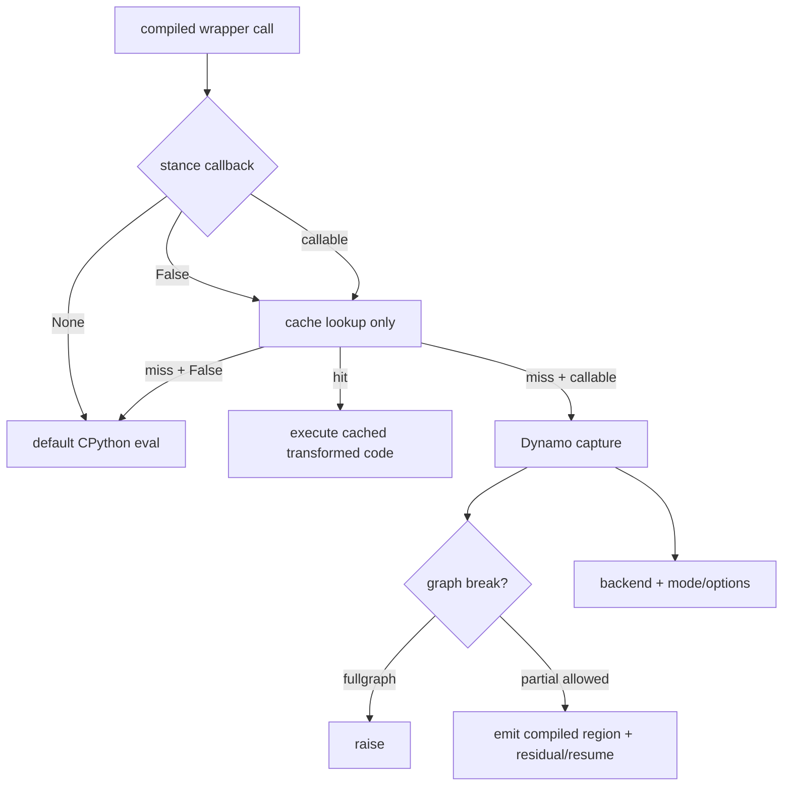

# B02 · Backend、Mode、Options、Stance 与 Fullgraph：五个正交控制面

> 卷别：B · TorchDynamo 捕获  
> 固定源码：PyTorch `e8f97c1a6ef8cbcdd0a946606bc1e924e4f07e52`  
> 前置：[[b01_torch_compile_api_and_first_call_lifecycle_analysis]]  
> 后续：[[b03_eval_frame_callback_and_code_cache_analysis]]  
> 最后更新：2026-07-28

## 1. 为什么这些参数经常被混为一谈

它们都出现在“编译”附近，却作用在不同时间和组件：

- backend决定图交给谁；
- mode是后端预设；
- options是后端细粒度配置；
- stance改变当前线程如何使用已有编译和是否允许新编译；
- fullgraph改变 Dynamo遇到 graph break时的合法行为。

**核心结论**：它们不是五档优化强度，而是五个近似正交的控制平面。判断一个行为时，
先问“这个参数由哪层消费、在 lookup/capture/backend/runtime哪个时刻生效”。

## 2. Backend：定义“图的消费者”

普通 backend可以是 registry名字或 callable。Dynamo的契约是：

```python
compiled_callable = backend(gm, example_inputs)
```

`_optimize`的 docstring明确要求 backend接收 `torch.fx.GraphModule`和 example inputs并返回
可调用对象（`torch/_dynamo/eval_frame.py:1759-1772`）。

字符串 backend在 registry中惰性展开，callable则直接保留
（`torch/_dynamo/backends/registry.py:124-142`）。

因此 `backend="eager"`仍可执行 Dynamo捕获；它不是“完全关闭 Dynamo”，而是使用一个不做
native优化的图消费者。

## 3. Mode：后端维护的配置预设

默认 Inductor wrapper把 mode展开成配置项，再叠加用户 options
（`torch/__init__.py:2951-2975`、`torch/__init__.py:2976-2982`）。当前公开语义包括：

| mode | 设计目标 | 代价/边界 |
|---|---|---|
| `default` | 编译开销与性能平衡 | 不承诺最大性能 |
| `reduce-overhead` | 主要借助 CUDA Graph降低 Python/launch overhead | 更多常驻内存；仅适用满足 capture条件的图 |
| `max-autotune` | profile候选并选择实现 | 增加编译时间，GPU默认关联 CUDA Graph |
| `max-autotune-no-cudagraphs` | autotune但不启用 CUDA Graph | 保留普通 launch路径 |

公开说明见 `torch/__init__.py:3192-3210`。mode只是 config bundle，不改变 Dynamo的
`GraphModule + example_inputs → callable`基本接口。

## 4. Options：后端配置 patch，不是通用 Dynamo开关

Inductor wrapper检查配置名和类型，并将有效项存入自己的 `config`
（`torch/__init__.py:2957-2982`）；调用时与 per-graph patches合并后传给
`compile_fx`（`torch/__init__.py:2984-2999`）。

普通自定义 backend wrapper则把非默认 mode和 options作为 kwargs传给 backend
（`torch/__init__.py:3057-3080` 与 `torch/__init__.py:3090-3095`）。

这带来一个重要边界：

- `options`键的语义由 backend定义；
- Inductor options不自动适用于另一个 backend；
- 自定义 backend若不接受 `mode=`/`options=`，调用方就不应传这些参数；
- `guard_filter_fn`虽然从 public options提取，但它是明确标注 unsafe的特殊入口。

## 5. Stance：改变“当前是否编译/复用”的运行策略

`torch.compiler.set_stance`是动态作用域策略，而不是 graph优化 mode。公开 stance包括
`default`、`force_eager`、`eager_on_recompile`、`fail_on_recompile`、
`eager_then_compile`和`aot_eager_then_compile`
（`torch/compiler/__init__.py:426-441`）。

Dynamo在每次 wrapper执行前把原 callback映射为当前 stance：

| stance | callback行为 |
|---|---|
| `default` | 原 callback，必要时 force backend |
| `force_eager` | `None`，完全绕过 Dynamo |
| `eager_on_recompile` | `False`，只运行可命中的 cache，miss则 eager |
| `fail_on_recompile` | miss callback改为抛错 |
| `eager_then_compile` | 延迟首次编译 |
| `aot_eager_then_compile` | 首次走 AOT eager，再延迟编译 |

分支实现在 `torch/_dynamo/eval_frame.py:279-300`。`None`与`False`绝不能混淆：
前者关闭 Dynamo；后者仍查 cache但禁止新编译。

## 6. Fullgraph：graph break策略，不是“整个训练系统一个图”

`fullgraph=True`映射为 Dynamo的 `nopython=True`
（`torch/__init__.py:3369-3377`），后者要求 graph break成为错误
（`torch/_dynamo/eval_frame.py:1771-1778`）。

它保证的是：**对这个被捕获的 Python frame/compiled region，不允许靠 graph break产生
多个部分图继续运行。**

它不保证：

- forward和backward合并为一张图；
- 所有被调用 Python frame都内联为同一 FX graph；
- backend不再分区或生成多个 kernel；
- 没有 runtime wrapper、guards或外部库调用；
- 数据相关控制流自动变成可表达的图控制流。

## 7. `error_on_graph_break`与 fullgraph的差别

源码特别说明：`error_on_graph_break`可以在局部作用域改变 break行为，但不像
`nopython=True`那样保证单一 whole-program graph；当 `nopython=True`时前者不生效
（`torch/_dynamo/eval_frame.py:1772-1778`）。

设计上二者分开，是为了同时支持：

- API级强契约：这次 compile必须完整捕获；
- 调试级局部策略：某个作用域内把 break升级为错误；
- 常规部分捕获：可捕获区编译，不可捕获区继续 Python。

## 8. 五个控制面的组合示例

```text
backend="inductor"
mode="max-autotune-no-cudagraphs"
fullgraph=False
stance="eager_on_recompile"
dynamic=None
```

含义是：

1. 已有匹配 entry时运行 Inductor产物；
2. cache miss时不新编译，而是 eager；
3. 若此前允许编译，Dynamo可产生部分图；
4. Inductor进行 autotune但不使用 CUDA Graph；
5. 自动动态策略只有在真正发生新捕获时才有机会生效。

任何一项都不能从另一项推导出来。

## 9. 状态优先级



## 10. 安全边界

- `skip_guard_eval_unsafe`不是普通性能选项。公开文档明确说明错误假设可能静默地产生错误
  结果（`torch/compiler/__init__.py:444-457`）。
- `guard_filter_fn`会删除保护 compiled artifact适用域的条件，public doc同样标为 unsafe
  （`torch/__init__.py:3228-3235`）。
- `force_eager`适合总开关式降级；`eager_on_recompile`适合保留已预热 artifacts但禁止
  新 specialization。
- fullgraph应当用来建立捕获契约或定位 break，而不是默认当作性能开关。

## 11. 复杂度与性能影响

- backend/mode/options在 wrapper构造时的配置处理大体随 options数量 \(O(P)\)；
- stance判断是每次调用的常数级分支，但 `fail_on_recompile` miss时会收集 guard失败原因；
- fullgraph本身不降低 capture复杂度；它只改变失败路径；
- max-autotune可能把 backend编译成本从一次 codegen放大为多个候选的编译和测量；
- reduce-overhead可能增加常驻内存和 warmup/record成本，以换取 replay overhead下降。

## 12. 常见误解

- **“mode就是 backend。”** mode是 backend内部预设。
- **“eager backend等于没走 Dynamo。”** 它通常仍接收 Dynamo FX graph。
- **“force_eager和eager_on_recompile一样。”** 前者不查 Dynamo cache；后者可复用 cache。
- **“fullgraph会生成一个 kernel。”** graph数量和 kernel数量是不同层的概念。
- **“删除 guards只影响性能。”** 它可能扩大错误 artifact的适用域并损害正确性。

## Related Pages

- [[00_torch_compile_end_to_end_index]]
- [[b01_torch_compile_api_and_first_call_lifecycle_analysis]]
- [[b03_eval_frame_callback_and_code_cache_analysis]]
- [[b07_guards_cache_lookup_and_recompilation_analysis]]
- [[d06_cudagraph_trees_warmup_record_and_replay_analysis]]
- [[e09_production_rollout_fallback_and_monitoring_analysis]]
