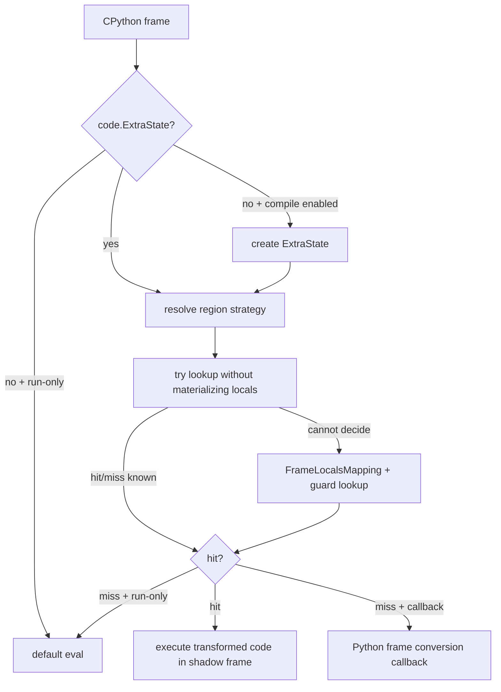

# B03 · Eval-Frame Callback 与 Code-Object Cache

> 卷别：B · TorchDynamo 捕获  
> 固定源码：PyTorch `e8f97c1a6ef8cbcdd0a946606bc1e924e4f07e52`  
> 前置：[[b02_backend_modes_options_stances_and_fullgraph_analysis]]  
> 后续：[[b04_instruction_translator_and_bytecode_state_machine_analysis]]  
> 最后更新：2026-07-28

## 1. 为什么 Dynamo截获 frame，而不是 monkey-patch Tensor算子

只截获算子调用无法完整看见：

- Python控制流和局部变量；
- 函数调用、异常、上下文管理器；
- Tensor参与的 Python条件；
- 图外副作用和 graph break后的继续执行；
- 怎样把 compiled callable嵌回原函数。

CPython eval-frame hook给 Dynamo一个更高的入口：在 code object即将被解释执行时，选择执行
原 code还是受 guards保护的 transformed code。

**核心结论**：Dynamo的一级 cache value不是“FX graph”，而是可以在 CPython中执行的
改写 code object；FX graph是这个改写 code调用的后端产物之一。

## 2. Eval-frame shim的三态协议

C入口定义三种 callback状态：

- `None`：关闭 Dynamo，交给默认解释器；
- `False`：run-only，允许查已有 cache，但不新编译；
- Python callable：cache miss时允许调用 Dynamo frame converter。

协议写在 `torch/csrc/dynamo/eval_frame.c:616-638`，shim分发也明确列出三态
（`torch/csrc/dynamo/eval_frame.c:518-533`）。

这解释了为什么 stance能在不重建函数的情况下改变行为：它改变 TLS中的 callback，而
code-object cache仍然存在。

## 3. Cache为什么挂在 code object上

源码结构说明：

```text
PyCodeObject extra scratch
└── ExtraState
    ├── cache_entry_map[isolate_recompiles_id]
    │   └── list<CacheEntry>
    │       ├── guard_manager
    │       ├── transformed code
    │       ├── compile_id
    │       └── backend
    ├── frame_state
    └── execution strategy
```

`CacheEntry`同时保存 guard manager和改写 code
（`torch/csrc/dynamo/cache_entry.h:15-32`、`torch/csrc/dynamo/cache_entry.h:44-64`）。
`ExtraState`保存分 bucket的 entry lists、跨 frame共享的 `frame_state`和 execution
strategy（`torch/csrc/dynamo/extra_state.h:59-77`）。

挂在 code object而不是函数对象上的原因：

- CPython真正执行的是 code；
- 多个 function对象可能共享同一 code；
- 每次调用都有不同 frame，但 code稳定；
- automatic dynamic需要跨调用共享 frame-state观察；
- transformed code必须按当前 frame的 guards选择。

## 4. 一次 frame进入时的查找流程



ExtraState初始化与 region strategy解析见
`torch/csrc/dynamo/eval_frame_cpp.cpp:495-524`。fast path和需要 locals的正常 lookup见
`torch/csrc/dynamo/eval_frame_cpp.cpp:536-556`。

## 5. 为什么先尝试不物化 frame locals

构造完整 locals映射和运行 guard树都有成本。若 entry无 guards，或结构足以判定没有可用
entry，就可以绕过 locals物化。`try_lookup_without_guard_eval`的契约明确是：

- 返回 `true`：已能确定 hit或miss；
- 返回 `false`：必须进入普通 `lookup`并执行 guards。

见 `torch/csrc/dynamo/extra_state.h:204-213`。

这是一条稳态优化路径，但不能普遍跳过 guards；存在有意义的 guards时仍必须读取 frame
状态并检查。

## 6. Cache查找实际是顺序 guard dispatch

每个 bucket当前是 `std::list<CacheEntry>`。查找依次：

1. 比较 backend；
2. 对有效候选运行 root或diff guard manager；
3. 第一个通过者命中；
4. guard异常则传播，而不是视为普通 miss。

核心循环见 `torch/csrc/dynamo/extra_state.cpp:203-225` 与
`torch/csrc/dynamo/extra_state.cpp:226-248`。

启用 LRU时，命中 entry可移到表头；新 entry也可插入表头，否则追加到末尾
（`torch/csrc/dynamo/extra_state.cpp:380-405`）。

所以“逆图序匹配”的说法不适用于这里。Dynamo code cache lookup遍历的是
**specialization entries**，不是 FX graph nodes。

## 7. Isolated recompiles不是复制 code object

`isolate_recompiles=True`为同一 code object分配独立 bucket id。查找时先查自己的 bucket，
再查默认 `-1` bucket；新 entry写入自己的 bucket
（`torch/csrc/dynamo/extra_state.cpp:292-317`）。

这样实现：

- 复用默认 compile产生的兼容 entry；
- 单独统计这个 compile wrapper的重编译；
- 某一 isolated region达到上限时只把自己设成 RUN_ONLY；
- 不需要复制 Python code object。

它隔离的是 cache namespace/limit策略，不隔离所有深层 backend caches。

## 8. Cache miss如何回到 Python

miss且允许编译时，C++侧准备：

- `FrameLocalsMapping`；
- 当前 bucket的 `CacheEntry*`；
- 跨调用共享 `FrameState*`；
- callback。

随后调用 Python frame converter并读取 `frame_exec_strategy`、`apply_to_code`和
`guarded_code`（`torch/csrc/dynamo/eval_frame_cpp.cpp:614-638`）。

有 `guarded_code`时：

1. 创建 `CacheEntry`；
2. 建立 guard manager对 entry/ExtraState的反向引用；
3. 取出 transformed code；
4. 在本次调用立即执行。

创建逻辑见 `torch/csrc/dynamo/extra_state.cpp:380-405`，执行分支见
`torch/csrc/dynamo/eval_frame_cpp.cpp:672-691`。

## 9. 为什么要创建 shadow frame

transformed code可能增加临时 locals，原 frame的 `localsplus`布局不一定适配。Dynamo因此：

- 基于新 code创建 function/shadow frame；
- 从旧 frame复制 arguments、cell/free variables；
- 在 shadow frame执行 transformed code。

设计说明见 `torch/csrc/dynamo/eval_frame.c:367-396`。它同时约束 bytecode transformer：
参数、cell和free variable的布局必须满足复制假设；灵活增加的主要是新 locals。

## 10. 正确性不变量

- cache entry必须同时绑定 backend和 guards，不能只按 code object命中；
- transformed code只能在 guard manager确认适用时执行；
- callback执行期间要避免递归捕获 Dynamo自身 guard/compile逻辑；
- code对象销毁时其 ExtraState和 entries必须跟随清理；
- guard引用对象死亡时可能使 entry失效；
- shadow frame要保持原参数、closure和异常语义。

## 11. 复杂度

设 bucket有 \(C\) 个 entries，第 \(i\) 个 entry guard成本为 \(Q_i\)：

- no-entry fast miss：近似 \(O(1)\)；
- 第一个无 guard entry命中：近似 \(O(1)\)；
- 正常命中第 \(k\) 项：\(O(\sum_{i=1}^{k} Q_i)\)；
- 全 miss：\(O(\sum_{i=1}^{C} Q_i)\)；
- 新 entry插入：list层面 \(O(1)\)；
- LRU hit移动：已有 iterator下 \(O(1)\)；
- cache空间：\(O(C)\)，每项另持 guard tree和 transformed code。

guard内部不是单一常数检查；Tensor metadata、Python对象、字典和全局状态会形成不同访问树。

## 12. 常见误解

- **“cache存在于 GraphModule上。”** Dynamo一级 cache挂在 Python code object的额外状态上。
- **“每个函数对象有独立 cache。”** 共享 code object的 function可共享 code cache。
- **“正向图与反向图通过这个 cache连接。”** 这是 Python frame specialization cache，
  与 AOTAutograd fw/bw图的 saved-value接口不是同一机制。
- **“run-only等于完全关闭 Dynamo。”** run-only仍查 cache并可执行 transformed code。
- **“cache lookup遍历 FX nodes。”** 它遍历 CacheEntry并运行 guards。

## Related Pages

- [[00_torch_compile_end_to_end_index]]
- [[b01_torch_compile_api_and_first_call_lifecycle_analysis]]
- [[b04_instruction_translator_and_bytecode_state_machine_analysis]]
- [[b07_guards_cache_lookup_and_recompilation_analysis]]
- [[b09_dynamic_shapes_generalization_and_fallback_analysis]]
- [[d04_compile_cache_hierarchy_keys_and_invalidation_analysis]]
